# HLD V2 — Décarbonation applicative, GreenOps et industrialisation DevSecOps
## Département IT Flux — Paiements bancaires

**Périmètre :** virements SCT / SCT Inst, prélèvements SDD, services connexes de contrôle, compensation, fraude, batchs et observabilité  
**Horizon :** 2026–2030  
**Nature du document :** High Level Design enrichi — V2  
**Objectif :** définir une architecture cible permettant d’atteindre les objectifs de réduction carbone tout en renforçant performance, résilience, qualité logicielle et gouvernance.

---

# 1. Résumé exécutif

Ce HLD V2 décrit une architecture cible pour le domaine **IT Flux** dans un contexte de paiements bancaires critiques. Le document vise à transformer une démarche de décarbonation applicative en **architecture de transformation mesurable, gouvernée et industrialisable**.

L’objectif n’est pas uniquement de réduire des émissions GES, mais de construire un système de paiement :

- plus sobre ;
- plus stable ;
- plus mesurable ;
- plus industrialisé ;
- plus robuste face aux contraintes réglementaires ;
- mieux aligné avec les enjeux DevSecOps et SRE.

La trajectoire cible articule quatre dimensions :

1. **GreenOps** : mesure, baseline, intensité carbone, réduction des gaspillages ;
2. **SRE / performance** : latence, disponibilité, retries, saturation, capacité ;
3. **DevSecOps** : SonarQube, Checkmarx, quality gates, standardisation CI/CD ;
4. **Architecture décisionnelle** : arbitrage par modèles mathématiques et recherche opérationnelle.

La logique globale est la suivante :

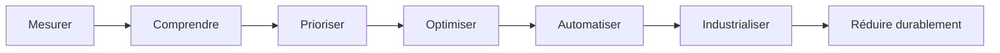

---

# 2. Contexte métier et périmètre

## 2.1 Domaine IT Flux

Le domaine IT Flux couvre des chaînes critiques de paiement :

- **SCT** — SEPA Credit Transfer ;
- **SCT Inst** — virement instantané ;
- **SDD** — SEPA Direct Debit ;
- contrôles de conformité ;
- contrôles fraude ;
- traitements batch ;
- rapprochements ;
- échanges avec chambres de compensation ;
- flux MFT et inter-applicatifs.

## 2.2 Contraintes principales

| Contrainte | Description | Impact architecture |
|---|---|---|
| Temps réel | SCT Inst, VoP, contrôles synchrones | faible latence, retries maîtrisés |
| Volumétrie | pics journaliers, batchs, campagnes | capacity planning, scaling |
| Résilience | continuité de service, DORA | redondance, supervision, PRA |
| Legacy | progiciels, DB historiques, batchs anciens | trajectoire progressive |
| Sécurité | paiements, données sensibles, conformité | DevSecOps, contrôle accès, audit |
| Sobriété | objectifs -6 % / -20 % | GreenOps, right-sizing, optimisation |

## 2.3 Objectifs chiffrés

| Horizon | Objectif | Nature |
|---|---:|---|
| Fin 2026 | -6 % GES | quick wins + pilotage |
| 2030 | -20 % GES | transformation structurelle |

---

# 3. Problématique d’architecture

Le sujet ne doit pas être traité comme un simple programme Green IT. C’est une problématique d’**optimisation d’un système critique sous contraintes**.

## 3.1 Fonction d’objectif globale

Le domaine IT Flux cherche à réduire :

- carbone ;
- énergie ;
- coût de run ;
- gaspillage technique ;
- dette opérationnelle.

Tout en maintenant :

- SLA ;
- disponibilité ;
- sécurité ;
- conformité ;
- capacité à absorber les pics ;
- traçabilité métier.

## 3.2 Vision architecte

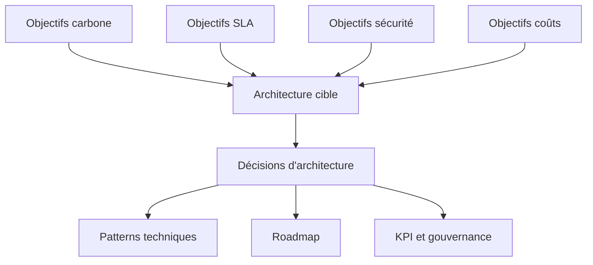

---

# 4. Drivers d’architecture

## 4.1 Drivers métier

- continuité des paiements ;
- rapidité de traitement ;
- réduction des rejets et reprises ;
- maîtrise des pics ;
- meilleure qualité de service.

## 4.2 Drivers techniques

- réduction des ressources idle ;
- optimisation DB / batchs / logs ;
- réduction du polling ;
- meilleur pilotage des environnements non-prod ;
- meilleure observabilité ;
- standardisation des pipelines.

## 4.3 Drivers réglementaires

- DORA ;
- ESG ;
- reporting durabilité ;
- sécurité applicative ;
- résilience opérationnelle.

## 4.4 Drivers organisationnels

- coordination squads / architecture / production / infogérant ;
- nécessité d’un langage commun entre IT, métier et direction ;
- besoin d’arbitrages documentés ;
- besoin d’indicateurs fiables.

---

# 5. Principes d’architecture cible

| ID | Principe | Description |
|---|---|---|
| P1 | Measure First | Toute optimisation doit s’appuyer sur une baseline |
| P2 | No SLA Regression | aucune baisse de service sur flux critiques |
| P3 | Carbon as KPI | le carbone devient un KPI de run |
| P4 | No-Regret First | priorité aux actions à faible risque |
| P5 | Policy-Driven | règles standardisées pour logs, retries, ressources |
| P6 | Shift Left Quality | qualité et sécurité dès le pipeline |
| P7 | Event-Driven Where Useful | réduire polling et couplage inutile |
| P8 | Optimize Under Constraints | arbitrer via coût, carbone, SLA, risque |
| P9 | Progressive Modernization | moderniser par vagues sans big bang |
| P10 | Evidence-Based Governance | reporting fondé sur métriques vérifiables |

---

# 6. Architecture actuelle — hypothèse de référence

## 6.1 Vue logique probable

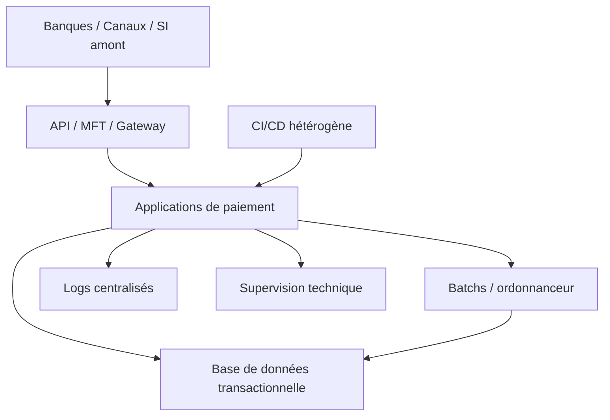

## 6.2 Limites potentielles

| Zone | Limite | Conséquence carbone / run |
|---|---|---|
| Environnements | non-prod allumés en continu | ressources idle |
| Ressources | surallocation CPU/RAM | coût + énergie |
| Logs | verbosité excessive | stockage + indexation |
| Retries | politiques non homogènes | CPU + latence + erreurs |
| Batchs | redondances / mauvais horaires | pics et gaspillage |
| DB | requêtes coûteuses / données chaudes | CPU + I/O |
| CI/CD | adoption partielle | dette technique |
| Mesure | baseline incomplète | pilotage fragile |

---

# 7. Architecture cible — vue d’ensemble

## 7.1 Cible logique

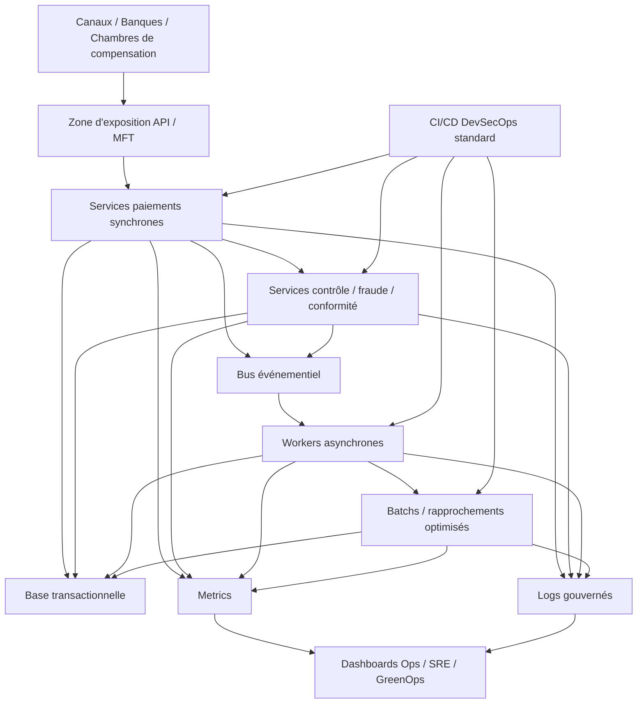

## 7.2 Intentions d’architecture

| Intention | Traduction technique |
|---|---|
| Réduire les ressources inutiles | right-sizing, extinction non-prod, autoscaling |
| Réduire les traitements inutiles | suppression batchs redondants, réduction polling |
| Réduire les erreurs coûteuses | retry policy, timeout policy, circuit breaker |
| Réduire l’observabilité excessive | sampling, rétention, log policy |
| Industrialiser la qualité | SonarQube, Checkmarx, quality gates |
| Piloter carbone et performance ensemble | dashboards convergents |

---

# 8. Architecture GreenOps cible

## 8.1 Objectif

Créer une capacité de pilotage continue :

- émissions par application ;
- émissions par environnement ;
- intensité par transaction ;
- consommation par batch ;
- évolution mensuelle ;
- gains par action.

## 8.2 Chaîne de mesure cible

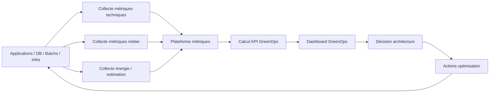

## 8.3 Données minimales à collecter

| Catégorie | Données |
|---|---|
| Ressources | CPU, RAM, stockage, réseau |
| Runtime | latence, saturation, throughput |
| Qualité | erreurs, retries, timeouts |
| Métier | nombre de transactions, rejets, STP |
| Logs | volume, taux d’erreurs, rétention |
| CI/CD | dette, vulnérabilités, coverage |
| Carbone | énergie estimée, facteur carbone, gCO2e |

## 8.4 KPI GreenOps prioritaires

| KPI | Usage |
|---|---|
| gCO2e / transaction | indicateur métier principal |
| kWh / 1000 transactions | efficacité énergétique |
| ressources idle | right-sizing |
| volume logs / transaction | sobriété observabilité |
| taux retries/timeouts | gaspillage technique |
| kgCO2e / application / mois | pilotage programme |

---

# 9. Architecture SRE / performance

## 9.1 Objectifs

- maintenir la latence des flux temps réel ;
- réduire les saturations ;
- éviter les retries excessifs ;
- améliorer le dimensionnement ;
- relier performance et carbone.

## 9.2 SLI / SLO proposés

| SLI | Exemple d’usage |
|---|---|
| Latence P95 / P99 | SCT Inst, API critique |
| Taux erreur | stabilité service |
| Taux retry | gaspillage technique |
| Saturation CPU/RAM | capacity planning |
| Queue depth | workers / Kafka / batchs |
| Temps batch | planification et énergie |

## 9.3 Modèle de saturation

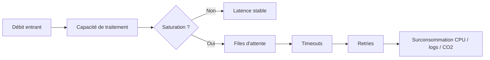

---

# 10. Architecture DevSecOps cible

## 10.1 Chaîne standard cible

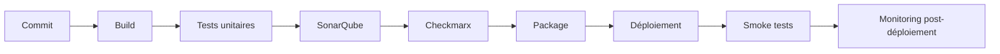

## 10.2 Niveaux de maturité

| Niveau | Description |
|---|---|
| 0 | pas de pipeline standard |
| 1 | build automatisé |
| 2 | tests + Sonar visible |
| 3 | Checkmarx visible |
| 4 | quality gates gouvernés |
| 5 | remédiation pilotée et KPI mensuels |

## 10.3 Règles d’architecture CI/CD

- chaque dépôt actif doit avoir un pipeline ;
- chaque pipeline doit produire des indicateurs ;
- SonarQube et Checkmarx doivent être intégrés progressivement ;
- les exceptions doivent être documentées ;
- les quality gates doivent être introduits par vague.

---

# 11. Patterns d’architecture cible

## 11.1 Pattern right-sizing

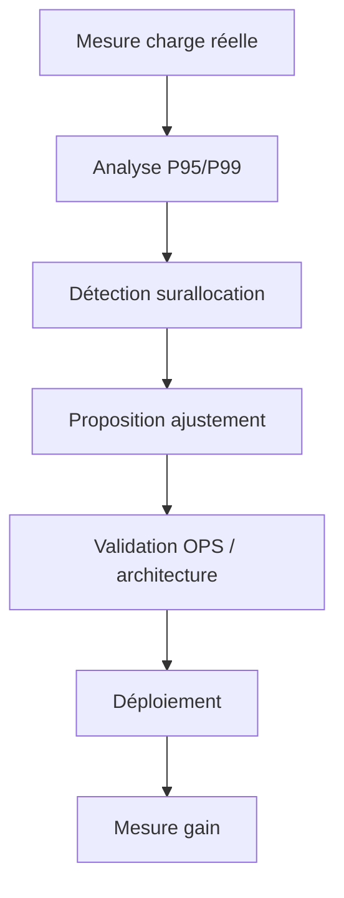

## 11.2 Pattern retry-aware

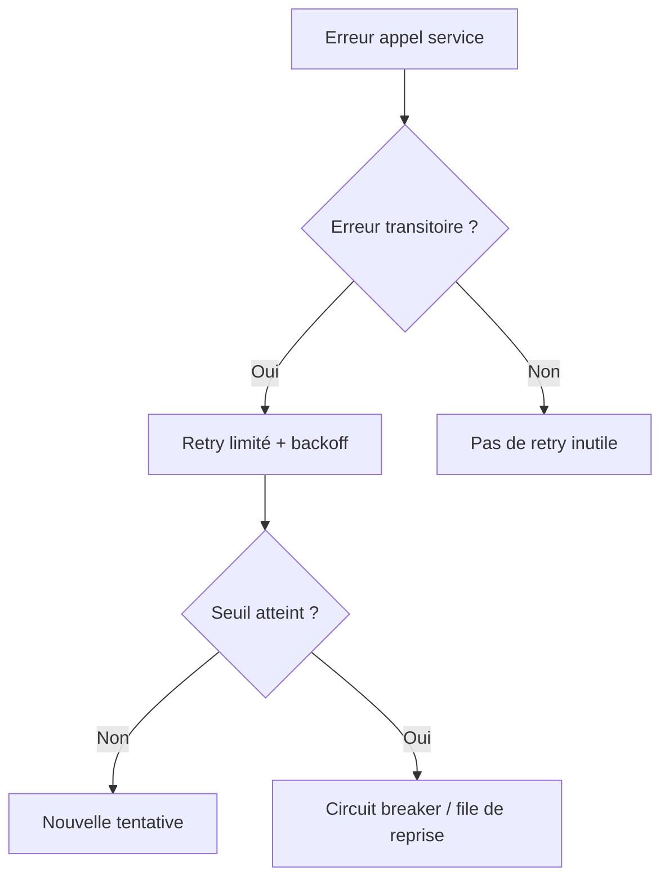

## 11.3 Pattern log sobriety

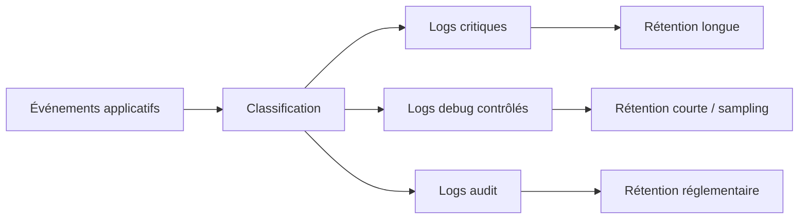

## 11.4 Pattern event-driven

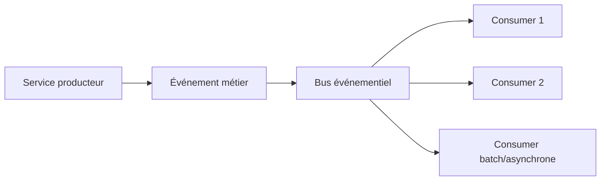

---

# 12. Modèles mathématiques et recherche opérationnelle

## 12.1 Rôle dans l’architecture

Les modèles ne sont pas théoriques. Ils servent à prendre de meilleures décisions :

- dimensionner ;
- prioriser ;
- planifier ;
- arbitrer ;
- démontrer les gains.

## 12.2 Référentiel des modèles

| Modèle | Usage architecture | Décision supportée |
|---|---|---|
| SCI | mesure carbone | baseline, KPI |
| Files d’attente | latence / saturation | nombre de pods, workers |
| Right-sizing | allocation ressources | réduction CPU/RAM |
| PLNE | choix discret | éteindre/allumer, nombre instances |
| Scheduling | batchs | choix fenêtre d’exécution |
| Knapsack | priorisation | choix quick wins |
| Multi-objectifs | arbitrage | carbone vs SLA vs coût |
| Pareto | ciblage | top composants émetteurs |
| Sensibilité | simulation gains | scénarios 2026/2030 |

## 12.3 Exemple d’utilisation dans le cycle décisionnel

---

# 13. Décisions d’architecture majeures — ADR synthétiques

## ADR-01 — Baseline GreenOps obligatoire

**Décision :** établir une baseline initiale avant généralisation des actions.  
**Raison :** éviter les gains non démontrables.  
**Conséquence :** la phase 0 devient prioritaire.

## ADR-02 — Observabilité unifiée Ops / SRE / GreenOps

**Décision :** regrouper les métriques techniques, métier et carbone.  
**Raison :** piloter la sobriété sans dégrader le run.  
**Conséquence :** dashboards transverses nécessaires.

## ADR-03 — Policy de logs

**Décision :** définir des règles de verbosité et de rétention.  
**Raison :** réduire stockage, indexation et coûts.  
**Conséquence :** gouvernance par famille de logs.

## ADR-04 — Policy de retries et timeouts

**Décision :** standardiser retries, backoff, timeout et circuit breaker.  
**Raison :** réduire gaspillage et instabilités.  
**Conséquence :** chaque service critique doit être revu.

## ADR-05 — CI/CD standardisé

**Décision :** intégrer SonarQube et Checkmarx dans les pipelines prioritaires.  
**Raison :** réduire dette technique et vulnérabilités.  
**Conséquence :** adoption progressive par vagues.

## ADR-06 — Priorisation par valeur / risque / carbone

**Décision :** utiliser un scoring d’optimisation.  
**Raison :** sélectionner les actions les plus utiles.  
**Conséquence :** backlog GreenOps gouverné.

## ADR-07 — Événementialisation progressive

**Décision :** réduire le polling quand un découplage événementiel est pertinent.  
**Raison :** réduire charge inutile et améliorer résilience.  
**Conséquence :** transformations structurelles à partir de 2027.

---

# 14. Scénarios d’architecture

## 14.1 Scénario A — Prudent

| Caractéristique | Description |
|---|---|
| Horizon | 2026 |
| Nature | quick wins |
| Risque | faible |
| Leviers | non-prod, logs, right-sizing, retries |
| Objectif | atteindre -6 % avec peu de refonte |

## 14.2 Scénario B — Réaliste

| Caractéristique | Description |
|---|---|
| Horizon | 2026–2027 |
| Nature | optimisation + gouvernance |
| Risque | moyen |
| Leviers | SQL, batchs, pipelines, instrumentation avancée |
| Objectif | consolider les gains et industrialiser |

## 14.3 Scénario C — Ambitieux

| Caractéristique | Description |
|---|---|
| Horizon | 2027–2030 |
| Nature | transformation structurelle |
| Risque | moyen à élevé |
| Leviers | EDA, rationalisation données, refonte flux |
| Objectif | atteindre -20 % durablement |

---

# 15. Roadmap cible 2026–2030

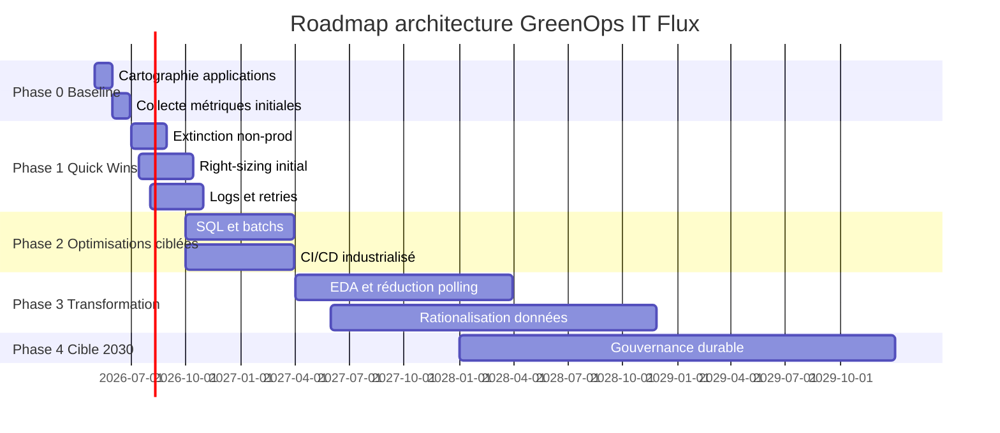

---

# 16. Matrice des leviers d’optimisation

| Levier | Impact carbone | Risque | Horizon | Priorité |
|---|---:|---:|---|---:|
| Extinction non-prod | élevé | faible | 2026 | 1 |
| Right-sizing | élevé | faible/moyen | 2026 | 1 |
| Réduction logs | moyen | faible | 2026 | 1 |
| Réduction retries | moyen/élevé | moyen | 2026 | 1 |
| Nettoyage batchs | moyen | faible | 2026 | 2 |
| Optimisation SQL | élevé | moyen | 2026–2027 | 2 |
| Archivage données | moyen | moyen | 2026–2027 | 2 |
| Scheduling sobre | faible/moyen | faible | 2027 | 3 |
| EDA / Kafka | élevé | moyen/élevé | 2027–2030 | 3 |
| Rationalisation applicative | très élevé | élevé | 2028–2030 | 4 |

---

# 17. Gouvernance cible

## 17.1 Instances

| Instance | Fréquence | Objectif |
|---|---|---|
| Point squads | hebdo | suivi actions applicatives |
| Point production | hebdo / bihebdo | capacité, incidents, données infra |
| Revue architecture | bihebdo | arbitrages techniques |
| Revue GreenOps | mensuelle | KPI carbone / gains |
| COPIL | mensuelle | décisions, risques, priorités |

## 17.2 RACI simplifié

| Activité | Architecture | Squads | Production | Sécurité | Management |
|---|---|---|---|---|---|
| Baseline | A/R | C | R | C | I |
| Right-sizing | A | C | R | I | I |
| Logs policy | A/R | R | C | C | I |
| CI/CD | A | R | C | R | I |
| Arbitrages | R | C | C | C | A |
| Reporting | R | C | C | C | A |

---

# 18. Reporting exécutif cible

## 18.1 Structure mensuelle

### Page 1 — Synthèse
- trajectoire -6 % / -20 % ;
- gains réalisés ;
- risques rouges ;
- décisions attendues.

### Page 2 — GreenOps
- gCO2e / application ;
- gCO2e / transaction ;
- ressources idle ;
- logs ;
- retries.

### Page 3 — DevSecOps
- couverture SonarQube ;
- couverture Checkmarx ;
- quality gates ;
- dette critique.

### Page 4 — Roadmap
- actions terminées ;
- actions en cours ;
- dépendances ;
- arbitrages.

---

# 19. Sécurité, conformité et résilience

## 19.1 Exigences de sécurité

- contrôle des vulnérabilités applicatives ;
- traçabilité des changements ;
- validation des dépendances ;
- limitation des secrets exposés ;
- séparation des environnements.

## 19.2 Exigences de résilience

- maintien des SLA ;
- réduction des timeouts ;
- gestion des dégradations ;
- supervision proactive ;
- rollback maîtrisé.

## 19.3 Lien avec GreenOps

Une application instable consomme plus :

---

# 20. Risques architecturaux

| Risque | Impact | Mitigation |
|---|---|---|
| Baseline incomplète | décisions fragiles | cadrage collecte dès phase 0 |
| Données infra indisponibles | gains non mesurables | accord avec production / infogérant |
| Optimisation agressive | incident SLA | pilote + rollback |
| Rejet des quality gates | adoption lente | approche progressive |
| Legacy peu instrumenté | zones aveugles | estimation + instrumentation ciblée |
| Trop d’initiatives locales | faible impact global | gouvernance centralisée |
| Gains surestimés | perte de crédibilité | fourchettes + mesure avant/après |

---

# 21. Critères de succès

## 21.1 Fin 2026

- baseline établie ;
- 5 applications prioritaires cartographiées ;
- quick wins lancés ;
- reporting mensuel opérationnel ;
- premières réductions mesurables ;
- CI/CD standardisé sur périmètre prioritaire.

## 21.2 Horizon 2030

- réduction structurelle atteinte ;
- GreenOps intégré au run ;
- dette technique réduite ;
- architecture plus découplée ;
- pilotage carbone intégré aux arbitrages ;
- gouvernance durable en place.

---

# 22. Synthèse finale

Ce HLD V2 positionne la décarbonation applicative comme un **sujet d’architecture d’entreprise**, pas comme une simple optimisation technique.

La trajectoire proposée permet de relier :

- Green IT ;
- DevSecOps ;
- SRE ;
- performance ;
- résilience ;
- recherche opérationnelle ;
- gouvernance.

La réussite repose sur trois conditions :

1. une mesure fiable ;
2. une priorisation rationnelle ;
3. une industrialisation progressive.

La cible est un SI de paiements plus sobre, plus robuste, plus mesurable et plus gouvernable.

