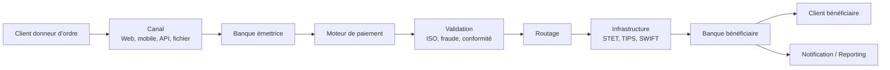

# 01 — Overview des Flux de Paiements Bancaires

## 1. Objectif du document

Ce document présente une vue d’ensemble des flux de paiements bancaires afin de poser le socle métier nécessaire à l’analyse ISO 20022, GreenOps, SRE et architecture SI.

L’objectif est de comprendre :

* quels sont les principaux flux de paiement ;
* quels acteurs interviennent ;
* quelles infrastructures sont utilisées ;
* quelles contraintes techniques et réglementaires s’appliquent ;
* pourquoi ces flux ont un impact direct sur la performance, les coûts et l’empreinte carbone IT.

---

## 2. Définition d’un flux de paiement

Un flux de paiement correspond à l’ensemble des informations, traitements et échanges nécessaires pour transférer une valeur monétaire d’un acteur vers un autre.

Un paiement n’est pas seulement une transaction financière. C’est une chaîne complète qui implique :

```text
ordre de paiement
   ↓
validation
   ↓
enrichissement
   ↓
routage
   ↓
compensation / règlement
   ↓
notification
   ↓
réconciliation
```

---

## 3. Acteurs principaux

| Acteur                   | Rôle                                              |
| ------------------------ | ------------------------------------------------- |
| Client donneur d’ordre   | Initie le paiement                                |
| Banque émettrice         | Reçoit, valide et transmet l’ordre                |
| Moteur de paiement       | Applique les règles métier et techniques          |
| Référentiels             | Fournissent IBAN, BIC, données client, conformité |
| Infrastructure de marché | Assure compensation ou règlement                  |
| Banque bénéficiaire      | Reçoit le paiement                                |
| Client bénéficiaire      | Reçoit les fonds                                  |
| Supervision / SRE        | Surveille disponibilité, latence, erreurs         |
| Conformité / fraude      | Contrôle AML, sanctions, fraude                   |
| GreenOps                 | Mesure et optimise l’impact énergétique/carbone   |

---

## 4. Grandes familles de flux

| Flux             | Description              | Mode                          |
| ---------------- | ------------------------ | ----------------------------- |
| SCT              | Virement SEPA classique  | Batch / différé               |
| SDD              | Prélèvement SEPA         | Batch avec logique de mandat  |
| SCT Inst         | Virement instantané SEPA | Temps réel 24/7               |
| Cross-border     | Paiement international   | SWIFT / correspondent banking |
| Cash Management  | Relevés et notifications | Reporting                     |
| Retours / rejets | Gestion des anomalies    | Exception handling            |

---

## 5. Batch vs temps réel

### 5.1 Flux batch

Les flux batch regroupent plusieurs paiements dans des fichiers ou lots traités à des moments précis.

Exemples :

* SCT classique ;
* SDD ;
* fichiers corporate ;
* traitements de fin de journée.

Caractéristiques :

* volumétrie élevée ;
* fenêtres de traitement ;
* dépendance aux cut-off ;
* forte consommation CPU ponctuelle ;
* optimisation possible par scheduling.

### 5.2 Flux temps réel

Les flux temps réel traitent chaque paiement individuellement, avec un délai très court.

Exemple :

* SCT Inst.

Caractéristiques :

* traitement unitaire ;
* disponibilité 24/7 ;
* faible latence ;
* tolérance minimale aux erreurs ;
* importance des retries, timeouts et idempotence.

---

## 6. Vue globale end-to-end



---

## 7. Infrastructures principales

| Infrastructure | Rôle                                     |
| -------------- | ---------------------------------------- |
| STET / ACH     | Compensation des paiements de détail     |
| TIPS           | Règlement instantané en monnaie centrale |
| T2 / TARGET    | Règlement brut en euros                  |
| SWIFT          | Messagerie financière internationale     |
| Core Banking   | Comptabilisation et tenue de compte      |
| MFT            | Transfert sécurisé de fichiers batch     |
| API Gateway    | Exposition temps réel / open banking     |

---

## 8. Messages ISO 20022 associés

| Famille | Usage                                             |
| ------- | ------------------------------------------------- |
| pain    | Initiation de paiement client → banque            |
| pacs    | Paiement interbancaire banque → banque            |
| camt    | Reporting, relevés, notifications, investigations |
| remt    | Informations de rapprochement                     |

Exemple simplifié :

```text
Client → Banque : pain.001
Banque → Infrastructure : pacs.008
Infrastructure → Banque : pacs.002
Banque → Client : camt.054
```

---

## 9. Contraintes majeures

| Contrainte        | Impact                                   |
| ----------------- | ---------------------------------------- |
| Volumétrie        | Dimensionnement CPU, mémoire, stockage   |
| Disponibilité     | Résilience, supervision, PCA/PRA         |
| Latence           | Critique pour SCT Inst                   |
| Qualité de donnée | Impact direct sur rejets et STP          |
| Réglementation    | DORA, CSRD, DSP, Instant Payment         |
| Sécurité          | AML, sanctions, fraude, authentification |
| Carbone           | Mesure gCO2e / transaction               |

---

## 10. Pourquoi ces flux sont importants pour GreenOps

Les flux de paiements consomment de l’énergie à plusieurs niveaux :

* parsing des messages ;
* validation métier ;
* appels référentiels ;
* contrôles fraude / conformité ;
* transferts réseau ;
* stockage des logs ;
* retries ;
* batchs redondants ;
* réconciliations.

L’objectif GreenOps n’est pas simplement de réduire la taille des messages.
Il consiste à réduire les traitements inutiles dans toute la chaîne.

```text
Moins d’erreurs
   ↓
Moins de rejets
   ↓
Moins de retries
   ↓
Moins de CPU / réseau / stockage
   ↓
Moins d’empreinte carbone
```

---

## 11. Points de vigilance architecte

Un architecte doit particulièrement surveiller :

* le découpage batch / temps réel ;
* la qualité des données ISO 20022 ;
* les mappings entre formats internes et externes ;
* la gestion des rejets ;
* la politique de retry ;
* l’idempotence ;
* les logs ;
* les dépendances référentielles ;
* les SLA/SLO ;
* la mesure carbone par flux.

---

## 12. Synthèse

Les flux de paiements bancaires constituent une chaîne critique mêlant métier, réglementation, performance, sécurité, résilience et sobriété numérique.

Ils doivent être analysés comme un système complet :

```text
Paiement
   +
Donnée ISO 20022
   +
Architecture SI
   +
Observabilité
   +
GreenOps
```

Cette vue d’ensemble sert de socle aux documents détaillés sur SCT, SDD, SCT Inst, ISO 20022, GreenOps et architecture cible.
