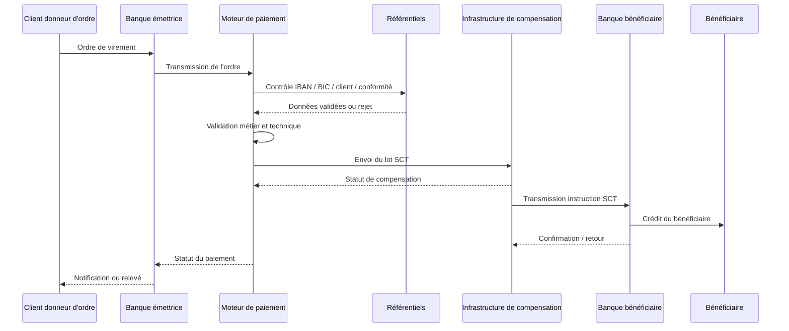
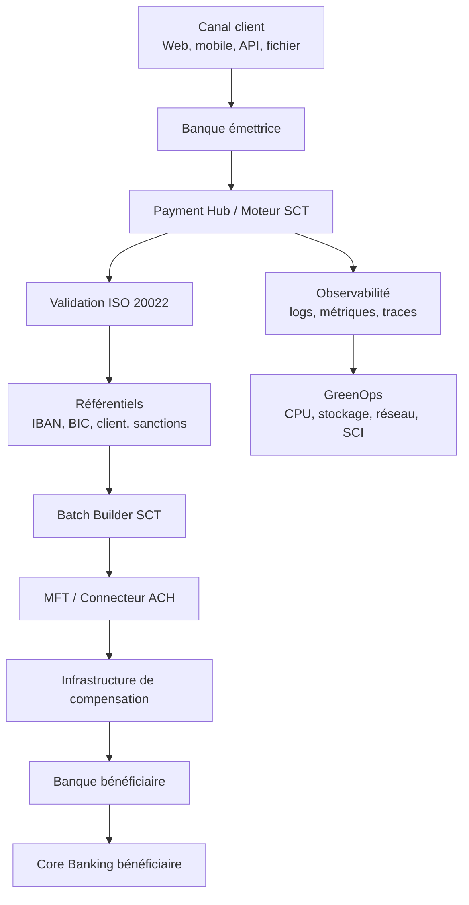
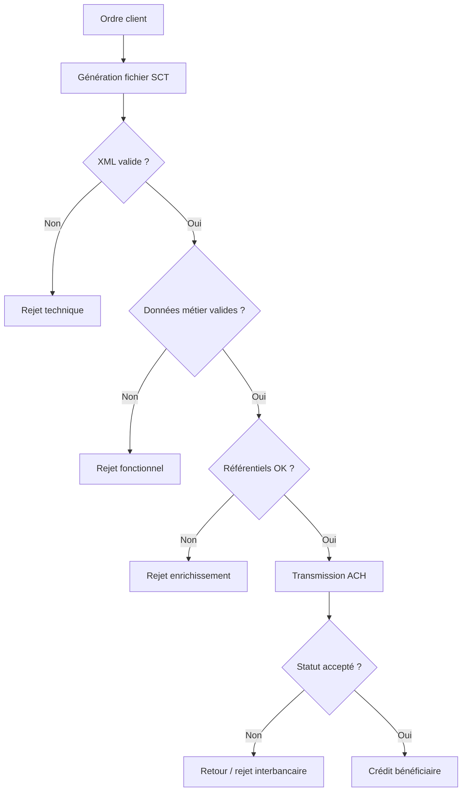
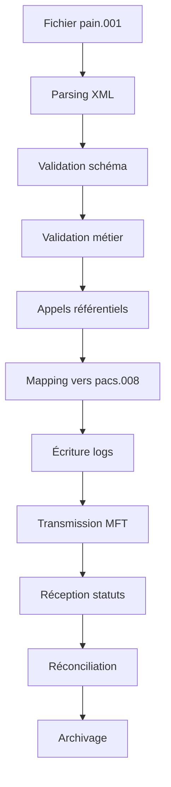

# 02 — SCT : SEPA Credit Transfer

## 1. Objectif du document

Ce document présente le fonctionnement complet du **SCT — SEPA Credit Transfer**, c’est-à-dire le virement SEPA classique.

Il couvre :

* la définition métier du SCT ;
* les acteurs impliqués ;
* le processus end-to-end ;
* les messages ISO 20022 associés ;
* les contraintes techniques ;
* les erreurs fréquentes ;
* les impacts GreenOps ;
* les leviers d’optimisation architecture.

---

# 2. Définition du SCT

Le **SCT — SEPA Credit Transfer** est un virement en euros réalisé dans l’espace SEPA.

Il permet à un donneur d’ordre de transférer de l’argent depuis son compte bancaire vers le compte d’un bénéficiaire.

Exemples d’usage :

* paiement fournisseur ;
* virement de salaire ;
* remboursement client ;
* paiement entre particuliers ;
* virement d’entreprise à entreprise ;
* paiement administratif.

Le SCT est un paiement **différé**, contrairement au SCT Inst.
Il n’est pas traité en quelques secondes, mais selon des cycles de traitement et de compensation.

---

# 3. Vue simple

```text
Client donneur d’ordre
        ↓
Banque émettrice
        ↓
Infrastructure de compensation
        ↓
Banque bénéficiaire
        ↓
Client bénéficiaire
```

Le SCT fonctionne généralement en mode **batch** : plusieurs virements sont regroupés, validés, transmis puis compensés.

---

# 4. Caractéristiques principales

| Caractéristique | Description                                  |
| --------------- | -------------------------------------------- |
| Zone            | SEPA                                         |
| Devise          | Euro                                         |
| Mode            | Batch / différé                              |
| Délai           | généralement J+1 selon contexte              |
| Type            | Credit transfer                              |
| Format moderne  | ISO 20022                                    |
| Usage           | virements classiques, salaires, fournisseurs |
| Infrastructure  | ACH / STET / système de compensation         |
| Criticité       | forte volumétrie, dépendance aux cut-off     |

---

# 5. SCT vs SCT Inst

| Sujet                 | SCT classique                    | SCT Inst                      |
| --------------------- | -------------------------------- | ----------------------------- |
| Mode                  | batch                            | temps réel                    |
| Disponibilité         | horaires bancaires / cycles      | 24/7/365                      |
| Délai                 | différé                          | quelques secondes             |
| Traitement            | fichiers ou lots                 | transaction unitaire          |
| Risque principal      | rejet batch, cut-off, volumétrie | latence, timeout, retry       |
| Optimisation GreenOps | batch, logs, rejets              | retries, idempotence, latence |

Le SCT classique est donc plus adapté aux volumes massifs planifiés, tandis que le SCT Inst répond aux besoins immédiats.

---

# 6. Acteurs du flux SCT

| Acteur                           | Rôle                                                           |
| -------------------------------- | -------------------------------------------------------------- |
| Donneur d’ordre                  | Personne ou entreprise qui initie le virement                  |
| Banque émettrice                 | Banque qui reçoit et traite l’ordre                            |
| Moteur de paiement               | Système qui valide, enrichit et prépare le paiement            |
| Référentiels                     | IBAN, BIC, client, conformité, sanctions                       |
| Infrastructure de compensation   | Plateforme qui échange et compense les virements entre banques |
| Banque bénéficiaire              | Banque qui reçoit le virement                                  |
| Bénéficiaire                     | Personne ou entreprise créditée                                |
| Système comptable / Core Banking | Comptabilise débit et crédit                                   |
| Supervision / SRE                | Surveille traitements, erreurs, délais                         |
| GreenOps                         | Mesure CPU, stockage, réseau, carbone                          |

---

# 7. Processus métier end-to-end

## 7.1 Processus simplifié

```text
1. Le client initie un virement.
2. La banque émettrice reçoit l’ordre.
3. Le moteur de paiement valide les données.
4. Le paiement est enrichi avec les référentiels.
5. Le paiement est intégré dans un lot SCT.
6. Le lot est transmis à l’infrastructure de compensation.
7. L’infrastructure traite le paiement.
8. La banque bénéficiaire reçoit l’instruction.
9. Le compte bénéficiaire est crédité.
10. Les statuts et notifications sont produits.
```

---

# 8. Diagramme du flux SCT



---

# 9. Vue architecture SI du SCT



---

# 10. Messages ISO 20022 associés au SCT

| Message    | Sens                                | Direction               |
| ---------- | ----------------------------------- | ----------------------- |
| `pain.001` | Customer Credit Transfer Initiation | Client → Banque         |
| `pain.002` | Payment Status Report               | Banque → Client         |
| `pacs.008` | FI to FI Customer Credit Transfer   | Banque → Banque         |
| `pacs.002` | Payment Status Report interbancaire | Infrastructure → Banque |
| `camt.054` | Notification débit/crédit           | Banque → Client         |
| `camt.053` | Relevé de compte                    | Banque → Client         |

---

# 11. Exemple de chaîne de messages SCT

```text
Client entreprise
   ↓ pain.001
Banque émettrice
   ↓ pacs.008
Infrastructure de compensation
   ↓ pacs.008
Banque bénéficiaire
   ↓ camt.054 / camt.053
Client bénéficiaire
```

---

# 12. Exemple métier simple

## Cas

Une entreprise veut payer un fournisseur :

* donneur d’ordre : Entreprise Alpha ;
* bénéficiaire : Fournisseur Beta ;
* montant : 25 000 EUR ;
* motif : paiement facture F2026-001 ;
* mode : SCT classique.

## Vue métier

```text
Entreprise Alpha demande à sa banque de transférer 25 000 EUR
vers Fournisseur Beta dans la zone SEPA.
```

## Vue technique simplifiée

```text
pain.001
   ↓
validation banque
   ↓
pacs.008
   ↓
compensation
   ↓
crédit bénéficiaire
   ↓
camt.054
```

---

# 13. Exemple ISO 20022 simplifié

```xml
<CdtTrfTxInf>
  <PmtId>
    <EndToEndId>F2026-001</EndToEndId>
  </PmtId>

  <Amt>
    <InstdAmt Ccy="EUR">25000</InstdAmt>
  </Amt>

  <Dbtr>
    <Nm>Entreprise Alpha</Nm>
  </Dbtr>

  <DbtrAcct>
    <Id>
      <IBAN>FR7612345678901234567890185</IBAN>
    </Id>
  </DbtrAcct>

  <Cdtr>
    <Nm>Fournisseur Beta</Nm>
  </Cdtr>

  <CdtrAcct>
    <Id>
      <IBAN>FR7611112222333344445555666</IBAN>
    </Id>
  </CdtrAcct>

  <RmtInf>
    <Ustrd>Facture F2026-001</Ustrd>
  </RmtInf>
</CdtTrfTxInf>
```

---

# 14. Lecture du message

| Élément      | Sens                                    |
| ------------ | --------------------------------------- |
| `EndToEndId` | Identifiant de bout en bout du paiement |
| `InstdAmt`   | Montant demandé                         |
| `Ccy="EUR"`  | Devise                                  |
| `Dbtr`       | Débiteur / payeur                       |
| `DbtrAcct`   | Compte du débiteur                      |
| `Cdtr`       | Créancier / bénéficiaire                |
| `CdtrAcct`   | Compte du créancier                     |
| `RmtInf`     | Information de remise / motif           |

---

# 15. Contraintes techniques SCT

## 15.1 Volumétrie

Le SCT est souvent massif :

* virements de salaires ;
* paiements fournisseurs ;
* virements récurrents ;
* traitements de fin de mois ;
* flux corporate.

Conséquence :

```text
fort volume
   ↓
gros fichiers
   ↓
pics CPU
   ↓
pics I/O
   ↓
pics logs
```

## 15.2 Batch

Le SCT est souvent traité par lots.

Avantages :

* efficace pour gros volumes ;
* adapté aux traitements planifiés ;
* optimisation possible par fenêtre horaire.

Risques :

* fichier rejeté ;
* batch relancé ;
* double traitement ;
* saturation CPU ;
* retard de cut-off.

## 15.3 Cut-off

Le cut-off est l’heure limite de traitement ou de transmission.

Si un fichier arrive après le cut-off :

* il peut être reporté ;
* il peut provoquer un retard ;
* il peut générer une relance ;
* il peut créer un incident métier.

## 15.4 Dépendances techniques

Un SCT dépend souvent de plusieurs composants :

* canal client ;
* moteur de paiement ;
* référentiels ;
* moteur de conformité ;
* MFT ;
* infrastructure de compensation ;
* core banking ;
* outil de reporting ;
* supervision.

---

# 16. Problèmes fréquents

| Problème                 | Cause possible                      | Impact                             |
| ------------------------ | ----------------------------------- | ---------------------------------- |
| IBAN invalide            | erreur client ou référentiel        | rejet                              |
| BIC absent ou incohérent | donnée incomplète                   | rejet ou enrichissement impossible |
| XML invalide             | fichier mal formé                   | rejet technique                    |
| champ obligatoire absent | mauvaise génération ISO             | rejet                              |
| doublon                  | replay ou absence d’idempotence     | risque opérationnel                |
| cut-off manqué           | batch en retard                     | report ou incident                 |
| mapping incorrect        | transformation legacy → ISO erronée | rejet ou erreur métier             |
| fichier trop volumineux  | batch non découpé                   | lenteur / timeout                  |
| logs trop détaillés      | mauvaise configuration              | stockage excessif                  |

---

# 17. Chaîne d’erreur typique



---

# 18. Impact GreenOps du SCT

Le SCT peut consommer beaucoup d’énergie même s’il n’est pas temps réel.

Pourquoi ?

* gros volumes ;
* parsing massif de fichiers XML ;
* traitements batch lourds ;
* relances ;
* contrôles référentiels ;
* génération de logs ;
* stockage des fichiers ;
* réconciliation ;
* archivage.

---

# 19. Où se crée la consommation ?



Chaque étape consomme :

* CPU ;
* mémoire ;
* I/O disque ;
* réseau ;
* stockage ;
* énergie.

---

# 20. Exemple chiffré simple

## Hypothèse

Une banque traite :

* 5 000 000 SCT / jour ;
* 1 message SCT = 3 Ko en moyenne ;
* 1 % de rejets ;
* chaque rejet génère un retraitement.

## Calcul

```text
Transactions utiles : 5 000 000
Rejets / retraitements : 50 000
Total traitements : 5 050 000
```

Même si le taux de rejet semble faible, il représente 50 000 traitements supplémentaires par jour.

## Impact

Ces 50 000 traitements supplémentaires génèrent :

* CPU inutile ;
* logs inutiles ;
* stockage inutile ;
* réseau inutile ;
* charge d’exploitation inutile.

---

# 21. Exemple de réduction

## Situation initiale

```text
5 000 000 SCT / jour
1 % rejets
50 000 retraitements / jour
```

## Après amélioration qualité ISO

```text
5 000 000 SCT / jour
0,2 % rejets
10 000 retraitements / jour
```

## Gain

```text
40 000 traitements évités / jour
```

Sur un an :

```text
40 000 × 365 = 14 600 000 traitements évités
```

---

# 22. Lecture carbone

Si un traitement SCT complet consomme en moyenne 0,4 Wh :

```text
14 600 000 × 0,4 Wh = 5 840 000 Wh
= 5 840 kWh évités / an
```

Avec une intensité carbone de 50 gCO2e/kWh :

```text
5 840 × 50 = 292 000 gCO2e
= 292 kgCO2e évités / an
```

Ce chiffre est volontairement simplifié.
En environnement réel, il faut intégrer :

* CPU applicatif ;
* bases de données ;
* stockage ;
* réseau ;
* supervision ;
* archivage ;
* infrastructure partagée.

---

# 23. Leviers d’optimisation SCT

| Levier                             | Effet                        |
| ---------------------------------- | ---------------------------- |
| Validation amont                   | éviter les rejets tardifs    |
| Contrôle IBAN/BIC avant batch      | éviter retraitements         |
| Découpage intelligent des fichiers | éviter gros batchs bloquants |
| Compression MFT                    | réduire réseau et stockage   |
| Parsing streaming                  | réduire CPU/mémoire          |
| Logs sobres                        | réduire stockage             |
| Idempotence                        | éviter doublons              |
| Scheduling optimisé                | réduire pics CPU             |
| Monitoring STP/rejets              | détecter dérives             |
| Archivage froid                    | réduire stockage chaud       |

---

# 24. SCT et ISO 20022

ISO 20022 améliore le SCT parce qu’il rend les données plus structurées.

Exemples :

* montant clairement identifié ;
* devise explicite ;
* débiteur structuré ;
* créancier structuré ;
* compte séparé ;
* motif de paiement mieux porté ;
* identifiant end-to-end.

Mais il ajoute aussi une contrainte :

```text
message plus riche
   ↓
XML plus volumineux
   ↓
parsing plus coûteux
```

L’architecture doit donc compenser avec :

* compression ;
* parsing streaming ;
* validation efficace ;
* réduction des retries ;
* logs maîtrisés.

---

# 25. SCT et STP

Le **STP — Straight Through Processing** désigne le traitement automatisé de bout en bout, sans intervention manuelle.

Un bon SCT doit viser :

```text
ordre reçu
   ↓
validé automatiquement
   ↓
transmis automatiquement
   ↓
compensé automatiquement
   ↓
réconcilié automatiquement
```

Plus le STP est élevé, moins il y a :

* interventions humaines ;
* corrections ;
* tickets ;
* relances ;
* coûts ;
* consommation inutile.

---

# 26. KPIs SCT à suivre

| KPI                    | Pourquoi le suivre             |
| ---------------------- | ------------------------------ |
| Nombre SCT / jour      | mesurer volumétrie             |
| Taille moyenne fichier | mesurer impact réseau/stockage |
| Taux rejet technique   | qualité XML                    |
| Taux rejet fonctionnel | qualité donnée                 |
| Taux STP               | efficacité globale             |
| Durée batch            | performance                    |
| CPU batch              | coût traitement                |
| Volume logs / batch    | sobriété                       |
| Nombre de replays      | risque doublon                 |
| gCO2e / 1000 SCT       | mesure GreenOps                |

---

# 27. Tableau d’audit SCT

| Question                                   | Objectif                  |
| ------------------------------------------ | ------------------------- |
| Quels flux SCT sont batchés ?              | comprendre l’organisation |
| Quels fichiers sont les plus volumineux ?  | cibler optimisation       |
| Quels sont les top motifs de rejet ?       | réduire erreurs           |
| Combien de batchs sont relancés ?          | mesurer gaspillage        |
| Les fichiers sont-ils compressés ?         | réduire réseau            |
| Les logs contiennent-ils tout le XML ?     | réduire stockage          |
| Le parsing est-il DOM ou streaming ?       | réduire mémoire           |
| Existe-t-il une idempotence ?              | éviter doublons           |
| Le STP est-il mesuré ?                     | piloter efficacité        |
| Le carbone par transaction est-il mesuré ? | piloter GreenOps          |

---

# 28. Vision architecte

Un architecte ne doit pas regarder le SCT uniquement comme un virement.

Il doit le regarder comme une chaîne industrielle :

```text
Donnée client
   ↓
Format ISO
   ↓
Validation
   ↓
Batch
   ↓
Infrastructure
   ↓
Retour
   ↓
Réconciliation
   ↓
Reporting
```

Chaque étape peut créer :

* de la valeur ;
* de l’erreur ;
* du délai ;
* du coût ;
* de la consommation carbone.

Le rôle de l’architecte est de maximiser la valeur utile et de réduire les traitements inutiles.

---

# 29. Synthèse

Le SCT est le socle des paiements SEPA classiques.

Ses enjeux principaux sont :

* la volumétrie ;
* le batch ;
* la qualité de donnée ;
* les rejets ;
* les cut-off ;
* les retraitements ;
* les logs ;
* la réconciliation ;
* l’optimisation énergétique.

ISO 20022 permet d’améliorer la qualité et l’automatisation du SCT, mais impose une vigilance sur la taille des messages et le coût de parsing.

La cible est un SCT :

* structuré ;
* validé tôt ;
* batché intelligemment ;
* observé ;
* mesuré ;
* optimisé ;
* sobre.
