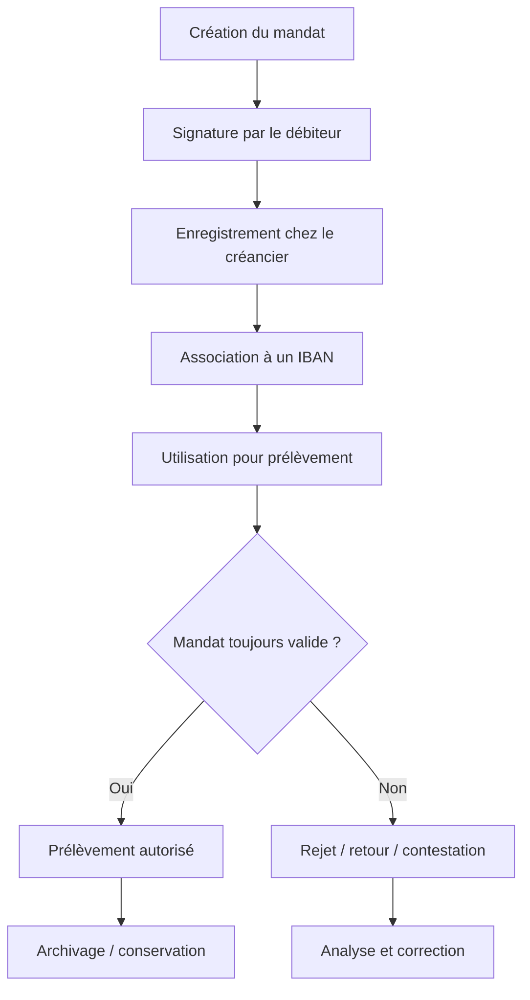
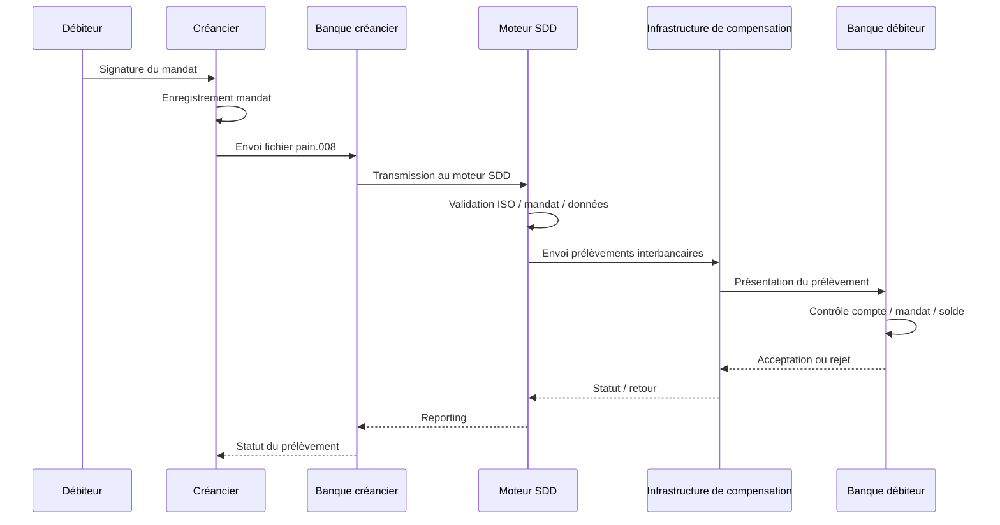
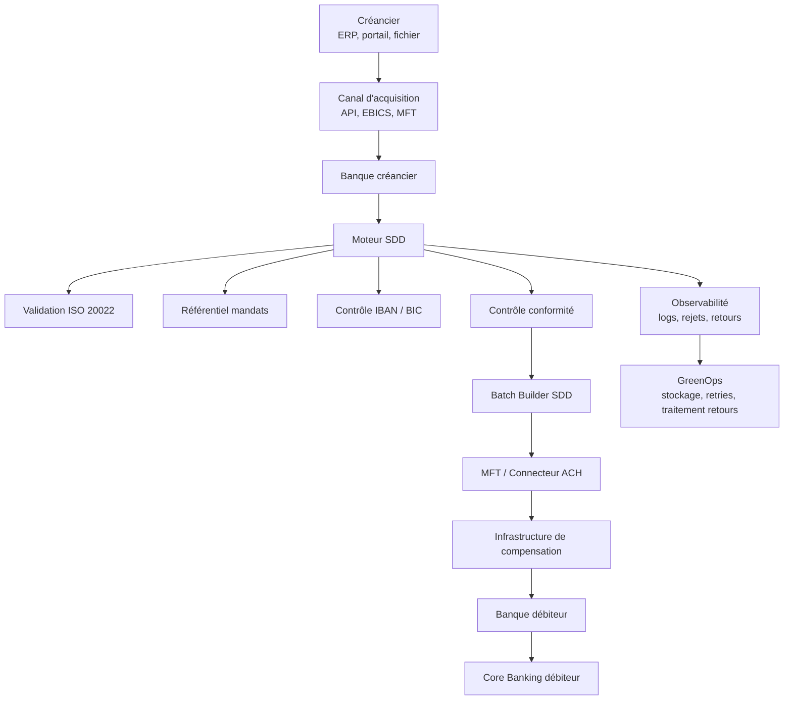
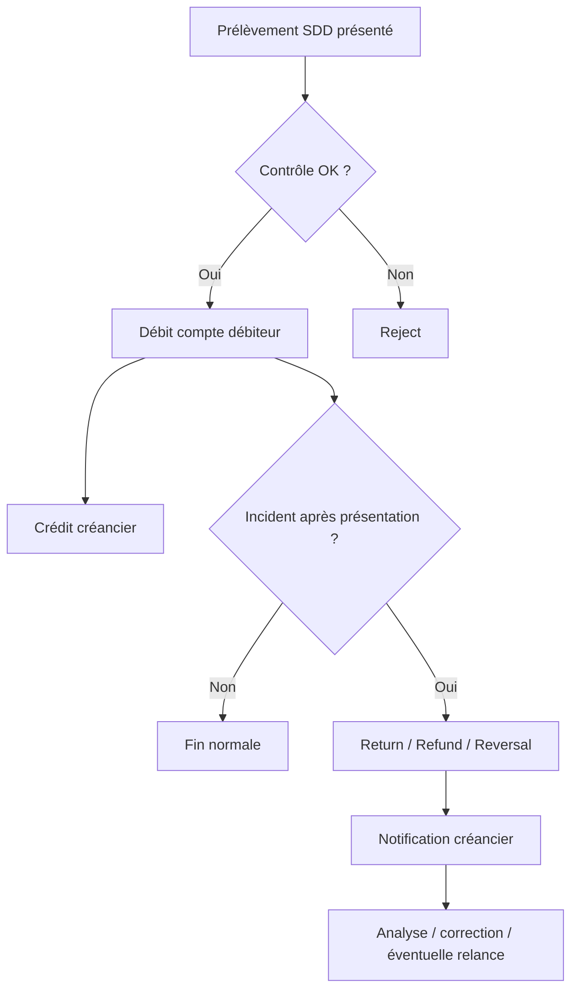
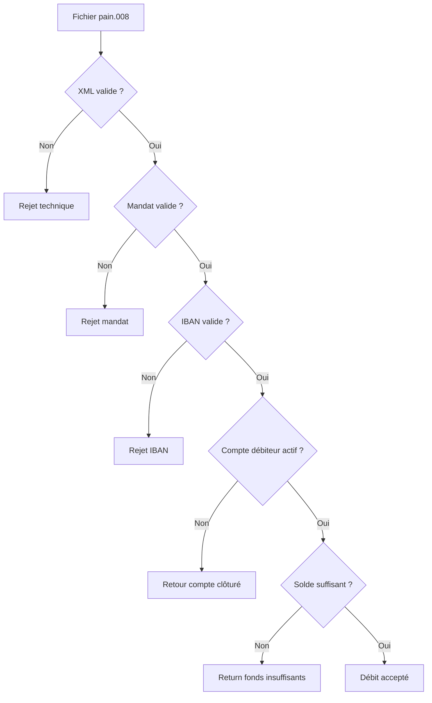
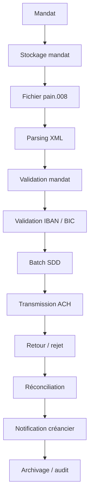

# 03 — SDD : SEPA Direct Debit

## 1. Objectif du document

Ce document présente le fonctionnement complet du **SDD — SEPA Direct Debit**, c’est-à-dire le prélèvement SEPA.

Il couvre :

* la définition métier du SDD ;
* les acteurs impliqués ;
* la notion de mandat ;
* le processus end-to-end ;
* les messages ISO 20022 associés ;
* les rejets et retours ;
* les impacts SI ;
* les impacts GreenOps ;
* les leviers d’optimisation architecture.

---

# 2. Définition du SDD

Le **SDD — SEPA Direct Debit** est un prélèvement en euros dans l’espace SEPA.

Contrairement au SCT, où le client initie lui-même un virement, le SDD permet à un **créancier** de demander le débit du compte d’un **débiteur**, sur la base d’une autorisation préalable appelée **mandat**.

Exemples d’usage :

* factures d’énergie ;
* abonnements télécom ;
* assurances ;
* loyers ;
* impôts ;
* remboursements de crédit ;
* cotisations ;
* services récurrents.

---

# 3. Vue simple

```text
Débiteur signe un mandat
        ↓
Créancier émet une demande de prélèvement
        ↓
Banque du créancier transmet
        ↓
Infrastructure de compensation
        ↓
Banque du débiteur débite le compte
        ↓
Créancier est crédité
```

Le SDD est donc un flux de **débit autorisé**.

---

# 4. SCT vs SDD

| Sujet             | SCT                          | SDD                             |
| ----------------- | ---------------------------- | ------------------------------- |
| Initiateur        | débiteur / payeur            | créancier                       |
| Sens              | le client envoie de l’argent | le créancier demande à prélever |
| Autorisation      | ordre de virement            | mandat préalable                |
| Risque principal  | erreur paiement / rejet      | contestation / mandat invalide  |
| Traitement        | batch ou instant selon type  | batch planifié                  |
| Complexité métier | moyenne                      | élevée                          |
| Rejets/retours    | possibles                    | très fréquents et structurants  |

---

# 5. Acteurs du SDD

| Acteur                         | Rôle                                               |
| ------------------------------ | -------------------------------------------------- |
| Créancier                      | Entreprise ou organisme qui demande le prélèvement |
| Débiteur                       | Client dont le compte est débité                   |
| Banque du créancier            | Banque qui reçoit le fichier de prélèvement        |
| Banque du débiteur             | Banque qui débite le compte du client              |
| Infrastructure de compensation | Traite les flux interbancaires                     |
| Moteur de paiement             | Valide, enrichit et transmet les prélèvements      |
| Référentiel mandats            | Stocke les mandats et leurs statuts                |
| Core Banking                   | Comptabilise débit et crédit                       |
| Supervision / SRE              | Suit rejets, retours, délais, incidents            |
| GreenOps                       | Mesure consommation, retraitements, stockage       |

---

# 6. Le mandat SDD

## 6.1 Définition

Le mandat est l’autorisation donnée par le débiteur au créancier pour prélever son compte.

Sans mandat valide, le prélèvement n’est pas légitime.

Le mandat contient généralement :

* identité du débiteur ;
* IBAN du débiteur ;
* identité du créancier ;
* identifiant créancier SEPA ;
* référence unique de mandat ;
* date de signature ;
* type de paiement ;
* informations de conservation.

## 6.2 Pourquoi le mandat est critique

Le mandat est le cœur du SDD.

Il permet de répondre à trois questions :

```text
Qui peut prélever ?
Qui est prélevé ?
Sur quelle base juridique ?
```

Si le mandat est incorrect, absent ou contesté, le prélèvement peut être rejeté ou remboursé.

---

# 7. Cycle de vie du mandat



---

# 8. Types de SDD

| Type     | Usage                          | Particularité                              |
| -------- | ------------------------------ | ------------------------------------------ |
| SDD Core | particuliers et professionnels | le plus courant                            |
| SDD B2B  | entreprises uniquement         | contrôle plus strict, contestation limitée |

## 8.1 SDD Core

Le SDD Core est utilisé pour les particuliers et les professionnels.

Il permet au débiteur de contester certains prélèvements dans des délais prévus.

## 8.2 SDD B2B

Le SDD B2B est réservé aux entreprises.

Il est plus strict :

* le mandat doit être connu de la banque du débiteur ;
* les droits de remboursement sont plus limités ;
* les contrôles sont renforcés.

---

# 9. Processus métier end-to-end

## 9.1 Processus simplifié

```text
1. Le débiteur signe un mandat.
2. Le créancier enregistre le mandat.
3. Le créancier prépare un fichier de prélèvement.
4. La banque du créancier reçoit le fichier.
5. Le moteur de paiement valide les données.
6. Le flux est transmis à l’infrastructure de compensation.
7. La banque du débiteur reçoit la demande.
8. La banque du débiteur contrôle le compte.
9. Le compte du débiteur est débité.
10. Le créancier est crédité.
11. Les éventuels rejets ou retours sont traités.
```

---

# 10. Diagramme séquentiel SDD



---

# 11. Vue architecture SI du SDD



---

# 12. Messages ISO 20022 associés au SDD

| Message    | Sens                                                | Direction               |
| ---------- | --------------------------------------------------- | ----------------------- |
| `pain.008` | Customer Direct Debit Initiation                    | Créancier → Banque      |
| `pain.002` | Payment Status Report                               | Banque → Créancier      |
| `pacs.003` | FI to FI Direct Debit                               | Banque → Banque         |
| `pacs.002` | Payment Status Report interbancaire                 | Infrastructure → Banque |
| `pacs.004` | Payment Return                                      | Retour interbancaire    |
| `camt.054` | Notification débit/crédit                           | Banque → Client         |
| `camt.053` | Relevé de compte                                    | Banque → Client         |
| `camt.056` | Investigation / demande d’annulation selon contexte | Banque → Banque         |

---

# 13. Exemple de chaîne de messages SDD

```text
Créancier
   ↓ pain.008
Banque du créancier
   ↓ pacs.003
Infrastructure de compensation
   ↓ pacs.003
Banque du débiteur
   ↓ débit compte
   ↓ pacs.004 / pacs.002 si retour ou rejet
Banque du créancier
   ↓ pain.002 / camt
Créancier
```

---

# 14. Exemple métier simple

## Cas

Une société d’énergie prélève la facture mensuelle d’un client.

* créancier : Fournisseur Energie Alpha ;
* débiteur : Client Martin ;
* montant : 120 EUR ;
* motif : facture énergie avril 2026 ;
* mandat : MANDAT-2026-001 ;
* mode : SDD Core.

## Vue métier

```text
Client Martin a autorisé Fournisseur Energie Alpha à prélever son compte.
Le fournisseur demande donc le prélèvement de 120 EUR.
```

## Vue technique simplifiée

```text
mandat actif
   ↓
pain.008
   ↓
validation banque
   ↓
pacs.003
   ↓
compensation
   ↓
débit compte débiteur
   ↓
statut / retour
```

---

# 15. Exemple ISO 20022 simplifié

```xml
<DrctDbtTxInf>
  <PmtId>
    <EndToEndId>FACT-ENERGIE-2026-04</EndToEndId>
  </PmtId>

  <InstdAmt Ccy="EUR">120</InstdAmt>

  <DrctDbtTx>
    <MndtRltdInf>
      <MndtId>MANDAT-2026-001</MndtId>
      <DtOfSgntr>2026-01-15</DtOfSgntr>
    </MndtRltdInf>
    <CdtrSchmeId>
      <Id>
        <PrvtId>
          <Othr>
            <Id>FR12ZZZ123456</Id>
          </Othr>
        </PrvtId>
      </Id>
    </CdtrSchmeId>
  </DrctDbtTx>

  <Dbtr>
    <Nm>Client Martin</Nm>
  </Dbtr>

  <DbtrAcct>
    <Id>
      <IBAN>FR7612345678901234567890185</IBAN>
    </Id>
  </DbtrAcct>

  <Cdtr>
    <Nm>Fournisseur Energie Alpha</Nm>
  </Cdtr>

  <CdtrAcct>
    <Id>
      <IBAN>FR7611112222333344445555666</IBAN>
    </Id>
  </CdtrAcct>

  <RmtInf>
    <Ustrd>Facture energie avril 2026</Ustrd>
  </RmtInf>
</DrctDbtTxInf>
```

---

# 16. Lecture du message

| Élément        | Sens                                       |
| -------------- | ------------------------------------------ |
| `DrctDbtTxInf` | Informations de transaction de prélèvement |
| `EndToEndId`   | Identifiant de bout en bout                |
| `InstdAmt`     | Montant demandé                            |
| `MndtId`       | Référence unique du mandat                 |
| `DtOfSgntr`    | Date de signature du mandat                |
| `CdtrSchmeId`  | Identifiant créancier SEPA                 |
| `Dbtr`         | Débiteur prélevé                           |
| `DbtrAcct`     | Compte du débiteur                         |
| `Cdtr`         | Créancier                                  |
| `CdtrAcct`     | Compte du créancier                        |
| `RmtInf`       | Information de remise / motif              |

---

# 17. Spécificités métier du SDD

## 17.1 Le SDD est initié par le créancier

C’est une différence majeure avec le SCT.

Dans un SCT :

```text
le débiteur pousse l’argent
```

Dans un SDD :

```text
le créancier tire l’argent
```

## 17.2 Le mandat est obligatoire

Le prélèvement repose sur une autorisation préalable.

Sans mandat, la légitimité du prélèvement peut être contestée.

## 17.3 Les retours sont structurants

Le SDD génère souvent plus d’exceptions que le SCT :

* compte insuffisant ;
* IBAN invalide ;
* mandat révoqué ;
* compte clôturé ;
* contestation client ;
* erreur de montant.

---

# 18. R-transactions

Les R-transactions représentent les événements d’exception dans le cycle de vie d’un prélèvement.

## 18.1 Principaux types

| Type                     | Sens                                       | Exemple                     |
| ------------------------ | ------------------------------------------ | --------------------------- |
| Reject                   | rejet avant règlement                      | IBAN invalide               |
| Return                   | retour après présentation                  | fonds insuffisants          |
| Refund                   | remboursement demandé par débiteur         | contestation                |
| Reversal                 | annulation initiée par créancier ou banque | erreur opérationnelle       |
| Revocation               | révocation avant exécution                 | créancier annule            |
| Request for cancellation | demande d’annulation                       | erreur détectée tardivement |

## 18.2 Pourquoi c’est important

Chaque R-transaction crée :

* un traitement supplémentaire ;
* une notification ;
* une écriture comptable ;
* une analyse possible ;
* un log ;
* parfois un litige.

Donc les R-transactions sont un levier majeur d’optimisation métier, SI et GreenOps.

---

# 19. Diagramme R-transaction



---

# 20. Problèmes fréquents

| Problème                 | Cause possible             | Impact               |
| ------------------------ | -------------------------- | -------------------- |
| Mandat absent            | mauvaise gestion créancier | rejet / litige       |
| Mandat expiré ou révoqué | cycle de vie mal suivi     | retour               |
| IBAN invalide            | donnée client incorrecte   | rejet                |
| Compte clôturé           | référentiel non mis à jour | retour               |
| Solde insuffisant        | provision absente          | retour               |
| Montant contesté         | litige client              | refund               |
| Doublon                  | absence d’idempotence      | risque opérationnel  |
| Mauvais séquencement     | first/recurrent mal géré   | rejet                |
| Fichier mal formé        | XML invalide               | rejet technique      |
| Retours mal intégrés     | mauvaise réconciliation    | incident back-office |

---

# 21. Chaîne d’erreur typique



---

# 22. Contraintes techniques SDD

## 22.1 Gestion des mandats

Le SI doit gérer :

* création ;
* modification ;
* révocation ;
* conservation ;
* association client/compte ;
* preuve en cas de contestation.

## 22.2 Gestion des délais

Le SDD ne fonctionne pas comme un paiement instantané.

Il impose des délais de présentation, de traitement et de retour.

## 22.3 Gestion des exceptions

La complexité du SDD vient surtout des exceptions.

Une plateforme SDD doit être très robuste sur :

* rejets ;
* retours ;
* remboursements ;
* litiges ;
* notifications ;
* réconciliations.

## 22.4 Gestion de la volumétrie

Certains créanciers émettent des volumes massifs :

* opérateurs télécom ;
* fournisseurs d’énergie ;
* assurances ;
* administrations.

Cela crée des pics batch importants.

---

# 23. Impact GreenOps du SDD

Le SDD peut être énergivore pour plusieurs raisons :

* volumétrie élevée ;
* stockage des mandats ;
* retours fréquents ;
* relances ;
* réconciliations ;
* litiges ;
* conservation longue ;
* logs et pièces justificatives ;
* batchs massifs.

Le coût carbone du SDD n’est donc pas seulement dans le prélèvement initial.
Il est aussi dans tout le cycle de vie des exceptions.

---

# 24. Où se crée la consommation ?



---

# 25. Exemple chiffré simple

## Hypothèse

Une banque traite :

* 2 000 000 SDD / jour ;
* taux R-transactions : 3 % ;
* chaque R-transaction génère en moyenne 1,5 traitement supplémentaire ;
* coût moyen d’un traitement SDD : 0,6 Wh.

## Calcul

```text
Transactions utiles : 2 000 000
R-transactions : 2 000 000 × 3 % = 60 000
Traitements supplémentaires : 60 000 × 1,5 = 90 000
Total traitements : 2 090 000
```

Énergie :

```text
2 090 000 × 0,6 Wh = 1 254 000 Wh
= 1 254 kWh / jour
```

---

# 26. Après optimisation

Hypothèse :

* taux R-transactions réduit de 3 % à 1,5 % ;
* traitement moyen optimisé à 0,5 Wh.

```text
R-transactions : 2 000 000 × 1,5 % = 30 000
Traitements supplémentaires : 30 000 × 1,2 = 36 000
Total traitements : 2 036 000
```

Énergie :

```text
2 036 000 × 0,5 Wh = 1 018 000 Wh
= 1 018 kWh / jour
```

Gain :

```text
1 254 - 1 018 = 236 kWh / jour
```

Sur un an :

```text
236 × 365 = 86 140 kWh évités / an
```

Avec une intensité carbone de 50 gCO2e/kWh :

```text
86 140 × 50 = 4 307 000 gCO2e
= 4,3 tonnes CO2e évitées / an
```

---

# 27. Lecture du chiffrage

Le SDD montre bien que l’empreinte carbone ne vient pas uniquement du message initial.

Elle vient surtout :

* des exceptions ;
* des retours ;
* des contestations ;
* des relances ;
* de la conservation longue ;
* des réconciliations.

Réduire les R-transactions est donc un levier à la fois métier, opérationnel et GreenOps.

---

# 28. Leviers d’optimisation SDD

| Levier                                | Effet                       |
| ------------------------------------- | --------------------------- |
| Qualité des mandats                   | moins de rejets             |
| Validation IBAN avant émission        | moins de retours            |
| Référentiel mandat fiable             | moins de litiges            |
| Idempotence                           | éviter doublons             |
| Détection des comptes clôturés        | réduire retours             |
| Analyse des top motifs R-transactions | cibler corrections          |
| Automatisation réconciliation         | réduire traitements manuels |
| Logs sobres                           | réduire stockage            |
| Archivage froid des mandats           | réduire stockage chaud      |
| Tableaux de bord R-transactions       | pilotage métier/SI          |

---

# 29. SDD et ISO 20022

ISO 20022 apporte de la structure au SDD :

* mandat clairement identifié ;
* créancier structuré ;
* débiteur structuré ;
* compte débiteur explicite ;
* montant explicite ;
* motif de prélèvement ;
* statuts et retours normalisés.

Cette structuration permet :

* meilleure validation ;
* meilleure automatisation ;
* meilleure réconciliation ;
* meilleur suivi des exceptions.

Mais elle impose aussi :

* messages XML plus lourds ;
* parsing ;
* stockage ;
* logs ;
* gestion stricte des champs obligatoires.

---

# 30. SDD et STP

Le STP du SDD dépend fortement de la qualité des données mandat et compte.

```text
mandat valide
   ↓
IBAN valide
   ↓
fichier ISO valide
   ↓
débit accepté
   ↓
retour traité automatiquement
```

Un mauvais STP SDD se traduit par :

* interventions back-office ;
* litiges ;
* retours ;
* relances ;
* coûts ;
* consommation IT inutile.

---

# 31. KPIs SDD à suivre

| KPI                     | Pourquoi le suivre         |
| ----------------------- | -------------------------- |
| Nombre SDD / jour       | volumétrie                 |
| Taux R-transactions     | qualité globale            |
| Taux rejet mandat       | qualité référentiel mandat |
| Taux rejet IBAN         | qualité donnée compte      |
| Taux fonds insuffisants | risque métier              |
| Taux refund             | litiges clients            |
| Taux STP                | automatisation             |
| Durée batch SDD         | performance                |
| Volume logs / batch     | sobriété                   |
| gCO2e / 1000 SDD        | GreenOps                   |

---

# 32. Tableau d’audit SDD

| Question                                           | Objectif                  |
| -------------------------------------------------- | ------------------------- |
| Où sont stockés les mandats ?                      | comprendre le référentiel |
| Le cycle de vie mandat est-il maîtrisé ?           | réduire litiges           |
| Les IBAN sont-ils validés avant émission ?         | réduire rejets            |
| Les R-transactions sont-elles catégorisées ?       | cibler optimisation       |
| Quels sont les top motifs de retour ?              | prioriser actions         |
| Les retours sont-ils réconciliés automatiquement ? | augmenter STP             |
| Les mandats sont-ils archivés à froid ?            | réduire stockage          |
| Les fichiers pain.008 sont-ils compressés ?        | réduire réseau            |
| Le parsing est-il optimisé ?                       | réduire CPU/mémoire       |
| Le carbone par SDD est-il mesuré ?                 | piloter GreenOps          |

---

# 33. Vision architecte

Un architecte ne doit pas regarder le SDD comme un simple prélèvement.

Il doit le voir comme un cycle de vie complet :

```text
Mandat
   ↓
Prélèvement
   ↓
Compensation
   ↓
Retour éventuel
   ↓
Réconciliation
   ↓
Litige possible
   ↓
Archivage
```

La complexité principale du SDD n’est pas uniquement technique.
Elle est métier, juridique, opérationnelle et data.

Le rôle de l’architecte est de réduire les points de friction dans toute la chaîne.

---

# 34. Synthèse

Le SDD est un flux de paiement critique, très différent du SCT.

Ses enjeux principaux sont :

* mandat ;
* qualité de donnée ;
* délais ;
* R-transactions ;
* litiges ;
* réconciliation ;
* stockage ;
* batchs massifs ;
* GreenOps.

ISO 20022 permet de mieux structurer et automatiser le SDD, mais l’architecture doit maîtriser les exceptions, la volumétrie, les logs, les traitements de retour et le stockage des mandats.

La cible est un SDD :

* fiable ;
* traçable ;
* automatisé ;
* bien réconcilié ;
* sobre en traitements ;
* mesuré en coût et carbone.
