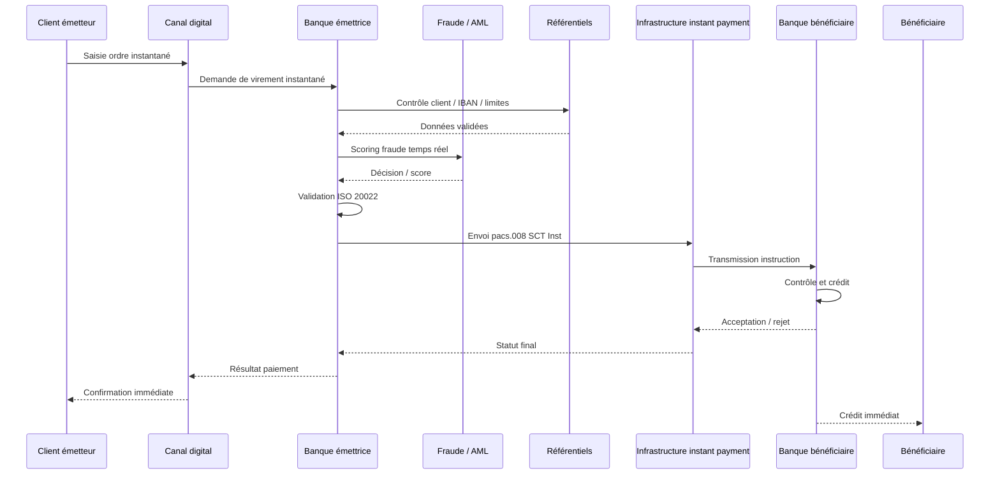
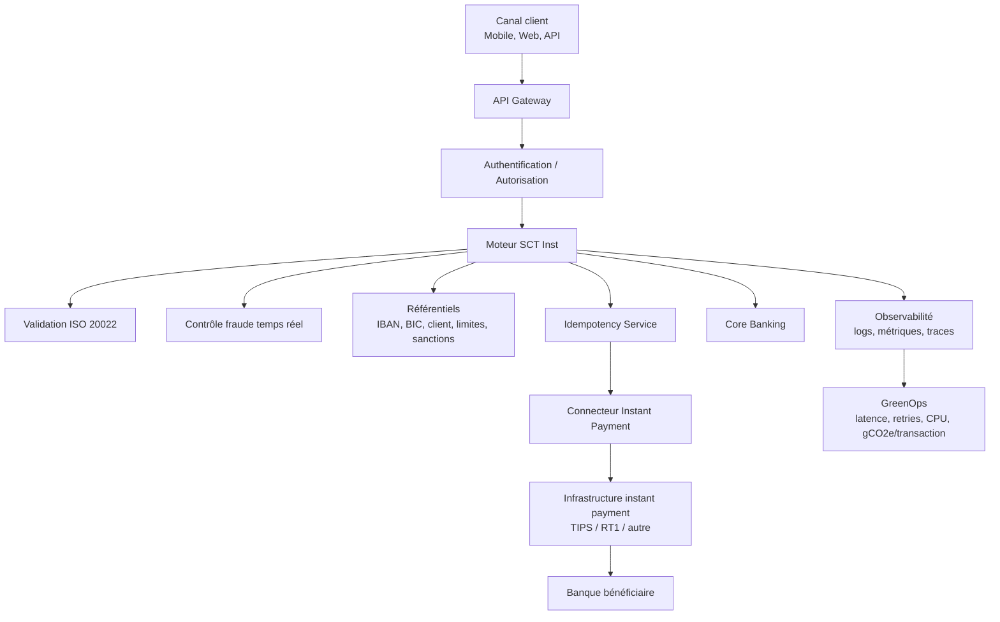
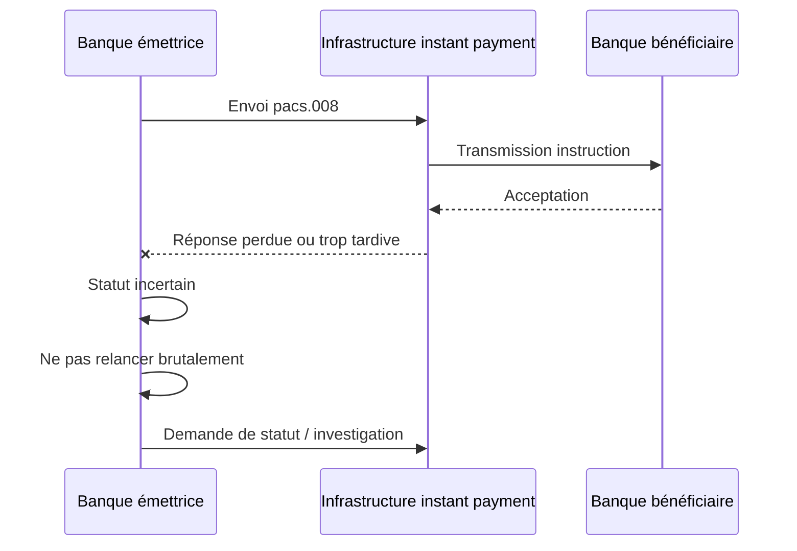
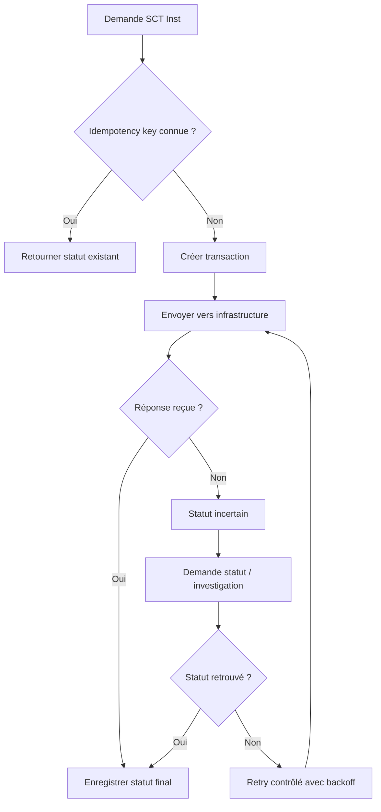
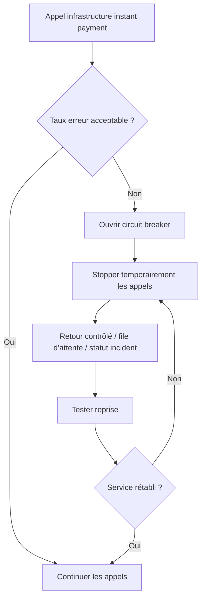
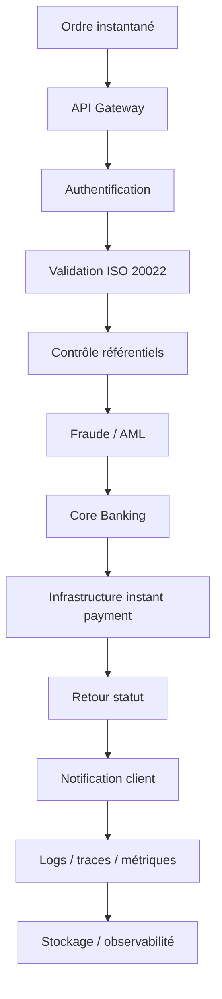

# 04 — SCT Inst : SEPA Instant Credit Transfer

## 1. Objectif du document

Ce document présente le fonctionnement complet du **SCT Inst — SEPA Instant Credit Transfer**, c’est-à-dire le virement instantané SEPA.

Il couvre :

* la définition métier du SCT Inst ;
* les acteurs impliqués ;
* le processus end-to-end ;
* les messages ISO 20022 associés ;
* les contraintes temps réel ;
* les risques de timeout, retry et doublon ;
* les impacts GreenOps ;
* les leviers d’optimisation architecture.

---

# 2. Définition du SCT Inst

Le **SCT Inst** est un virement SEPA instantané en euros.

Il permet de transférer de l’argent d’un compte vers un autre en quelques secondes, dans l’espace SEPA.

Contrairement au SCT classique, le SCT Inst n’est pas traité en batch.
Il est traité **transaction par transaction**, en temps réel.

Ses caractéristiques principales :

* paiement en euros ;
* zone SEPA ;
* traitement immédiat ;
* disponibilité 24/7/365 ;
* délai très court ;
* irrévocabilité après acceptation ;
* forte exigence de disponibilité et de résilience.

---

# 3. Vue simple

```text
Client émetteur
      ↓
Banque émettrice
      ↓
Contrôles temps réel
      ↓
Infrastructure instant payment
      ↓
Banque bénéficiaire
      ↓
Client bénéficiaire crédité immédiatement
```

Le SCT Inst n’est pas seulement un “SCT plus rapide”.
C’est un autre modèle opérationnel.

---

# 4. SCT classique vs SCT Inst

| Sujet            | SCT classique             | SCT Inst                                 |
| ---------------- | ------------------------- | ---------------------------------------- |
| Mode             | batch                     | transaction unitaire                     |
| Délai            | différé                   | quelques secondes                        |
| Disponibilité    | cycles bancaires          | 24/7/365                                 |
| Traitement       | fichier / lot             | temps réel                               |
| Rejet            | peut être traité en batch | doit être immédiat                       |
| Risque principal | cut-off, rejet fichier    | timeout, retry, doublon                  |
| Architecture     | batch/MFT                 | API/event-driven/temps réel              |
| GreenOps         | pics CPU batch            | infrastructure toujours active + retries |

---

# 5. Acteurs du flux SCT Inst

| Acteur                         | Rôle                                      |
| ------------------------------ | ----------------------------------------- |
| Client émetteur                | Initie le virement instantané             |
| Canal digital                  | Mobile, web, API, open banking            |
| Banque émettrice               | Reçoit, valide et envoie le paiement      |
| Moteur SCT Inst                | Orchestration temps réel                  |
| Référentiels                   | Client, IBAN, BIC, sanctions, limites     |
| Moteur fraude                  | Score en temps réel avant émission        |
| Infrastructure instant payment | Routage/règlement instantané              |
| Banque bénéficiaire            | Reçoit et crédite le bénéficiaire         |
| Client bénéficiaire            | Reçoit les fonds                          |
| Supervision/SRE                | Surveille disponibilité, latence, erreurs |
| GreenOps                       | Mesure coût énergétique par transaction   |

---

# 6. Processus métier end-to-end

## 6.1 Processus simplifié

```text
1. Le client initie un virement instantané.
2. La banque émettrice vérifie l’identité et les droits du client.
3. Le moteur SCT Inst valide les données du paiement.
4. Les contrôles fraude, sanctions et conformité sont exécutés.
5. Le système vérifie les limites, le solde et la disponibilité.
6. Le paiement est envoyé à l’infrastructure instant payment.
7. La banque bénéficiaire reçoit la demande.
8. La banque bénéficiaire accepte ou rejette.
9. Le bénéficiaire est crédité immédiatement si accepté.
10. La banque émettrice reçoit la confirmation.
11. Le client émetteur reçoit le statut final.
```

---

# 7. Diagramme séquentiel SCT Inst



---

# 8. Vue architecture SI



---

# 9. Messages ISO 20022 associés

| Message    | Sens                                                | Direction                      |
| ---------- | --------------------------------------------------- | ------------------------------ |
| `pain.001` | Initiation client vers banque, selon canal          | Client → Banque                |
| `pacs.008` | Virement interbancaire instantané                   | Banque → Banque                |
| `pacs.002` | Statut de paiement                                  | Infrastructure/Banque → Banque |
| `camt.054` | Notification débit/crédit                           | Banque → Client                |
| `camt.053` | Relevé de compte                                    | Banque → Client                |
| `camt.056` | Investigation / demande d’annulation selon contexte | Banque → Banque                |

---

# 10. Exemple métier simple

## Cas

Un client veut envoyer immédiatement 800 EUR à un bénéficiaire.

* donneur d’ordre : Client A ;
* bénéficiaire : Client B ;
* montant : 800 EUR ;
* mode : SCT Inst ;
* attente utilisateur : confirmation immédiate.

## Vue métier

```text
Client A demande à sa banque d’envoyer 800 EUR immédiatement
à Client B dans la zone SEPA.
```

## Vue technique simplifiée

```text
ordre client
   ↓
API banque
   ↓
contrôles temps réel
   ↓
pacs.008 instant payment
   ↓
infrastructure instant
   ↓
banque bénéficiaire
   ↓
confirmation immédiate
```

---

# 11. Exemple ISO 20022 simplifié

```xml
<CdtTrfTxInf>
  <PmtId>
    <EndToEndId>INST-2026-000001</EndToEndId>
    <TxId>TX-987654321</TxId>
  </PmtId>

  <PmtTpInf>
    <SvcLvl>
      <Cd>SEPA</Cd>
    </SvcLvl>
    <LclInstrm>
      <Cd>INST</Cd>
    </LclInstrm>
  </PmtTpInf>

  <IntrBkSttlmAmt Ccy="EUR">800</IntrBkSttlmAmt>

  <Dbtr>
    <Nm>Client A</Nm>
  </Dbtr>

  <DbtrAcct>
    <Id>
      <IBAN>FR7612345678901234567890185</IBAN>
    </Id>
  </DbtrAcct>

  <Cdtr>
    <Nm>Client B</Nm>
  </Cdtr>

  <CdtrAcct>
    <Id>
      <IBAN>FR7611112222333344445555666</IBAN>
    </Id>
  </CdtrAcct>
</CdtTrfTxInf>
```

---

# 12. Lecture du message

| Élément              | Sens                                    |
| -------------------- | --------------------------------------- |
| `EndToEndId`         | Identifiant de bout en bout du paiement |
| `TxId`               | Identifiant transactionnel              |
| `SvcLvl`             | Niveau de service SEPA                  |
| `LclInstrm` / `INST` | Indique un paiement instantané          |
| `IntrBkSttlmAmt`     | Montant interbancaire                   |
| `Dbtr`               | Débiteur                                |
| `DbtrAcct`           | Compte du débiteur                      |
| `Cdtr`               | Créancier / bénéficiaire                |
| `CdtrAcct`           | Compte bénéficiaire                     |

---

# 13. Contraintes critiques du SCT Inst

## 13.1 Latence

Le paiement doit être traité en quelques secondes.

La latence totale comprend :

```text
latence canal
+ validation banque
+ contrôle fraude
+ contrôle référentiels
+ appel infrastructure
+ traitement banque bénéficiaire
+ retour statut
```

Chaque composant doit donc être optimisé.

## 13.2 Disponibilité

Le SCT Inst fonctionne 24/7/365.

Cela implique :

* pas de fenêtre de maintenance classique ;
* architecture hautement disponible ;
* supervision continue ;
* astreinte renforcée ;
* procédures de bascule ;
* dépendances critiques maîtrisées.

## 13.3 Irrévocabilité

Une fois accepté, le paiement est irrévocable.

Conséquence :

* contrôles fraude avant émission ;
* validation forte du compte bénéficiaire ;
* attention aux doublons ;
* besoin d’idempotence.

## 13.4 Traitement unitaire

Chaque paiement est traité individuellement.

Cela permet une réponse immédiate, mais empêche les optimisations classiques du batch.

---

# 14. Budget de temps simplifié

Exemple de répartition théorique :

| Étape                           | Temps cible |
| ------------------------------- | ----------: |
| Canal / API Gateway             |      200 ms |
| Authentification / autorisation |      300 ms |
| Validation ISO / métier         |      300 ms |
| Référentiels                    |      500 ms |
| Fraude / AML                    |    1 000 ms |
| Core Banking                    |    1 000 ms |
| Infrastructure instant payment  |    2 000 ms |
| Banque bénéficiaire             |    2 000 ms |
| Retour statut                   |      500 ms |
| Marge                           |    2 200 ms |

Total cible : environ 10 secondes.

Ce tableau n’est pas une norme.
Il sert à comprendre que chaque milliseconde devient un sujet d’architecture.

---

# 15. Problèmes fréquents

| Problème               | Cause possible                    | Impact           |
| ---------------------- | --------------------------------- | ---------------- |
| Timeout                | lenteur réseau ou système aval    | statut incertain |
| Retry non maîtrisé     | logique de relance agressive      | surcharge        |
| Doublon                | absence d’idempotence             | risque financier |
| Fraude non détectée    | contrôle trop lent ou insuffisant | perte financière |
| Latence référentiel    | dépendance externe lente          | dépassement SLA  |
| Saturation API         | pic de trafic                     | erreurs 5xx      |
| Statut inconnu         | réponse perdue                    | investigation    |
| Logs excessifs         | messages complets loggés          | stockage massif  |
| Circuit breaker absent | appel aval instable               | cascade failure  |

---

# 16. Le problème du statut incertain

Le SCT Inst crée un cas difficile :

```text
La banque émettrice envoie le paiement
   ↓
L’infrastructure ou la banque bénéficiaire traite
   ↓
La réponse n’arrive pas à temps
   ↓
La banque émettrice ne sait pas si le paiement est accepté ou rejeté
```

Ce cas est critique.

Il peut provoquer :

* retry dangereux ;
* doublon apparent ;
* litige client ;
* investigation ;
* surcharge opérationnelle.

---

# 17. Diagramme timeout / statut incertain



---

# 18. Retry : pourquoi c’est dangereux

Dans un système classique, quand une requête échoue, on peut être tenté de relancer.

En SCT Inst, relancer sans contrôle peut être dangereux.

## Mauvais comportement

```text
timeout
   ↓
retry immédiat
   ↓
nouveau timeout
   ↓
retry encore
   ↓
surcharge
   ↓
risque doublon
```

## Bon comportement

```text
timeout
   ↓
vérifier idempotency key
   ↓
demander statut
   ↓
retry contrôlé si autorisé
   ↓
journaliser statut
```

---

# 19. Diagramme retry maîtrisé



---

# 20. Idempotence

L’idempotence permet de garantir qu’une même demande ne produit pas plusieurs paiements.

Exemple :

```text
Même idempotency key
   ↓
Même paiement logique
   ↓
Pas de duplication
```

Sans idempotence :

* double débit possible ;
* litige client ;
* investigation ;
* risque financier ;
* surcharge IT.

---

# 21. Circuit breaker

Un circuit breaker protège le système lorsque l’aval est instable.

Principe :

```text
si trop d’échecs
   ↓
on arrête temporairement d’appeler le service aval
   ↓
on évite d’aggraver la panne
```

Dans SCT Inst, il protège contre :

* saturation infrastructure ;
* avalanche de retries ;
* propagation d’incidents ;
* consommation CPU inutile.

---

# 22. Diagramme circuit breaker



---

# 23. Impact GreenOps du SCT Inst

Le SCT Inst peut être énergivore pour plusieurs raisons :

* infrastructure active 24/7 ;
* redondance élevée ;
* appels temps réel ;
* monitoring permanent ;
* retries ;
* fraude temps réel ;
* exigences faibles latences ;
* logs détaillés ;
* investigations en cas de statut incertain.

Contrairement au SCT batch, il n’y a pas seulement des pics.
Il y a une consommation continue.

---

# 24. Où se crée la consommation ?



Chaque étape consomme :

* CPU ;
* mémoire ;
* réseau ;
* stockage ;
* énergie ;
* capacité d’observabilité.

---

# 25. Exemple chiffré simple

## Hypothèse

Une banque traite :

* 1 000 000 SCT Inst / jour ;
* taux timeout : 0,8 % ;
* chaque timeout génère en moyenne 2 retries ;
* coût moyen d’un traitement complet : 0,8 Wh.

## Calcul initial

```text
Transactions utiles : 1 000 000
Timeouts : 8 000
Retries : 8 000 × 2 = 16 000
Total traitements : 1 016 000
```

Énergie :

```text
1 016 000 × 0,8 Wh = 812 800 Wh
= 812,8 kWh / jour
```

---

# 26. Après optimisation retry

Hypothèse :

* timeout réduit à 0,3 % ;
* retry moyen réduit à 0,5 par timeout ;
* coût moyen optimisé : 0,7 Wh.

```text
Transactions utiles : 1 000 000
Timeouts : 3 000
Retries : 3 000 × 0,5 = 1 500
Total traitements : 1 001 500
```

Énergie :

```text
1 001 500 × 0,7 Wh = 701 050 Wh
= 701 kWh / jour
```

Gain :

```text
812,8 - 701 = 111,8 kWh / jour
```

Sur un an :

```text
111,8 × 365 = 40 807 kWh évités / an
```

Avec une intensité carbone de 50 gCO2e/kWh :

```text
40 807 × 50 = 2 040 350 gCO2e
= 2,04 tonnes CO2e évitées / an
```

---

# 27. Lecture du chiffrage

Ce n’est pas le message ISO 20022 seul qui fait exploser la consommation.

Les gros facteurs sont :

* retries ;
* timeouts ;
* appels référentiels lents ;
* fraude temps réel mal optimisée ;
* logs trop détaillés ;
* infrastructure surdimensionnée ;
* absence de circuit breaker.

---

# 28. Leviers d’optimisation SCT Inst

| Levier                  | Effet                               |
| ----------------------- | ----------------------------------- |
| Idempotency key         | éviter doublons                     |
| Backoff exponentiel     | réduire tempêtes de retry           |
| Circuit breaker         | éviter surcharge aval               |
| Timeout maîtrisé        | éviter attente excessive            |
| Cache référentiel court | réduire latence                     |
| Fraude optimisée        | réduire temps de décision           |
| Observabilité P95/P99   | détecter dégradation                |
| Logs sobres             | réduire stockage                    |
| Traces échantillonnées  | réduire volume observabilité        |
| Capacity planning       | éviter sous/surdimensionnement      |
| Active-active maîtrisé  | résilience sans gaspillage excessif |

---

# 29. SCT Inst et SRE

Le SCT Inst est un très bon cas d’application SRE.

## SLI possibles

| SLI                   | Description                            |
| --------------------- | -------------------------------------- |
| Latence bout-en-bout  | temps total du paiement                |
| Taux succès           | paiements acceptés / paiements envoyés |
| Taux timeout          | timeouts / paiements                   |
| Taux retry            | retries / paiements                    |
| Taux statut incertain | statuts inconnus / paiements           |
| Disponibilité API     | disponibilité du canal                 |
| P95/P99 latence       | performance sous charge                |

## SLO possibles

| SLO              | Exemple                                |
| ---------------- | -------------------------------------- |
| Latence          | 99 % des paiements < 10 s              |
| Disponibilité    | 99,99 % hors maintenance réglementaire |
| Timeout          | < 0,3 %                                |
| Statut incertain | < 0,05 %                               |
| Retry            | < 0,5 %                                |

---

# 30. SCT Inst et ISO 20022

ISO 20022 est central pour le SCT Inst parce qu’il permet :

* données structurées ;
* meilleure validation ;
* meilleure interopérabilité ;
* meilleure traçabilité ;
* meilleure gestion des statuts ;
* meilleure investigation.

Mais attention :

```text
donnée plus riche
   ↓
message plus lourd
   ↓
parsing plus coûteux
```

Donc l’architecture doit optimiser :

* validation ;
* parsing ;
* mapping ;
* logs ;
* observabilité ;
* compression si applicable.

---

# 31. SCT Inst et fraude

La fraude est critique parce que le paiement est immédiat et irréversible.

Le contrôle fraude doit être :

* rapide ;
* fiable ;
* intégré avant émission ;
* capable de décider en temps réel ;
* observable ;
* compatible avec les SLA.

Risque :

```text
contrôle trop faible = fraude
contrôle trop lourd = latence
```

L’architecture doit donc arbitrer entre sécurité et performance.

---

# 32. SCT Inst et liquidité

Dans un paiement instantané, la gestion de la liquidité est plus critique que dans un batch.

Il faut s’assurer que la banque dispose de la liquidité nécessaire pour régler les paiements instantanés.

Points d’attention :

* solde disponible ;
* limites internes ;
* monitoring temps réel ;
* alertes ;
* seuils ;
* procédures de réalimentation.

---

# 33. Tableau d’audit SCT Inst

| Question                                    | Objectif                   |
| ------------------------------------------- | -------------------------- |
| Quel est le P95/P99 de latence ?            | mesurer performance réelle |
| Quel est le taux de timeout ?               | identifier instabilité     |
| Quel est le taux de retry ?                 | mesurer gaspillage         |
| Les retries sont-ils idempotents ?          | éviter doublons            |
| Existe-t-il un circuit breaker ?            | protéger le système        |
| Les logs stockent-ils tout le XML ?         | réduire stockage           |
| La fraude respecte-t-elle le budget temps ? | éviter dépassement SLA     |
| Les référentiels sont-ils rapides ?         | éviter latence             |
| Les statuts incertains sont-ils mesurés ?   | réduire investigations     |
| Le gCO2e/transaction est-il calculé ?       | piloter GreenOps           |

---

# 34. Vision architecte

Un architecte ne doit pas voir le SCT Inst comme un simple “virement rapide”.

Il doit le voir comme un système distribué critique :

```text
temps réel
   +
argent
   +
fraude
   +
réseau
   +
statut final
   +
irrévocabilité
```

Chaque décision technique a un impact sur :

* expérience client ;
* risque financier ;
* disponibilité ;
* conformité ;
* charge IT ;
* consommation carbone.

---

# 35. Synthèse

Le SCT Inst est l’un des flux de paiement les plus exigeants.

Ses enjeux principaux sont :

* temps réel ;
* disponibilité 24/7 ;
* latence ;
* irrévocabilité ;
* fraude ;
* idempotence ;
* retries ;
* statuts incertains ;
* observabilité ;
* consommation continue ;
* optimisation carbone.

ISO 20022 apporte une donnée structurée et interopérable, mais l’architecture doit éviter que le coût du XML, des logs, des retries et des contrôles temps réel ne dégrade la performance et l’empreinte carbone.

La cible est un SCT Inst :

* rapide ;
* fiable ;
* idempotent ;
* observable ;
* résilient ;
* maîtrisé ;
* sobre.
