# 09 — Écosystème Paiements BPCE / Natixis / Banque Populaire / Caisse d’Épargne

## 1. Objectif du document

Ce document présente une vue d’architecture de l’écosystème paiements BPCE / Natixis à partir d’informations publiques et d’une lecture SI.

Il couvre :

- Groupe BPCE ;
- Banque Populaire ;
- Caisse d’Épargne ;
- Natixis / Natixis CIB / GTB ;
- BPCE Payment Services ;
- BPCE Digital & Payments ;
- Oney ;
- Wero / EPI ;
- API Store BPCE / PISP ;
- Estreem / processing carte ;
- infrastructures STET, TIPS, T2, SWIFT ;
- flux SCT, SDD, SCT Inst, cross-border, cash management, carte, paiement fractionné.

L’objectif n’est pas de décrire l’architecture interne réelle du groupe, qui n’est pas publique, mais de construire un **référentiel d’architecture plausible, structuré et exploitable** pour comprendre les flux paiements dans un contexte BPCE / Natixis.

---

## 2. Sources et limites

Ce document s’appuie sur des sources publiques :

- site Groupe BPCE ;
- BPCE Digital & Payments ;
- Natixis ;
- API Store Groupe BPCE ;
- newsroom Groupe BPCE ;
- STET ;
- Banque centrale européenne / TIPS ;
- Reuters pour Estreem ;
- documents publics liés à BPCE International / Océor.

Les schémas d’architecture sont des **modèles de compréhension**. Ils ne prétendent pas représenter une cartographie interne confidentielle.

---

## 3. Vue d’ensemble du Groupe BPCE

Le Groupe BPCE est le deuxième acteur bancaire en France. Il opère notamment les réseaux Banque Populaire et Caisse d’Épargne, ainsi que Banque Palatine et Oney. Le groupe sert environ 35 millions de clients dans le monde et réunit plus de 100 000 collaborateurs.

Dans le domaine des paiements, le groupe s’appuie sur plusieurs plaques :

- les réseaux Banque Populaire et Caisse d’Épargne pour la relation client, la banque de proximité, les applications mobiles et les usages quotidiens ;
- BPCE Payment Services comme opérateur industriel de paiements ;
- BPCE Digital & Payments comme pôle regroupant les expertises paiements, digital, IA, data, innovations et financement du commerce ;
- Natixis pour les métiers corporate, CIB, cash management, paiements internationaux et services financiers ;
- Oney pour le paiement fractionné et les solutions de financement ;
- Wero / EPI pour le paiement européen de compte à compte ;
- Estreem pour le processing carte à l’échelle européenne avec BNP Paribas ;
- les infrastructures de place STET, TIPS, T2 et SWIFT.

---

## 4. Vue macro de l’écosystème

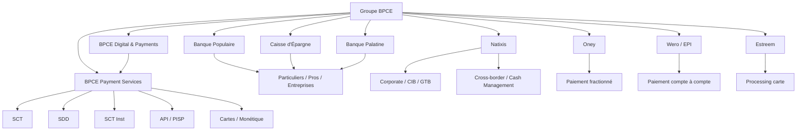

---

## 5. Rôle des principales entités

### 5.1 Banque Populaire et Caisse d’Épargne

Les réseaux Banque Populaire et Caisse d’Épargne sont les points d’entrée clients majeurs pour :

- virements SCT ;
- virements instantanés SCT Inst ;
- prélèvements SDD ;
- paiements carte ;
- services digitaux ;
- Wero ;
- encaissement commerçant ;
- banque à distance ;
- services professionnels et entreprises.

Lecture architecture :

```text
Banque Populaire / Caisse d'Épargne
   =
front client
   +
canaux digitaux
   +
distribution des services paiement
   +
relation particuliers, pros et entreprises
```

Ces réseaux sont exposés aux usages opérationnels : paiement mobile, initiation de virement, notification, relevés, gestion des bénéficiaires, authentification forte, contestations et service client.

### 5.2 BPCE Payment Services

BPCE Payment Services est décrit publiquement comme l’opérateur industriel de paiements du Groupe BPCE. Il accompagne les banques et filiales du groupe ainsi que des clients externes sur les paiements, le processing, les solutions de paiement et les services connectés.

Lecture architecture :

```text
BPCE Payment Services
   =
usine à paiements
   +
processing industriel
   +
orchestration des flux
   +
services API
   +
monétique / cartes
   +
SCT / SDD / SCT Inst
```

Responsabilités typiques dans une lecture SI :

- réception de flux ;
- contrôle et enrichissement ;
- transformation de formats ;
- routage ;
- connexion aux infrastructures ;
- gestion des statuts ;
- supervision ;
- industrialisation ;
- qualité de service ;
- réduction des traitements inutiles.

### 5.3 BPCE Digital & Payments

BPCE Digital & Payments met en synergie les expertises de paiements, financement du commerce, digital, IA, data et innovations technologiques. Les données publiques 2025 indiquent notamment :

- plus de 3 000 collaborateurs en Europe ;
- n°1 du paiement fractionné en France avec Oney ;
- n°2 des paiements en France ;
- plus de 11 milliards de transactions de paiement par an ;
- plus de 30 millions de cartes gérées ;
- plus de 11 millions de clients actifs sur les applications mobiles Banque Populaire et Caisse d’Épargne.

Lecture architecture :

```text
BPCE Digital & Payments
   =
paiements
+
digital
+
data
+
IA
+
innovation
+
industrialisation des usages clients
```

Ces chiffres traduisent une volumétrie industrielle : le sujet paiement doit donc être traité comme une chaîne critique de production, avec performance, résilience, sécurité, observabilité et sobriété.

### 5.4 Natixis

Natixis présente les paiements comme des solutions “payment as a service” couvrant la chaîne de valeur : issuing, acquisition, omnicanal, processing et data.

Dans une lecture architecture, Natixis se positionne notamment sur :

- paiements corporate ;
- cash management ;
- paiements internationaux ;
- paiements multi-devises ;
- banque de financement et d’investissement ;
- clients institutionnels et grandes entreprises ;
- conventions de remise d’ordres ;
- intégration ERP / trésorerie ;
- SWIFT, EBICS, API et reporting.

Lecture architecture :

```text
Natixis
   =
corporate / CIB / GTB
   +
cash management
   +
cross-border
   +
multi-devises
   +
conformité internationale
```

### 5.5 Oney

Oney est une banque spécialisée dans les solutions de paiement et services financiers. Le Groupe BPCE a finalisé en 2019 l’acquisition de 50,1 % du capital d’Oney Bank aux côtés d’Auchan Holding.

Oney est structurant pour :

- paiement fractionné ;
- paiement en plusieurs fois ;
- BNPL ;
- scoring ;
- financement court terme ;
- intégration commerçants ;
- expérience client.

Lecture architecture :

```text
Oney
   =
paiement fractionné
+
scoring risque
+
crédit court terme
+
parcours commerçant
+
échéancier de remboursement
```

### 5.6 Wero / EPI

Wero est le portefeuille de paiement européen porté par EPI. Il s’appuie sur le paiement de compte à compte et le virement instantané. BPCE a annoncé les premières transactions Wero e-commerce en France et le déploiement du service aux clients Banque Populaire et Caisse d’Épargne.

Lecture architecture :

```text
Wero
   =
wallet européen
+
paiement compte à compte
+
SCT Inst
+
authentification mobile
+
expérience temps réel
```

Wero transforme le SCT Inst en moyen de paiement du quotidien : P2P, e-commerce, mobile, puis potentiellement point de vente.

### 5.7 Estreem

Estreem est une coentreprise de BNP Paribas et BPCE dans le processing des paiements carte. Reuters indique que l’entité vise le traitement des paiements cartes de BNP Paribas et du Groupe BPCE en Europe, avec un volume annoncé de 17 milliards de transactions par an.

Lecture architecture :

```text
Estreem
   =
processing carte
+
industrialisation européenne
+
volumétrie massive
+
standardisation technologique
```

### 5.8 BPCE International / Océor

Océor renvoie historiquement aux participations internationales et outre-mer du groupe, ensuite regroupées dans BPCE International et Outre-mer, devenu BPCE International. Dans le cadre d’un référentiel paiements, ce point est utile pour comprendre l’héritage groupe autour :

- de la banque de détail à l’international ;
- des outre-mer ;
- des participations bancaires ;
- des flux internationaux ;
- des besoins de correspondance bancaire ;
- des transferts multi-pays et multi-devises.

Lecture architecture :

```text
Océor / BPCE International
   =
héritage international et outre-mer
+
réseaux bancaires hors métropole
+
flux internationaux
+
besoins cross-border
```

---

## 6. Cartographie des flux BPCE / Natixis

| Flux | Entités concernées | Infrastructure / support | Lecture architecture |
|---|---|---|---|
| SCT | Banque Populaire, Caisse d’Épargne, BPCE Payment Services | SEPA, STET / ACH | batch, volumétrie, cut-off |
| SDD | BP/CE, clients corporate, créanciers | SEPA, STET / ACH | mandat, R-transactions, retours |
| SCT Inst | apps BP/CE, Wero, BPCE Payment Services | TIPS / instant payment | temps réel, idempotence, retry |
| Cross-border | Natixis, CIB, corporate | SWIFT, correspondants | AML, sanctions, devises |
| Cash Management | Natixis GTB, entreprises | camt, EBICS, SWIFT, API | reporting, ERP, réconciliation |
| Carte | BPCE Digital & Payments, Estreem | processing carte | autorisation, clearing, settlement |
| Oney | commerçants, clients, BP/CE pros | carte, scoring, crédit | paiement fractionné, risque |
| PISP | API Store BPCE, BPCE Payment Services | API, SCT/SCT Inst | initiation, consentement, encaissement |
| Wero | BP/CE, EPI, clients mobiles | wallet, SCT Inst | compte à compte, mobile, e-commerce |

---

## 7. Vue fonctionnelle globale

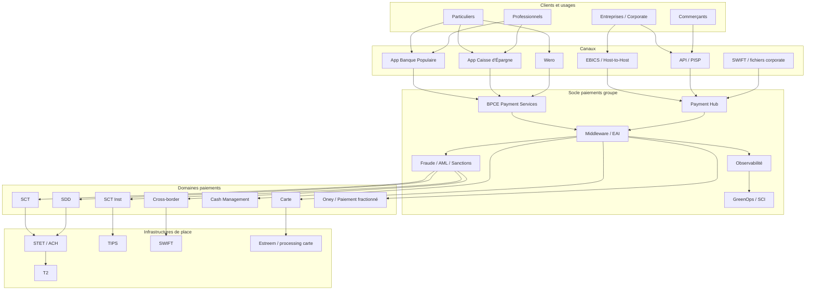

---

## 8. Flux BPCE type — SCT classique

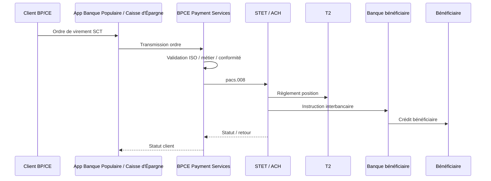

### Points critiques

- qualité IBAN / BIC ;
- cut-off ;
- batchs volumineux ;
- fichiers rejetés ;
- rejets tardifs ;
- relances ;
- logs ;
- réconciliation.

### Lecture GreenOps

Le SCT produit du carbone surtout via :

- batchs lourds ;
- retraitements ;
- replays ;
- logs complets ;
- stockage de fichiers ;
- transformations multiples.

---

## 9. Flux BPCE type — SDD

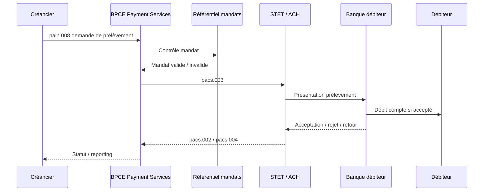

### Points critiques

- mandat ;
- séquence de prélèvement ;
- R-transactions ;
- compte clôturé ;
- fonds insuffisants ;
- contestation ;
- réconciliation.

### Lecture GreenOps

Le SDD produit du carbone surtout via :

- retours ;
- litiges ;
- relances ;
- stockage mandat ;
- réconciliations ;
- conservation longue.

---

## 10. Flux BPCE type — Wero / SCT Inst

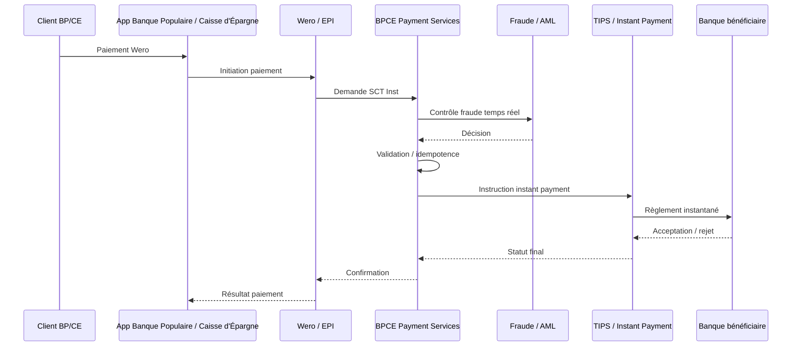

### Points critiques

- latence ;
- authentification ;
- fraude temps réel ;
- retry ;
- idempotence ;
- statut incertain ;
- disponibilité 24/7 ;
- expérience mobile.

### Lecture GreenOps

Le SCT Inst produit du carbone surtout via :

- infrastructure active en continu ;
- redondance ;
- retries ;
- timeouts ;
- monitoring permanent ;
- logs temps réel ;
- contrôles fraude.

---

## 11. Flux Natixis type — paiement corporate international

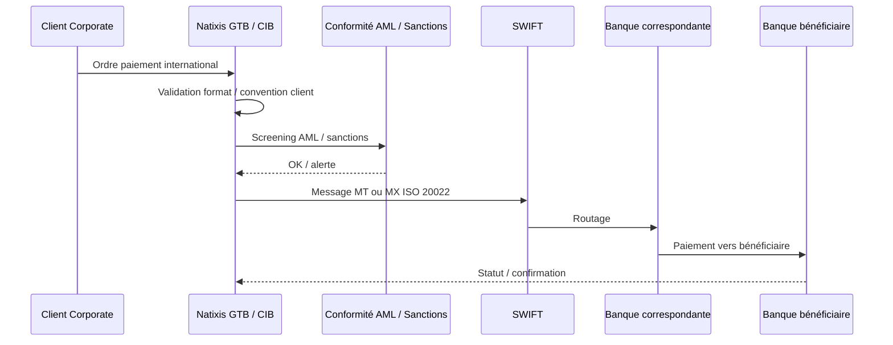

### Points critiques

- formats clients ;
- conventions de remise ;
- devises ;
- banques correspondantes ;
- SWIFT ;
- sanctions ;
- faux positifs ;
- investigations ;
- statuts incomplets ;
- rapprochement cash management.

### Lecture GreenOps

Le cross-border produit du carbone surtout via :

- screening répété ;
- faux positifs ;
- traitements manuels ;
- stockage réglementaire ;
- mapping MT/MX ;
- logs détaillés ;
- investigations.

---

## 12. Flux Oney type — paiement fractionné

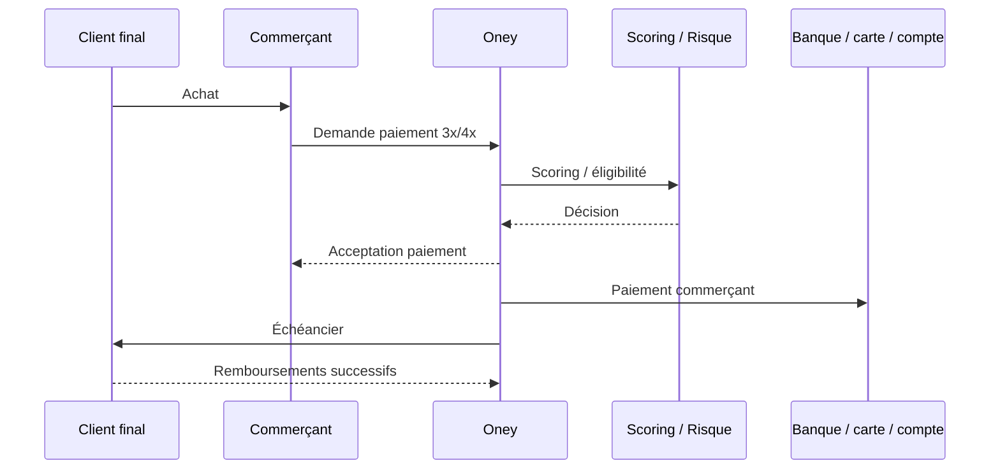

### Points critiques

- scoring ;
- risque crédit ;
- parcours client ;
- autorisation carte ;
- prélèvements futurs ;
- relances ;
- réconciliation commerçant ;
- service client.

### Lecture GreenOps

Le paiement fractionné produit du carbone via :

- scoring ;
- appels référentiels ;
- parcours e-commerce ;
- échéanciers ;
- relances ;
- rejets de prélèvements ;
- notifications.

---

## 13. Flux API / PISP BPCE

Le HUB PISP de BPCE Payment Services permet un encaissement par initiation de paiement au moyen d’un SCT ou SCT Inst validé par le payeur dans son espace bancaire.

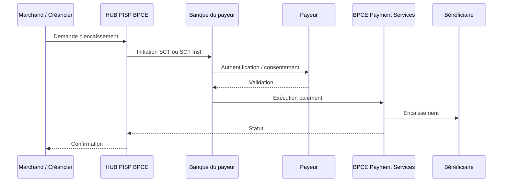

### Lecture architecture

Le PISP se situe entre :

- API ;
- DSP2 ;
- consentement client ;
- authentification forte ;
- SCT / SCT Inst ;
- paiement e-commerce ;
- reporting marchand.

### Lecture GreenOps

Le PISP peut réduire certains coûts liés à la carte, mais introduit :

- appels API ;
- authentification ;
- orchestration temps réel ;
- dépendance à la qualité des statuts ;
- besoin d’observabilité fine.

---

## 14. Flux Cash Management Natixis / Corporate

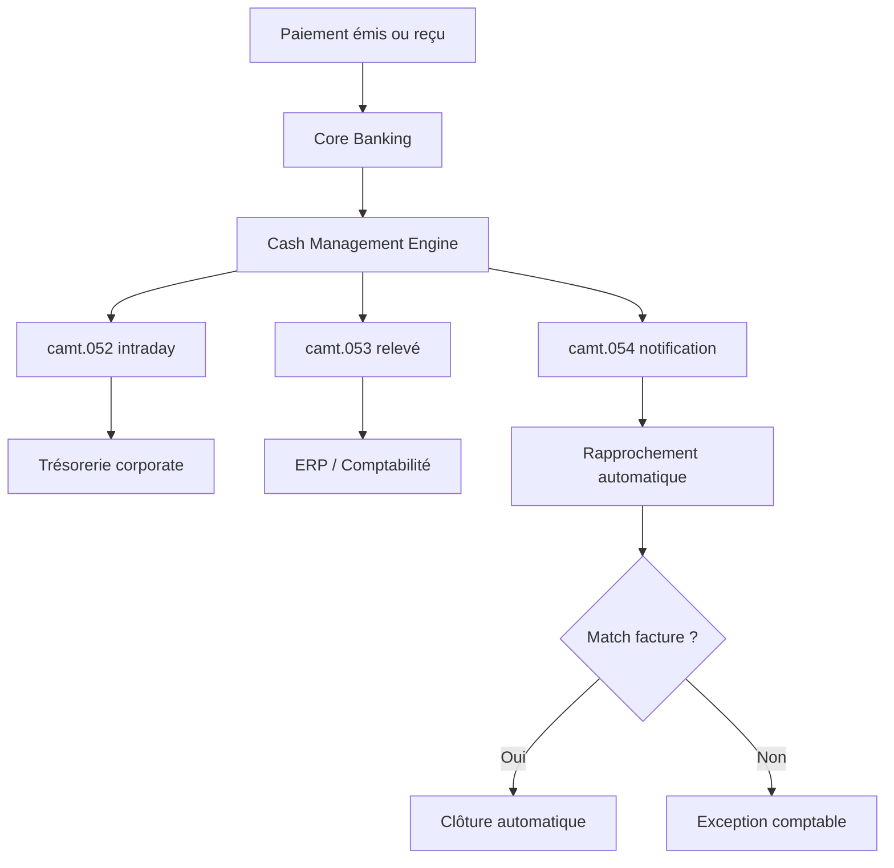

### Points critiques

- EndToEndId ;
- remittance information ;
- formats clients ;
- reporting intraday ;
- relevés complets ;
- ERP ;
- rapprochement ;
- archivage.

### Lecture GreenOps

Le cash management produit du carbone via :

- relevés volumineux ;
- duplication de données ;
- transformations client ;
- stockage ;
- logs ;
- exceptions de rapprochement.

---

## 15. Rôle d’ISO 20022 dans cet écosystème

ISO 20022 fournit le langage commun entre :

- initiation client ;
- interbancaire ;
- reporting ;
- retour ;
- cash management ;
- investigation ;
- conformité.

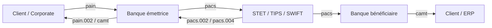

### Enjeux ISO 20022 par entité

| Entité | Enjeux ISO 20022 |
|---|---|
| Banque Populaire / Caisse d’Épargne | qualité données client, virements, notifications, Wero |
| BPCE Payment Services | industrialisation, transformation, routage, supervision |
| Natixis | corporate, cash management, cross-border, CBPR+ |
| Oney | données client, échéanciers, prélèvements associés |
| Wero / EPI | SCT Inst, temps réel, interopérabilité européenne |
| Estreem | standardisation processing carte, reporting, données transactionnelles |

---

## 16. Enjeux réglementaires

| Domaine | Règlement / cadre | Impact |
|---|---|---|
| Paiement instantané | Règlement Instant Payment | disponibilité SCT Inst, coûts, obligation d’accessibilité |
| Open Banking | DSP2 / DSP3 | API, consentement, SCA, PISP |
| Résilience | DORA | tests, incidents, tiers critiques, continuité |
| Durabilité | CSRD | reporting carbone, trajectoire RSE |
| Paiements internationaux | AML / sanctions | screening, conformité, investigations |
| Données | RGPD | données personnelles, conservation, sécurité |

---

## 17. Enjeux GreenOps spécifiques

| Domaine | Source de consommation | Leviers |
|---|---|---|
| SCT | batchs, rejets, logs | validation amont, compression, suppression replays |
| SDD | R-transactions, mandats, retours | qualité mandat, réduction retours, archivage froid |
| SCT Inst | retries, disponibilité 24/7 | idempotence, circuit breaker, maîtrise timeouts |
| Cross-border | AML, faux positifs, mapping | données structurées, screening efficace |
| Cash management | relevés volumineux | delta, compression, STP, réduction formats spécifiques |
| Oney | scoring, échéanciers, relances | automatisation, qualité data, réduction rejets |
| Wero | temps réel, API, mobile | optimisation latence, monitoring, statuts fiables |
| Carte / Estreem | autorisation, clearing, reporting | mutualisation, standardisation, observabilité |

---

## 18. Où se crée l’empreinte carbone

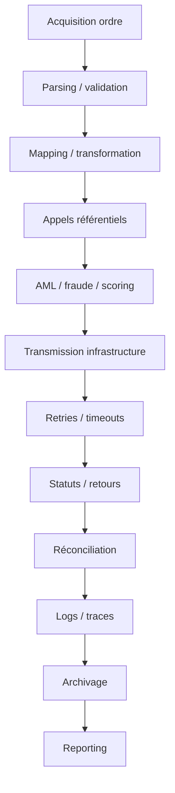

### Principaux gaspillages

| Gaspillage | Exemple | Impact |
|---|---|---|
| Retry SCT Inst | timeout mal géré | CPU, réseau, latence |
| Rejet SDD | mandat invalide | retraitement, litige |
| Faux positif AML | donnée non structurée | investigation |
| Logs XML complets | message stocké plusieurs fois | stockage |
| Mapping multiple | legacy → MT → MX → interne | CPU |
| Batch relancé | fichier SCT rejeté | I/O, CPU |
| Reporting complet inutile | camt complet au lieu de delta | réseau, stockage |

---

## 19. KPI de pilotage

| KPI | Domaine | Objectif |
|---|---|---|
| nombre transactions / jour | métier | volumétrie |
| taux STP | métier / SI | automatisation |
| taux rejet SCT | qualité | réduire retraitements |
| taux R-transactions SDD | qualité / métier | réduire retours |
| taux timeout SCT Inst | SRE | réduire statuts incertains |
| taux retry | SRE / GreenOps | réduire gaspillage |
| P95/P99 latence | performance | maîtriser temps réel |
| taux faux positifs AML | conformité | réduire investigations |
| volume logs / transaction | GreenOps | réduire stockage |
| kWh / 1000 transactions | GreenOps | mesurer énergie |
| gCO2e / transaction | carbone | piloter SCI |
| coût / transaction | FinOps | piloter efficience |

---

## 20. Questions d’audit BPCE / Natixis

| Question | Objectif |
|---|---|
| Quels flux sont opérés par BPCE Payment Services ? | cartographier le socle groupe |
| Quels flux relèvent de Natixis GTB / CIB ? | isoler corporate / cross-border |
| Quelle part de volume revient à SCT, SDD, SCT Inst, carte ? | mesurer la volumétrie |
| Où sont faits les mappings MT / MX / ISO ? | réduire la complexité |
| Où sont les retries SCT Inst ? | réduire la surcharge |
| Quels sont les top motifs de rejet SCT / SDD ? | améliorer le STP |
| Quel est le taux de faux positifs AML ? | optimiser la conformité |
| Quels messages camt sont générés ? | maîtriser le cash management |
| Les logs stockent-ils le XML complet ? | réduire le stockage |
| Où mesurer gCO2e / transaction ? | piloter GreenOps |
| Quels tiers sont critiques DORA ? | piloter la résilience |
| Les infrastructures sont-elles observées de bout en bout ? | réduire les angles morts |

---

## 21. Architecture cible de référence

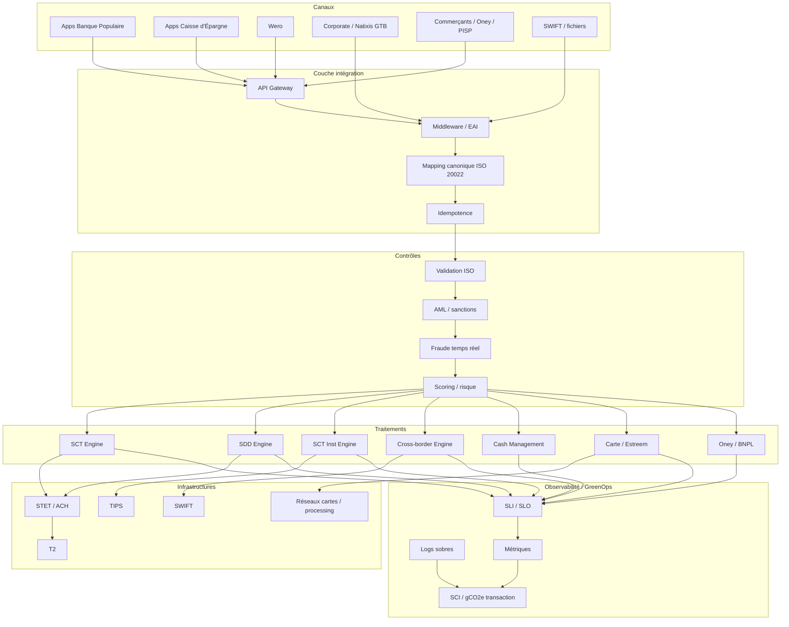

---

## 22. Lecture architecte

L’écosystème paiements BPCE / Natixis doit être lu comme un système distribué industriel.

Il combine :

```text
réseaux de distribution
+
payment factory
+
paiements SEPA
+
paiements instantanés
+
paiements internationaux
+
cash management
+
carte
+
paiement fractionné
+
API / Open Banking
+
conformité
+
observabilité
+
GreenOps
```

Le rôle de l’architecte est de réduire la complexité tout en maintenant la performance, la conformité et la résilience.

---

## 23. Synthèse

L’écosystème BPCE / Natixis est large, distribué, volumineux et critique.

Il couvre :

- les paiements de proximité Banque Populaire et Caisse d’Épargne ;
- le processing industriel via BPCE Payment Services ;
- les paiements corporate, internationaux et cash management via Natixis ;
- le paiement fractionné via Oney ;
- le paiement compte à compte avec Wero ;
- le processing carte avec Estreem ;
- les infrastructures STET, TIPS, T2 et SWIFT.

La cible d’architecture est une chaîne paiement :

- structurée ;
- industrialisée ;
- interopérable ;
- résiliente ;
- observable ;
- pilotée par les données ;
- optimisée en coût ;
- sobre en carbone.

---

## 24. Sources publiques consultées

- Groupe BPCE — Profil du groupe : https://www.groupebpce.com/le-groupe/profil/
- BPCE Digital & Payments — Données clés : https://www.digital-payments.groupebpce.com/donnees-cles/
- BPCE Digital & Payments : https://www.digital-payments.groupebpce.com/
- BPCE Payment Services / recrutement BPCE : https://recrutement.bpce.fr/
- Natixis — Payments : https://natixis.groupebpce.com/payments/
- API Store Groupe BPCE — Encaissement par initiation de paiement : https://apistore.groupebpce.com/fr/api/encaissement-par-initiation-de-paiement
- Newsroom Groupe BPCE — Wero e-commerce : https://newsroom.groupebpce.fr/
- Newsroom Groupe BPCE — acquisition Oney : https://newsroom.groupebpce.fr/
- STET — Instant Payments : https://www.stet.eu/en/solutions/our-services/instant-payments.html
- Banque centrale européenne — TIPS : https://www.ecb.europa.eu/paym/target/tips/
- Reuters — Estreem / BPCE / BNP Paribas : https://www.reuters.com/business/finance/bnp-paribas-bpce-join-forces-payment-processing-2025-02-13/
- Documents publics BPCE International / Océor : sources publiques historiques.
