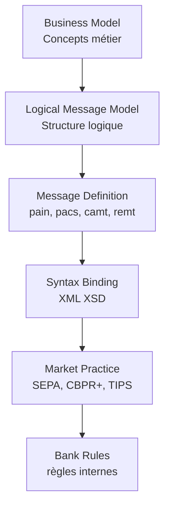

# 01 — Fondamentaux ISO 20022

**Dépôt :** `greenops-it-flux-architecture`  
**Domaine :** ISO 20022 appliqué aux flux de paiements bancaires  
**Niveau :** Architecte solution senior / direction architecture / audit N3  
**Référence interne :** `ISO-01`

## Objectif du document

Expliquer ISO 20022 au-delà du XML : modèle métier, dictionnaire, composants réutilisables, couches de modélisation, impacts SI et impacts GreenOps.

Ce document est écrit comme un livrable exploitable par une squad paiement, une équipe architecture, une production bancaire, une équipe SRE ou une mission de transformation type BPCE / Natixis. Il privilégie les décisions d’architecture, les impacts SI, les risques de production, les contrôles d’audit et les leviers GreenOps.

---


## 1. Pourquoi ISO 20022 existe

ISO 20022 répond à un besoin simple : normaliser les échanges financiers avec une sémantique riche, structurée et extensible. Les formats historiques, notamment les messages SWIFT MT et certains formats propriétaires bancaires, ont rendu de grands services mais présentent plusieurs limites : champs courts, sémantique implicite, informations parfois concaténées, capacité limitée à transporter des données de conformité, difficulté à automatiser les contrôles et hétérogénéité forte selon les banques.

ISO 20022 apporte une approche plus industrielle : les messages sont dérivés d’un modèle métier partagé. Le standard décrit les concepts de paiement, les parties, les comptes, les agents, les montants, les références, les statuts et les informations de conformité avec une structure explicite. Cette richesse facilite l’automatisation, la traçabilité, les contrôles AML/sanctions, le rapprochement comptable et l’intégration avec les API modernes.

## 2. Syntaxe vs sémantique

| Niveau | Question | Exemple | Risque si mal compris |
|---|---|---|---|
| Syntaxe | Le document est-il bien formé ? | Balises XML fermées, encodage UTF-8 | Rejet technique immédiat |
| Schéma | Le XML respecte-t-il le XSD ? | `GrpHdr`, `PmtInf`, `CdtTrfTxInf` présents | Rejet XSD |
| Sémantique ISO | Les données ont-elles le sens attendu ? | `Dbtr` est bien le débiteur | Paiement incohérent |
| Market practice | Le message respecte-t-il SEPA/CBPR+ ? | BIC obligatoire ou optionnel selon contexte | Rejet par infrastructure |
| Règles banque | Le flux respecte-t-il les règles internes ? | Client habilité, plafond, compte actif | Rejet métier |

Un XML peut être parfaitement valide au sens XSD et pourtant être rejeté par STET, TIPS, SWIFT ou le système interne parce qu’une règle métier ou une market practice n’est pas respectée.

## 3. ISO 20022 n’est pas seulement XML

ISO 20022 est souvent résumé à des fichiers XML volumineux. C’est réducteur. Le standard repose sur :

- un modèle métier ;
- un dictionnaire de données ;
- des composants réutilisables ;
- des messages dérivés du modèle ;
- des règles de versioning ;
- des usages par communautés de marché : SEPA, CBPR+, TARGET Services, reporting bancaire.

La syntaxe XML est une représentation. D’autres syntaxes peuvent exister ou être utilisées en interne, notamment JSON pour les API, Avro/Protobuf pour certains bus internes, ou un modèle canonique objet dans un Payment Hub. L’architecture ne doit donc pas confondre le standard métier avec son encodage technique.

## 4. Les couches ISO 20022



## 5. Concepts métier fondamentaux

| Concept | Description | Exemple dans paiement |
|---|---|---|
| Debtor | Partie qui initie ou supporte le débit | Client émetteur d’un virement SCT |
| Creditor | Partie créditée | Bénéficiaire du virement |
| Debtor Agent | Banque du débiteur | Banque Populaire ou Caisse d’Épargne du client |
| Creditor Agent | Banque du bénéficiaire | Banque destinataire |
| Account | Compte bancaire | IBAN du débiteur ou du créditeur |
| Amount | Montant et devise | `InstdAmt Ccy="EUR"` |
| Mandate | Autorisation de prélèvement | Référence de mandat SDD |
| Remittance Information | Motif ou référence de paiement | Facture, salaire, abonnement |

### Exemple simplifié de lecture métier

```xml
<Dbtr>
  <Nm>Entreprise Exemple SAS</Nm>
</Dbtr>
<DbtrAcct>
  <Id><IBAN>FR7612345678901234567890185</IBAN></Id>
</DbtrAcct>
<Cdtr>
  <Nm>Fournisseur Europe GmbH</Nm>
</Cdtr>
<InstdAmt Ccy="EUR">1250.00</InstdAmt>
```

Lecture architecte : ce fragment n’est pas seulement une donnée XML. Il représente une opération métier, des contrôles KYC potentiels, un routage bancaire, une écriture comptable, une trace d’audit et une unité de consommation IT.

## 6. Liens avec SCT, SDD, SCT Inst

| Flux | Message client-banque | Message interbancaire | Particularité |
|---|---|---|---|
| SCT | `pain.001` | `pacs.008` | Virement SEPA classique |
| SDD | `pain.008` | `pacs.003` | Prélèvement avec mandat |
| SCT Inst | `pain.001` ou API | `pacs.008` instantané | Latence très faible, statut immédiat |
| Retour/rejet | `pain.002`, `camt` | `pacs.002`, `pacs.004` | Gestion des statuts et retours |

## 7. Impact SI

ISO 20022 touche plusieurs couches du SI :

- canaux d’acquisition : EBICS, API, portail cash management, host-to-host ;
- validation et contrôle : XSD, SEPA, CBPR+, référentiels, habilitations ;
- transformation : legacy vers ISO, ISO vers canonique, canonique vers ISO ;
- Payment Hub : orchestration, routage, statuts, idempotence ;
- core banking : écritures, soldes, comptes, commissions ;
- conformité : sanctions, AML, fraude ;
- reporting : camt, relevés, avis d’opération ;
- production : supervision, runbooks, rejets, reprises ;
- data : historisation, analytics, audit, GreenOps.

## 8. Impact GreenOps

ISO 20022 peut augmenter la taille des messages et le coût de parsing. Mais il peut aussi réduire les rejets et les retraitements. L’analyse GreenOps doit mesurer le cycle complet :

| Élément | Effet négatif possible | Effet positif possible |
|---|---|---|
| XML riche | Plus de CPU et mémoire | Données plus complètes |
| Validation stricte | Coût XSD/règles | Rejets détectés tôt |
| Remittance structurée | Messages plus lourds | Rapprochement automatique |
| Statuts détaillés | Plus de stockage | Moins de diagnostic manuel |
| Canonical model | Transformation initiale | Réduction du spaghetti mapping |

## 9. Décisions d’architecture recommandées

1. Définir un modèle canonique interne indépendant des versions ISO.
2. Externaliser les règles de validation configurables lorsque c’est pertinent.
3. Tracer systématiquement `MessageId`, `EndToEndId`, `TxId`, `UETR` si applicable, et `correlationId` interne.
4. Mesurer `CPU/message`, `latence P95/P99`, `taux de rejet`, `retries`, `volume logs/message`.
5. Documenter les versions supportées par canal, produit et infrastructure.

---

## Synthèse architecte

Un programme ISO 20022 réussi ne se limite pas à changer des fichiers XML. Il impose une gouvernance de la donnée paiement, une stratégie de validation, un modèle canonique, une observabilité de bout en bout, une gestion stricte des versions et une mesure continue du coût opérationnel. Dans une banque de flux, les gains les plus importants viennent généralement de la réduction des rejets tardifs, de la diminution des mappings point-à-point, de la maîtrise des logs et de la capacité à diagnostiquer rapidement un paiement avec ses identifiants de corrélation.

## Points de vigilance récurrents

| Risque | Symptôme | Conséquence | Mesure de prévention |
|---|---|---|---|
| Confusion syntaxe / sémantique | XML valide mais paiement rejeté | Incident métier | Règles métier et market practice en plus du XSD |
| Mapping point-à-point | Multiplication des transformations | Coût, dette, erreurs | Modèle canonique gouverné |
| Validation tardive | Rejet après plusieurs étapes | Retraitements, carbone inutile | Validation amont et contrats d’interface |
| Version mal maîtrisée | Clients ou infrastructures désalignés | Rejets massifs | Catalogue de versions et tests de non-régression |
| Observabilité insuffisante | Paiement introuvable | MTTR élevé | MessageId, EndToEndId, TxId, correlationId partout |
| Logs excessifs | Volumes énormes | Coût stockage et empreinte carbone | Logs structurés, sampling, rétention adaptée |


## Annexe — métriques minimales recommandées

| Métrique | Label minimal | Utilisation |
|---|---|---|
| `payment_messages_total` | flux, message_type, version, channel | Volumétrie métier |
| `payment_rejections_total` | flux, rejection_stage, reason_code | Qualité et incidents |
| `payment_processing_duration_seconds` | flux, step, percentile | Performance SRE |
| `payment_payload_size_bytes` | message_type, version | GreenOps et capacité |
| `payment_retry_total` | service, reason | Résilience et gaspillage |
| `payment_log_bytes_total` | service, flux | Coût logs |

## Annexe — questions de revue d’architecture

- La solution distingue-t-elle clairement le format externe et le modèle interne ?
- Les règles de validation sont-elles traçables, versionnées et testées ?
- Les identifiants de corrélation sont-ils propagés sans rupture ?
- Le traitement peut-il être diagnostiqué sans lire le payload complet ?
- Les anciennes versions ont-elles une date de fin de vie ?
- Les flux batch et temps réel sont-ils séparés dans l’architecture et les SLO ?
- Les métriques GreenOps permettent-elles de prioriser des actions concrètes ?
- Les runbooks sont-ils testés et reliés aux alertes ?
