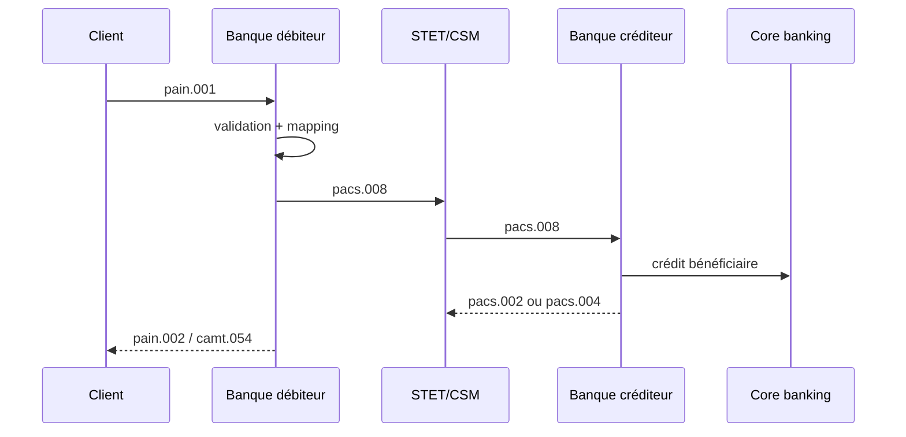
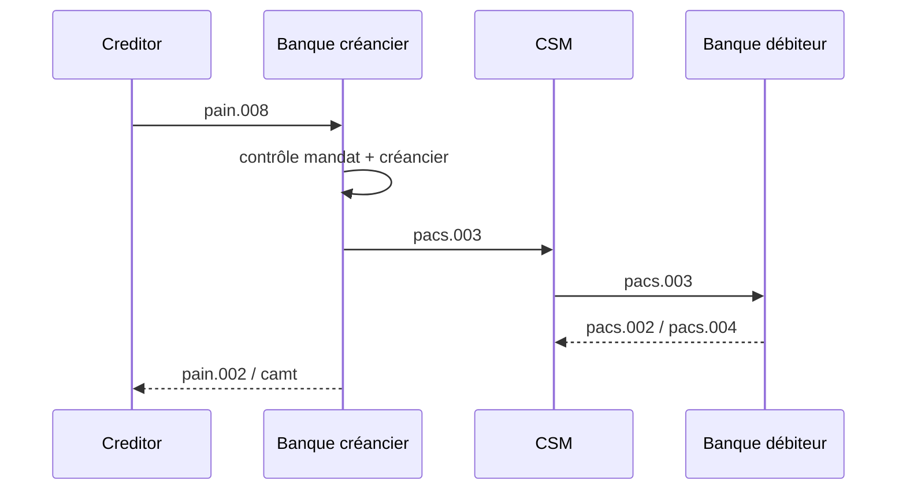
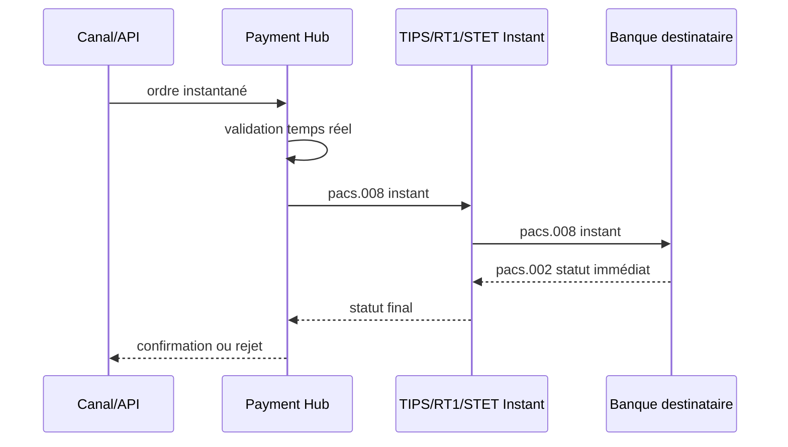

# 02 — Messages de paiements ISO 20022

**Dépôt :** `greenops-it-flux-architecture`  
**Domaine :** ISO 20022 appliqué aux flux de paiements bancaires  
**Niveau :** Architecte solution senior / direction architecture / audit N3  
**Référence interne :** `ISO-02`

## Objectif du document

Détailler les familles pain, pacs, camt, remt, leurs usages dans SCT, SDD, SCT Inst, cross-border et cash management, ainsi que les identifiants de corrélation.

Ce document est écrit comme un livrable exploitable par une squad paiement, une équipe architecture, une production bancaire, une équipe SRE ou une mission de transformation type BPCE / Natixis. Il privilégie les décisions d’architecture, les impacts SI, les risques de production, les contrôles d’audit et les leviers GreenOps.

---

## 1. Familles de messages

| Famille | Signification | Usage principal |
|---|---|---|
| `pain` | Payment Initiation | Messages client-banque : initiation, prélèvement, statut client |
| `pacs` | Payments Clearing and Settlement | Messages interbancaires : compensation, règlement, retours |
| `camt` | Cash Management | Relevés, avis, investigation, reporting de compte |
| `remt` | Remittance Advice | Informations de règlement et rapprochement détaillé |

## 2. Business Application Header

Le Business Application Header, souvent appelé BAH, transporte des métadonnées d’enveloppe : émetteur, destinataire, identifiant business, type de message, date de création. Dans une architecture bancaire, il sert à router, tracer, filtrer et diagnostiquer les messages indépendamment du corps métier.

## 3. Messages pain

| Message | Usage | Exemples |
|---|---|---|
| `pain.001` | Customer Credit Transfer Initiation | Virement SCT, virement trésorerie, initiation masse |
| `pain.002` | Customer Payment Status Report | Accepté, rejeté, partiellement accepté |
| `pain.008` | Customer Direct Debit Initiation | SDD Core, SDD B2B, prélèvement récurrent |

### `pain.001`

`pain.001` est utilisé pour initier des virements depuis un client vers sa banque. Il contient un `GroupHeader`, un ou plusieurs blocs `PaymentInformation`, puis une ou plusieurs transactions.

Points critiques :

- `MsgId` : identifiant du message client-banque ;
- `PmtInfId` : identifiant du lot ;
- `EndToEndId` : référence de bout en bout portée jusqu’au bénéficiaire ;
- `ReqdExctnDt` : date d’exécution demandée ;
- `Dbtr`, `DbtrAcct`, `DbtrAgt` ;
- `Cdtr`, `CdtrAcct`, `CdtrAgt` ;
- `RmtInf` : motif de paiement.

### `pain.002`

`pain.002` restitue le statut du message ou des transactions. Il est essentiel pour les portails cash management et les clients corporate.

| Statut | Sens général | Action SI |
|---|---|---|
| `ACCP` | Accepted Customer Profile | Continuer traitement |
| `ACSP` | Accepted Settlement In Process | Paiement accepté pour traitement |
| `RJCT` | Rejected | Informer client, analyser motif |
| `PART` | Partially Accepted | Traitement transaction par transaction |

### `pain.008`

`pain.008` transporte les prélèvements initiés par un créancier. Les champs mandat sont critiques : référence de mandat, date de signature, type de séquence, identifiant créancier SEPA.

## 4. Messages pacs

| Message | Usage | Flux typique |
|---|---|---|
| `pacs.008` | FI to FI Customer Credit Transfer | SCT, SCT Inst, cross-border CBPR+ |
| `pacs.003` | FI to FI Customer Direct Debit | SDD interbancaire |
| `pacs.002` | FI to FI Payment Status Report | Statut interbancaire |
| `pacs.004` | Payment Return | Retour de paiement |
| `pacs.009` | Financial Institution Credit Transfer | Banque à banque, trésorerie interbancaire |

### `pacs.008`

Message central des virements interbancaires. Pour SCT Inst, la latence et le statut immédiat deviennent critiques. Pour cross-border CBPR+, la richesse des données de parties, agents et conformité est beaucoup plus importante.

### `pacs.003`

Message interbancaire de prélèvement. La qualité du mandat et la cohérence entre créancier, débiteur, banque et dates sont essentielles.

### `pacs.002`

Message de statut interbancaire. Il permet de savoir si l’infrastructure ou la banque destinataire accepte ou rejette la transaction. C’est un point clé pour la supervision.

## 5. Messages camt

| Message | Usage | Exemple métier |
|---|---|---|
| `camt.052` | Intraday account report | Suivi des mouvements intra-journée |
| `camt.053` | Bank-to-customer statement | Relevé de compte fin de journée |
| `camt.054` | Debit/credit notification | Avis d’opération |
| `camt.056` | FI to FI payment cancellation request | Demande d’annulation/investigation |

Les messages camt sont souvent sous-estimés. Ils concentrent des enjeux de volumétrie, de rapprochement comptable, de restitution client et de stockage long terme.

## 6. Cycles de paiement

### SCT

### SDD

### SCT Inst

## 7. Corrélation des identifiants

| Identifiant | Portée | Usage diagnostic |
|---|---|---|
| `MsgId` | Message ou fichier | Retrouver un lot client |
| `PmtInfId` | Bloc paiement | Diagnostiquer un sous-lot |
| `EndToEndId` | Transaction client | Référence visible client/bénéficiaire |
| `TxId` | Transaction interbancaire | Corrélation infrastructure |
| `UETR` | Cross-border | Suivi gpi / paiement international |
| `correlationId` | SI interne | Trace distribuée et logs |

## 8. Erreurs fréquentes et impacts GreenOps

| Erreur | Effet métier | Effet GreenOps |
|---|---|---|
| `EndToEndId` dupliqué | Idempotence ambiguë | Retries inutiles |
| `pain.002` incomplet | Client sans statut clair | Appels support, retraitements |
| Mapping `pain.001` vers `pacs.008` partiel | Rejet interbancaire | CPU et logs gaspillés |
| `camt.053` trop volumineux | Batch long | Stockage et I/O élevés |
| Statuts non normalisés | Supervision confuse | MTTR élevé |

---

## Synthèse architecte

Un programme ISO 20022 réussi ne se limite pas à changer des fichiers XML. Il impose une gouvernance de la donnée paiement, une stratégie de validation, un modèle canonique, une observabilité de bout en bout, une gestion stricte des versions et une mesure continue du coût opérationnel. Dans une banque de flux, les gains les plus importants viennent généralement de la réduction des rejets tardifs, de la diminution des mappings point-à-point, de la maîtrise des logs et de la capacité à diagnostiquer rapidement un paiement avec ses identifiants de corrélation.

## Points de vigilance récurrents

| Risque | Symptôme | Conséquence | Mesure de prévention |
|---|---|---|---|
| Confusion syntaxe / sémantique | XML valide mais paiement rejeté | Incident métier | Règles métier et market practice en plus du XSD |
| Mapping point-à-point | Multiplication des transformations | Coût, dette, erreurs | Modèle canonique gouverné |
| Validation tardive | Rejet après plusieurs étapes | Retraitements, carbone inutile | Validation amont et contrats d’interface |
| Version mal maîtrisée | Clients ou infrastructures désalignés | Rejets massifs | Catalogue de versions et tests de non-régression |
| Observabilité insuffisante | Paiement introuvable | MTTR élevé | MessageId, EndToEndId, TxId, correlationId partout |
| Logs excessifs | Volumes énormes | Coût stockage et empreinte carbone | Logs structurés, sampling, rétention adaptée |

## Annexe — métriques minimales recommandées

| Métrique | Label minimal | Utilisation |
|---|---|---|
| `payment_messages_total` | flux, message_type, version, channel | Volumétrie métier |
| `payment_rejections_total` | flux, rejection_stage, reason_code | Qualité et incidents |
| `payment_processing_duration_seconds` | flux, step, percentile | Performance SRE |
| `payment_payload_size_bytes` | message_type, version | GreenOps et capacité |
| `payment_retry_total` | service, reason | Résilience et gaspillage |
| `payment_log_bytes_total` | service, flux | Coût logs |

## Annexe — questions de revue d’architecture

- La solution distingue-t-elle clairement le format externe et le modèle interne ?
- Les règles de validation sont-elles traçables, versionnées et testées ?
- Les identifiants de corrélation sont-ils propagés sans rupture ?
- Le traitement peut-il être diagnostiqué sans lire le payload complet ?
- Les anciennes versions ont-elles une date de fin de vie ?
- Les flux batch et temps réel sont-ils séparés dans l’architecture et les SLO ?
- Les métriques GreenOps permettent-elles de prioriser des actions concrètes ?
- Les runbooks sont-ils testés et reliés aux alertes ?
