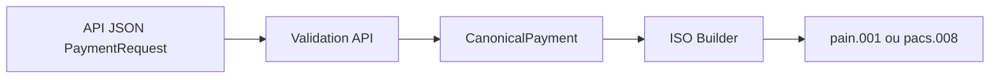
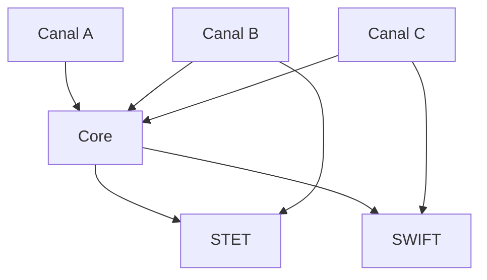
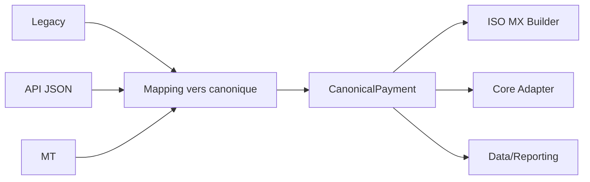

# 03 — Mapping et transformation ISO 20022

**Dépôt :** `greenops-it-flux-architecture`  
**Domaine :** ISO 20022 appliqué aux flux de paiements bancaires  
**Niveau :** Architecte solution senior / direction architecture / audit N3  
**Référence interne :** `ISO-03`

## Objectif du document

Définir une stratégie de mapping robuste entre legacy, MT, MX, API JSON, modèle canonique et systèmes internes, en limitant la dette technique et les impacts carbone.

Ce document est écrit comme un livrable exploitable par une squad paiement, une équipe architecture, une production bancaire, une équipe SRE ou une mission de transformation type BPCE / Natixis. Il privilégie les décisions d’architecture, les impacts SI, les risques de production, les contrôles d’audit et les leviers GreenOps.

---

## 1. Pourquoi le mapping existe

Dans une banque, aucun système n’utilise exactement le même modèle de données : canaux clients, core banking, moteurs de fraude, conformité, comptabilité, infrastructures SEPA, SWIFT, reporting et data platforms ont chacun leurs formats. Le mapping est donc inévitable. Le problème n’est pas son existence, mais son industrialisation.

## 2. Types de mapping

| Type | Description | Exemple |
|---|---|---|
| Syntaxique | Conversion de structure | XML vers objet Java, JSON vers canonique |
| Sémantique | Conversion de sens | Champ `OrderingCustomer` MT vers `Dbtr` ISO |
| Référentiel | Enrichissement par référentiel | BIC à partir d’un IBAN, pays, banque |
| Technique | Adaptation de protocole | API REST vers message bus |
| Réglementaire | Adaptation market practice | CBPR+ exige certains champs structurés |

## 3. MT vers MX

La migration MT vers MX n’est pas une traduction mécanique. Les messages MT sont souvent compacts et porteurs d’informations concaténées. Les messages MX imposent une structuration plus riche.

### Exemple conceptuel MT103 vers pacs.008

| MT103 | Sens | pacs.008 cible | Commentaire |
|---|---|---|---|
| `:20:` | Transaction Reference | `GrpHdr/MsgId` ou référence interne | Attention portée message vs transaction |
| `:32A:` | Date/devise/montant | `IntrBkSttlmDt`, `IntrBkSttlmAmt` | Découpage obligatoire |
| `:50K:` | Ordering Customer | `Dbtr` + `DbtrAcct` | Données parfois non structurées |
| `:52A:` | Ordering Institution | `DbtrAgt` | BIC à normaliser |
| `:57A:` | Account With Institution | `CdtrAgt` | Routage |
| `:59:` | Beneficiary Customer | `Cdtr` + `CdtrAcct` | Risque de troncature |
| `:70:` | Remittance Information | `RmtInf` | Structuré ou non structuré |

## 4. Legacy vers ISO

Les systèmes legacy contiennent souvent des champs courts, des codes internes, des dates au format propriétaire, des référentiels locaux et des règles implicites. La transformation vers ISO impose de rendre explicite ce qui était implicite.

| Donnée legacy | Problème | Action d’architecture |
|---|---|---|
| Code banque interne | Non reconnu par CSM | Mapping référentiel vers BIC/clearing code |
| Nom bénéficiaire tronqué | Perte d’information | Règle de qualité et contrôle client |
| Motif libre | Ambigu | Normalisation remittance |
| Statut interne | Non standard | Table de correspondance vers ISO status |

## 5. API JSON vers ISO

Les API modernes exposent souvent des ressources JSON plus simples que les messages ISO. L’API doit éviter d’exposer toute la complexité XML au client, mais elle doit conserver les informations nécessaires au message final.

## 6. Anti-pattern mapping point-à-point

Ce modèle devient rapidement ingérable : chaque nouveau canal ou format ajoute des mappings spécifiques. Les règles métier sont dupliquées, les tests explosent, les incidents deviennent difficiles à diagnostiquer.

## 7. Pattern recommandé : canonique

## 8. Enrichissement et perte de données

Le mapping doit explicitement gérer :

- champs obligatoires non disponibles ;
- champs legacy plus courts que ISO ou inversement ;
- noms et adresses non structurés ;
- caractères interdits ;
- devise ou pays absents ;
- références de mandat SDD incomplètes ;
- informations de conformité manquantes ;
- différence entre date demandée, date de règlement et date comptable.

## 9. Exemple pain.001 vers pacs.008

| pain.001 | pacs.008 | Règle |
|---|---|---|
| `GrpHdr/MsgId` | `GrpHdr/MsgId` | Peut être régénéré interbancairement |
| `PmtInf/Dbtr` | `CdtTrfTxInf/Dbtr` | Débiteur conservé |
| `PmtInf/DbtrAcct` | `CdtTrfTxInf/DbtrAcct` | IBAN contrôlé |
| `CdtTrfTxInf/Cdtr` | `CdtTrfTxInf/Cdtr` | Bénéficiaire conservé |
| `EndToEndId` | `EndToEndId` | Ne pas écraser |
| `InstdAmt` | `IntrBkSttlmAmt` | Peut différer selon frais/change |

## 10. Erreurs courantes

| Erreur | Cause | Impact |
|---|---|---|
| Confusion `MsgId` / `EndToEndId` | Mauvaise portée identifiant | Diagnostic impossible |
| Troncature silencieuse | Champs legacy trop courts | Rejet ou litige |
| Valeur par défaut abusive | Donnée obligatoire absente | Faux positifs contrôle |
| Mapping sans traçabilité | Pas de version de mapping | Incident difficile à reproduire |
| Règles dupliquées | Plusieurs moteurs | Divergence production |

## 11. Performance et GreenOps

Chaque transformation consomme CPU, mémoire et I/O. Les architectures avec 5 à 8 mappings successifs par transaction peuvent devenir coûteuses à grande échelle. La mesure doit inclure :

- nombre de transformations par message ;
- temps moyen de transformation ;
- taux d’erreur par règle ;
- volume de logs générés par mapping ;
- retries causés par erreurs de mapping ;
- nombre de rejets tardifs évitables.

| Optimisation | Gain attendu |
|---|---|
| Centraliser les mappings autour du canonique | Réduction de la dette et des tests |
| Valider avant transformation lourde | Moins de CPU gaspillé |
| Versionner les règles de mapping | Reproductibilité incident |
| Éviter logs payload complets | Moins de stockage et risque sécurité |

---

## Synthèse architecte

Un programme ISO 20022 réussi ne se limite pas à changer des fichiers XML. Il impose une gouvernance de la donnée paiement, une stratégie de validation, un modèle canonique, une observabilité de bout en bout, une gestion stricte des versions et une mesure continue du coût opérationnel. Dans une banque de flux, les gains les plus importants viennent généralement de la réduction des rejets tardifs, de la diminution des mappings point-à-point, de la maîtrise des logs et de la capacité à diagnostiquer rapidement un paiement avec ses identifiants de corrélation.

## Points de vigilance récurrents

| Risque | Symptôme | Conséquence | Mesure de prévention |
|---|---|---|---|
| Confusion syntaxe / sémantique | XML valide mais paiement rejeté | Incident métier | Règles métier et market practice en plus du XSD |
| Mapping point-à-point | Multiplication des transformations | Coût, dette, erreurs | Modèle canonique gouverné |
| Validation tardive | Rejet après plusieurs étapes | Retraitements, carbone inutile | Validation amont et contrats d’interface |
| Version mal maîtrisée | Clients ou infrastructures désalignés | Rejets massifs | Catalogue de versions et tests de non-régression |
| Observabilité insuffisante | Paiement introuvable | MTTR élevé | MessageId, EndToEndId, TxId, correlationId partout |
| Logs excessifs | Volumes énormes | Coût stockage et empreinte carbone | Logs structurés, sampling, rétention adaptée |

## Annexe — métriques minimales recommandées

| Métrique | Label minimal | Utilisation |
|---|---|---|
| `payment_messages_total` | flux, message_type, version, channel | Volumétrie métier |
| `payment_rejections_total` | flux, rejection_stage, reason_code | Qualité et incidents |
| `payment_processing_duration_seconds` | flux, step, percentile | Performance SRE |
| `payment_payload_size_bytes` | message_type, version | GreenOps et capacité |
| `payment_retry_total` | service, reason | Résilience et gaspillage |
| `payment_log_bytes_total` | service, flux | Coût logs |

## Annexe — questions de revue d’architecture

- La solution distingue-t-elle clairement le format externe et le modèle interne ?
- Les règles de validation sont-elles traçables, versionnées et testées ?
- Les identifiants de corrélation sont-ils propagés sans rupture ?
- Le traitement peut-il être diagnostiqué sans lire le payload complet ?
- Les anciennes versions ont-elles une date de fin de vie ?
- Les flux batch et temps réel sont-ils séparés dans l’architecture et les SLO ?
- Les métriques GreenOps permettent-elles de prioriser des actions concrètes ?
- Les runbooks sont-ils testés et reliés aux alertes ?
