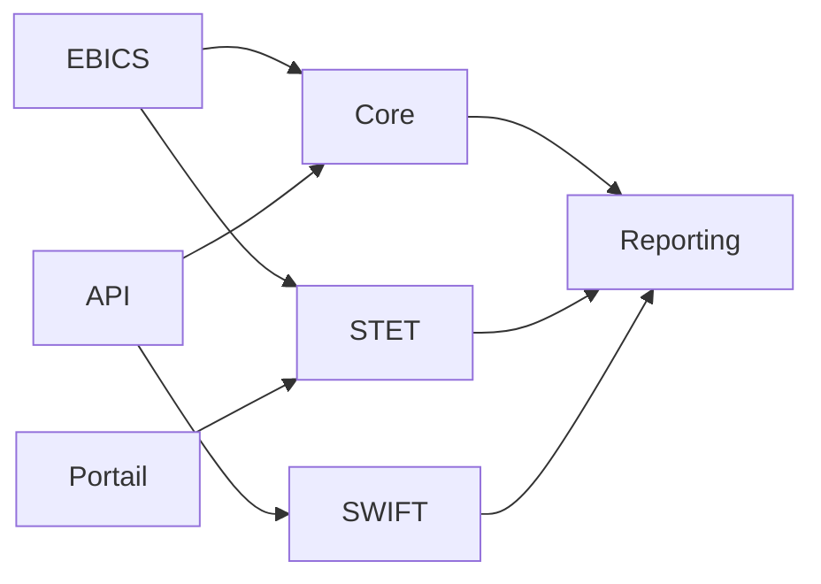
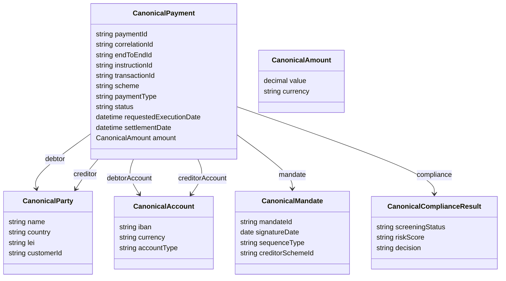

# 04 — Modèle canonique paiement

**Dépôt :** `greenops-it-flux-architecture`  
**Domaine :** ISO 20022 appliqué aux flux de paiements bancaires  
**Niveau :** Architecte solution senior / direction architecture / audit N3  
**Référence interne :** `ISO-04`

## Objectif du document

Décrire un modèle canonique robuste pour réduire le spaghetti mapping, unifier les règles, faciliter l’observabilité, l’idempotence, le versioning et la mesure GreenOps.

Ce document est écrit comme un livrable exploitable par une squad paiement, une équipe architecture, une production bancaire, une équipe SRE ou une mission de transformation type BPCE / Natixis. Il privilégie les décisions d’architecture, les impacts SI, les risques de production, les contrôles d’audit et les leviers GreenOps.

---

## 1. Pourquoi un modèle canonique

Un modèle canonique permet de découpler les systèmes internes des formats externes. Il sert de langage commun entre canaux, Payment Hub, core banking, conformité, fraude, reporting, observabilité et infrastructures de paiement.

Sans modèle canonique, chaque intégration devient un mapping spécifique. Cela augmente la dette technique, le coût de test, les incidents et les retraitements.

## 2. Anti-pattern spaghetti mapping

## 3. Modèle cible

## 4. Entités principales

### CanonicalPayment

| Champ | Rôle | Exemple |
|---|---|---|
| `paymentId` | Identifiant interne stable | UUID interne |
| `correlationId` | Trace distribuée | ID OpenTelemetry |
| `endToEndId` | Référence client | Facture ou référence corporate |
| `transactionId` | Référence interbancaire | TxId pacs |
| `scheme` | Schéma | SCT, SDD, SCT_INST, CBPR |
| `status` | Statut interne | `VALIDATED`, `SENT`, `SETTLED`, `REJECTED` |

### CanonicalParty

Contient les informations sur débiteur, créditeur, agents, institutions et éventuellement parties ultimes. Il doit prévoir une représentation structurée et non structurée pour gérer les migrations MT/MX.

### CanonicalAccount

Doit gérer IBAN, BBAN, comptes internes, devises et attributs de contrôle. Les règles de validation IBAN ne doivent pas être enfouies dans le mapping.

### CanonicalAmount

Doit distinguer montant instruit, montant interbancaire, frais, change et montant comptable.

### CanonicalStatus

| Statut interne | Sens | Statut ISO possible |
|---|---|---|
| `RECEIVED` | Reçu du canal | Aucun ou `RCVD` |
| `VALIDATED` | Validé interne | `ACCP` |
| `SENT_TO_CLEARING` | Envoyé infrastructure | `ACSP` |
| `SETTLED` | Réglé | `ACSC` |
| `REJECTED` | Rejeté | `RJCT` |
| `RETURNED` | Retourné | pacs.004 |

## 5. Idempotence

Le modèle canonique doit porter une clé d’idempotence robuste. Pour SCT et SDD, elle peut combiner : client, canal, `MsgId`, `PmtInfId`, `EndToEndId`, montant, IBAN débiteur, IBAN créditeur et date. Pour SCT Inst, l’idempotence doit être temps réel et compatible avec les retries réseau.

## 6. Observabilité native

Chaque paiement doit transporter :

- `correlationId` ;
- `traceId` technique ;
- `messageId` source ;
- `endToEndId` ;
- `transactionId` ;
- `scheme` ;
- `channel` ;
- `version` du modèle ;
- `mappingVersion` ;
- `validationProfile`.

## 7. GreenOps native

Ajouter des champs de mesure ou des métriques dérivées :

| Métrique | Objectif |
|---|---|
| `transformCount` | Nombre de transformations subies |
| `validationCostMs` | Coût de validation |
| `payloadSizeBytes` | Taille message |
| `logSizeBytes` | Coût observabilité |
| `retryCount` | Détection gaspillage |
| `rejectionStage` | Rejet tôt ou tardif |

## 8. Versioning du modèle

Le modèle canonique doit évoluer indépendamment des versions `pain.001.001.03`, `pain.001.001.09`, `pacs.008` ou CBPR+. Une stratégie saine :

- version majeure pour rupture ;
- version mineure pour ajout compatible ;
- version de mapping distincte ;
- contrat de compatibilité par canal ;
- tests de non-régression par schéma et par market practice.

## 9. Gouvernance

| Décision | Responsable | Preuve attendue |
|---|---|---|
| Ajout champ canonique | Architecture paiement | ADR + impact mapping |
| Dépréciation champ | Design Authority | Plan migration |
| Nouvelle version ISO | Product owner paiement + architecture | Dossier de compatibilité |
| Changement statut | Production + métier | Runbook et tests |

## 10. Avantages et risques

| Avantage | Risque | Mitigation |
|---|---|---|
| Réduction des mappings | Modèle trop générique | Gouvernance stricte |
| Observabilité unifiée | Sur-ingénierie | Démarrer par flux critiques |
| Indépendance versions ISO | Divergence avec standard | Tests de conformité |
| GreenOps intégré | Métriques trop nombreuses | KPI sobres et actionnables |

---

## Synthèse architecte

Un programme ISO 20022 réussi ne se limite pas à changer des fichiers XML. Il impose une gouvernance de la donnée paiement, une stratégie de validation, un modèle canonique, une observabilité de bout en bout, une gestion stricte des versions et une mesure continue du coût opérationnel. Dans une banque de flux, les gains les plus importants viennent généralement de la réduction des rejets tardifs, de la diminution des mappings point-à-point, de la maîtrise des logs et de la capacité à diagnostiquer rapidement un paiement avec ses identifiants de corrélation.

## Points de vigilance récurrents

| Risque | Symptôme | Conséquence | Mesure de prévention |
|---|---|---|---|
| Confusion syntaxe / sémantique | XML valide mais paiement rejeté | Incident métier | Règles métier et market practice en plus du XSD |
| Mapping point-à-point | Multiplication des transformations | Coût, dette, erreurs | Modèle canonique gouverné |
| Validation tardive | Rejet après plusieurs étapes | Retraitements, carbone inutile | Validation amont et contrats d’interface |
| Version mal maîtrisée | Clients ou infrastructures désalignés | Rejets massifs | Catalogue de versions et tests de non-régression |
| Observabilité insuffisante | Paiement introuvable | MTTR élevé | MessageId, EndToEndId, TxId, correlationId partout |
| Logs excessifs | Volumes énormes | Coût stockage et empreinte carbone | Logs structurés, sampling, rétention adaptée |

## Annexe — métriques minimales recommandées

| Métrique | Label minimal | Utilisation |
|---|---|---|
| `payment_messages_total` | flux, message_type, version, channel | Volumétrie métier |
| `payment_rejections_total` | flux, rejection_stage, reason_code | Qualité et incidents |
| `payment_processing_duration_seconds` | flux, step, percentile | Performance SRE |
| `payment_payload_size_bytes` | message_type, version | GreenOps et capacité |
| `payment_retry_total` | service, reason | Résilience et gaspillage |
| `payment_log_bytes_total` | service, flux | Coût logs |

## Annexe — questions de revue d’architecture

- La solution distingue-t-elle clairement le format externe et le modèle interne ?
- Les règles de validation sont-elles traçables, versionnées et testées ?
- Les identifiants de corrélation sont-ils propagés sans rupture ?
- Le traitement peut-il être diagnostiqué sans lire le payload complet ?
- Les anciennes versions ont-elles une date de fin de vie ?
- Les flux batch et temps réel sont-ils séparés dans l’architecture et les SLO ?
- Les métriques GreenOps permettent-elles de prioriser des actions concrètes ?
- Les runbooks sont-ils testés et reliés aux alertes ?
