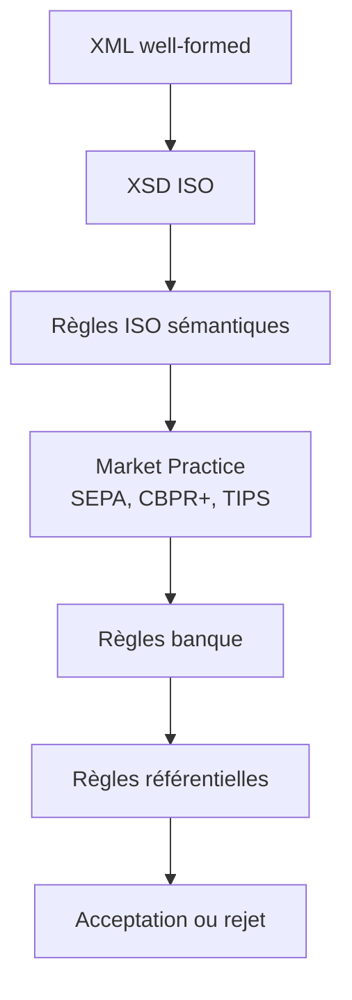
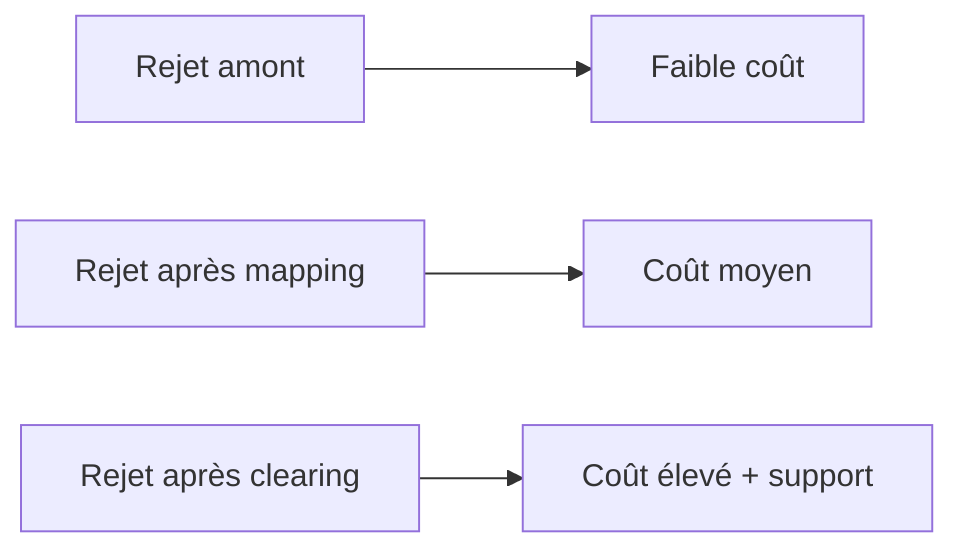

# 05 — Validation XML, ISO, SEPA, CBPR+ et métier

**Dépôt :** `greenops-it-flux-architecture`  
**Domaine :** ISO 20022 appliqué aux flux de paiements bancaires  
**Niveau :** Architecte solution senior / direction architecture / audit N3  
**Référence interne :** `ISO-05`

## Objectif du document

Industrialiser la validation des messages ISO 20022 en distinguant well-formed XML, XSD, règles ISO, market practices, règles banque et règles référentielles.

Ce document est écrit comme un livrable exploitable par une squad paiement, une équipe architecture, une production bancaire, une équipe SRE ou une mission de transformation type BPCE / Natixis. Il privilégie les décisions d’architecture, les impacts SI, les risques de production, les contrôles d’audit et les leviers GreenOps.

---


## 1. Les couches de validation



## 2. XML well-formed

Un XML est well-formed si sa structure est correcte : balises fermées, imbrication correcte, encodage cohérent, caractères autorisés. C’est le niveau minimal.

### Exemple invalide

```xml
<Document>
  <CstmrCdtTrfInitn>
    <GrpHdr>
      <MsgId>ABC123</MsgId>
    </GrpHdr>
  </CstmrCdtTrfInitn>
<!-- Document non fermé -->
```

Impact : rejet technique immédiat. Aucune interprétation métier fiable n’est possible.

## 3. Validation XSD

Le XSD vérifie que les éléments attendus sont présents, dans le bon ordre, avec des types et cardinalités conformes. Il ne vérifie pas toutes les règles métier.

| Contrôle XSD | Exemple |
|---|---|
| Présence obligatoire | `GrpHdr/MsgId` |
| Type | Date ISO, montant décimal |
| Cardinalité | 1..n transactions |
| Longueur | Maximum de certains champs |
| Énumération | Codes ISO définis |

## 4. Règles ISO et market practices

Une market practice restreint ou précise l’usage d’ISO 20022 pour une communauté donnée.

| Contexte | Exemples de règles |
|---|---|
| SEPA SCT | Devise EUR, IBAN, règles EPC |
| SEPA SDD | Mandat, Creditor Scheme ID, séquence |
| SCT Inst | Latence, disponibilité, statut rapide |
| CBPR+ | Données structurées, agents, conformité |
| Banque interne | Plafond, habilitation, score fraude |

## 5. Validation amont vs tardive

| Stratégie | Avantage | Risque |
|---|---|---|
| Validation amont | Rejet rapide, moins de CPU gaspillé | Peut bloquer trop tôt si règles incomplètes |
| Validation tardive | Plus de contexte disponible | Coût élevé si rejet après transformations |
| Validation progressive | Équilibre | Nécessite une architecture claire |

Recommandation : valider tôt les règles stables et peu coûteuses, puis enrichir avec des contrôles métier et référentiels au bon moment.

## 6. Classification des erreurs

| Classe | Exemple | Propriétaire | Action |
|---|---|---|---|
| Technique XML | XML mal formé | Canal/client | Rejet immédiat |
| XSD | Champ obligatoire absent | Client ou mapping | Correction format |
| Market practice | Règle SEPA violée | Produit paiement | Analyse conformité |
| Référentiel | BIC inconnu | Référentiel banque | Mise à jour / rejet |
| Métier | Compte bloqué | Core banking | Rejet métier |
| Sécurité | Suspicion fraude | Fraude/conformité | Blocage/investigation |

## 7. Exemples d’erreurs XML/XSD

### Montant sans devise

```xml
<InstdAmt>250.00</InstdAmt>
```

Dans de nombreux contextes, la devise est obligatoire via attribut `Ccy`.

### IBAN absent

```xml
<CdtrAcct>
  <Id></Id>
</CdtrAcct>
```

Le message peut être techniquement mal renseigné et provoquer un rejet avant routage.

## 8. Monitoring des rejets

| KPI | Définition | Usage |
|---|---|---|
| `xml_reject_rate` | Taux de rejets XML | Qualité canal |
| `xsd_reject_rate` | Rejets XSD | Conformité format |
| `business_reject_rate` | Rejets métier | Qualité données/règles |
| `late_reject_rate` | Rejets après transformation | GreenOps et dette |
| `reject_mttr` | Temps moyen de diagnostic | SRE |

## 9. Stratégie de tests

- tests unitaires par règle ;
- tests de schéma par version ;
- jeux de données valides et invalides ;
- tests de non-régression par flux SCT, SDD, SCT Inst ;
- tests de volumétrie batch ;
- tests de latence temps réel ;
- tests de compatibilité par market practice ;
- tests d’observabilité : chaque rejet doit être traçable.

## 10. Impact GreenOps des rejets tardifs

Un rejet tardif peut avoir déjà consommé : parsing, validation partielle, mapping, enrichissement référentiel, écriture base, logs, appels conformité, messages Kafka, stockage temporaire. La réduction des rejets tardifs est un levier GreenOps majeur.



---

## Synthèse architecte

Un programme ISO 20022 réussi ne se limite pas à changer des fichiers XML. Il impose une gouvernance de la donnée paiement, une stratégie de validation, un modèle canonique, une observabilité de bout en bout, une gestion stricte des versions et une mesure continue du coût opérationnel. Dans une banque de flux, les gains les plus importants viennent généralement de la réduction des rejets tardifs, de la diminution des mappings point-à-point, de la maîtrise des logs et de la capacité à diagnostiquer rapidement un paiement avec ses identifiants de corrélation.

## Points de vigilance récurrents

| Risque | Symptôme | Conséquence | Mesure de prévention |
|---|---|---|---|
| Confusion syntaxe / sémantique | XML valide mais paiement rejeté | Incident métier | Règles métier et market practice en plus du XSD |
| Mapping point-à-point | Multiplication des transformations | Coût, dette, erreurs | Modèle canonique gouverné |
| Validation tardive | Rejet après plusieurs étapes | Retraitements, carbone inutile | Validation amont et contrats d’interface |
| Version mal maîtrisée | Clients ou infrastructures désalignés | Rejets massifs | Catalogue de versions et tests de non-régression |
| Observabilité insuffisante | Paiement introuvable | MTTR élevé | MessageId, EndToEndId, TxId, correlationId partout |
| Logs excessifs | Volumes énormes | Coût stockage et empreinte carbone | Logs structurés, sampling, rétention adaptée |


## Annexe — métriques minimales recommandées

| Métrique | Label minimal | Utilisation |
|---|---|---|
| `payment_messages_total` | flux, message_type, version, channel | Volumétrie métier |
| `payment_rejections_total` | flux, rejection_stage, reason_code | Qualité et incidents |
| `payment_processing_duration_seconds` | flux, step, percentile | Performance SRE |
| `payment_payload_size_bytes` | message_type, version | GreenOps et capacité |
| `payment_retry_total` | service, reason | Résilience et gaspillage |
| `payment_log_bytes_total` | service, flux | Coût logs |

## Annexe — questions de revue d’architecture

- La solution distingue-t-elle clairement le format externe et le modèle interne ?
- Les règles de validation sont-elles traçables, versionnées et testées ?
- Les identifiants de corrélation sont-ils propagés sans rupture ?
- Le traitement peut-il être diagnostiqué sans lire le payload complet ?
- Les anciennes versions ont-elles une date de fin de vie ?
- Les flux batch et temps réel sont-ils séparés dans l’architecture et les SLO ?
- Les métriques GreenOps permettent-elles de prioriser des actions concrètes ?
- Les runbooks sont-ils testés et reliés aux alertes ?
