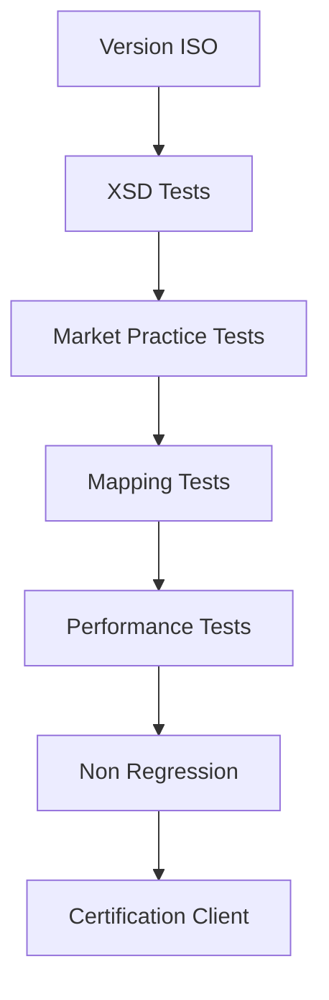

# 06 — Versioning ISO 20022 et market practices

**Dépôt :** `greenops-it-flux-architecture`  
**Domaine :** ISO 20022 appliqué aux flux de paiements bancaires  
**Niveau :** Architecte solution senior / direction architecture / audit N3  
**Référence interne :** `ISO-06`

## Objectif du document

Gouverner les versions ISO 20022, les versions de market practice, les migrations clients, les tests, le décommissionnement et les incidents liés aux versions.

Ce document est écrit comme un livrable exploitable par une squad paiement, une équipe architecture, une production bancaire, une équipe SRE ou une mission de transformation type BPCE / Natixis. Il privilégie les décisions d’architecture, les impacts SI, les risques de production, les contrôles d’audit et les leviers GreenOps.

---

## 1. Comprendre les versions

Un identifiant comme `pain.001.001.03` ou `pain.001.001.09` décrit une définition de message. Mais la version réellement utilisable dépend aussi d’une communauté de marché : SEPA, CBPR+, TIPS, banque interne ou contrat client.

| Niveau | Exemple | Gouvernance |
|---|---|---|
| Message ISO | `pain.001.001.09` | Standard ISO |
| Market practice | SEPA Rulebook | EPC / communauté |
| Infrastructure | TIPS, STET, SWIFT | Opérateur |
| Banque | Profil d’acceptation interne | Architecture + métier |
| Client | Format contractuel | Cash management |

## 2. pain.001.001.03 vs pain.001.001.09

| Dimension | Anciennes versions | Versions plus récentes | Impact |
|---|---|---|---|
| Richesse données | Plus limitée | Plus détaillée | Meilleure conformité |
| Données structurées | Moins systématiques | Plus importantes | Migration client |
| Compatibilité outils | Très répandue | Dépend SI | Tests nécessaires |
| Mapping | Souvent historique | À moderniser | Risque dette |

## 3. Versions pacs.008

`pacs.008` peut être utilisé dans SCT, SCT Inst, CBPR+ et autres contextes, avec des règles différentes. Il faut éviter de dire seulement “nous supportons pacs.008” : il faut préciser version, usage, infrastructure et profil.

## 4. Catalogue de versions

Exemple de catalogue interne :

| Flux | Canal | Message | Version | Market practice | Statut | Date fin support |
|---|---|---|---|---|---|---|
| SCT | EBICS | pain.001 | 001.03 | SEPA | Legacy accepté | 2026-12-31 |
| SCT | API | Canonical/API | v2 | Banque | Cible | N/A |
| SCT Inst | API | pacs.008 | profil instant | TIPS/STET | Cible | N/A |
| SDD | EBICS | pain.008 | 001.02 | SEPA | Accepté | À définir |
| Cross-border | SWIFT | pacs.008 | CBPR+ | SWIFT | Cible | N/A |

## 5. Compatibilité ascendante et descendante

| Type | Définition | Exemple |
|---|---|---|
| Ascendante | Ancien client accepté par nouveau SI | `pain.001.001.03` encore accepté |
| Descendante | Nouveau format consommable par ancien SI | Rare et risqué |
| Coexistence | Plusieurs versions en parallèle | Migration progressive clients |
| Rupture | Format ancien refusé | Décommissionnement |

## 6. Migration client

Une migration client doit prévoir :

1. communication de la trajectoire ;
2. kit de spécification ;
3. exemples XML valides et invalides ;
4. environnement de test ;
5. simulateur de validation ;
6. période de double run ;
7. monitoring par client ;
8. plan de rollback ;
9. date de fin d’acceptation.

## 7. Tests par version

## 8. Gouvernance versions

| Instance | Rôle |
|---|---|
| Design Authority Paiements | Arbitrage architecture et trajectoire |
| Product Owner Paiements | Priorisation métier |
| Production/SRE | Exploitabilité et risques incident |
| Sécurité/Conformité | Contrôles réglementaires |
| Cash management | Communication clients |

## 9. Incidents liés aux versions

| Incident | Exemple | Diagnostic |
|---|---|---|
| Version non reconnue | `pain.001.001.09` envoyé à un canal 001.03 | Lire namespace et `MsgDefId` |
| Règle market practice absente | XML XSD valide rejeté SEPA | Comparer profil de validation |
| Mapping ancien | Nouveau champ ignoré | Vérifier version de mapping |
| Double support mal testé | Certains clients rejetés | Segmenter par client/canal/version |

## 10. Décommissionnement

Le décommissionnement doit être piloté comme un projet : inventaire, volumétrie, clients impactés, exceptions, jalons, communication, tests, monitoring post-cutover et suppression du code mort. Un ancien mapping non supprimé continue à coûter en maintenance et peut générer des incidents longtemps après la migration.

---

## Synthèse architecte

Un programme ISO 20022 réussi ne se limite pas à changer des fichiers XML. Il impose une gouvernance de la donnée paiement, une stratégie de validation, un modèle canonique, une observabilité de bout en bout, une gestion stricte des versions et une mesure continue du coût opérationnel. Dans une banque de flux, les gains les plus importants viennent généralement de la réduction des rejets tardifs, de la diminution des mappings point-à-point, de la maîtrise des logs et de la capacité à diagnostiquer rapidement un paiement avec ses identifiants de corrélation.

## Points de vigilance récurrents

| Risque | Symptôme | Conséquence | Mesure de prévention |
|---|---|---|---|
| Confusion syntaxe / sémantique | XML valide mais paiement rejeté | Incident métier | Règles métier et market practice en plus du XSD |
| Mapping point-à-point | Multiplication des transformations | Coût, dette, erreurs | Modèle canonique gouverné |
| Validation tardive | Rejet après plusieurs étapes | Retraitements, carbone inutile | Validation amont et contrats d’interface |
| Version mal maîtrisée | Clients ou infrastructures désalignés | Rejets massifs | Catalogue de versions et tests de non-régression |
| Observabilité insuffisante | Paiement introuvable | MTTR élevé | MessageId, EndToEndId, TxId, correlationId partout |
| Logs excessifs | Volumes énormes | Coût stockage et empreinte carbone | Logs structurés, sampling, rétention adaptée |

## Annexe — métriques minimales recommandées

| Métrique | Label minimal | Utilisation |
|---|---|---|
| `payment_messages_total` | flux, message_type, version, channel | Volumétrie métier |
| `payment_rejections_total` | flux, rejection_stage, reason_code | Qualité et incidents |
| `payment_processing_duration_seconds` | flux, step, percentile | Performance SRE |
| `payment_payload_size_bytes` | message_type, version | GreenOps et capacité |
| `payment_retry_total` | service, reason | Résilience et gaspillage |
| `payment_log_bytes_total` | service, flux | Coût logs |

## Annexe — questions de revue d’architecture

- La solution distingue-t-elle clairement le format externe et le modèle interne ?
- Les règles de validation sont-elles traçables, versionnées et testées ?
- Les identifiants de corrélation sont-ils propagés sans rupture ?
- Le traitement peut-il être diagnostiqué sans lire le payload complet ?
- Les anciennes versions ont-elles une date de fin de vie ?
- Les flux batch et temps réel sont-ils séparés dans l’architecture et les SLO ?
- Les métriques GreenOps permettent-elles de prioriser des actions concrètes ?
- Les runbooks sont-ils testés et reliés aux alertes ?
