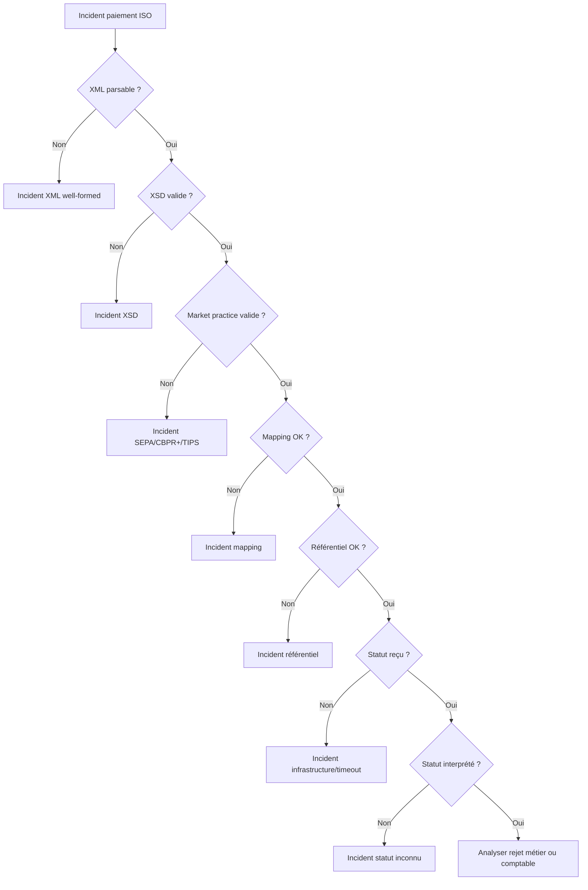

# 08 — Incidents ISO 20022

**Dépôt :** `greenops-it-flux-architecture`  
**Domaine :** ISO 20022 appliqué aux flux de paiements bancaires  
**Niveau :** Architecte solution senior / direction architecture / audit N3  
**Référence interne :** `ISO-08`

## Objectif du document

Fournir une grille de diagnostic production pour les incidents XML, XSD, mapping, référentiel, statut, retry, camt et versioning.

Ce document est écrit comme un livrable exploitable par une squad paiement, une équipe architecture, une production bancaire, une équipe SRE ou une mission de transformation type BPCE / Natixis. Il privilégie les décisions d’architecture, les impacts SI, les risques de production, les contrôles d’audit et les leviers GreenOps.

---

## 1. Typologie des incidents

| Incident | Symptôme | Impact métier |
|---|---|---|
| XML invalide | Parsing impossible | Flux rejeté immédiatement |
| XSD invalide | Champ manquant ou type invalide | Rejet technique |
| Mapping cassé | Donnée absente en sortie | Rejet infrastructure ou core |
| Référentiel indisponible | BIC/IBAN/compte non enrichi | File d’attente ou rejet |
| Statut inconnu | `pacs.002` non interprété | Client sans visibilité |
| Retry infini | Charge croissante | Saturation SI |
| camt non généré | Relevé absent | Incident client/cash management |
| Version incompatible | Namespace non reconnu | Rejets massifs |

## 2. Identifiants de diagnostic

| Identifiant | Où chercher | Utilité |
|---|---|---|
| `MsgId` | `GrpHdr` | Retrouver fichier/message |
| `PmtInfId` | `PmtInf` | Retrouver lot |
| `EndToEndId` | transaction | Référence client |
| `TxId` | pacs | Référence interbancaire |
| `correlationId` | logs internes | Trace distribuée |
| `UETR` | cross-border | Suivi international |

## 3. Arbre de diagnostic

## 4. Incident XML invalide

Signes : erreur parser, message non ouvert, balise non fermée, encodage invalide. Actions : récupérer payload source, vérifier taille, encodage, canal, client, horodatage, logs d’entrée. Prévention : validation canal, simulateur client, tests contractuels.

## 5. Incident XSD

Signes : erreur de schéma, élément absent, mauvais namespace, mauvaise version. Actions : identifier `MsgDefId`, namespace, version XSD, canal, client, exemple minimal reproductible. Prévention : catalogue versions, tests de non-régression.

## 6. Incident mapping

Signes : champ attendu vide, sortie ISO rejetée, valeur par défaut suspecte. Actions : comparer entrée, canonique, sortie, version de mapping et règles appliquées. Vérifier les transformations récentes et le référentiel.

## 7. Incident statut inconnu SCT Inst

SCT Inst nécessite un statut clair et rapide. Un statut non reconnu peut bloquer le canal client. Actions : rechercher `TxId`, `EndToEndId`, statut reçu, table de mapping statut, version pacs.002, timeout et décision métier appliquée.

## 8. Incident retry infini

Signes : hausse CPU, logs répétitifs, messages dupliqués, files saturées. Actions : identifier clé d’idempotence, compteur retry, dead-letter queue, cause racine. Stopper le retry si nécessaire et isoler les messages.

## 9. Incident camt non généré

Signes : client ne reçoit pas relevé ou avis, rapprochement impossible. Actions : vérifier événements source, cut-off, batch camt, erreurs de génération, stockage, canal de restitution, acquittements.

## 10. Runbook court

1. Identifier le flux : SCT, SDD, SCT Inst, cross-border, camt.
2. Collecter `MsgId`, `EndToEndId`, `TxId`, `correlationId`.
3. Déterminer la couche de rejet : XML, XSD, market practice, mapping, métier, infrastructure.
4. Vérifier version message et profil de validation.
5. Vérifier dernier changement : mapping, XSD, référentiel, règle, déploiement.
6. Mesurer impact : nombre messages, clients, montants, SLA, files.
7. Appliquer contournement contrôlé : pause canal, DLQ, rollback mapping, rejeu maîtrisé.
8. Documenter RCA et prévention.

## 11. Impact carbone

Un incident ISO peut générer : retries, logs massifs, revalidations, rejets tardifs, appels support, traitements manuels et rejeux. La RCA doit inclure le coût opérationnel : messages retraités, CPU additionnel, stockage logs, durée incident et nombre de transactions impactées.

---

## Synthèse architecte

Un programme ISO 20022 réussi ne se limite pas à changer des fichiers XML. Il impose une gouvernance de la donnée paiement, une stratégie de validation, un modèle canonique, une observabilité de bout en bout, une gestion stricte des versions et une mesure continue du coût opérationnel. Dans une banque de flux, les gains les plus importants viennent généralement de la réduction des rejets tardifs, de la diminution des mappings point-à-point, de la maîtrise des logs et de la capacité à diagnostiquer rapidement un paiement avec ses identifiants de corrélation.

## Points de vigilance récurrents

| Risque | Symptôme | Conséquence | Mesure de prévention |
|---|---|---|---|
| Confusion syntaxe / sémantique | XML valide mais paiement rejeté | Incident métier | Règles métier et market practice en plus du XSD |
| Mapping point-à-point | Multiplication des transformations | Coût, dette, erreurs | Modèle canonique gouverné |
| Validation tardive | Rejet après plusieurs étapes | Retraitements, carbone inutile | Validation amont et contrats d’interface |
| Version mal maîtrisée | Clients ou infrastructures désalignés | Rejets massifs | Catalogue de versions et tests de non-régression |
| Observabilité insuffisante | Paiement introuvable | MTTR élevé | MessageId, EndToEndId, TxId, correlationId partout |
| Logs excessifs | Volumes énormes | Coût stockage et empreinte carbone | Logs structurés, sampling, rétention adaptée |

## Annexe — métriques minimales recommandées

| Métrique | Label minimal | Utilisation |
|---|---|---|
| `payment_messages_total` | flux, message_type, version, channel | Volumétrie métier |
| `payment_rejections_total` | flux, rejection_stage, reason_code | Qualité et incidents |
| `payment_processing_duration_seconds` | flux, step, percentile | Performance SRE |
| `payment_payload_size_bytes` | message_type, version | GreenOps et capacité |
| `payment_retry_total` | service, reason | Résilience et gaspillage |
| `payment_log_bytes_total` | service, flux | Coût logs |

## Annexe — questions de revue d’architecture

- La solution distingue-t-elle clairement le format externe et le modèle interne ?
- Les règles de validation sont-elles traçables, versionnées et testées ?
- Les identifiants de corrélation sont-ils propagés sans rupture ?
- Le traitement peut-il être diagnostiqué sans lire le payload complet ?
- Les anciennes versions ont-elles une date de fin de vie ?
- Les flux batch et temps réel sont-ils séparés dans l’architecture et les SLO ?
- Les métriques GreenOps permettent-elles de prioriser des actions concrètes ?
- Les runbooks sont-ils testés et reliés aux alertes ?
