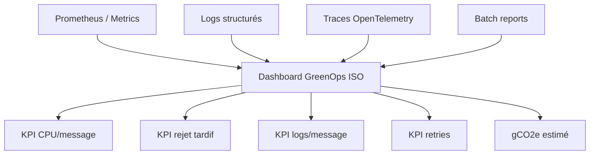

# 09 — GreenOps appliqué à ISO 20022

**Dépôt :** `greenops-it-flux-architecture`  
**Domaine :** ISO 20022 appliqué aux flux de paiements bancaires  
**Niveau :** Architecte solution senior / direction architecture / audit N3  
**Référence interne :** `ISO-09`

## Objectif du document

Définir une approche GreenOps concrète pour mesurer et réduire l’empreinte des traitements ISO 20022 sans dégrader la qualité métier ni la résilience.

Ce document est écrit comme un livrable exploitable par une squad paiement, une équipe architecture, une production bancaire, une équipe SRE ou une mission de transformation type BPCE / Natixis. Il privilégie les décisions d’architecture, les impacts SI, les risques de production, les contrôles d’audit et les leviers GreenOps.

---


## 1. Le paradoxe ISO 20022

ISO 20022 peut être plus lourd que les formats historiques, notamment à cause de XML et de la richesse des données. Mais il peut réduire le coût global en améliorant la qualité des données, l’automatisation, le rapprochement, la conformité et la diminution des rejets.

Le bon indicateur n’est pas seulement la taille du message. C’est le coût complet par transaction utile et correctement traitée.

## 2. Modèle SCI appliqué aux paiements

Forme simplifiée :

```text
SCI paiement = (Energie IT x Intensité carbone + part matériel) / unité fonctionnelle
```

Unités fonctionnelles possibles :

| Unité | Usage |
|---|---|
| gCO2e / message | Comparer types de messages |
| gCO2e / transaction | Comparer SCT, SDD, SCT Inst |
| gCO2e / 1000 transactions | Reporting direction |
| gCO2e / fichier batch | Optimisation SCT/SDD |
| gCO2e / incident | Mesure dette opérationnelle |

## 3. KPI GreenOps ISO

| KPI | Définition | Action associée |
|---|---|---|
| `cpu_ms_per_message` | CPU moyen par message | Optimiser parser/mapping |
| `payload_size_bytes` | Taille message | Réduire données inutiles |
| `log_bytes_per_message` | Volume logs | Sampling/masquage/rétention |
| `retry_count_per_tx` | Retries moyens | Corriger instabilité |
| `late_reject_rate` | Rejets tardifs | Validation amont |
| `mapping_hops` | Nombre transformations | Canonical model |
| `storage_days` | Rétention | Politique adaptée |

## 4. Exemples par flux

| Flux | Source d’empreinte | Optimisation |
|---|---|---|
| SCT batch | Gros fichiers, validation, stockage | Streaming, découpage, rejet amont |
| SDD | Mandats, retours, contrôles | Qualité mandat, référentiel |
| SCT Inst | Latence, retries, timeouts | Circuit breaker, caches, idempotence |
| camt | Volumétrie reporting | Compression, pagination, rétention |
| Cross-border | Données conformité | Structuration, éviter rejets CBPR+ |

## 5. Dashboard GreenOps



## 6. Priorisation des optimisations

| Priorité | Action | Pourquoi |
|---:|---|---|
| 1 | Réduire rejets tardifs | Évite traitement inutile complet |
| 2 | Supprimer retries non bornés | Évite saturation et émissions inutiles |
| 3 | Réduire logs payload | Stockage + sécurité |
| 4 | Passer batchs lourds en streaming | Mémoire/CPU |
| 5 | Rationaliser mappings | Moins de dette et CPU |
| 6 | Optimiser rétention camt | Stockage long terme |

## 7. Backlog GreenOps type

| Epic | User story | Critère d’acceptation |
|---|---|---|
| Mesure | En tant que SRE, je veux CPU/message par flux | Dashboard par SCT/SDD/SCT Inst |
| Rejets | En tant que PO paiement, je veux identifier rejets tardifs | KPI par couche de rejet |
| Logs | En tant que SecOps, je veux supprimer payload sensible | Aucun IBAN complet en logs |
| Mapping | En tant qu’architecte, je veux compter les transformations | `mapping_hops` exposé |
| Batch | En tant que production, je veux réduire mémoire batch | Pas d’OOM sur fichier de référence |
| camt | En tant que cash management, je veux compresser archives | Réduction stockage mesurée |

## 8. Mesure par incident

Un incident doit produire un bilan :

- nombre de messages impactés ;
- nombre de retries ;
- volume logs généré ;
- durée de saturation ;
- nombre de rejeux ;
- taux de rejets tardifs ;
- coût carbone estimatif.

## 9. Décision architecte

Il ne faut pas optimiser au détriment de la conformité ou de l’auditabilité. La sobriété cible les gaspillages : erreurs évitables, logs inutiles, transformations redondantes, validations répétées, stockage sans usage et traitements manuels. Une donnée utile, traçable et nécessaire au paiement doit être conservée ; une donnée dupliquée ou non exploitée doit être supprimée ou archivée intelligemment.

---

## Synthèse architecte

Un programme ISO 20022 réussi ne se limite pas à changer des fichiers XML. Il impose une gouvernance de la donnée paiement, une stratégie de validation, un modèle canonique, une observabilité de bout en bout, une gestion stricte des versions et une mesure continue du coût opérationnel. Dans une banque de flux, les gains les plus importants viennent généralement de la réduction des rejets tardifs, de la diminution des mappings point-à-point, de la maîtrise des logs et de la capacité à diagnostiquer rapidement un paiement avec ses identifiants de corrélation.

## Points de vigilance récurrents

| Risque | Symptôme | Conséquence | Mesure de prévention |
|---|---|---|---|
| Confusion syntaxe / sémantique | XML valide mais paiement rejeté | Incident métier | Règles métier et market practice en plus du XSD |
| Mapping point-à-point | Multiplication des transformations | Coût, dette, erreurs | Modèle canonique gouverné |
| Validation tardive | Rejet après plusieurs étapes | Retraitements, carbone inutile | Validation amont et contrats d’interface |
| Version mal maîtrisée | Clients ou infrastructures désalignés | Rejets massifs | Catalogue de versions et tests de non-régression |
| Observabilité insuffisante | Paiement introuvable | MTTR élevé | MessageId, EndToEndId, TxId, correlationId partout |
| Logs excessifs | Volumes énormes | Coût stockage et empreinte carbone | Logs structurés, sampling, rétention adaptée |


## Annexe — métriques minimales recommandées

| Métrique | Label minimal | Utilisation |
|---|---|---|
| `payment_messages_total` | flux, message_type, version, channel | Volumétrie métier |
| `payment_rejections_total` | flux, rejection_stage, reason_code | Qualité et incidents |
| `payment_processing_duration_seconds` | flux, step, percentile | Performance SRE |
| `payment_payload_size_bytes` | message_type, version | GreenOps et capacité |
| `payment_retry_total` | service, reason | Résilience et gaspillage |
| `payment_log_bytes_total` | service, flux | Coût logs |

## Annexe — questions de revue d’architecture

- La solution distingue-t-elle clairement le format externe et le modèle interne ?
- Les règles de validation sont-elles traçables, versionnées et testées ?
- Les identifiants de corrélation sont-ils propagés sans rupture ?
- Le traitement peut-il être diagnostiqué sans lire le payload complet ?
- Les anciennes versions ont-elles une date de fin de vie ?
- Les flux batch et temps réel sont-ils séparés dans l’architecture et les SLO ?
- Les métriques GreenOps permettent-elles de prioriser des actions concrètes ?
- Les runbooks sont-ils testés et reliés aux alertes ?
