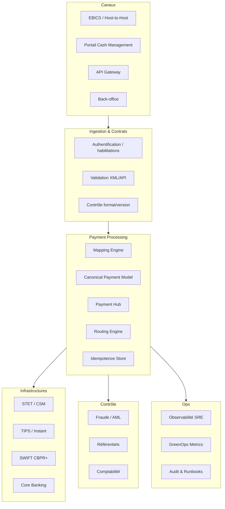

# 10 — Architecture de référence ISO 20022

**Dépôt :** `greenops-it-flux-architecture`  
**Domaine :** ISO 20022 appliqué aux flux de paiements bancaires  
**Niveau :** Architecte solution senior / direction architecture / audit N3  
**Référence interne :** `ISO-10`

## Objectif du document

Proposer une architecture cible ISO 20022 intégrant canaux, API Gateway, validation, mapping, modèle canonique, Payment Hub, routage, infrastructures, observabilité, sécurité et GreenOps.

Ce document est écrit comme un livrable exploitable par une squad paiement, une équipe architecture, une production bancaire, une équipe SRE ou une mission de transformation type BPCE / Natixis. Il privilégie les décisions d’architecture, les impacts SI, les risques de production, les contrôles d’audit et les leviers GreenOps.

---

## 1. Architecture cible

## 2. Canaux

| Canal | Spécificité | Contrôle critique |
|---|---|---|
| EBICS | Fichiers clients corporate | Version, signature, volumétrie |
| API Gateway | Temps réel/API cash | Auth, quota, idempotence |
| Portail | Saisie utilisateur | Validation UX et habilitation |
| Back-office | Opérations internes | Traçabilité et séparation des rôles |

## 3. Validation layer

La validation doit être mutualisée autant que possible sans devenir un goulot d’étranglement. Elle doit gérer profils par version, client, canal et market practice.

## 4. Mapping engine

Le moteur de mapping doit être versionné, testable et observable. Chaque transformation doit pouvoir être rejouée en environnement contrôlé avec la même version de règles.

## 5. Canonical model

Le modèle canonique est le cœur de découplage. Il ne doit pas être une copie brute d’ISO 20022, mais une représentation métier stable du paiement.

## 6. Payment Hub

Rôles : orchestration, statuts, routage, idempotence, reprise, événements, audit, intégration core banking et infrastructures.

## 7. Routing

| Flux | Routage possible |
|---|---|
| SCT | STET ou autre CSM SEPA |
| SDD | CSM SEPA, calendrier et cut-off |
| SCT Inst | TIPS, RT1, STET instant selon banque |
| Cross-border | SWIFT CBPR+, correspondants |
| Interne | Core banking / comptes internes |

## 8. Résilience

Patterns recommandés :

- circuit breaker pour services référentiels ;
- retry borné avec backoff ;
- DLQ avec cause claire ;
- idempotence forte ;
- checkpoints batch ;
- reprise contrôlée ;
- séparation chemins temps réel et batch ;
- dégradation contrôlée si reporting non critique.

## 9. Sécurité

- authentification forte des canaux ;
- habilitations par client, compte, produit ;
- chiffrement en transit et au repos ;
- masquage logs ;
- contrôle accès aux payloads ;
- séparation des rôles back-office ;
- audit non répudiable ;
- conformité DORA sur résilience opérationnelle et gestion des incidents.

## 10. Observabilité

Chaque composant doit exposer :

- métriques techniques : latence, débit, erreurs, CPU, mémoire ;
- métriques métier : statuts, rejets, montants, volumes ;
- traces distribuées : `correlationId`, `MessageId`, `EndToEndId`, `TxId` ;
- logs structurés ;
- événements d’audit.

## 11. GreenOps

La couche GreenOps collecte : taille payload, CPU/message, logs/message, retries, rejets tardifs, mapping hops, stockage camt et consommation batch. Ces données alimentent les arbitrages d’architecture.

## 12. Patterns et anti-patterns

| Pattern | Valeur |
|---|---|
| Canonical model | Découplage |
| Validation progressive | Moins de rejets tardifs |
| Observabilité par identifiants | MTTR réduit |
| Idempotence | Sécurité retries |
| Streaming batch | Performance |

| Anti-pattern | Risque |
|---|---|
| Mapping point-à-point | Dette exponentielle |
| Payload complet en logs | Sécurité + stockage |
| Validation uniquement en fin | Rejets coûteux |
| Statuts non normalisés | Incidents client |
| Retry infini | Saturation |

---

## Synthèse architecte

Un programme ISO 20022 réussi ne se limite pas à changer des fichiers XML. Il impose une gouvernance de la donnée paiement, une stratégie de validation, un modèle canonique, une observabilité de bout en bout, une gestion stricte des versions et une mesure continue du coût opérationnel. Dans une banque de flux, les gains les plus importants viennent généralement de la réduction des rejets tardifs, de la diminution des mappings point-à-point, de la maîtrise des logs et de la capacité à diagnostiquer rapidement un paiement avec ses identifiants de corrélation.

## Points de vigilance récurrents

| Risque | Symptôme | Conséquence | Mesure de prévention |
|---|---|---|---|
| Confusion syntaxe / sémantique | XML valide mais paiement rejeté | Incident métier | Règles métier et market practice en plus du XSD |
| Mapping point-à-point | Multiplication des transformations | Coût, dette, erreurs | Modèle canonique gouverné |
| Validation tardive | Rejet après plusieurs étapes | Retraitements, carbone inutile | Validation amont et contrats d’interface |
| Version mal maîtrisée | Clients ou infrastructures désalignés | Rejets massifs | Catalogue de versions et tests de non-régression |
| Observabilité insuffisante | Paiement introuvable | MTTR élevé | MessageId, EndToEndId, TxId, correlationId partout |
| Logs excessifs | Volumes énormes | Coût stockage et empreinte carbone | Logs structurés, sampling, rétention adaptée |

## Annexe — métriques minimales recommandées

| Métrique | Label minimal | Utilisation |
|---|---|---|
| `payment_messages_total` | flux, message_type, version, channel | Volumétrie métier |
| `payment_rejections_total` | flux, rejection_stage, reason_code | Qualité et incidents |
| `payment_processing_duration_seconds` | flux, step, percentile | Performance SRE |
| `payment_payload_size_bytes` | message_type, version | GreenOps et capacité |
| `payment_retry_total` | service, reason | Résilience et gaspillage |
| `payment_log_bytes_total` | service, flux | Coût logs |

## Annexe — questions de revue d’architecture

- La solution distingue-t-elle clairement le format externe et le modèle interne ?
- Les règles de validation sont-elles traçables, versionnées et testées ?
- Les identifiants de corrélation sont-ils propagés sans rupture ?
- Le traitement peut-il être diagnostiqué sans lire le payload complet ?
- Les anciennes versions ont-elles une date de fin de vie ?
- Les flux batch et temps réel sont-ils séparés dans l’architecture et les SLO ?
- Les métriques GreenOps permettent-elles de prioriser des actions concrètes ?
- Les runbooks sont-ils testés et reliés aux alertes ?
