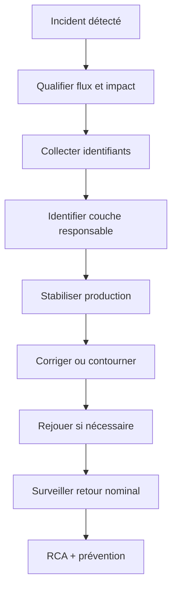

# 12 — Runbooks production ISO 20022

**Dépôt :** `greenops-it-flux-architecture`  
**Domaine :** ISO 20022 appliqué aux flux de paiements bancaires  
**Niveau :** Architecte solution senior / direction architecture / audit N3  
**Référence interne :** `ISO-12`

## Objectif du document

Industrialiser les gestes N2/N3 pour les incidents ISO 20022 : XML rejeté, XSD, mapping, statut SCT Inst, retry, camt, performance, version et logs.

Ce document est écrit comme un livrable exploitable par une squad paiement, une équipe architecture, une production bancaire, une équipe SRE ou une mission de transformation type BPCE / Natixis. Il privilégie les décisions d’architecture, les impacts SI, les risques de production, les contrôles d’audit et les leviers GreenOps.

---

## 1. Données communes à collecter

Avant toute action corrective :

| Donnée | Exemple | Pourquoi |
|---|---|---|
| Flux | SCT, SDD, SCT Inst, camt, CBPR+ | Identifier règles applicables |
| Canal | EBICS, API, portail | Identifier contrat d’entrée |
| `MsgId` | identifiant message | Retrouver lot |
| `EndToEndId` | référence transaction | Trace client |
| `TxId` | transaction interbancaire | Trace infrastructure |
| `correlationId` | trace interne | Logs/traces |
| Version | `pain.001.001.03` | Validation/schema |
| Heure début | timestamp | Fenêtre incident |
| Volume | nombre messages | Impact métier |

## 2. Runbook XML rejeté

### Symptômes

- erreur parser ;
- XML illisible ;
- canal rejette avant validation XSD.

### Actions

1. Récupérer payload source sécurisé.
2. Vérifier encodage, taille, balises, namespace.
3. Tester well-formed XML dans un validateur interne.
4. Identifier client/canal et changement récent.
5. Rejeter proprement avec motif explicite.
6. Ouvrir action préventive si volume récurrent.

### Prévention

- simulateur client ;
- validation canal ;
- exemples contractuels ;
- tests automatisés.

## 3. Runbook XSD

1. Identifier message et version.
2. Charger XSD correspondant au profil accepté.
3. Exécuter validation isolée.
4. Comparer avec version déclarée par client/canal.
5. Classer erreur : champ absent, cardinalité, type, namespace.
6. Corriger mapping ou renvoyer au client selon responsabilité.

## 4. Runbook mapping cassé

1. Récupérer entrée, canonique, sortie.
2. Identifier version de mapping.
3. Comparer avec dernière release.
4. Vérifier référentiels appelés.
5. Rejouer un cas en environnement contrôlé.
6. Appliquer rollback mapping si incident massif.
7. Ajouter test de non-régression.

## 5. Runbook statut inconnu SCT Inst

1. Rechercher par `TxId`, `EndToEndId`, `correlationId`.
2. Vérifier message `pacs.002` reçu.
3. Contrôler version et code statut.
4. Vérifier table de mapping statut.
5. Déterminer décision client : pending, rejected, accepted.
6. Si ambigu, escalader métier paiement + infrastructure.
7. Mettre à jour mapping statut et tests.

## 6. Runbook retry excessif

1. Identifier file/topic concerné.
2. Mesurer nombre de retries et messages uniques.
3. Vérifier cause racine : timeout, mapping, référentiel, infrastructure.
4. Stopper temporairement le retry si saturation.
5. Déplacer messages vers DLQ si nécessaire.
6. Corriger cause puis rejouer par lots contrôlés.
7. Vérifier idempotence.

## 7. Runbook camt non généré

1. Identifier client, compte, période, type camt.
2. Vérifier présence des événements source.
3. Contrôler cut-off et batch de génération.
4. Vérifier erreurs de mapping/relevé.
5. Vérifier stockage et canal de livraison.
6. Régénérer en mode contrôlé si autorisé.
7. Informer cash management/client selon procédure.

## 8. Runbook performance XML

1. Identifier flux et fenêtre de lenteur.
2. Mesurer latence P50/P95/P99.
3. Vérifier CPU, mémoire, GC, I/O, files.
4. Identifier taille payload et nombre de transactions.
5. Vérifier parser DOM/SAX/StAX.
6. Vérifier validation répétée.
7. Réduire logs si explosion stockage.
8. Mettre en place contournement : découpage batch, throttling, scaling.

## 9. Runbook version incompatible

1. Lire namespace et `MsgDefId`.
2. Comparer avec catalogue versions acceptées.
3. Identifier client/canal concerné.
4. Vérifier changement récent de client ou gateway.
5. Rejeter avec motif version si non supportée.
6. Si support attendu, activer profil ou corriger routage.
7. Ajouter test dans matrice versions.

## 10. Runbook surcharge logs

1. Identifier service, index, topic ou namespace.
2. Mesurer `log_bytes_per_message`.
3. Chercher payloads complets ou stacktraces répétitives.
4. Activer sampling ou réduire niveau log.
5. Masquer données sensibles.
6. Ajuster rétention si autorisé.
7. Ouvrir action correctrice code/config.

## 11. Checklist incident

## 12. Prévention continue

- exercices réguliers de rejeu ;
- tests de chaos sur référentiels non critiques ;
- contrôle de retry ;
- dashboards par couche de rejet ;
- revue mensuelle versions ;
- revue logs et rétention ;
- backlog GreenOps/SRE ;
- mise à jour runbooks après chaque incident.

---

## Synthèse architecte

Un programme ISO 20022 réussi ne se limite pas à changer des fichiers XML. Il impose une gouvernance de la donnée paiement, une stratégie de validation, un modèle canonique, une observabilité de bout en bout, une gestion stricte des versions et une mesure continue du coût opérationnel. Dans une banque de flux, les gains les plus importants viennent généralement de la réduction des rejets tardifs, de la diminution des mappings point-à-point, de la maîtrise des logs et de la capacité à diagnostiquer rapidement un paiement avec ses identifiants de corrélation.

## Points de vigilance récurrents

| Risque | Symptôme | Conséquence | Mesure de prévention |
|---|---|---|---|
| Confusion syntaxe / sémantique | XML valide mais paiement rejeté | Incident métier | Règles métier et market practice en plus du XSD |
| Mapping point-à-point | Multiplication des transformations | Coût, dette, erreurs | Modèle canonique gouverné |
| Validation tardive | Rejet après plusieurs étapes | Retraitements, carbone inutile | Validation amont et contrats d’interface |
| Version mal maîtrisée | Clients ou infrastructures désalignés | Rejets massifs | Catalogue de versions et tests de non-régression |
| Observabilité insuffisante | Paiement introuvable | MTTR élevé | MessageId, EndToEndId, TxId, correlationId partout |
| Logs excessifs | Volumes énormes | Coût stockage et empreinte carbone | Logs structurés, sampling, rétention adaptée |

## Annexe — métriques minimales recommandées

| Métrique | Label minimal | Utilisation |
|---|---|---|
| `payment_messages_total` | flux, message_type, version, channel | Volumétrie métier |
| `payment_rejections_total` | flux, rejection_stage, reason_code | Qualité et incidents |
| `payment_processing_duration_seconds` | flux, step, percentile | Performance SRE |
| `payment_payload_size_bytes` | message_type, version | GreenOps et capacité |
| `payment_retry_total` | service, reason | Résilience et gaspillage |
| `payment_log_bytes_total` | service, flux | Coût logs |

## Annexe — questions de revue d’architecture

- La solution distingue-t-elle clairement le format externe et le modèle interne ?
- Les règles de validation sont-elles traçables, versionnées et testées ?
- Les identifiants de corrélation sont-ils propagés sans rupture ?
- Le traitement peut-il être diagnostiqué sans lire le payload complet ?
- Les anciennes versions ont-elles une date de fin de vie ?
- Les flux batch et temps réel sont-ils séparés dans l’architecture et les SLO ?
- Les métriques GreenOps permettent-elles de prioriser des actions concrètes ?
- Les runbooks sont-ils testés et reliés aux alertes ?
