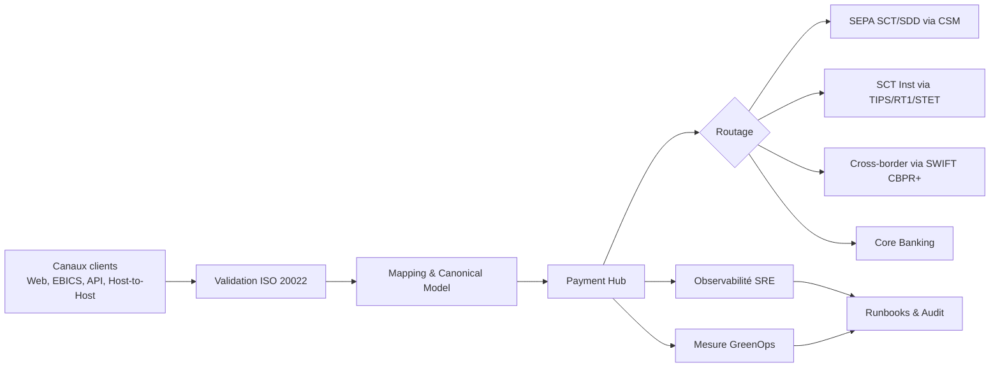

# Pack ISO 20022 Expert V2

Ce dossier constitue le socle ISO 20022 du dépôt `greenops-it-flux-architecture`.

Il a pour objectif de fournir une base professionnelle, structurée et directement exploitable pour comprendre, concevoir, auditer et exploiter des flux de paiements ISO 20022 dans un contexte bancaire : SCT, SDD, SCT Inst, paiements cross-border, cash management, reporting camt, transformation MT vers MX, architecture de Payment Hub, performance, SRE, DevSecOps et GreenOps.

## Positionnement du pack

Ce pack n’est pas un simple cours XML. Il traite ISO 20022 comme un sujet d’architecture SI : modèle métier, dictionnaire de données, versioning, market practices, contrats d’interface, validation, mapping, observabilité, exploitation, performance et mesure carbone.

## Parcours de lecture recommandé

| Ordre | Fichier | Objectif |
|---:|---|---|
| 1 | `01_fondamentaux_v2.md` | Comprendre les principes ISO 20022 et les impacts SI |
| 2 | `02_messages_paiements_v2.md` | Maîtriser les familles pain, pacs, camt, remt et les cycles paiement |
| 3 | `03_mapping_transformation_v2.md` | Concevoir les transformations MT/MX, legacy/API/canonique |
| 4 | `04_modele_canonique_v2.md` | Structurer un modèle de paiement interne robuste |
| 5 | `05_validation_xml_v2.md` | Mettre en place les couches de validation XML, métier et référentiel |
| 6 | `06_versioning_v2.md` | Gouverner les versions ISO, SEPA et CBPR+ |
| 7 | `07_performance_v2.md` | Optimiser parsing, validation, batch et temps réel |
| 8 | `08_incidents_v2.md` | Diagnostiquer les incidents ISO 20022 en production |
| 9 | `09_greenops_iso_v2.md` | Mesurer et réduire l’empreinte carbone des flux ISO |
| 10 | `10_architecture_reference_v2.md` | Définir une architecture cible complète |
| 11 | `11_audit_checklist_v2.md` | Auditer une plateforme ISO 20022 avec scoring |
| 12 | `12_runbooks_prod_v2.md` | Industrialiser les gestes d’exploitation N2/N3 |

## Vision globale

## Principes directeurs

1. Séparer syntaxe, sémantique, market practice et règles banque.
2. Valider le plus tôt possible, mais sans dupliquer inutilement les règles.
3. Centraliser la transformation autour d’un modèle canonique gouverné.
4. Conserver des identifiants de corrélation de bout en bout.
5. Mesurer les coûts CPU, mémoire, stockage, logs, retries et rejets.
6. Préférer des architectures observables, résilientes et sobres.
7. Documenter les versions supportées et les trajectoires de décommissionnement.

## Liens avec GreenOps

ISO 20022 est plus riche que les formats historiques et peut donc générer plus de CPU, de mémoire et de stockage, surtout sur les batchs volumineux SCT/SDD et les relevés camt. Mais cette richesse permet aussi une meilleure qualité de données, moins de rejets, moins de retraitements manuels et une réduction de l’empreinte opérationnelle globale. Le bon angle GreenOps n’est donc pas seulement de réduire la taille XML : il faut réduire les erreurs, les retries, les transformations inutiles, les logs excessifs et les traitements tardifs.

## Livrables utilisables en mission

- Support d’acculturation ISO 20022 pour squads IT.
- Base HLD/LLD pour Payment Hub ISO 20022.
- Checklist d’audit architecture et production.
- Runbooks N2/N3 pour incidents ISO.
- Backlog d’optimisation GreenOps.
- Référentiel de décision pour migration MT vers MX et SEPA versions.
