# Polycopié — Comprendre ISO 20022 pour les paiements

## Périmètre

Ce polycopié couvre trois blocs :

1. Pourquoi ISO 20022 devient important, surtout pour les paiements.
2. Chapitre 1 — Les bases : standards financiers, syntaxe, sémantique, XML, modèles métier, dictionnaire, composants réutilisables.
3. Chapitre 2 — L’usage réel : paiements, titres, cartes, forex, trade finance, coexistence MT/MX, mapping, migration, middleware/EAI, impacts SI.

Objectif : comprendre ISO 20022 comme un architecte IT Paiements, pas seulement comme un format XML.

---

# 1. Pourquoi ISO 20022 devient important

## 1.1 Le problème historique

Le secteur financier échange énormément d’informations : paiements, confirmations, relevés, instructions, retours, rejets, règlement-livraison, reporting réglementaire.

Pendant longtemps, chaque domaine ou pays a utilisé ses propres formats :

- SWIFT MT pour les paiements internationaux.
- Formats domestiques pour les paiements nationaux.
- ISO 8583 pour les cartes.
- FIX pour certains flux de marché.
- FpML pour les dérivés.
- Formats internes propriétaires dans les banques.

Le problème n’est pas seulement technique. Le vrai problème est double :

- les formats ne sont pas les mêmes ;
- les mots métier ne veulent pas toujours dire exactement la même chose.

Exemple : selon le contexte, on peut parler de payer, debtor, ordering customer, payment originator. Pour un humain expérimenté, c’est compréhensible. Pour une machine, c’est ambigu.

## 1.2 L’objectif ISO 20022

ISO 20022 apporte un langage commun pour décrire les données financières.

Il ne répond pas seulement à la question :

> Comment écrire un message ?

Il répond surtout à la question :

> Quel est le sens métier exact de chaque donnée échangée ?

C’est pour cela qu’ISO 20022 est important : il standardise la donnée financière à un niveau métier, puis permet de la représenter dans un format technique.

## 1.3 Pourquoi c’est stratégique pour les paiements

Les paiements sont devenus plus complexes :

- plus de temps réel avec le virement instantané ;
- plus de contrôles fraude et conformité ;
- plus d’exigences réglementaires ;
- plus de données structurées ;
- plus d’interopérabilité entre banques, infrastructures de marché et clients corporate ;
- plus d’automatisation attendue.

ISO 20022 devient donc une base commune pour :

- mieux initier les paiements ;
- mieux les compenser ;
- mieux les régler ;
- mieux les tracer ;
- mieux gérer les rejets ;
- mieux produire du reporting.

## 1.4 Diagramme — Pourquoi ISO 20022 devient nécessaire

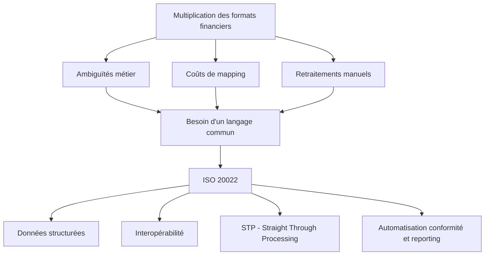

---

# 2. Chapitre 1 — Lifting the Lid on ISO 20022

## 2.1 Ce qu’est un standard financier

Un standard financier définit comment deux parties doivent organiser et comprendre les données qu’elles échangent.

Il définit notamment :

- les champs attendus ;
- leur signification ;
- leur format ;
- leur longueur ;
- leur caractère obligatoire ou optionnel ;
- les codes autorisés ;
- les relations entre données.

Sans standard, une instruction de paiement serait simplement du texte libre.

Exemple humain :

```text
ACME NV veut transférer 12 500 USD le 06/04/2022 depuis le compte 8754219990 via la banque EXABNL2U.
```

Une personne comprend. Une machine ne peut pas traiter cela de manière fiable sans conventions strictes.

## 2.2 Syntaxe et sémantique

Le livre insiste sur deux notions fondamentales :

| Notion | Définition simple | Exemple |
|---|---|---|
| Syntaxe | La forme physique du message | XML, MT, JSON, fichier plat |
| Sémantique | Le sens métier de la donnée | Debtor = celui qui paie |

### Exemple ISO 20022

```xml
<IntrBkSttlmAmt Ccy="USD">12500</IntrBkSttlmAmt>
```

Lecture syntaxique :

- balise XML ouvrante : `IntrBkSttlmAmt` ;
- attribut : `Ccy="USD"` ;
- valeur : `12500` ;
- balise fermante : `IntrBkSttlmAmt`.

Lecture sémantique :

- il s’agit du montant de règlement interbancaire ;
- la devise est USD ;
- le montant est 12 500.

## 2.3 Exemple complet : instruction de crédit transfert

```xml
<CdtTrfTxInf>
  <IntrBkSttlmAmt Ccy="USD">12500</IntrBkSttlmAmt>
  <IntrBkSttlmDt>2022-04-06</IntrBkSttlmDt>

  <Dbtr>
    <Nm>ACME NV</Nm>
    <PstlAdr>
      <StrtNm>Amstel</StrtNm>
      <BldgNb>344</BldgNb>
      <TwnNm>Amsterdam</TwnNm>
      <Ctry>NL</Ctry>
    </PstlAdr>
  </Dbtr>

  <DbtrAcct>
    <Id>
      <Othr>
        <Id>8754219990</Id>
      </Othr>
    </Id>
  </DbtrAcct>

  <DbtrAgt>
    <FinInstnId>
      <BIC>EXABNL2U</BIC>
    </FinInstnId>
  </DbtrAgt>
</CdtTrfTxInf>
```

## 2.4 Lecture métier du flux

| Élément ISO 20022 | Signification métier |
|---|---|
| `CdtTrfTxInf` | Information de transaction de virement |
| `IntrBkSttlmAmt` | Montant de règlement interbancaire |
| `Ccy="USD"` | Devise du règlement |
| `IntrBkSttlmDt` | Date de règlement interbancaire |
| `Dbtr` | Débiteur, celui qui paie |
| `Nm` | Nom du débiteur |
| `PstlAdr` | Adresse postale |
| `StrtNm` | Rue |
| `BldgNb` | Numéro de bâtiment |
| `TwnNm` | Ville |
| `Ctry` | Pays |
| `DbtrAcct` | Compte du débiteur |
| `DbtrAgt` | Banque du débiteur |
| `BIC` | Identifiant international de la banque |

## 2.5 Diagramme — Flux logique du paiement

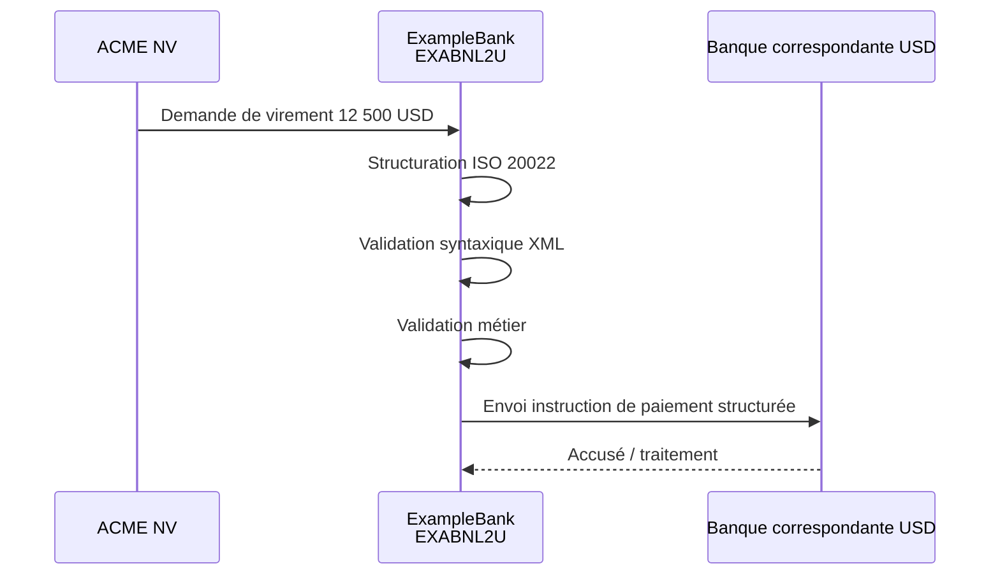

## 2.6 Les trois couches ISO 20022

Le livre explique qu’ISO 20022 sépare trois niveaux.

| Couche | Rôle | Exemple |
|---|---|---|
| Business | Décrit le processus métier | crédit transfert |
| Logique | Décrit les données nécessaires | débiteur, créancier, montant |
| Syntaxe | Représente physiquement le message | XML ou JSON |

## 2.7 Diagramme — Les trois couches ISO 20022

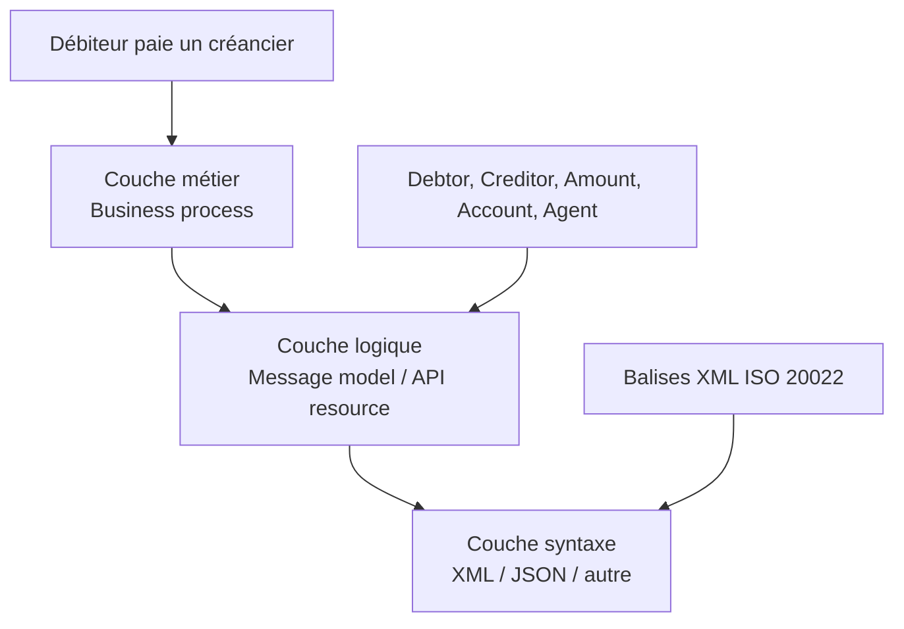

## 2.8 Les composants réutilisables

Un point majeur du chapitre 1 : ISO 20022 utilise un dictionnaire central.

Ce dictionnaire contient des composants réutilisables :

- Party ;
- PostalAddress ;
- Account ;
- FinancialInstitutionIdentification ;
- Payment ;
- Debtor ;
- Creditor ;
- DebtorAgent ;
- CreditorAgent.

Avantage : on ne réinvente pas la donnée à chaque message.

Exemple : `PostalAddress` peut servir dans :

- un paiement ;
- un reporting ;
- un message de conformité ;
- un message d’investigation.

## 2.9 Diagramme — Réutilisation des composants

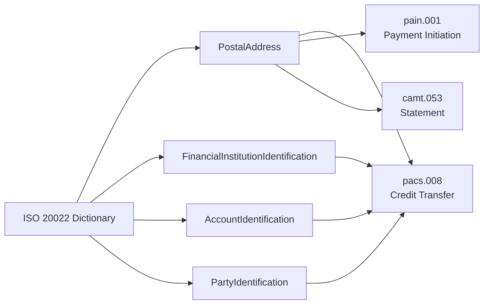

## 2.10 Ce qu’il faut retenir du chapitre 1

Le chapitre 1 ne dit pas seulement : ISO 20022 = XML.

Il dit plutôt :

> ISO 20022 est une méthode pour créer des standards financiers cohérents, basés sur un modèle métier commun, un dictionnaire réutilisable et une syntaxe technique.

La bonne lecture architecte est donc :

```text
Métier commun
   ↓
Dictionnaire commun
   ↓
Modèle logique commun
   ↓
Message XML / JSON
   ↓
Interopérabilité et automatisation
```

---

# 3. Chapitre 2 — Putting ISO 20022 into Practice

## 3.1 Où ISO 20022 est utilisé

Le chapitre 2 montre qu’ISO 20022 n’est pas limité aux paiements.

Il couvre plusieurs domaines financiers :

| Domaine | Codes principaux | Usage |
|---|---|---|
| Paiements | pain, pacs, camt, remt | initiation, compensation, reporting |
| Titres | setr, sese, semt, seev | trading, settlement, corporate actions |
| Cartes | caaa, cain, catm, catp | transactions carte, ATM, terminal |
| Forex | fxtr | post-trade FX |
| Trade finance | tsin, tsmt | garanties, factoring, e-invoice |
| Référentiels | reda | données de référence |
| Régulateurs | auth | communications autorités |

## 3.2 ISO 20022 dans les paiements

Pour les paiements, ISO 20022 couvre toute la chaîne :

1. Client vers banque.
2. Banque vers banque.
3. Banque vers client.
4. Exceptions et investigations.
5. Mandats de prélèvement.
6. Reporting cash management.
7. Remittance advice.

## 3.3 Diagramme — Chaîne paiement ISO 20022


## 3.4 Les familles de messages paiements

| Famille | Sens | Exemple |
|---|---|---|
| pain | Payment Initiation | client → banque |
| pacs | Payments Clearing and Settlement | banque → banque |
| camt | Cash Management | relevés, notifications, investigations |
| remt | Remittance Advice | informations de rapprochement |

## 3.5 Exemple : SCT classique

Un SCT classique peut suivre ce chemin :

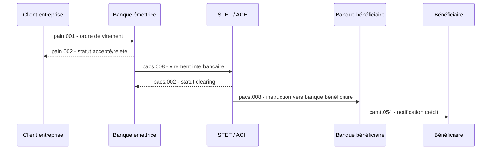

## 3.6 Coexistence MT / MX

Le chapitre 2 insiste sur un point très réaliste : tous les anciens formats ne disparaissent pas immédiatement.

Les banques ont souvent :

- des applications anciennes ;
- des formats internes propriétaires ;
- des interfaces MT ;
- des systèmes de marché déjà en production ;
- des coûts de migration importants.

Donc la coexistence est normale.

| Format | Nature |
|---|---|
| MT | ancien format SWIFT tag/value |
| MX | message XML échangé sur SWIFTNet, souvent ISO 20022 |

## 3.7 Exemple MT103 vs ISO 20022

### Ancien MT103 simplifié

```text
:32A:06042022USD12500,
:50F:/8754219990
1/ACME NV.
2/AMSTEL 344
3/NL/AMSTERDAM
:52A:EXABNL2U
```

### ISO 20022 équivalent simplifié

```xml
<CdtTrfTxInf>
  <IntrBkSttlmAmt Ccy="USD">12500</IntrBkSttlmAmt>
  <IntrBkSttlmDt>2022-04-06</IntrBkSttlmDt>
  <Dbtr>
    <Nm>ACME NV</Nm>
    <PstlAdr>
      <StrtNm>AMSTEL</StrtNm>
      <BldgNb>344</BldgNb>
      <TwnNm>AMSTERDAM</TwnNm>
      <Ctry>NL</Ctry>
    </PstlAdr>
  </Dbtr>
  <DbtrAcct>
    <Id><Othr><Id>8754219990</Id></Othr></Id>
  </DbtrAcct>
  <DbtrAgt>
    <FinInstnId><BIC>EXABNL2U</BIC></FinInstnId>
  </DbtrAgt>
</CdtTrfTxInf>
```

## 3.8 Mapping MT vers ISO 20022

Le mapping consiste à relier chaque champ ancien à son équivalent ISO.

| MT103 | Sens | ISO 20022 |
|---|---|---|
| `:32A:` | date, devise, montant | `IntrBkSttlmDt`, `IntrBkSttlmAmt` |
| `:50F:` | client donneur d’ordre | `Dbtr`, `DbtrAcct` |
| `:52A:` | banque du donneur d’ordre | `DbtrAgt` |

## 3.9 Diagramme — Mapping MT vers ISO 20022

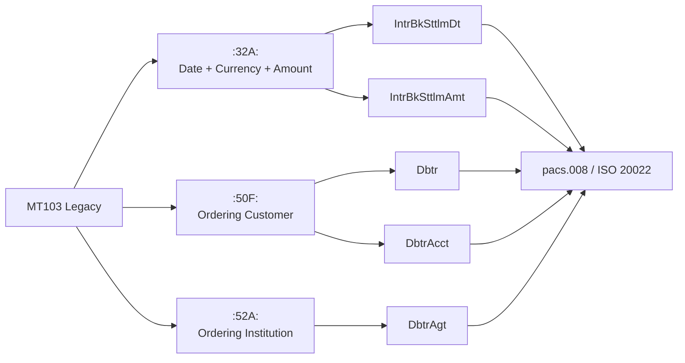

## 3.10 Le rôle du middleware / EAI

Le chapitre 2 explique que les grandes banques ne changent pas forcément toutes leurs applications internes d’un coup.

Elles placent souvent une couche middleware / EAI entre :

- les canaux ;
- les applications métier ;
- les back-offices ;
- les réseaux externes ;
- SWIFT ;
- les infrastructures de marché.

Cette couche fait :

- transformation de formats ;
- enrichissement de données ;
- orchestration ;
- validation ;
- routage ;
- gestion des erreurs.

## 3.11 Diagramme — Architecture EAI ISO 20022

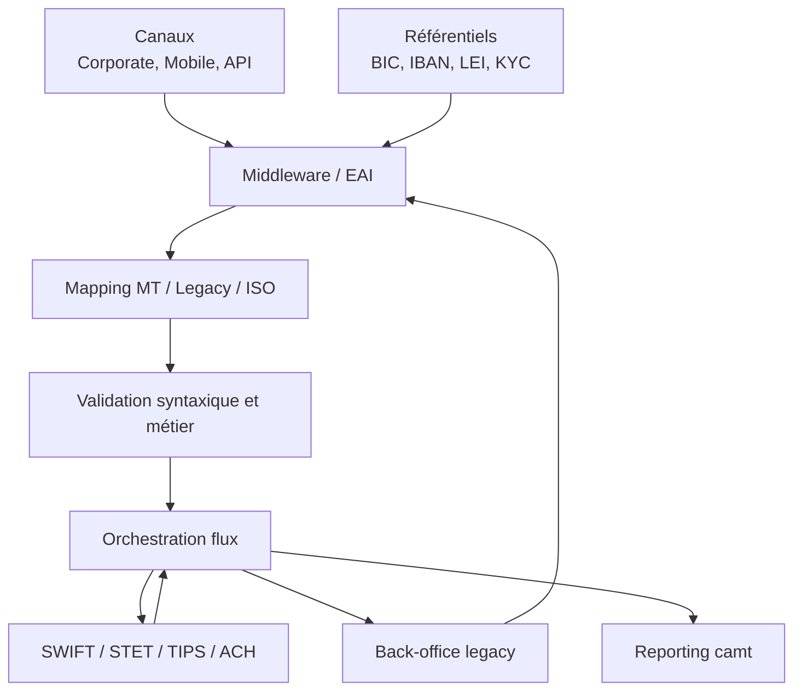

## 3.12 Les impacts SI

La migration ISO 20022 impacte plusieurs couches du SI.

| Couche SI | Impact |
|---|---|
| Canaux clients | collecte de données plus structurées |
| Référentiels | enrichissement BIC, IBAN, LEI, adresse, KYC |
| Middleware | mapping, transformation, validation |
| Back-office | adaptation modèle de données |
| MFT / réseau | fichiers XML plus volumineux |
| Monitoring | nouveaux codes erreur, nouveaux statuts |
| Sécurité/conformité | meilleure qualité screening AML/sanctions |
| Stockage/logs | hausse possible du volume si non maîtrisé |

## 3.13 Processus d’implémentation ISO 20022

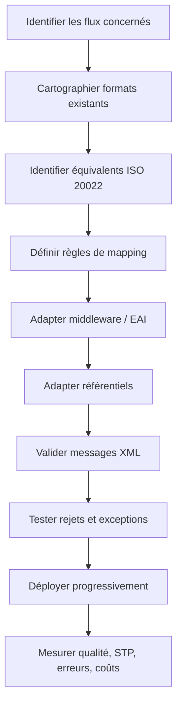

## 3.14 Ce qu’il faut retenir du chapitre 2

Le chapitre 2 montre qu’ISO 20022 est déjà un standard concret, utilisé dans de nombreux domaines financiers.

Pour les paiements, l’enjeu principal est :

```text
Coexistence ancien monde
        ↓
Mapping vers ISO 20022
        ↓
Interopérabilité
        ↓
Automatisation
        ↓
Meilleur STP
        ↓
Moins d’erreurs et moins de retraitements
```

---

# 4. Lecture GreenOps / carbone appliquée aux chapitres 1 et 2

## 4.1 Le paradoxe ISO 20022

ISO 20022 peut augmenter certains coûts techniques :

- XML plus volumineux ;
- parsing plus coûteux ;
- fichiers plus lourds ;
- logs plus volumineux ;
- stockage plus important.

Mais ISO 20022 peut aussi réduire les coûts globaux :

- moins d’erreurs ;
- moins de rejets ;
- moins de retraitements ;
- meilleur STP ;
- meilleure automatisation ;
- meilleure qualité de données.

La bonne analyse carbone ne compare donc pas seulement :

```text
Message court vs message XML long
```

Elle compare :

```text
Ancien format + erreurs + retraitements
vs
ISO 20022 + validation + automatisation
```

## 4.2 Diagramme — Effet carbone

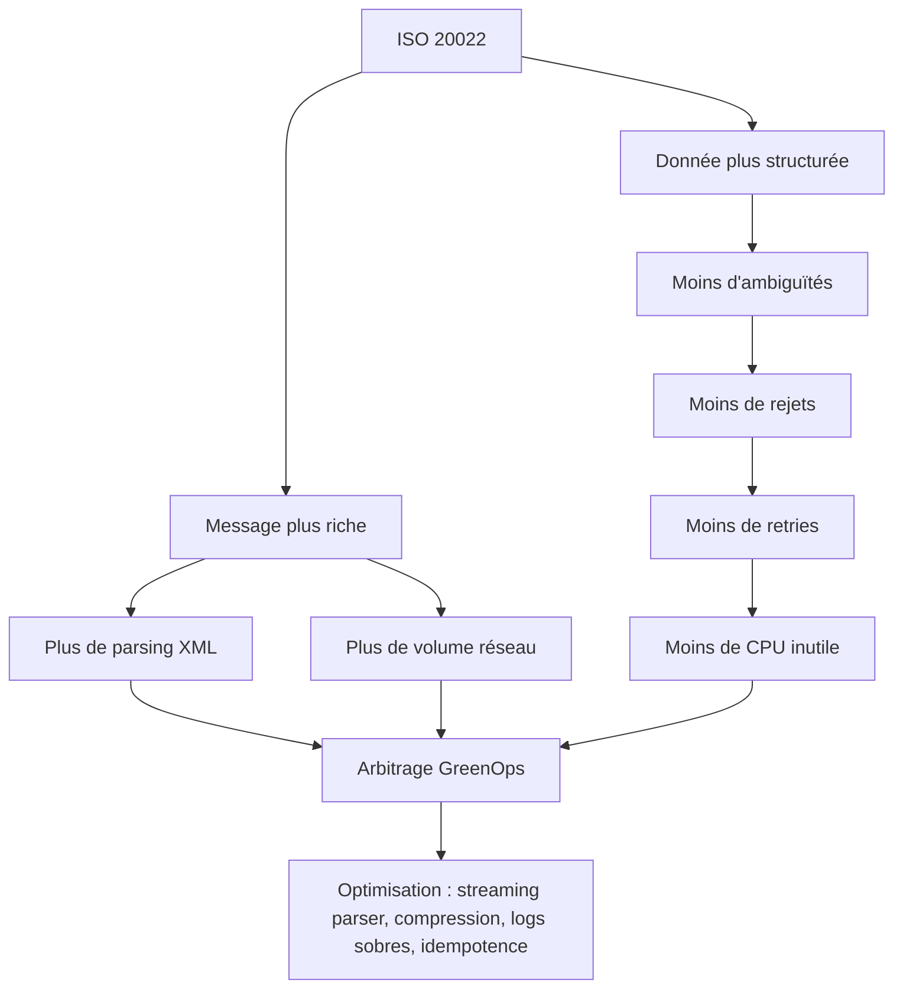

## 4.3 Exemple chiffré simple

Hypothèse : 1 000 000 paiements.

| Scénario | Taille moyenne | Taux erreur | Retraitements | Commentaire |
|---|---:|---:|---:|---|
| Ancien format | 500 octets | 2 % | 20 000 | message léger mais ambigu |
| ISO non optimisé | 4 Ko | 0,5 % | 5 000 | message lourd mais moins d’erreurs |
| ISO optimisé | 4 Ko compressé à 1 Ko | 0,2 % | 2 000 | meilleure cible GreenOps |

Le vrai objectif n’est pas seulement de réduire la taille du message.

Le vrai objectif est de réduire :

- les erreurs ;
- les rejets ;
- les retries ;
- les batchs inutiles ;
- les logs excessifs ;
- les transformations redondantes.

## 4.4 Leviers techniques concrets

| Problème | Risque carbone | Réduction possible |
|---|---|---|
| XML très volumineux | réseau + stockage | compression gzip, compactage, archivage froid |
| Parsing DOM | mémoire élevée | parsing streaming StAX/SAX |
| Mapping multiple | CPU inutile | mapping canonique unique via EAI |
| Rejets récurrents | retries | validation amont stricte |
| Logs complets de messages | stockage massif | logs structurés, masquage, échantillonnage |
| Batchs redondants | CPU inutile | suppression doublons, ordonnancement intelligent |

---

# 5. Synthèse finale

## 5.1 Phrase clé

ISO 20022 devient important parce qu’il donne au monde financier un langage commun, structuré et réutilisable pour échanger des données fiables entre humains, applications, banques et infrastructures de marché.

## 5.2 Pour un architecte paiements

Il faut retenir :

1. ISO 20022 est d’abord un modèle métier.
2. XML n’est qu’une syntaxe.
3. Le dictionnaire est central.
4. Les composants sont réutilisables.
5. Le mapping MT/MX est un chantier majeur.
6. Le middleware/EAI est la zone de transformation stratégique.
7. Le vrai gain vient du STP et de la réduction des erreurs.
8. Le risque GreenOps vient du volume XML, des parsers, des logs et des transformations redondantes.
9. La bonne cible est ISO 20022 + éco-conception.

## 5.3 Schéma final de maîtrise

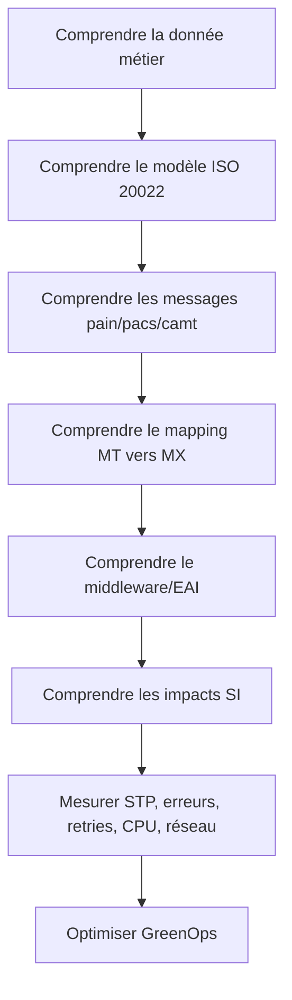

---

# 6. Chapitre 3 — Understanding the ISO 20022 Organisation

## 6.1 De quoi parle ce chapitre ?

Ce chapitre explique comment ISO 20022 est gouverné.

L’idée importante : ISO 20022 n’est pas un standard figé écrit par une seule organisation. C’est un standard ouvert, maintenu par une gouvernance internationale, avec des rôles, des groupes d’experts et un processus officiel de création/modification des messages.

## 6.2 Pourquoi cette gouvernance est importante

Pour une banque, ce point est essentiel :

- les messages doivent être fiables ;
- les définitions doivent être stables ;
- les changements doivent être contrôlés ;
- les acteurs doivent partager le même sens métier ;
- les messages doivent être validés par des experts du domaine.

Sans gouvernance forte, ISO 20022 deviendrait rapidement un nouveau chaos de formats.

## 6.3 Les principaux acteurs de gouvernance

| Acteur | Rôle |
|---|---|
| RMG — Registration Management Group | Supervise globalement le processus ISO 20022 |
| RA — Registration Authority | Garde le repository ISO 20022, valide la conformité technique |
| SEG — Standards Evaluation Groups | Groupes d’experts métier qui valident les messages par domaine |
| TSG — Technical Support Group | Apporte un support technique sur l’interprétation du standard |
| Submitter | Organisation qui propose un nouveau message ou une évolution |

## 6.4 Processus de création d’un message ISO 20022

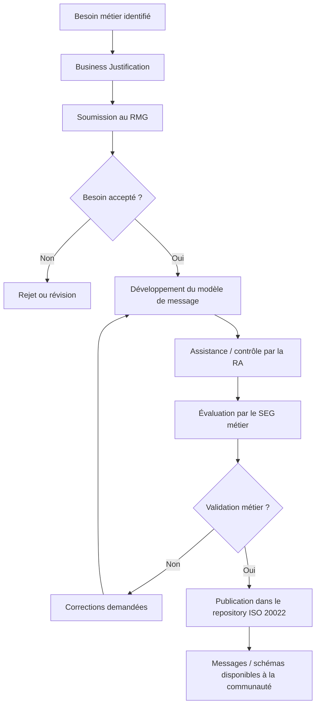

## 6.5 Lecture architecte

Pour un architecte SI, cette gouvernance veut dire :

1. Un message ISO 20022 a une légitimité métier.
2. Les définitions sont maintenues dans un repository central.
3. Les changements doivent être suivis comme des changements applicatifs critiques.
4. Une migration ISO 20022 doit être pilotée avec une gestion de versions.
5. Les équipes doivent surveiller les releases et change requests.

## 6.6 Impact sur une DSI bancaire

| Sujet | Impact DSI |
|---|---|
| Change Request ISO | Adapter mappings, schémas, tests |
| Nouvelle version de message | Régression sur parsers, validateurs, middleware |
| Évolution réglementaire | Mise à jour des règles métier |
| Repository ISO | Source de vérité pour les équipes architecture/data |
| MyStandards / outils SWIFT | Aide au suivi des guidelines et pratiques de marché |

## 6.7 Point clé à retenir

ISO 20022 est fiable parce qu’il est gouverné.

Le standard ne repose pas seulement sur des fichiers XML. Il repose sur :

```text
Besoin métier
   ↓
Validation internationale
   ↓
Modélisation standardisée
   ↓
Publication officielle
   ↓
Implémentation par les banques et infrastructures
```

---

# 7. Chapitre 4 — A Perfect Partnership: ISO 20022 and SWIFT

## 7.1 De quoi parle ce chapitre ?

Ce chapitre explique le rôle de SWIFT dans ISO 20022.

SWIFT n’est pas seulement un réseau de messagerie bancaire. Dans le contexte ISO 20022, SWIFT joue plusieurs rôles :

- contributeur historique ;
- Registration Authority ;
- fournisseur d’outils ;
- fournisseur de réseau sécurisé ;
- fournisseur de règles de mapping MT/MX ;
- accompagnateur de migration.

## 7.2 SWIFT comme Registration Authority

SWIFT maintient le repository ISO 20022 pour le compte de l’ISO.

Cela signifie que SWIFT contribue à :

- maintenir les définitions ;
- publier les messages ;
- garantir la cohérence des modèles ;
- mettre à disposition les schémas ;
- fournir des outils d’exploration et d’implémentation.

## 7.3 Les outils SWIFT importants

| Outil / Service | Utilité |
|---|---|
| MyStandards | Explorer les standards, guidelines et règles d’usage |
| Standards Editor | Modéliser / documenter des messages ISO 20022 |
| SWIFTNet | Réseau sécurisé pour échanges financiers |
| Mapping rules | Règles de correspondance MT vers ISO 20022 |
| Training / SWIFTSmart | Formation des équipes |
| Consulting | Accompagnement des migrations |

## 7.4 Diagramme — Rôle de SWIFT dans l’écosystème ISO 20022

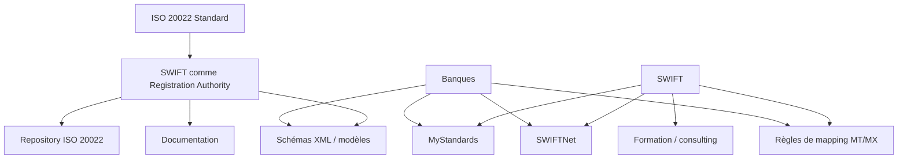

## 7.5 SWIFT, MT et MX

Dans le monde SWIFT :

- MT = ancien format historique, souvent tag/value ;
- MX = message XML échangé sur SWIFTNet, généralement aligné ISO 20022.

La migration paiement consiste donc souvent à passer :

```text
MT legacy
   ↓
Mapping / coexistence
   ↓
MX ISO 20022
```

## 7.6 Exemple d’impact architecture

Avant :

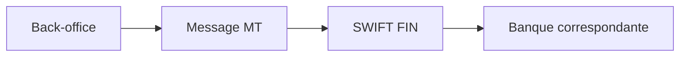

Après :

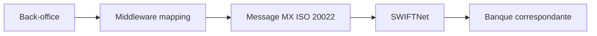

## 7.7 Point clé à retenir

SWIFT facilite l’industrialisation d’ISO 20022 :

- en fournissant les standards ;
- en fournissant les outils ;
- en fournissant les règles de mapping ;
- en opérant le réseau ;
- en accompagnant la transition MT/MX.

---

# 8. Chapitre 5 — Ten Reasons to Adopt ISO 20022

## 8.1 De quoi parle ce chapitre ?

Ce chapitre donne les raisons principales d’adopter ISO 20022.

La valeur du chapitre : il résume les bénéfices métier et SI.

## 8.2 Les raisons principales

| Raison | Explication |
|---|---|
| Standard ouvert | Utilisable par toute la communauté financière |
| Gouvernance claire | Processus maintenu par des groupes internationaux |
| Dictionnaire commun | Même vocabulaire métier pour tous |
| Composants réutilisables | Moins de duplication dans les messages |
| Interopérabilité | Facilite le mapping entre standards |
| Validation métier | Les schémas permettent de contrôler les messages |
| Support XML / autres syntaxes | XML aujourd’hui, JSON/API possible selon usage |
| Évolutivité | Le standard peut évoluer avec les besoins métier |
| Réduction des ambiguïtés | Moins d’interprétation humaine |
| Automatisation | Meilleur STP, moins de rejets, meilleure intégration |

## 8.3 Lecture architecture paiements

Pour une plateforme paiement, les bénéfices se traduisent en :

- meilleure qualité des données ;
- meilleure automatisation des flux ;
- meilleure conformité ;
- meilleure réconciliation ;
- meilleur monitoring ;
- réduction des erreurs opérationnelles ;
- meilleure préparation aux API et au temps réel.

## 8.4 Diagramme — Chaîne de valeur ISO 20022

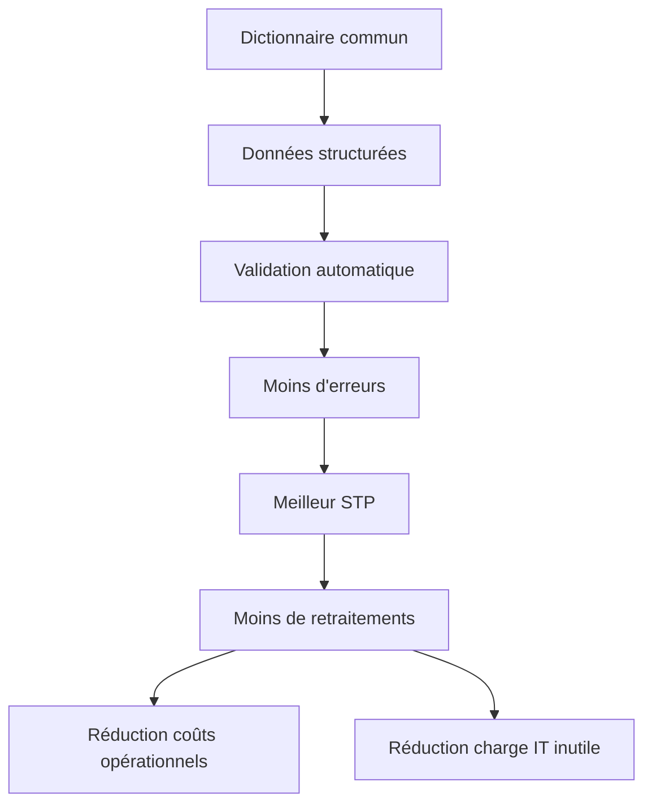

## 8.5 Lien avec GreenOps

Les raisons d’adopter ISO 20022 ont aussi un impact carbone indirect :

| Bénéfice ISO 20022 | Effet GreenOps |
|---|---|
| Donnée structurée | Moins de rejets |
| Validation stricte | Moins de messages invalides propagés |
| STP amélioré | Moins d’interventions et de retraitements |
| Mapping standardisé | Moins de transformations spécifiques |
| Composants réutilisables | Moins de duplication applicative |

## 8.6 Point clé à retenir

ISO 20022 est utile parce qu’il réduit l’ambiguïté.

Moins d’ambiguïté signifie :

```text
Moins d’erreurs
   ↓
Moins de retraitements
   ↓
Moins de coûts
   ↓
Moins de consommation inutile
```

---

# 9. Chapitre 6 — Almost Ten Things to Tell Your CIO about ISO 20022

## 9.1 De quoi parle ce chapitre ?

Ce chapitre donne une synthèse destinée à un CIO / DSI.

Son message principal : ISO 20022 n’est pas un sujet purement technique. C’est un sujet stratégique de transformation de la donnée financière.

## 9.2 Ce qu’un CIO doit comprendre

| Message pour CIO | Sens concret |
|---|---|
| ISO 20022 est ouvert | Pas dépendant d’un fournisseur unique |
| C’est une méthodologie | Pas seulement un format XML |
| Il couvre messages et API | Compatible avec architecture moderne |
| Il fournit un langage commun | Utile pour humains et machines |
| Il aide l’intégration interne | Peut servir de modèle canonique SI |
| Il facilite la coexistence | Permet MT, MX, formats internes |
| Il accélère l’automatisation | Moins de friction opérationnelle |
| Il devient global | Adoption massive par infrastructures de marché |

## 9.3 Ce que cela veut dire pour la stratégie SI

Une DSI ne doit pas traiter ISO 20022 comme une simple migration de format.

Elle doit le traiter comme :

- un chantier de data architecture ;
- un chantier de middleware ;
- un chantier de référentiel ;
- un chantier de conformité ;
- un chantier d’observabilité ;
- un chantier d’urbanisation des flux.

## 9.4 Diagramme — Vision CIO

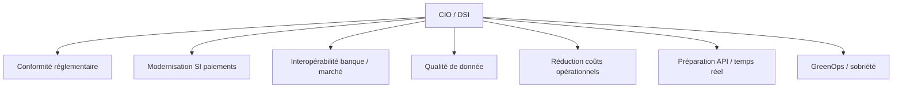

## 9.5 Les décisions CIO à prendre

| Décision | Question clé |
|---|---|
| Modèle canonique | ISO 20022 doit-il devenir le modèle interne pivot ? |
| Middleware | Où placer la transformation MT/MX ? |
| Référentiels | Les données BIC, IBAN, LEI, adresse sont-elles propres ? |
| Tests | Comment valider tous les scénarios de rejet ? |
| Observabilité | Quels KPIs suivre : STP, rejet, latence, retry, carbone ? |
| Gouvernance | Qui porte les évolutions ISO 20022 dans l’entreprise ? |

## 9.6 Point clé à retenir

Pour un CIO, ISO 20022 est une opportunité de modernisation.

La mauvaise approche :

```text
Remplacer un format par un autre
```

La bonne approche :

```text
Repenser la donnée financière, les mappings, les référentiels, le middleware et les processus de bout en bout
```

---

# 10. Chapitre 7 — Useful Links for Standards Implementers

## 10.1 De quoi parle ce chapitre ?

Ce chapitre liste les ressources utiles pour les personnes qui doivent implémenter ISO 20022.

Pour un architecte, l’intérêt est de savoir où chercher l’information officielle.

## 10.2 Ressources principales

| Ressource | Utilité |
|---|---|
| iso20022.org | Repository officiel, messages, dictionnaire |
| swift.com | Documentation SWIFT, migration, CBPR+ |
| MyStandards | Guidelines, règles d’usage, validations |
| XML / W3C | Comprendre XML et schémas |
| FIX | Standards marchés financiers |
| FpML | Produits dérivés |
| XBRL | Reporting financier |
| Payments Market Practice Group | Bonnes pratiques paiements |

## 10.3 Comment utiliser ces ressources dans un projet

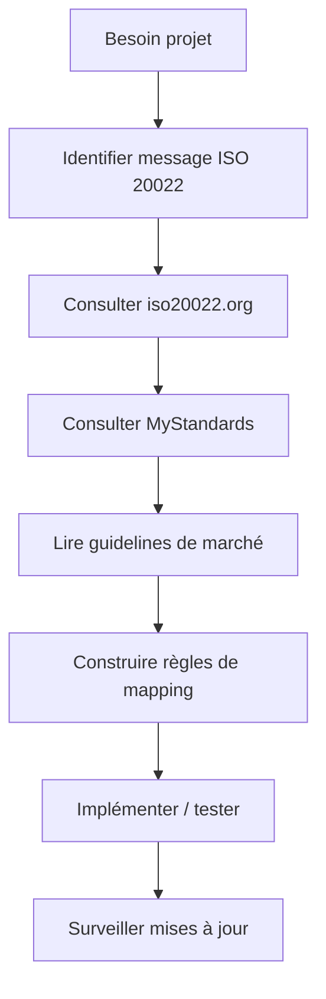

## 10.4 Point clé à retenir

Dans un projet ISO 20022, il ne faut jamais travailler seulement à partir d’un exemple trouvé dans un document.

Il faut travailler avec :

- la documentation officielle ;
- les schémas ;
- les guidelines de marché ;
- les règles de mapping ;
- les pratiques SWIFT / infrastructure cible.

---

# 11. Glossaire enrichi

| Terme | Sens |
|---|---|
| ISO 20022 | Méthodologie et standard de données financières |
| Syntaxe | Forme physique du message |
| Sémantique | Sens métier de la donnée |
| XML | Format textuel structuré utilisé par beaucoup de messages ISO 20022 |
| JSON | Format léger souvent utilisé pour API |
| MT | Ancien format SWIFT tag/value |
| MX | Message XML échangé sur SWIFTNet |
| pain | Payment initiation |
| pacs | Payments clearing and settlement |
| camt | Cash management |
| remt | Remittance advice |
| EAI | Middleware d’intégration applicative |
| Middleware | Couche logicielle qui transforme, route, enrichit et orchestre les messages |
| STP | Straight Through Processing, traitement automatisé bout-en-bout |
| Mapping | Transformation d’un format vers un autre |
| Translation rules | Règles de traduction entre deux standards |
| Debtor | Celui qui paie |
| Creditor | Celui qui reçoit |
| DebtorAgent | Banque du débiteur |
| CreditorAgent | Banque du créancier |
| Business component | Concept métier réutilisable dans ISO 20022 |
| Message component | Structure de données utilisée dans un message |
| Repository ISO 20022 | Référentiel central des définitions ISO 20022 |
| Dictionary | Dictionnaire des composants et concepts réutilisables |
| RMG | Groupe de supervision ISO 20022 |
| RA | Registration Authority, gardien du repository |
| SEG | Groupe d’experts qui valide les messages par domaine |
| MyStandards | Plateforme SWIFT pour gérer standards et guidelines |
| FIN | Service SWIFT historique pour messages MT |
| SWIFTNet | Réseau sécurisé SWIFT pour échanges financiers |
| ACH | Chambre de compensation automatisée |
| RTGS | Real Time Gross Settlement System |
| API | Interface applicative permettant des échanges entre systèmes |

---

# 12. Synthèse globale du livre

## 12.1 Ce que le livre enseigne vraiment

Le livre ne cherche pas seulement à expliquer des balises XML.

Il enseigne que le monde financier a besoin :

- d’un langage commun ;
- d’un dictionnaire commun ;
- d’une méthode commune ;
- d’une gouvernance commune ;
- d’une capacité d’interopérabilité entre ancien et nouveau monde.

## 12.2 Vision complète

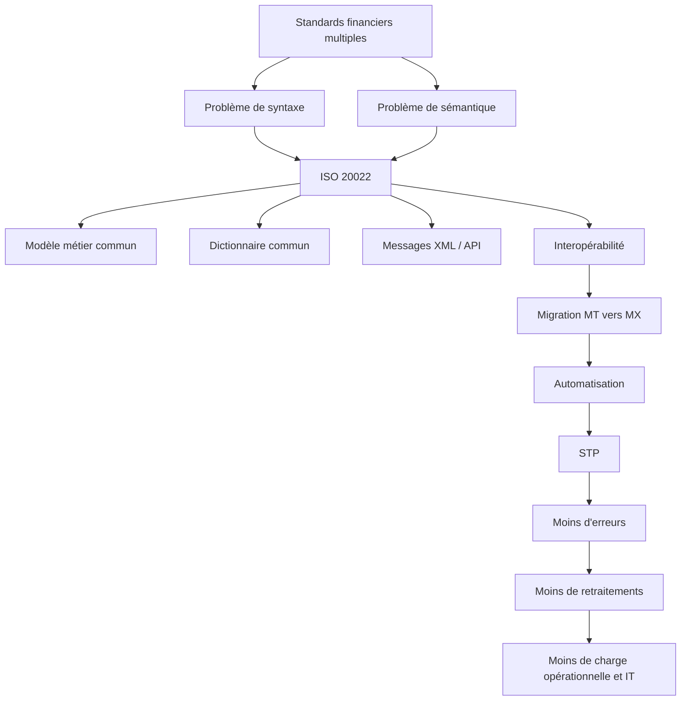

## 12.3 Lecture finale pour ton objectif GreenOps paiements

ISO 20022 peut augmenter la taille brute des messages, mais il peut réduire l’empreinte globale si l’architecture est bien conçue.

La cible n’est pas :

```text
faire du XML
```

La cible est :

```text
produire une chaîne paiement structurée, validée, automatisée, mesurée et sobre
```

## 12.4 Les questions à poser en audit ISO 20022 + GreenOps

| Domaine | Questions d’audit |
|---|---|
| Données | Les champs ISO 20022 sont-ils correctement alimentés ? |
| Mapping | Combien de mappings successifs sont faits ? |
| Middleware | Existe-t-il un modèle canonique ou des transformations multiples ? |
| Parsing | DOM ou streaming parser ? |
| Réseau | Les flux XML sont-ils compressés ? |
| Rejets | Quels sont les top motifs de rejet ? |
| Retries | Les retries sont-ils contrôlés et idempotents ? |
| Logs | Stocke-t-on le message complet inutilement ? |
| STP | Quel est le taux de traitement automatisé bout-en-bout ? |
| Carbone | Mesure-t-on kWh, CPU, stockage, réseau par flux ? |

## 12.5 Mini-roadmap de maîtrise

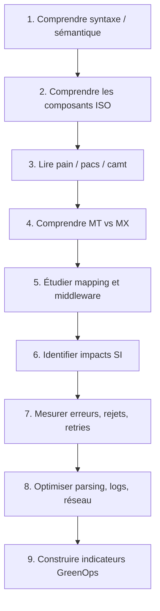

---

# 13. Conclusion du polycopié

ISO 20022 est un standard stratégique pour les paiements car il transforme la donnée financière en langage structuré, gouverné, réutilisable et interopérable.

Pour un architecte, il faut le comprendre à quatre niveaux :

1. Niveau métier : qui paie, qui reçoit, quel montant, quelle date, quelle banque.
2. Niveau data : composants, dictionnaire, champs obligatoires, règles.
3. Niveau intégration : mapping MT/MX, middleware, EAI, coexistence.
4. Niveau exploitation : validation, rejets, retries, monitoring, coûts, carbone.

La maîtrise ISO 20022 devient donc une compétence d’architecture complète : paiement, data, intégration, réglementation, résilience et GreenOps.

