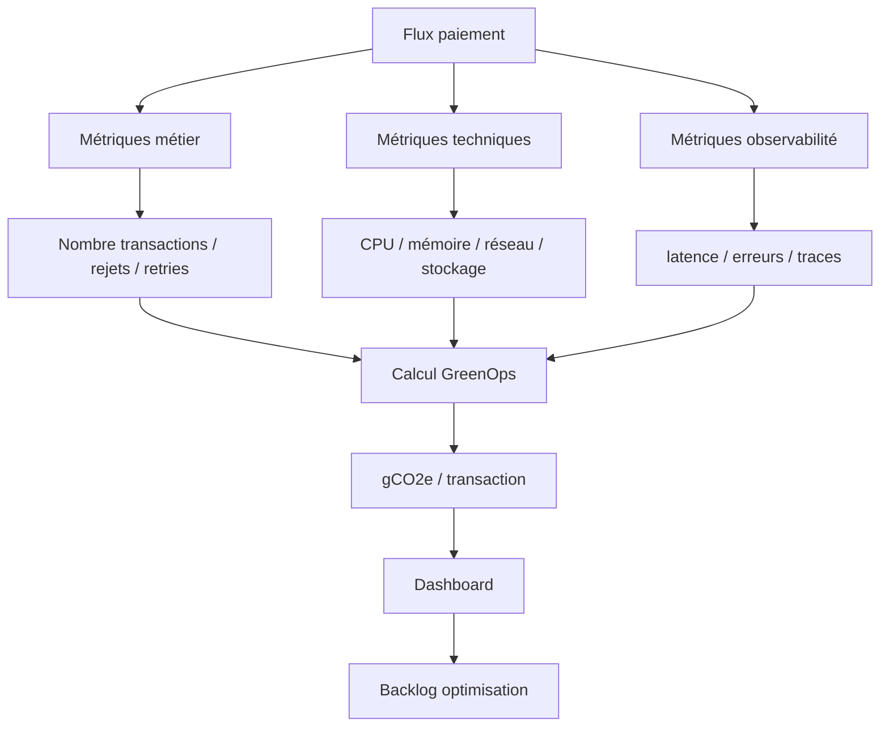
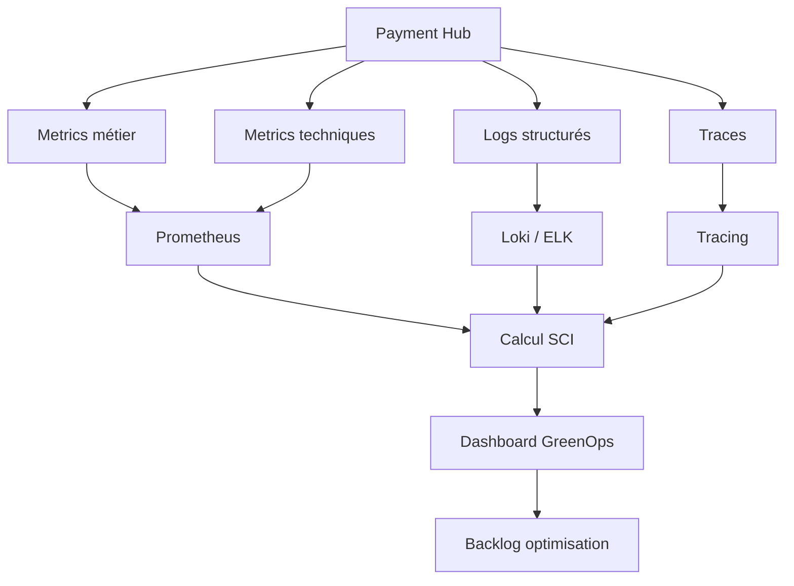

# 02 — Mesure carbone des flux de paiements

## 1. Objectif du document

Ce document explique comment mesurer l’empreinte carbone des flux de paiements bancaires.

Il couvre :

- les unités de mesure ;
- les sources de consommation IT ;
- les formules de calcul ;
- les exemples SCT, SDD, SCT Inst et cross-border ;
- les indicateurs GreenOps ;
- les limites de mesure ;
- la méthode de mise en œuvre dans une plateforme paiement.

L’objectif est de passer d’une intuition :

```text
ce flux consomme probablement beaucoup
```

à une mesure pilotable :

```text
ce flux consomme X kWh et Y gCO2e pour 1000 transactions
```

---

## 2. Pourquoi mesurer ?

On ne peut pas réduire ce qu’on ne mesure pas.

Dans les paiements, les sources de consommation sont souvent invisibles :

- parsing XML ;
- validation XSD ;
- mapping ;
- appels référentiels ;
- contrôles fraude / AML ;
- retries ;
- batchs rejoués ;
- logs ;
- stockage ;
- reporting camt ;
- archivage.

Sans mesure, les décisions restent subjectives.

Avec mesure, on peut prioriser :

```text
où agir ?
combien gagner ?
quel flux optimiser d’abord ?
quel KPI suivre ?
```

---

## 3. Unité fonctionnelle

La mesure carbone doit être normalisée par une unité fonctionnelle.

Exemples :

| Flux | Unité fonctionnelle recommandée |
|---|---|
| SCT | gCO2e / 1000 virements SCT |
| SDD | gCO2e / 1000 prélèvements SDD |
| SCT Inst | gCO2e / transaction instantanée |
| Cross-border | gCO2e / paiement international |
| Cash Management | gCO2e / 1000 messages camt |
| Batch | gCO2e / batch traité |
| API | gCO2e / 1000 appels API |

Sans unité fonctionnelle, deux flux ne sont pas comparables.

---

## 4. Formule de base

La formule simplifiée est :

```text
Carbone = Énergie consommée × Intensité carbone de l’électricité
```

Avec :

```text
Énergie = kWh
Intensité carbone = gCO2e/kWh
Carbone = gCO2e
```

Exemple :

```text
100 kWh × 50 gCO2e/kWh = 5000 gCO2e = 5 kgCO2e
```

---

## 5. Formule par transaction

Pour mesurer un flux :

```text
gCO2e / transaction = carbone total du flux / nombre de transactions utiles
```

Exemple :

```text
5000 gCO2e / 100000 transactions = 0,05 gCO2e / transaction
```

Pour plus de lisibilité :

```text
gCO2e / 1000 transactions = gCO2e total / nombre transactions × 1000
```

---

## 6. Modèle SCI

Le modèle SCI — Software Carbon Intensity — peut s’écrire :

```text
SCI = ((E × I) + M) / R
```

Avec :

| Variable | Signification |
|---|---|
| E | énergie consommée par le logiciel |
| I | intensité carbone de l’électricité |
| M | part carbone matériel allouée |
| R | unité fonctionnelle |

Dans le contexte paiement :

```text
R = nombre de transactions traitées
```

Exemples :

- R = 1000 SCT ;
- R = 1 SCT Inst ;
- R = 1000 camt.054 ;
- R = 1 batch SDD.

---

## 7. Sources de données nécessaires

Pour mesurer correctement, il faut croiser plusieurs données :

| Donnée | Source possible |
|---|---|
| nombre de transactions | moteur paiement, logs métier |
| taux de rejet | observabilité métier |
| taux retry | logs applicatifs, traces |
| CPU utilisé | APM, Kubernetes, OS |
| mémoire | APM, Kubernetes |
| stockage logs | ELK, Loki, SIEM |
| taille message | middleware, gateway |
| énergie serveur | Scaphandre, Kepler, cloud metrics |
| intensité carbone | Electricity Maps, provider cloud, ADEME selon contexte |
| durée batch | ordonnanceur, scheduler, logs |
| volume camt | reporting engine |

---

## 8. Chaîne de mesure



---

## 9. Exemple SCT batch

### Hypothèses

- 5 000 000 virements SCT par jour ;
- coût moyen d’un traitement SCT : 0,4 Wh ;
- taux de rejet : 1 % ;
- chaque rejet génère un retraitement complet ;
- intensité carbone : 50 gCO2e/kWh.

### Calcul transactions

```text
Transactions utiles = 5 000 000
Rejets = 5 000 000 × 1 % = 50 000
Total traitements = 5 050 000
```

### Calcul énergie

```text
5 050 000 × 0,4 Wh = 2 020 000 Wh
= 2 020 kWh
```

### Calcul carbone

```text
2 020 kWh × 50 gCO2e/kWh = 101 000 gCO2e
= 101 kgCO2e / jour
```

### Intensité par transaction utile

```text
101 000 gCO2e / 5 000 000 = 0,0202 gCO2e / SCT
```

### Intensité par 1000 SCT

```text
0,0202 × 1000 = 20,2 gCO2e / 1000 SCT
```

---

## 10. Lecture architecte SCT

Le vrai gaspillage n’est pas seulement le traitement normal.

Le gaspillage vient de :

```text
rejets
+ retraitements
+ logs supplémentaires
+ batchs rejoués
+ support opérationnel
```

Si le taux de rejet passe de 1 % à 0,2 % :

```text
Rejets = 10 000 au lieu de 50 000
Gain = 40 000 traitements évités / jour
```

Énergie évitée :

```text
40 000 × 0,4 Wh = 16 kWh / jour
```

Carbone évité :

```text
16 × 50 = 800 gCO2e / jour
```

---

## 11. Exemple SDD

### Hypothèses

- 2 000 000 prélèvements SDD par jour ;
- taux R-transactions : 3 % ;
- chaque R-transaction génère 1,5 traitement supplémentaire ;
- coût traitement : 0,6 Wh ;
- intensité carbone : 50 gCO2e/kWh.

### Calcul

```text
R-transactions = 2 000 000 × 3 % = 60 000
Traitements supplémentaires = 60 000 × 1,5 = 90 000
Total traitements = 2 090 000
```

Énergie :

```text
2 090 000 × 0,6 Wh = 1 254 000 Wh
= 1 254 kWh
```

Carbone :

```text
1 254 × 50 = 62 700 gCO2e
= 62,7 kgCO2e / jour
```

### Lecture architecte

Le SDD consomme surtout via :

- mandats invalides ;
- retours ;
- refunds ;
- litiges ;
- réconciliations ;
- conservation documentaire.

Le levier prioritaire n’est pas uniquement technique. Il est aussi data et métier :

```text
qualité mandat
+ qualité IBAN
+ réduction R-transactions
```

---

## 12. Exemple SCT Inst

### Hypothèses

- 1 000 000 SCT Inst par jour ;
- taux timeout : 0,8 % ;
- chaque timeout génère 2 retries ;
- coût traitement complet : 0,8 Wh ;
- intensité carbone : 50 gCO2e/kWh.

### Calcul

```text
Timeouts = 1 000 000 × 0,8 % = 8 000
Retries = 8 000 × 2 = 16 000
Total traitements = 1 016 000
```

Énergie :

```text
1 016 000 × 0,8 Wh = 812 800 Wh
= 812,8 kWh
```

Carbone :

```text
812,8 × 50 = 40 640 gCO2e
= 40,64 kgCO2e / jour
```

### Lecture architecte

Dans le SCT Inst, le coût carbone vient fortement de :

- disponibilité 24/7 ;
- faible latence ;
- retries ;
- timeouts ;
- fraude temps réel ;
- statuts incertains ;
- supervision continue.

Réduire les retries est souvent plus efficace que réduire la taille du message XML.

---

## 13. Exemple cross-border

### Hypothèses

- 500 000 paiements internationaux par jour ;
- taux d’alertes AML/sanctions : 5 % ;
- chaque alerte génère 3 traitements supplémentaires ;
- coût moyen traitement : 1 Wh ;
- intensité carbone : 50 gCO2e/kWh.

### Calcul

```text
Alertes = 500 000 × 5 % = 25 000
Traitements supplémentaires = 25 000 × 3 = 75 000
Total traitements = 575 000
```

Énergie :

```text
575 000 × 1 Wh = 575 kWh
```

Carbone :

```text
575 × 50 = 28 750 gCO2e
= 28,75 kgCO2e / jour
```

### Lecture architecte

Le cross-border consomme via :

- screening AML ;
- faux positifs ;
- mapping MT/MX ;
- investigations ;
- conservation réglementaire ;
- messages enrichis.

ISO 20022 peut réduire une partie des faux positifs si les données sont mieux structurées.

---

## 14. Mesure des logs

Les logs sont souvent sous-estimés.

### Hypothèse

- 10 000 000 messages ISO par jour ;
- taille XML moyenne : 4 Ko ;
- message complet loggé dans 3 systèmes.

Volume logs :

```text
10 000 000 × 4 Ko × 3 = 120 000 000 Ko
≈ 120 Go / jour
```

Sur 30 jours :

```text
3,6 To
```

Si on remplace le payload complet par :

- messageId ;
- EndToEndId ;
- statut ;
- hash ;
- code erreur ;
- taille message ;

et que le log moyen passe à 0,5 Ko :

```text
10 000 000 × 0,5 Ko × 3 = 15 Go / jour
```

Gain :

```text
105 Go / jour
```

---

## 15. Métriques à collecter

| Catégorie | Métrique |
|---|---|
| Métier | nombre transactions |
| Métier | taux STP |
| Métier | taux rejet |
| Métier | taux R-transactions |
| Technique | CPU/message |
| Technique | mémoire/message |
| Technique | taille XML |
| Technique | volume logs |
| SRE | P95/P99 latence |
| SRE | retry rate |
| SRE | timeout rate |
| GreenOps | kWh/1000 transactions |
| GreenOps | gCO2e/transaction |
| GreenOps | gCO2e/batch |

---

## 16. Méthode de mesure progressive

### Niveau 1 — Estimation

Utiliser des hypothèses :

```text
volume × coût moyen × intensité carbone
```

Avantage :

- rapide ;
- utile pour cadrage.

Limite :

- approximatif.

### Niveau 2 — Mesure technique

Collecter :

- CPU ;
- mémoire ;
- durée ;
- logs ;
- réseau.

Avantage :

- plus fiable.

### Niveau 3 — Mesure automatisée

Intégrer :

- Prometheus ;
- Grafana ;
- Kepler ;
- Scaphandre ;
- APM ;
- SCI calculator.

Avantage :

- pilotage continu.

---

## 17. Architecture de mesure cible



---

## 18. Table de conversion simple

| Mesure | Conversion |
|---|---|
| 1000 Wh | 1 kWh |
| 1000 gCO2e | 1 kgCO2e |
| 1000 kgCO2e | 1 tCO2e |
| gCO2e/transaction × 1000 | gCO2e/1000 transactions |

---

## 19. Limites de la mesure

La mesure carbone applicative n’est jamais parfaite.

Limites :

- infrastructure mutualisée ;
- données cloud parfois agrégées ;
- intensité carbone variable ;
- allocation matériel difficile ;
- logs incomplets ;
- manque de mesure réseau ;
- batchs partagés ;
- APM non calibré.

L’objectif n’est pas la perfection immédiate.

L’objectif est :

```text
mesure raisonnable
+ tendance
+ priorisation
+ amélioration continue
```

---

## 20. Questions d’audit

| Question | Objectif |
|---|---|
| Le volume par flux est-il connu ? | cadrage |
| Le taux retry est-il connu ? | gaspillage |
| Le taux rejet est-il connu ? | qualité |
| Le CPU/message est-il connu ? | performance |
| Le volume logs/message est-il connu ? | stockage |
| Les batchs les plus coûteux sont-ils identifiés ? | priorisation |
| Le SCI est-il calculé ? | GreenOps |
| Les gains sont-ils suivis ? | pilotage |
| Les dashboards existent-ils ? | exploitation |
| Les optimisations alimentent-elles un backlog ? | gouvernance |

---

## 21. Synthèse

Mesurer le carbone des paiements nécessite de relier :

```text
volumes métier
+ métriques techniques
+ intensité carbone
+ unité fonctionnelle
```

Les meilleurs leviers ne sont pas toujours là où on pense.

Dans les paiements, les grands gisements sont souvent :

- rejets ;
- retries ;
- logs ;
- mappings multiples ;
- batchs rejoués ;
- reporting volumineux ;
- référentiels lents.

La mesure doit servir à décider, prioriser et prouver les gains.
