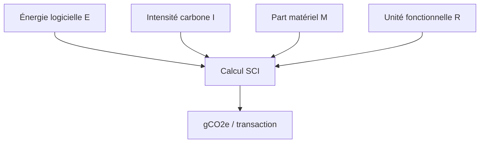
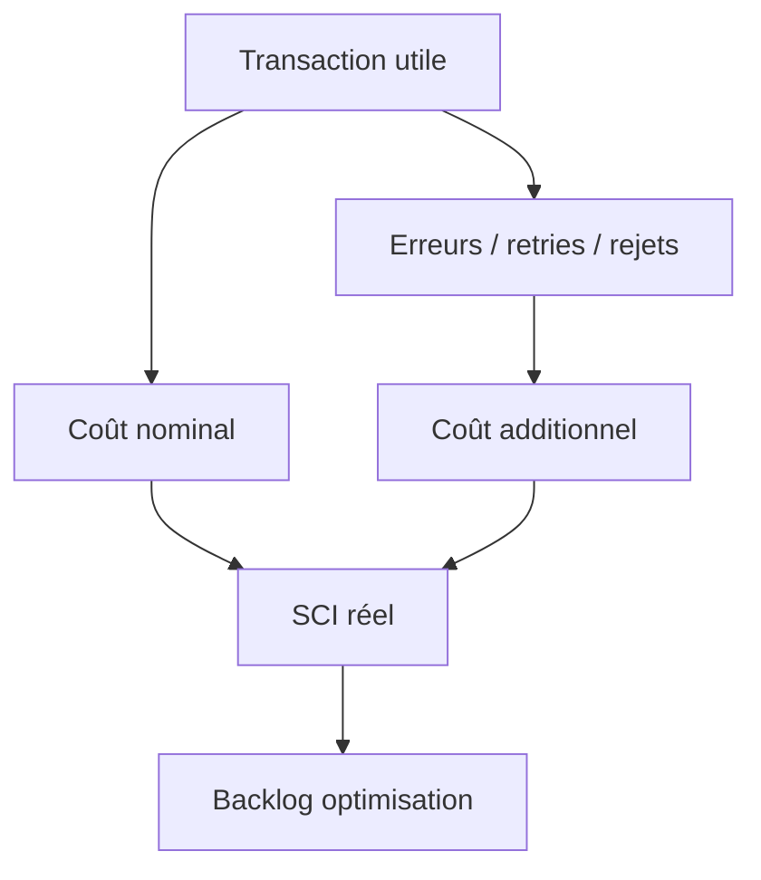

# 03 — Modèle SCI appliqué aux flux de paiements

## 1. Objectif du document

Ce document explique comment utiliser le modèle **SCI — Software Carbon Intensity** pour mesurer l’intensité carbone des flux de paiements bancaires.

Il couvre :

- la formule SCI ;
- les variables E, I, M et R ;
- le choix de l’unité fonctionnelle ;
- l’allocation de l’énergie entre flux ;
- les exemples SCT, SDD, SCT Inst, cross-border et cash management ;
- les limites du modèle ;
- la manière de l’utiliser dans une architecture GreenOps.

---

## 2. Pourquoi utiliser SCI ?

Le problème des systèmes IT bancaires est qu’ils sont mutualisés.

Une même plateforme peut traiter :

- SCT ;
- SDD ;
- SCT Inst ;
- paiements internationaux ;
- camt ;
- contrôles AML ;
- logs ;
- reporting ;
- API.

Il faut donc une méthode pour répondre à une question simple :

```text
Combien de carbone consomme une transaction utile ?
```

Le SCI permet de normaliser la mesure par unité fonctionnelle.

---

## 3. Formule SCI

La formule générale est :

```text
SCI = ((E × I) + M) / R
```

Avec :

| Variable | Signification |
|---|---|
| E | énergie consommée par le logiciel en kWh |
| I | intensité carbone de l’électricité en gCO2e/kWh |
| M | émissions embarquées / matériel allouées au logiciel |
| R | unité fonctionnelle |

Dans notre contexte :

```text
R = nombre de transactions utiles traitées
```

---

## 4. Lecture simple

```text
SCI = carbone total / service rendu
```

Exemples :

```text
gCO2e / transaction SCT
gCO2e / 1000 prélèvements SDD
gCO2e / paiement instantané
gCO2e / message camt
gCO2e / batch
```

---

## 5. Diagramme du modèle SCI



---

## 6. Variable E — Énergie consommée

E représente l’énergie utilisée pour faire fonctionner le logiciel.

Dans une plateforme paiement, E peut inclure :

- CPU applicatif ;
- mémoire ;
- stockage ;
- réseau ;
- bases de données ;
- middleware ;
- observabilité ;
- batch scheduler ;
- moteurs de règles ;
- connecteurs STET/TIPS/SWIFT.

Exemples de sources de mesure :

| Environnement | Source possible |
|---|---|
| Kubernetes | Kepler |
| VM Linux | Scaphandre |
| Cloud | métriques provider |
| APM | CPU / durée / service |
| Batch | durée job + ressources |
| Logs | volume stockage |
| Base de données | consommation estimée / requêtes |

---

## 7. Variable I — Intensité carbone

I représente l’empreinte carbone de l’électricité utilisée.

Exemple :

```text
I = 50 gCO2e/kWh
```

L’intensité carbone dépend :

- du pays ;
- du datacenter ;
- de l’heure ;
- du mix énergétique ;
- du fournisseur cloud ;
- de la localisation.

Pour une première estimation, on peut utiliser une valeur moyenne.

Pour une mesure avancée, on peut utiliser une intensité horaire.

---

## 8. Variable M — Part matériel

M représente les émissions embarquées du matériel.

Exemples :

- fabrication serveurs ;
- stockage ;
- réseau ;
- remplacement matériel ;
- équipements datacenter.

Dans une première version, M peut être approximé ou exclu, mais il faut le documenter :

```text
SCI simplifié = (E × I) / R
```

Dans une version mature, M est alloué selon :

- CPU consommé ;
- mémoire consommée ;
- stockage utilisé ;
- durée d’usage ;
- part applicative.

---

## 9. Variable R — Unité fonctionnelle

R est le service rendu.

C’est la variable la plus importante.

Exemples :

| Flux | R recommandé |
|---|---|
| SCT | 1000 virements SCT traités |
| SDD | 1000 prélèvements SDD traités |
| SCT Inst | 1 paiement instantané abouti |
| Cross-border | 1 paiement international traité |
| Cash management | 1000 camt générés |
| Batch SCT | 1 batch traité |
| API paiement | 1000 appels API |

Le choix de R doit rester stable pour suivre les progrès.

---

## 10. SCI simplifié

Pour démarrer rapidement :

```text
SCI = (E × I) / R
```

Exemple :

```text
E = 100 kWh
I = 50 gCO2e/kWh
R = 1 000 000 transactions
```

Calcul :

```text
SCI = (100 × 50) / 1 000 000
SCI = 5000 / 1 000 000
SCI = 0,005 gCO2e / transaction
```

---

## 11. SCI complet

Avec matériel :

```text
SCI = ((E × I) + M) / R
```

Exemple :

```text
E = 100 kWh
I = 50 gCO2e/kWh
M = 2000 gCO2e alloués
R = 1 000 000 transactions
```

Calcul :

```text
((100 × 50) + 2000) / 1 000 000
= (5000 + 2000) / 1 000 000
= 0,007 gCO2e / transaction
```

---

## 12. Allocation de l’énergie entre flux

Une plateforme paiement peut traiter plusieurs flux en même temps.

Il faut donc allouer l’énergie.

Méthodes possibles :

| Méthode | Principe | Limite |
|---|---|---|
| allocation par volume | énergie répartie selon nb transactions | ignore complexité |
| allocation par CPU | énergie répartie selon CPU utilisé | nécessite métriques |
| allocation par durée | énergie répartie selon temps traitement | approximatif |
| allocation par poids | chaque flux a un coefficient | nécessite calibration |
| allocation par service | métrique par microservice | plus fiable |

---

## 13. Exemple d’allocation simple

Une plateforme consomme :

```text
1000 kWh / jour
```

Elle traite :

| Flux | Volume | Poids technique |
|---|---:|---:|
| SCT | 5 000 000 | 1 |
| SDD | 2 000 000 | 1,5 |
| SCT Inst | 1 000 000 | 2 |
| Cross-border | 500 000 | 3 |

On calcule les unités pondérées :

```text
SCT = 5 000 000 × 1 = 5 000 000
SDD = 2 000 000 × 1,5 = 3 000 000
SCT Inst = 1 000 000 × 2 = 2 000 000
Cross-border = 500 000 × 3 = 1 500 000

Total pondéré = 11 500 000
```

Allocation énergie :

```text
SCT = 1000 × 5 000 000 / 11 500 000 = 434,8 kWh
SDD = 1000 × 3 000 000 / 11 500 000 = 260,9 kWh
SCT Inst = 1000 × 2 000 000 / 11 500 000 = 173,9 kWh
Cross-border = 1000 × 1 500 000 / 11 500 000 = 130,4 kWh
```

---

## 14. Exemple SCI SCT

Hypothèses :

```text
E SCT = 434,8 kWh
I = 50 gCO2e/kWh
R = 5 000 000 SCT
```

Calcul :

```text
SCI SCT = (434,8 × 50) / 5 000 000
= 21 740 / 5 000 000
= 0,00435 gCO2e / SCT
```

Par 1000 SCT :

```text
0,00435 × 1000 = 4,35 gCO2e / 1000 SCT
```

---

## 15. Exemple SCI SDD

Hypothèses :

```text
E SDD = 260,9 kWh
I = 50 gCO2e/kWh
R = 2 000 000 SDD
```

Calcul :

```text
SCI SDD = (260,9 × 50) / 2 000 000
= 13 045 / 2 000 000
= 0,00652 gCO2e / SDD
```

Par 1000 SDD :

```text
6,52 gCO2e / 1000 SDD
```

Le SDD peut avoir une intensité plus forte si les R-transactions sont nombreuses.

---

## 16. Exemple SCI SCT Inst

Hypothèses :

```text
E SCT Inst = 173,9 kWh
I = 50 gCO2e/kWh
R = 1 000 000 SCT Inst
```

Calcul :

```text
SCI SCT Inst = (173,9 × 50) / 1 000 000
= 8695 / 1 000 000
= 0,0087 gCO2e / transaction
```

La valeur est plus élevée que SCT car le temps réel impose :

- disponibilité 24/7 ;
- faible latence ;
- monitoring permanent ;
- retries ;
- fraude temps réel.

---

## 17. Exemple SCI cross-border

Hypothèses :

```text
E cross-border = 130,4 kWh
I = 50 gCO2e/kWh
R = 500 000 paiements
```

Calcul :

```text
SCI = (130,4 × 50) / 500 000
= 6520 / 500 000
= 0,013 gCO2e / paiement
```

Le cross-border est plus intense à cause :

- AML ;
- sanctions ;
- faux positifs ;
- mapping MT/MX ;
- investigations ;
- conservation réglementaire.

---

## 18. SCI et erreurs

Le SCI doit intégrer les traitements inutiles.

Exemple SCT :

```text
transactions utiles = 5 000 000
rejets = 50 000
traitements totaux = 5 050 000
```

Si on divise par les transactions utiles, le SCI montre le coût réel du service rendu.

```text
R = transactions utiles
```

Pas :

```text
R = traitements totaux
```

Sinon on masque le gaspillage.

---

## 19. SCI nominal vs SCI réel

| Mesure | Définition |
|---|---|
| SCI nominal | coût d’un paiement sans erreur |
| SCI réel | coût incluant rejets, retries, logs, incidents |
| Écart | gaspillage opérationnel |

Exemple :

```text
SCI nominal = 0,005 gCO2e / transaction
SCI réel = 0,007 gCO2e / transaction
Écart = 0,002 gCO2e / transaction
```

Cet écart est le gisement GreenOps.

---

## 20. Diagramme SCI nominal / réel



---

## 21. Dashboard SCI

Un dashboard SCI doit afficher :

| Indicateur | Objectif |
|---|---|
| SCI global | intensité globale |
| SCI par flux | comparaison SCT/SDD/Inst |
| SCI nominal | efficacité théorique |
| SCI réel | efficacité opérationnelle |
| écart nominal/réel | gaspillage |
| gCO2e évité | preuve de gain |
| retry cost | coût retries |
| reject cost | coût rejets |
| log cost | coût logs |
| trend mensuelle | trajectoire |

---

## 22. Méthode de mise en œuvre

### Étape 1 — Définir R

Choisir les unités fonctionnelles :

```text
1000 SCT
1000 SDD
1 SCT Inst
1 cross-border
1000 camt
```

### Étape 2 — Mesurer E

Collecter :

- CPU ;
- mémoire ;
- durée ;
- stockage ;
- réseau ;
- batch duration.

### Étape 3 — Choisir I

Définir intensité carbone :

- moyenne France ;
- moyenne datacenter ;
- provider cloud ;
- valeur horaire si disponible.

### Étape 4 — Estimer M

Définir si M est inclus ou exclu.

### Étape 5 — Calculer SCI

Automatiser le calcul.

### Étape 6 — Piloter

Comparer mois par mois.

---

## 23. Erreurs fréquentes

| Erreur | Conséquence |
|---|---|
| changer R chaque mois | comparaison impossible |
| ignorer retries | SCI sous-estimé |
| ignorer logs | stockage sous-estimé |
| ignorer batchs rejoués | coût réel masqué |
| mesurer seulement CPU | vision partielle |
| mélanger flux | pas de priorisation |
| ne pas documenter hypothèses | audit impossible |

---

## 24. Questions d’audit SCI

| Question | Objectif |
|---|---|
| Quelle unité fonctionnelle est utilisée ? | robustesse |
| Le SCI est-il par flux ? | précision |
| Les retries sont-ils inclus ? | coût réel |
| Les rejets sont-ils inclus ? | gaspillage |
| Les logs sont-ils inclus ? | stockage |
| L’intensité carbone est-elle documentée ? | auditabilité |
| M est-il inclus ? | maturité |
| Les hypothèses sont-elles versionnées ? | gouvernance |
| Les gains sont-ils suivis ? | pilotage |
| Le SCI alimente-t-il un backlog ? | action |

---

## 25. Synthèse

Le modèle SCI permet de transformer une discussion vague sur le Green IT en pilotage mesurable.

Pour les paiements, le SCI doit être calculé :

```text
par flux
par unité fonctionnelle
avec erreurs incluses
avec hypothèses documentées
avec suivi dans le temps
```

La valeur principale du SCI n’est pas uniquement de produire un chiffre.

Sa valeur est de révéler :

```text
où se trouve le gaspillage
combien il coûte
quelle optimisation prioriser
quelle trajectoire suivre
```
