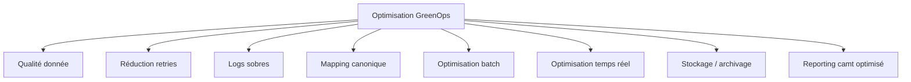
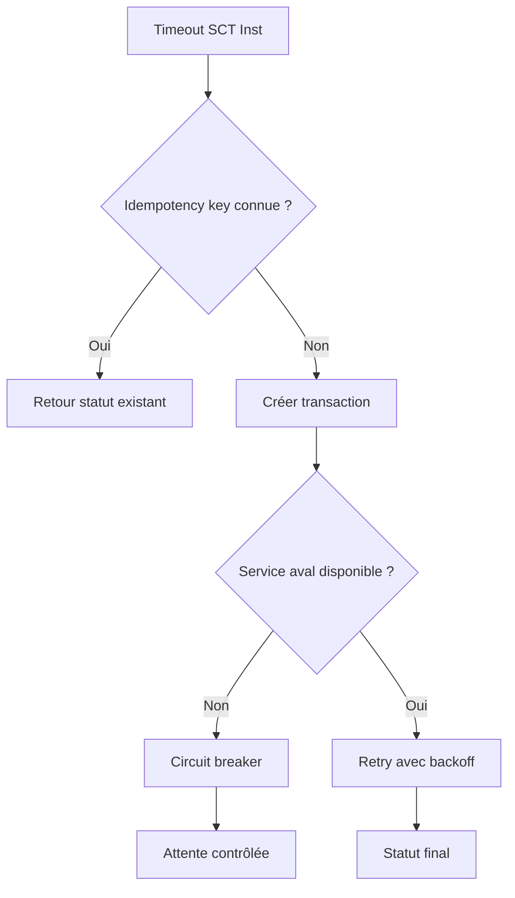
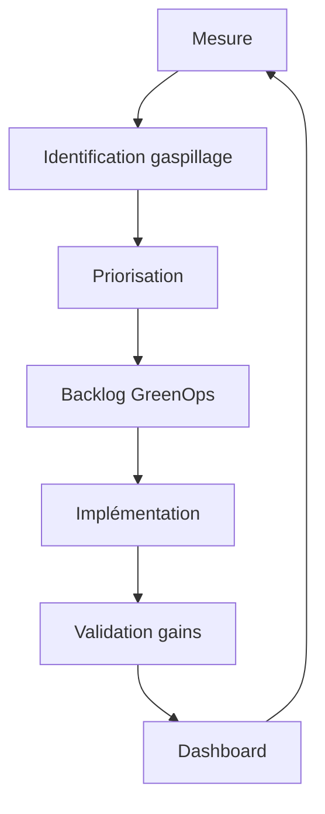

# 04 — Optimisation GreenOps des flux de paiements

## 1. Objectif du document

Ce document présente les leviers concrets d’optimisation GreenOps applicables aux flux de paiements bancaires.

Il couvre :

- les sources de gaspillage ;
- les leviers d’optimisation par flux ;
- les optimisations ISO 20022 ;
- les optimisations batch ;
- les optimisations temps réel ;
- les optimisations logs / stockage ;
- les optimisations mapping ;
- les priorités d’action ;
- les gains attendus.

L’objectif est de passer de la mesure à l’action.

---

## 2. Principe directeur

Dans les paiements, l’objectif GreenOps n’est pas seulement de réduire la taille des messages.

L’objectif est de réduire les traitements inutiles.

```text
moins d’erreurs
+ moins de retries
+ moins de logs inutiles
+ moins de mappings
+ moins de batchs rejoués
= moins de consommation
```

---

## 3. Les principaux gaspillages

| Gaspillage | Exemple | Impact |
|---|---|---|
| Rejet tardif | IBAN invalide détecté après batch | retraitement |
| Retry excessif | SCT Inst timeout relancé brutalement | surcharge |
| Logs XML complets | payload stocké dans 3 systèmes | stockage |
| Mapping multiple | interne → MT → MX → interne | CPU |
| Batch rejoué | fichier complet relancé | I/O + CPU |
| R-transactions SDD | mandat invalide ou compte clos | traitements additionnels |
| Faux positifs AML | données bénéficiaire ambiguës | investigation |
| camt volumineux | relevés complets au lieu de delta | réseau / stockage |
| Référentiel lent | appels répétés non cachés | latence |
| Observabilité excessive | traces full payload permanentes | stockage |

---

## 4. Vue globale des leviers



---

## 5. Levier 1 — Validation amont

### Problème

Un message invalide détecté trop tard a déjà consommé :

- parsing ;
- validation ;
- mapping ;
- appels référentiels ;
- logs ;
- parfois passage infrastructure.

### Solution

Valider au plus tôt :

- XML well-formed ;
- XSD ;
- champs obligatoires ;
- IBAN ;
- BIC ;
- devise ;
- mandat SDD ;
- limites client ;
- règles métier.

### Exemple

```text
IBAN invalide détecté au canal
= rejet immédiat
```

au lieu de :

```text
IBAN invalide détecté après batch
= batch traité + rejet + notification + retraitement
```

### Gain

- moins de CPU ;
- moins de logs ;
- moins de support ;
- meilleur STP.

---

## 6. Levier 2 — Réduction des retries

### Problème

Les retries peuvent devenir une source majeure de consommation.

Cas typique SCT Inst :

```text
timeout
→ retry
→ nouveau timeout
→ retry
→ surcharge
```

### Solution

Mettre en place :

- idempotence ;
- backoff exponentiel ;
- jitter ;
- circuit breaker ;
- statut intermédiaire ;
- demande de statut avant retry ;
- limite de retries.

### Diagramme



---

## 7. Levier 3 — Logs sobres

### Problème

Logger le XML complet est coûteux.

Exemple :

```text
10 millions messages × 4 Ko × 3 systèmes = 120 Go/jour
```

### Solution

Loguer :

- MessageId ;
- EndToEndId ;
- TxId ;
- statut ;
- code erreur ;
- hash payload ;
- taille payload ;
- version ;
- source system.

Ne pas loguer en permanence :

- XML complet ;
- données sensibles ;
- comptes complets ;
- adresses complètes ;
- informations personnelles.

### Gain

- stockage réduit ;
- coût SIEM réduit ;
- meilleure conformité ;
- moins de carbone.

---

## 8. Levier 4 — Modèle canonique

### Problème

Les mappings multiples consomment et créent des erreurs.

Anti-pattern :

```text
API → ISO
API → Core
API → Reporting
MFT → ISO
MFT → Core
MFT → Reporting
```

### Solution

```text
API/MFT/Legacy → Canonique → ISO/Core/Reporting
```

### Gain

- moins de transformations ;
- moins de règles dupliquées ;
- moins de bugs ;
- meilleure observabilité ;
- réduction CPU.

---

## 9. Levier 5 — Optimisation batch SCT / SDD

### Problèmes

- fichiers trop gros ;
- cut-off manqué ;
- batch complet rejoué ;
- logs massifs ;
- pics CPU ;
- dépendance MFT.

### Solutions

- découpage intelligent des lots ;
- validation avant constitution du batch ;
- compression ;
- parallélisation contrôlée ;
- checkpoint/restart ;
- rejeu partiel ;
- monitoring durée batch ;
- scheduling hors pics carbone si possible.

### Exemple

Au lieu de rejouer :

```text
1 fichier de 1 000 000 transactions
```

on permet le rejeu de :

```text
le segment de 20 000 transactions en erreur
```

---

## 10. Levier 6 — Optimisation SDD

### Gaspillage principal

Le SDD consomme surtout par les exceptions :

- mandats invalides ;
- comptes clos ;
- fonds insuffisants ;
- retours ;
- refunds ;
- réconciliations.

### Optimisations

| Levier | Effet |
|---|---|
| référentiel mandat fiable | moins de rejets |
| validation IBAN | moins de retours |
| détection compte clos | moins de traitement inutile |
| analyse top R-transactions | priorisation |
| réconciliation automatique | moins back-office |
| archivage froid mandat | moins stockage chaud |

### Objectif

```text
réduire le taux R-transactions
```

---

## 11. Levier 7 — Optimisation SCT Inst

### Gaspillage principal

- timeouts ;
- retries ;
- statuts incertains ;
- fraude lente ;
- référentiels lents ;
- logs temps réel trop riches.

### Optimisations

- cache référentiel court ;
- budget temps par composant ;
- P95/P99 observés ;
- idempotence ;
- circuit breaker ;
- fraude optimisée ;
- statuts intermédiaires ;
- alerting timeout ;
- traces échantillonnées.

### Budget temps exemple

| Étape | Cible |
|---|---:|
| API Gateway | 200 ms |
| Authentification | 300 ms |
| validation ISO | 300 ms |
| référentiels | 500 ms |
| fraude | 1000 ms |
| core banking | 1000 ms |
| TIPS / infrastructure | 2000 ms |
| marge | reste |

---

## 12. Levier 8 — Optimisation cross-border

### Gaspillage principal

- faux positifs AML ;
- données non structurées ;
- mapping MT/MX ;
- investigations ;
- stockage réglementaire ;
- retours incomplets.

### Optimisations

- adresses structurées ;
- référentiels pays/BIC à jour ;
- screening plus précis ;
- réduction faux positifs ;
- traçabilité UETR / EndToEndId ;
- logs sobres ;
- archivage froid ;
- modèle canonique cross-border.

---

## 13. Levier 9 — Optimisation cash management

### Gaspillage principal

- camt volumineux ;
- relevés complets répétés ;
- transformations spécifiques clients ;
- exceptions de rapprochement ;
- stockage long.

### Optimisations

- produire des deltas ;
- renforcer EndToEndId ;
- structurer RemittanceInformation ;
- réduire formats spécifiques ;
- compression ;
- API paginée ;
- réconciliation automatique ;
- archivage froid.

---

## 14. Exemple chiffré — réduction retries SCT Inst

### Situation initiale

```text
1 000 000 SCT Inst / jour
0,8 % timeout
2 retries par timeout
0,8 Wh par traitement
```

Retries :

```text
1 000 000 × 0,8 % × 2 = 16 000 retries
```

Énergie retries :

```text
16 000 × 0,8 Wh = 12,8 kWh / jour
```

### Après optimisation

```text
timeout 0,3 %
0,5 retry par timeout
```

Retries :

```text
1 000 000 × 0,3 % × 0,5 = 1 500 retries
```

Énergie :

```text
1 500 × 0,8 Wh = 1,2 kWh / jour
```

Gain :

```text
11,6 kWh / jour
= 4234 kWh / an
```

---

## 15. Exemple chiffré — logs sobres

### Situation initiale

```text
10 millions messages
4 Ko XML
3 systèmes de logs
= 120 Go/jour
```

### Après optimisation

```text
0,5 Ko log structuré
3 systèmes
= 15 Go/jour
```

Gain :

```text
105 Go/jour
= 3,15 To/mois
```

---

## 16. Exemple chiffré — mapping canonique

### Situation initiale

```text
10 millions messages/jour
4 mappings/message
0,05 Wh/mapping
```

Énergie :

```text
10 000 000 × 4 × 0,05 Wh = 2000 kWh/jour
```

### Après modèle canonique

```text
2 mappings/message
```

Énergie :

```text
10 000 000 × 2 × 0,05 Wh = 1000 kWh/jour
```

Gain :

```text
1000 kWh/jour
```

---

## 17. Priorisation des optimisations

Score simple :

```text
Score = volume × taux erreur × coût traitement × criticité
```

Exemple :

| Action | Volume | Impact | Complexité | Priorité |
|---|---:|---:|---:|---|
| réduire retries SCT Inst | élevé | élevé | moyenne | très haute |
| logs sobres XML | très élevé | élevé | faible | très haute |
| validation IBAN amont | élevé | moyen | faible | haute |
| modèle canonique | élevé | très élevé | élevée | haute |
| camt delta | moyen | moyen | moyenne | moyenne |
| archivage froid | moyen | moyen | faible | haute |

---

## 18. Backlog GreenOps type

| Épic | Description |
|---|---|
| G01 | supprimer logs XML complets permanents |
| G02 | mesurer retry rate SCT Inst |
| G03 | réduire top 10 rejets SCT |
| G04 | réduire top R-transactions SDD |
| G05 | mettre en place modèle canonique |
| G06 | mesurer CPU/message ISO |
| G07 | optimiser génération camt |
| G08 | archiver froid mandats et relevés |
| G09 | compresser flux MFT |
| G10 | dashboard SCI par flux |

---

## 19. Architecture cible d’optimisation



---

## 20. KPIs d’optimisation

| KPI | Objectif |
|---|---|
| retry rate | réduire retries |
| reject rate | réduire erreurs |
| R-transaction rate | réduire retours SDD |
| logs/message | réduire stockage |
| mappings/message | réduire CPU |
| CPU/message | optimiser traitement |
| kWh/1000 transactions | mesurer énergie |
| gCO2e/transaction | mesurer carbone |
| STP rate | augmenter automatisation |
| P95/P99 latency | maîtriser temps réel |

---

## 21. Risques

| Risque | Description | Mitigation |
|---|---|---|
| optimisation aveugle | réduire sans mesurer | baseline |
| suppression logs utile | perte diagnostic | logs structurés + sampling |
| cache trop agressif | données obsolètes | TTL court |
| compression excessive | CPU augmente | arbitrage |
| parallélisation batch | surcharge aval | contrôle débit |
| circuit breaker mal réglé | faux blocage | tests charge |
| modèle canonique trop complexe | adoption faible | gouvernance |

---

## 22. Questions d’audit

| Question | Objectif |
|---|---|
| Quels sont les top gaspillages ? | prioriser |
| Les retries sont-ils mesurés ? | SCT Inst |
| Les logs complets sont-ils nécessaires ? | sobriété |
| Combien de mappings par flux ? | complexité |
| Les batchs sont-ils rejouables partiellement ? | efficacité |
| Les R-transactions sont-elles analysées ? | SDD |
| Les camt sont-ils optimisés ? | reporting |
| Les gains sont-ils mesurés ? | pilotage |
| Le backlog GreenOps existe-t-il ? | gouvernance |
| Les squads ont-elles des objectifs carbone ? | transformation |

---

## 23. Synthèse

L’optimisation GreenOps des paiements repose sur une idée simple :

```text
réduire le gaspillage avant de réduire le service
```

Les meilleurs leviers sont souvent :

- validation amont ;
- réduction des retries ;
- logs sobres ;
- modèle canonique ;
- optimisation batch ;
- meilleure qualité données ;
- observabilité GreenOps.

La cible n’est pas un SI plus lent ou moins robuste.

La cible est un SI :

```text
plus fiable
plus observable
plus performant
plus sobre
```
