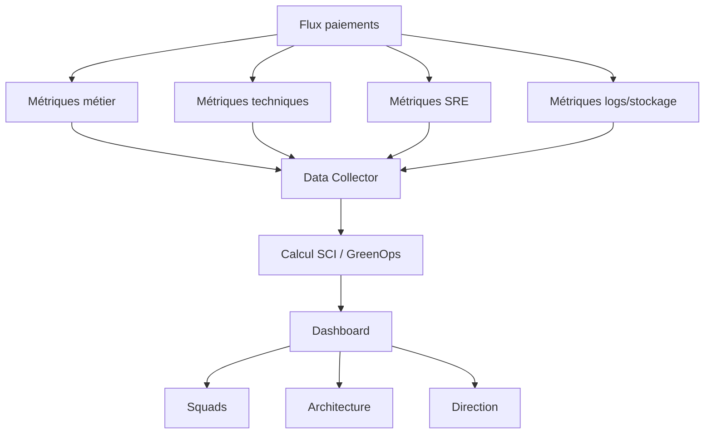
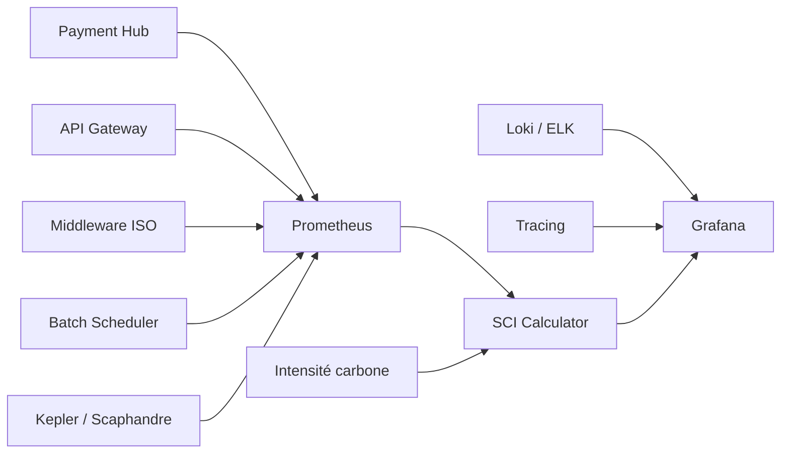
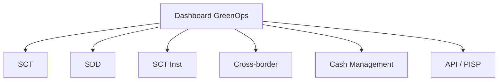

# 05 — Dashboard GreenOps des flux de paiements

## 1. Objectif du document

Ce document décrit un dashboard GreenOps cible pour piloter l’empreinte carbone des flux de paiements bancaires.

Il couvre :

- les objectifs du dashboard ;
- les utilisateurs cibles ;
- les indicateurs métiers, techniques, SRE et carbone ;
- les vues par flux : SCT, SDD, SCT Inst, cross-border, cash management ;
- les sources de données ;
- les formules de calcul ;
- les seuils d’alerte ;
- les vues de pilotage pour squads, architecture et direction.

L’objectif est de transformer la mesure GreenOps en outil de décision.

---

## 2. Pourquoi un dashboard GreenOps ?

Une plateforme de paiement produit beaucoup de données :

- volumes de transactions ;
- rejets ;
- retries ;
- latence ;
- logs ;
- batchs ;
- messages ISO ;
- statuts ;
- consommation CPU ;
- stockage.

Sans dashboard, ces données restent dispersées.

Avec un dashboard, on peut répondre à des questions concrètes :

```text
Quel flux consomme le plus ?
Quel flux rejette le plus ?
Quel est le coût carbone des retries SCT Inst ?
Quel est le coût des logs XML ?
Quel gain a-t-on obtenu après optimisation ?
```

---

## 3. Publics cibles

| Public | Besoin |
|---|---|
| Direction Paiements | vision globale, trajectoire, risques |
| Architecture | points de conception, dette, leviers |
| Squads IT | actions techniques concrètes |
| SRE / Production | incidents, latence, retries |
| GreenOps / RSE | carbone, gCO2e, trajectoire |
| Conformité | liens CSRD / reporting |
| FinOps | coût infrastructure / transaction |

---

## 4. Vue globale du dashboard



---

## 5. Sources de données

| Source | Données collectées |
|---|---|
| Payment Hub | transactions, statuts, rejets |
| Middleware ISO | mapping, taille XML, versions |
| Moteur batch | durée, volumétrie, relances |
| API Gateway | appels, latence, erreurs |
| APM | CPU, mémoire, latence |
| Prometheus | métriques techniques |
| Grafana | visualisation |
| Loki / ELK | logs, erreurs |
| Tracing | corrélation EndToEndId |
| Kepler | énergie Kubernetes |
| Scaphandre | énergie serveur / processus |
| Cloud provider | énergie, coût, émissions |
| Référentiel carbone | gCO2e/kWh |

---

## 6. Architecture de collecte



---

## 7. Vue exécutive

La vue exécutive doit être lisible en moins d’une minute.

### Indicateurs principaux

| KPI | Description |
|---|---|
| gCO2e / transaction | intensité carbone moyenne |
| kWh / jour | consommation estimée |
| gCO2e / jour | empreinte quotidienne |
| volume transactions | activité métier |
| taux STP | efficacité automatisation |
| taux rejet | qualité |
| taux retry | gaspillage |
| volume logs / jour | stockage |
| gain CO2e mensuel | impact optimisation |

### Exemple de lecture

```text
Le SCT Inst représente 12 % des volumes,
mais 28 % des retries et 24 % de l’empreinte carbone applicative.
```

---

## 8. Vue par flux

Le dashboard doit permettre de filtrer par :

- SCT ;
- SDD ;
- SCT Inst ;
- cross-border ;
- cash management ;
- cartes si inclus ;
- API/PISP ;
- Wero si applicable.



---

## 9. Vue SCT

### KPIs SCT

| KPI | Objectif |
|---|---|
| nombre SCT/jour | volumétrie |
| durée batch | performance |
| taux rejet technique | qualité XML |
| taux rejet fonctionnel | qualité métier |
| batch rejoué | gaspillage |
| CPU/batch | coût traitement |
| logs/batch | stockage |
| gCO2e/1000 SCT | carbone |

### Alertes SCT

| Alerte | Seuil exemple |
|---|---|
| taux rejet > 1 % | anomalie qualité |
| durée batch > cut-off - 30 min | risque opérationnel |
| volume logs +50 % | anomalie observabilité |
| batch rejoué > 1 fois | gaspillage |

---

## 10. Vue SDD

### KPIs SDD

| KPI | Objectif |
|---|---|
| nombre SDD/jour | volumétrie |
| taux R-transactions | qualité globale |
| taux rejet mandat | qualité mandat |
| taux fonds insuffisants | risque métier |
| taux refund | litiges |
| taux réconciliation automatique | STP |
| stockage mandats | data / carbone |
| gCO2e/1000 SDD | carbone |

### Lecture SDD

Le SDD doit être piloté autour de la réduction des exceptions.

```text
moins de R-transactions
= moins de traitements
= moins de back-office
= moins de carbone
```

---

## 11. Vue SCT Inst

### KPIs SCT Inst

| KPI | Objectif |
|---|---|
| volume SCT Inst | activité |
| P95 latence | performance |
| P99 latence | expérience extrême |
| timeout rate | stabilité |
| retry rate | gaspillage |
| statut incertain | risque |
| disponibilité | SLO |
| fraude latency | budget temps |
| gCO2e/transaction | carbone |

### Alertes SCT Inst

| Alerte | Seuil exemple |
|---|---|
| P99 > 8s | risque SLA |
| timeout > 0,3 % | instabilité |
| retry > 0,5 % | gaspillage |
| statut inconnu > 0,05 % | risque opérationnel |
| CPU service fraude > seuil | latence future |

---

## 12. Vue cross-border

### KPIs cross-border

| KPI | Objectif |
|---|---|
| volume paiements internationaux | activité |
| taux alerte AML | conformité |
| taux faux positifs | efficacité screening |
| temps investigation | back-office |
| mapping MT/MX errors | qualité ISO |
| taux STP cross-border | automatisation |
| stockage preuves | conformité / carbone |
| gCO2e/paiement | carbone |

### Lecture cross-border

Le cross-border consomme principalement par :

- conformité ;
- investigations ;
- faux positifs ;
- mapping ;
- stockage réglementaire.

---

## 13. Vue cash management

### KPIs cash management

| KPI | Objectif |
|---|---|
| nombre camt.052 | reporting intraday |
| nombre camt.053 | relevés |
| nombre camt.054 | notifications |
| taille moyenne camt | réseau / stockage |
| taux rapprochement automatique | STP |
| exceptions rapprochement | gaspillage |
| transformations spécifiques | complexité |
| gCO2e/1000 camt | carbone |

### Alertes

| Alerte | Seuil exemple |
|---|---|
| taille camt +50 % | anomalie |
| exceptions rapprochement > seuil | qualité données |
| retard génération camt | risque client |
| transformations spécifiques en hausse | dette SI |

---

## 14. Vue logs et stockage

Cette vue est critique.

### KPIs logs

| KPI | Objectif |
|---|---|
| logs/message | sobriété |
| volume logs/jour | stockage |
| XML complet loggé | risque |
| stockage chaud | coût |
| stockage froid | optimisation |
| durée rétention | conformité |
| coût stockage | FinOps |
| gCO2e stockage | carbone |

### Objectif

Réduire les logs inutiles sans perdre la capacité de diagnostic.

---

## 15. Vue mapping ISO

### KPIs mapping

| KPI | Objectif |
|---|---|
| mappings/message | complexité |
| temps mapping | performance |
| erreurs mapping | qualité |
| messages par version ISO | gouvernance |
| champs perdus | risque |
| mappings spécifiques clients | dette |
| CPU mapping | GreenOps |

### Lecture

Un mapping qui génère beaucoup d’erreurs est un candidat prioritaire au backlog GreenOps.

---

## 16. Formules affichées

### gCO2e transaction

```text
gCO2e/transaction = (kWh × gCO2e/kWh) / transactions utiles
```

### kWh / 1000 transactions

```text
kWh/1000 tx = kWh total / transactions × 1000
```

### coût retry

```text
coût retry = nombre retries × coût traitement unitaire
```

### coût rejet

```text
coût rejet = nombre rejets × coût retraitement
```

### coût logs

```text
volume logs = nombre messages × taille moyenne log × nombre systèmes
```

---

## 17. Exemple de tableau global

| Flux | Volume/jour | Retry | Rejet | kWh/jour | gCO2e/jour | gCO2e/1000 tx |
|---|---:|---:|---:|---:|---:|---:|
| SCT | 5 000 000 | 0,1 % | 1 % | 2020 | 101 000 | 20,2 |
| SDD | 2 000 000 | 0,2 % | 3 % | 1254 | 62 700 | 31,35 |
| SCT Inst | 1 000 000 | 1,6 % | 0,2 % | 812 | 40 600 | 40,6 |
| Cross-border | 500 000 | 0,5 % | 5 % AML | 575 | 28 750 | 57,5 |

Ces chiffres sont illustratifs. Le dashboard réel doit utiliser des métriques mesurées.

---

## 18. Drill-down

Le dashboard doit permettre de descendre :

```text
Vue groupe
→ vue flux
→ vue application
→ vue composant
→ vue message
→ vue erreur
```

Exemple :

```text
SCT Inst
→ retries élevés
→ service fraude
→ P99 élevé
→ timeout référentiel
→ cache absent
```

---

## 19. Alerting GreenOps

### Types d’alertes

| Alerte | Exemple |
|---|---|
| dérive carbone | +20 % gCO2e/transaction |
| dérive retry | retry rate double |
| dérive logs | volume logs +50 % |
| dérive rejet | rejet XML en hausse |
| dérive batch | durée batch dépasse seuil |
| dérive mapping | erreurs mapping en hausse |

### Attention

Une alerte GreenOps ne doit pas polluer l’astreinte critique.

Elle doit alimenter :

- daily squad ;
- revue hebdomadaire ;
- backlog optimisation ;
- comité architecture.

---

## 20. Backlog automatique

Le dashboard doit aider à créer des actions :

| Observation | Action |
|---|---|
| retry SCT Inst élevé | revoir timeout/backoff |
| logs XML trop lourds | logs structurés |
| rejet IBAN élevé | validation amont |
| camt volumineux | delta / pagination |
| mapping lent | optimiser mapping |
| SDD R-transactions élevées | qualité mandat |

---

## 21. Gouvernance du dashboard

| Rôle | Responsabilité |
|---|---|
| Architecte paiement | cohérence indicateurs |
| SRE | métriques production |
| GreenOps | calcul carbone |
| Squad applicative | actions correctives |
| FinOps | coût infrastructure |
| Direction | trajectoire et arbitrage |

---

## 22. Maturité dashboard

| Niveau | Description |
|---|---|
| 1 | métriques manuelles |
| 2 | dashboard technique |
| 3 | dashboard par flux |
| 4 | SCI automatisé |
| 5 | pilotage carbone intégré au backlog |

---

## 23. Questions d’audit

| Question | Objectif |
|---|---|
| Le dashboard existe-t-il ? | pilotage |
| Les flux sont-ils séparés ? | précision |
| Les retries sont-ils visibles ? | gaspillage |
| Les rejets sont-ils catégorisés ? | qualité |
| Les logs sont-ils mesurés ? | stockage |
| Le SCI est-il calculé ? | carbone |
| Les gains sont-ils historisés ? | preuve |
| Le dashboard alimente-t-il un backlog ? | action |
| Les squads l’utilisent-elles ? | adoption |
| La direction dispose-t-elle d’une vue synthèse ? | gouvernance |

---

## 24. Synthèse

Un dashboard GreenOps de paiements doit relier :

```text
métier
+ technique
+ production
+ carbone
```

Il ne doit pas seulement afficher des courbes.

Il doit permettre de décider :

- quel flux optimiser ;
- quel gaspillage réduire ;
- quelle action prioriser ;
- quel gain prouver ;
- quelle trajectoire suivre.

La cible est un dashboard qui transforme la sobriété numérique en pilotage opérationnel.
