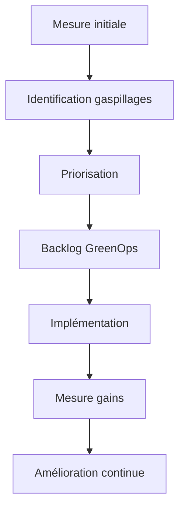

# 06 — Roadmap GreenOps des flux de paiements

## 1. Objectif du document

Ce document définit une roadmap GreenOps applicable à une plateforme de paiements (SCT, SDD, SCT Inst, cross-border, cash management).

Il permet de structurer la transformation dans le temps :

- court terme : gains rapides
- moyen terme : optimisation structurante
- long terme : transformation architecture

---

## 2. Principe de la roadmap

Une roadmap GreenOps ne commence pas par la technologie.

Elle commence par :

```text
mesurer → comprendre → prioriser → agir → mesurer à nouveau
```

---

## 3. Vision globale



---

## 4. Phase 1 — Quick wins (0 à 3 mois)

### Objectif

Réduire rapidement le gaspillage évident.

### Actions

- supprimer logs XML complets inutiles
- mesurer retry rate SCT Inst
- mesurer taux rejet SCT / SDD
- mettre en place validation amont IBAN/XML
- identifier top 10 erreurs
- créer dashboard basique

### Gains attendus

- -30 à -70% stockage logs
- -10 à -20% CPU inutile
- meilleure visibilité

---

## 5. Phase 2 — Structuration (3 à 9 mois)

### Objectif

Industrialiser la mesure et les optimisations.

### Actions

- implémenter modèle SCI
- dashboard complet par flux
- optimisation retry (backoff, idempotence)
- réduction R-transactions SDD
- optimisation batch SCT
- compression flux MFT
- mise en place backlog GreenOps
- pilotage par KPI

### Gains attendus

- -20% consommation globale
- réduction incidents
- meilleure stabilité

---

## 6. Phase 3 — Transformation (9 à 24 mois)

### Objectif

Refondre l’architecture pour intégrer GreenOps nativement.

### Actions

- modèle canonique généralisé
- architecture event-driven
- optimisation SCT Inst (latence/carbone)
- cache référentiels
- optimisation camt (delta)
- archivage froid automatisé
- observabilité avancée
- intégration FinOps

### Gains attendus

- -30 à -50% consommation
- plateforme scalable
- pilotage avancé

---

## 7. Phase 4 — Maturité (24+ mois)

### Objectif

Pilotage complet carbone / performance / coût.

### Actions

- SCI temps réel
- intensité carbone dynamique
- orchestration batch green-aware
- optimisation multi-objectifs
- intégration KPI dans gouvernance
- reporting CSRD automatisé

---

## 8. Priorisation des actions

Score simple :

```text
Score = volume × taux erreur × coût × criticité
```

---

## 9. Exemple de backlog

| ID | Action | Priorité |
|---|---|---|
| G01 | logs structurés | haute |
| G02 | réduire retries SCT Inst | très haute |
| G03 | validation IBAN amont | haute |
| G04 | optimisation batch SCT | haute |
| G05 | modèle canonique | moyenne |
| G06 | SCI dashboard | haute |

---

## 10. KPIs de suivi

| KPI | Objectif |
|---|---|
| gCO2e/transaction | réduire |
| retry rate | réduire |
| reject rate | réduire |
| logs/message | réduire |
| CPU/message | optimiser |
| STP rate | augmenter |

---

## 11. Risques

- manque de mesure
- mauvaise priorisation
- optimisation locale
- perte de traçabilité
- résistance équipes

---

## 12. Gouvernance

- comité architecture
- comité GreenOps
- suivi KPI mensuel
- backlog priorisé

---

## 13. Synthèse

La roadmap GreenOps doit être :

- progressive
- mesurée
- pilotée
- intégrée aux squads

Objectif final :

```text
une plateforme paiement performante, résiliente et sobre
```
