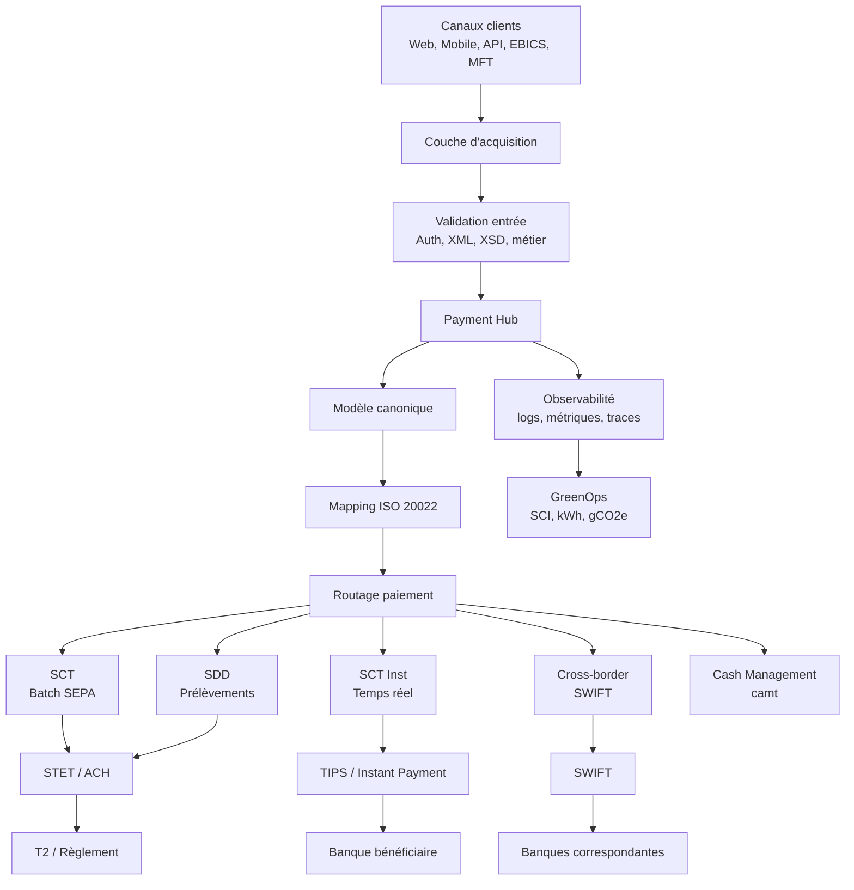
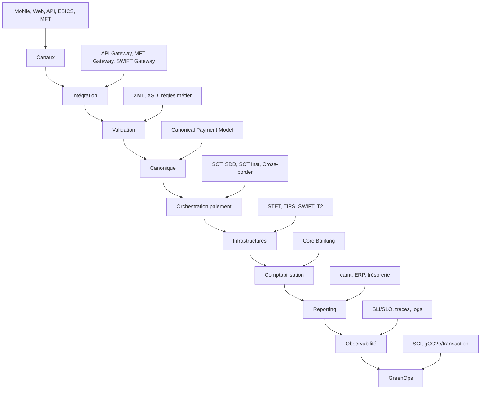
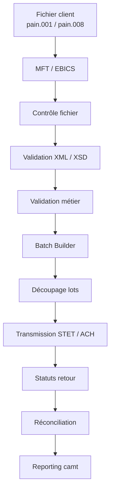
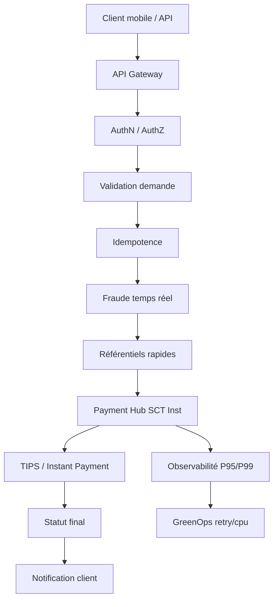
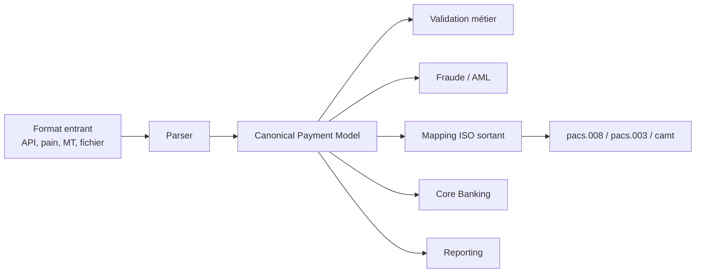
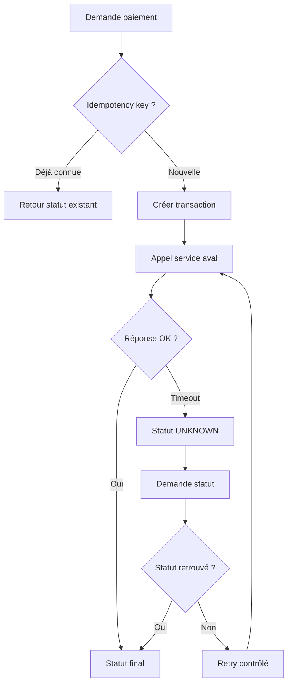
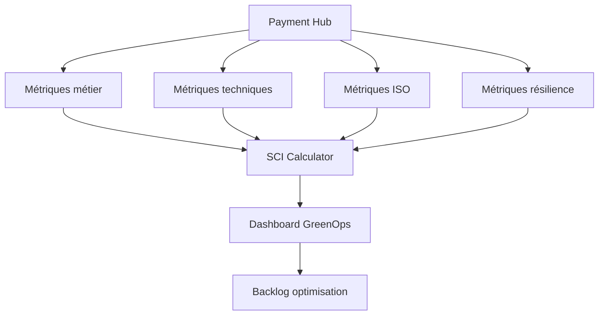
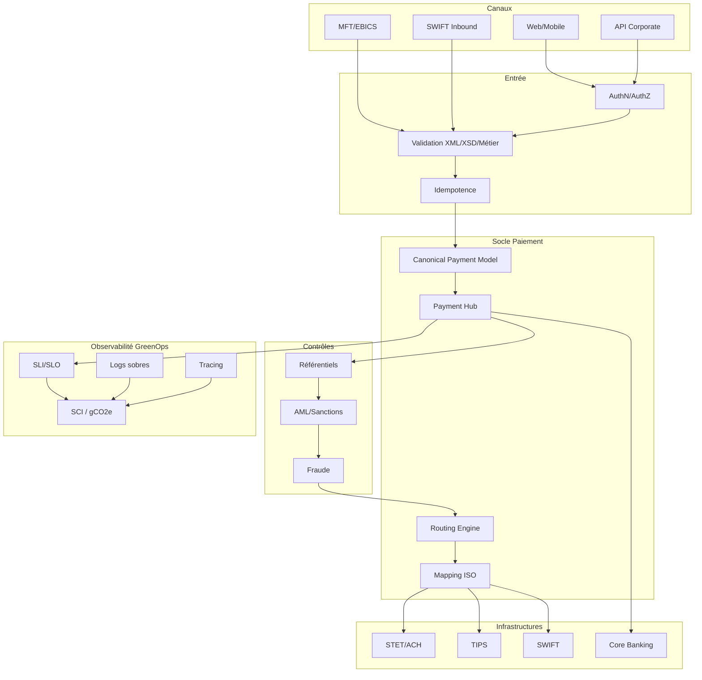

# 01 — Overview Architecture SI des flux de paiements

## 1. Objectif du document

Ce document pose la vision d’architecture SI globale d’une plateforme de paiements bancaire moderne.

Il couvre :

- le rôle d’une plateforme de paiements ;
- la place du Payment Hub ;
- l’intégration ISO 20022 ;
- les flux SCT, SDD, SCT Inst, cross-border et cash management ;
- les infrastructures STET, TIPS, SWIFT, T2 ;
- les exigences de résilience ;
- les exigences d’observabilité ;
- l’intégration GreenOps ;
- les principes HLD d’une architecture cible.

L’objectif est de fournir une vue d’ensemble exploitable par :

- une direction architecture ;
- une direction paiements ;
- des squads IT ;
- des équipes production / SRE ;
- des équipes GreenOps / RSE ;
- des équipes conformité.

---

## 2. Problématique architecture

Les plateformes de paiements bancaires doivent gérer simultanément :

- des flux batch massifs ;
- des flux temps réel 24/7 ;
- des formats ISO 20022 ;
- des formats legacy ;
- des contrôles conformité ;
- des exigences réglementaires ;
- des contraintes de latence ;
- des enjeux de résilience ;
- des enjeux de traçabilité ;
- des objectifs de réduction carbone.

Le problème n’est donc pas seulement de “faire passer un paiement”.

Le problème est de concevoir un système capable de :

```text
recevoir
valider
enrichir
contrôler
router
exécuter
observer
réconcilier
optimiser
```

des millions de flux, avec un niveau de fiabilité bancaire.

---

## 3. Vision globale d’une plateforme paiement



---

## 4. Rôle du Payment Hub

Le Payment Hub est le cœur logique de la plateforme.

Il centralise :

- l’orchestration des paiements ;
- la validation des flux ;
- le routage vers la bonne infrastructure ;
- la transformation des messages ;
- la gestion des statuts ;
- la corrélation des identifiants ;
- la gestion des erreurs ;
- l’exposition des métriques.

Il ne doit pas être vu comme un simple middleware.

Il doit être vu comme :

```text
un moteur d’orchestration métier + technique
```

---

## 5. Capacités attendues du Payment Hub

| Capacité | Description |
|---|---|
| Acquisition | recevoir les ordres via API, MFT, EBICS, mobile |
| Validation | vérifier syntaxe, schéma, règles métier |
| Normalisation | transformer vers un modèle canonique |
| Enrichissement | appeler IBAN, BIC, client, conformité |
| Routing | choisir SCT, SDD, SCT Inst, SWIFT |
| Orchestration | piloter le cycle de vie |
| Statuts | recevoir et propager pain.002, pacs.002, camt |
| Résilience | retry, idempotence, circuit breaker |
| Observabilité | tracing, métriques, logs sobres |
| GreenOps | mesurer coût carbone par flux |

---

## 6. Vue par couches



---

## 7. Flux batch vs flux temps réel

Une plateforme paiement doit séparer clairement les modes de traitement.

| Sujet | Batch | Temps réel |
|---|---|---|
| Flux | SCT, SDD, camt | SCT Inst, API/PISP, Wero |
| Mode | fichiers / lots | transaction unitaire |
| Risque | cut-off, rejet fichier | timeout, latence, retry |
| Optimisation | découpage, compression, scheduling | idempotence, backoff, cache |
| GreenOps | pics CPU / stockage | consommation continue / retries |
| Observabilité | durée batch, taux rejet | P95/P99, timeout, disponibilité |

---

## 8. Architecture batch



### Points d’attention

- fichiers volumineux ;
- cut-off ;
- rejet global ou partiel ;
- rejeu batch ;
- logs ;
- compression ;
- archivage.

---

## 9. Architecture temps réel



### Points d’attention

- latence ;
- disponibilité 24/7 ;
- timeout ;
- retry ;
- statut inconnu ;
- idempotence ;
- fraude ;
- monitoring temps réel.

---

## 10. Place d’ISO 20022 dans l’architecture

ISO 20022 intervient à plusieurs niveaux :

| Niveau | Rôle |
|---|---|
| Acquisition | pain.001, pain.008 |
| Interbancaire | pacs.008, pacs.003, pacs.009 |
| Statuts | pain.002, pacs.002 |
| Retours | pacs.004 |
| Reporting | camt.052, camt.053, camt.054 |
| Investigation | camt.056 |
| Rapprochement | remt, RmtInf |

L’architecture ne doit pas traiter ISO comme un simple format.

Elle doit traiter ISO comme :

```text
le langage structurant des données de paiement
```

---

## 11. Modèle canonique

Un modèle canonique permet d’éviter les mappings point-à-point.

Sans modèle canonique :

```text
API → ISO
API → Core
API → Reporting
MFT → ISO
MFT → Core
MFT → Reporting
```

Avec modèle canonique :

```text
API/MFT/Legacy → Canonical Payment → ISO/Core/Reporting
```

### Bénéfices

- réduction complexité ;
- réduction erreurs ;
- meilleure observabilité ;
- meilleure gouvernance ;
- réduction CPU mapping ;
- réduction dette SI.

---

## 12. Architecture ISO avec canonique



---

## 13. Résilience

Une plateforme de paiement doit intégrer la résilience dès la conception.

### Patterns indispensables

| Pattern | Usage |
|---|---|
| Idempotence | éviter les doublons |
| Retry contrôlé | gérer erreurs temporaires |
| Backoff | éviter tempêtes de retries |
| Circuit breaker | protéger aval |
| Timeout maîtrisé | éviter attente infinie |
| DLQ | isoler messages en erreur |
| Replay contrôlé | rejouer sans doublon |
| Statut UNKNOWN | gérer incertitude |
| Checkpoint batch | reprendre sans tout relancer |

---

## 14. Diagramme résilience



---

## 15. Observabilité

L’observabilité doit permettre de suivre un paiement de bout en bout.

### Identifiants clés

- MessageId ;
- EndToEndId ;
- InstructionId ;
- TransactionId ;
- CorrelationId ;
- IdempotencyKey ;
- UETR selon cross-border.

### Métriques clés

| Métrique | Usage |
|---|---|
| volume par flux | activité |
| taux rejet | qualité |
| taux retry | gaspillage |
| taux timeout | stabilité |
| P95/P99 latence | temps réel |
| durée batch | cut-off |
| statut inconnu | risque |
| volume logs | GreenOps |
| CPU/message | performance |
| gCO2e/transaction | carbone |

---

## 16. GreenOps dans l’architecture SI

Le GreenOps doit être intégré dès le HLD.

Il ne doit pas être ajouté après.

### Points d’intégration

| Couche | GreenOps |
|---|---|
| validation | réduire rejets tardifs |
| mapping | réduire transformations |
| batch | éviter relances complètes |
| temps réel | réduire retries |
| logs | réduire payloads |
| stockage | archivage froid |
| reporting | camt delta |
| observabilité | mesurer kWh/gCO2e |

---

## 17. Architecture GreenOps intégrée



---

## 18. Sécurité et conformité

Une architecture paiement doit intégrer :

- authentification forte ;
- autorisation ;
- chiffrement transport ;
- chiffrement données sensibles ;
- masquage logs ;
- conformité AML/sanctions ;
- audit trail ;
- séparation des rôles ;
- rétention réglementaire ;
- gestion des preuves.

La sécurité ne doit pas détruire la performance.

Il faut arbitrer :

```text
sécurité
+ latence
+ disponibilité
+ carbone
```

---

## 19. Anti-patterns architecture

| Anti-pattern | Conséquence |
|---|---|
| mapping point-à-point | dette et erreurs |
| logs XML complets partout | stockage massif |
| retry sans backoff | surcharge |
| batch rejoué intégralement | gaspillage |
| absence idempotence | doublons |
| validation tardive | rejets coûteux |
| observabilité absente | diagnostic lent |
| SI temps réel couplé au batch | instabilité |
| modèle canonique absent | complexité |
| GreenOps après coup | optimisation limitée |

---

## 20. Architecture cible synthétique



---

## 21. Questions d’audit architecture

| Question | Objectif |
|---|---|
| Existe-t-il un Payment Hub ? | centralisation |
| Existe-t-il un modèle canonique ? | réduction complexité |
| Les flux batch et temps réel sont-ils séparés ? | résilience |
| Les retries sont-ils maîtrisés ? | stabilité |
| L’idempotence est-elle généralisée ? | anti-doublon |
| Les statuts sont-ils corrélés ? | traçabilité |
| Les mappings sont-ils gouvernés ? | qualité |
| Les logs sont-ils sobres ? | GreenOps |
| Les métriques SCI existent-elles ? | carbone |
| Les infrastructures sont-elles découplées ? | robustesse |

---

## 22. Synthèse

Une architecture SI de paiements moderne doit être pensée comme un système industriel.

Elle doit combiner :

```text
métier paiement
+ ISO 20022
+ Payment Hub
+ modèle canonique
+ résilience
+ observabilité
+ GreenOps
```

La cible n’est pas simplement une plateforme qui traite des paiements.

La cible est une plateforme :

- robuste ;
- interopérable ;
- observable ;
- auditable ;
- optimisée ;
- sobre en carbone ;
- capable d’évoluer vers les nouveaux usages comme SCT Inst, Wero, API/PISP et cash management temps réel.
