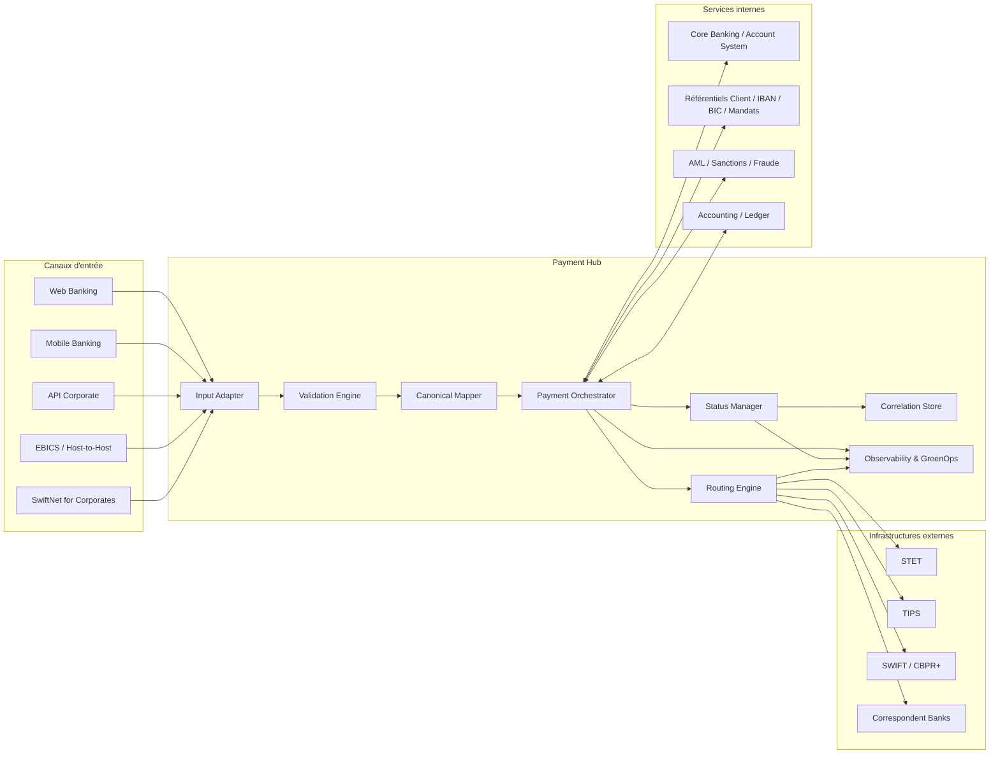
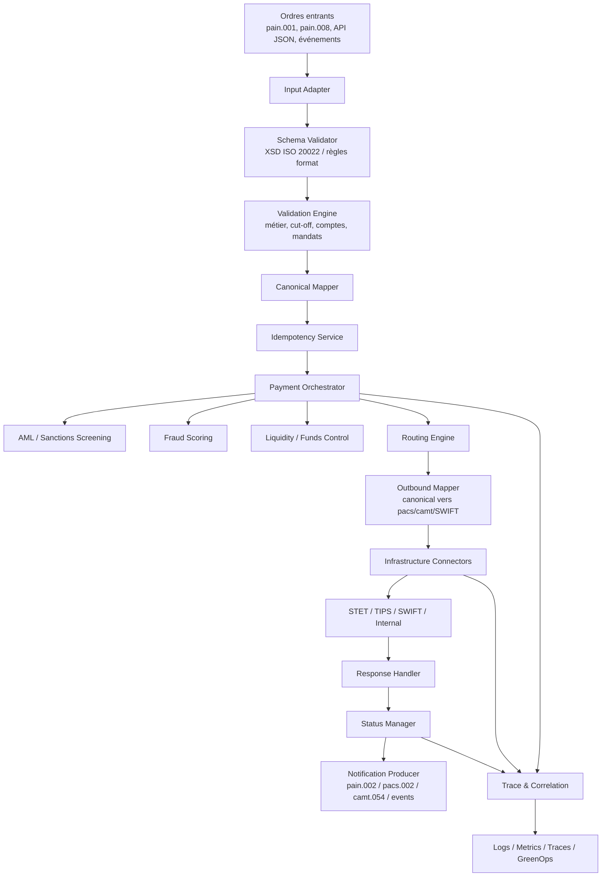
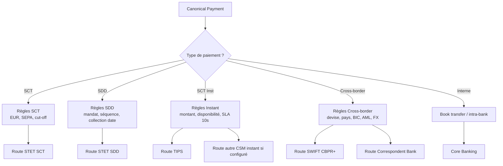
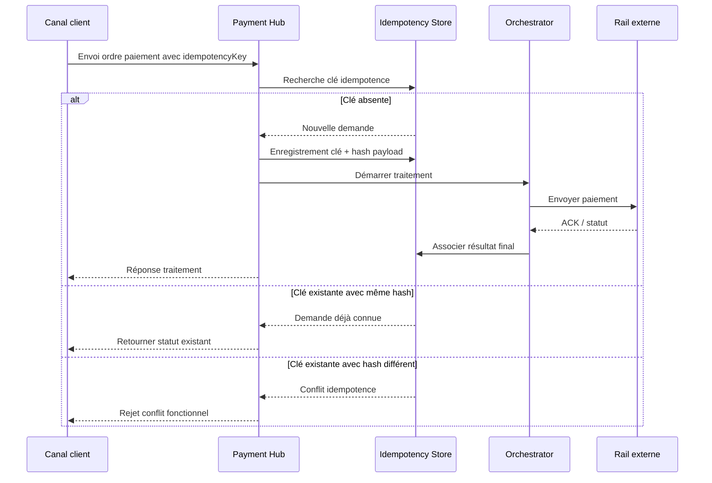
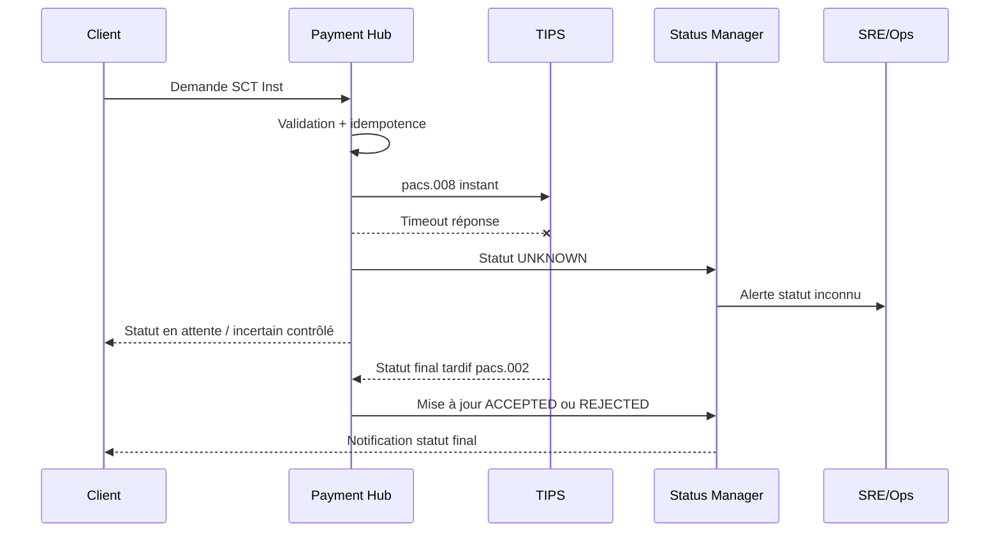
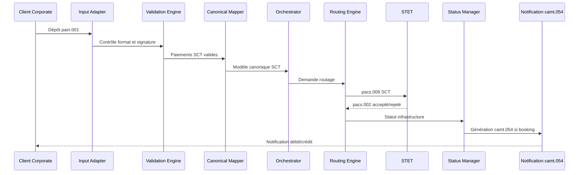
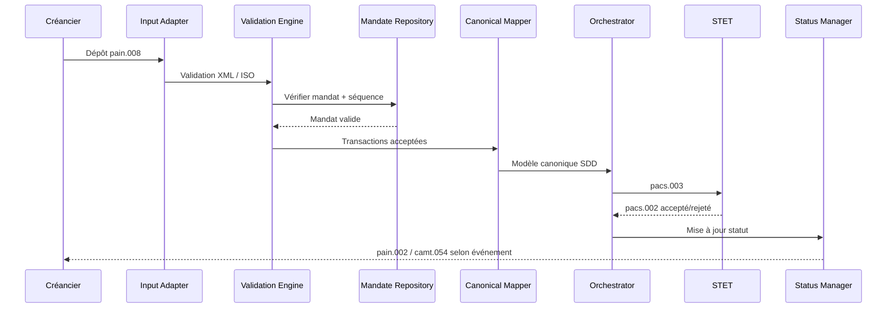
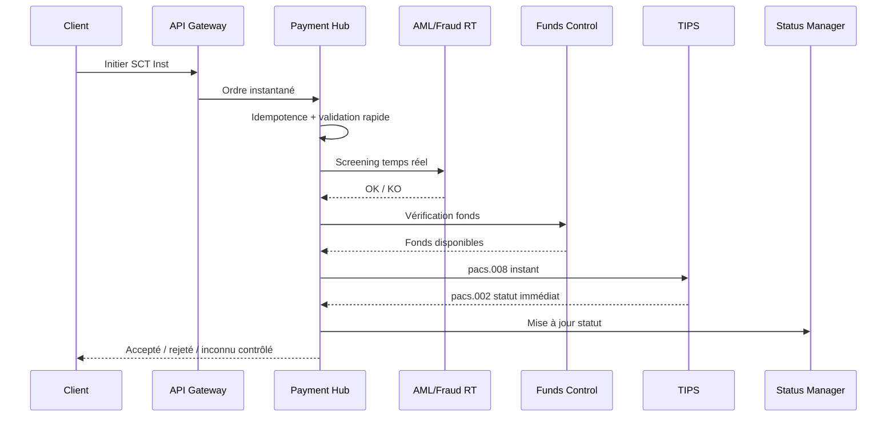
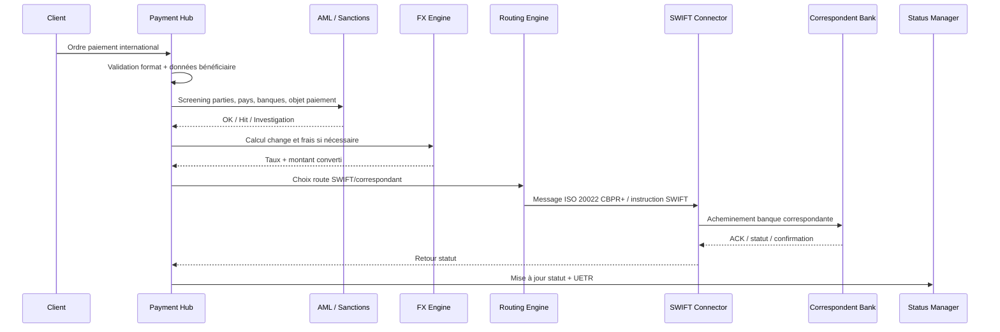
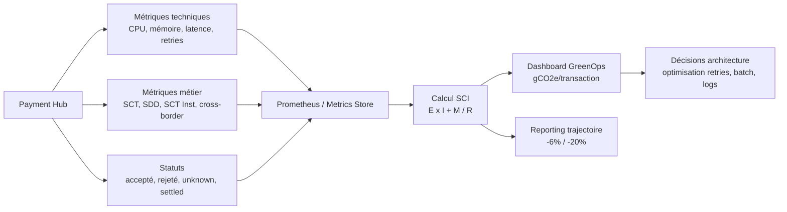

# 05_ARCHITECTURE_SI_02 — Payment Hub comme cœur d’architecture des flux de paiements bancaires

**Projet :** `greenops-it-flux-architecture`  
**Domaine :** Architecture SI bancaire / paiements / ISO 20022 / GreenOps  
**Niveau :** Architecte solution senior  
**Version :** 1.0  
**Fichier :** `05_ARCHITECTURE_SI_02_payment_hub.md`

---

## Table des matières

1. [Objectif du document](#1-objectif-du-document)
2. [Définition d’un Payment Hub](#2-définition-dun-payment-hub)
3. [Pourquoi un Payment Hub dans une banque](#3-pourquoi-un-payment-hub-dans-une-banque)
4. [Responsabilités principales](#4-responsabilités-principales)
5. [Architecture interne du Payment Hub](#5-architecture-interne-du-payment-hub)
6. [Input Adapter](#6-input-adapter)
7. [Validation Engine](#7-validation-engine)
8. [Canonical Mapper](#8-canonical-mapper)
9. [Payment Orchestrator](#9-payment-orchestrator)
10. [Routing Engine](#10-routing-engine)
11. [Infrastructure Connectors](#11-infrastructure-connectors)
12. [Status Manager](#12-status-manager)
13. [Gestion de la corrélation](#13-gestion-de-la-corrélation)
14. [Idempotence](#14-idempotence)
15. [Résilience](#15-résilience)
16. [SCT dans le Payment Hub](#16-sct-dans-le-payment-hub)
17. [SDD dans le Payment Hub](#17-sdd-dans-le-payment-hub)
18. [SCT Inst dans le Payment Hub](#18-sct-inst-dans-le-payment-hub)
19. [Cross-border dans le Payment Hub](#19-cross-border-dans-le-payment-hub)
20. [Cash Management dans le Payment Hub](#20-cash-management-dans-le-payment-hub)
21. [Observabilité du Payment Hub](#21-observabilité-du-payment-hub)
22. [GreenOps dans le Payment Hub](#22-greenops-dans-le-payment-hub)
23. [Anti-patterns](#23-anti-patterns)
24. [Gouvernance](#24-gouvernance)
25. [Questions d’audit](#25-questions-daudit)
26. [Synthèse architecte](#26-synthèse-architecte)

---

## 1. Objectif du document

Ce document décrit le **Payment Hub** comme composant central d’une architecture bancaire moderne de traitement des flux de paiements. Il s’inscrit dans le projet `greenops-it-flux-architecture`, après les domaines déjà structurés :

- `01_PAIEMENTS_BANCAIRES` : compréhension fonctionnelle des virements, prélèvements, instant payments et paiements internationaux ;
- `02_ISO20022` : messages XML ISO 20022, modèles `pain`, `pacs`, `camt`, statuts et rejets ;
- `03_GREENOPS_CARBONE` : mesure énergétique, SCI, gCO2e par transaction, optimisation IT ;
- `05_ARCHITECTURE_SI/01_overview.md` : vue d’ensemble de l’architecture SI des flux bancaires.

L’objectif n’est pas de présenter un simple composant applicatif, mais de formaliser une **pièce d’architecture stratégique** capable de :

- recevoir des ordres de paiement issus de multiples canaux ;
- normaliser ces ordres dans un **modèle canonique** ;
- appliquer les contrôles fonctionnels, techniques, réglementaires et de risque ;
- orchestrer les étapes de traitement ;
- router les paiements vers les infrastructures adaptées : **STET**, **TIPS**, **SWIFT**, correspondants bancaires, systèmes internes ;
- produire et suivre les statuts ISO 20022 ;
- fournir une observabilité exploitable par les équipes **SRE**, exploitation, risque, conformité et métier ;
- mesurer l’empreinte carbone des traitements via une approche **SCI / gCO2e par transaction**.

Ce document sert de base à un livrable d’architecture HLD/LLD pour une banque souhaitant moderniser ses flux SCT, SDD, SCT Inst, cross-border et cash management.

---

## 2. Définition d’un Payment Hub

Un **Payment Hub** est une plateforme centralisée de traitement des paiements. Il agit comme un cœur d’orchestration, de normalisation, de routage, de suivi et de contrôle des flux bancaires.

Il ne remplace pas forcément tous les systèmes existants. Il sert plutôt de **couche d’unification** entre les canaux d’entrée, les moteurs de validation, les référentiels, les systèmes de compte, les moteurs AML/fraude, les infrastructures de clearing/settlement et les systèmes de reporting.

Dans une banque, le Payment Hub devient la zone de convergence entre :

| Famille | Exemples | Rôle dans le Payment Hub |
|---|---|---|
| Canaux clients | Web banking, mobile banking, API corporate, EBICS, SwiftNet for Corporates | Entrée des ordres de paiement |
| Messages ISO 20022 | `pain.001`, `pain.008`, `pacs.008`, `pacs.003`, `pacs.002`, `camt.054` | Format fonctionnel et interbancaire |
| Paiements SEPA | SCT, SDD, SCT Inst | Produits domestiques/européens |
| Paiements internationaux | SWIFT CBPR+, correspondants, FX | Paiements cross-border |
| Infrastructures | STET, TIPS, RTGS, SWIFT | Clearing, settlement, transport |
| Référentiels | comptes, clients, BIC, IBAN, mandats, calendriers | Enrichissement et contrôle |
| Risque/conformité | AML, sanctions, fraude, scoring | Contrôles réglementaires |
| Observabilité | logs, traces, métriques, SLO, alerting | Pilotage technique et métier |
| GreenOps | énergie, CPU, retries, stockage, SCI | Pilotage carbone |

Le Payment Hub doit être conçu comme un **système critique**, fortement observable, résilient, idempotent et gouverné. Une erreur dans ce composant peut provoquer des doubles paiements, des pertes de statuts, des incidents réglementaires, des rejets interbancaires ou une incapacité à justifier le cycle de vie d’un paiement.

---

## 3. Pourquoi un Payment Hub dans une banque

Une banque qui ne possède pas de Payment Hub se retrouve souvent avec une architecture fragmentée : chaque canal, produit ou infrastructure possède son propre traitement, ses propres contrôles, ses propres mappings, ses propres statuts et ses propres logs. Cette situation augmente fortement la complexité opérationnelle.

Le Payment Hub répond à plusieurs enjeux.

### 3.1 Réduction de la fragmentation SI

Sans Payment Hub, les flux peuvent suivre des trajectoires différentes selon le produit :

- un virement SCT depuis le web banking passe par une chaîne historique ;
- un fichier corporate `pain.001` passe par une chaîne EBICS séparée ;
- un prélèvement SDD passe par une application dédiée ;
- un SCT Inst utilise une plateforme temps réel isolée ;
- un paiement international passe par une chaîne SWIFT spécifique.

Cette fragmentation génère :

- redondance des contrôles ;
- règles métier divergentes ;
- duplications de mapping ISO 20022 ;
- statuts non homogènes ;
- supervision éclatée ;
- coûts de maintenance élevés ;
- empreinte carbone supérieure par duplication de traitements.

### 3.2 Standardisation ISO 20022

Le Payment Hub impose une approche cohérente autour d’ISO 20022 :

- `pain.001` pour les ordres de virement client à banque ;
- `pain.008` pour les ordres de prélèvement client à banque ;
- `pacs.008` pour les virements interbancaires ;
- `pacs.003` pour les prélèvements interbancaires ;
- `pacs.002` pour les statuts interbancaires ;
- `camt.054` pour les notifications de débit/crédit ;
- `camt.053` pour les relevés de compte ;
- `camt.029` pour certaines réponses d’investigation ou de résolution.

Il permet aussi de gérer les variantes de marché : SEPA, STET, TIPS, SWIFT CBPR+, règles internes, contraintes de cut-off et exigences d’enrichissement.

### 3.3 Accélération de la transformation

Avec un Payment Hub bien conçu, la banque peut plus rapidement :

- ajouter un nouveau canal ;
- migrer vers une nouvelle infrastructure ;
- intégrer un nouveau schéma de paiement ;
- appliquer une nouvelle règle de conformité ;
- mesurer un nouveau KPI ;
- exposer des API de paiement ;
- industrialiser l’observabilité ;
- déployer des optimisations GreenOps sans réécrire toutes les chaînes.

### 3.4 Pilotage GreenOps

Le Payment Hub constitue un point de mesure naturel pour calculer l’empreinte carbone des flux, car il connaît :

- le type de paiement ;
- le canal d’origine ;
- le nombre de validations réalisées ;
- le nombre de mappings ;
- les retries ;
- les appels aux systèmes tiers ;
- les temps de traitement ;
- les statuts finaux ;
- les rejets ;
- le volume par produit.

Il devient donc possible de mesurer des indicateurs comme :

| Indicateur | Exemple |
|---|---|
| `gCO2e / transaction SCT` | 0,42 gCO2e par virement traité |
| `gCO2e / transaction SCT Inst` | 0,85 gCO2e par paiement instantané avec contrôles temps réel |
| `CPU ms / paiement` | 35 ms CPU pour mapping + validation |
| `nombre de retries / 1000 paiements` | 12 retries techniques sur 1000 SCT Inst |
| `énergie / batch SDD` | 1,8 kWh pour un batch de 500 000 prélèvements |

---

## 4. Responsabilités principales

Le Payment Hub doit assumer des responsabilités clairement bornées. Il ne doit pas devenir un monolithe contenant toute la logique bancaire, toute la comptabilité, toute la fraude et tout le reporting. Sa valeur réside dans l’orchestration contrôlée et traçable du cycle de vie du paiement.

### 4.1 Responsabilités fonctionnelles

| Responsabilité | Description |
|---|---|
| Réception des ordres | Accepter les paiements entrants depuis API, fichiers, événements ou messages |
| Normalisation | Transformer les formats entrants vers un modèle canonique interne |
| Validation | Vérifier syntaxe, schéma ISO, règles métier, éligibilité, cut-off |
| Enrichissement | Ajouter données compte, client, BIC, mandat, calendrier, priorités |
| Orchestration | Piloter les étapes selon le type de paiement et l’état du flux |
| Routage | Choisir STET, TIPS, SWIFT, système interne ou file d’attente |
| Suivi de statut | Maintenir l’état consolidé du paiement |
| Notification | Produire `pacs.002`, `pain.002`, `camt.054`, événements métier |
| Audit | Conserver les traces nécessaires aux contrôles et investigations |

### 4.2 Responsabilités techniques

| Responsabilité | Description |
|---|---|
| Idempotence | Empêcher les doubles traitements en cas de retry ou duplication |
| Résilience | Supporter pannes partielles, timeouts, indisponibilités externes |
| Observabilité | Exposer métriques, logs structurés, traces distribuées |
| Sécurité | Chiffrement, contrôle d’accès, masquage des données sensibles |
| Performance | Tenir les volumes batch et les exigences temps réel |
| Scalabilité | Séparer traitements batch, temps réel, connecteurs et statuts |
| Traçabilité | Corrélation technique et métier de bout en bout |
| GreenOps | Mesurer et optimiser coût CPU, énergie, stockage et retries |

### 4.3 Responsabilités à exclure

Le Payment Hub ne doit pas absorber sans limite :

- la comptabilité générale complète ;
- la tenue de compte complète ;
- la totalité des modèles de fraude ;
- la totalité des référentiels client ;
- les portails utilisateurs ;
- le reporting réglementaire complet ;
- la gestion documentaire des contrats ;
- les workflows humains de back-office trop spécifiques.

Il doit interagir avec ces systèmes via des contrats clairs, des API, des événements ou des connecteurs spécialisés.

---

## 5. Architecture interne du Payment Hub

### 5.1 Vision globale Payment Hub



Cette vision montre le Payment Hub comme un composant central, mais pas isolé. Il dépend fortement de services internes et d’infrastructures externes. La qualité d’architecture dépend donc autant de la conception interne du Hub que des contrats d’intégration avec son écosystème.

### 5.2 Architecture interne détaillée



### 5.3 Vue en couches

| Couche | Rôle | Exemples de composants |
|---|---|---|
| Canal | Capture de la demande | API Gateway, EBICS Gateway, fichiers, portails |
| Adaptation | Conversion d’entrée | Input Adapter, parser XML, parser JSON, contrôleur fichier |
| Validation | Contrôles | XSD, règles ISO, règles STET, mandats, cut-off |
| Canonique | Modèle interne | Canonical Payment Instruction, Party, Account, Status |
| Orchestration | Workflow de paiement | State machine, saga, timers, compensation |
| Routage | Choix de rail | STET, TIPS, SWIFT, interne, batch |
| Connectivité | Intégration externe | MQ, API, SFTP, SWIFTNet, Kafka |
| Statut | Cycle de vie | Status Manager, correlation store, event store |
| Observabilité | Exploitation | SLO, métriques, logs, traces, alertes |
| GreenOps | Empreinte | SCI, CPU/message, gCO2e/transaction |

---

## 6. Input Adapter

L’**Input Adapter** est la porte d’entrée technique et fonctionnelle du Payment Hub. Il reçoit des flux hétérogènes et les prépare pour les étapes de validation et de normalisation.

### 6.1 Sources possibles

| Source | Format typique | Contraintes |
|---|---|---|
| API Corporate | JSON, XML ISO 20022 | Authentification forte, quotas, SLA API |
| EBICS | Fichiers `pain.001`, `pain.008` | Signature, lot, cut-off, volumétrie batch |
| Mobile/Web | API JSON interne | Latence faible, UX immédiate |
| Back-office | Messages applicatifs | Traçabilité, validation manuelle possible |
| SwiftNet for Corporates | ISO 20022 / FIN selon contexte | Sécurité, non-répudiation |
| Événements internes | Kafka / MQ | Ordonnancement, idempotence |

### 6.2 Responsabilités de l’Input Adapter

- authentifier la source ;
- vérifier le canal d’origine ;
- contrôler la taille du message ;
- calculer un hash d’intégrité ;
- extraire les identifiants clés ;
- détecter le type de message ;
- produire un événement d’entrée ;
- transmettre le message au Validation Engine ;
- conserver le payload brut selon la politique d’audit et de rétention.

### 6.3 Exemple : réception d’un `pain.001`

Un client corporate dépose un fichier `pain.001` via EBICS contenant 10 000 virements SCT.

Le Payment Hub doit :

1. recevoir le fichier ;
2. vérifier la signature et le contrat EBICS ;
3. identifier le client, le compte émetteur et le nombre de transactions ;
4. vérifier que le fichier est bien un `pain.001` compatible avec la version acceptée ;
5. extraire `MsgId`, `PmtInfId`, `EndToEndId`, montant, devise, débiteur, créancier ;
6. créer un identifiant interne de batch ;
7. transmettre le flux au Validation Engine ;
8. produire une trace d’entrée avec `correlationId`.

### 6.4 Points de vigilance

| Risque | Impact | Mesure d’architecture |
|---|---|---|
| Fichier trop volumineux | Saturation mémoire | Streaming XML, découpage batch, backpressure |
| Version ISO non supportée | Rejet tardif | Détection précoce version namespace |
| Duplicat fichier | Double paiement | Hash fichier + idempotence fonctionnelle |
| Canal non authentifié | Risque fraude | mTLS, signature, OAuth2, contrat canal |
| Logs trop verbeux | Risque RGPD + carbone | Masquage données + sampling contrôlé |

---

## 7. Validation Engine

Le **Validation Engine** applique les contrôles nécessaires avant transformation et routage. Il doit séparer les validations techniques, fonctionnelles, réglementaires et de marché.

### 7.1 Types de validation

| Type | Exemples | Sortie attendue |
|---|---|---|
| Syntaxique | XML bien formé, JSON valide | Accepté / rejet technique |
| Schéma | XSD ISO 20022, version message | Accepté / rejet format |
| Sémantique | montant positif, devise valide, IBAN cohérent | Accepté / rejet métier |
| Produit | SCT, SDD, SCT Inst éligible | Choix produit ou rejet |
| Référentiel | compte actif, client connu, BIC valide | Enrichissement / rejet |
| Mandat | mandat SDD actif, signature, séquence | Accepté / rejet mandat |
| Cut-off | heure limite, jour ouvré | Traitement immédiat ou différé |
| Conformité | AML, sanctions, pays à risque | Hold, rejet, investigation |
| Risque | fraude, vélocité, scoring | Accepté, challenge, blocage |

### 7.2 Validation ISO 20022

La validation ISO 20022 ne doit pas se limiter à une validation XSD. Un message peut être valide au sens XML mais invalide selon les règles de marché.

Exemple : un `pain.001` peut respecter le schéma XML mais contenir un service level incompatible avec le rail attendu.

| Niveau | Exemple |
|---|---|
| XML | balises fermées, namespace correct |
| XSD | structure `CstmrCdtTrfInitn` conforme |
| ISO sémantique | `CtrlSum` cohérent avec la somme des transactions |
| Règle SEPA/STET | IBAN SEPA, devise EUR, BIC valide, champ obligatoire marché |
| Règle banque | compte autorisé, plafond client, produit souscrit |

### 7.3 Exemple : rejet d’un `pain.008`

Un fichier `pain.008` contient des prélèvements SDD. Le Validation Engine détecte :

- un mandat absent ;
- une séquence incorrecte `FRST` alors que le mandat a déjà été utilisé ;
- une date de collection incompatible avec le calendrier SEPA ;
- une somme de contrôle incohérente.

Le Payment Hub doit produire un statut de rejet exploitable, par exemple :

- rejet global fichier si l’intégrité du fichier est compromise ;
- rejet partiel transaction par transaction si le fichier reste exploitable ;
- génération d’un `pain.002` côté client ;
- historisation des motifs de rejet.

---

## 8. Canonical Mapper

Le **Canonical Mapper** transforme les formats entrants vers un **modèle canonique de paiement**. Cette étape est fondamentale pour éviter que chaque rail ou chaque système interne manipule directement toutes les variantes ISO 20022.

### 8.1 Pourquoi un modèle canonique

Un modèle canonique permet de :

- découpler les canaux d’entrée des infrastructures de sortie ;
- unifier SCT, SDD, SCT Inst et cross-border ;
- standardiser la représentation d’un paiement ;
- réduire la duplication des mappings ;
- faciliter l’audit ;
- mesurer les volumes par unité fonctionnelle ;
- appliquer les règles GreenOps sur un objet commun.

### 8.2 Objets canoniques principaux

| Objet canonique | Rôle | Champs typiques |
|---|---|---|
| `PaymentInstruction` | Ordre global | instructionId, productType, channel, requestedExecutionDate |
| `PaymentTransaction` | Transaction individuelle | transactionId, endToEndId, amount, currency, status |
| `Party` | Débiteur/créancier | name, postalAddress, country, identifiers |
| `Account` | Compte | IBAN, BBAN, accountId, accountType |
| `Agent` | Banque | BIC, clearingSystemMemberId |
| `Mandate` | Mandat SDD | mandateId, signatureDate, sequenceType |
| `ComplianceContext` | Données contrôle | sanctionsResult, amlScore, countryRisk |
| `RoutingContext` | Choix rail | scheme, infrastructure, priority, settlementMethod |
| `StatusEvent` | État | statusCode, reasonCode, timestamp, source |
| `CarbonContext` | Mesure GreenOps | cpuMs, energyWh, gco2e, retryCount |

### 8.3 Exemple obligatoire : `pain.001` vers `pacs.008`

Un `pain.001` représente une demande client de virement. Pour envoyer le paiement vers un système interbancaire, le Payment Hub doit créer un message `pacs.008`.

| Élément `pain.001` | Élément canonique | Élément `pacs.008` |
|---|---|---|
| `GrpHdr/MsgId` | `instruction.groupMessageId` | `GrpHdr/MsgId` ou référence interne |
| `PmtInf/PmtInfId` | `instruction.paymentInfoId` | Contexte de lot ou référence interne |
| `CdtTrfTxInf/PmtId/EndToEndId` | `transaction.endToEndId` | `CdtTrfTxInf/PmtId/EndToEndId` |
| `InstdAmt` | `transaction.amount` | `IntrBkSttlmAmt` |
| `Dbtr` | `debtor.party` | `Dbtr` |
| `DbtrAcct/IBAN` | `debtor.account.iban` | `DbtrAcct` |
| `Cdtr` | `creditor.party` | `Cdtr` |
| `CdtrAcct/IBAN` | `creditor.account.iban` | `CdtrAcct` |
| `ReqdExctnDt` | `requestedExecutionDate` | `IntrBkSttlmDt` après règles cut-off |
| `SvcLvl/SEPA` | `productType=SCT` | `PmtTpInf/SvcLvl` |

Le mapping n’est pas une simple copie XML. Le Payment Hub doit aussi :

- enrichir la banque débitrice ;
- déterminer la banque créditrice ;
- vérifier le scheme SEPA ;
- calculer la date de settlement ;
- appliquer la règle de routage STET ou autre CSM ;
- générer les références interbancaires ;
- conserver le lien entre identifiants client, identifiants internes et identifiants infrastructure.

### 8.4 Exemple obligatoire : `pain.008` vers `pacs.003`

Un `pain.008` contient des instructions de prélèvement. Le Payment Hub transforme chaque prélèvement accepté en `pacs.003`.

| Élément `pain.008` | Élément canonique | Élément `pacs.003` |
|---|---|---|
| `GrpHdr/MsgId` | `instruction.groupMessageId` | `GrpHdr/MsgId` |
| `PmtInf/PmtInfId` | `instruction.paymentInfoId` | Référence de lot |
| `DrctDbtTxInf/PmtId/EndToEndId` | `transaction.endToEndId` | `DrctDbtTxInf/PmtId/EndToEndId` |
| `InstdAmt` | `transaction.amount` | `IntrBkSttlmAmt` |
| `Cdtr` | `creditor.party` | `Cdtr` |
| `CdtrAcct` | `creditor.account` | `CdtrAcct` |
| `Dbtr` | `debtor.party` | `Dbtr` |
| `DbtrAcct` | `debtor.account` | `DbtrAcct` |
| `MndtRltdInf/MndtId` | `mandate.mandateId` | `DrctDbtTx/MndtRltdInf/MndtId` |
| `SeqTp` | `mandate.sequenceType` | `PmtTpInf/SeqTp` |
| `ReqdColltnDt` | `requestedCollectionDate` | `IntrBkSttlmDt` après calendrier |

---

## 9. Payment Orchestrator

Le **Payment Orchestrator** pilote le cycle de vie du paiement. Il ne doit pas être réduit à un simple workflow technique. Il porte la logique d’enchaînement des étapes, la gestion des états, les timeouts, les compensations, les appels aux systèmes de contrôle et le suivi des décisions.

### 9.1 Rôle de l’orchestrateur

| Fonction | Description |
|---|---|
| Piloter les étapes | validation, enrichissement, AML, réservation, routage, émission |
| Gérer l’état | état courant, historique, transitions autorisées |
| Appliquer les politiques | retry, timeout, compensation, escalade |
| Coordonner les systèmes | compte, AML, fraude, ledger, connecteurs |
| Garantir la traçabilité | événement par étape, corrélation, audit |
| Produire les notifications | statuts client, back-office, comptabilité |

### 9.2 Modèle d’état simplifié

| État | Signification | Transition possible |
|---|---|---|
| `RECEIVED` | Paiement reçu | `VALIDATING` |
| `VALIDATING` | Contrôles en cours | `REJECTED`, `ENRICHING` |
| `ENRICHING` | Enrichissement référentiel | `COMPLIANCE_CHECK` |
| `COMPLIANCE_CHECK` | AML/fraude/sanctions | `ON_HOLD`, `READY_TO_ROUTE`, `REJECTED` |
| `READY_TO_ROUTE` | Paiement routable | `SENT_TO_INFRA` |
| `SENT_TO_INFRA` | Envoyé infrastructure | `ACCEPTED`, `REJECTED`, `UNKNOWN` |
| `UNKNOWN` | Statut incertain | `INVESTIGATING`, `ACCEPTED`, `REJECTED` |
| `ACCEPTED` | Accepté par infrastructure | `SETTLED`, `NOTIFIED` |
| `SETTLED` | Settlement confirmé | `NOTIFIED` |
| `REJECTED` | Rejeté | `NOTIFIED` |
| `NOTIFIED` | Client/système notifié | État final |

### 9.3 Orchestration synchrone et asynchrone

Un Payment Hub doit combiner les deux modèles.

| Mode | Usage | Exemple |
|---|---|---|
| Synchrone | Réponse immédiate attendue | API SCT Inst, pré-validation web |
| Asynchrone | Traitement long ou batch | fichier `pain.001`, fichier `pain.008` |
| Event-driven | Découplage et audit | émission événement `PaymentAccepted` |
| Saga | Processus distribué | réservation fonds puis émission interbancaire |
| State machine | Paiement critique | gestion statuts SCT Inst inconnus |

---

## 10. Routing Engine

Le **Routing Engine** choisit le rail de paiement approprié. Ce choix dépend du produit, du montant, de la devise, du pays, du calendrier, de la disponibilité des infrastructures, du coût, du SLA, du risque et parfois de politiques commerciales.

### 10.1 Diagramme de routage SCT/SDD/SCT Inst/cross-border



### 10.2 Critères de routage

| Critère | SCT | SDD | SCT Inst | Cross-border |
|---|---:|---:|---:|---:|
| Devise EUR | Obligatoire | Obligatoire | Obligatoire | Non, multi-devise possible |
| Zone SEPA | Oui | Oui | Oui | Non nécessaire |
| Mandat | Non | Oui | Non | Non |
| Temps réel | Non | Non | Oui | Variable |
| AML renforcé | Standard | Standard | Temps réel | Fort |
| Infrastructure typique | STET | STET | TIPS | SWIFT |
| Statut critique | `pacs.002` | `pacs.002` | statut immédiat | ACK/NACK + confirmations |
| GreenOps | batch optimisable | batch fortement optimisable | optimisation retries/timeouts | optimisation enrichissement/AML |

### 10.3 Routage intelligent

Un routage mature peut prendre en compte :

- disponibilité temps réel de TIPS ;
- calendrier STET ;
- cut-off par produit ;
- capacité du connecteur ;
- file d’attente prioritaire ;
- coût par rail ;
- empreinte carbone estimée par rail ;
- niveau de risque pays ou devise ;
- préférences client corporate ;
- stratégie de fallback.

Exemple : un SCT Inst peut être routé vers TIPS si la banque du bénéficiaire est atteignable et si le SLA temps réel est respectable. Sinon, la banque peut proposer un fallback vers SCT classique, mais jamais sans accord fonctionnel explicite si le produit demandé était instantané.

---

## 11. Infrastructure Connectors

Les **Infrastructure Connectors** encapsulent la communication avec les rails de paiement et les systèmes externes.

### 11.1 Types de connecteurs

| Connecteur | Rôle | Protocoles possibles |
|---|---|---|
| STET Connector | SCT/SDD clearing | MQ, fichier, API selon contexte bancaire |
| TIPS Connector | SCT Inst temps réel | ISO 20022 temps réel, canal sécurisé |
| SWIFT Connector | Cross-border / CBPR+ | SWIFTNet, interface SWIFT, MQ interne |
| Core Banking Connector | Vérification compte, booking | API, MQ, events |
| AML Connector | Screening sanctions/AML | API synchrone, batch, event |
| Accounting Connector | Écritures comptables | API, MQ, fichier |
| Notification Connector | Client/back-office | events, API, messaging |

### 11.2 Responsabilités d’un connecteur

- convertir le message canonique vers le format de sortie ;
- gérer l’authentification technique ;
- signer/chiffrer si nécessaire ;
- appliquer les timeouts ;
- traiter ACK/NACK ;
- publier les événements de statut ;
- gérer les retries techniques contrôlés ;
- protéger le Payment Hub des détails protocolaires ;
- exposer des métriques spécifiques au rail.

### 11.3 Contrats de connecteur

Chaque connecteur doit documenter :

| Élément | Exemple |
|---|---|
| Messages supportés | `pacs.008`, `pacs.003`, `pacs.002` |
| Versions ISO | Version namespace acceptée |
| Timeouts | 2s AML, 5s STET ACK, 10s SCT Inst |
| Retries | Nombre, délai, backoff, conditions |
| Idempotence | Clé externe, hash message, référence infrastructure |
| Monitoring | taux erreur, latence, backlog, rejet |
| Sécurité | mTLS, certificats, chiffrement, HSM |
| GreenOps | CPU/message, volume logs, retry cost |

---

## 12. Status Manager

Le **Status Manager** centralise l’état des paiements. Il est critique car le paiement est un processus asynchrone avec des statuts multiples, parfois contradictoires ou tardifs.

### 12.1 Rôle

Le Status Manager doit :

- conserver l’état courant ;
- historiser chaque transition ;
- gérer les statuts partiels ;
- interpréter les messages `pacs.002`, `pain.002`, `camt.054` ;
- consolider les statuts internes et externes ;
- produire les notifications ;
- déclencher les investigations en cas d’état inconnu ;
- alimenter les tableaux de bord métier et SRE.

### 12.2 Statuts internes et ISO

| Statut interne | Sens | Message associé possible |
|---|---|---|
| `RECEIVED` | Reçu par le Hub | Accusé technique interne |
| `ACCEPTED_TECHNICAL` | Format accepté | `pain.002` positif éventuel |
| `REJECTED_TECHNICAL` | Format rejeté | `pain.002` rejet |
| `ACCEPTED_FOR_PROCESSING` | Accepté métier | `pain.002` |
| `SENT_TO_CSM` | Envoyé vers clearing | événement interne |
| `ACCEPTED_BY_CSM` | Accepté infrastructure | `pacs.002` positif |
| `REJECTED_BY_CSM` | Rejet infrastructure | `pacs.002` négatif |
| `SETTLED` | Réglé | confirmation settlement |
| `BOOKED` | Comptabilisé | écriture ledger |
| `NOTIFIED` | Notification client produite | `camt.054`, événement API |
| `UNKNOWN` | Statut incertain | investigation requise |

### 12.3 Exemple obligatoire : `camt.054` généré depuis statut paiement

Après acceptation et comptabilisation d’un paiement, le Payment Hub peut déclencher la génération d’un `camt.054` pour informer le client corporate d’un débit ou d’un crédit.

Exemple SCT sortant :

1. `pain.001` reçu depuis un client corporate ;
2. transformation en paiement canonique ;
3. émission d’un `pacs.008` vers STET ;
4. réception d’un `pacs.002` d’acceptation ;
5. débit du compte client ;
6. passage du statut à `BOOKED`; 
7. génération d’une notification `camt.054` indiquant le débit ;
8. mise à disposition via canal corporate ou API.

| Source statut | Condition | Notification générée |
|---|---|---|
| `BOOKED_DEBIT` | Débit effectif du compte donneur d’ordre | `camt.054` débit |
| `BOOKED_CREDIT` | Crédit reçu sur compte bénéficiaire | `camt.054` crédit |
| `REJECTED` | Rejet avant booking | `pain.002` ou notification rejet |
| `RETURNED` | Retour interbancaire | `camt.054` + motif retour |

---

## 13. Gestion de la corrélation

La corrélation permet de suivre un paiement depuis sa demande initiale jusqu’à son statut final, même lorsque plusieurs systèmes, formats et identifiants interviennent.

### 13.1 Identifiants clés

| Identifiant | Origine | Usage |
|---|---|---|
| `correlationId` | Payment Hub | Trace technique transverse |
| `paymentHubInstructionId` | Payment Hub | Identifiant interne d’instruction |
| `paymentHubTransactionId` | Payment Hub | Identifiant interne transaction |
| `MsgId` | ISO 20022 | Identifiant message |
| `PmtInfId` | `pain.*` | Identifiant lot de paiement |
| `EndToEndId` | Client | Référence métier bout en bout |
| `UETR` | SWIFT / cross-border | Traçabilité internationale |
| `MandateId` | SDD | Référence mandat |
| `ClearingReference` | Infrastructure | Référence STET/TIPS/SWIFT |

### 13.2 Stratégie de corrélation

Le Payment Hub doit conserver une table ou un store de corrélation :

| Champ | Exemple |
|---|---|
| `correlationId` | `CORR-2026-000001` |
| `instructionId` | `PH-INS-000991` |
| `transactionId` | `PH-TX-982331` |
| `sourceMessageId` | `MSG-CORP-20260427-001` |
| `endToEndId` | `E2E-INV-2026-98765` |
| `rail` | `STET-SCT` |
| `externalReference` | `STET-ACK-7771` |
| `currentStatus` | `ACCEPTED_BY_CSM` |
| `lastStatusTimestamp` | `2026-04-27T09:15:34Z` |

### 13.3 Corrélation et audit

Sans corrélation forte, les équipes ne peuvent pas répondre correctement aux questions :

- le client a-t-il envoyé l’ordre ?
- le Hub a-t-il accepté l’ordre ?
- le paiement a-t-il été transformé en `pacs.008` ?
- quel connecteur a envoyé le paiement ?
- STET/TIPS/SWIFT a-t-il répondu ?
- le statut reçu correspond-il au bon paiement ?
- le compte a-t-il été débité/crédité ?
- un `camt.054` a-t-il été généré ?
- quel est le coût CPU et carbone de ce traitement ?

---

## 14. Idempotence

L’idempotence garantit qu’un même ordre reçu plusieurs fois ne provoque pas plusieurs paiements indésirables.

### 14.1 Diagramme d’idempotence



### 14.2 Clés d’idempotence

| Flux | Clé candidate | Commentaire |
|---|---|---|
| API paiement | `Idempotency-Key` HTTP + clientId | Très utile en API |
| `pain.001` fichier | hash fichier + `MsgId` + clientId | Évite double dépôt fichier |
| Transaction SCT | clientId + `EndToEndId` + montant + date | Attention aux clients réutilisant `EndToEndId` |
| SDD | creditorId + mandateId + endToEndId + collectionDate | Mandat central |
| SCT Inst | idempotencyKey + timestamp + amount | Critique en timeout |
| Cross-border | UETR + debtor + creditor + amount | UETR utile pour traçabilité |

### 14.3 Idempotence fonctionnelle et technique

| Type | Objectif | Exemple |
|---|---|---|
| Technique | Éviter double traitement d’un même message | retry HTTP après timeout |
| Fonctionnelle | Éviter double paiement réel | même `EndToEndId` envoyé deux fois |
| Infrastructure | Éviter double émission vers rail | connecteur STET retry après ACK perdu |
| Comptable | Éviter double booking | débit compte rejoué |

L’idempotence doit être pensée de bout en bout. Un Payment Hub peut être techniquement idempotent mais provoquer un double booking si la couche comptable ne l’est pas.

---

## 15. Résilience

Le Payment Hub doit résister aux pannes partielles. En paiement, les pannes les plus dangereuses ne sont pas les échecs francs, mais les états incertains : timeout après émission, ACK perdu, statut tardif, connecteur indisponible, réponse contradictoire.

### 15.1 Principes de résilience

| Principe | Application Payment Hub |
|---|---|
| Timeout explicite | Chaque appel externe a un timeout adapté au produit |
| Retry contrôlé | Retry uniquement si idempotence garantie |
| Circuit breaker | Stopper temporairement les appels vers un service instable |
| Bulkhead | Séparer SCT Inst temps réel des batchs SDD lourds |
| Backpressure | Ralentir l’ingestion en cas de backlog |
| Dead-letter queue | Isoler les messages non traitables |
| Reconciliation | Comparer statuts internes et statuts infrastructure |
| Compensation | Annuler/réparer une étape si possible |
| Graceful degradation | Dégrader certains services non critiques |

### 15.2 Pannes typiques

| Panne | Risque | Réponse d’architecture |
|---|---|---|
| AML timeout | Paiement bloqué | statut `ON_HOLD`, reprise asynchrone |
| TIPS timeout | statut inconnu | investigation automatique, pas de double émission |
| STET rejet fichier | rejet massif | analyse motif, split/retry si autorisé |
| Core banking indisponible | pas de booking | file d’attente, retry idempotent |
| Observabilité dégradée | perte supervision | buffer local, métriques minimales |
| Backlog batch SDD | dépassement cut-off | priorisation, capacité horizontale |

### 15.3 SCT Inst avec timeout/statut inconnu

Cas obligatoire : un client initie un SCT Inst. Le Payment Hub envoie le paiement vers TIPS. Le connecteur ne reçoit pas de réponse avant le timeout.

Risque : si le Hub réémet immédiatement le paiement, il peut générer un double paiement.

Comportement cible :

1. le paiement passe en état `SENT_TO_TIPS` ;
2. le timer SCT Inst expire ;
3. le statut devient `UNKNOWN`; 
4. le Hub bloque toute réémission automatique non idempotente ;
5. une procédure d’investigation est lancée ;
6. le connecteur interroge l’infrastructure ou attend un statut asynchrone ;
7. le client reçoit un statut maîtrisé : paiement en cours de confirmation ou statut incertain selon contrat ;
8. à réception du statut final, le Status Manager ferme le cycle.



---

## 16. SCT dans le Payment Hub

Le **SCT** est le virement SEPA classique. Dans le Payment Hub, il représente souvent un volume important, mélangeant flux unitaires, fichiers corporate et traitements batch.

### 16.1 Flux SCT



### 16.2 Étapes principales

| Étape | Description | Point d’architecture |
|---|---|---|
| Réception | `pain.001` ou API virement | streaming pour gros fichiers |
| Validation | XSD, IBAN, devise, cut-off | règles STET et banque |
| Mapping | `pain.001` vers canonique puis `pacs.008` | traçabilité EndToEndId |
| Routage | STET ou autre CSM | calendrier et cut-off |
| Statut | `pacs.002` | consolidation statut |
| Notification | `pain.002`, `camt.054` | information client |

### 16.3 Optimisations GreenOps SCT

| Problème | Impact carbone | Optimisation |
|---|---:|---|
| Validation XML complète répétée | CPU élevé | validation incrémentale + cache schéma |
| Logs payload complets | stockage + I/O | logs structurés masqués |
| Rejet tardif | traitements inutiles | contrôles précoces |
| Batch mal découpé | pics CPU | micro-batch adaptatif |
| Retry sans backoff | CPU + appels externes | retry idempotent avec backoff |

---

## 17. SDD dans le Payment Hub

Le **SDD** est le prélèvement SEPA. Il introduit des contraintes supplémentaires liées aux mandats, aux séquences, aux dates de collection et aux retours.

### 17.1 Flux SDD



### 17.2 Spécificités SDD

| Spécificité | Description |
|---|---|
| Mandat | Autorisation de prélèvement signée |
| Créancier | Identifiant créancier SEPA |
| Séquence | `FRST`, `RCUR`, `OOFF`, `FNAL` |
| Date de collection | Date cible du prélèvement |
| Retours | Rejet, retour, remboursement selon règles SEPA |
| R-transactions | Reject, Return, Refund, Reversal, Request for Cancellation |

### 17.3 Exemple de transformation `pain.008` vers `pacs.003`

Le créancier envoie un `pain.008` pour 50 000 prélèvements. Le Payment Hub :

1. valide le fichier ;
2. vérifie chaque mandat ;
3. contrôle les dates de collection ;
4. découpe le fichier par date, banque, séquence ou règle STET ;
5. transforme les prélèvements valides en `pacs.003` ;
6. transmet à STET ;
7. reçoit les statuts `pacs.002` ;
8. produit les notifications et événements de suivi.

### 17.4 Optimisations GreenOps SDD

Le SDD est souvent traité en batch. Les gains GreenOps peuvent être importants.

| Axe | Exemple d’optimisation |
|---|---|
| CPU | mutualiser la validation mandat par lot |
| I/O | éviter l’écriture de payload XML complet à chaque étape |
| Batch | planifier hors pic carbone si SLA le permet |
| Rejets | détecter mandats invalides avant mapping complet |
| Stockage | politique de rétention différenciée payload/audit |
| Observabilité | métriques agrégées par batch plutôt que logs transactionnels excessifs |

---

## 18. SCT Inst dans le Payment Hub

Le **SCT Inst** impose une architecture temps réel. Le Payment Hub doit traiter le paiement, appliquer les contrôles, router vers TIPS ou un autre rail instantané, gérer le statut et répondre dans un délai très court.

### 18.1 Flux SCT Inst



### 18.2 Contraintes spécifiques

| Contrainte | Implication architecture |
|---|---|
| Latence très faible | validations optimisées, caches référentiels |
| Disponibilité élevée | HA active-active, connecteur résilient |
| Statut immédiat | gestion stricte timeout/statut inconnu |
| AML temps réel | moteur rapide, politique de hold limitée |
| Idempotence critique | aucune double émission en cas de retry |
| Observabilité fine | traces par paiement, SLO temps réel |

### 18.3 Gestion du statut inconnu

Le statut inconnu est un cas central. Il ne doit jamais être masqué sous un simple échec technique.

| Situation | Mauvais comportement | Bon comportement |
|---|---|---|
| Timeout TIPS | Réémettre automatiquement | Passer en `UNKNOWN` et investiguer |
| ACK perdu | Considérer rejet | Réconcilier avec infrastructure |
| Client retry | Rejouer paiement | Retourner statut existant via idempotence |
| Réponse tardive | Ignorer | Mettre à jour statut final |

### 18.4 GreenOps SCT Inst

Le SCT Inst consomme souvent plus de ressources par transaction que le SCT batch, car il impose :

- contrôles temps réel ;
- faible latence ;
- haute disponibilité ;
- traces détaillées ;
- retries sensibles ;
- monitoring plus fin.

L’optimisation GreenOps doit viser surtout :

- réduction des appels redondants AML/référentiel ;
- caching contrôlé ;
- circuit breaker pour éviter tempêtes de retries ;
- logs structurés sans payload complet ;
- SLO ajustés par criticité ;
- capacité dimensionnée selon pics réels.

---

## 19. Cross-border dans le Payment Hub

Le paiement **cross-border** implique des dimensions supplémentaires : devise, change, pays, sanctions, banques correspondantes, SWIFT, frais, délais, transparence et traçabilité internationale.

### 19.1 Flux cross-border avec AML/SWIFT



### 19.2 Spécificités cross-border

| Domaine | Exigence |
|---|---|
| AML | Screening renforcé débiteur, créancier, banques, pays, objet |
| Sanctions | Contrôle listes internationales et locales |
| FX | Conversion devise, taux, marge, transparence |
| Frais | SHA, OUR, BEN selon contrat |
| SWIFT | UETR, traçabilité, ACK/NACK, CBPR+ |
| Correspondants | choix banque intermédiaire |
| Délai | non toujours immédiat |
| Investigation | cas fréquents de statut intermédiaire |

### 19.3 Exemple obligatoire : cross-border avec AML/SWIFT

Un client initie un paiement de 25 000 USD vers une entreprise hors zone SEPA.

Le Payment Hub doit :

1. valider les données client et bénéficiaire ;
2. vérifier la devise USD ;
3. contrôler le pays de destination ;
4. appliquer AML/sanctions sur débiteur, bénéficiaire, BIC, banque intermédiaire et motif ;
5. calculer les frais et le taux de change si compte débiteur en EUR ;
6. générer ou conserver un UETR ;
7. router vers SWIFT ;
8. suivre ACK/NACK et statuts ;
9. gérer les investigations ;
10. notifier le client.

### 19.4 GreenOps cross-border

Les paiements cross-border peuvent être coûteux en traitement car ils sollicitent plusieurs moteurs : AML, sanctions, FX, routage, SWIFT, investigation.

| Optimisation | Gain attendu |
|---|---|
| Screening incrémental | réduit les appels AML inutiles |
| Cache BIC/pays/banques | réduit latence et CPU |
| Déduplication investigations | réduit travail back-office et stockage |
| Logs ciblés | réduit I/O et risque RGPD |
| Corrélation UETR | réduit recherches manuelles |
| Routage transparent | réduit rejets et messages correctifs |

---

## 20. Cash Management dans le Payment Hub

Le cash management concerne les services aux entreprises : initiation de paiements, relevés, avis de débit/crédit, suivi de trésorerie, centralisation et reporting.

### 20.1 Rôle du Payment Hub

Pour les clients corporate, le Payment Hub sert de passerelle entre les ordres de paiement et les informations de trésorerie.

| Besoin corporate | Réponse Payment Hub |
|---|---|
| Initier des virements | `pain.001`, API corporate |
| Initier des prélèvements | `pain.008` |
| Recevoir les statuts | `pain.002`, API statut |
| Recevoir avis débit/crédit | `camt.054` |
| Recevoir relevés | `camt.053` |
| Suivre les rejets | motifs ISO et banque |
| Réconcilier | EndToEndId, MsgId, camt |

### 20.2 Production de `camt.054`

Le `camt.054` est essentiel pour la notification d’événements comptables.

Exemple :

- un SCT sortant est débité ;
- le Status Manager reçoit `BOOKED_DEBIT`; 
- le Notification Producer génère un `camt.054` ;
- le client corporate peut rapprocher ce mouvement avec son `EndToEndId`.

### 20.3 Valeur architecture

Un Payment Hub bien intégré au cash management permet :

- une meilleure expérience corporate ;
- une réduction des appels au support ;
- une réconciliation plus rapide ;
- une diminution des doublons de reporting ;
- une mesure GreenOps par service cash management.

---

## 21. Observabilité du Payment Hub

Le Payment Hub est un système critique. Son observabilité doit couvrir les dimensions techniques, fonctionnelles, réglementaires et GreenOps.

### 21.1 Piliers SRE

| Pilier | Application Payment Hub |
|---|---|
| Logs | événements structurés, corrélation, masquage données |
| Metrics | volumes, latence, erreurs, rejet, backlog, CPU |
| Traces | parcours bout en bout par paiement |
| Alerting | SLO, taux UNKNOWN, rejet anormal, latence TIPS |
| SLO | objectifs par produit SCT/SDD/SCT Inst/cross-border |
| Runbooks | procédures incident, statut inconnu, backlog, rejet massif |

### 21.2 Exemples de métriques

| Métrique | Description | Usage |
|---|---|---|
| `payment_received_total` | nombre de paiements reçus | volumétrie |
| `payment_rejected_total` | rejets par motif | qualité flux |
| `payment_unknown_status_total` | statuts inconnus | risque opérationnel |
| `payment_processing_duration_seconds` | durée bout en bout | SLO |
| `payment_connector_latency_seconds` | latence rail externe | supervision connecteur |
| `payment_retry_total` | nombre de retries | résilience + GreenOps |
| `payment_cpu_ms_total` | CPU consommé | GreenOps |
| `payment_gco2e_total` | carbone estimé | reporting GreenOps |
| `payment_backlog_size` | taille files | capacité |
| `payment_camt054_generated_total` | notifications produites | cash management |

### 21.3 SLO recommandés

| Produit | SLI | SLO indicatif |
|---|---|---|
| SCT | temps traitement fichier | 99% des fichiers avant cut-off |
| SDD | batch collection | 99% des lots traités selon calendrier |
| SCT Inst | latence bout en bout | 99,9% sous seuil contractuel |
| Cross-border | statut initial | 99% ACK/NACK suivis |
| Tous | statut inconnu | inférieur à seuil de risque |
| Tous | double paiement | 0 toléré |

### 21.4 Logs structurés

Un log Payment Hub doit éviter les payloads complets et privilégier les champs utiles :

```json
{
  "timestamp": "2026-04-27T09:15:34Z",
  "level": "INFO",
  "service": "payment-orchestrator",
  "correlationId": "CORR-2026-000001",
  "paymentHubTransactionId": "PH-TX-982331",
  "endToEndId": "E2E-INV-2026-98765",
  "productType": "SCT",
  "rail": "STET",
  "status": "ACCEPTED_BY_CSM",
  "durationMs": 128,
  "retryCount": 0,
  "cpuMs": 34,
  "gco2eEstimate": 0.00042
}
```

---

## 22. GreenOps dans le Payment Hub

Le Payment Hub est un point privilégié pour appliquer une démarche GreenOps car il centralise les flux, les statuts, les retries, les volumes et les métriques de traitement.

### 22.1 Diagramme de mesure GreenOps depuis Payment Hub



### 22.2 Modèle SCI appliqué aux paiements

Le modèle SCI peut être adapté ainsi :

```text
SCI paiement = ((E × I) + M) / R
```

Avec :

| Variable | Sens dans le Payment Hub |
|---|---|
| `E` | énergie consommée par le traitement Payment Hub |
| `I` | intensité carbone de l’électricité |
| `M` | part d’empreinte matérielle allouée |
| `R` | unité fonctionnelle : transaction, batch, 1000 paiements |

Exemple :

```text
E = 0,0008 kWh pour 1 000 SCT
I = 55 gCO2e/kWh
M = 2 gCO2e alloués au batch
R = 1000 transactions

SCI = ((0,0008 × 55) + 2) / 1000
SCI = (0,044 + 2) / 1000
SCI = 0,002044 gCO2e / transaction
```

### 22.3 Indicateurs par produit

| Produit | Unité fonctionnelle | KPI GreenOps |
|---|---|---|
| SCT | 1 transaction ou 1000 transactions | gCO2e/SCT, CPU ms/SCT |
| SDD | 1 batch ou 1000 prélèvements | kWh/batch, rejet/batch, gCO2e/SDD |
| SCT Inst | 1 paiement instantané | gCO2e/SCT Inst, retries, timeout |
| Cross-border | 1 paiement international | gCO2e/paiement, appels AML, investigations |
| Cash management | 1 notification `camt.054` | gCO2e/notification, volume stockage |

### 22.4 Optimisations concrètes

| Zone | Optimisation | Effet GreenOps |
|---|---|---|
| Input Adapter | streaming XML | baisse mémoire |
| Validation Engine | contrôles précoces | moins de traitements inutiles |
| Canonical Mapper | mapping mutualisé | baisse CPU |
| Orchestrator | éviter étapes non nécessaires | baisse latence/CPU |
| Routing Engine | rail adapté dès le départ | baisse rejets |
| Connectors | retry contrôlé | baisse appels externes |
| Status Manager | consolidation efficace | baisse investigations |
| Observabilité | logs utiles, non excessifs | baisse stockage/I/O |
| Batch SDD | planification hors pic | meilleur mix carbone si possible |
| SCT Inst | cache référentiel contrôlé | baisse latence/CPU |

### 22.5 Exemple chiffré : coût carbone des retries SCT Inst

Hypothèse :

| Variable | Valeur |
|---|---:|
| Volume SCT Inst quotidien | 200 000 |
| Taux de timeout | 0,4% |
| Coût CPU par tentative | 80 ms |
| Surcoût énergétique estimé par retry | 0,00002 kWh |
| Intensité carbone | 55 gCO2e/kWh |

Calcul :

```text
Nombre de retries = 200 000 × 0,4% = 800
Énergie retries = 800 × 0,00002 = 0,016 kWh
CO2 retries = 0,016 × 55 = 0,88 gCO2e/jour
```

Ce chiffre peut sembler faible isolément, mais il augmente rapidement lorsque les retries déclenchent aussi des appels AML, des logs complets, des traces lourdes, des investigations back-office et des écritures de statut répétées.

---

## 23. Anti-patterns

### 23.1 Anti-patterns d’architecture

| Anti-pattern | Risque | Correction |
|---|---|---|
| Payment Hub monolithique | évolutivité faible, risque incident global | découpage par capacités internes |
| Mapping point-à-point | explosion complexité | modèle canonique |
| Statuts dispersés | perte traçabilité | Status Manager central |
| Pas d’idempotence | double paiement | idempotency store |
| Retry aveugle | double émission, carbone inutile | retry conditionnel + backoff |
| Logs payload complets | RGPD, stockage, coût carbone | logs structurés masqués |
| SCT Inst traité comme SCT | non-respect temps réel | chaîne dédiée temps réel |
| SDD sans référentiel mandat robuste | rejets massifs | mandate repository fiable |
| Cross-border sans UETR/corrélation | investigations longues | corrélation bout en bout |
| Observabilité uniquement technique | pilotage incomplet | métriques métier + SRE + GreenOps |

### 23.2 Anti-patterns GreenOps

| Anti-pattern | Impact |
|---|---|
| Tout mesurer mais ne rien décider | surcharge métriques sans valeur |
| Conserver tous les payloads XML complets | stockage et risque données sensibles |
| Revalider XSD à chaque micro-étape | CPU inutile |
| Retrier sans idempotence | risque métier et coût IT |
| Produire des dashboards sans seuils | pas d’action opérationnelle |
| Optimiser CPU en dégradant la sécurité AML | inacceptable |
| Comparer SCT et SCT Inst sans unité fonctionnelle | analyse fausse |

---

## 24. Gouvernance

La gouvernance du Payment Hub doit combiner gouvernance d’architecture, gouvernance produit, gouvernance des risques, gouvernance ISO 20022, gouvernance SRE et gouvernance GreenOps.

### 24.1 Instances de gouvernance

| Instance | Rôle |
|---|---|
| Architecture Board | valide les choix structurants HLD/LLD |
| Design Authority Paiements | arbitre produits, rails, statuts, modèle canonique |
| Comité Risque/Conformité | valide AML, sanctions, audit, conservation |
| Comité SRE/Run | valide SLO, alerting, runbooks |
| Comité GreenOps | suit SCI, gCO2e, trajectoire carbone |
| Change Advisory Board | contrôle changements production critiques |

### 24.2 Décisions d’architecture à documenter en ADR

| ADR | Sujet |
|---|---|
| ADR-001 | Choix du modèle canonique paiement |
| ADR-002 | Stratégie idempotence Payment Hub |
| ADR-003 | Routage SCT/SDD vers STET |
| ADR-004 | Routage SCT Inst vers TIPS |
| ADR-005 | Gestion du statut inconnu SCT Inst |
| ADR-006 | Corrélation ISO 20022 / interne / infrastructure |
| ADR-007 | Politique logs et masquage données sensibles |
| ADR-008 | Mesure SCI et gCO2e par transaction |
| ADR-009 | Découpage batch vs temps réel |
| ADR-010 | Stratégie de résilience connecteurs externes |

### 24.3 RACI simplifié

| Activité | Architecture | Paiements métier | SRE/Run | Sécurité | Conformité | GreenOps |
|---|---|---|---|---|---|---|
| Modèle canonique | A/R | C | C | C | C | C |
| Règles SCT/SDD | C | A/R | C | C | C | C |
| Routage STET/TIPS/SWIFT | A/R | C | R | C | C | C |
| Idempotence | A/R | C | R | C | C | C |
| AML/Sanctions | C | C | C | C | A/R | C |
| SLO | C | C | A/R | C | C | C |
| SCI/gCO2e | C | C | C | C | C | A/R |
| Runbooks incident | C | C | A/R | C | C | C |

---

## 25. Questions d’audit

Cette section fournit une grille d’audit pour évaluer la maturité d’un Payment Hub.

### 25.1 Architecture générale

| Question | Attendu |
|---|---|
| Le Payment Hub a-t-il un périmètre clair ? | Responsabilités incluses/exclues documentées |
| Existe-t-il un modèle canonique ? | Oui, versionné et gouverné |
| Les flux SCT/SDD/SCT Inst/cross-border sont-ils séparés par politiques ? | Oui, avec règles de routage distinctes |
| Les connecteurs sont-ils isolés ? | Oui, rail-specific et monitorés |
| Les statuts sont-ils centralisés ? | Oui, via Status Manager |

### 25.2 ISO 20022

| Question | Attendu |
|---|---|
| Les versions ISO supportées sont-elles connues ? | Matrice versions/messages |
| Le mapping `pain.001` vers `pacs.008` est-il documenté ? | Oui, champ à champ + règles |
| Le mapping `pain.008` vers `pacs.003` est-il documenté ? | Oui, avec mandats |
| Les `pacs.002` sont-ils correctement interprétés ? | Oui, statuts et motifs |
| Les `camt.054` sont-ils générés depuis les statuts fiables ? | Oui, après booking/statut qualifié |

### 25.3 Idempotence et résilience

| Question | Attendu |
|---|---|
| Existe-t-il un idempotency store ? | Oui, transactionnel et auditable |
| Les retries sont-ils conditionnés à l’idempotence ? | Oui |
| Les timeouts SCT Inst conduisent-ils à `UNKNOWN` ? | Oui, pas de double émission |
| Les connecteurs disposent-ils de circuit breakers ? | Oui |
| Les DLQ sont-elles monitorées ? | Oui, avec runbook |

### 25.4 Observabilité SRE

| Question | Attendu |
|---|---|
| Existe-t-il des SLO par produit ? | Oui, SCT/SDD/SCT Inst/cross-border |
| Les logs sont-ils corrélés ? | Oui, `correlationId` et identifiants métier |
| Les métriques métier sont-elles disponibles ? | volumes, rejets, statuts, cut-off |
| Les statuts inconnus déclenchent-ils une alerte ? | Oui |
| Les runbooks incidents sont-ils testés ? | Oui, exercices réguliers |

### 25.5 GreenOps

| Question | Attendu |
|---|---|
| Le Payment Hub mesure-t-il CPU, retries, latence, stockage ? | Oui |
| Existe-t-il un KPI `gCO2e / transaction` ? | Oui par produit |
| Le SCI est-il calculé par unité fonctionnelle ? | Oui : SCT, SDD, SCT Inst, cross-border |
| Les logs payload complets sont-ils évités ? | Oui, sauf besoin audit contrôlé |
| Les optimisations GreenOps sont-elles reliées à des décisions d’architecture ? | Oui, ADR ou backlog priorisé |

---

## 26. Synthèse architecte

Le Payment Hub est le **cœur d’architecture des flux de paiements bancaires**. Sa valeur ne réside pas seulement dans sa capacité à transférer des messages, mais dans sa capacité à gouverner le cycle de vie complet du paiement : réception, validation, normalisation, orchestration, routage, statut, notification, observabilité et mesure carbone.

Une architecture senior doit retenir les principes suivants :

1. **Le Payment Hub doit être centré sur le modèle canonique.**  
   Les formats ISO 20022 restent indispensables, mais le SI ne doit pas devenir une succession de mappings point-à-point entre `pain`, `pacs`, `camt`, STET, TIPS et SWIFT.

2. **L’idempotence est une exigence vitale.**  
   Un système de paiement peut tolérer un rejet maîtrisé, mais il ne doit pas tolérer un double paiement provoqué par un retry mal conçu.

3. **Le Status Manager est aussi important que le moteur de routage.**  
   Dans les paiements, connaître l’état exact d’un paiement est parfois plus complexe que l’envoyer.

4. **SCT, SDD, SCT Inst et cross-border ne doivent pas être traités comme de simples variantes.**  
   Chaque produit possède ses propres contraintes de temps, risque, règlement, conformité, statut et GreenOps.

5. **Le SCT Inst impose une architecture temps réel et une gestion explicite du statut inconnu.**  
   Timeout ne signifie pas rejet. Timeout signifie incertitude contrôlée jusqu’à preuve du statut final.

6. **Le cross-border impose une forte intégration AML/SWIFT/corrélation.**  
   La valeur architecturale repose sur la traçabilité, l’UETR, le screening et la capacité d’investigation.

7. **Le cash management doit être connecté au Payment Hub par les statuts.**  
   Les `camt.054` doivent être générés depuis des événements fiables, notamment les statuts de booking ou de règlement.

8. **L’observabilité doit être métier, technique et carbone.**  
   Logs, métriques et traces doivent permettre aux équipes SRE, métier, conformité et GreenOps de prendre des décisions.

9. **La mesure GreenOps doit être actionnable.**  
   Le KPI `gCO2e / transaction` n’a de valeur que s’il permet d’optimiser les mappings, retries, batchs, logs, connecteurs et capacités.

10. **La gouvernance doit être formalisée.**  
    Les choix structurants doivent être documentés dans des ADR, validés par une Design Authority et reliés aux exigences métier, réglementaires, SRE et GreenOps.

En cible, le Payment Hub devient une plateforme bancaire industrielle, observable, résiliente, conforme ISO 20022, alignée avec les infrastructures STET/TIPS/SWIFT, et capable de soutenir une trajectoire GreenOps mesurable sur les paiements.

---

## Annexe A — Matrice synthétique messages ISO 20022

| Message | Famille | Usage dans le Payment Hub |
|---|---|---|
| `pain.001` | Client-to-bank | Initiation virement client vers banque |
| `pain.008` | Client-to-bank | Initiation prélèvement client vers banque |
| `pain.002` | Client-to-bank status | Statut/rejet vers client |
| `pacs.008` | Interbank | Virement interbancaire SCT/SCT Inst/cross-border selon contexte |
| `pacs.003` | Interbank | Prélèvement interbancaire SDD |
| `pacs.002` | Interbank status | Statut interbancaire |
| `camt.054` | Cash management | Notification débit/crédit |
| `camt.053` | Cash management | Relevé de compte |
| `camt.029` | Investigation | Réponse investigation/résolution selon cas |

---

## Annexe B — Checklist minimale de conception

| Domaine | Exigence minimale |
|---|---|
| Canonique | Modèle documenté, versionné, testé |
| ISO 20022 | Matrice messages et versions supportées |
| STET | Règles SCT/SDD intégrées |
| TIPS | Chaîne SCT Inst temps réel dédiée |
| SWIFT | UETR, AML, ACK/NACK, CBPR+ pris en compte |
| Idempotence | Clés et store idempotence par produit |
| Statuts | Status Manager centralisé |
| Corrélation | `correlationId` + identifiants ISO + références rail |
| Observabilité | SLO, logs structurés, métriques métier |
| GreenOps | SCI, gCO2e/transaction, CPU/message, retries |
| Sécurité | chiffrement, masquage, IAM, audit |
| Run | runbooks incidents et procédures de réconciliation |

