# 05_ARCHITECTURE_SI_03 — Architecture ISO 20022 dans un système de paiements bancaire

> Projet : `greenops-it-flux-architecture`  
> Domaine : `05_ARCHITECTURE_SI`  
> Niveau : Architecte solution senior banque / paiements / ISO 20022 / GreenOps  
> Positionnement : complément de `01_overview.md` et `02_payment_hub.md`

---

## Table des matières

1. [Objectif du document](#1-objectif-du-document)
2. [Rôle d’ISO 20022 dans le SI bancaire](#2-rôle-diso-20022-dans-le-si-bancaire)
3. [Positionnement d’ISO 20022 dans le Payment Hub](#3-positionnement-diso-20022-dans-le-payment-hub)
4. [Typologie des messages ISO 20022](#4-typologie-des-messages-iso-20022)
5. [Cycle de vie complet d’un paiement ISO 20022](#5-cycle-de-vie-complet-dun-paiement-iso-20022)
6. [Architecture de traitement ISO 20022](#6-architecture-de-traitement-iso-20022)
7. [Intégration avec les infrastructures](#7-intégration-avec-les-infrastructures)
8. [Mapping MT → MX, legacy vers ISO 20022](#8-mapping-mt--mx-legacy-vers-iso-20022)
9. [Modèle canonique vs ISO 20022](#9-modèle-canonique-vs-iso-20022)
10. [Gestion des versions ISO](#10-gestion-des-versions-iso)
11. [Gestion des erreurs ISO](#11-gestion-des-erreurs-iso)
12. [Gestion des statuts](#12-gestion-des-statuts)
13. [Gestion des identifiants](#13-gestion-des-identifiants)
14. [Performance du parsing XML](#14-performance-du-parsing-xml)
15. [Impact du XML sur CPU et réseau](#15-impact-du-xml-sur-cpu-et-réseau)
16. [Optimisations techniques](#16-optimisations-techniques)
17. [Impact GreenOps d’ISO 20022](#17-impact-greenops-diso-20022)
18. [Comparaison MT vs MX, coût réel](#18-comparaison-mt-vs-mx-coût-réel)
19. [Anti-patterns ISO 20022](#19-anti-patterns-iso-20022)
20. [Bonnes pratiques architecture ISO](#20-bonnes-pratiques-architecture-iso)
21. [Questions d’audit ISO 20022](#21-questions-daudit-iso-20022)
22. [Synthèse architecte](#22-synthèse-architecte)

---

## 1. Objectif du document

Ce document décrit une architecture complète ISO 20022 dans un système de paiements bancaire moderne, en prenant comme référence un SI bancaire de type BPCE / Natixis : canaux clients, cash management, Payment Hub, moteurs de validation, modèle canonique, infrastructures interbancaires, observabilité, résilience et pilotage GreenOps.

L’objectif n’est pas de présenter ISO 20022 comme un simple format XML, mais comme une **colonne vertébrale d’architecture bancaire**. ISO 20022 structure les échanges entre clients, banques, infrastructures de marché, correspondants, moteurs de conformité, comptabilité, trésorerie et reporting. Dans une banque, son intégration doit être pensée avec des exigences industrielles : volumétrie, traçabilité, sécurité, résilience, performance, coût CPU, coût réseau, coût logs et empreinte carbone par transaction.

Ce document sert de support pour :

- défendre une architecture cible ISO 20022 en entretien architecte ;
- expliquer l’articulation entre Payment Hub, modèle canonique et infrastructures STET / TIPS / SWIFT / T2 ;
- identifier les points de friction entre legacy MT, formats propriétaires, formats domestiques et messages MX ;
- cadrer les choix de parsing, validation, mapping, routage, statuts et observabilité ;
- intégrer une lecture GreenOps avec SCI et gCO2e par transaction ;
- préparer un audit d’architecture ISO 20022 orienté performance, résilience et conformité.

### Périmètre traité

| Domaine | Inclus dans ce document | Commentaire |
|---|---:|---|
| SCT | Oui | pain.001, pacs.008, pacs.002, camt.054 |
| SDD | Oui | pain.008, pacs.003, pacs.004, R-transactions |
| SCT Inst | Oui | temps réel, timeout, statut inconnu, TIPS |
| Cross-border | Oui | MT103, pacs.008, CBPR+, AML, SWIFT |
| Cash Management | Oui | camt.052, camt.053, camt.054 |
| GreenOps | Oui | parsing cost, retry cost, logs cost, SCI |
| SRE / Observabilité | Oui | traces, métriques, logs, SLO, corrélation |
| Implémentation produit spécifique | Non | Le document reste indépendant d’un éditeur |

---

## 2. Rôle d’ISO 20022 dans le SI bancaire

ISO 20022 fournit un langage commun pour exprimer les opérations financières de manière structurée, riche et extensible. Dans un SI bancaire, il permet de réduire les ambiguïtés de mapping entre applications, d’améliorer la qualité des données, de porter des informations réglementaires et de faciliter l’interopérabilité avec les infrastructures européennes et internationales.

Dans une architecture de paiements, ISO 20022 intervient à plusieurs niveaux :

| Niveau SI | Rôle d’ISO 20022 | Exemple |
|---|---|---|
| Canal client | Réception des ordres clients | `pain.001` pour SCT, `pain.008` pour SDD |
| Payment Hub | Normalisation, validation, orchestration | conversion vers modèle canonique puis routage |
| Interbancaire | Échange banque à banque | `pacs.008`, `pacs.003`, `pacs.004`, `pacs.002` |
| Reporting | Information client et comptable | `camt.052`, `camt.053`, `camt.054` |
| Compliance | Enrichissement des données contrôlables | nom, adresse, agent, pays, finalité |
| Observabilité | Corrélation métier | MessageId, EndToEndId, TxId, UETR |
| GreenOps | Mesure par unité fonctionnelle | gCO2e par paiement traité |

ISO 20022 apporte une richesse sémantique supérieure aux formats historiques. Cette richesse améliore la conformité, l’automatisation et le reporting, mais elle augmente aussi la complexité technique : fichiers XML plus volumineux, parsing plus coûteux, validation XSD plus lourde, mapping plus détaillé, logs plus volumineux et risques accrus de retry si la qualité amont est faible.

### Enjeu architectural

L’enjeu n’est donc pas simplement : “supporter ISO 20022”. L’enjeu est :

> Concevoir une architecture capable de traiter ISO 20022 à grande échelle, sans explosion de complexité, de dette de mapping, de latence, de coûts d’exploitation et d’empreinte carbone.

Dans une banque, cela impose une séparation claire entre :

- le format externe ISO 20022 ;
- le modèle canonique interne ;
- les règles de validation ;
- les règles de routage ;
- les mécanismes de résilience ;
- les mécanismes d’observabilité ;
- les métriques GreenOps.

---

## 3. Positionnement d’ISO 20022 dans le Payment Hub

Le Payment Hub est le point d’orchestration central des paiements. ISO 20022 y est présent à l’entrée, dans les transformations, dans les échanges interbancaires et dans les retours de statut.

Dans une architecture mature, le Payment Hub ne doit pas être un simple convertisseur de fichiers. Il doit être une plateforme de traitement transactionnel, capable de prendre une instruction ISO 20022, de la valider, de la transformer, de l’enrichir, de la router, de suivre son statut et de produire les reportings nécessaires.

### Vision globale Payment Hub + ISO 20022

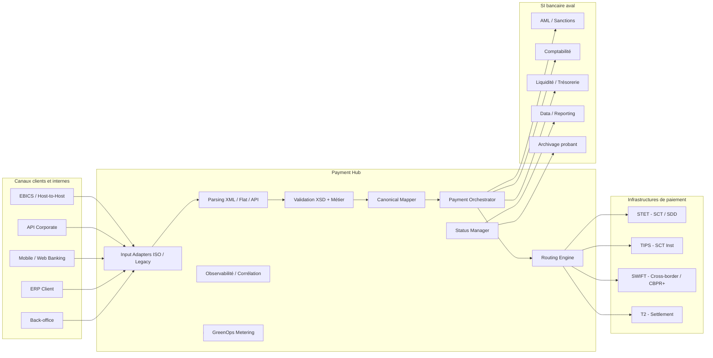

### Principes de positionnement

| Principe | Description | Impact architecture |
|---|---|---|
| ISO en entrée et sortie | Le hub accepte et émet des messages ISO | découplage des canaux et infrastructures |
| Canonique interne | Le hub ne doit pas propager le XML partout | réduction du couplage aux versions ISO |
| Validation par couches | XSD, règles scheme, règles banque, règles réglementaires | meilleure explicabilité des rejets |
| Corrélation bout-en-bout | identifiants propagés dans tous les logs et statuts | traçabilité SRE et métier |
| Mesure GreenOps native | coût CPU, réseau, logs et retry par message | pilotage gCO2e / transaction |

---

## 4. Typologie des messages ISO 20022

ISO 20022 organise les messages par familles fonctionnelles. Dans les paiements bancaires, les familles les plus importantes sont `pain`, `pacs` et `camt`.

### 4.1 Famille pain : client vers banque

Les messages `pain` sont utilisés entre un client et sa banque. Ils portent les instructions de paiement ou les retours de statut vers le client.

| Message | Sens | Usage | Exemple métier |
|---|---|---|---|
| `pain.001` | Client → Banque | Initiation de virement | Entreprise qui envoie un fichier de virements fournisseurs |
| `pain.008` | Client → Banque | Initiation de prélèvement | Créancier qui remet des prélèvements SEPA |
| `pain.002` | Banque → Client | Statut d’un ordre client | Rejet syntaxique, accepté, partiellement accepté |

### 4.2 Famille pacs : interbancaire

Les messages `pacs` sont utilisés dans la chaîne interbancaire, entre banques ou via infrastructures de compensation et de règlement.

| Message | Sens | Usage | Exemple métier |
|---|---|---|---|
| `pacs.008` | Banque → Banque | Credit Transfer | SCT ou cross-border MX |
| `pacs.003` | Banque créancier → Banque débiteur | Direct Debit | SDD Core / B2B |
| `pacs.004` | Banque → Banque | Return | retour de SCT ou SDD |
| `pacs.002` | Infrastructure/Banque → Banque | Payment Status Report | statut technique ou métier |
| `pacs.028` | Banque → Banque | Status Request | demande d’investigation sur statut |

### 4.3 Famille camt : reporting, cash management et relevés

Les messages `camt` sont utilisés pour informer le client ou les systèmes internes des mouvements, soldes et écritures.

| Message | Usage | Temporalité | Exemple |
|---|---|---|---|
| `camt.052` | Intraday account report | intra-journée | consultation de mouvements en cours |
| `camt.053` | Bank-to-customer statement | fin de journée | relevé de compte consolidé |
| `camt.054` | Debit/credit notification | événementiel | notification d’un paiement crédité ou débité |

### 4.4 Exemple : chaîne pain → pacs → camt

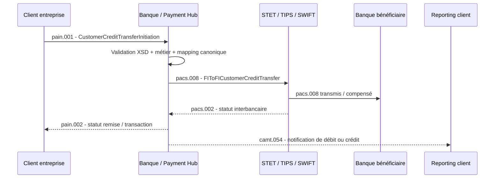

---

## 5. Cycle de vie complet d’un paiement ISO 20022

Un paiement ISO 20022 traverse plusieurs états depuis sa réception jusqu’à son règlement, son rejet ou sa restitution dans les reportings. Ce cycle de vie doit être explicite dans l’architecture, car il structure les statuts, les retries, les alertes, les preuves d’audit et les indicateurs GreenOps.

### Cycle de vie fonctionnel

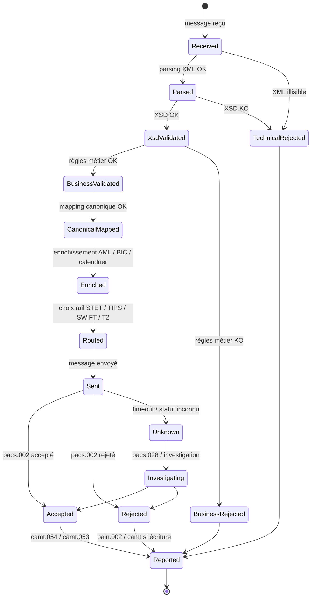

### Points de contrôle clés

| Étape | Contrôle attendu | Échec typique | Réponse architecturale |
|---|---|---|---|
| Réception | intégrité, taille, signature, canal | fichier tronqué | rejet technique explicite |
| Parsing | XML bien formé | balise mal fermée | erreur technique non retryable |
| XSD | conformité message | élément obligatoire absent | `pain.002` rejet syntaxique |
| Métier | IBAN, BIC, date, devise, cut-off | date invalide | rejet métier contextualisé |
| Canonique | mapping complet | champ non mappé | quarantaine / erreur mapping |
| Enrichissement | AML, sanctions, référentiels | screening indisponible | attente, circuit résilient |
| Routage | rail compatible | SCT Inst vers BIC non reachable | fallback ou rejet |
| Statut | pacs.002 / camt | timeout | investigation et anti-double émission |

---

## 6. Architecture de traitement ISO 20022

Une architecture ISO 20022 robuste s’appuie sur une chaîne de traitement segmentée. Chaque composant doit avoir une responsabilité claire, observable et testable.

### Architecture de traitement détaillée

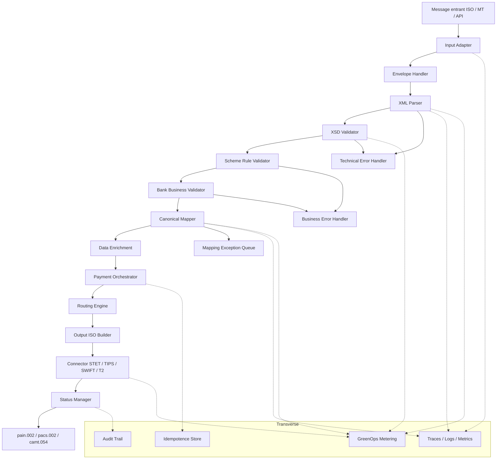

### 6.1 Parsing XML

Le parsing transforme un flux XML en représentation exploitable par l’application. En paiement bancaire, le parsing doit être :

- sécurisé contre les attaques XML, notamment entités externes et expansions abusives ;
- borné en taille et en profondeur ;
- instrumenté avec métriques de durée et d’échec ;
- adapté à la volumétrie : DOM pour petits messages, StAX/SAX pour gros fichiers ;
- compatible avec le besoin de rejet précis : ligne, champ, motif, message.

### 6.2 Validation XSD

La validation XSD vérifie la conformité structurelle ISO : présence des éléments obligatoires, types, cardinalités, formats de base. Elle ne suffit pas à valider un paiement bancaire. Un message peut être XSD valide mais métier invalide.

Exemple :

| Contrôle | XSD | Métier |
|---|---:|---:|
| `InstdAmt` est présent | Oui | Oui |
| devise autorisée pour le rail | Non | Oui |
| date d’exécution compatible cut-off | Non | Oui |
| IBAN syntaxiquement correct | Partiel | Oui |
| BIC reachable SCT Inst | Non | Oui |

### 6.3 Validation métier

La validation métier applique les règles de la banque, du scheme et des infrastructures :

- disponibilité du compte ;
- statut du mandat SDD ;
- cut-off ;
- calendrier TARGET ;
- devise ;
- montant maximum ;
- reachability SCT Inst ;
- règles STET ;
- règles SWIFT CBPR+ ;
- exigences AML / sanctions.

### 6.4 Mapping canonique

Le mapping canonique convertit un message ISO vers un modèle interne stable. Le modèle canonique évite de propager les versions ISO et les subtilités de chaque rail dans tout le SI.

Exemple simplifié :

| ISO 20022 | Canonique paiement | Commentaire |
|---|---|---|
| `GrpHdr/MsgId` | `paymentGroup.messageId` | identifiant remise |
| `PmtInf/PmtInfId` | `paymentBatch.batchId` | lot client |
| `CdtTrfTxInf/PmtId/EndToEndId` | `payment.endToEndId` | identifiant client |
| `CdtTrfTxInf/PmtId/TxId` | `payment.transactionId` | identifiant interbancaire |
| `CdtrAcct/Id/IBAN` | `creditor.account.iban` | compte bénéficiaire |
| `DbtrAcct/Id/IBAN` | `debtor.account.iban` | compte donneur d’ordre |

### 6.5 Enrichissement

L’enrichissement ajoute les informations nécessaires au traitement :

- BIC dérivé de l’IBAN ou d’un référentiel ;
- reachability du participant ;
- calendrier de règlement ;
- données AML ;
- données de tarification ;
- données de comptabilisation ;
- données de routage ;
- identifiants internes de corrélation.

### 6.6 Routage

Le routage décide du rail de paiement : STET, TIPS, SWIFT, T2 ou traitement interne. Cette décision doit être explicable et auditée.

Critères typiques :

| Critère | Influence |
|---|---|
| Type paiement | SCT, SDD, SCT Inst, cross-border |
| Montant | plafond SCT Inst, seuils internes |
| Devise | EUR SEPA, devises cross-border |
| Urgence | instantané vs batch |
| Reachability | participant SCT Inst reachable ou non |
| Canal | corporate, agence, mobile, API |
| Compliance | paiement bloqué ou libéré |
| Cut-off | traitement J ou J+1 |

---

## 7. Intégration avec les infrastructures

ISO 20022 s’intègre différemment selon les infrastructures. Les contraintes STET, TIPS, SWIFT et T2 ne sont pas identiques. L’architecture doit isoler ces spécificités dans des connecteurs et des profils de validation.

### Diagramme d’intégration STET / TIPS / SWIFT / T2

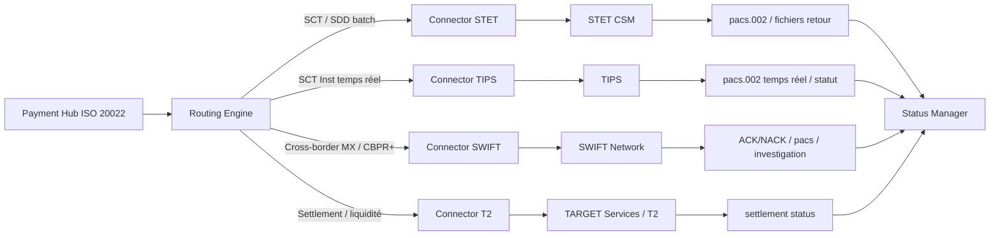

### 7.1 STET

STET intervient dans les paiements SEPA français et européens selon les flux SCT et SDD. L’intégration STET est souvent orientée fichier ou batch, avec des règles scheme spécifiques, des cycles de compensation, des cut-offs et des retours interbancaires.

| Flux | Message ISO typique | Contraintes clés |
|---|---|---|
| SCT | `pacs.008` | cut-off, compensation, retours `pacs.002`, returns |
| SDD | `pacs.003` | mandat, échéance, séquence, R-transactions |
| Return | `pacs.004` | motif de retour, délais réglementaires |
| Status | `pacs.002` | statut accepté/rejeté, motif, granularité transaction |

### 7.2 TIPS

TIPS supporte les paiements instantanés en euros. L’intégration SCT Inst nécessite une architecture basse latence, fortement observable, avec gestion précise du timeout et du statut inconnu.

Contraintes clés :

- traitement en secondes ;
- disponibilité élevée ;
- réponse rapide du bénéficiaire ;
- absence de double émission en cas de timeout ;
- corrélation forte entre instruction, émission, réponse et statut final ;
- investigation automatisée en cas d’état inconnu.

### 7.3 SWIFT

SWIFT intervient dans le cross-border et dans la coexistence MT / MX. L’architecture doit supporter les formats historiques MT, les messages MX ISO 20022, les règles CBPR+, la coexistence de mapping et l’intégration AML renforcée.

Cas typique : MT103 converti en `pacs.008`.

| Élément MT103 | Équivalent MX pacs.008 | Commentaire |
|---|---|---|
| `:20:` Transaction Reference | `GrpHdr/MsgId` ou `PmtId/InstrId` | dépend de la stratégie de mapping |
| `:23B:` Bank Operation Code | `PmtTpInf` | type d’opération |
| `:32A:` Value Date / Currency / Amount | `IntrBkSttlmDt`, `IntrBkSttlmAmt` | date, devise, montant |
| `:50K:` Ordering Customer | `Dbtr` | donneur d’ordre |
| `:59:` Beneficiary Customer | `Cdtr` | bénéficiaire |
| `:70:` Remittance Information | `RmtInf` | information remittance |
| `:71A:` Charges | `ChrgBr` | frais |

### 7.4 T2

T2 intervient sur la dimension settlement, liquidité et banque centrale. L’architecture doit distinguer le traitement métier du paiement et son règlement final.

Points d’attention :

- gestion de la liquidité ;
- cut-off TARGET ;
- disponibilité du règlement ;
- rapprochement comptable ;
- statut de règlement ;
- impact sur reporting et trésorerie.

---

## 8. Mapping MT → MX, legacy vers ISO 20022

Le mapping MT → MX est un sujet critique dans les banques qui migrent progressivement vers ISO 20022. Il ne s’agit pas d’une conversion mécanique champ à champ. Les formats MT sont plus compacts, parfois ambigus, tandis que les messages MX sont plus structurés et plus riches.

### Diagramme de mapping MT → MX

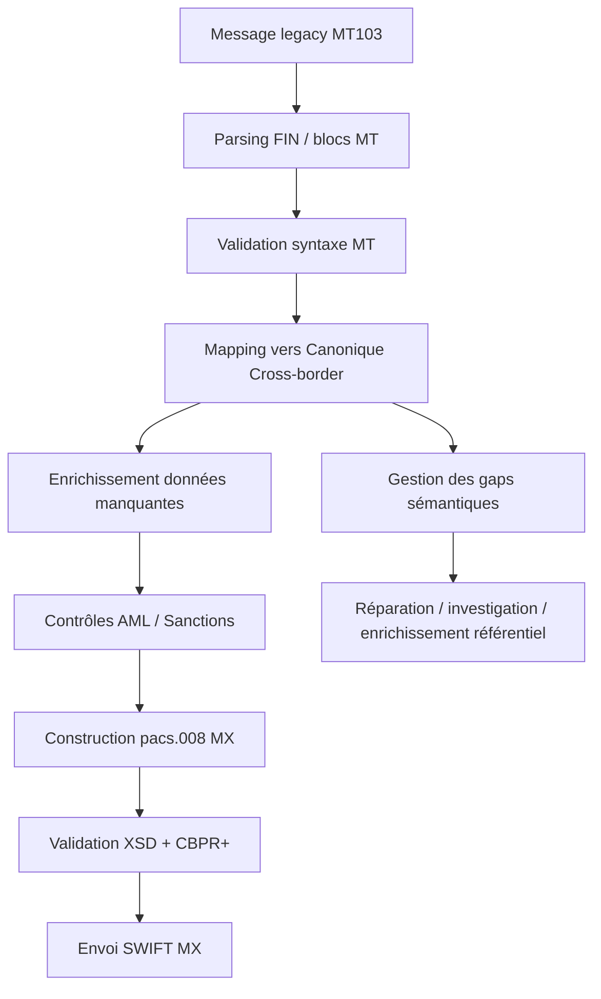

### Exemple : MT103 converti en pacs.008

#### MT103 simplifié

```text
:20:REF202604270001
:23B:CRED
:32A:260427EUR12500,00
:50K:/FR7612345678901234567890185
SOCIETE ALPHA SAS
PARIS FR
:59:/DE89370400440532013000
BETA GMBH
BERLIN DE
:70:FACTURE F2026-0427
:71A:SHA
```

#### Représentation pacs.008 simplifiée

```xml
<Document>
  <FIToFICstmrCdtTrf>
    <GrpHdr>
      <MsgId>REF202604270001</MsgId>
      <CreDtTm>2026-04-27T10:15:00</CreDtTm>
      <NbOfTxs>1</NbOfTxs>
    </GrpHdr>
    <CdtTrfTxInf>
      <PmtId>
        <InstrId>REF202604270001</InstrId>
        <EndToEndId>REF202604270001</EndToEndId>
      </PmtId>
      <IntrBkSttlmAmt Ccy="EUR">12500.00</IntrBkSttlmAmt>
      <IntrBkSttlmDt>2026-04-27</IntrBkSttlmDt>
      <ChrgBr>SHAR</ChrgBr>
      <Dbtr>
        <Nm>SOCIETE ALPHA SAS</Nm>
      </Dbtr>
      <DbtrAcct>
        <Id><IBAN>FR7612345678901234567890185</IBAN></Id>
      </DbtrAcct>
      <Cdtr>
        <Nm>BETA GMBH</Nm>
      </Cdtr>
      <CdtrAcct>
        <Id><IBAN>DE89370400440532013000</IBAN></Id>
      </CdtrAcct>
      <RmtInf>
        <Ustrd>FACTURE F2026-0427</Ustrd>
      </RmtInf>
    </CdtTrfTxInf>
  </FIToFICstmrCdtTrf>
</Document>
```

### Gaps fréquents MT → MX

| Problème | Cause | Risque | Réponse architecturale |
|---|---|---|---|
| Données non structurées | MT texte libre | rejet CBPR+ ou AML faible | enrichissement et structuration |
| Adresse incomplète | champ `50K` ou `59` pauvre | non-conformité | référentiel client + règles de réparation |
| Charges ambiguës | `71A` compact | erreur de frais | mapping contrôlé et table de correspondance |
| Référence unique absente | legacy ancien | corrélation faible | génération UETR / référence interne |
| Troncature | longueur MT limitée | perte d’information | politique de conservation et audit |

---

## 9. Modèle canonique vs ISO 20022

Le modèle canonique est une représentation interne stable, indépendante des versions ISO, des canaux d’entrée et des rails de sortie. Il ne remplace pas ISO 20022 ; il le complète.

### Pourquoi ne pas utiliser ISO comme modèle interne unique ?

Utiliser directement ISO 20022 partout dans le SI peut sembler séduisant, mais cela crée souvent un couplage excessif :

- tous les services deviennent dépendants des versions ISO ;
- les changements de scheme impactent de nombreux composants ;
- le XML circule inutilement entre microservices ;
- la logique métier est mélangée au format d’échange ;
- les coûts CPU et réseau augmentent ;
- les logs deviennent volumineux ;
- les tests deviennent plus lourds.

### Rôle du modèle canonique

| Fonction | Description |
|---|---|
| Découplage | sépare formats externes et logique interne |
| Stabilité | absorbe les changements de versions ISO |
| Performance | évite de transporter du XML partout |
| Observabilité | porte les identifiants métier normalisés |
| Routage | expose les attributs utiles aux décisions |
| GreenOps | permet une mesure homogène par unité fonctionnelle |

### Exemple de modèle canonique simplifié

```json
{
  "paymentId": "PAY-20260427-000001",
  "messageId": "MSG-20260427-001",
  "endToEndId": "E2E-CLIENT-9988",
  "transactionId": "TX-INT-7788",
  "uetr": "8f0a0d5b-1c9b-4a8e-8e2f-9d1a0f7c1234",
  "paymentType": "SCT",
  "rail": "STET",
  "amount": 12500.00,
  "currency": "EUR",
  "debtor": {
    "name": "SOCIETE ALPHA SAS",
    "iban": "FR7612345678901234567890185"
  },
  "creditor": {
    "name": "BETA GMBH",
    "iban": "DE89370400440532013000"
  },
  "status": "VALIDATED",
  "greenops": {
    "functionalUnit": "payment.transaction",
    "estimatedCpuMs": 18,
    "estimatedLogKb": 3.2
  }
}
```

### Positionnement idéal

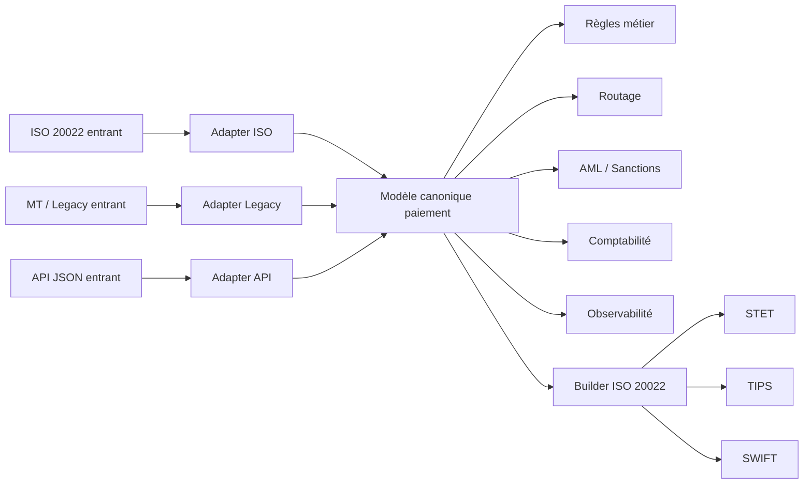

---

## 10. Gestion des versions ISO

La gestion des versions ISO est un enjeu majeur. Les messages évoluent : `pain.001.001.03`, `pain.001.001.09`, versions CBPR+, profils scheme, variantes locales. Une architecture fragile expose directement ces versions aux composants internes ; une architecture robuste les confine dans des adapters, validators et mappers.

### Exemple : pain.001 v3 vs v9

| Sujet | pain.001.001.03 | pain.001.001.09 | Impact |
|---|---|---|---|
| Richesse des données | plus limitée | plus riche | mapping enrichi |
| Adresse structurée | moins systématique | plus structurée | conformité AML améliorée |
| Données réglementaires | moins détaillées | plus détaillées | meilleure traçabilité |
| Compatibilité legacy | forte | dépend des canaux | besoin de coexistence |
| Taille message | plus faible | souvent plus élevée | coût XML supérieur |

### Stratégie de versioning recommandée

| Couche | Responsabilité version |
|---|---|
| Input Adapter | détecte version et namespace |
| XSD Validator | applique XSD correspondant |
| Scheme Validator | applique profil STET / TIPS / SWIFT |
| Canonical Mapper | mappe vers un modèle stable |
| Output Builder | reconstruit la version attendue par le rail |
| Test Factory | rejoue des jeux de tests par version |
| Observabilité | mesure erreurs par version |

### Règles d’architecture

1. Ne jamais mélanger plusieurs versions ISO dans le cœur métier sans couche d’abstraction.
2. Versionner les mappers et les XSD ensemble.
3. Maintenir des jeux de tests par version et par rail.
4. Tracer la version ISO dans les logs structurés.
5. Mesurer le taux d’erreur par version.
6. Mesurer le coût CPU par version, car les versions plus riches peuvent augmenter le parsing cost.
7. Définir une politique de décommissionnement des anciennes versions.

---

## 11. Gestion des erreurs ISO

Les erreurs ISO doivent être classifiées. Une erreur XML mal formée, une erreur XSD, une erreur de règle scheme, une erreur AML, un timeout TIPS ou un rejet interbancaire ne se traitent pas de la même manière.

### Typologie des erreurs

| Type erreur | Exemple | Retry ? | Message retour |
|---|---|---:|---|
| Parsing | XML illisible | Non | rejet technique |
| XSD | champ obligatoire absent | Non | `pain.002` rejet |
| Scheme | règle STET non respectée | Non | `pain.002` ou rejet canal |
| Métier | compte fermé | Non | `pain.002` rejet métier |
| AML | paiement sous revue | Pas automatique | statut pending / investigation |
| Connectivité | STET indisponible temporairement | Oui contrôlé | statut pending |
| Timeout SCT Inst | pas de réponse dans le délai | Investigation | statut inconnu |
| Rejet interbancaire | `pacs.002 RJCT` | Non | statut rejeté |

### Architecture d’erreur

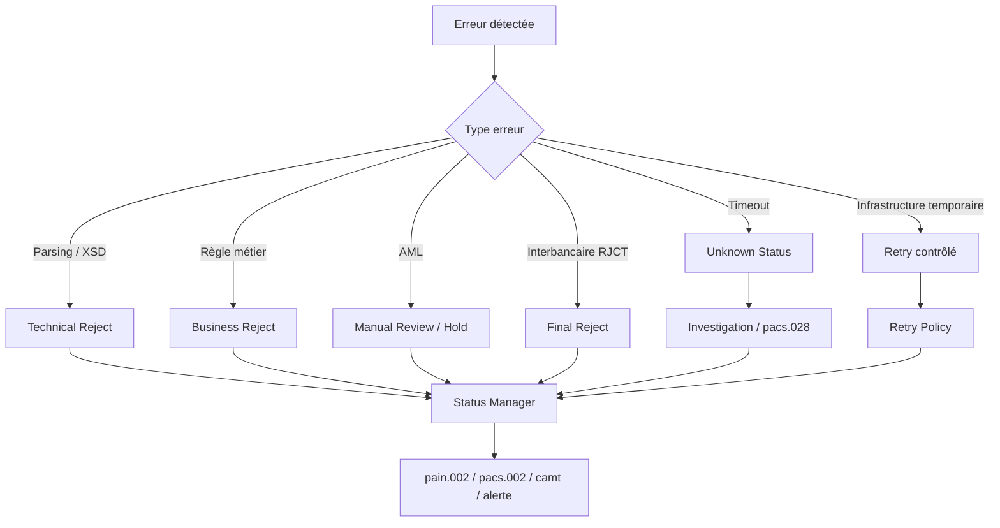

### Bonnes pratiques de gestion d’erreur

- Chaque rejet doit être compréhensible par le métier.
- Chaque retry doit être justifié par un motif technique retryable.
- Chaque timeout SCT Inst doit produire un statut intermédiaire maîtrisé.
- Chaque erreur doit porter les identifiants de corrélation.
- Les erreurs de mapping doivent être isolées dans une file de réparation, jamais perdues.
- Les logs XML complets doivent être limités, masqués et échantillonnés.
- Les erreurs doivent alimenter les KPI SRE et GreenOps.

---

## 12. Gestion des statuts

La gestion des statuts est centrale dans une architecture ISO 20022. Elle relie le monde client, le Payment Hub, les infrastructures et les systèmes de reporting.

### Messages de statut principaux

| Message | Sens | Usage |
|---|---|---|
| `pain.002` | Banque → Client | statut d’une remise ou instruction client |
| `pacs.002` | Infrastructure/Banque → Banque | statut interbancaire |
| `camt.054` | Banque → Client ou interne | notification d’écriture débit/crédit |
| `camt.053` | Banque → Client | relevé de compte fin de journée |
| `camt.052` | Banque → Client | reporting intraday |

### Flux pain.001 → pacs.008 → pacs.002 → camt.054

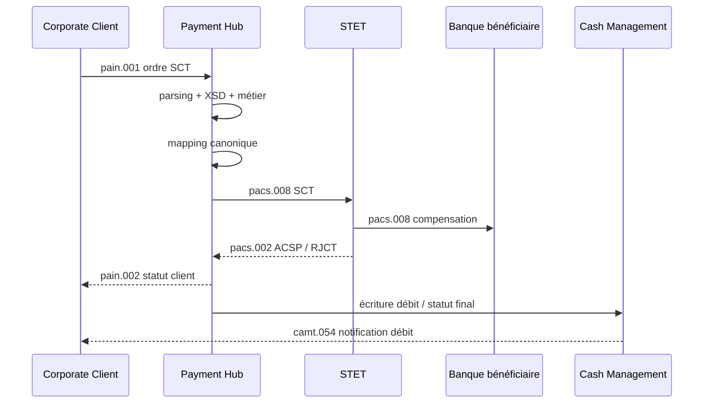

### Exemple : camt.054 généré depuis statut paiement

Un `camt.054` peut être généré lorsqu’un paiement accepté produit une écriture comptable client.

| Source statut | Condition | Sortie camt |
|---|---|---|
| `pacs.002 ACSP` | paiement accepté par infrastructure | notification en attente de comptabilisation |
| settlement confirmé | écriture débit/crédit passée | `camt.054` final |
| rejet avant compta | pas d’écriture | pas de `camt.054`, mais `pain.002 RJCT` |
| retour `pacs.004` | écriture de retour | `camt.054` de crédit ou débit correctif |

### camt.053 vs camt.054

| Critère | camt.053 | camt.054 |
|---|---|---|
| Nature | relevé de compte | notification débit/crédit |
| Temporalité | périodique, souvent fin de journée | événementielle ou quasi temps réel |
| Usage | rapprochement comptable global | information immédiate d’un mouvement |
| Granularité | mouvements consolidés | mouvement spécifique |
| Exemple | relevé journalier entreprise | notification d’un SCT reçu |

---

## 13. Gestion des identifiants

Les identifiants sont le socle de la corrélation, de l’idempotence, de l’audit et du support N3. Une architecture ISO 20022 faible perd les identifiants ou les recrée sans stratégie ; une architecture mature les propage de bout en bout.

### Identifiants clés

| Identifiant | Origine | Portée | Usage |
|---|---|---|---|
| `MessageId` | groupe message | message / fichier | traçabilité remise |
| `PaymentInformationId` | lot client | lot | regroupement d’instructions |
| `InstructionId` | instruction | banque / client | suivi opérationnel |
| `EndToEndId` | client | bout-en-bout | référence client obligatoire à conserver |
| `TxId` | interbancaire | transaction interbancaire | suivi clearing |
| `UETR` | cross-border | global | traçabilité SWIFT gpi / cross-border |
| `InternalPaymentId` | Payment Hub | interne | idempotence et audit |
| `CorrelationId` | plateforme | technique transverse | logs, traces, métriques |

### Chaîne de corrélation recommandée

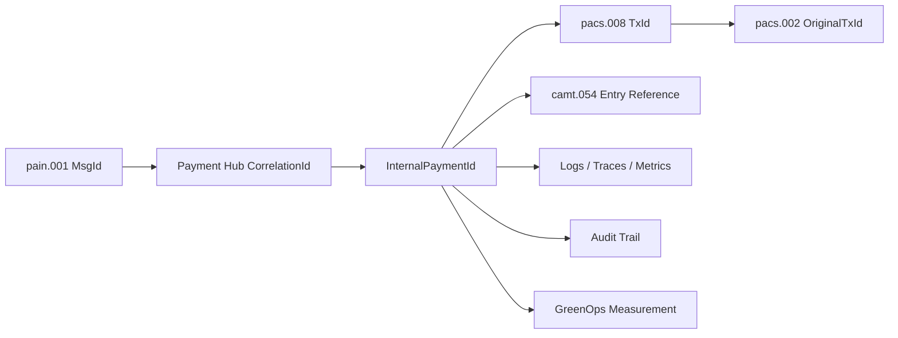

### Règles pratiques

1. Conserver l’`EndToEndId` client sans le réécrire arbitrairement.
2. Générer un identifiant interne stable au premier point d’entrée.
3. Relier tous les messages sortants à l’identifiant interne.
4. Stocker les identifiants dans une table de corrélation indexée.
5. Propager le `CorrelationId` dans logs, traces et métriques.
6. Pour cross-border, gérer l’UETR comme identifiant majeur d’investigation.
7. Ne jamais se reposer uniquement sur le contenu XML pour retrouver une transaction.

---

## 14. Performance du parsing XML

Le parsing XML est un poste de coût important dans ISO 20022. Les messages MX sont plus volumineux et plus structurés que les formats legacy. La performance dépend de la taille du message, du parseur, de la stratégie de validation, du nombre de transformations et du niveau de logging.

### DOM vs SAX vs StAX

| Stratégie | Principe | Avantages | Limites | Usage recommandé |
|---|---|---|---|---|
| DOM | charge tout le document en mémoire | simple à manipuler | mémoire élevée | petits messages, outils internes |
| SAX | lecture événementielle push | très efficace mémoire | programmation plus complexe | gros fichiers, parsing rapide |
| StAX | lecture streaming pull | bon compromis contrôle/perf | nécessite design rigoureux | gros volumes bancaires |

### Points de consommation CPU

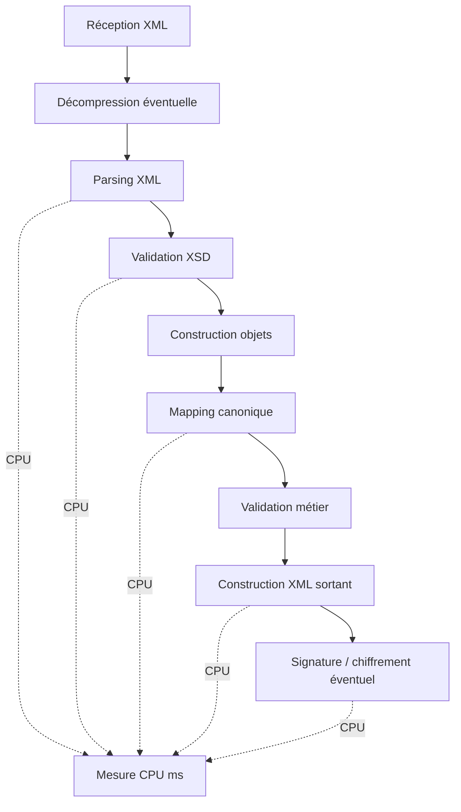

### Indicateurs à mesurer

| KPI | Définition | Usage |
|---|---|---|
| `xml_parse_duration_ms` | durée parsing par message | détection lenteur XML |
| `xsd_validation_duration_ms` | durée validation XSD | coût conformité |
| `canonical_mapping_duration_ms` | durée mapping | optimisation mapper |
| `message_size_kb` | taille message | corrélation CPU / réseau |
| `transactions_per_file` | nombre transactions par fichier | capacité batch |
| `cpu_ms_per_transaction` | CPU par transaction | GreenOps et capacity planning |
| `rejected_messages_rate` | taux de rejet | qualité amont |

---

## 15. Impact du XML sur CPU et réseau

ISO 20022 est expressif mais verbeux. Le XML augmente la taille réseau, le coût de parsing, le coût de validation et le volume potentiel de logs. Cet impact est acceptable si l’architecture est conçue pour l’absorber ; il devient problématique si le XML est recopié partout sans stratégie.

### Coût réseau

| Format | Taille relative | Commentaire |
|---|---:|---|
| MT103 | faible | format compact mais peu structuré |
| XML MX non compressé | élevée | balises répétées, structure riche |
| XML compressé | moyenne | utile pour batch, moins pour temps réel |
| Canonique JSON interne | variable | plus léger si maîtrisé |
| Objet interne binaire | faible | utile dans certains pipelines internes |

### Exemple chiffré illustratif

| Flux | Volume quotidien | Taille moyenne | Données transférées |
|---|---:|---:|---:|
| MT legacy | 1 000 000 messages | 2 Ko | 2 Go |
| MX ISO | 1 000 000 messages | 10 Ko | 10 Go |
| MX avec logs complets x3 | 1 000 000 messages | 30 Ko loggés | 30 Go logs |

Le risque n’est pas seulement le réseau. Les logs complets de messages XML peuvent multiplier le volume stocké, augmenter le coût ELK/Splunk/Loki, ralentir les recherches, créer des risques de données sensibles et augmenter l’empreinte carbone de stockage.

### Règle d’architecture

> ISO 20022 doit être accepté et produit par les frontières du SI, mais le cœur du traitement doit éviter la propagation systématique du XML complet.

---

## 16. Optimisations techniques

Les optimisations ISO 20022 doivent préserver la conformité tout en réduisant latence, CPU, mémoire, réseau et logs.

### 16.1 Streaming avec StAX

StAX permet de lire le XML en streaming sans charger tout le document en mémoire. C’est adapté aux fichiers `pain.001` ou `pain.008` contenant de nombreuses transactions.

Bonnes pratiques :

- parser le header puis les transactions une par une ;
- valider tôt les éléments bloquants ;
- éviter de construire un énorme objet DOM ;
- produire des erreurs localisées par transaction ;
- mesurer CPU et mémoire par fichier ;
- isoler les transactions invalides si la règle métier autorise le partiel.

### 16.2 Validation anticipée

La validation anticipée consiste à rejeter vite les messages manifestement invalides : taille, namespace, version, signature, structure minimale, canal autorisé, client connu.

| Contrôle anticipé | Gain |
|---|---|
| taille maximale | évite parsing inutile |
| namespace/version | évite mauvais XSD |
| signature/certificat | évite traitement non autorisé |
| client/canal | évite mapping inutile |
| doublon MessageId | évite retraitement complet |

### 16.3 Réduction des mappings

Les mappings sont coûteux à maintenir et à exécuter. Une architecture mature limite les conversions inutiles.

Anti-pattern :

```text
pain.001 XML → objet A → XML interne → objet B → JSON → objet C → pacs.008 XML
```

Approche recommandée :

```text
pain.001 XML → modèle canonique → pacs.008 XML
```

### 16.4 Cache référentiel

Les validations ISO dépendent de référentiels : BIC, reachability, calendriers, pays, devises, clients, mandats. Les appels synchrones répétés vers les référentiels augmentent la latence et le risque d’indisponibilité.

Stratégie :

- cache local avec TTL ;
- invalidation maîtrisée ;
- fallback en lecture seule ;
- métriques de hit ratio ;
- traçabilité des versions de référentiel.

### 16.5 Logs structurés et masqués

Les logs doivent porter les identifiants et statuts, pas forcément le XML complet.

Exemple de log recommandé :

```json
{
  "event": "payment.iso.validation.completed",
  "correlationId": "CORR-20260427-0001",
  "messageId": "MSG-20260427-001",
  "endToEndId": "E2E-9988",
  "isoMessage": "pain.001.001.09",
  "rail": "STET",
  "status": "ACCEPTED",
  "parseDurationMs": 12,
  "xsdDurationMs": 8,
  "mappingDurationMs": 5,
  "messageSizeKb": 14.6
}
```

---

## 17. Impact GreenOps d’ISO 20022

L’impact GreenOps d’ISO 20022 provient principalement de quatre postes : parsing, validation, mapping, retries/logs. L’objectif n’est pas de remettre en cause ISO 20022, mais d’industrialiser sa mesure et son optimisation.

### Où se consomme l’énergie

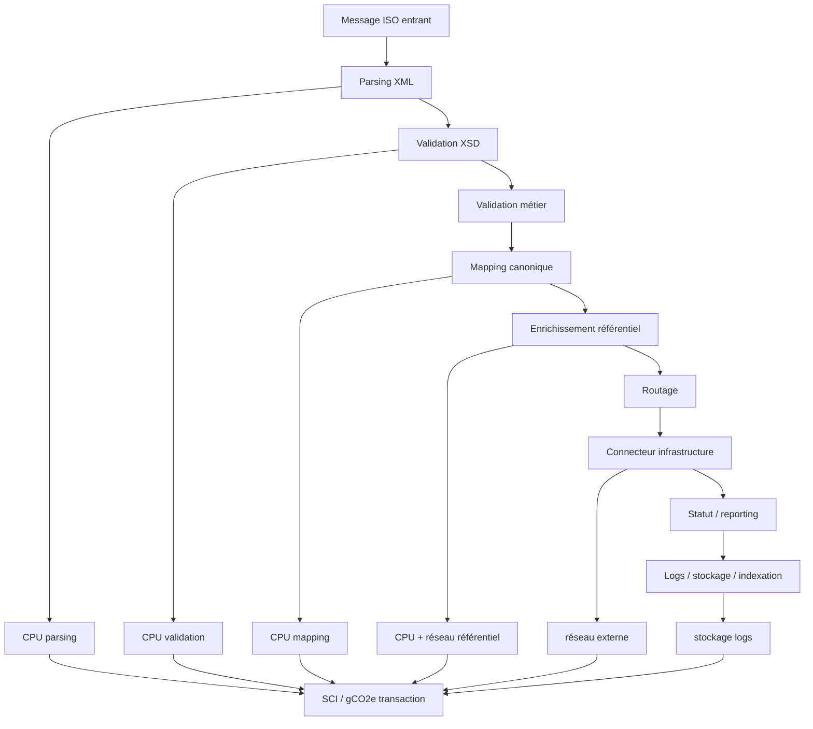

### Modèle SCI appliqué au paiement ISO

Forme simplifiée :

```text
SCI = ((E × I) + M) / R
```

Où :

| Variable | Signification dans le Payment Hub |
|---|---|
| `E` | énergie consommée par parsing, validation, mapping, routage, logs |
| `I` | intensité carbone de l’électricité utilisée |
| `M` | part carbone matériel amortie |
| `R` | unité fonctionnelle, par exemple 1 paiement traité |

### Exemple de calcul gCO2e / transaction

Hypothèses illustratives :

| Paramètre | Valeur |
|---|---:|
| CPU moyen par transaction ISO | 25 ms CPU |
| Énergie estimée pour 1 000 000 transactions | 2,8 kWh |
| Intensité carbone | 55 gCO2e / kWh |
| Part matériel allouée | 20 gCO2e / million transactions |

Calcul :

```text
Carbone énergie = 2,8 × 55 = 154 gCO2e
Carbone total = 154 + 20 = 174 gCO2e / 1 000 000 transactions
gCO2e / transaction = 174 / 1 000 000 = 0,000174 gCO2e
```

L’intérêt du calcul est moins la valeur absolue que la comparaison entre versions, canaux et scénarios :

| Scénario | Effet GreenOps |
|---|---|
| rejet tardif après mapping | CPU gaspillé |
| retry non contrôlé | multiplication du coût |
| logs XML complets | stockage et indexation élevés |
| DOM sur gros fichiers | mémoire et GC élevés |
| StAX + validation anticipée | réduction CPU/mémoire |

### Retry cost

Un paiement rejeté tôt coûte moins cher qu’un paiement rejeté tard. Un paiement retrié trois fois peut consommer quatre traitements complets pour une seule unité fonctionnelle métier.

```text
Coût total transaction = coût initial + somme(coûts retries) + coût investigation + coût logs
```

Exemple :

| Cas | Traitements | Coût relatif |
|---|---:|---:|
| paiement accepté du premier coup | 1 | 1x |
| rejet XSD immédiat | 0,3 | 0,3x |
| timeout + 2 retries + investigation | 3,5 | 3,5x |
| erreur mapping après enrichissement | 0,8 | 0,8x |

---

## 18. Comparaison MT vs MX, coût réel

La comparaison MT vs MX ne doit pas se limiter à la taille des messages. MT est compact mais moins structuré, ce qui transfère une partie du coût vers les opérations manuelles, la réparation, la conformité et l’investigation. MX est plus lourd techniquement, mais plus exploitable automatiquement.

### Comparaison détaillée

| Critère | MT legacy | MX ISO 20022 | Lecture architecte |
|---|---|---|---|
| Taille message | faible | élevée | MX coûte plus en réseau/parsing |
| Structure | faible à moyenne | forte | MX réduit ambiguïtés |
| Automatisation | limitée | forte | MX favorise STP |
| AML | plus difficile | plus riche | MX améliore screening |
| Mapping | historique | standardisé mais complexe | coexistence nécessaire |
| Logs | compacts | volumineux si XML complet | logs structurés nécessaires |
| Investigation | parfois manuelle | meilleure corrélation | UETR et identifiants utiles |
| Coût CPU | faible | plus élevé | optimisation parsing nécessaire |
| Coût opérationnel | potentiellement élevé | réduit si bien conçu | arbitrage global |

### Vision coût complet

```text
Coût réel = coût technique + coût opérationnel + coût risque + coût conformité + coût carbone
```

Un message MT peut coûter peu en CPU mais cher en réparation manuelle. Un message MX peut coûter plus cher en CPU mais réduire le risque opérationnel et améliorer le taux de STP.

### Indicateurs à comparer

| Indicateur | Objectif |
|---|---|
| taux STP | mesurer automatisation réelle |
| coût CPU / transaction | mesurer impact technique |
| taux réparation manuelle | mesurer coût opérationnel |
| taux rejet | mesurer qualité amont |
| délai investigation | mesurer efficacité support |
| volume logs / transaction | mesurer coût observabilité |
| gCO2e / transaction | mesurer GreenOps |

---

## 19. Anti-patterns ISO 20022

### Anti-pattern 1 : propager le XML partout

Faire circuler le XML complet dans tous les microservices augmente le couplage, la latence, le coût réseau et le volume de logs.

Approche correcte : convertir tôt vers un modèle canonique et conserver le XML original dans un stockage probant si nécessaire.

### Anti-pattern 2 : confondre validation XSD et validation métier

Un message XSD valide peut être non conforme au scheme, au cut-off, au mandat, au plafond ou aux règles AML.

Approche correcte : organiser les validations par couches et produire des motifs de rejet précis.

### Anti-pattern 3 : mapper champ à champ sans modèle cible

Un mapping direct `pain → pacs` sans modèle canonique devient fragile dès que les versions évoluent ou que plusieurs rails coexistent.

Approche correcte : utiliser un modèle canonique stable et des builders de sortie par rail.

### Anti-pattern 4 : logs XML complets systématiques

Logger tous les messages XML complets expose des données sensibles, augmente les coûts de stockage et dégrade l’empreinte carbone.

Approche correcte : logs structurés, masquage, échantillonnage et archivage séparé.

### Anti-pattern 5 : retry aveugle

Retrier une erreur non retryable comme une erreur XSD ou un rejet métier gaspille des ressources et crée du bruit.

Approche correcte : classification retryable / non retryable / investigation.

### Anti-pattern 6 : absence de gestion du statut inconnu SCT Inst

En instant payment, un timeout ne signifie pas nécessairement un échec. Réémettre peut produire un double paiement.

Approche correcte : état `UNKNOWN`, investigation, pacs.028 si applicable, verrou d’idempotence.

### Anti-pattern 7 : version ISO codée en dur

Coder une version spécifique dans toute la chaîne empêche les migrations progressives.

Approche correcte : registry de versions, adapters versionnés, tests de non-régression.

### Anti-pattern 8 : absence de métriques GreenOps

Sans métriques CPU, taille message, retries et logs, le GreenOps reste déclaratif.

Approche correcte : mesurer `cpu_ms_per_transaction`, `message_size_kb`, `log_kb_per_transaction`, `retry_count`, `gCO2e_per_transaction`.

---

## 20. Bonnes pratiques architecture ISO

### 20.1 Principes structurants

| Principe | Application concrète |
|---|---|
| Découpler format et métier | adapter ISO vers canonique |
| Valider par couches | XML, XSD, scheme, métier, conformité |
| Router explicitement | décision de rail auditée |
| Corréler de bout en bout | MessageId, EndToEndId, TxId, UETR, CorrelationId |
| Gérer l’idempotence | clé fonctionnelle + statut + verrou |
| Observer nativement | traces, logs structurés, métriques métier |
| Mesurer l’impact carbone | SCI par transaction et par rail |
| Limiter les retries | politique basée sur classification d’erreur |
| Versionner les mappings | XSD + mapper + tests ensemble |
| Sécuriser XML | désactiver XXE, limiter profondeur et taille |

### 20.2 Architecture cible recommandée

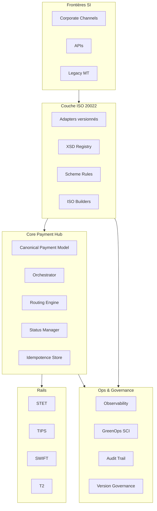

### 20.3 SRE et observabilité

Une architecture ISO 20022 de niveau banque doit être opérable en production. Les métriques techniques seules ne suffisent pas ; il faut des métriques métier.

| Catégorie | Métrique |
|---|---|
| Technique | latence parsing, CPU, mémoire, erreurs XML |
| Métier | paiements reçus, acceptés, rejetés, en attente |
| Rail | latence STET, TIPS, SWIFT, taux timeout |
| Statut | statuts inconnus, durée investigation |
| GreenOps | gCO2e / transaction, log KB / transaction |
| Qualité | taux STP, taux réparation, taux rejet par canal |

### 20.4 SLO typiques

| Flux | SLO exemple |
|---|---|
| SCT batch | 99 % des fichiers validés avant cut-off |
| SDD | 99 % des remises traitées dans la fenêtre scheme |
| SCT Inst | 99,9 % des réponses dans la fenêtre temps réel cible |
| Cross-border | 95 % STP sans réparation manuelle |
| Statuts | 99 % des statuts réconciliés sans intervention |

---

## 21. Questions d’audit ISO 20022

Cette section fournit une grille d’audit utilisable en entretien, cadrage ou revue d’architecture.

### 21.1 Architecture générale

| Question | Ce que l’on cherche à vérifier |
|---|---|
| Où ISO 20022 est-il transformé en modèle interne ? | présence d’un découplage canonique |
| Le XML circule-t-il dans tout le SI ? | risque de couplage et de coût |
| Les versions ISO sont-elles confinées ? | maintenabilité |
| Existe-t-il des adapters par canal et par rail ? | séparation des responsabilités |
| Les règles STET/TIPS/SWIFT sont-elles isolées ? | évolutivité |

### 21.2 Validation et mapping

| Question | Critère de maturité |
|---|---|
| Les validations sont-elles séparées entre XSD, scheme et métier ? | motifs de rejet clairs |
| Les mappings sont-ils versionnés ? | reproductibilité |
| Les jeux de tests couvrent-ils pain.001, pain.008, pacs.008, pacs.003 ? | qualité |
| Le mapping MT → MX gère-t-il les gaps sémantiques ? | robustesse migration |
| Les erreurs de mapping sont-elles réparables ? | exploitabilité |

### 21.3 Statuts et corrélation

| Question | Critère de maturité |
|---|---|
| L’EndToEndId est-il conservé ? | traçabilité client |
| Le TxId est-il propagé dans les retours ? | suivi interbancaire |
| L’UETR est-il géré pour cross-border ? | investigation SWIFT |
| Les statuts inconnus sont-ils modélisés ? | sécurité SCT Inst |
| Les camt sont-ils générés depuis un état fiable ? | reporting correct |

### 21.4 Performance et résilience

| Question | Critère de maturité |
|---|---|
| Quel parseur XML est utilisé pour les gros fichiers ? | StAX/SAX attendu |
| Les messages sont-ils rejetés tôt ? | réduction CPU |
| Les retries sont-ils classifiés ? | réduction bruit et double traitement |
| Existe-t-il un idempotence store ? | anti-doublon |
| Les connecteurs STET/TIPS/SWIFT sont-ils isolés ? | résilience |

### 21.5 GreenOps

| Question | Critère de maturité |
|---|---|
| Mesure-t-on le CPU par transaction ISO ? | base SCI |
| Mesure-t-on le coût des retries ? | optimisation réelle |
| Mesure-t-on le volume logs par transaction ? | réduction stockage |
| Les gros XML sont-ils compressés ou streamés ? | sobriété technique |
| Le gCO2e / transaction est-il suivi par rail ? | pilotage GreenOps |

---

## 22. Synthèse architecte

ISO 20022 est un standard structurant pour les paiements bancaires, mais son adoption réussie dépend de l’architecture mise autour du standard. Dans un SI bancaire de type BPCE / Natixis, ISO 20022 doit être intégré comme une capacité transverse : réception, validation, mapping, orchestration, routage, statuts, reporting, observabilité et mesure carbone.

Le Payment Hub joue le rôle de cœur d’architecture. Il ne doit pas être réduit à une usine de conversion XML. Il doit orchestrer les paiements, appliquer les règles, isoler les infrastructures, gérer les statuts et produire des preuves d’audit. Le modèle canonique est la pièce de découplage essentielle entre les formats ISO, les formats legacy, les APIs internes et les rails STET, TIPS, SWIFT et T2.

Les messages `pain`, `pacs` et `camt` structurent le cycle de vie complet : initiation client, échange interbancaire, statut, notification et relevé. Les cas SCT, SDD, SCT Inst et cross-border ont chacun leurs contraintes. Le SCT batch exige robustesse et cut-off ; le SDD exige gestion des mandats et R-transactions ; le SCT Inst exige basse latence, idempotence et gestion du statut inconnu ; le cross-border exige mapping MT/MX, UETR, AML et conformité SWIFT.

La performance ISO 20022 doit être traitée comme un sujet d’architecture. Le XML augmente le coût CPU, réseau, mémoire et logs. Les bonnes pratiques consistent à parser en streaming, valider tôt, limiter les mappings, éviter la propagation du XML complet, structurer les logs et mesurer les coûts par transaction.

La dimension GreenOps rend cette architecture plus moderne et plus défendable. Un paiement ISO 20022 n’est pas seulement une transaction métier ; c’est aussi une unité fonctionnelle mesurable. En appliquant le modèle SCI, la banque peut suivre le gCO2e par transaction, comparer les rails, réduire les retries, optimiser les logs et démontrer une trajectoire de réduction d’impact.

### Message clé d’entretien

> Une architecture ISO 20022 bancaire crédible repose sur quatre piliers : un Payment Hub découplé par modèle canonique, une validation multi-couches, une observabilité métier/SRE bout-en-bout, et une mesure GreenOps par transaction. La réussite ne vient pas du XML lui-même, mais de la capacité à industrialiser son traitement à grande échelle, avec résilience, traçabilité, performance et sobriété.

### Checklist finale

| Domaine | Décision cible |
|---|---|
| Format externe | ISO 20022 aux frontières SI |
| Modèle interne | Canonique paiement stable |
| Validation | XML + XSD + scheme + métier + AML |
| Routage | STET, TIPS, SWIFT, T2 via connecteurs isolés |
| Statuts | pain.002, pacs.002, camt.054, camt.053 |
| Identifiants | MessageId, EndToEndId, TxId, UETR, CorrelationId |
| Résilience | idempotence, retry contrôlé, statut inconnu |
| Performance | StAX, rejet anticipé, réduction mappings |
| Observabilité | métriques métier, traces, logs structurés |
| GreenOps | SCI, CPU/message, logs/message, gCO2e/transaction |

---

## Annexes opérationnelles

### A. Exemple complet SCT : pain.001 → pacs.008 → pacs.002 → camt.054

| Étape | Message | Acteur | Résultat |
|---|---|---|---|
| 1 | `pain.001` | Client → Banque | ordre reçu |
| 2 | validation | Payment Hub | ordre accepté ou rejeté |
| 3 | canonique | Payment Hub | paiement normalisé |
| 4 | `pacs.008` | Banque → STET | paiement interbancaire émis |
| 5 | `pacs.002` | STET → Banque | statut reçu |
| 6 | `pain.002` | Banque → Client | statut client transmis |
| 7 | `camt.054` | Banque → Client | notification débit/crédit |

### B. Exemple complet SDD : pain.008 → pacs.003 → pacs.004

| Étape | Message | Contrôle spécifique |
|---|---|---|
| Initiation | `pain.008` | mandat, séquence, créancier |
| Validation | interne | date d’échéance, IBAN, scheme |
| Interbancaire | `pacs.003` | présentation prélèvement |
| Retour | `pacs.004` | rejet/return/refund selon motif |
| Reporting | `pain.002` / `camt` | statut client et écriture |

### C. Exemple SCT Inst avec timeout

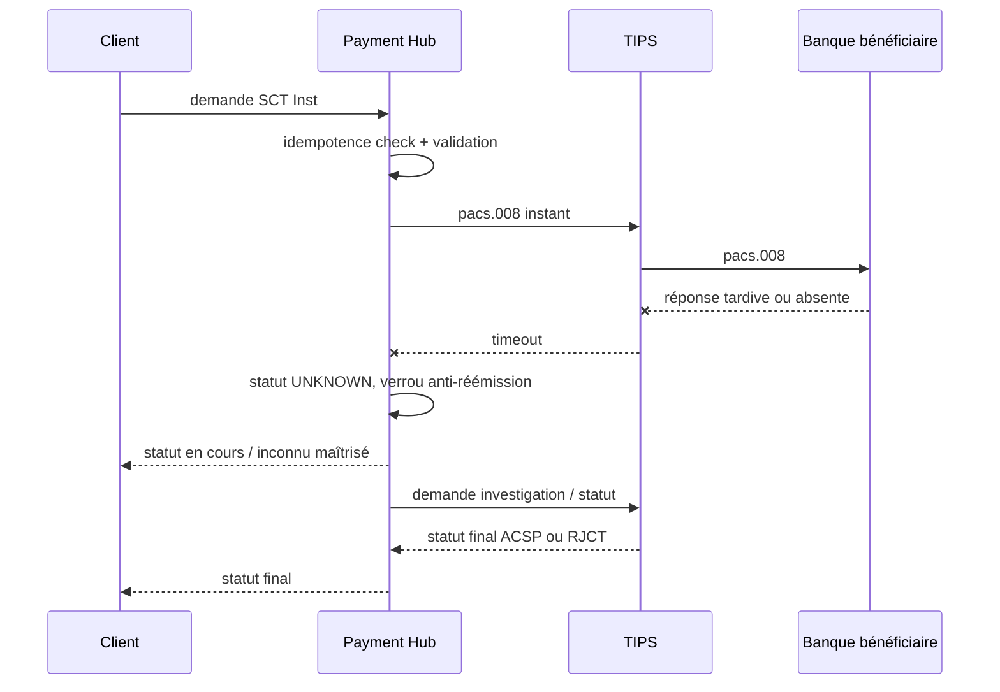

Points d’architecture :

- ne jamais réémettre automatiquement un SCT Inst sur simple timeout ;
- créer un état métier `UNKNOWN` ;
- bloquer les doublons par idempotence ;
- déclencher investigation ou demande de statut ;
- informer le canal client avec un statut maîtrisé.

### D. Exemple cross-border avec AML/SWIFT

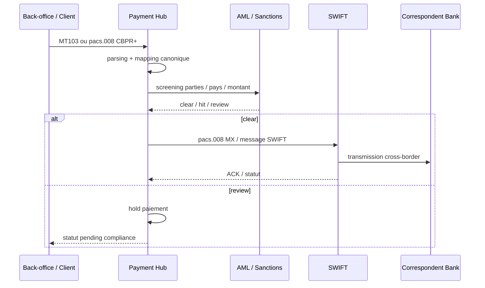

### E. KPI de pilotage ISO 20022

| KPI | Cible indicative | Usage |
|---|---:|---|
| Taux STP SCT | > 98 % | qualité de traitement |
| Taux STP cross-border | > 90-95 % selon périmètre | efficacité AML/mapping |
| Taux rejet XSD | < 0,5 % | qualité canaux |
| Timeout SCT Inst | minimal | résilience temps réel |
| Statuts inconnus > 5 min | 0 ou proche 0 | risque opérationnel |
| CPU ms / transaction ISO | suivi tendance | performance/GreenOps |
| Log KB / transaction | plafond défini | coût observabilité |
| gCO2e / transaction | tendance baissière | trajectoire GreenOps |

