# 05_ARCHITECTURE_SI_04_event_driven — Architecture Event-Driven pour les flux de paiements bancaires

**Projet :** `greenops-it-flux-architecture`  
**Domaine :** Architecture SI — paiements bancaires, ISO 20022, Kafka/Event Streaming, SRE, GreenOps  
**Niveau cible :** Architecte solution senior banque / paiements / Kafka / SRE / GreenOps  
**Positionnement :** complément du socle Paiements, ISO 20022, GreenOps, Payment Hub et architecture ISO 20022.

---

## Table des matières

1. [Objectif du document](#1-objectif-du-document)
2. [Limites des architectures batch et synchrones](#2-limites-des-architectures-batch-et-synchrones)
3. [Pourquoi passer à l’event-driven dans les paiements](#3-pourquoi-passer-à-levent-driven-dans-les-paiements)
4. [Principes de l’architecture événementielle EDA](#4-principes-de-larchitecture-événementielle-eda)
5. [Concepts clés](#5-concepts-clés)
6. [Architecture globale EDA paiement](#6-architecture-globale-eda-paiement)
7. [Intégration du Payment Hub avec Kafka](#7-intégration-du-payment-hub-avec-kafka)
8. [Modèle événementiel d’un paiement](#8-modèle-événementiel-dun-paiement)
9. [Flux SCT en mode événementiel](#9-flux-sct-en-mode-événementiel)
10. [Flux SDD en mode événementiel](#10-flux-sdd-en-mode-événementiel)
11. [Flux SCT Inst en mode événementiel](#11-flux-sct-inst-en-mode-événementiel)
12. [Flux cross-border en mode événementiel](#12-flux-cross-border-en-mode-événementiel)
13. [Flux cash management en mode événementiel](#13-flux-cash-management-en-mode-événementiel)
14. [Intégration ISO 20022 dans les events](#14-intégration-iso-20022-dans-les-events)
15. [Event vs message ISO](#15-event-vs-message-iso)
16. [Event sourcing vs orchestration](#16-event-sourcing-vs-orchestration)
17. [Gestion des statuts en EDA](#17-gestion-des-statuts-en-eda)
18. [Idempotence en event-driven](#18-idempotence-en-event-driven)
19. [Gestion des retries en EDA](#19-gestion-des-retries-en-eda)
20. [DLQ Dead Letter Queue](#20-dlq-dead-letter-queue)
21. [Reprocessing / replay](#21-reprocessing--replay)
22. [Résilience par découplage](#22-résilience-par-découplage)
23. [Gestion de la latence](#23-gestion-de-la-latence)
24. [Observabilité en EDA](#24-observabilité-en-eda)
25. [Impact GreenOps](#25-impact-greenops)
26. [Comparaison Batch vs Event-Driven](#26-comparaison-batch-vs-event-driven)
27. [Anti-patterns EDA](#27-anti-patterns-eda)
28. [Bonnes pratiques](#28-bonnes-pratiques)
29. [Questions d’audit EDA](#29-questions-daudit-eda)
30. [Synthèse architecte](#30-synthèse-architecte)

---
## 1. Objectif du document

Ce document décrit une architecture **Event-Driven Architecture**, ou **EDA**, appliquée aux flux de paiements bancaires : SCT, SDD, SCT Inst, cross-border et cash management. L’objectif n’est pas de remplacer ISO 20022 par Kafka, ni de transformer un Payment Hub en simple bus d’événements. L’objectif est de montrer comment un **Payment Hub** peut devenir le cœur transactionnel et événementiel du SI paiement, tout en conservant les garanties bancaires : auditabilité, idempotence, traçabilité, conformité, résilience, supervision et maîtrise carbone.

Dans une banque de type BPCE / Natixis, les flux de paiement ont historiquement été construits autour de traitements batch, de fichiers, de chaînes synchrones, d’ordonnanceurs, de transferts inter-applicatifs et de systèmes de compensation spécialisés. Cette approche reste utile pour certains flux, notamment SDD, reporting de fin de journée, rapprochement comptable ou intégration legacy. Mais elle devient insuffisante quand les exigences portent sur le temps réel, la réduction des retries, le pilotage de bout en bout, la résilience active et la réduction du coût CPU par transaction.

Le document explique comment articuler :

| Bloc | Rôle dans l’architecture |
|---|---|
| Payment Hub | Orchestration métier, règles de paiement, validation, mapping, statut, corrélation |
| ISO 20022 | Langage normatif des messages bancaires : pain, pacs, camt |
| Modèle canonique | Représentation interne stable et découplée des versions ISO et des infrastructures |
| Kafka / Event Streaming | Transport d’événements, découplage, replay contrôlé, distribution aux consommateurs |
| SRE / Observabilité | SLI, SLO, traces, métriques, alerting, détection d’anomalies |
| GreenOps / SCI | Mesure et optimisation du gCO2e par transaction, retry, batch et message |

Le livrable est conçu comme un document d’entretien architecte. Il permet d’expliquer une trajectoire réaliste : partir d’un SI batch/synchrone, introduire progressivement l’événementiel, sécuriser les patterns d’idempotence et de replay, puis mesurer l’impact opérationnel et carbone.

## 2. Limites des architectures batch et synchrones

Les architectures de paiements bancaires ont souvent été construites autour de trois modèles : batch fichier, appel synchrone API, et chaîne d’intégration point-à-point. Ces modèles ne sont pas mauvais en soi. Ils deviennent problématiques quand ils sont utilisés partout, sans différenciation entre traitement de masse, traitement temps réel, reporting, compensation, notification client et observabilité.

### 2.1 Limites du batch

Le batch est efficace pour traiter de grands volumes dans des fenêtres planifiées. Il est courant dans les prélèvements SDD, les restitutions camt.053, les rapprochements comptables, les traitements de cut-off et les remises entreprises. Mais il introduit des contraintes fortes : latence élevée, pics CPU, consommation réseau concentrée, gestion d’erreurs tardive, retries volumineux et faible visibilité transactionnelle en temps réel.

| Limite batch | Effet opérationnel | Effet GreenOps |
|---|---|---|
| Fenêtre de traitement rigide | Retard si incident en début de chaîne | Rejeu massif coûteux |
| Fichier volumineux | Erreur détectée tardivement | XML relu, reparsé, revalidé |
| Couplage ordonnanceur | Dépendance forte aux horaires | Pics CPU et I/O |
| Statut différé | Mauvaise expérience client | Multiplication des consultations |
| Réconciliation tardive | Incidents découverts après cut-off | Reprocessing hors heures optimales |

### 2.2 Limites du synchrone

Le synchrone est utile pour une demande interactive : initiation client, validation immédiate, consultation de statut, confirmation temps réel. Mais une architecture entièrement synchrone crée une chaîne fragile : si un composant downstream ralentit, toute la chaîne ralentit. Dans les paiements, cela provoque des timeouts, des statuts inconnus, des doubles soumissions, des appels de compensation manuels et des retries coûteux.

### 2.3 Limites du point-à-point

Le point-à-point rend les flux difficiles à gouverner : chaque application connaît son voisin, chaque transformation est locale, chaque format est dupliqué. Le modèle canonique disparaît derrière des mappings dispersés. Les statuts deviennent incohérents entre canal, Payment Hub, comptabilité, AML, référentiels et reporting.

### 2.4 Problème central

Le problème n’est pas seulement technique. Il est architectural : le SI paiement perd la capacité de reconstruire une vision fiable du cycle de vie d’un paiement. Une EDA bien conçue permet de rendre chaque transition significative observable, rejouable sous contrôle, corrélée et mesurable en coût opérationnel et carbone.

## 3. Pourquoi passer à l’event-driven dans les paiements

Passer à une architecture événementielle dans les paiements vise à mieux gérer la complexité métier, la volumétrie, la latence et la résilience. Le paiement n’est pas un simple appel API. C’est un cycle de vie : initiation, validation, enrichissement, sanction screening, fraude, routage, compensation, statut, notification, reporting et comptabilisation.

L’EDA permet de modéliser ces étapes comme des **événements métier immuables**. Un événement ne dit pas seulement “appeler tel service”. Il dit qu’un fait métier s’est produit : `PaymentInitiated`, `PaymentValidated`, `PaymentMappedToPacs008`, `PaymentSubmittedToSTET`, `PaymentAccepted`, `PaymentRejected`, `PaymentStatusUnknown`, `AccountReported`.

### 3.1 Bénéfices métier

| Bénéfice | Exemple paiement |
|---|---|
| Découplage | La notification client consomme `PaymentSettled` sans bloquer le routage STET |
| Traçabilité | Reconstituer le chemin d’un SCT depuis pain.001 jusqu’à camt.054 |
| Réactivité | Publier immédiatement un statut SCT Inst en moins de quelques secondes |
| Résilience | Si AML est lent, isoler le retard sans casser tout le SI |
| Replay contrôlé | Rejouer un paiement rejeté après correction de référentiel |
| Audit | Prouver l’ordre des décisions et les statuts reçus |
| GreenOps | Réduire les batchs massifs, retries aveugles et polling inutiles |

### 3.2 Cas d’usage bancaire

- Suivi temps réel d’un SCT Inst avec statut inconnu après timeout.
- Publication d’un `PaymentRejected` vers un canal client et un moteur de gestion des litiges.
- Déclenchement d’un contrôle AML uniquement après enrichissement canonique complet.
- Reprocessing d’un flux pain.001 après correction d’un mapping BIC/IBAN.
- Génération d’un camt.054 à partir d’un événement de statut accepté/rejeté.
- Alimentation d’un data lake paiement sans impacter les chaînes critiques.

### 3.3 Limite à poser clairement

Une EDA de paiement ne signifie pas “tout asynchrone”. Le paiement instantané nécessite parfois des réponses synchrones courtes pour l’expérience utilisateur, mais le cœur de l’architecture doit publier les événements de statut, de timeout et de compensation. La bonne architecture est souvent **hybride** : synchrone en façade pour l’engagement client, événementielle au cœur pour la résilience, l’audit et la distribution.

## 4. Principes de l’architecture événementielle EDA

Une architecture EDA repose sur la publication de faits métier dans un journal distribué. Dans un SI bancaire, cela impose plus de discipline qu’une EDA générique. Les événements doivent être nommés, versionnés, corrélés, sécurisés, gouvernés et exploitables en audit.

### 4.1 Principes structurants

| Principe | Application dans le paiement |
|---|---|
| Event as fact | Un événement décrit un fait passé, pas une commande vague |
| Immutabilité | Un `PaymentAccepted` ne se modifie pas ; un nouveau statut corrige ou complète |
| Corrélation | Tous les événements portent `paymentId`, `EndToEndId`, `TxId`, parfois `UETR` |
| Idempotence | Reconsommer le même événement ne doit pas créer deux paiements |
| Versioning | Les schémas d’événements évoluent sans casser les consommateurs |
| Least privilege | Chaque consumer ne lit que les topics nécessaires |
| Observability by design | Traces, lag, erreurs, retries, DLQ et SLO sont natifs |
| Carbon awareness | Mesurer CPU, logs, volume, retries et gCO2e par unité fonctionnelle |

### 4.2 Event, command et query

Il faut distinguer :

| Type | Exemple | Sens |
|---|---|---|
| Command | `ValidatePayment` | Demande d’exécuter une action |
| Event | `PaymentValidated` | Fait métier constaté |
| Query | `GetPaymentStatus` | Lecture d’état |

Dans une architecture paiement robuste, le Payment Hub orchestre souvent les commandes internes, puis publie les événements métier. Kafka transporte les faits, pas toute la logique transactionnelle.

### 4.3 Cohérence éventuelle

L’EDA implique une cohérence éventuelle pour certains consommateurs : reporting, notification, data lake, cash management. Pour les décisions critiques, la cohérence peut rester forte à l’intérieur du Payment Hub ou d’une transaction locale. L’architecture doit expliciter quels statuts sont temps réel, quels statuts sont définitifs, quels statuts sont techniques, et quels statuts sont dérivés.

## 5. Concepts clés

### 5.1 Event

Un event est un fait métier immuable. Exemple :

```json
{
  "eventId": "evt-2026-000000123",
  "eventType": "PaymentMappedToPacs008",
  "eventVersion": "1.2.0",
  "occurredAt": "2026-04-27T08:15:30.123Z",
  "paymentId": "pay-987654321",
  "endToEndId": "E2E-ENT-20260427-0001",
  "txId": "TX-20260427-0001",
  "uetr": null,
  "scheme": "SCT",
  "sourceMessageType": "pain.001.001.09",
  "targetMessageType": "pacs.008.001.08",
  "canonicalVersion": "payment-canonical-v3",
  "status": "MAPPED",
  "carbonContext": {
    "estimatedParsingCpuMs": 18,
    "estimatedPayloadBytes": 12400
  }
}
```

### 5.2 Topic

Un topic Kafka est un flux logique d’événements. Dans le paiement, il faut éviter les topics trop génériques comme `payments`. On privilégie une taxonomie maîtrisée :

| Topic | Usage |
|---|---|
| `payment.initiated.v1` | Paiements initiés depuis canaux ou fichiers |
| `payment.validated.v1` | Paiements validés métier |
| `payment.iso.mapped.v1` | Paiements transformés vers message ISO cible |
| `payment.submitted.v1` | Paiements transmis vers infrastructure |
| `payment.status.v1` | Statuts normalisés |
| `payment.dlq.v1` | Événements en échec non consommables |
| `payment.carbon.metrics.v1` | Mesure GreenOps par transaction ou lot |

### 5.3 Producer

Un producer publie des événements. Dans le Payment Hub, les producers typiques sont : Input Adapter, Validation Engine, Canonical Mapper, Orchestrator, Routing Engine, Status Manager et connecteurs infrastructures.

### 5.4 Consumer

Un consumer lit les événements pour agir ou alimenter un système : notification client, AML, fraude, comptabilité, reporting, cash management, data platform, observabilité, moteur GreenOps.

### 5.5 Partition

La partition garantit l’ordre relatif pour une clé. Dans le paiement, la clé doit souvent être `paymentId` ou `EndToEndId`, jamais une clé aléatoire, afin de conserver l’ordre des événements d’un même paiement.

### 5.6 Offset

L’offset indique la position de lecture d’un consumer. Il permet de reprendre après incident, mais il doit être couplé à une logique d’idempotence côté consumer.

### 5.7 Replay

Le replay consiste à relire des événements déjà publiés. Il est puissant mais dangereux si les effets de bord ne sont pas maîtrisés. Rejouer `PaymentSubmittedToSTET` ne doit pas renvoyer deux fois le même paiement vers STET. Il faut distinguer replay analytique, replay technique et replay métier.

## 6. Architecture globale EDA paiement

L’architecture globale EDA doit préserver le Payment Hub comme cœur de décision et utiliser Kafka comme backbone événementiel. Le Payment Hub conserve les responsabilités de validation, mapping, orchestration, statut, idempotence et routage. Kafka apporte la distribution, l’historisation événementielle, le découplage et la capacité de replay.

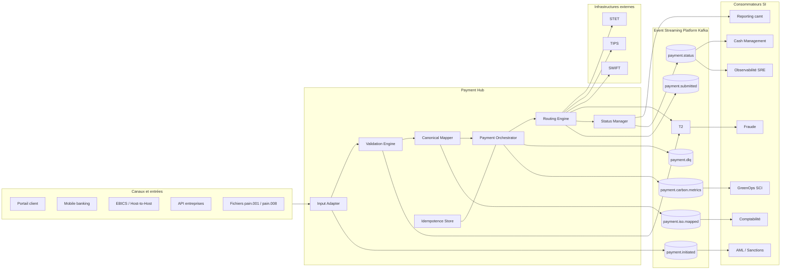

### Lecture architecte

Le Payment Hub ne devient pas un simple producteur Kafka. Il devient un **orchestrateur transactionnel événementiel**. Les événements publiés représentent les jalons du cycle de vie, et les consommateurs aval peuvent évoluer sans multiplier les appels synchrones. Les connecteurs STET, TIPS, SWIFT et T2 restent contrôlés par le Routing Engine pour maîtriser les règles de schéma, cut-off, disponibilité, SLA et sécurité.

## 7. Intégration du Payment Hub avec Kafka

L’intégration du Payment Hub avec Kafka doit être pensée comme une extension maîtrisée du cycle de vie paiement. Il ne faut pas publier n’importe quel payload à chaque étape. Chaque event doit être utile, gouverné et exploitable.

### 7.1 Points de publication recommandés

| Composant Payment Hub | Événement publié | Objectif |
|---|---|---|
| Input Adapter | `PaymentReceived` | Tracer l’entrée canal/fichier/API |
| Validation Engine | `PaymentValidated` ou `PaymentRejected` | Alimenter statut, fraude, reporting erreur |
| Canonical Mapper | `PaymentCanonicalized` | Garantir une représentation interne stable |
| ISO Mapper | `PaymentMappedToPacs008` / `PaymentMappedToPacs003` | Tracer transformation ISO |
| Payment Orchestrator | `PaymentReadyForRouting` | Déclencher routage ou contrôles complémentaires |
| Routing Engine | `PaymentSubmittedToInfrastructure` | Tracer émission STET/TIPS/SWIFT |
| Status Manager | `PaymentAccepted`, `PaymentRejected`, `PaymentStatusUnknown` | Distribuer statut normalisé |
| GreenOps Meter | `PaymentCarbonMeasured` | Mesurer coût CPU, réseau, logs, retry |

### 7.2 Pattern outbox

Pour éviter de valider une transaction métier sans publier l’événement correspondant, le Payment Hub doit utiliser un **transactional outbox pattern**. Le service écrit la transaction métier et l’événement outbox dans la même base transactionnelle. Un relay publie ensuite dans Kafka.

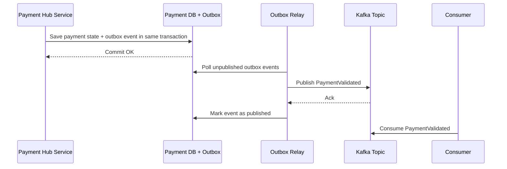

### 7.3 Pourquoi c’est critique

Sans outbox, l’architecture risque deux incohérences graves : paiement validé mais événement absent, ou événement publié alors que la transaction métier est rollbackée. En paiement bancaire, cette incohérence devient un incident d’audit, de statut ou de comptabilisation.

## 8. Modèle événementiel d’un paiement

Le modèle événementiel doit être plus stable qu’un message ISO mais moins abstrait qu’un modèle purement technique. Il doit porter les identifiants nécessaires à la corrélation, les dimensions métier, les statuts, le contexte ISO, la version de schéma, la sécurité et les métriques d’exploitation.

### 8.1 Structure logique d’un événement paiement

| Bloc | Champs typiques | Rôle |
|---|---|---|
| Métadonnées événement | eventId, eventType, eventVersion, occurredAt | Gouvernance et versioning |
| Corrélation | paymentId, correlationId, causationId, traceId | Observabilité et audit |
| Identifiants paiement | EndToEndId, TxId, InstrId, UETR | Cycle de vie ISO / interbancaire |
| Domaine | scheme, rail, direction, amount, currency | Classification métier |
| ISO | sourceMessageType, targetMessageType, isoVersion | Lien ISO 20022 |
| Canonique | canonicalVersion, canonicalHash | Stabilité interne |
| Statut | status, reasonCode, statusSource | Distribution des statuts |
| SRE | latencyMs, retryCount, errorClass | Exploitation |
| GreenOps | cpuMs, payloadBytes, logBytes, estimatedGco2e | SCI et optimisation |

### 8.2 Exemple pain.001 transformé en événements

Un fichier `pain.001` reçu via EBICS ne doit pas être transporté tel quel partout. Le Payment Hub peut produire une séquence d’événements :

1. `PaymentFileReceived` pour la réception du fichier.
2. `PaymentInstructionExtracted` pour chaque instruction.
3. `PaymentValidated` après validation XSD et métier.
4. `PaymentCanonicalized` après mapping vers modèle canonique.
5. `PaymentMappedToPacs008` après production interbancaire.
6. `PaymentSubmittedToSTET` après routage.
7. `PaymentAccepted` ou `PaymentRejected` après statut reçu.
8. `PaymentReportedInCamt054` après génération du reporting.

### 8.3 Payload minimal vs payload riche

| Approche | Avantage | Risque |
|---|---|---|
| Payload minimal avec ID | Faible volume Kafka, meilleur GreenOps | Consumers font trop de lookups |
| Payload complet canonique | Autonomie consommateurs | Volume, sécurité, duplication donnée |
| Payload hybride | Bon compromis | Nécessite gouvernance stricte |

Pour un SI bancaire, l’approche recommandée est souvent hybride : identifiants et champs de routage obligatoires, données sensibles minimisées, payload canonique partiel si nécessaire, lien vers un store sécurisé pour les détails.

## 9. Flux SCT en mode événementiel

Le SCT est un bon candidat pour l’EDA car il possède un cycle de vie clair : initiation client, validation, transformation `pain.001` vers `pacs.008`, soumission vers STET, réception de statut `pacs.002`, reporting `camt.054`.

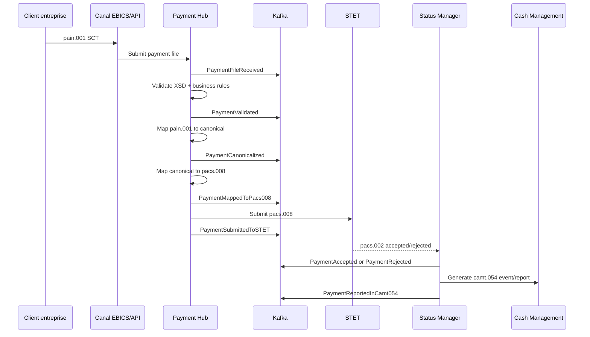

### 9.1 Exemple complet pain.001 → pacs.008 → pacs.002 → camt.054

| Étape | Message / Event | Décision architecture |
|---|---|---|
| Réception | `pain.001.001.09` | Parser streaming pour éviter de charger tout le fichier |
| Validation | `PaymentValidated` | XSD + règles métier : IBAN, montant, cut-off, doublon |
| Mapping | `PaymentMappedToPacs008` | Modèle canonique comme pivot |
| Routage | `pacs.008` vers STET | Selon scheme SCT, devise EUR, pays SEPA |
| Statut | `pacs.002` | Converti en statut normalisé `PaymentAccepted` ou `PaymentRejected` |
| Reporting | `camt.054` | Généré depuis statut normalisé et événements de règlement |

### 9.2 Points de contrôle

- La clé Kafka doit conserver l’ordre par paiement : `paymentId` ou `EndToEndId`.
- Le `pacs.008` publié dans Kafka doit être gouverné : payload complet seulement si besoin réglementaire ou reprocessing.
- Le `camt.054` ne doit pas être reconstruit depuis des logs, mais depuis des événements de statut fiables.

## 10. Flux SDD en mode événementiel

Le SDD conserve une forte dimension batch, notamment pour les remises de prélèvements. L’EDA ne supprime pas le batch, mais elle transforme le batch opaque en série d’événements observables. Un fichier `pain.008` peut donner naissance à des événements par fichier, par lot, par transaction et par statut.

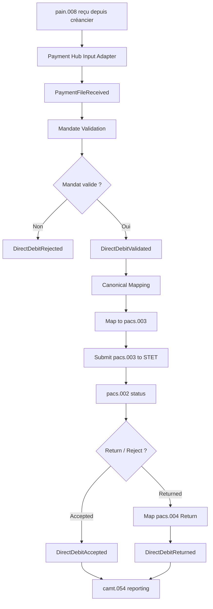

### 10.1 Exemple pain.008 → pacs.003 → pacs.004

| Étape | Objet | Détail |
|---|---|---|
| Initiation | `pain.008` | Remise créancier avec références de mandat |
| Validation | `DirectDebitValidated` | Contrôle mandat, RUM, ICS, échéance, séquence FRST/RCUR |
| Mapping | `pacs.003` | Message interbancaire de prélèvement |
| Statut initial | `pacs.002` | Acceptation technique ou rejet |
| Retour | `pacs.004` | Retour/refus/remboursement selon motif |
| Reporting | `camt.054` | Notification au créancier et à la banque |

### 10.2 Spécificités SDD

Le SDD nécessite une gouvernance forte des retours et rejets. En EDA, chaque retour doit être un événement distinct et corrélé à l’instruction initiale. Le replay doit être très encadré : rejouer un `DirectDebitValidated` ne doit pas réémettre un prélèvement déjà transmis. Les événements de retour doivent alimenter le cash management, les litiges, la relation client et le reporting réglementaire.

## 11. Flux SCT Inst en mode événementiel

Le SCT Inst impose une contrainte de latence forte et une gestion précise des statuts inconnus. L’architecture doit combiner appel synchrone court pour l’expérience client et événements de statut pour le cycle de vie complet.

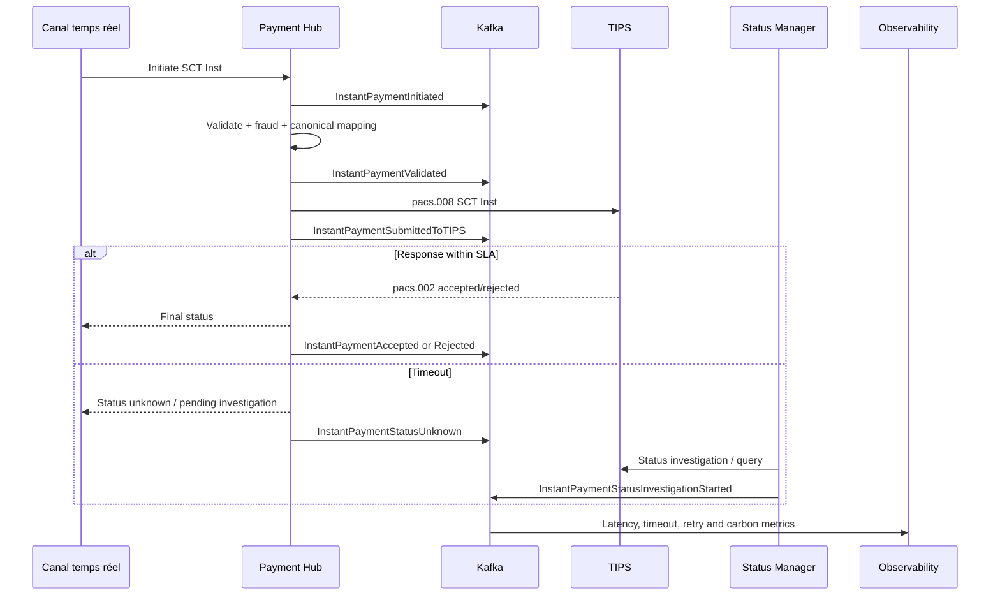

### 11.1 SCT Inst avec event + statut temps réel

Pour un SCT Inst, le canal peut recevoir une réponse rapide : accepté, rejeté ou inconnu. Le statut inconnu n’est pas une erreur générique. C’est un état métier critique : le paiement a peut-être été accepté par l’infrastructure, mais la banque initiatrice n’a pas reçu la réponse à temps.

### 11.2 Exemple SCT Inst avec timeout/statut inconnu

| Temps | Action | Event |
|---|---|---|
| T0 | Client initie paiement instantané | `InstantPaymentInitiated` |
| T0 + 50 ms | Validation locale OK | `InstantPaymentValidated` |
| T0 + 300 ms | Soumission TIPS | `InstantPaymentSubmittedToTIPS` |
| T0 + SLA | Pas de réponse fiable | `InstantPaymentStatusUnknown` |
| T0 + SLA + n | Investigation statut | `InstantPaymentStatusInvestigationStarted` |
| T0 + final | Statut confirmé | `InstantPaymentAccepted` ou `InstantPaymentRejected` |

### 11.3 Règle d’architecture

Un timeout ne doit jamais déclencher un retry aveugle vers TIPS. Le retry technique peut créer un doublon ou un statut contradictoire. L’architecture doit déclencher une **investigation de statut** corrélée, pas une réémission non contrôlée.

## 12. Flux cross-border en mode événementiel

Le cross-border combine des contraintes ISO 20022, SWIFT, AML, sanctions, FX, correspondants bancaires, UETR et statuts parfois longs. L’EDA apporte de la visibilité et du découplage, mais doit rester compatible avec les infrastructures de messagerie financière.

```mermaid
flowchart LR
    A[Canal entreprise / trésorerie] --> B[Payment Hub]
    B --> C[Canonical Payment]
    C --> D[AML / Sanctions Screening]
    D --> E{Clear ?}
    E -- No --> F[CrossBorderPaymentBlocked]
    E -- Yes --> G[FX / Correspondent Enrichment]
    G --> H[Map to pacs.008 or MT103/MX]
    H --> I[SWIFT Connector]
    I --> J[SWIFT Network]
    J --> K[Correspondent Bank]
    K --> L[Status / gpi / UETR updates]
    L --> M[Status Manager]
    M --> N[Kafka payment.status]
    N --> O[Cash Management / Reporting]
```

### 12.1 Cross-border avec AML/SWIFT

Un paiement cross-border peut être initié en ISO 20022 ou en format legacy. L’architecture recommandée est :

1. Recevoir l’ordre de paiement.
2. Normaliser vers le modèle canonique.
3. Exécuter AML, sanctions et contrôles géographiques.
4. Enrichir devise, frais, correspondants et UETR.
5. Mapper vers le format requis : MX ISO 20022 ou MT selon corridor.
6. Publier `CrossBorderPaymentSubmittedToSWIFT`.
7. Consommer les statuts SWIFT/gpi et les normaliser.

### 12.2 Statuts longs et événements

Contrairement au SCT Inst, le cross-border peut durer plus longtemps. Les événements doivent représenter les jalons : `ScreeningPassed`, `ScreeningHeld`, `SwiftMessageSent`, `CorrespondentAcknowledged`, `PaymentCredited`, `PaymentRejected`, `FeesAdjusted`.

### 12.3 UETR

L’UETR est critique pour la traçabilité cross-border. Il doit être porté dans les événements, les traces SRE et les rapports d’audit. Il ne remplace pas `paymentId` interne, mais il devient l’identifiant de suivi interbancaire.

## 13. Flux cash management en mode événementiel

Le cash management consomme des statuts, des relevés, des notifications et des informations de liquidité. Une EDA permet de publier les événements de règlement et de reporting vers les portails entreprises, outils de trésorerie, data platforms et systèmes comptables.

### 13.1 Événements utiles au cash management

| Event | Consommateur | Usage |
|---|---|---|
| `PaymentAccepted` | Portail entreprise | Afficher statut accepté |
| `PaymentRejected` | Relation client / litiges | Informer du rejet et motif |
| `PaymentSettled` | Comptabilité | Comptabilisation et rapprochement |
| `StatementAvailable` | Cash management | Déclencher téléchargement camt.053 |
| `DebitCreditNotificationAvailable` | Portail entreprise | Exposer camt.054 |
| `LiquidityPositionUpdated` | Trésorerie | Vision liquidité intraday |

### 13.2 camt.053 vs camt.054

| Message | Usage | Mode événementiel |
|---|---|---|
| `camt.053` | Relevé de compte, souvent journalier | Event `StatementAvailable` avec lien vers document sécurisé |
| `camt.054` | Notification de débit/crédit, transactionnelle | Event `DebitCreditNotificationAvailable` lié à `PaymentAccepted/Settled` |

### 13.3 camt.054 généré depuis statut paiement

Le `camt.054` ne doit pas être généré à partir d’un polling aveugle du système comptable. Il doit être généré ou exposé à partir d’un statut métier fiable : `PaymentSettled`, `DirectDebitReturned`, `CreditNotificationReady`. Cette approche réduit les consultations répétitives, améliore la traçabilité et diminue le coût carbone lié aux requêtes inutiles.

## 14. Intégration ISO 20022 dans les events

ISO 20022 reste le langage normatif d’échange. Les events ne remplacent pas les messages `pain`, `pacs` et `camt`. Ils les contextualisent, les corrèlent et les distribuent dans le SI.

### 14.1 Trois options d’intégration

| Option | Description | Recommandation |
|---|---|---|
| Event contient le XML complet | Payload Kafka = message ISO complet | À limiter aux cas nécessaires |
| Event contient le modèle canonique | Payload métier normalisé | Recommandé pour consommateurs internes |
| Event contient référence + hash | Stockage externe sécurisé | Recommandé pour gros payloads / conformité |

### 14.2 Event vs message ISO

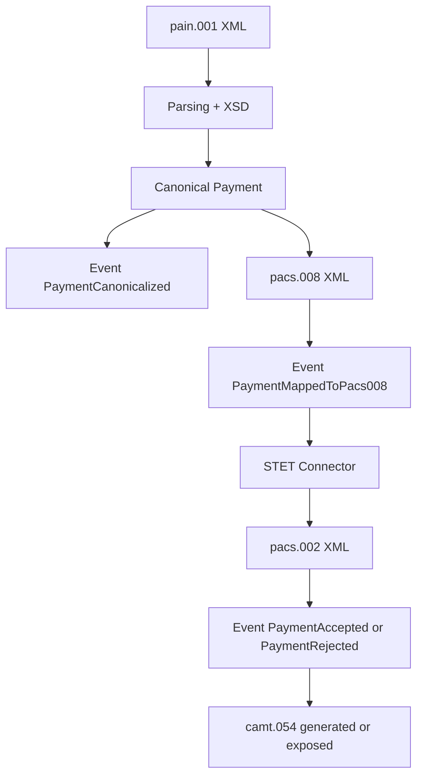

### 14.3 Règle de conception

Un message ISO est un contrat externe. Un event est un contrat interne ou inter-domaines. Le message ISO porte la conformité d’échange. L’event porte le fait métier, la corrélation, la version, le statut et les dimensions d’observabilité.

### 14.4 pacs.008 publié dans Kafka

Publier un `pacs.008` dans Kafka peut être pertinent pour audit, reprocessing ou distribution à un composant d’envoi. Mais il faut éviter de faire de Kafka un stockage non gouverné de XML sensibles. Le message publié doit être chiffré si nécessaire, minimisé, associé à une politique de rétention, et corrélé à son modèle canonique.

## 15. Event vs message ISO

La confusion entre événement et message ISO est un anti-pattern fréquent. Un `pacs.008` n’est pas automatiquement un event métier. C’est un message interbancaire de transfert de crédit. L’event associé peut être `PaymentMappedToPacs008` ou `PaymentSubmittedToSTET`.

| Dimension | Message ISO 20022 | Event métier |
|---|---|---|
| Finalité | Échange normatif externe | Fait métier interne ou inter-domaines |
| Exemple | `pain.001`, `pacs.008`, `camt.054` | `PaymentValidated`, `PaymentAccepted` |
| Version | Version ISO : `.001.03`, `.001.09` | Version d’event : `1.0.0`, `1.1.0` |
| Payload | XML riche et normé | JSON/Avro/Protobuf/canonique |
| Gouvernance | Normes, infrastructures, scheme books | Domaine, schema registry, plateforme data |
| Rétention | Selon archivage bancaire | Selon topic, audit, SRE, replay |
| GreenOps | Coût parsing XML élevé | Potentiel plus léger si bien conçu |

### Exemple pain.001 transformé en événements

Un `pain.001` peut contenir un groupe de paiements. Le Payment Hub peut publier un événement fichier et plusieurs événements transactionnels. C’est essentiel pour éviter de bloquer toute une remise à cause d’une transaction invalide, selon les règles métier applicables.

### Exemple pacs.008 publié dans Kafka

Après mapping, le Payment Hub peut publier :

```json
{
  "eventType": "PaymentMappedToPacs008",
  "paymentId": "pay-20260427-001",
  "endToEndId": "E2E-001",
  "targetMessageType": "pacs.008.001.08",
  "messageReference": "secure-store://iso/pacs008/2026/04/27/pay-20260427-001.xml",
  "messageSha256": "4b5f...",
  "routingRail": "STET",
  "status": "READY_TO_SUBMIT"
}
```

## 16. Event sourcing vs orchestration

L’event sourcing consiste à reconstruire l’état courant d’un agrégat à partir de son journal d’événements. L’orchestration consiste à piloter explicitement un processus métier via un orchestrateur. Dans les paiements bancaires, il faut être prudent : tout event streaming n’est pas event sourcing.

### 16.1 Comparaison

| Approche | Avantage | Risque | Usage paiement |
|---|---|---|---|
| Orchestration Payment Hub | Maîtrise du cycle de vie et des décisions | Orchestrateur trop central si mal conçu | Recommandé pour décisions critiques |
| Event sourcing complet | Audit très fort, reconstruction historique | Complexité, replay dangereux, conformité donnée | À réserver à domaines maîtrisés |
| Choreography pure | Fort découplage | Processus difficile à gouverner | À éviter sur paiements critiques |
| Hybrid EDA + orchestration | Bon compromis | Nécessite règles claires | Cible recommandée |

### 16.2 Position recommandée

Pour un SI paiement banque, le modèle cible le plus crédible est :

- Payment Hub orchestrateur des transitions critiques.
- Kafka journal événementiel distribué.
- Event sourcing partiel pour certains agrégats, par exemple statut ou audit trail.
- Consumers découplés pour reporting, notification, data, GreenOps, observabilité.
- Replays encadrés par runbook et droits spécifiques.

### 16.3 Critère de décision

Une transition qui peut déplacer de l’argent, réserver de la liquidité, créer une écriture comptable ou transmettre à une infrastructure doit rester orchestrée et idempotente. Une transition qui informe, observe, agrège ou notifie peut être consommée de façon plus découplée.

## 17. Gestion des statuts en EDA

La gestion des statuts est un pilier de l’EDA paiement. Les statuts viennent de plusieurs sources : Payment Hub, infrastructures, systèmes AML, fraude, comptabilité, SWIFT, STET, TIPS, T2. L’architecture doit normaliser ces statuts dans un modèle commun.

### 17.1 Sources de statut

| Source | Message / Signal | Event normalisé |
|---|---|---|
| STET | `pacs.002` | `PaymentAccepted` / `PaymentRejected` |
| TIPS | `pacs.002` ou timeout | `InstantPaymentAccepted` / `StatusUnknown` |
| SWIFT | ACK/NACK/gpi/MX | `CrossBorderStatusUpdated` |
| SDD Return | `pacs.004` | `DirectDebitReturned` |
| Reporting | `camt.054` | `DebitCreditNotificationAvailable` |
| Technique | Timeout/connecteur | `PaymentTechnicalIssueDetected` |

### 17.2 Diagramme flux pain → pacs → camt

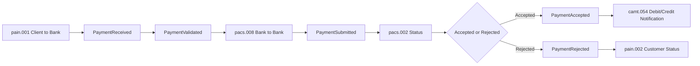

### 17.3 Statut technique vs statut métier

Un timeout, une erreur réseau ou une indisponibilité connecteur ne sont pas des rejets métier. Ils doivent produire des événements techniques et éventuellement un statut métier `UNKNOWN` ou `PENDING_INVESTIGATION`. Cette distinction est essentielle pour éviter des communications client incorrectes et des doubles émissions.

## 18. Idempotence en event-driven

L’idempotence est obligatoire dans les paiements. En EDA, un event peut être reçu plusieurs fois, un producer peut republier après retry, un consumer peut redémarrer au même offset, un replay peut relire l’historique. L’architecture doit garantir que ces situations ne créent pas de double paiement, double comptabilisation ou double notification critique.

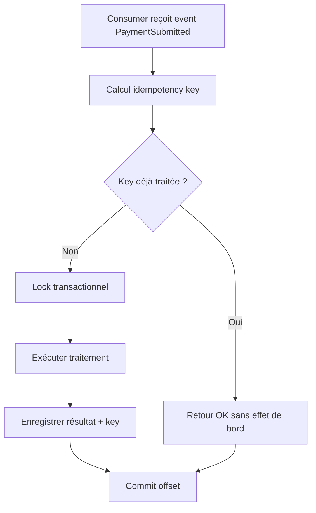

### 18.1 Clés d’idempotence

| Flux | Clé recommandée |
|---|---|
| SCT | `paymentId` + `EndToEndId` + `eventType` |
| SDD | `paymentId` + `MandateId/RUM` + `collectionDate` |
| SCT Inst | `paymentId` + `TxId` + `rail=TIPS` |
| Cross-border | `paymentId` + `UETR` + `correspondentStep` |
| Reporting camt | `accountId` + `statementId` + `entryReference` |

### 18.2 Idempotence producer

Le producer doit éviter les duplications au moment de publier. Il faut utiliser des producers idempotents, le transactional outbox pattern, des clés stables et une stratégie claire en cas d’ack ambigu.

### 18.3 Idempotence consumer

Le consumer doit considérer Kafka comme au moins une fois. Il ne doit jamais supposer “exactly once métier” sans stockage idempotent. Même si Kafka offre des transactions techniques, l’effet métier dans une base, un connecteur externe ou une API tierce doit être protégé par une clé idempotente.

## 19. Gestion des retries en EDA

Les retries sont nécessaires mais dangereux. Ils consomment du CPU, du réseau, des logs, augmentent la latence et peuvent créer des doublons si l’idempotence est insuffisante. En GreenOps, le retry est un facteur majeur de gCO2e inutile.

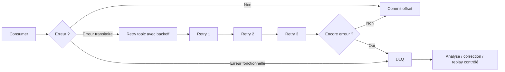

### 19.1 Types de retries

| Type | Exemple | Stratégie |
|---|---|---|
| Retry technique court | Timeout temporaire consumer | Backoff court, nombre limité |
| Retry technique long | Infrastructure externe indisponible | Retry topic différé |
| Retry fonctionnel | IBAN invalide | Pas de retry automatique, rejet métier |
| Retry post-correction | Référentiel corrigé | Replay contrôlé via runbook |
| Retry statut inconnu SCT Inst | Timeout TIPS | Investigation de statut, pas réémission aveugle |

### 19.2 Coût GreenOps des retries

Un retry n’est pas gratuit. Il reparcourt souvent parsing, validation, mapping, logs, appels réseau et écritures. Un taux de retry de 2% sur un volume massif peut représenter une consommation CPU significative. L’architecture doit mesurer : `retry_count`, `retry_cpu_ms`, `retry_payload_bytes`, `retry_log_bytes`, `retry_estimated_gco2e`.

### 19.3 Règle d’or

Un retry automatique doit être réservé aux erreurs transitoires. Une erreur métier doit produire un statut ou une DLQ fonctionnelle, pas une boucle de consommation.

## 20. DLQ Dead Letter Queue

La DLQ est une zone contrôlée pour les événements non traitables automatiquement. Elle n’est pas une poubelle technique. Dans un contexte bancaire, une DLQ doit être gouvernée, surveillée, priorisée, sécurisée et intégrée à un processus de résolution.

### 20.1 Causes DLQ

| Cause | Exemple | Action attendue |
|---|---|---|
| Schéma incompatible | Event version inconnue | Corriger consumer ou schema registry |
| Donnée invalide | Champ obligatoire absent | Rejet fonctionnel ou correction référentiel |
| Erreur mapping | ISO version non supportée | Corriger mapping canonique |
| Connecteur indisponible durable | STET connector KO | Résolution infra puis replay contrôlé |
| Violation idempotence | Doublon suspect | Investigation métier |

### 20.2 Contenu minimal d’un event DLQ

Un event DLQ doit contenir : event original ou référence, cause, stack technique limitée, classification, timestamp, consumer group, offset, partition, traceId, paymentId, EndToEndId, criticité et recommandation de traitement.

### 20.3 Gouvernance DLQ

| Dimension | Exigence |
|---|---|
| SLO | Temps maximum de traitement selon criticité |
| Sécurité | Accès restreint, chiffrement si données sensibles |
| Audit | Historique des corrections et replays |
| GreenOps | Suivre volume DLQ, reprocessing et coût CPU |
| Runbook | Procédure claire : diagnostiquer, corriger, rejouer, clôturer |

## 21. Reprocessing / replay

Le replay est l’un des avantages majeurs de l’event streaming, mais aussi l’un des plus grands risques en paiement. Il faut distinguer replay de lecture, replay analytique, replay de reconstitution et replay métier.

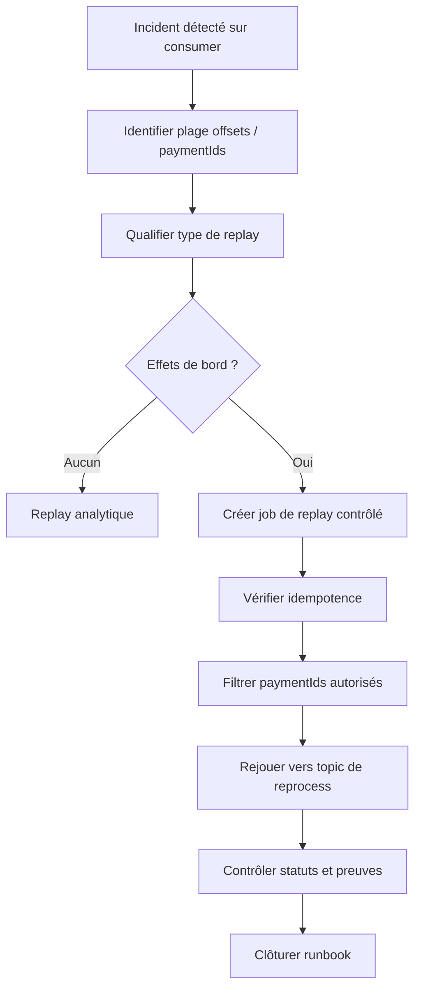

### 21.1 Replay d’un paiement en erreur

Exemple : un `PaymentMappedToPacs008` a échoué à cause d’un mapping BIC obsolète. Après correction du référentiel, le replay ne doit pas relire tout le topic `payment.initiated`. Il doit :

1. Identifier les paiements affectés.
2. Vérifier qu’ils n’ont pas été soumis à STET.
3. Publier un événement de correction ou un replay sur topic dédié.
4. Relancer seulement l’étape de mapping.
5. Produire une preuve d’audit.

### 21.2 Topic de reprocess

Il est recommandé d’utiliser un topic de reprocessing, par exemple `payment.reprocess.requested.v1`, avec un payload explicite : raison, périmètre, opérateur, ticket incident, fenêtre temporelle, contrôles d’idempotence.

### 21.3 GreenOps du replay

Le replay massif peut coûter cher : relecture disque, réseau Kafka, désérialisation, validation, logs. Il faut éviter les replays globaux et privilégier des replays filtrés et justifiés.

## 22. Résilience par découplage

L’EDA améliore la résilience en découplant les producteurs et consommateurs. Si le reporting est indisponible, le Payment Hub peut continuer à traiter les paiements, à condition que le topic conserve les événements et que les consommateurs rattrapent leur retard ensuite.

### 22.1 Patterns de résilience

| Pattern | Usage paiement |
|---|---|
| Backpressure | Éviter qu’un consumer lent bloque les producteurs |
| Circuit breaker | Protéger connecteurs STET/TIPS/SWIFT ou enrichissements externes |
| Bulkhead | Isoler SCT Inst des traitements batch SDD |
| Retry topic | Réessayer sans bloquer le topic principal |
| DLQ | Isoler erreurs non traitables |
| Outbox | Garantir cohérence transaction + event |
| Idempotence store | Éviter effets multiples après retry/replay |

### 22.2 Découplage ne veut pas dire absence de dépendance

Un Payment Hub dépend toujours d’infrastructures critiques. L’EDA ne rend pas STET, TIPS ou SWIFT magiquement disponibles. Elle permet de mieux absorber les indisponibilités partielles, de publier des statuts techniques, de prévenir les consommateurs et d’éviter des timeouts en cascade.

### 22.3 Résilience par domaine

| Domaine | Résilience attendue |
|---|---|
| SCT | Absorber retard de statut, éviter blocage reporting |
| SDD | Isoler erreurs par transaction ou lot |
| SCT Inst | Répondre statut inconnu sans retry dangereux |
| Cross-border | Suivre statuts longs et hold AML |
| Cash management | Rattraper relevés et notifications sans bloquer paiement |

## 23. Gestion de la latence

L’EDA n’est pas toujours plus rapide qu’un appel direct. Elle apporte du découplage et de la résilience, mais ajoute sérialisation, écriture Kafka, réplication, consommation et traitement. La latence doit donc être conçue par flux.

### 23.1 Latence par type de paiement

| Flux | Exigence | Architecture recommandée |
|---|---|---|
| SCT | Secondes à minutes selon canal/cut-off | EDA avec soumission contrôlée STET |
| SDD | Batch / fenêtres | Batch découpé en événements observables |
| SCT Inst | Temps réel strict | Hybride synchrone + événements de statut |
| Cross-border | Minutes à jours | EDA pour jalons, SWIFT/gpi, AML, statut |
| Cash management | Intraday / reporting | Event notifications + documents sécurisés |

### 23.2 Optimisations latence Kafka

- Choisir une clé de partition qui évite les hotspots.
- Ne pas publier des XML énormes sur les chemins critiques si une référence suffit.
- Séparer topics temps réel et topics analytiques.
- Ajuster compression, batch producer et acks selon criticité.
- Mesurer consumer lag par flux et par criticité métier.
- Éviter de faire du parsing XML complet dans chaque consumer.

### 23.3 SCT Inst

Pour SCT Inst, le chemin critique doit rester minimal. Les événements enrichis pour audit, observabilité ou GreenOps ne doivent pas bloquer la réponse client. Le statut final doit être publié, mais la métrique carbone ou la notification data lake peuvent être asynchrones.

## 24. Observabilité en EDA

L’observabilité est un prérequis. Une EDA sans observabilité devient un système opaque où les événements circulent mais où personne ne sait expliquer pourquoi un paiement est bloqué.

### 24.1 Dimensions observables

| Dimension | Métriques |
|---|---|
| Kafka | consumer lag, throughput, partitions, ISR, under-replicated partitions |
| Payment | paiements initiés, validés, rejetés, acceptés, inconnus |
| Latence | end-to-end latency, processing latency, infrastructure latency |
| Erreurs | DLQ count, retry count, error class, rejection reason |
| ISO | parsing duration, validation failures, mapping failures |
| SRE | SLI/SLO, availability, saturation, error budget |
| GreenOps | CPU ms/event, payload bytes, log bytes, gCO2e/transaction |

### 24.2 Traces distribuées

Chaque événement doit porter un `traceId`, `correlationId` et idéalement `causationId`. Cela permet de relier : réception canal, validation, mapping, publication Kafka, soumission infrastructure, réception statut et génération camt.

### 24.3 SLO possibles

| SLO | Exemple |
|---|---|
| SCT processing | 99% des SCT validés en moins de X secondes hors cut-off |
| SCT Inst | 99,9% des statuts finaux ou inconnus qualifiés sous SLA défini |
| DLQ | 95% des DLQ critiques traitées sous 4h ouvrées |
| Consumer lag | Lag inférieur à seuil métier par topic critique |
| Status completeness | 99,99% des paiements avec statut terminal ou investigation |
| GreenOps | Baisse de 10% CPU ms / 1000 événements sur périmètre optimisé |

### 24.4 Dashboards recommandés

- Dashboard executive : volumes, statuts, incidents, disponibilité.
- Dashboard paiement : cycle de vie par scheme SCT/SDD/SCT Inst/cross-border.
- Dashboard Kafka : topics, partitions, lag, DLQ.
- Dashboard ISO : parsing, validation, mapping, versions.
- Dashboard GreenOps : CPU, payload, logs, retries, gCO2e.

## 25. Impact GreenOps

L’EDA peut réduire l’impact carbone si elle diminue les batchs massifs, le polling, les retries inutiles et les mappings redondants. Mais elle peut aussi l’augmenter si elle multiplie les événements, duplique les payloads XML, loggue trop et consomme trop de topics.

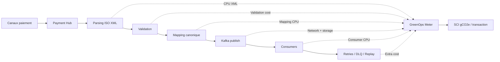

### 25.1 Réduction des retries

Une EDA bien conçue réduit les retries aveugles en isolant les erreurs et en distinguant erreur fonctionnelle, transitoire et statut inconnu. Cela réduit CPU, logs et réseau.

### 25.2 Découplage = moins de surcharge

Dans une architecture synchrone, un service lent provoque timeouts, retries et saturation. Avec Kafka, un consumer lent accumule du lag, mais ne force pas forcément les producteurs à réessayer. Cette propriété peut réduire la surcharge globale.

### 25.3 Optimisation CPU

La duplication de parsing XML est un coût majeur. Le modèle recommandé est : parser une fois dans le Payment Hub, produire un modèle canonique contrôlé, et éviter que chaque consumer reparte du XML ISO complet.

### 25.4 Réduction batch

Transformer certains traitements batch en événements incrémentaux peut réduire les pics CPU et lisser la charge. Cela permet aussi une planification plus carbon-aware pour les traitements non urgents, par exemple reporting lourd, data lake ou reprocessing.

### 25.5 Mesure SCI

Formule utilisée dans le projet GreenOps :

```text
SCI = ((E × I) + M) / R
```

Avec :

| Variable | Sens dans EDA paiement |
|---|---|
| E | Énergie consommée par parsing, mapping, Kafka, consumers |
| I | Intensité carbone de l’électricité |
| M | Part matérielle imputée aux serveurs, brokers, stockage |
| R | Unité fonctionnelle : transaction, 1000 events, fichier, batch |

### 25.6 Exemple chiffré simplifié

| Scénario | CPU ms/transaction | Retry rate | Log KB/transaction | gCO2e/transaction estimé |
|---|---:|---:|---:|---:|
| Batch + polling + XML répété | 85 | 4% | 45 | 0,42 |
| EDA mal conçue avec payload complet partout | 95 | 2% | 70 | 0,48 |
| EDA optimisée canonique + retry contrôlé | 55 | 0,8% | 22 | 0,27 |

La cible n’est donc pas “Kafka = GreenOps”. La cible est : moins de retries, moins de polling, moins de parsing répété, moins de logs inutiles, meilleure observabilité.

## 26. Comparaison Batch vs Event-Driven

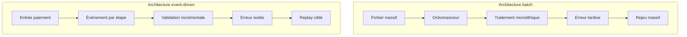

| Critère | Batch | Event-Driven |
|---|---|---|
| Latence | Forte, dépend fenêtre | Faible à moyenne selon flux |
| Visibilité | Souvent tardive | Quasi temps réel |
| Erreurs | Souvent globales au fichier | Isolables par événement |
| Replay | Massif | Ciblé si bien gouverné |
| GreenOps | Pics CPU, reprocessing lourd | Charge lissée, mais risque de surproduction d’events |
| Audit | Logs + fichiers + statuts | Journal événementiel corrélé |
| Complexité | Ordonnancement et dépendances | Gouvernance topics, schémas, idempotence |
| Adaptation SCT Inst | Faible | Forte avec modèle hybride |
| Adaptation SDD | Bonne pour masse | Bonne si batch découpé en événements |

### Conclusion comparative

Le batch reste pertinent pour certains traitements de masse, mais il ne doit plus être le seul modèle d’architecture. L’EDA est particulièrement adaptée aux statuts, à l’observabilité, aux notifications, au cash management, au replay ciblé et au pilotage carbone.

## 27. Anti-patterns EDA

### 27.1 Transformer Kafka en base de données métier unique

Kafka est un journal d’événements, pas le remplacement automatique des stores transactionnels. Les statuts critiques doivent être persistés dans un store métier maîtrisé.

### 27.2 Publier le XML ISO complet partout

Dupliquer `pain.001`, `pacs.008` ou `camt.054` dans tous les topics augmente volume, exposition de données, parsing et coût carbone.

### 27.3 Absence d’idempotence

Un consumer qui crée un effet de bord sans clé idempotente est dangereux. En paiement, cela peut créer des doubles traitements.

### 27.4 Replay non gouverné

Autoriser un replay depuis l’offset 0 sur un consumer ayant des effets de bord est un risque majeur.

### 27.5 Topics trop génériques

Un topic `payment-events` contenant tous les flux, statuts, schémas et versions devient ingouvernable.

### 27.6 Choreography pure sur processus critique

Laisser plusieurs services décider seuls du cycle de vie d’un paiement peut rendre l’audit impossible. L’orchestration Payment Hub reste nécessaire sur les étapes critiques.

### 27.7 Logs excessifs

Logger chaque payload ISO complet est un anti-pattern sécurité, performance et GreenOps.

### 27.8 Confondre statut technique et statut métier

Un timeout n’est pas un rejet. Un connecteur indisponible n’est pas un paiement refusé. Cette confusion produit des incidents client et des corrections coûteuses.

## 28. Bonnes pratiques

### 28.1 Architecture

- Garder le Payment Hub comme cœur de décision et de statut.
- Utiliser Kafka pour distribuer les événements, pas pour cacher une absence de modèle métier.
- Séparer les topics critiques, analytiques, retry et DLQ.
- Mettre en place un schema registry et une politique de compatibilité.
- Publier des événements métier nommés au passé : `PaymentValidated`, `PaymentRejected`.

### 28.2 ISO 20022

- Parser ISO une fois dans le Payment Hub autant que possible.
- Mapper vers modèle canonique stable.
- Publier les références aux XML lourds plutôt que les payloads complets partout.
- Corréler `MessageId`, `EndToEndId`, `TxId`, `UETR` et `paymentId`.

### 28.3 Kafka

- Choisir une clé de partition stable par paiement.
- Surveiller lag, throughput, DLQ et erreurs de désérialisation.
- Utiliser des retries avec backoff et limite.
- Encadrer les replays par runbooks.
- Appliquer des ACL par consumer group et topic.

### 28.4 SRE

- Définir SLI/SLO par scheme de paiement.
- Tracer chaque paiement de bout en bout.
- Mettre en place alertes sur statut inconnu, DLQ, lag critique et taux de retry.
- Conserver des preuves d’audit exploitables.

### 28.5 GreenOps

- Mesurer CPU ms par transaction et par event.
- Réduire parsing XML redondant.
- Réduire logs payload.
- Optimiser compression et rétention Kafka.
- Comparer gCO2e/transaction avant/après migration EDA.

## 29. Questions d’audit EDA

### 29.1 Architecture et gouvernance

| Question | Attendu |
|---|---|
| Quels événements décrivent le cycle de vie d’un paiement ? | Catalogue d’events versionné |
| Qui possède chaque topic ? | Ownership clair par domaine |
| Quel est le rôle du Payment Hub vs Kafka ? | Hub = décision/statut, Kafka = distribution |
| Les événements sont-ils nommés métier ou techniques ? | Faits métier au passé |
| Existe-t-il une stratégie de versioning ? | Schema registry + compatibilité |

### 29.2 Paiements et ISO

| Question | Attendu |
|---|---|
| Comment un pain.001 devient-il pacs.008 ? | Mapping canonique, événements jalons |
| Comment un pain.008 devient-il pacs.003 ? | Validation mandat + mapping SDD |
| Comment un pacs.002 est-il normalisé ? | Status Manager et modèle statut |
| Comment un camt.054 est-il généré ? | Depuis statut/règlement fiable |
| Où sont gérés EndToEndId, TxId, UETR ? | Corrélation bout en bout |

### 29.3 Résilience et idempotence

| Question | Attendu |
|---|---|
| Que se passe-t-il si un event est consommé deux fois ? | Idempotence store |
| Que se passe-t-il si Kafka est disponible mais un consumer est KO ? | Lag contrôlé, pas de blocage producteur |
| Que se passe-t-il si TIPS timeout ? | Statut inconnu + investigation, pas retry aveugle |
| Les DLQ sont-elles surveillées ? | SLO, runbook, ownership |
| Les replays sont-ils encadrés ? | Autorisation, périmètre, preuve |

### 29.4 GreenOps

| Question | Attendu |
|---|---|
| Mesure-t-on CPU/event et CPU/transaction ? | Métriques collectées |
| Mesure-t-on retry cost ? | retry_cpu_ms, retry_gco2e |
| Les payloads XML sont-ils dupliqués ? | Minimisation + référence sécurisée |
| Les logs contiennent-ils des XML complets ? | Non, logs structurés et minimisés |
| Compare-t-on batch vs EDA ? | Baseline avant/après |

## 30. Synthèse architecte

Une architecture Event-Driven pour les paiements bancaires doit être présentée comme une évolution maîtrisée du SI, pas comme une mode technique. Le Payment Hub reste le cœur de l’architecture : il valide, mappe, orchestre, route et normalise les statuts. Kafka apporte la capacité de distribuer les événements, de découpler les consommateurs, de rejouer sous contrôle, d’observer le cycle de vie et de réduire certains coûts opérationnels.

La clé de crédibilité en entretien architecte est de montrer la nuance : le batch ne disparaît pas, le synchrone ne disparaît pas, ISO 20022 ne disparaît pas. L’EDA s’ajoute comme un backbone structurant pour rendre les flux plus visibles, résilients, auditables et optimisables.

### Points à défendre

| Thème | Position architecte |
|---|---|
| Payment Hub | Cœur métier et transactionnel, pas remplacé par Kafka |
| ISO 20022 | Contrat externe normatif, intégré via modèle canonique |
| Kafka | Backbone événementiel, découplage et replay contrôlé |
| SCT | Flux idéal pour pain.001 → pacs.008 → pacs.002 → camt.054 observable |
| SDD | Batch conservé mais découpé en événements traçables |
| SCT Inst | Hybride synchrone + événementiel, statut inconnu géré explicitement |
| Cross-border | Événements pour AML, SWIFT, UETR, statuts longs |
| Cash management | camt.053/camt.054 exposés depuis événements fiables |
| SRE | SLI/SLO, traces, lag, DLQ, statuts inconnus, error budget |
| GreenOps | Réduction retries, parsing redondant, logs inutiles et batchs massifs |

### Formulation d’entretien

> Je ne positionne pas Kafka comme un substitut au Payment Hub. Je le positionne comme un backbone événementiel autour du Payment Hub. Le Payment Hub garde la décision et la responsabilité bancaire ; Kafka distribue les faits métier, rend le cycle de vie observable, facilite le replay contrôlé et permet d’alimenter SRE, cash management, data et GreenOps sans couplage synchrone excessif.

### Trajectoire recommandée

1. Cartographier les flux batch/synchrones existants.
2. Définir le modèle canonique paiement et les identifiants de corrélation.
3. Créer un catalogue d’événements par scheme : SCT, SDD, SCT Inst, cross-border.
4. Mettre en place Kafka, schema registry, ACL, observabilité.
5. Introduire outbox, idempotence, retry topics et DLQ.
6. Migrer d’abord les statuts et notifications, moins risqués.
7. Étendre aux flux SCT puis SDD, puis SCT Inst avec statut inconnu.
8. Mesurer le gain SRE et GreenOps : latence, retries, CPU, logs, gCO2e.
9. Industrialiser runbooks de replay, DLQ, incident et audit.
10. Gouverner les versions d’events comme des contrats d’architecture.

La réussite de l’EDA paiement se mesure à trois niveaux : moins d’incidents de chaîne, plus de visibilité métier, et un coût opérationnel/carbone inférieur par transaction utile.

---

## Annexes — Diagrammes complémentaires obligatoires

### A. Producteur → topic → consommateur

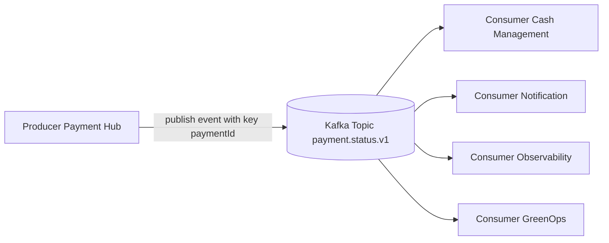

### B. Flux événementiel paiement end-to-end

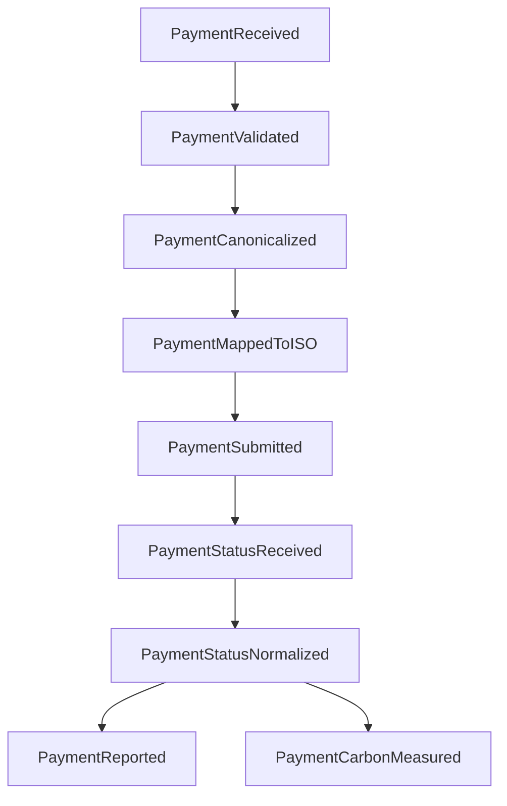

### C. Intégration STET / TIPS / SWIFT

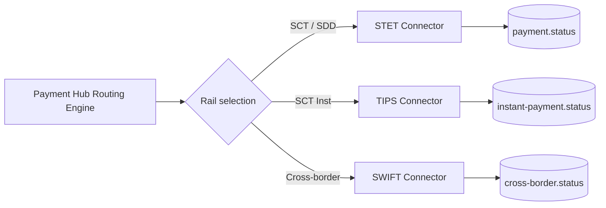

### D. Matrice minimale des events par flux

| Flux | Events minimum |
|---|---|
| SCT | PaymentReceived, PaymentValidated, PaymentMappedToPacs008, PaymentSubmittedToSTET, PaymentAccepted/Rejected, PaymentReportedInCamt054 |
| SDD | DirectDebitReceived, MandateValidated, DirectDebitMappedToPacs003, DirectDebitSubmitted, DirectDebitReturned, DirectDebitReported |
| SCT Inst | InstantPaymentInitiated, InstantPaymentValidated, InstantPaymentSubmittedToTIPS, InstantPaymentAccepted/Rejected/StatusUnknown |
| Cross-border | CrossBorderPaymentReceived, ScreeningPassed/Held, SwiftMessageSent, CrossBorderStatusUpdated, CrossBorderPaymentCompleted |
| Cash Management | StatementAvailable, DebitCreditNotificationAvailable, LiquidityPositionUpdated |

### E. Contrôles de qualité attendus

| Contrôle | Description |
|---|---|
| Markdown | Titres, tableaux, blocs Mermaid et exemples exploitables |
| Mermaid | Diagrammes sans syntaxe exotique ni caractères ambigus |
| Banque | STET, TIPS, SWIFT, ISO 20022, Payment Hub, cash management |
| SRE | SLI/SLO, lag, DLQ, retry, traces, statut inconnu |
| GreenOps | SCI, gCO2e/transaction, CPU, logs, retries, payload |

---

## Conclusion

Ce document complète l’architecture SI du projet `greenops-it-flux-architecture` en positionnant l’EDA comme une couche de modernisation réaliste et gouvernée. L’objectif n’est pas de produire plus d’événements, mais de produire les bons événements, au bon niveau métier, avec les bons identifiants, la bonne gouvernance, et une mesure concrète de leur valeur opérationnelle et carbone.

---

## Annexe F — Exemples obligatoires explicités

### Retry via event + DLQ

Un retry via event + DLQ doit suivre une logique contrôlée : le consumer détecte une erreur transitoire, republie vers un topic de retry avec backoff et compteur, puis bascule en DLQ après seuil. La DLQ contient la cause, le contexte paiement, l’offset, la partition, le consumer group, le `paymentId`, le `EndToEndId`, le `traceId` et la recommandation de traitement. Cette approche évite la boucle infinie et permet de mesurer le coût GreenOps du retry.

### Replay d’un paiement en erreur

Un replay d’un paiement en erreur doit être ciblé. Exemple : un paiement SCT échoue au mapping vers `pacs.008` à cause d’un référentiel BIC incomplet. Après correction, l’équipe publie une demande de reprocessing sur `payment.reprocess.requested.v1` avec le `paymentId`, le ticket incident, la raison, la fenêtre et la garantie que le paiement n’a pas été soumis à STET. Le replay relance uniquement l’étape de mapping, puis produit les preuves d’audit et les métriques GreenOps associées.
