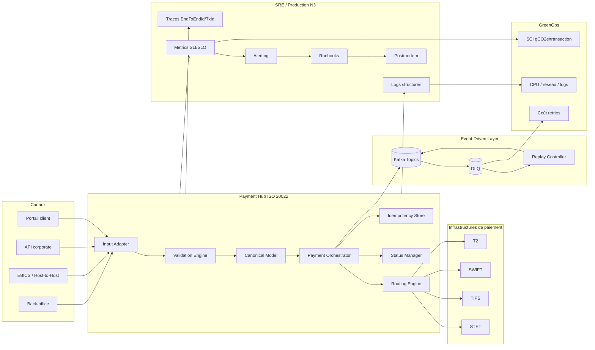
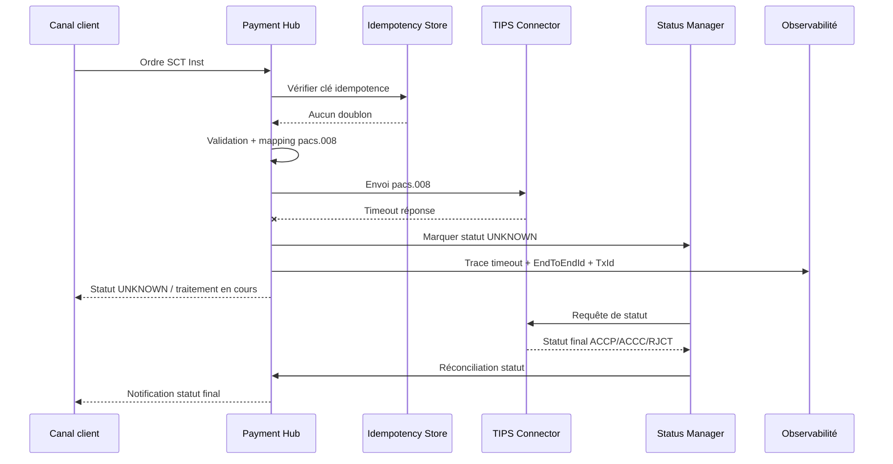
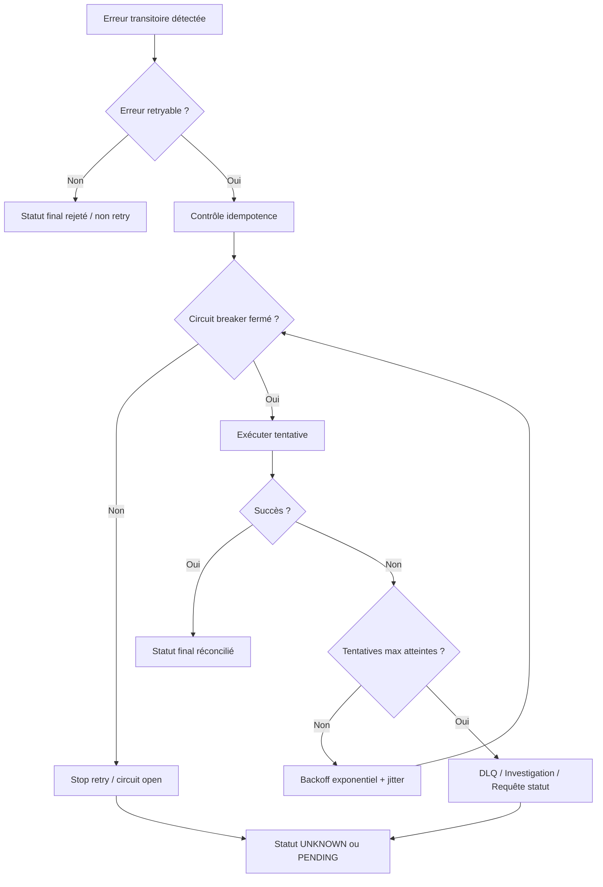
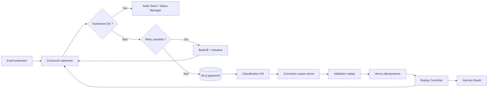
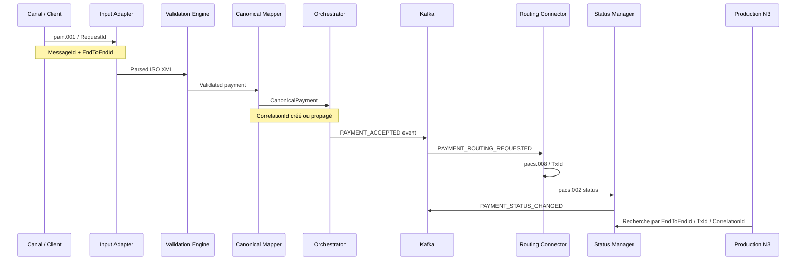
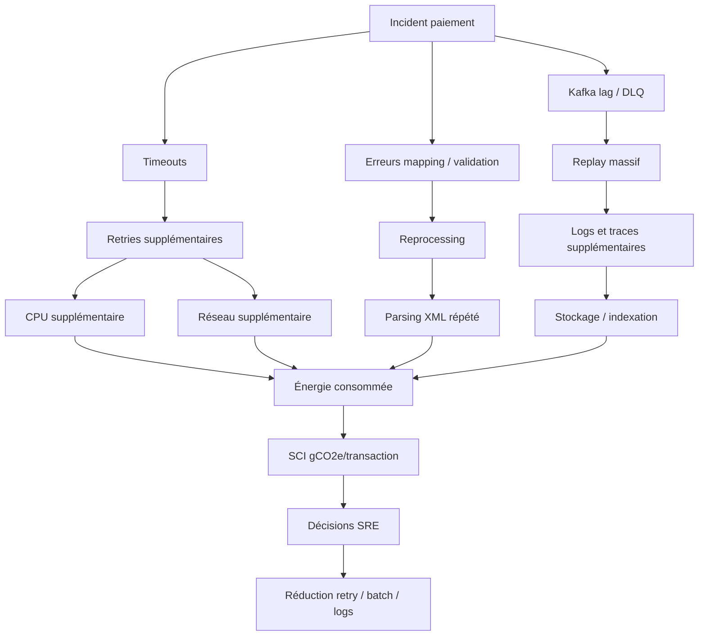
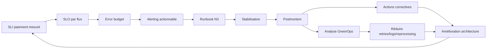
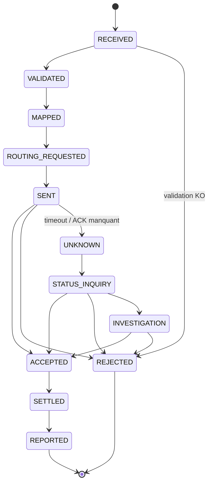
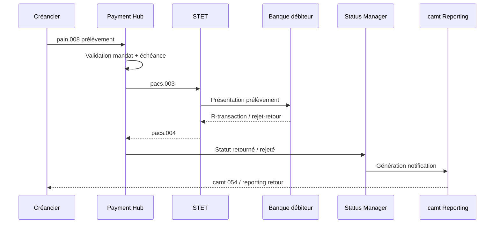

# 05_ARCHITECTURE_SI_05 — Résilience, SRE et production pour une plateforme de paiements bancaires ISO 20022 + GreenOps

> Projet : `greenops-it-flux-architecture`  
> Domaine : Architecture SI — Paiements bancaires critiques  
> Niveau : Architecte solution senior / SRE bancaire / Production N3  
> Périmètre : SCT, SDD, SCT Inst, cross-border, cash management, ISO 20022, Payment Hub, Event-Driven, GreenOps / SCI

---

## Table des matières

1. [Objectif du document](#1-objectif-du-document)
2. [Pourquoi la résilience est critique dans les paiements](#2-pourquoi-la-résilience-est-critique-dans-les-paiements)
3. [Différence entre SLA, SLO, SLI](#3-différence-entre-sla-slo-sli)
4. [SLI/SLO par type de flux](#4-slislos-par-type-de-flux)
5. [Disponibilité 24/7 pour SCT Inst](#5-disponibilité-247-pour-sct-inst)
6. [Gestion des timeouts](#6-gestion-des-timeouts)
7. [Gestion des retries](#7-gestion-des-retries)
8. [Backoff exponentiel](#8-backoff-exponentiel)
9. [Circuit breaker](#9-circuit-breaker)
10. [Idempotence](#10-idempotence)
11. [Statut inconnu](#11-statut-inconnu)
12. [DLQ / Dead Letter Queue](#12-dlq--dead-letter-queue)
13. [Replay contrôlé](#13-replay-contrôlé)
14. [Gestion des doublons](#14-gestion-des-doublons)
15. [Gestion des batchs en erreur](#15-gestion-des-batchs-en-erreur)
16. [Gestion des camt non générés](#16-gestion-des-camt-non-générés)
17. [Observabilité end-to-end](#17-observabilité-end-to-end)
18. [Tracing avec EndToEndId / TxId / CorrelationId](#18-tracing-avec-endtoendid--txid--correlationid)
19. [Alerting production](#19-alerting-production)
20. [Runbooks N3](#20-runbooks-n3)
21. [Postmortem](#21-postmortem)
22. [Error budget](#22-error-budget)
23. [Résilience et GreenOps](#23-résilience-et-greenops)
24. [Anti-patterns](#24-anti-patterns)
25. [Bonnes pratiques](#25-bonnes-pratiques)
26. [Questions d’audit](#26-questions-daudit)
27. [Synthèse architecte](#27-synthèse-architecte)

---

## 1. Objectif du document

Ce document décrit une architecture de résilience, de production et de Site Reliability Engineering pour une plateforme de paiements bancaires moderne, centrée sur un Payment Hub ISO 20022, intégrée à des infrastructures comme STET, TIPS, SWIFT et T2, et pilotée par des objectifs de qualité de service et de réduction d’impact carbone.

L’objectif n’est pas uniquement de rendre la plateforme disponible. L’objectif est de garantir que chaque paiement puisse être accepté, validé, routé, suivi, réconcilié et expliqué, même en cas de panne partielle, de timeout externe, de latence interbancaire, de message ISO rejeté, de doublon, de retard de batch, ou de statut inconnu.

Dans une banque de type BPCE / Natixis, la plateforme de paiements est un système critique car elle porte des flux clients, des flux interbancaires, des flux réglementaires, des flux de trésorerie, des flux cash management, et des flux à forte contrainte temporelle comme SCT Inst. Une mauvaise architecture de résilience produit trois risques majeurs : risque client, risque opérationnel, risque carbone.

Ce document répond aux questions suivantes :

| Question | Réponse attendue dans ce document |
|---|---|
| Comment définir les SLI/SLO d’une plateforme de paiements ? | Par type de flux, canal, infrastructure et criticité métier. |
| Comment éviter les pertes, doublons et statuts incohérents ? | Par idempotence, corrélation, journal d’état, contrôles de replay et réconciliation. |
| Comment traiter un SCT Inst en timeout ? | Par statut `UNKNOWN`, investigation automatisée, requêtes de statut et limitation des retries. |
| Comment industrialiser le support N3 ? | Par runbooks, alertes actionnables, dashboards, traces et postmortems. |
| Comment relier SRE et GreenOps ? | En mesurant les coûts CPU, retry, logs, batchs, DLQ et incidents en gCO2e/transaction. |

Le document complète les fichiers déjà construits :

- `01_PAIEMENTS_BANCAIRES` : typologie SCT, SDD, SCT Inst, cross-border, cash management.
- `02_ISO20022` : messages ISO, mapping, modèle canonique, validation.
- `03_GREENOPS_CARBONE` : SCI, mesure carbone, optimisation.
- `05_ARCHITECTURE_SI/01_overview.md` : vue d’ensemble SI.
- `05_ARCHITECTURE_SI/02_payment_hub.md` : Payment Hub.
- `05_ARCHITECTURE_SI/03_architecture_iso20022.md` : architecture ISO.
- `05_ARCHITECTURE_SI/04_event_driven.md` : architecture event-driven.

---

## 2. Pourquoi la résilience est critique dans les paiements

Un paiement bancaire n’est pas une simple requête applicative. C’est un engagement financier, un objet comptable, un objet réglementaire, un objet de relation client et parfois un objet de liquidité intrajournalière. Une indisponibilité ou une incohérence peut générer des rejets, des frais, des réclamations, des ruptures de trésorerie, des incidents de production, ou des risques de non-conformité.

La résilience doit couvrir plusieurs dimensions :

| Dimension | Exemple de risque | Réponse d’architecture |
|---|---|---|
| Disponibilité | SCT Inst indisponible hors heures ouvrées | Architecture 24/7, supervision temps réel, astreinte, capacité de bascule. |
| Intégrité | Paiement débité deux fois | Idempotence forte, clé fonctionnelle, contrôle de doublon. |
| Traçabilité | Impossible de retrouver un `pain.001` après transformation | Corrélation `MessageId`, `EndToEndId`, `TxId`, `CorrelationId`. |
| Cohérence d’état | Statut banque différent du statut interbancaire | State machine, statut `UNKNOWN`, réconciliation. |
| Performance | XML ISO 20022 trop coûteux en parsing | Streaming XML, validation anticipée, mapping optimisé. |
| Exploitabilité | N3 sans preuve ni chemin de diagnostic | Runbooks, dashboards, logs structurés, traces. |
| Carbone | Retry storm et logs massifs | Budgets de retry, sampling, métriques SCI. |

La difficulté majeure vient du fait que les paiements combinent des systèmes synchrones et asynchrones. Un canal client peut attendre une réponse rapide, le Payment Hub peut orchestrer plusieurs étapes, l’infrastructure externe peut répondre avec un délai variable, et le reporting client peut arriver plus tard via `camt.054`, `camt.053` ou notifications propriétaires.

### 2.1 Résilience bancaire vs résilience applicative classique

| Résilience applicative classique | Résilience paiement bancaire |
|---|---|
| Réessayer une requête en échec | Réessayer sans créer de doublon financier. |
| Retourner une erreur HTTP | Conserver un statut métier explicable. |
| Rejouer un message | Rejouer avec contrôle comptable et preuve d’unicité. |
| Purger une file d’erreur | Analyser impact client, montant, devise, cut-off, infrastructure. |
| Optimiser latence moyenne | Garantir percentile, cut-off, SLA interbancaire et statut final. |

Dans un contexte bancaire, la question centrale n’est pas seulement : « le service répond-il ? ». La question est : « le paiement est-il dans un état fiable, traçable, non dupliqué, conforme et réconciliable ? ».

---

## 3. Différence entre SLA, SLO, SLI

La discipline SRE impose de distinguer clairement trois niveaux :

| Concept | Définition | Exemple paiement |
|---|---|---|
| SLA | Engagement contractuel ou réglementaire envers un client ou une entité métier. | Disponibilité SCT Inst 99,95 % mensuelle. |
| SLO | Objectif interne de fiabilité, plus précis et pilotable. | 99,9 % des paiements SCT Inst obtiennent un statut final en moins de 10 secondes. |
| SLI | Mesure technique ou métier permettant de suivre le SLO. | Ratio de `pacs.008` avec statut final `ACSP/ACCC/RJCT` sous 10 secondes. |

### 3.1 Exemple complet SCT Inst

| Niveau | Formulation |
|---|---|
| SLA | La banque permet l’émission de virements instantanés 24/7 avec un service hautement disponible. |
| SLO | 99,9 % des SCT Inst éligibles doivent obtenir une réponse finale ou contrôlée en moins de 10 secondes. |
| SLI | `count(SCT_INST status in [ACSP, ACCC, RJCT] within 10s) / count(SCT_INST accepted for routing)` |
| Error budget | 0,1 % de transactions hors objectif sur la fenêtre mensuelle. |
| Action SRE | Si consommation de budget > 50 % en 7 jours, gel des changements non critiques. |

### 3.2 Bonnes pratiques de définition

Un bon SLI doit être :

- mesurable automatiquement ;
- compréhensible par les équipes métier, production et architecture ;
- corrélé à l’expérience client ;
- relié à un type de flux précis ;
- robuste aux variations de volumétrie ;
- exploitable pour déclencher alerting, runbook et postmortem.

Un mauvais SLI est une métrique technique isolée, par exemple « CPU moyen à 70 % », sans lien avec le nombre de paiements en statut final, les rejets, les retards ou l’impact client.

---

## 4. SLI/SLO par type de flux

Les objectifs de fiabilité ne peuvent pas être identiques pour SCT, SDD, SCT Inst, cross-border et cash management. Chaque flux a sa temporalité, sa criticité, son infrastructure, son modèle de statut et ses contraintes d’exploitation.

### 4.1 Tableau de référence SLI/SLO

| Flux | Nature | SLI principal | SLO recommandé | Commentaire production |
|---|---|---|---|---|
| SCT | Virement SEPA classique | % paiements routés avant cut-off | 99,5 % avant cut-off cible | Critique sur batchs, cut-off, rejets partiels. |
| SDD | Prélèvement SEPA | % lots validés et transmis dans la fenêtre | 99,5 % avant échéance | Forte contrainte calendrier, R-transactions. |
| SCT Inst | Instantané 24/7 | % statuts finaux sous 10 s | 99,9 % sous 10 s | Latence et statut inconnu critiques. |
| Cross-border | International | % paiements avec statut traçable | 99 % statut initial sous délai cible | AML, SWIFT, UETR, correspondants. |
| Cash management | Reporting / trésorerie | % relevés générés à l’heure | 99,5 % camt disponibles avant heure cible | Forte dépendance camt.053/camt.054. |

### 4.2 SLI par couche d’architecture

| Couche | Exemple SLI | Rôle |
|---|---|---|
| Canal | Taux d’acceptation `pain.001` valide | Mesure expérience client / partenaire. |
| Input Adapter | Taux de parsing XML réussi | Détecte erreurs format / version. |
| Validation Engine | Taux de validation métier réussie | Détecte IBAN, BIC, cut-off, montant, sanctions préalables. |
| Canonical Mapper | Taux de mapping sans erreur | Mesure robustesse transformation ISO ↔ canonique. |
| Orchestrator | Durée moyenne par étape | Identifie lenteurs internes. |
| Routing Engine | Taux de routage correct | Vérifie STET/TIPS/SWIFT/T2. |
| Connectors | Taux de réponse infrastructure | Suit disponibilité externe. |
| Status Manager | Délai de statut final | Mesure cohérence métier. |
| Kafka / Event-driven | Consumer lag et taux DLQ | Mesure découplage et retard. |
| GreenOps | gCO2e/transaction | Mesure coût environnemental du flux. |

### 4.3 Diagramme — architecture résilience globale



---

## 5. Disponibilité 24/7 pour SCT Inst

SCT Inst est le flux le plus exigeant du périmètre SEPA car il impose une disponibilité continue et une réponse quasi temps réel. Contrairement au SCT batch, il ne peut pas s’appuyer sur une fenêtre de rattrapage nocturne ou sur une tolérance longue au retard. Le système doit être capable de recevoir, valider, router, suivre et réconcilier un paiement à toute heure.

### 5.1 Exigences spécifiques

| Exigence | Implication architecture |
|---|---|
| 24/7 | Pas de fenêtre de maintenance bloquante sur le chemin critique. |
| Temps réel | Latence maîtrisée sur parsing, validation, mapping, routage. |
| Statut rapide | Réponse finale ou contrôlée sous délai court. |
| Incertitude externe | Gestion du statut `UNKNOWN` si TIPS ou connecteur ne répond pas. |
| Non-duplication | Idempotence stricte avant tout retry. |
| Observabilité | Trace complète par `EndToEndId`, `TxId`, `CorrelationId`. |

### 5.2 Architecture de disponibilité

Pour soutenir le SCT Inst, le Payment Hub doit être déployé sur une architecture hautement disponible :

- plusieurs instances stateless pour les adapters, validators et orchestrators ;
- stockage transactionnel répliqué pour idempotence et état de paiement ;
- connecteurs TIPS redondants ;
- files ou topics Kafka répliqués ;
- supervision active depuis plusieurs sondes ;
- procédure de bascule contrôlée ;
- freeze de changements pendant périodes sensibles ;
- capacité de dégradation maîtrisée, sans perte de statut.

### 5.3 Stratégie de dégradation

| Incident | Dégradation acceptable | Dégradation interdite |
|---|---|---|
| Latence TIPS élevée | Passage en statut `PENDING/UNKNOWN` avec investigation | Retry illimité ou double émission. |
| Validation AML lente | File d’attente priorisée selon criticité | Acceptation sans contrôle obligatoire. |
| Kafka lag | Priorisation SCT Inst, ralentissement flux non critiques | Perte d’événements de statut. |
| Base idempotence lente | Circuit breaker émission | Traitement sans contrôle de doublon. |
| Observabilité partielle | Mode minimal logs + métriques critiques | Paiements non traçables. |

---

## 6. Gestion des timeouts

Un timeout est un événement d’incertitude. Dans un système de paiement, un timeout ne signifie pas que le paiement a échoué. Il signifie que la plateforme n’a pas reçu de réponse dans la fenêtre attendue. La mauvaise réaction consiste à renvoyer immédiatement le paiement. La bonne réaction consiste à préserver l’état, interroger le statut, corréler avec l’infrastructure et appliquer une politique de retry contrôlée.

### 6.1 Typologie des timeouts

| Type de timeout | Exemple | Risque | Réponse attendue |
|---|---|---|---|
| Timeout canal | API client coupe la connexion | Client pense que le paiement a échoué | Continuer traitement si accepté, exposer statut par API. |
| Timeout validation | AML/sanctions ne répond pas | Paiement bloqué | Statut `PENDING_VALIDATION`, retry contrôlé. |
| Timeout infrastructure | TIPS/STET/SWIFT ne répond pas | Statut inconnu | Statut `UNKNOWN`, requête de statut, pas de double envoi. |
| Timeout base | Idempotency store lent | Risque doublon | Stopper émission, circuit breaker. |
| Timeout Kafka | Publication événement lente | Décorrélation état/event | Outbox transactionnelle, retry technique. |

### 6.2 Exemple obligatoire — SCT Inst avec timeout et statut UNKNOWN

Cas : un client initie un SCT Inst depuis un canal mobile ou corporate API. Le Payment Hub transforme le message en instruction interbancaire, route vers TIPS, mais le connecteur ne reçoit pas de réponse dans la fenêtre cible.

| Étape | État | Décision |
|---|---|---|
| 1 | `pain.001` ou ordre API reçu | Contrôle format, client, plafond, IBAN. |
| 2 | Mapping canonique puis `pacs.008` | Création `EndToEndId`, `TxId`, `CorrelationId`. |
| 3 | Envoi vers TIPS | État `SENT_TO_TIPS`. |
| 4 | Timeout connecteur | Ne pas conclure rejet. |
| 5 | Statut interne | Passer à `UNKNOWN`. |
| 6 | Requête de statut | Interroger TIPS / statut interbancaire. |
| 7 | Réponse tardive reçue | Réconcilier avec paiement initial. |
| 8 | Notification client | `ACCC`, `RJCT` ou `UNKNOWN_UNDER_INVESTIGATION`. |

### 6.3 Diagramme — flux SCT Inst avec timeout/statut inconnu



### 6.4 Règles de décision timeout

| Règle | Description |
|---|---|
| R1 | Un timeout ne déclenche jamais un second envoi financier sans preuve que le premier n’a pas été pris en compte. |
| R2 | Tout timeout infrastructure doit produire une trace corrélée et un événement de statut. |
| R3 | Le statut `UNKNOWN` doit être visible dans les dashboards et dans les API de consultation. |
| R4 | Les retries techniques doivent être séparés des retries fonctionnels. |
| R5 | Le N3 doit disposer d’un runbook spécifique par infrastructure : STET, TIPS, SWIFT, T2. |

---

## 7. Gestion des retries

Le retry est utile pour absorber des erreurs transitoires, mais dangereux lorsqu’il est appliqué sans limite. Dans une plateforme de paiements, un retry mal conçu peut créer des doublons, saturer une infrastructure, augmenter la latence, consommer l’error budget et dégrader le bilan carbone.

### 7.1 Types de retries

| Type | Exemple | Autorisé ? | Condition |
|---|---|---|---|
| Retry technique local | Échec temporaire publication Kafka | Oui | Idempotence technique et outbox. |
| Retry connecteur | Connexion STET/TIPS perdue avant envoi confirmé | Oui | Preuve absence d’acceptation. |
| Retry métier | Paiement rejeté pour IBAN invalide | Non | Le rejet est final. |
| Retry statut | Interroger statut après timeout | Oui | Sans réémettre le paiement. |
| Retry batch | Reprendre uniquement les lignes en erreur | Oui | Contrôle de doublon par transaction. |

### 7.2 Politique de retry recommandée

| Paramètre | Valeur indicative | Justification |
|---|---|---|
| Nombre maximal | 3 à 5 selon criticité | Évite retry storm. |
| Backoff | Exponentiel + jitter | Évite synchronisation massive. |
| Timeout par tentative | Court et mesuré | Préserve latence globale. |
| Circuit breaker | Obligatoire sur dépendance externe | Protège infrastructure. |
| Traçabilité | Obligatoire | Chaque tentative doit être corrélée. |
| GreenOps | Mesure coût retry | gCO2e retry / gCO2e transaction. |

### 7.3 Exemple de retry contrôlé

```text
Tentative 1 : appel connecteur TIPS, timeout à 2s
Tentative 2 : après 500ms + jitter, vérification statut avant réémission
Tentative 3 : après 1s + jitter, uniquement si aucune preuve d’acceptation
Circuit open : si taux timeout > seuil sur fenêtre 1 minute
Statut métier : UNKNOWN ou PENDING_INVESTIGATION
```

---

## 8. Backoff exponentiel

Le backoff exponentiel augmente le délai entre deux tentatives afin de laisser le système dépendant récupérer. Le jitter ajoute une variation aléatoire pour éviter que tous les traitements relancent au même moment.

### 8.1 Formule opérationnelle

```text
next_delay = min(base_delay * 2^attempt + random_jitter, max_delay)
```

Exemple :

| Tentative | Délai sans jitter | Délai avec jitter | Décision |
|---|---:|---:|---|
| 1 | 500 ms | 530 ms | Retry rapide. |
| 2 | 1 000 ms | 1 140 ms | Retry contrôlé. |
| 3 | 2 000 ms | 2 260 ms | Dernière tentative. |
| 4 | 4 000 ms | Non exécutée | Passage circuit open / DLQ / UNKNOWN. |

### 8.2 Diagramme — retry + backoff + circuit breaker



### 8.3 Critères d’arrêt

Un retry doit s’arrêter si :

- le paiement a reçu un statut final ;
- l’infrastructure a confirmé une prise en charge ;
- l’erreur est fonctionnelle et non technique ;
- le nombre maximal de tentatives est atteint ;
- le circuit breaker est ouvert ;
- le retry consomme trop d’error budget ;
- le coût carbone marginal devient disproportionné.

---

## 9. Circuit breaker

Le circuit breaker protège la plateforme contre une dépendance dégradée. Il empêche le Payment Hub d’insister sur un connecteur STET, TIPS, SWIFT ou T2 lorsque celui-ci montre des signes de panne ou de latence excessive.

### 9.1 États du circuit breaker

| État | Description | Action paiement |
|---|---|---|
| Closed | La dépendance fonctionne | Appels autorisés. |
| Open | La dépendance est considérée indisponible | Appels bloqués, statut pending/unknown, file d’attente contrôlée. |
| Half-open | Test de reprise | Quelques appels de test autorisés. |

### 9.2 Paramètres par infrastructure

| Infrastructure | Seuil ouverture | Half-open | Action métier |
|---|---|---|---|
| STET | 5 % erreurs ou latence P95 > seuil | Test périodique | Retenir flux SCT/SDD ou bascule selon politique. |
| TIPS | Timeouts répétés sur fenêtre courte | Test très contrôlé | SCT Inst en mode dégradé / statut unknown. |
| SWIFT | Erreurs connectivité ou ACK manquant | Test par message non financier si possible | Suspendre ou mettre en file contrôlée. |
| T2 | Latence settlement / indisponibilité | Test production encadré | Bloquer opérations dépendantes. |

### 9.3 Exemple obligatoire — retry storm évité par circuit breaker

Situation : une latence TIPS augmente fortement. Sans circuit breaker, 10 000 SCT Inst génèrent 3 retries chacun, soit 30 000 appels supplémentaires. Le système aggrave la panne et multiplie les statuts inconnus.

Avec circuit breaker :

1. Le taux de timeout dépasse le seuil.
2. Le circuit passe `OPEN`.
3. Les nouveaux paiements ne sont pas envoyés aveuglément.
4. Les statuts passent en attente contrôlée ou mode indisponibilité selon règle métier.
5. Une sonde half-open teste la reprise.
6. Les paiements reprennent progressivement.
7. Le coût CPU, réseau, logs et carbone est maîtrisé.

---

## 10. Idempotence

L’idempotence garantit qu’une même demande de paiement traitée plusieurs fois ne produit pas plusieurs effets financiers. Elle est centrale pour les retries, les timeouts, les replays, les doublons canal, les batchs en erreur et les événements Kafka.

### 10.1 Clés d’idempotence

| Niveau | Clé possible | Usage |
|---|---|---|
| Canal | `ClientId + RequestId` | Évite double soumission API. |
| ISO client | `MessageId + PaymentInformationId + EndToEndId` | Contrôle pain.001 / pain.008. |
| Transaction | `EndToEndId + DebtorAccount + CreditorAccount + Amount + Currency` | Détection doublon métier. |
| Interbancaire | `TxId` | Corrélation pacs.008/pacs.002. |
| Cross-border | `UETR` | Suivi SWIFT gpi. |
| Event-driven | `eventId + aggregateId + version` | Consommation Kafka exactly-once logique. |

### 10.2 États idempotence

| État | Signification | Action |
|---|---|---|
| `NEW` | Première réception | Continuer traitement. |
| `IN_PROGRESS` | Paiement déjà en cours | Retourner statut courant. |
| `SENT` | Paiement envoyé infrastructure | Ne pas réémettre sans statut. |
| `FINAL` | Statut final connu | Retourner résultat existant. |
| `UNKNOWN` | Statut incertain | Lancer investigation, pas de doublon. |
| `REPLAY_LOCKED` | Replay en cours | Bloquer actions concurrentes. |

### 10.3 Règle fondamentale

> Le contrôle d’idempotence doit être effectué avant toute action irréversible : débit, réservation de liquidité, émission interbancaire, génération de fichier sortant ou publication d’un événement financier final.

### 10.4 Exemple technique

```text
idempotency_key = hash(
  channel_id,
  debtor_iban,
  creditor_iban,
  amount,
  currency,
  requested_execution_date,
  end_to_end_id
)
```

Cette clé doit être stockée avec :

- statut courant ;
- version de traitement ;
- timestamp ;
- hash du payload ;
- dernier événement émis ;
- identifiant de trace ;
- résultat retourné au canal.

---

## 11. Statut inconnu

Le statut inconnu est un état métier légitime. Il apparaît lorsque le Payment Hub ne peut pas conclure si le paiement a été accepté, rejeté, compensé ou réglé. Le statut inconnu doit être modélisé explicitement, surveillé et résolu.

### 11.1 Sources de statut inconnu

| Source | Exemple |
|---|---|
| Timeout infrastructure | TIPS ne répond pas après envoi. |
| ACK manquant | SWIFT ne retourne pas ACK/NACK attendu. |
| Réponse tardive | `pacs.002` reçu après expiration canal. |
| Incident status manager | Statut final non propagé. |
| Décorrélation event/state | Événement Kafka consommé mais état non mis à jour. |
| Batch partiel | Une ligne du fichier n’a pas de statut final. |

### 11.2 Gestion du statut inconnu

| Étape | Action |
|---|---|
| Détection | Timeout, absence de statut, incohérence de trace. |
| Marquage | Statut interne `UNKNOWN`. |
| Gel | Empêcher double émission. |
| Investigation automatique | Query statut, rapprochement camt/pacs, recherche ACK. |
| Escalade N3 | Si délai de résolution dépassé. |
| Résolution | Passer à statut final ou incident confirmé. |
| Postmortem | Si impact client ou error budget consommé. |

### 11.3 SLI associé

```text
unknown_status_ratio = count(payments status UNKNOWN > threshold) / count(payments routed)
```

SLO recommandé :

| Flux | SLO statut inconnu |
|---|---|
| SCT Inst | < 0,05 % sur fenêtre 24h, résolution prioritaire. |
| SCT | < 0,1 % sur cycle cut-off. |
| SDD | < 0,1 % par batch / échéance. |
| Cross-border | Selon correspondent banking, suivi par UETR. |

---

## 12. DLQ / Dead Letter Queue

La DLQ est un mécanisme de confinement des messages ou événements qui ne peuvent pas être traités automatiquement. Dans un système bancaire, la DLQ ne doit pas être une poubelle technique. Elle doit être une zone contrôlée, auditée, priorisée et reliée à un processus N3.

### 12.1 Causes d’entrée en DLQ

| Cause | Exemple | Action |
|---|---|---|
| Message invalide | XML ISO non conforme XSD | Rejet fonctionnel ou correction source. |
| Mapping impossible | Champ obligatoire absent | Analyse mapping / modèle canonique. |
| Erreur technique persistante | Connecteur indisponible après retries | Investigation infrastructure. |
| Conflit d’idempotence | Hash payload différent pour même clé | Blocage et analyse fraude/erreur. |
| Statut incohérent | `pacs.002` reçu sans paiement connu | Réconciliation manuelle/automatisée. |
| Échec génération camt | Données statut incomplètes | Réexécution contrôlée reporting. |

### 12.2 Règles de gouvernance DLQ

| Règle | Description |
|---|---|
| R1 | Chaque entrée DLQ doit avoir un motif normalisé. |
| R2 | Chaque entrée DLQ doit avoir un propriétaire : applicatif, infrastructure, métier ou N3. |
| R3 | Les DLQ financières doivent être chiffrées, auditées et soumises à rétention. |
| R4 | Un replay depuis DLQ doit être autorisé, tracé et idempotent. |
| R5 | Les métriques DLQ doivent alimenter SLO, error budget et GreenOps. |

### 12.3 Diagramme — DLQ + replay contrôlé



---

## 13. Replay contrôlé

Le replay permet de retraiter un paiement, un événement ou un statut après correction d’une cause d’échec. Il est indispensable dans une architecture event-driven mais doit être strictement contrôlé.

### 13.1 Ce qu’un replay ne doit jamais faire

Un replay ne doit jamais :

- recréer un débit déjà exécuté ;
- renvoyer un paiement déjà accepté par STET/TIPS/SWIFT ;
- changer un statut final sans justification ;
- contourner une validation AML ou conformité ;
- modifier une trace sans audit ;
- effacer l’historique de l’échec initial.

### 13.2 Types de replay

| Type | Exemple | Risque | Contrôle |
|---|---|---|---|
| Replay technique | Reconsommer un event Kafka | Double update état | Version aggregate + idempotence. |
| Replay mapping | Rejouer transformation ISO → canonique | Statut divergent | Hash payload + version mapping. |
| Replay reporting | Regénérer camt.054 | Notification doublon | Contrôle notification déjà envoyée. |
| Replay batch | Reprendre lignes rejetées | Double paiement | Clé par transaction. |
| Replay cross-border | Réconcilier ACK SWIFT | Statut erroné | UETR + ACK/NACK + audit. |

### 13.3 Exemple obligatoire — replay contrôlé depuis DLQ

Cas : un `pacs.002` est arrivé mais n’a pas pu être traité car le `TxId` n’était pas reconnu temporairement à cause d’un retard de réplication.

Procédure :

1. L’événement est placé en DLQ avec motif `UNKNOWN_TXID`.
2. Le N3 vérifie que le paiement initial existe dans le Payment Hub.
3. Le N3 confirme que le `TxId` correspond au bon `EndToEndId`.
4. Le replay est demandé via un outil contrôlé.
5. Le replay prend un verrou idempotent.
6. Le consumer retraite l’événement.
7. Le Status Manager met à jour le statut.
8. Un audit trail conserve l’échec initial et le replay.

---

## 14. Gestion des doublons

La gestion des doublons est un sujet critique dans les paiements car les doublons peuvent provenir du client, du canal, du réseau, du batch, de Kafka, d’un retry ou d’un replay.

### 14.1 Sources de doublons

| Source | Exemple |
|---|---|
| Client | Double clic sur ordre de paiement. |
| API | Timeout client puis réémission. |
| EBICS | Fichier transmis deux fois. |
| Batch | Relance complète d’un fichier partiellement traité. |
| Kafka | Reconsommation après rebalance. |
| Connecteur | Retry après ACK perdu. |
| Reporting | camt généré deux fois. |

### 14.2 Stratégie de détection

| Niveau | Contrôle |
|---|---|
| Syntaxique | Même `MessageId`, même fichier, même hash. |
| Fonctionnel | Même débiteur, créancier, montant, date, EndToEndId. |
| Technique | Même eventId ou offset déjà traité. |
| Interbancaire | Même TxId ou UETR. |
| Reporting | Même notification camt pour même transaction. |

### 14.3 Décision métier doublon

| Cas | Décision |
|---|---|
| Même payload, même clé, traitement en cours | Retourner statut courant. |
| Même payload, statut final | Retourner résultat final existant. |
| Même clé, payload différent | Bloquer et escalader. |
| Doublon batch partiel | Retraiter seulement les transactions non finales. |
| Doublon suspect | Alerte fraude / conformité si nécessaire. |

---

## 15. Gestion des batchs en erreur

Les batchs restent importants dans les paiements : SCT de masse, SDD, fichiers corporate, reporting camt, traitements de cut-off, rapprochements et cash management. L’architecture moderne ne supprime pas les batchs ; elle les rend observables, segmentables et rejouables finement.

### 15.1 Exemple obligatoire — batch SCT rejeté partiellement

Cas : un fichier `pain.001` contient 10 000 transactions SCT. Le fichier est syntaxiquement valide, mais 320 transactions sont rejetées pour causes métier : IBAN invalide, créancier non éligible, date d’exécution dépassée, montant supérieur au plafond.

| Étape | Traitement attendu |
|---|---|
| Parsing fichier | Acceptation du fichier global si structure correcte. |
| Validation lot | Contrôle `GroupHeader`, `PaymentInformation`. |
| Validation transaction | Contrôle transaction par transaction. |
| Séparation | Transactions valides vers routage, invalides vers rejet. |
| Statut client | `pain.002` avec détail des rejets. |
| Observabilité | Compteurs valides/rejetées par motif. |
| GreenOps | Éviter relance complète du fichier. |

### 15.2 Anti-retry batch complet

Le piège classique consiste à relancer tout le fichier après correction de quelques transactions. C’est coûteux, risqué et polluant. La bonne approche consiste à :

- découper le batch en unités transactionnelles ;
- stocker un statut par transaction ;
- isoler les erreurs ;
- produire un retour détaillé ;
- permettre une correction ciblée ;
- éviter de retraiter les 9 680 transactions déjà valides.

### 15.3 SLI batch

| SLI | Définition |
|---|---|
| `batch_acceptance_rate` | % batchs acceptés syntaxiquement. |
| `transaction_rejection_rate` | % transactions rejetées métier. |
| `partial_replay_rate` | % reprises ciblées vs relances complètes. |
| `cutoff_success_rate` | % transactions transmises avant cut-off. |
| `batch_carbon_cost` | gCO2e par batch ou par 1 000 transactions. |

---

## 16. Gestion des camt non générés

Les messages `camt` sont essentiels pour le reporting, la trésorerie, la réconciliation et l’information client. Un paiement exécuté mais non reporté peut devenir un incident majeur, car le client ou le système comptable ne voit pas le mouvement attendu.

### 16.1 camt.053 vs camt.054

| Message | Rôle | Risque en cas de non-génération |
|---|---|---|
| `camt.053` | Relevé de compte périodique | Retard comptable, trésorerie incomplète. |
| `camt.054` | Notification de débit/crédit | Client non informé, rapprochement impossible. |

### 16.2 Exemple obligatoire — camt.054 non généré

Cas : un SCT entrant est accepté et crédité, mais la notification `camt.054` n’est pas générée à cause d’un échec du Status Manager ou du reporting service.

Conséquences :

- le compte peut être correct mais l’information client absente ;
- le cash management ne reçoit pas le mouvement ;
- un client corporate peut relancer ou ouvrir une réclamation ;
- les équipes N3 doivent prouver que le paiement est bien exécuté.

Procédure de résolution :

1. Rechercher le paiement par `EndToEndId`, `TxId` ou compte.
2. Vérifier statut final dans Payment Hub.
3. Vérifier événement de crédit ou statut `ACCC`.
4. Vérifier journal de génération camt.
5. Vérifier si notification déjà envoyée.
6. Regénérer `camt.054` avec verrou de non-duplication.
7. Publier l’événement de reporting.
8. Tracer l’action dans l’audit.

### 16.3 Contrôle de non-duplication camt

| Clé | Utilité |
|---|---|
| `AccountId + EntryReference + TxId` | Évite double notification. |
| `StatementId + SequenceNumber` | Contrôle camt.053. |
| `NotificationId + TxId` | Contrôle camt.054. |
| `GenerationRunId` | Audit de batch reporting. |

---

## 17. Observabilité end-to-end

L’observabilité doit permettre de répondre rapidement à trois questions :

1. Où est le paiement ?
2. Dans quel état est-il ?
3. Pourquoi est-il dans cet état ?

Une plateforme de paiements ne peut pas se contenter de métriques techniques. Elle doit fournir une observabilité métier et technique corrélée.

### 17.1 Piliers d’observabilité

| Pilier | Contenu | Exemple paiement |
|---|---|---|
| Metrics | Compteurs, latence, ratios | P95 SCT Inst, taux RJCT, DLQ count. |
| Logs | Événements structurés | `payment.status.changed`, `iso.validation.failed`. |
| Traces | Chaîne d’appels | Canal → Hub → Kafka → TIPS → Status. |
| Events métier | Transitions d’état | `PAYMENT_ACCEPTED`, `PAYMENT_ROUTED`, `PAYMENT_SETTLED`. |
| Audit | Preuves non répudiables | Qui a rejoué quoi, quand, pourquoi. |

### 17.2 Logs structurés recommandés

```json
{
  "timestamp": "2026-04-27T08:15:00.000Z",
  "service": "payment-orchestrator",
  "event": "PAYMENT_STATUS_CHANGED",
  "flowType": "SCT_INST",
  "messageType": "pacs.008",
  "messageId": "MSG-20260427-0001",
  "endToEndId": "E2E-987654",
  "txId": "TX-123456",
  "correlationId": "CORR-abcdef",
  "previousStatus": "SENT_TO_TIPS",
  "newStatus": "UNKNOWN",
  "reason": "TIPS_TIMEOUT",
  "retryAttempt": 2,
  "latencyMs": 2350,
  "carbonEstimateMgCO2e": 18.4
}
```

### 17.3 Dashboards indispensables

| Dashboard | Public cible | Contenu |
|---|---|---|
| Executive Payment Health | Direction / pilotage | Disponibilité, volumes, incidents majeurs, SLO. |
| SRE Payment Operations | Production N2/N3 | Latence, erreurs, DLQ, retries, circuit breaker. |
| ISO 20022 Quality | Architecture / métier | erreurs XSD, mapping, versions, statuts. |
| SCT Inst Real-Time | Astreinte | P95/P99, unknown, TIPS timeout, statut final. |
| GreenOps Payment | GreenOps / FinOps | gCO2e/transaction, retry cost, logs cost, CPU. |

---

## 18. Tracing avec EndToEndId / TxId / CorrelationId

La corrélation est le socle du diagnostic. Dans les paiements ISO 20022, plusieurs identifiants coexistent et ne doivent pas être confondus.

### 18.1 Rôle des identifiants

| Identifiant | Origine | Rôle |
|---|---|---|
| `MessageId` | Message ISO / lot | Identifie un message ou fichier. |
| `EndToEndId` | Client / initiateur | Suit une transaction de bout en bout côté client. |
| `TxId` | Interbancaire / Payment Hub | Suit transaction dans les échanges pacs. |
| `UETR` | SWIFT cross-border | Traçabilité internationale gpi. |
| `CorrelationId` | Plateforme | Relie logs, traces, events, API calls. |
| `EventId` | Event-driven | Identifie un événement Kafka. |

### 18.2 Diagramme — tracing end-to-end



### 18.3 Matrice de recherche N3

| Symptôme | Identifiant prioritaire | Recherche secondaire |
|---|---|---|
| Client ne voit pas son paiement | `EndToEndId` | compte, montant, date. |
| Infrastructure a envoyé un rejet | `TxId` | `MessageId`, `pacs.002`. |
| Cross-border bloqué | `UETR` | SWIFT ACK/NACK, correspondent. |
| API timeout | `CorrelationId` | `RequestId`, logs gateway. |
| camt manquant | `TxId` ou `EntryReference` | Status Manager, reporting run. |
| Event DLQ | `EventId` | aggregateId, offset Kafka. |

---

## 19. Alerting production

L’alerting doit être actionnable. Une alerte qui ne déclenche aucune action claire doit être supprimée, transformée ou reléguée en signal dashboard. En paiement, les alertes doivent combiner métriques techniques et impact métier.

### 19.1 Principes

| Principe | Description |
|---|---|
| Orienté SLO | Alerter sur la consommation d’error budget, pas seulement CPU. |
| Orienté flux | SCT Inst n’a pas les mêmes seuils que SDD batch. |
| Actionnable | Chaque alerte pointe vers un runbook. |
| Corrélé | Regrouper erreurs liées à un même incident. |
| Anti-bruit | Éviter alertes par transaction individuelle sauf criticité. |
| GreenOps | Alerter sur retry storm, logs storm, batch replay massif. |

### 19.2 Catalogue d’alertes critiques

| Alerte | Condition | Sévérité | Runbook |
|---|---|---|---|
| SCT Inst P99 latency high | P99 > seuil sur 5 min | P1 | Runbook SCT Inst latence. |
| Unknown status spike | UNKNOWN ratio > seuil | P1/P2 | Runbook statut inconnu. |
| TIPS timeout rate | timeout > seuil | P1 | Runbook TIPS. |
| DLQ growth | DLQ augmente continuellement | P2 | Runbook DLQ. |
| camt.054 generation failure | génération KO sur fenêtre | P2 | Runbook reporting camt. |
| Circuit breaker open | STET/TIPS/SWIFT circuit open | P1/P2 | Runbook dépendance externe. |
| Retry storm detected | retries/transaction > seuil | P1 | Runbook retry storm. |
| Carbon cost anomaly | gCO2e/transaction > baseline + seuil | P3/P2 | Runbook GreenOps. |

### 19.3 Exemple PromQL indicatif

```promql
sum(rate(payment_status_total{status="UNKNOWN", flow="SCT_INST"}[5m]))
/
sum(rate(payment_routed_total{flow="SCT_INST"}[5m])) > 0.0005
```

```promql
histogram_quantile(0.99,
  sum(rate(payment_latency_seconds_bucket{flow="SCT_INST"}[5m])) by (le)
) > 8
```

```promql
sum(rate(payment_retry_total[5m]))
/
sum(rate(payment_transaction_total[5m])) > 0.2
```

---

## 20. Runbooks N3

Un runbook N3 doit permettre à un expert de production de diagnostiquer et stabiliser un incident sans improvisation. Il doit être court dans l’action, mais riche en liens, commandes, dashboards, requêtes et critères de décision.

### 20.1 Structure standard d’un runbook paiement

| Section | Contenu |
|---|---|
| Symptôme | Alerte ou signal utilisateur. |
| Impact | Flux, clients, montants, infrastructure. |
| Sévérité | P1/P2/P3 selon impact. |
| Dashboards | Liens dashboards SRE / métier / GreenOps. |
| Requêtes | SQL, PromQL, logs, traces. |
| Diagnostic | Étapes ordonnées. |
| Stabilisation | Actions non destructives. |
| Correction | Actions applicatives/infrastructure. |
| Communication | Métier, support, astreinte, management. |
| Clôture | Vérifications et postmortem. |

### 20.2 Runbook — SCT Inst timeout / statut UNKNOWN

| Étape | Action |
|---|---|
| 1 | Vérifier alerte `Unknown status spike` et fenêtre temporelle. |
| 2 | Filtrer par infrastructure TIPS et par connecteur. |
| 3 | Mesurer taux timeout, P95/P99, volume impacté. |
| 4 | Rechercher paiements par `EndToEndId` / `TxId`. |
| 5 | Vérifier circuit breaker TIPS. |
| 6 | Vérifier requêtes de statut en cours. |
| 7 | Confirmer absence de double émission. |
| 8 | Escalader infrastructure externe si seuil dépassé. |
| 9 | Communiquer statut `UNKNOWN` aux canaux concernés. |
| 10 | Résoudre et réconcilier statuts finaux. |

### 20.3 Runbook — DLQ paiement

| Étape | Action |
|---|---|
| 1 | Identifier topic DLQ et motif dominant. |
| 2 | Séparer erreurs ISO, mapping, idempotence, infrastructure. |
| 3 | Échantillonner quelques messages avec identifiants masqués. |
| 4 | Vérifier si les paiements ont un statut financier final. |
| 5 | Corriger cause racine avant replay. |
| 6 | Demander validation replay si impact financier. |
| 7 | Lancer replay contrôlé par lot limité. |
| 8 | Surveiller DLQ, statuts, retries et gCO2e/transaction. |

### 20.4 Runbook — camt.054 non généré

| Étape | Action |
|---|---|
| 1 | Identifier période, compte, client ou TxId impacté. |
| 2 | Vérifier statut final paiement dans Status Manager. |
| 3 | Vérifier événement `PAYMENT_SETTLED` ou équivalent. |
| 4 | Vérifier job ou service de génération camt. |
| 5 | Vérifier non-duplication notification. |
| 6 | Regénérer camt pour périmètre limité. |
| 7 | Confirmer émission au canal cash management. |
| 8 | Documenter incident et cause racine. |

---

## 21. Postmortem

Le postmortem est un outil d’apprentissage. Il doit être factuel, sans recherche de coupable, et orienté amélioration du système.

### 21.1 Déclencheurs de postmortem

| Déclencheur | Exemple |
|---|---|
| P1 ou P2 paiement | Indisponibilité SCT Inst, STET ou SWIFT. |
| Error budget consommé | SLO mensuel menacé. |
| Statuts inconnus élevés | UNKNOWN > seuil. |
| Retry storm | Surcharge interne/externe. |
| Incident client majeur | Réclamation corporate ou masse. |
| Impact GreenOps significatif | Reprocessing massif évitable. |

### 21.2 Template postmortem

```markdown
# Postmortem — Incident paiement

## Résumé
- Date :
- Flux : SCT / SDD / SCT Inst / cross-border / cash management
- Impact :
- Durée :
- Sévérité :

## Chronologie
- T0 : premier signal
- T1 : détection
- T2 : diagnostic
- T3 : stabilisation
- T4 : résolution

## Cause racine

## Facteurs contributifs

## Ce qui a bien fonctionné

## Ce qui n'a pas fonctionné

## Impact SLO / error budget

## Impact GreenOps
- retries supplémentaires :
- logs supplémentaires :
- CPU supplémentaire :
- estimation gCO2e :

## Actions correctives
| Action | Responsable | Échéance | Priorité |
|---|---|---|---|

## Prévention
```

### 21.3 Postmortem orienté GreenOps

Un incident paiement consomme de l’énergie supplémentaire par :

- retries ;
- reprocessing ;
- surproduction de logs ;
- requêtes de statut répétées ;
- batchs relancés complètement ;
- dashboards et traces à haute cardinalité ;
- mobilisation humaine et outils de diagnostic.

Un postmortem mature quantifie ces coûts, même approximativement, afin d’orienter les optimisations.

---

## 22. Error budget

L’error budget représente la marge d’échec acceptable avant de compromettre un SLO. Il transforme la fiabilité en outil de gouvernance. Si le budget est consommé trop vite, l’organisation doit ralentir les changements et renforcer la stabilité.

### 22.1 Exemple SCT Inst

| Élément | Valeur |
|---|---:|
| SLO | 99,9 % statuts finaux sous 10s |
| Volume mensuel | 10 000 000 transactions |
| Budget d’erreur | 0,1 % |
| Transactions hors SLO autorisées | 10 000 |
| Seuil alerte 50 % | 5 000 |
| Seuil gel changements | 8 000 |

### 22.2 Politique d’usage

| Niveau de consommation | Décision |
|---|---|
| < 25 % | Fonctionnement normal. |
| 25–50 % | Surveillance renforcée. |
| 50–80 % | Revue changements, priorisation dette de fiabilité. |
| > 80 % | Gel changements non critiques, actions SRE prioritaires. |
| 100 % | Incident de gouvernance, revue architecture. |

### 22.3 Error budget et architecture

L’error budget doit influencer :

- priorisation des évolutions ;
- rythme de déploiement ;
- dette technique ;
- capacité de test de charge ;
- exigences de résilience connecteurs ;
- niveau d’automatisation des runbooks ;
- investissements observabilité ;
- trajectoire GreenOps.

---

## 23. Résilience et GreenOps

La résilience et le GreenOps ne sont pas opposés. Une plateforme fiable consomme souvent moins qu’une plateforme instable, car elle évite retries, reprocessing, logs massifs, incidents longs et traitements redondants.

### 23.1 Modèle SCI appliqué aux paiements

Le modèle SCI peut être adapté au paiement :

```text
SCI paiement = (Énergie opérationnelle × Intensité carbone + Part matériel allouée) / Nombre de transactions utiles
```

Pour un flux :

```text
gCO2e/transaction = (CPU_parse + CPU_validation + CPU_mapping + CPU_routing + CPU_retry + CPU_logging + réseau + stockage) × facteur carbone / transactions utiles
```

### 23.2 Impact des incidents

| Incident | Effet technique | Effet carbone |
|---|---|---|
| Retry storm | CPU, réseau, connecteurs saturés | Forte hausse gCO2e/transaction. |
| Batch relancé complet | Reprocessing inutile | Énergie gaspillée. |
| DLQ non traitée | Stockage + relectures + diagnostics | Coût prolongé. |
| Logs storm | I/O, stockage, indexation | Hausse coût ELK/Splunk/Loki. |
| Statut inconnu massif | Requêtes de statut répétées | CPU et réseau supplémentaires. |

### 23.3 Diagramme — impact GreenOps des incidents/retries



### 23.4 Exemple chiffré

Hypothèse simplifiée :

| Paramètre | Valeur |
|---|---:|
| Volume SCT Inst normal | 1 000 000 transactions/jour |
| Coût moyen normal | 0,08 gCO2e/transaction |
| Taux retry normal | 2 % |
| Incident timeout | 20 % transactions avec 3 retries |
| Surcoût estimé par retry | 0,015 gCO2e |

Calcul :

```text
Retries incident = 1 000 000 × 20 % × 3 = 600 000 retries
Surcoût carbone = 600 000 × 0,015 = 9 000 gCO2e = 9 kgCO2e
```

Le chiffre peut sembler limité à l’échelle d’un jour, mais il devient significatif à l’échelle d’une plateforme multi-flux, avec logs indexés, reprocessing, stockage, équipes mobilisées et incidents répétés. Surtout, il révèle une inefficience architecturale.

### 23.5 SLI GreenOps SRE

| SLI | Définition |
|---|---|
| `gco2e_per_transaction` | Empreinte estimée par paiement utile. |
| `retry_carbon_ratio` | Part carbone liée aux retries. |
| `log_carbon_ratio` | Part carbone liée aux logs/traces. |
| `replay_carbon_cost` | Empreinte des replays. |
| `batch_waste_ratio` | Part de reprocessing inutile dans les batchs. |

---

## 24. Anti-patterns

### 24.1 Anti-patterns de résilience

| Anti-pattern | Pourquoi c’est dangereux | Alternative |
|---|---|---|
| Retry illimité | Saturation, doublons, carbone | Retry borné + backoff + circuit breaker. |
| Timeout = échec | Statuts faux | Statut `UNKNOWN` + investigation. |
| DLQ oubliée | Dette production et risque financier | Processus N3 + SLA DLQ. |
| Replay manuel non tracé | Risque audit et doublon | Replay contrôlé, autorisé, journalisé. |
| Statut uniquement technique | Métier aveugle | State machine métier. |
| Logs non structurés | Diagnostic lent | Logs JSON corrélés. |
| Batch relancé complet | Coût et risque doublon | Reprise transactionnelle ciblée. |
| Circuit breaker absent | Retry storm | Breaker par dépendance. |
| SLO unique global | Masque criticité SCT Inst | SLO par flux. |
| GreenOps séparé du SRE | Optimisation superficielle | SCI intégré aux incidents. |

### 24.2 Anti-patterns ISO 20022 en production

| Anti-pattern | Risque |
|---|---|
| Reparser XML complet à chaque étape | Coût CPU élevé. |
| Stocker des XML complets dans tous les logs | Coût stockage + risque données sensibles. |
| Mapper ISO directement entre tous les systèmes | Couplage fort, dette de version. |
| Ignorer versions pain/pacs/camt | Incompatibilités silencieuses. |
| Ne pas relier `pain.002`, `pacs.002`, `camt.054` | Statuts incohérents. |

### 24.3 Anti-patterns organisationnels

| Anti-pattern | Conséquence |
|---|---|
| Runbooks jamais testés | Échec en astreinte. |
| Postmortems sans actions | Répétition des incidents. |
| Alertes sans propriétaire | Bruit opérationnel. |
| Architecture sans N3 | Exploitabilité faible. |
| KPI GreenOps sans lien transactionnel | Reporting non actionnable. |

---

## 25. Bonnes pratiques

### 25.1 Bonnes pratiques architecture

| Domaine | Pratique recommandée |
|---|---|
| Payment Hub | Orchestration explicite, state machine, idempotence. |
| ISO 20022 | Validation anticipée, modèle canonique, versioning. |
| Kafka / EDA | Topics par domaine, DLQ gouvernée, replay contrôlé. |
| Résilience | Timeouts calibrés, retries bornés, circuit breakers. |
| Statuts | `UNKNOWN` modélisé, réconciliation automatisée. |
| Observabilité | Corrélation EndToEndId / TxId / CorrelationId. |
| Production N3 | Runbooks testés, dashboards métier, postmortems. |
| GreenOps | Mesure gCO2e/transaction, retry cost, log cost. |

### 25.2 Bonnes pratiques SRE

- Définir les SLO avec les métiers et la production.
- Mesurer l’expérience réelle du paiement, pas seulement la santé des pods.
- Lier chaque alerte critique à un runbook.
- Réduire le bruit d’alerting.
- Mettre en place des postmortems sans blâme.
- Suivre l’error budget par flux.
- Tester les runbooks en exercices réguliers.
- Automatiser les diagnostics répétitifs.
- Contrôler les replays et corrections manuelles.
- Intégrer le coût carbone dans les analyses d’incident.

### 25.3 Bonnes pratiques GreenOps

| Sujet | Bonne pratique |
|---|---|
| Retries | Réduire retries inutiles, mesurer retry/transaction. |
| Logs | Logs structurés, sampling, masquage, rétention maîtrisée. |
| XML | Parsing streaming, éviter revalidations inutiles. |
| Batch | Reprise partielle, pas de relance complète. |
| DLQ | Traiter vite, éviter stockage long inutile. |
| Dashboards | Mesurer gCO2e par flux et par incident. |

---

## 26. Questions d’audit

### 26.1 Questions SRE / résilience

| Question | Attendu expert |
|---|---|
| Existe-t-il des SLO par flux ? | Oui, différenciés SCT, SDD, SCT Inst, cross-border, cash management. |
| Comment est géré un timeout TIPS ? | Statut UNKNOWN, requête statut, pas de double émission. |
| Les retries sont-ils bornés ? | Oui, avec backoff, jitter et circuit breaker. |
| Le circuit breaker est-il configuré par dépendance ? | Oui, STET/TIPS/SWIFT/T2 séparés. |
| Comment détecter un doublon ? | Clés fonctionnelles + ISO + idempotence store. |
| Comment rejouer un paiement ? | Replay contrôlé, autorisé, tracé, idempotent. |
| Les DLQ ont-elles un SLA de traitement ? | Oui, avec classification et ownership. |
| Les runbooks sont-ils testés ? | Oui, exercices réguliers et postmortems. |

### 26.2 Questions ISO 20022

| Question | Attendu expert |
|---|---|
| Les statuts ISO sont-ils corrélés ? | `pain.002`, `pacs.002`, `camt.054` reliés au même paiement. |
| Comment gérer les versions ISO ? | Versioning explicite, mapping canonique, compatibilité. |
| Les messages XML sont-ils journalisés intégralement ? | Non, logs structurés, payload sécurisé et rétention contrôlée. |
| La validation XSD est-elle suffisante ? | Non, validation métier et infrastructure nécessaires. |
| Les identifiants sont-ils propagés ? | Oui : MessageId, EndToEndId, TxId, UETR, CorrelationId. |

### 26.3 Questions GreenOps

| Question | Attendu expert |
|---|---|
| Mesure-t-on gCO2e/transaction ? | Oui, par flux et par période. |
| Mesure-t-on le coût des retries ? | Oui, retry count, retry CPU, retry carbon. |
| Les logs ont-ils une politique de rétention ? | Oui, adaptée criticité / audit / coût. |
| Les batchs sont-ils repris partiellement ? | Oui, pour éviter reprocessing inutile. |
| Les incidents ont-ils un bilan carbone ? | Oui, au moins pour incidents majeurs. |

### 26.4 Checklist d’audit rapide

| Domaine | Maturité faible | Maturité cible |
|---|---|---|
| SLO | Global et vague | Par flux, mesuré, gouverné. |
| Idempotence | Locale ou implicite | Centrale, auditée, avant effet financier. |
| Timeout | Retry immédiat | UNKNOWN + status inquiry. |
| DLQ | Technique, non suivie | Gouvernée, SLA, replay contrôlé. |
| Observabilité | Logs dispersés | Traces corrélées métier/technique. |
| Runbooks | Documents théoriques | Testés, actionnables, reliés aux alertes. |
| GreenOps | Reporting global | SCI transactionnel par flux. |

---

## 27. Synthèse architecte

Une plateforme de paiements bancaire résiliente ne se limite pas à une architecture haute disponibilité. Elle repose sur une combinaison cohérente de principes : état métier explicite, idempotence, corrélation, timeouts maîtrisés, retries bornés, circuit breakers, DLQ gouvernée, replay contrôlé, observabilité end-to-end, runbooks N3, postmortems et pilotage par SLO.

Dans un système ISO 20022, la résilience doit être pensée autour des messages et des statuts : `pain.001`, `pain.008`, `pacs.008`, `pacs.003`, `pacs.004`, `pacs.002`, `camt.053`, `camt.054`. Chaque message doit être relié au modèle canonique, au Payment Hub, à l’orchestration, à Kafka/event-driven si présent, et aux infrastructures STET, TIPS, SWIFT ou T2.

Le point le plus critique est la gestion de l’incertitude. Un timeout n’est pas un rejet. Un ACK manquant n’est pas une absence de traitement. Un statut inconnu n’est pas une anomalie à cacher, mais un état métier à piloter. L’architecture doit empêcher les doubles émissions, permettre la réconciliation, donner au N3 les preuves nécessaires et informer correctement les canaux.

La vision SRE apporte la discipline : SLI, SLO, error budget, alerting actionnable, runbooks, postmortems. La vision GreenOps ajoute une dimension moderne : chaque retry inutile, chaque batch relancé, chaque log massif et chaque replay non maîtrisé a un coût énergétique et carbone. La fiabilité devient alors aussi un levier de sobriété.

Pour un entretien architecte, le message clé est le suivant :

> Je ne conçois pas une plateforme de paiements uniquement pour traiter des messages. Je la conçois pour garantir un cycle de vie fiable, traçable, non dupliqué, observable, réconciliable et mesurable, depuis le canal client jusqu’aux infrastructures interbancaires, avec une gouvernance SRE et GreenOps intégrée.

### 27.1 Vue finale — boucle SRE complète



### 27.2 Positionnement dans le projet `greenops-it-flux-architecture`

Ce document sert de socle production pour les futurs livrables :

- HLD résilience Payment Hub ;
- LLD observabilité paiement ;
- runbooks N3 par flux ;
- matrice SLI/SLO ;
- dashboard SRE + GreenOps ;
- dossier d’audit architecture ;
- pitch entretien architecte paiements / SRE / GreenOps.

---

## Annexes opérationnelles

### A. State machine paiement recommandée



### B. Flux SDD avec R-transaction



### C. Comparaison incident sans et avec SRE

| Situation | Sans SRE | Avec SRE |
|---|---|---|
| Timeout TIPS | Retry massif | UNKNOWN + status inquiry + breaker. |
| DLQ | Accumulation | Classification + replay contrôlé. |
| Batch SCT partiel | Relance complète | Reprise transactions KO uniquement. |
| camt manquant | Analyse manuelle longue | Runbook + génération idempotente. |
| Incident récurrent | Correction ponctuelle | Postmortem + action architecture. |
| Impact carbone | Non mesuré | gCO2e/incident et réduction. |

### D. Métriques minimales à exposer

| Métrique | Labels utiles |
|---|---|
| `payment_received_total` | flow, channel, message_type |
| `payment_validated_total` | flow, result, reason |
| `payment_routed_total` | flow, infrastructure |
| `payment_status_total` | flow, status |
| `payment_latency_seconds` | flow, stage, infrastructure |
| `payment_retry_total` | flow, reason, dependency |
| `payment_dlq_total` | topic, reason, flow |
| `payment_replay_total` | reason, operator_type |
| `payment_unknown_total` | flow, infrastructure |
| `payment_carbon_gco2e` | flow, stage |

### E. Exemple de matrice de sévérité

| Sévérité | Critère paiement | Exemple |
|---|---|---|
| P1 | Impact client massif ou flux critique indisponible | SCT Inst indisponible, TIPS KO, double débit potentiel. |
| P2 | Dégradation significative ou risque opérationnel | DLQ croissante, camt non générés, batch SCT partiel. |
| P3 | Incident limité ou contournement disponible | Erreurs isolées de mapping, faible volume. |
| P4 | Anomalie sans impact immédiat | Dashboard incomplet, métrique secondaire absente. |

---

## Conclusion opérationnelle

La résilience d’une plateforme de paiements ISO 20022 se démontre en production par sa capacité à absorber les erreurs sans perdre la maîtrise du statut financier. Elle doit permettre de dire à tout moment : quel paiement, quel statut, quelle preuve, quelle infrastructure, quelle action, quel impact client, quel impact carbone.

Le Payment Hub est le cœur d’orchestration. ISO 20022 est le langage d’échange. Kafka et l’event-driven apportent le découplage. Le SRE apporte la discipline de fiabilité. Le GreenOps apporte la mesure de sobriété. La Production N3 apporte la capacité d’intervention réelle. L’architecture cible doit unir ces dimensions dans un système cohérent, auditable et durable.
