# 05_ARCHITECTURE_SI_06 — HLD global d’une plateforme de paiements bancaires ISO 20022, GreenOps, SRE et Event-Driven

**Projet :** `greenops-it-flux-architecture`  
**Domaine :** Architecture SI des flux de paiements bancaires  
**Niveau :** Architecte solution senior / HLD bancaire / paiements critiques / ISO 20022 / GreenOps  
**Cible de lecture :** Direction paiements, direction architecture, squads SI, production N3, SRE, sécurité, conformité, exploitation, transformation IT.  

---

## Table des matières

1. [Objectif du HLD](#1-objectif-du-hld)  
2. [Contexte métier](#2-contexte-métier)  
3. [Périmètre](#3-périmètre)  
4. [Hors périmètre](#4-hors-périmètre)  
5. [Enjeux et drivers d’architecture](#5-enjeux-et-drivers-darchitecture)  
6. [Principes directeurs](#6-principes-directeurs)  
7. [Architecture fonctionnelle cible](#7-architecture-fonctionnelle-cible)  
8. [Architecture applicative cible](#8-architecture-applicative-cible)  
9. [Architecture technique cible](#9-architecture-technique-cible)  
10. [Architecture d’intégration](#10-architecture-dintégration)  
11. [Architecture ISO 20022](#11-architecture-iso-20022)  
12. [Architecture Event-Driven](#12-architecture-event-driven)  
13. [Architecture Batch](#13-architecture-batch)  
14. [Architecture Temps Réel SCT Inst](#14-architecture-temps-réel-sct-inst)  
15. [Architecture Cross-Border / SWIFT](#15-architecture-cross-border--swift)  
16. [Architecture Cash Management](#16-architecture-cash-management)  
17. [Architecture Observabilité / SRE](#17-architecture-observabilité--sre)  
18. [Architecture GreenOps / SCI](#18-architecture-greenops--sci)  
19. [Architecture Sécurité / Conformité](#19-architecture-sécurité--conformité)  
20. [Architecture Données / Modèle canonique](#20-architecture-données--modèle-canonique)  
21. [Flux end-to-end SCT](#21-flux-end-to-end-sct)  
22. [Flux end-to-end SDD](#22-flux-end-to-end-sdd)  
23. [Flux end-to-end SCT Inst](#23-flux-end-to-end-sct-inst)  
24. [Flux end-to-end Cross-border](#24-flux-end-to-end-cross-border)  
25. [Flux end-to-end Cash Management](#25-flux-end-to-end-cash-management)  
26. [Résilience et haute disponibilité](#26-résilience-et-haute-disponibilité)  
27. [Scalabilité](#27-scalabilité)  
28. [Exploitabilité](#28-exploitabilité)  
29. [Contraintes réglementaires](#29-contraintes-réglementaires)  
30. [Risques d’architecture](#30-risques-darchitecture)  
31. [Décisions d’architecture majeures](#31-décisions-darchitecture-majeures)  
32. [KPI et indicateurs de pilotage](#32-kpi-et-indicateurs-de-pilotage)  
33. [Roadmap de mise en œuvre](#33-roadmap-de-mise-en-œuvre)  
34. [Questions ouvertes](#34-questions-ouvertes)  
35. [Synthèse architecte](#35-synthèse-architecte)  

---

## 1. Objectif du HLD

Ce document définit le **High Level Design global** d’une plateforme de paiements bancaires moderne, conçue autour d’un **Payment Hub** central, d’un socle **ISO 20022**, d’une architecture **event-driven**, d’une démarche **SRE** et d’un pilotage **GreenOps / SCI**.

L’objectif n’est pas seulement de décrire des composants techniques. Il s’agit de fournir une vision d’architecture exploitable en contexte bancaire réel, par exemple pour une direction paiements type **BPCE / Natixis**, où les enjeux combinent :

- criticité métier des flux de paiement ;
- conformité réglementaire ;
- interopérabilité avec les infrastructures de place ;
- montée en charge ;
- disponibilité 24/7 pour les paiements instantanés ;
- réduction des coûts d’exploitation ;
- maîtrise carbone des traitements numériques ;
- auditabilité et traçabilité de bout en bout.

Le HLD sert de document de référence pour aligner les acteurs métier, architecture, production, sécurité, conformité et delivery. Il doit être suffisamment lisible pour une direction, mais suffisamment détaillé pour orienter les LLD, les dossiers d’exploitation, les ADR, les runbooks et les choix d’implémentation.

### Objectifs concrets

| Objectif | Description | Résultat attendu |
|---|---|---|
| Définir la cible SI paiements | Positionner Payment Hub, ISO 20022, Kafka, observabilité, sécurité et GreenOps | Vision cohérente et partagée |
| Structurer les flux majeurs | SCT, SDD, SCT Inst, cross-border, cash management | Modèle de traitement commun |
| Décrire les intégrations externes | STET, TIPS, SWIFT, T2 | Interfaces maîtrisées |
| Industrialiser l’exploitation | SLI/SLO, alerting, runbooks, postmortem | Plateforme opérable en production |
| Mesurer l’impact carbone | SCI, gCO2e/transaction, coût des retries et logs | Pilotage GreenOps factuel |
| Préparer les audits | Questions d’audit, risques, décisions | Traçabilité d’architecture |

---

## 2. Contexte métier

Les plateformes de paiements bancaires historiques ont souvent été construites par silos : virements SEPA, prélèvements, paiements instantanés, paiements internationaux, restitution cash management, reporting comptable, interfaces client, interfaces de place. Cette séparation produit des architectures complexes, coûteuses et difficiles à faire évoluer.

Dans une banque de grande taille, les volumes peuvent être massifs :

- millions de transactions SCT par jour ;
- pics batch SDD sur fenêtres de compensation ;
- paiements instantanés exigeant une réponse en quelques secondes ;
- flux cross-border soumis à AML, sanctions screening, cut-off et règles de correspondants bancaires ;
- génération de camt.052, camt.053 et camt.054 pour les clients corporate ;
- exigences d’audit, de traçabilité et de résilience fortes.

Le passage à ISO 20022 renforce le besoin d’architecture : les messages sont plus riches, plus structurés, mais plus coûteux à parser, valider et mapper. L’enjeu est de ne pas créer une plateforme XML lourde, bavarde, coûteuse et fragile. La cible doit concilier richesse fonctionnelle, performance, robustesse et sobriété numérique.

### Contexte cible

| Axe | Situation historique | Cible architecture |
|---|---|---|
| Formats | MT, fichiers propriétaires, XML hétérogènes | ISO 20022 structuré et gouverné |
| Traitement | Batch dominant, chaînes nocturnes | Mix batch + temps réel + event-driven |
| Orchestration | Workflows par domaine | Payment Hub centralisé et configurable |
| Traçabilité | Logs locaux et rapprochements manuels | CorrelationId, EndToEndId, TxId, UETR |
| Résilience | Relances applicatives, scripts ad hoc | Retry maîtrisé, circuit breaker, DLQ, replay |
| Observabilité | Supervision technique | SLI/SLO métier et technique |
| GreenOps | Peu ou pas mesuré | SCI par flux, gCO2e/transaction |

---

## 3. Périmètre

Le périmètre couvre l’architecture cible des flux de paiements bancaires entrant, sortant et reporting, structurés autour du Payment Hub.

### Flux couverts

| Flux | Description | Infrastructure principale |
|---|---|---|
| SCT | Virement SEPA classique | STET |
| SDD | Prélèvement SEPA | STET |
| SCT Inst | Virement instantané SEPA | TIPS / RT1 selon contexte |
| Cross-border | Paiement international | SWIFT / correspondants |
| Cash management | Reporting client et trésorerie | APIs, fichiers, camt |
| Reporting de statut | pain.002, pacs.002, camt.054 | Payment Hub + canaux |
| Relevés | camt.052, camt.053 | Core banking / cash management |

### Domaines d’architecture couverts

- architecture fonctionnelle ;
- architecture applicative ;
- architecture technique ;
- architecture ISO 20022 ;
- architecture d’intégration ;
- architecture event-driven ;
- architecture batch ;
- architecture temps réel ;
- observabilité/SRE ;
- sécurité/conformité ;
- GreenOps/SCI ;
- données et modèle canonique ;
- résilience et exploitabilité.

---

## 4. Hors périmètre

Ce HLD ne remplace pas les documents suivants :

| Élément hors périmètre | Commentaire |
|---|---|
| LLD détaillé par composant | Les ports, schémas physiques, tables, topics et sizing précis seront traités en LLD |
| Paramétrage complet STET/TIPS/SWIFT | Les contrats d’interface détaillés relèvent des dossiers d’intégration |
| Implémentation applicative | Le code Java, les classes de mapping et les schémas de base ne sont pas décrits ligne par ligne |
| Stratégie exhaustive AML | Le HLD positionne AML mais ne détaille pas les modèles de scoring |
| Politique complète IAM | Le HLD définit les principes, pas tous les rôles techniques |
| PRA détaillé | Les patterns HA/PRA sont décrits, les procédures opérationnelles sont en runbook |
| Modèle financier complet | Les coûts sont abordés, mais pas le budget projet détaillé |

---

## 5. Enjeux et drivers d’architecture

### Enjeux principaux

| Driver | Impact d’architecture |
|---|---|
| ISO 20022 généralisé | Besoin de parsing, validation, mapping, versioning et gouvernance |
| Instant Payment Regulation | Disponibilité quasi permanente, latence maîtrisée, traitement 24/7 |
| DORA | Résilience opérationnelle, tests, gestion incidents, prestataires critiques |
| CSRD / Green IT | Mesure carbone, sobriété, justification des gains |
| Sécurité financière | AML, sanctions, fraude, auditabilité |
| Legacy modernization | Migration progressive depuis batch, MT, fichiers propriétaires |
| Pression coût | Réduction des traitements inutiles, logs, retries, stockage |

### Arbitrages structurants

L’architecture cible doit éviter deux extrêmes :

1. **Le hub monolithique surcentralisé**, qui concentre toute la logique et devient un goulot d’étranglement.
2. **La micro-fragmentation excessive**, qui multiplie les services, les mappings, les appels réseau, les retries et les coûts carbone.

La cible recommandée est un **Payment Hub modulaire**, gouverné par un modèle canonique, enrichi par une architecture événementielle pour découpler les étapes, mais avec une orchestration claire pour les flux critiques.

---

## 6. Principes directeurs

### Principes d’architecture

| Principe | Description | Application concrète |
|---|---|---|
| Canonique d’abord | Les flux sont convertis vers un modèle interne stable | Réduction du couplage aux versions ISO |
| ISO gouverné | Les versions pain/pacs/camt sont maîtrisées | Registry de schémas et règles de mapping |
| Event-driven maîtrisé | Les événements découplent sans perdre le contrôle métier | Topics par domaine et statut |
| Idempotence native | Toute opération critique doit être rejouable sans doublon | Clés EndToEndId/TxId/InstructionId |
| Observabilité by design | Les traces sont pensées dès la conception | CorrelationId propagé partout |
| GreenOps by design | Les coûts CPU/log/retry sont mesurés | SCI par flux et par transaction |
| Résilience explicite | Timeouts, circuit breaker et DLQ sont conçus | Pas de retry infini |
| Sécurité intégrée | IAM, chiffrement, audit, conformité | Zero trust interne et externe |

### Principes de sobriété

| Principe GreenOps | Application paiement |
|---|---|
| Éviter les traitements inutiles | Validation anticipée avant enrichissements coûteux |
| Réduire les retries non maîtrisés | Backoff, circuit breaker, statut inconnu |
| Réduire les logs XML complets | Logs structurés, masqués, échantillonnés |
| Mutualiser les mappings | Modèle canonique stable |
| Mesurer par unité fonctionnelle | gCO2e/transaction, gCO2e/batch, gCO2e/1000 messages |

---

## 7. Architecture fonctionnelle cible

L’architecture fonctionnelle cible positionne le Payment Hub comme cœur de traitement des paiements. Les canaux clients, systèmes internes et infrastructures externes ne dialoguent pas directement entre eux : ils passent par des fonctions standardisées de réception, validation, orchestration, routage, statut et reporting.

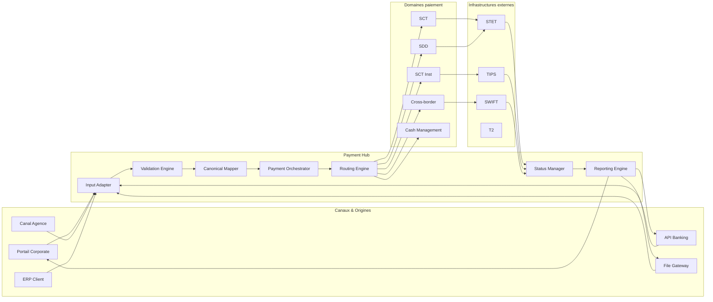

### Capacités fonctionnelles

| Capacité | Description |
|---|---|
| Réception multicanale | API, fichiers, portail, batch, événement |
| Normalisation | Conversion vers modèle canonique |
| Validation | XSD, règles métier, cut-off, mandat, BIC/IBAN |
| Orchestration | Séquencement du cycle de vie paiement |
| Routage | Choix STET, TIPS, SWIFT, T2 |
| Statuts | Gestion pain.002, pacs.002, camt.054 |
| Reporting | Relevés camt, restitution client |
| Audit | Traçabilité fonctionnelle et technique |

---

## 8. Architecture applicative cible

L’architecture applicative cible découpe le domaine paiement en composants cohérents. Le Payment Hub n’est pas un unique bloc opaque ; il est constitué de services spécialisés.

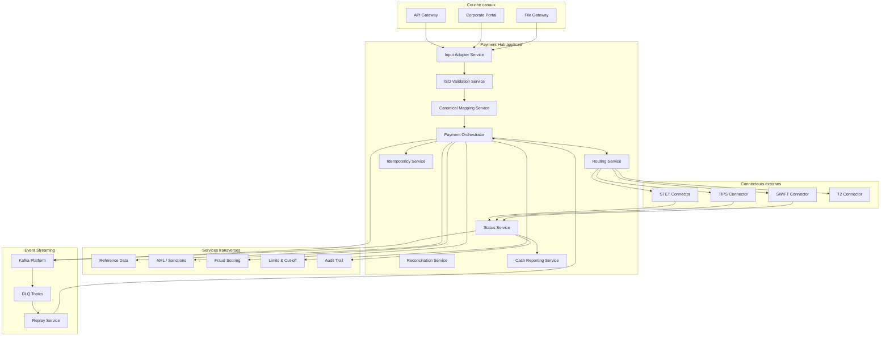

### Rôle des principaux services

| Service | Rôle | Criticité |
|---|---|---|
| Input Adapter | Réception et normalisation technique des entrées | Haute |
| ISO Validation Service | Validation XSD et règles ISO | Haute |
| Canonical Mapping Service | Transformation ISO ↔ modèle canonique | Très haute |
| Payment Orchestrator | Pilotage du cycle de vie paiement | Critique |
| Routing Service | Choix de la voie de compensation/règlement | Critique |
| Status Service | Gestion des statuts internes et externes | Critique |
| Idempotency Service | Prévention des doublons | Critique |
| Reconciliation Service | Rapprochement métier/technique | Haute |
| Cash Reporting Service | Génération camt et reporting client | Haute |

---

## 9. Architecture technique cible

L’architecture technique cible est pensée pour une plateforme conteneurisée, observable, scalable et gouvernée. Elle peut être déployée sur OpenShift/Kubernetes en environnement on-premise, cloud privé ou cloud public, avec segmentation par domaine et environnement.

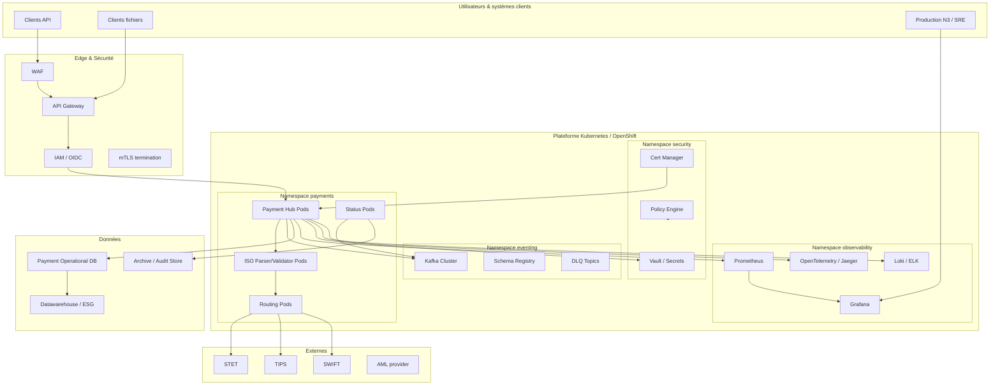

### Choix techniques structurants

| Domaine | Cible recommandée |
|---|---|
| Runtime | Kubernetes / OpenShift |
| Intégration synchrone | API Gateway, mTLS, OAuth2/OIDC |
| Intégration asynchrone | Kafka / Event Streaming |
| Stockage opérationnel | PostgreSQL/Oracle selon patrimoine |
| Observabilité | Prometheus, Grafana, OpenTelemetry, logs structurés |
| Sécurité | mTLS, secrets manager, RBAC, NetworkPolicy |
| Déploiement | GitOps, Helm/Kustomize, pipelines CI/CD |
| Gouvernance carbone | SCI, métriques CPU/mémoire/réseau/logs |

---

## 10. Architecture d’intégration

L’architecture d’intégration doit absorber la diversité des canaux et infrastructures sans propager cette complexité dans tout le SI.

### Types d’intégration

| Type | Exemple | Pattern |
|---|---|---|
| API synchrone | Initiation paiement corporate | API Gateway + Payment Hub |
| Fichier batch | pain.001 massif | File Gateway + batch ingestion |
| Event streaming | statut paiement publié | Kafka topic |
| Connecteur place | STET/TIPS/SWIFT | Adapter dédié |
| Reporting | camt.053/camt.054 | Reporting Engine |
| Legacy | MT103, fichiers internes | Anti-corruption layer |

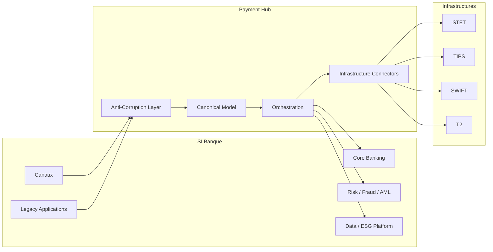

### Principes d’intégration

- chaque infrastructure dispose d’un connecteur dédié ;
- les formats externes ne doivent pas contaminer le cœur applicatif ;
- le modèle canonique est le contrat interne stable ;
- les événements transportent l’état métier, pas seulement des messages techniques ;
- les échanges critiques sont corrélés par identifiants métier et techniques.

---

## 11. Architecture ISO 20022

ISO 20022 constitue le langage pivot des paiements modernes, mais ne doit pas être confondu avec le modèle interne de la banque. L’architecture cible distingue clairement :

- le **message ISO reçu ou émis** ;
- le **modèle canonique interne** ;
- les **événements métier** ;
- les **statuts de cycle de vie** ;
- les **restitutions client**.

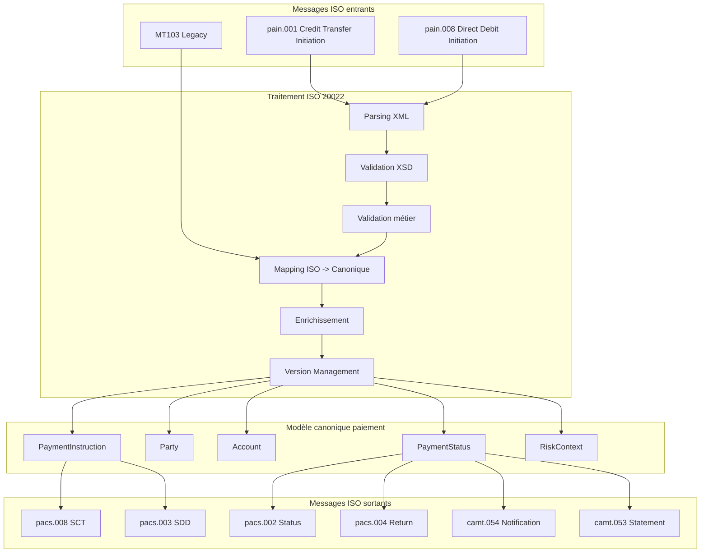

### Exemple : `pain.001 → Payment Hub → pacs.008 → STET`

| Étape | Action |
|---|---|
| Réception | Client corporate dépose un fichier `pain.001` |
| Validation | XSD + règles SEPA + contrôles IBAN/BIC |
| Mapping | `pain.001` vers `PaymentInstruction` canonique |
| Enrichissement | BIC, cut-off, compte, frais, règles client |
| Routage | SCT via STET |
| Génération | `pacs.008` |
| Statut | `pacs.002` reçu puis `camt.054` généré |
| Reporting | Notification client et alimentation cash management |

---

## 12. Architecture Event-Driven

L’event-driven architecture complète le Payment Hub sans remplacer la gouvernance métier. Elle permet de découpler les traitements, absorber les pics, réduire les dépendances synchrones et améliorer la résilience.

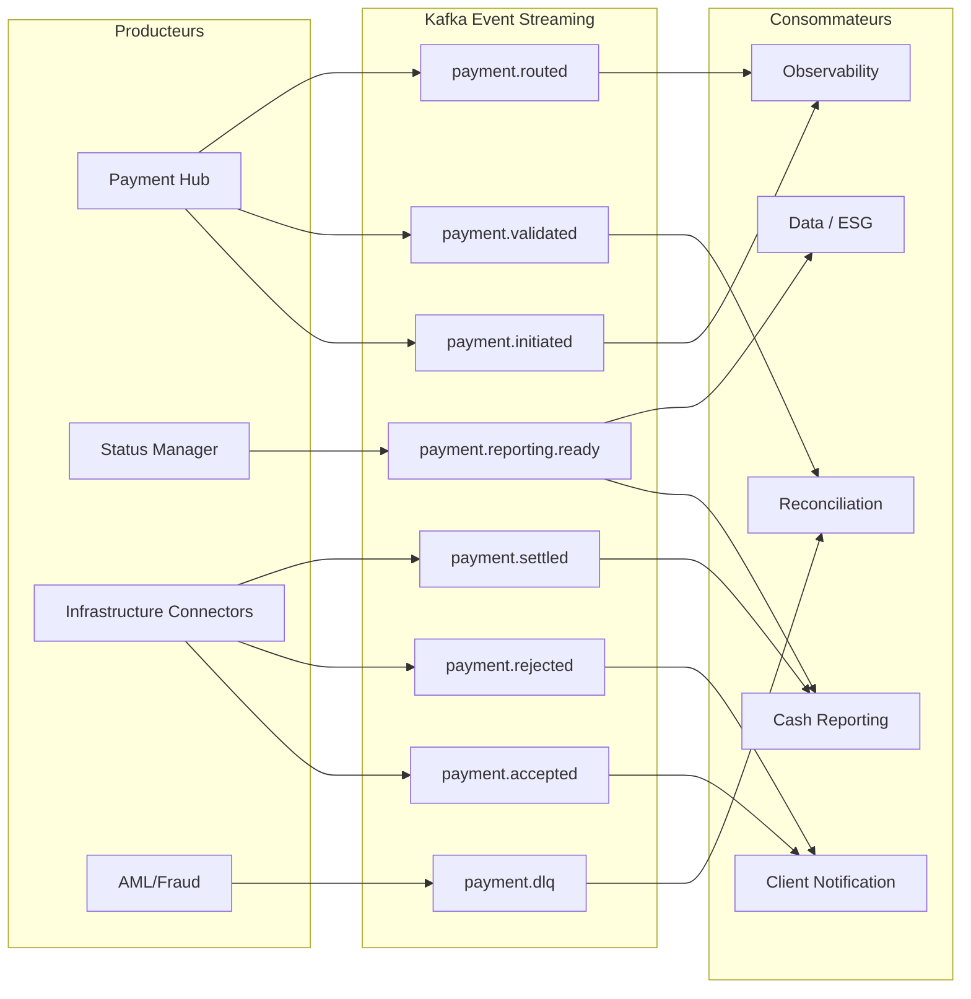

### Événement vs message ISO

| Élément | Message ISO 20022 | Event métier |
|---|---|---|
| Objectif | Échange normé entre acteurs | Notification interne d’un fait métier |
| Exemple | `pacs.008` | `payment.routed` |
| Structure | Norme XML ISO | JSON/Avro/Protobuf gouverné |
| Granularité | Message bancaire complet | Changement d’état |
| Usage | Interbancaire, client, reporting | Découplage interne, observabilité, replay |
| Conservation | Selon règles métier/compliance | Selon stratégie de rétention Kafka |

### Exemple : `pacs.008` publié dans Kafka

Un `pacs.008` ne doit pas forcément être publié tel quel dans Kafka. La bonne pratique consiste à publier un événement métier enrichi :

```json
{
  "eventType": "payment.routed",
  "paymentType": "SCT",
  "canonicalPaymentId": "PAY-2026-00001234",
  "endToEndId": "E2E-CLIENT-987654",
  "txId": "TX-STET-123456",
  "isoMessageType": "pacs.008",
  "targetInfrastructure": "STET",
  "amount": "1250.00",
  "currency": "EUR",
  "status": "ROUTED",
  "correlationId": "CORR-7f91-abc",
  "timestamp": "2026-04-27T09:15:00Z"
}
```

---

## 13. Architecture Batch

Le batch reste nécessaire pour certains flux : remises corporate massives, prélèvements SDD, relevés camt.053, rapprochements, exports comptables, traitements de fin de journée. La cible n’est pas de supprimer tout batch, mais de réduire les batchs inutiles, trop longs, non observables ou trop consommateurs.

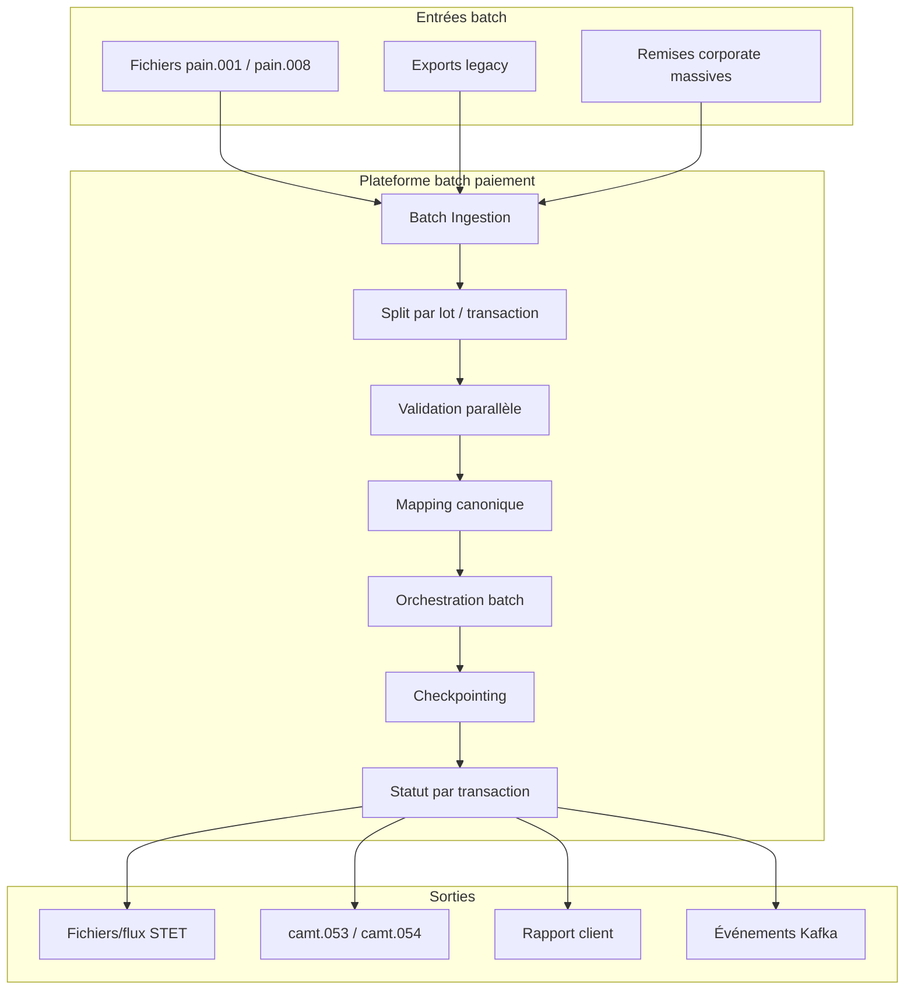

### Principes batch cible

| Principe | Description |
|---|---|
| Découpage contrôlé | Un fichier massif est découpé en unités traçables |
| Checkpointing | Reprise au dernier point valide |
| Statut transactionnel | Un rejet partiel ne bloque pas tout le lot si la règle métier l’autorise |
| Observabilité batch | Durée, volume, erreurs, CPU, mémoire, énergie |
| Sobriété | Éviter de parser plusieurs fois le même XML |

### Exemple : batch SCT rejeté partiellement

Un fichier `pain.001` contient 20 000 virements. 19 850 sont valides, 150 sont rejetés pour IBAN invalide ou compte clos. Le Payment Hub doit :

1. accepter le lot en statut partiel ;
2. générer les `pacs.008` pour les transactions valides ;
3. produire un `pain.002` ou rapport de rejet pour les transactions invalides ;
4. alimenter les événements `payment.rejected` pour les 150 lignes ;
5. conserver la corrélation entre fichier, lot et transaction ;
6. éviter de rejouer tout le fichier pour corriger 150 erreurs.

---

## 14. Architecture Temps Réel SCT Inst

Le SCT Inst impose une architecture très différente d’un batch classique. Le traitement doit être rapide, résilient, disponible en continu, et capable de gérer le statut inconnu en cas de timeout.

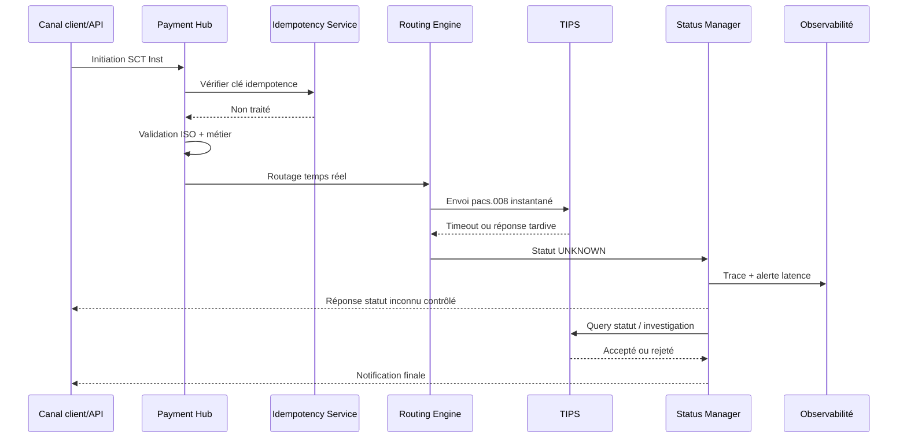

### Exigences SCT Inst

| Domaine | Exigence |
|---|---|
| Disponibilité | 24/7, haute disponibilité applicative et réseau |
| Latence | Mesurée de bout en bout, avec percentiles P95/P99 |
| Timeout | Doit produire un statut UNKNOWN, pas une relance aveugle |
| Idempotence | Indispensable pour éviter le double débit |
| Circuit breaker | Protection contre indisponibilité TIPS ou connecteur |
| Observabilité | Traces temps réel, alerting immédiat |
| GreenOps | Réduire les retries coûteux et les logs synchrones excessifs |

---

## 15. Architecture Cross-Border / SWIFT

Les paiements cross-border combinent ISO 20022, SWIFT, AML, sanctions, devises, correspondants bancaires, frais, cut-off et états intermédiaires.

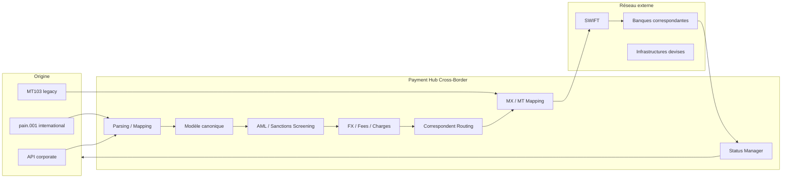

### Exemple : SWIFT / cross-border avec AML

| Étape | Traitement |
|---|---|
| 1 | Réception d’un ordre international |
| 2 | Mapping vers modèle canonique |
| 3 | Contrôle sanctions bénéficiaire, pays, banque intermédiaire |
| 4 | Scoring AML |
| 5 | Si alerte : mise en attente manuelle ou rejet |
| 6 | Si OK : génération MX ou MT selon capacité réseau |
| 7 | Envoi via SWIFT |
| 8 | Suivi statut, investigation éventuelle, reporting client |

---

## 16. Architecture Cash Management

Le cash management restitue les informations de paiement et de liquidité aux clients corporate. Il dépend fortement de la qualité des statuts du Payment Hub.

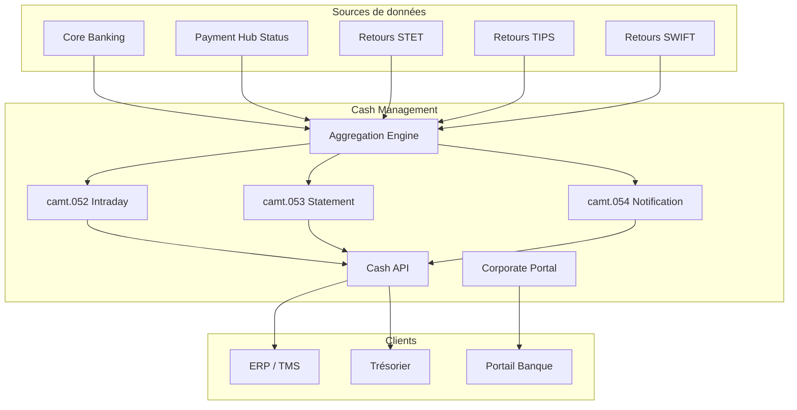

### `camt.054` et `camt.053`

| Message | Usage | Exemple |
|---|---|---|
| camt.054 | Notification d’écriture ou de statut | Notification qu’un SCT a été crédité ou rejeté |
| camt.053 | Relevé de compte de fin de période | Relevé journalier corporate |
| camt.052 | Relevé intraday | Position de trésorerie en cours de journée |

### Exemple : `camt.054/camt.053` pour reporting

Un paiement SCT traité via STET alimente le Status Manager. Après confirmation, le Cash Reporting Service génère :

- un `camt.054` pour notifier l’événement de crédit/débit ;
- un `camt.053` dans le relevé de fin de journée ;
- un événement `cash.reporting.generated` pour audit, portail et data platform.

---

## 17. Architecture Observabilité / SRE

L’observabilité n’est pas une couche ajoutée après coup. Elle est intégrée au design pour suivre les paiements de bout en bout.

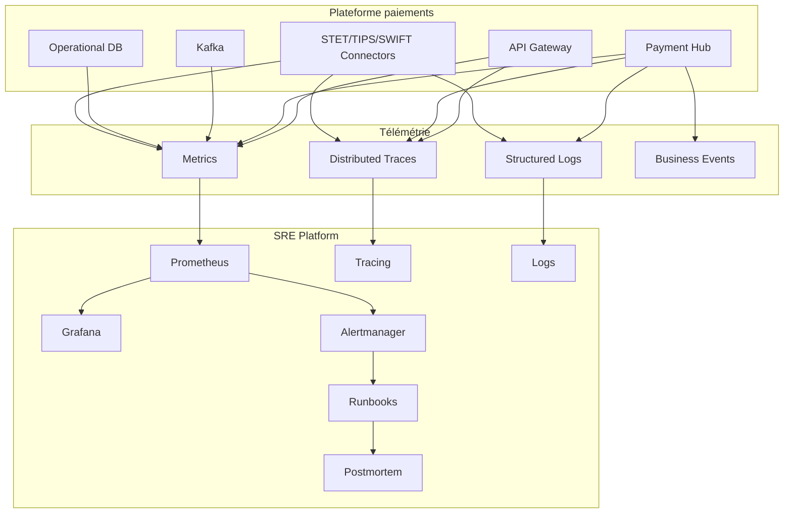

### SLI/SLO par flux

| Flux | SLI principal | SLO cible indicatif | Commentaire |
|---|---|---|---|
| SCT | % paiements traités avant cut-off | 99,5 % | Sensible aux batchs |
| SDD | % remises intégrées sans rejet technique | 99,3 % | Fort enjeu calendrier |
| SCT Inst | % réponses définitives ou statut contrôlé | 99,9 % | 24/7, temps réel |
| Cross-border | % paiements routés sans erreur technique | 99,0 % | Dépendances externes |
| Cash management | % camt générés dans la fenêtre prévue | 99,5 % | Critique clients corporate |

### Trace minimale de paiement

| Champ | Usage |
|---|---|
| `CorrelationId` | Trace technique end-to-end |
| `EndToEndId` | Identifiant client |
| `TxId` | Identifiant transaction interbancaire |
| `UETR` | Identifiant SWIFT cross-border |
| `MessageId` | Identifiant message ISO |
| `CanonicalPaymentId` | Identifiant interne stable |

---

## 18. Architecture GreenOps / SCI

L’architecture GreenOps mesure l’impact carbone des flux à partir des métriques d’usage, des métriques d’infrastructure et des unités fonctionnelles métier.

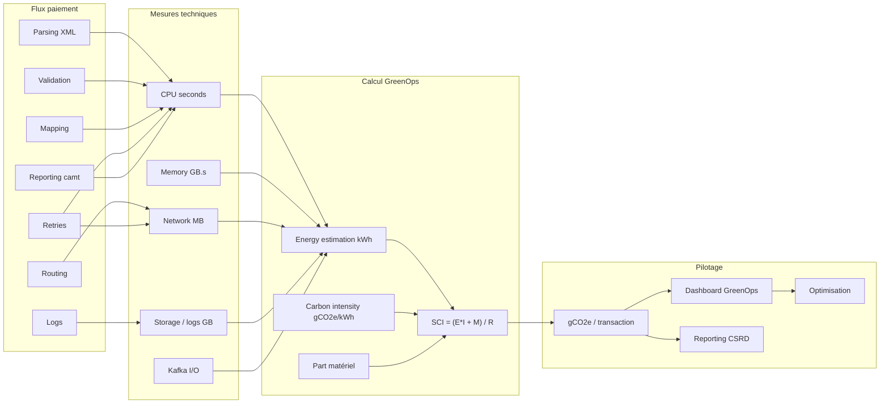

### Formule SCI appliquée

```text
SCI = (E × I + M) / R
```

| Variable | Signification | Exemple paiement |
|---|---|---|
| E | Énergie consommée | kWh consommés par parsing/mapping/routing |
| I | Intensité carbone de l’électricité | gCO2e/kWh selon localisation |
| M | Part carbone matériel amortie | Serveurs, stockage, réseau |
| R | Unité fonctionnelle | 1 transaction, 1000 transactions, 1 batch |

### Exemple : mesure SCI par flux

| Flux | Unité | Mesures prises en compte | KPI GreenOps |
|---|---|---|---|
| SCT | 1000 virements | CPU parsing, mapping, STET, logs | gCO2e / 1000 SCT |
| SDD | 1 remise | parsing fichier, split, validation, pacs.003 | gCO2e / remise |
| SCT Inst | 1 paiement instantané | API, validation, TIPS, statut | gCO2e / transaction |
| Cross-border | 1 paiement | AML, mapping SWIFT, messages réseau | gCO2e / transaction |
| Cash Management | 1 camt généré | agrégation, XML generation, stockage | gCO2e / camt |

### Cas logs sobres

Un anti-pattern courant consiste à loguer le XML ISO complet à chaque étape. Une approche sobre consiste à loguer :

- identifiants : `CorrelationId`, `MessageId`, `EndToEndId`, `TxId` ;
- type message : `pain.001`, `pacs.008`, `camt.054` ;
- statut ;
- durée ;
- code erreur ;
- empreinte/hash du message si nécessaire ;
- jamais les données sensibles en clair ;
- XML complet uniquement en mode investigation contrôlé, échantillonné et expiré.

---

## 19. Architecture Sécurité / Conformité

La sécurité de la plateforme paiements couvre les accès, les flux, les données, les secrets, les logs et la conformité.

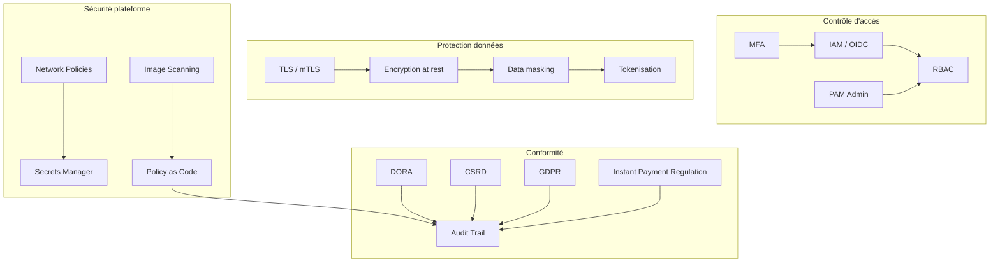

### Exigences clés

| Domaine | Exigence |
|---|---|
| Authentification | OIDC/OAuth2, mTLS pour systèmes sensibles |
| Autorisation | RBAC par rôle métier et technique |
| Secrets | Rotation, coffre-fort, pas de secrets en fichiers |
| Données sensibles | Masquage IBAN, nom, adresse, référence client |
| Logs | Pas de données personnelles ou XML complet non maîtrisé |
| Audit | Traçabilité des actions humaines et techniques |
| Conformité | DORA, CSRD, GDPR, Instant Payment Regulation |

### DORA, CSRD et Instant Payment Regulation

| Réglementation | Impact architecture |
|---|---|
| DORA | Résilience opérationnelle, tests, incidents, continuité |
| CSRD | Reporting extra-financier, mesure de l’impact numérique |
| Instant Payment Regulation | Accessibilité et performance des paiements instantanés |
| GDPR | Minimisation, protection et traçabilité des données personnelles |

---

## 20. Architecture Données / Modèle canonique

Le modèle canonique est la clé pour éviter le couplage direct entre canaux, infrastructures et versions ISO.

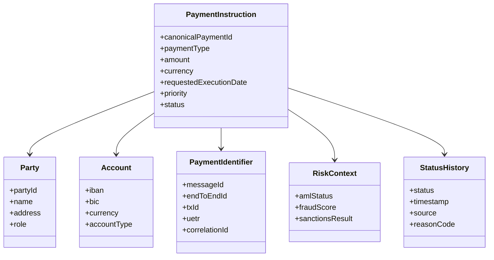

### Modèle canonique vs ISO 20022

| Aspect | ISO 20022 | Modèle canonique |
|---|---|---|
| Finalité | Standard d’échange | Modèle interne stable |
| Évolution | Versions pain/pacs/camt | Version interne gouvernée |
| Granularité | Très riche, orientée message | Orientée cycle de vie paiement |
| Couplage | Dépend des infrastructures | Indépendant des canaux |
| Usage | Input/output | Orchestration interne |

### Bonnes pratiques de données

- ne jamais utiliser directement `pain.001` comme modèle interne ;
- conserver les messages originaux selon règles d’archivage ;
- séparer données métier, données techniques et données d’observabilité ;
- gérer les versions de mapping ;
- documenter les règles de transformation ;
- tracer les pertes ou enrichissements d’information ;
- maintenir un dictionnaire des identifiants.

---

## 21. Flux end-to-end SCT

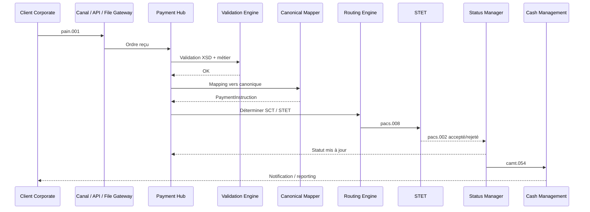

### Description détaillée

| Étape | Traitement | Point d’attention |
|---|---|---|
| Réception | `pain.001` depuis canal | Contrôle taille, signature, client |
| Validation | XSD + règles SEPA | Rejets rapides |
| Mapping | ISO vers canonique | Versioning |
| Enrichissement | BIC, cut-off, compte | Référentiels |
| Routage | STET | Règles d’éligibilité |
| Compensation | `pacs.008` | Corrélation TxId |
| Statut | `pacs.002` | Gestion rejet |
| Reporting | `camt.054` | Cohérence cash |

---

## 22. Flux end-to-end SDD

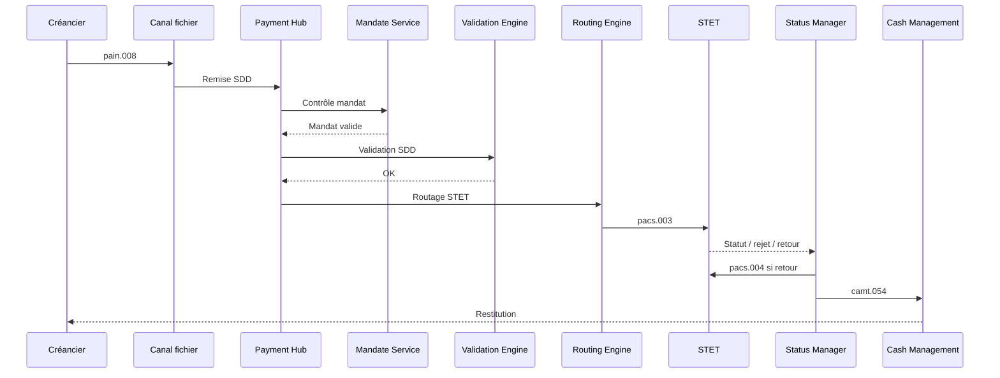

### Exemple : `pain.008 → Payment Hub → pacs.003 → STET`

| Étape | Action |
|---|---|
| 1 | Réception d’une remise `pain.008` |
| 2 | Contrôle créancier et mandat |
| 3 | Validation calendrier et séquence |
| 4 | Mapping vers modèle canonique |
| 5 | Génération `pacs.003` |
| 6 | Envoi STET |
| 7 | Gestion d’un rejet ou retour via `pacs.004` |
| 8 | Notification `camt.054` |

### R-transactions

Les R-transactions SDD sont critiques : reject, return, refund, reversal. L’architecture doit tracer la cause, la date, le mandat, le statut et l’impact comptable.

---

## 23. Flux end-to-end SCT Inst

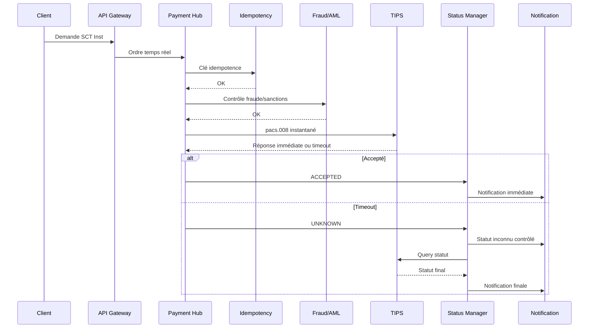

### Exemple : SCT Inst → Payment Hub → TIPS → statut immédiat

Le canal client envoie un ordre temps réel. Le Payment Hub valide, contrôle l’idempotence, vérifie fraude/AML, route vers TIPS et attend une réponse. Si la réponse n’arrive pas dans la fenêtre attendue, le statut ne doit pas devenir “échec” par défaut : il doit devenir `UNKNOWN` avec investigation automatisée.

### Cas retry / circuit breaker

Si TIPS ou le connecteur temps réel dégrade fortement, un circuit breaker empêche la multiplication des appels synchrones. Cela évite :

- double débit ;
- saturation thread pool ;
- explosion logs ;
- surcharge réseau ;
- hausse inutile du gCO2e/transaction.

---

## 24. Flux end-to-end Cross-border

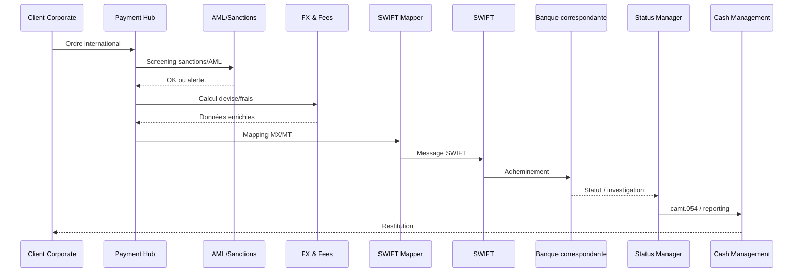

### Gestion UETR

Pour les paiements cross-border, l’UETR facilite le tracking de bout en bout. Il doit être conservé dans :

- modèle canonique ;
- événements ;
- logs structurés ;
- traces distribuées ;
- reporting client ;
- dossiers d’investigation.

---

## 25. Flux end-to-end Cash Management

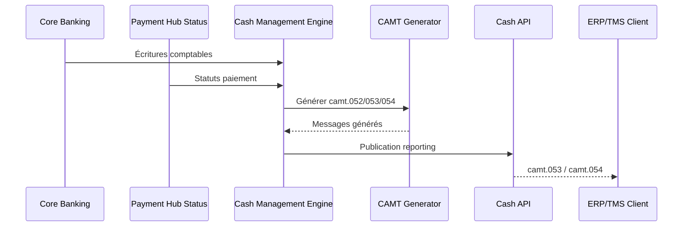

### Exigences Cash Management

| Exigence | Description |
|---|---|
| Cohérence | Le reporting doit refléter les statuts réels |
| Timeliness | camt généré dans la fenêtre convenue |
| Traçabilité | Lien entre transaction et écriture |
| Sobriété | Éviter de régénérer des fichiers complets inutilement |
| Sécurité | Données client sensibles masquées et protégées |

---

## 26. Résilience et haute disponibilité

La résilience cible combine redondance technique, idempotence, reprise contrôlée, découplage événementiel et observabilité.

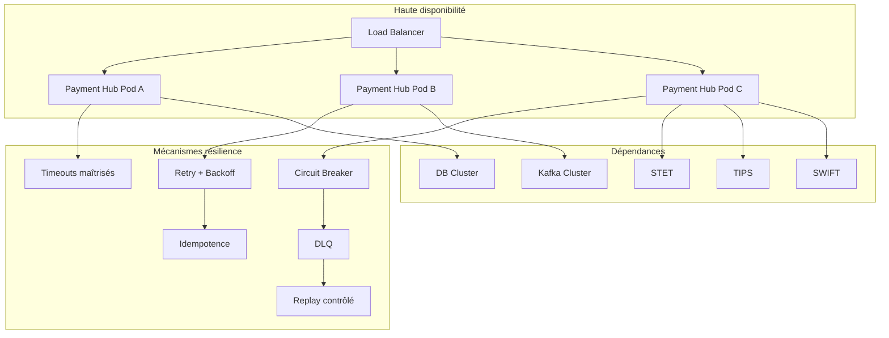

### Patterns requis

| Pattern | Usage |
|---|---|
| Timeout | Éviter les threads bloqués |
| Retry avec backoff | Réessayer sans tempête |
| Circuit breaker | Protéger la plateforme |
| Idempotence | Éviter les doublons |
| DLQ | Isoler les erreurs non traitables |
| Replay contrôlé | Reprendre sans retraiter aveuglément |
| Bulkhead | Isoler les ressources par flux critique |
| Rate limiting | Protéger les APIs et connecteurs |

---

## 27. Scalabilité

La scalabilité doit être pensée par type de flux : batch, temps réel, event-driven, reporting, parsing ISO.

### Axes de scalabilité

| Axe | Exemple | Risque |
|---|---|---|
| Horizontal pod scaling | Augmenter Payment Hub pods | DB ou Kafka devient goulot |
| Partitionnement Kafka | Par `paymentType` ou `debtorBank` | Mauvais ordre des événements |
| Parallel batch processing | Split de fichiers `pain.001` | Perte de cohérence lot |
| Pool connecteurs | STET/TIPS/SWIFT | Saturation réseau |
| Cache référentiel | BIC, IBAN, cut-off | Données obsolètes |

### Recommandations

- séparer les workloads batch et temps réel ;
- réserver des ressources pour SCT Inst ;
- éviter qu’un batch SDD massif perturbe les flux temps réel ;
- dimensionner Kafka selon débit, rétention, taille événement ;
- surveiller P95/P99, pas seulement les moyennes ;
- scaler le parsing XML indépendamment de l’orchestration ;
- utiliser des quotas et limits Kubernetes cohérents.

---

## 28. Exploitabilité

Une architecture bancaire critique doit être exploitable par la production N3. Cela implique des diagnostics simples, des runbooks, des dashboards et des procédures de reprise.

### Capacités d’exploitation

| Capacité | Exemple |
|---|---|
| Recherche transaction | Par EndToEndId, TxId, CorrelationId, UETR |
| Dashboard métier | Volumes SCT/SDD/SCT Inst par statut |
| Dashboard technique | Latence, erreurs, saturation CPU/mémoire |
| Dashboard GreenOps | gCO2e/transaction, logs, retries |
| Runbook incident | Timeout TIPS, rejet STET, DLQ Kafka |
| Replay contrôlé | Rejouer un paiement ou un lot |
| Audit trail | Qui a relancé quoi, quand, pourquoi |
| Postmortem | Analyse sans blâme et actions correctrices |

### Exemple de runbook haut niveau : `camt.054` non généré

| Étape | Action |
|---|---|
| 1 | Vérifier si le statut paiement final existe |
| 2 | Vérifier événement `payment.reporting.ready` |
| 3 | Vérifier Cash Reporting Service |
| 4 | Vérifier erreurs de génération XML camt |
| 5 | Vérifier DLQ reporting |
| 6 | Relancer génération ciblée |
| 7 | Confirmer livraison client |
| 8 | Documenter incident et impact carbone si retraitement massif |

---

## 29. Contraintes réglementaires

### Contraintes principales

| Contrainte | Impact |
|---|---|
| SEPA Rulebooks | Règles SCT/SDD/SCT Inst, formats et délais |
| ISO 20022 | Structure des messages et données |
| DORA | Résilience opérationnelle numérique |
| Instant Payment Regulation | Disponibilité et traitement instantané |
| GDPR | Protection des données personnelles |
| AML / Sanctions | Blocage, investigation, audit |
| CSRD | Reporting environnemental, dont numérique |
| Archivage bancaire | Conservation des preuves et messages |

### Impacts d’architecture

- conservation maîtrisée des messages ISO ;
- traçabilité de bout en bout ;
- capacité de preuve en cas de litige ;
- tests de résilience documentés ;
- segmentation des accès ;
- gestion des prestataires critiques ;
- mesure de l’impact environnemental des services numériques.

---

## 30. Risques d’architecture

| Risque | Impact | Mitigation |
|---|---|---|
| Hub trop monolithique | Évolutivité faible, incidents larges | Découpage modulaire |
| Trop de microservices | Complexité, latence, carbone | Découpage par valeur métier |
| Mapping ISO dispersé | Incohérence | Service de mapping gouverné |
| Logs XML massifs | Coût stockage, risque GDPR, carbone | Logs structurés sobres |
| Retry storm | Saturation plateforme | Backoff + circuit breaker |
| Statut inconnu mal géré | Doublons, pertes financières | Modèle UNKNOWN + investigation |
| Batch non maîtrisé | Fenêtres dépassées | Checkpointing + parallélisation |
| Absence SLO | Pilotage réactif | SLI/SLO par flux |
| Kafka mal gouverné | Rejouabilité dangereuse | Registry, ownership, rétention |
| GreenOps décoratif | Aucun gain mesurable | KPI SCI opérationnels |

---

## 31. Décisions d’architecture majeures

| ADR | Décision | Justification |
|---|---|---|
| ADR-001 | Positionner un Payment Hub central | Mutualiser validation, orchestration, routage et statuts |
| ADR-002 | Utiliser un modèle canonique interne | Découpler ISO, canaux et infrastructures |
| ADR-003 | Gouverner ISO 20022 par versions | Maîtriser pain/pacs/camt et migrations |
| ADR-004 | Introduire Kafka pour événements métier | Découplage, replay, observabilité |
| ADR-005 | Garder orchestration pour flux critiques | Éviter chorégraphie incontrôlable |
| ADR-006 | Isoler SCT Inst | Garantir disponibilité et latence |
| ADR-007 | Définir idempotence comme exigence native | Éviter doublons et double débit |
| ADR-008 | Mesurer SCI par flux | Piloter GreenOps concrètement |
| ADR-009 | Loguer sobrement | Réduire risques GDPR et carbone |
| ADR-010 | Utiliser SLI/SLO par type de paiement | Piloter la production par valeur métier |

---

## 32. KPI et indicateurs de pilotage

### KPI métier

| KPI | Description |
|---|---|
| Taux de paiements acceptés | Acceptés / initiés |
| Taux de rejets métier | Rejets / initiés |
| Délai de traitement SCT | Temps entrée → statut final |
| Délai de traitement SCT Inst | Temps API → réponse ou UNKNOWN |
| Taux de camt générés à temps | camt générés / attendus |
| Taux de paiements en investigation | UNKNOWN ou statut bloqué |

### KPI SRE

| KPI | Description |
|---|---|
| Disponibilité Payment Hub | Uptime applicatif |
| Latence P95/P99 | Par flux |
| Error rate | Erreurs techniques |
| Retry rate | Taux de relances |
| DLQ volume | Messages en erreur |
| MTTR | Temps moyen de résolution |
| Error budget burn rate | Consommation budget erreur |

### KPI GreenOps

| KPI | Description |
|---|---|
| gCO2e / transaction | SCI par paiement |
| gCO2e / 1000 SCT | Mesure normalisée |
| gCO2e / batch SDD | Empreinte batch |
| CPU seconds / message ISO | Coût parsing + mapping |
| Logs MB / 1000 transactions | Sobriété logs |
| Retry carbon cost | Impact carbone des retries |
| Kafka I/O / paiement | Coût event-driven |

---

## 33. Roadmap de mise en œuvre

### Phase 1 — Cadrage et baseline

| Action | Livrable |
|---|---|
| Cartographier flux SCT/SDD/SCT Inst/cross-border | Cartographie applicative |
| Identifier formats et versions ISO | Catalogue messages |
| Mesurer volumes et incidents | Baseline production |
| Mesurer CPU/log/retry | Baseline GreenOps |
| Identifier risques DORA/CSRD/IPR | Registre risques |

### Phase 2 — Fondation Payment Hub

| Action | Livrable |
|---|---|
| Définir modèle canonique | Data model HLD |
| Concevoir services Payment Hub | Architecture applicative |
| Définir contrats APIs/events | Contrats d’intégration |
| Définir idempotence | ADR + design |
| Définir observabilité | SLI/SLO + dashboards |

### Phase 3 — Industrialisation ISO et connecteurs

| Action | Livrable |
|---|---|
| Implémenter validation ISO | ISO validation service |
| Implémenter mapping pain/pacs/camt | Mapping registry |
| Connecter STET | STET connector |
| Connecter TIPS | SCT Inst connector |
| Connecter SWIFT | SWIFT connector |

### Phase 4 — Event-driven et SRE

| Action | Livrable |
|---|---|
| Déployer Kafka | Plateforme event streaming |
| Publier événements métier | Topics payment.* |
| Mettre en place DLQ/replay | Runbooks reprocessing |
| Déployer alerting | Alertmanager + runbooks |
| Formaliser postmortem | Process SRE |

### Phase 5 — GreenOps et optimisation

| Action | Livrable |
|---|---|
| Calculer SCI par flux | Dashboard GreenOps |
| Optimiser parsing XML | Gains CPU |
| Réduire logs | Logs sobres |
| Réduire retries | Circuit breaker/backoff |
| Rapporter gains | Reporting CSRD IT |

---

## 34. Questions ouvertes

| Question | Impact | Décision attendue |
|---|---|---|
| Quelle infrastructure SCT Inst principale : TIPS uniquement ou multi-rail ? | Routage, disponibilité | Choix stratégie temps réel |
| Quelle cible de modèle canonique ? | Mapping et gouvernance | Validation architecture données |
| Kafka est-il plateforme groupe ou dédiée paiements ? | Exploitation, sécurité | Choix plateforme |
| Quelle durée de rétention events ? | Coût, audit, replay | Politique rétention |
| Quels SLO contractuels par flux ? | SRE, engagement métier | Validation métier/production |
| Quel niveau de logs XML autorisé ? | GDPR, coût, diagnostic | Politique logging |
| Quel outillage GreenOps ? | Mesure SCI | Choix technique |
| Quelle stratégie legacy MT → MX ? | Migration cross-border | Roadmap migration |
| Quels environnements critiques ? | HA/PRA | Stratégie infra |
| Quel RACI incident N3 ? | Production | Gouvernance opérationnelle |

---

## 35. Synthèse architecte

La cible proposée repose sur une conviction forte : une plateforme de paiements moderne ne peut plus être pensée uniquement comme une chaîne de traitements fichiers ou un ensemble d’interfaces ISO. Elle doit devenir un **système de paiement observable, résilient, gouverné, sobre et orienté événements**.

Le **Payment Hub** devient le cœur d’architecture : il réceptionne, valide, normalise, orchestre, route et suit les statuts. Le **modèle canonique** protège le SI contre la complexité des formats et des versions ISO 20022. Les connecteurs **STET**, **TIPS**, **SWIFT** et **T2** isolent les contraintes de place. Kafka et l’event-driven apportent découplage, replay, intégration data et observabilité métier. SRE apporte les SLI/SLO, runbooks, postmortems et mécanismes de résilience. GreenOps apporte une mesure concrète : gCO2e/transaction, coût des retries, coût des logs, coût du parsing XML.

L’architecture cible doit éviter trois erreurs majeures :

1. faire d’ISO 20022 le modèle interne de toute la banque ;
2. transformer Kafka en simple bus technique sans gouvernance métier ;
3. traiter GreenOps comme un reporting décoratif au lieu d’un levier d’optimisation opérationnelle.

Dans un contexte BPCE / Natixis, la crédibilité d’une telle architecture repose sur sa capacité à répondre simultanément aux contraintes métier, réglementaires, techniques et environnementales :

- traiter les paiements SCT, SDD, SCT Inst et cross-border ;
- respecter les infrastructures STET, TIPS, SWIFT ;
- gérer les statuts, erreurs, rejets, retours, investigations ;
- tenir la production 24/7 pour l’instant payment ;
- réduire les incidents et les retries ;
- fournir une observabilité end-to-end ;
- mesurer l’impact carbone par flux ;
- être audit-ready pour DORA, CSRD et les exigences de place.

La trajectoire recommandée est progressive : cartographie et baseline, fondation Payment Hub, gouvernance ISO/canonique, connecteurs de place, event-driven, SRE, puis GreenOps industrialisé. Cette approche permet de moderniser sans rupture brutale, de sécuriser les flux critiques et de construire une plateforme durable, exploitable et défendable en comité d’architecture.

---

## Annexes — Vue cible globale consolidée

```mermaid
flowchart TB
    subgraph Channels["Canaux"]
        WEB["Portail Corporate"]
        API["API Banking"]
        FILE["File Gateway"]
        LEGACY["Legacy / MT"]
    end

    subgraph Security["Sécurité"]
        WAF["WAF"]
        IAM["IAM/OIDC"]
        MTLS["mTLS"]
        SECRETS["Secrets Manager"]
    end

    subgraph Hub["Payment Hub"]
        INPUT["Input Adapter"]
        ISO["ISO 20022 Parser/Validator"]
        CANON["Canonical Mapper"]
        ORCH["Payment Orchestrator"]
        ROUTE["Routing Engine"]
        IDEM["Idempotency"]
        STATUS["Status Manager"]
        REPORT["Cash Reporting"]
    end

    subgraph Event["Event-Driven"]
        KAFKA["Kafka"]
        TOPICS["payment.* topics"]
        DLQ["DLQ"]
        REPLAY["Replay Service"]
    end

    subgraph External["Infrastructures de place"]
        STET["STET"]
        TIPS["TIPS"]
        SWIFT["SWIFT"]
        T2["T2"]
    end

    subgraph Obs["SRE / Observabilité"]
        METRICS["Metrics"]
        TRACES["Traces"]
        LOGS["Logs sobres"]
        ALERTS["Alerting"]
        RUNBOOK["Runbooks"]
    end

    subgraph Green["GreenOps"]
        CPU["CPU / Memory / Network"]
        SCI["SCI"]
        GCO2["gCO2e/transaction"]
        DASH["Dashboard GreenOps"]
    end

    WEB --> WAF
    API --> WAF
    FILE --> WAF
    LEGACY --> WAF
    WAF --> IAM --> MTLS --> INPUT
    SECRETS --> Hub

    INPUT --> ISO --> CANON --> ORCH
    ORCH --> IDEM
    ORCH --> ROUTE
    ROUTE --> STET
    ROUTE --> TIPS
    ROUTE --> SWIFT
    ROUTE --> T2

    STET --> STATUS
    TIPS --> STATUS
    SWIFT --> STATUS
    STATUS --> REPORT

    ORCH --> KAFKA
    STATUS --> KAFKA
    KAFKA --> TOPICS
    TOPICS --> DLQ
    DLQ --> REPLAY
    REPLAY --> ORCH

    Hub --> METRICS
    Hub --> TRACES
    Hub --> LOGS
    METRICS --> ALERTS
    ALERTS --> RUNBOOK

    METRICS --> CPU
    LOGS --> CPU
    KAFKA --> CPU
    CPU --> SCI --> GCO2 --> DASH
```

---

## Annexes — Matrice de couverture des exigences

| Exigence | Couverture dans ce HLD |
|---|---|
| Payment Hub | Sections 7, 8, 10, 11, 21 à 25 |
| Modèle canonique | Sections 11, 20, 31 |
| ISO 20022 | Sections 11, 21, 22, 23, 24 |
| STET | Sections 10, 21, 22 |
| TIPS | Sections 14, 23 |
| SWIFT | Sections 15, 24 |
| Kafka / event-driven | Section 12 |
| SRE | Sections 17, 26, 28, 32 |
| GreenOps / SCI | Section 18 |
| CSRD / DORA / IPR | Sections 19, 29 |
| Retry / circuit breaker | Sections 23, 26, 30 |
| Logs sobres | Sections 18, 28, 30 |
