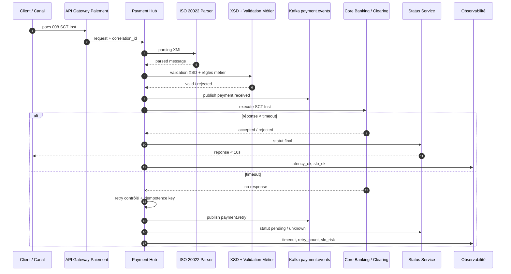
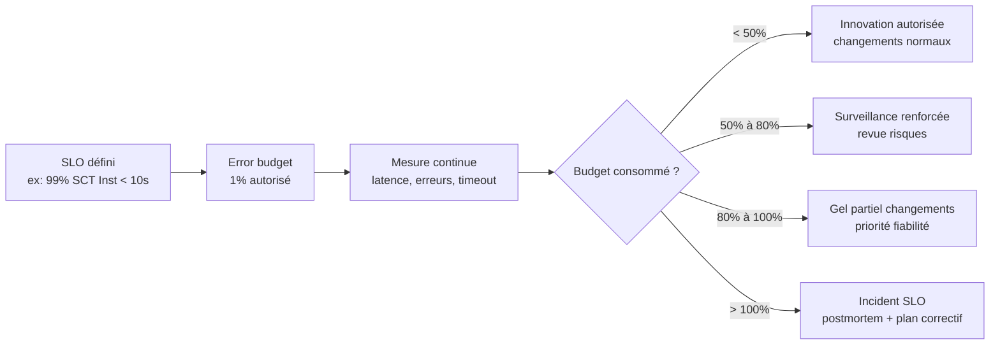
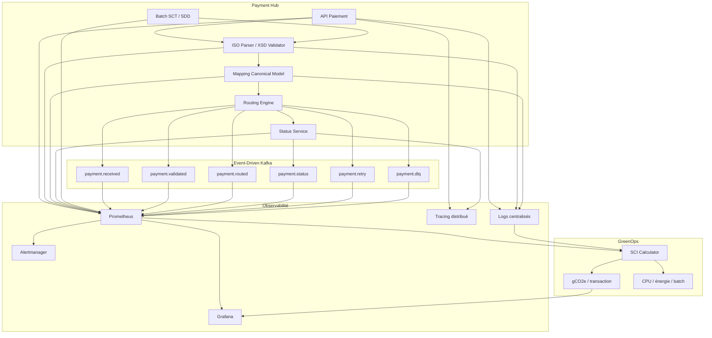
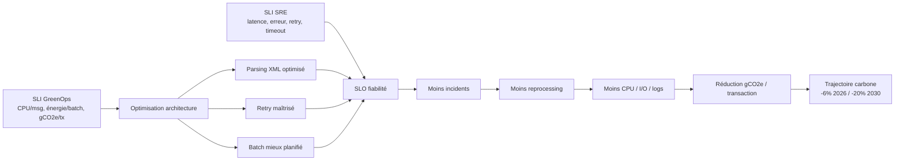
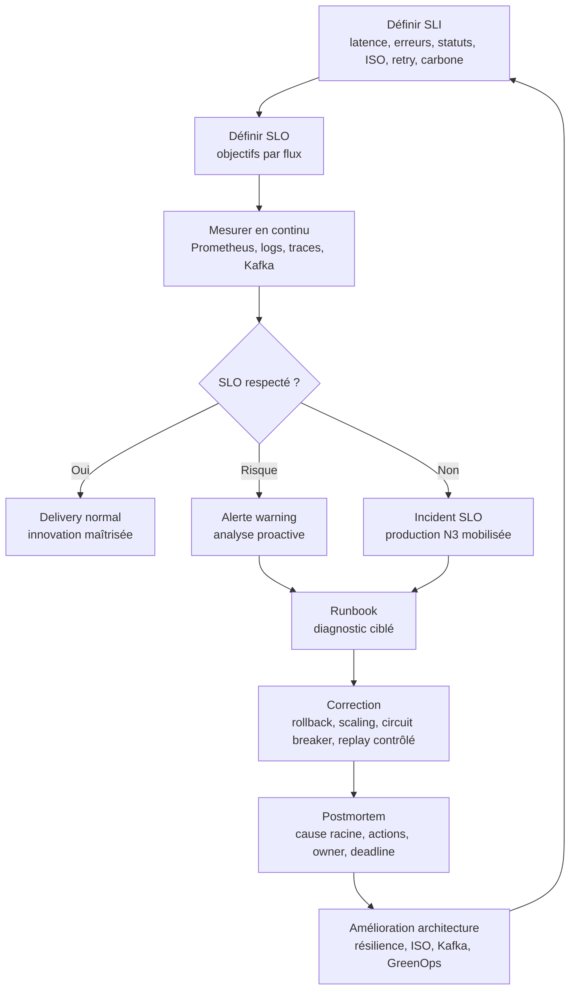

# 08_OBSERVABILITE_SRE_01_sli_slo.md

# SLI / SLO pour une plateforme de paiements bancaires ISO 20022, Event-Driven, Résilience et GreenOps

**Projet :** greenops-it-flux-architecture  
**Domaine :** Observabilité / SRE / Paiements critiques  
**Contexte cible :** Direction paiements, architecture SI, production N3, contexte bancaire type BPCE / Natixis  
**Flux couverts :** SCT, SDD, SCT Inst, cross-border, cash management  
**Axes transverses :** ISO 20022, Kafka, résilience, retry, idempotence, circuit breaker, GreenOps, SCI, gCO2e / transaction  

---

## 1. Objectif du document

Ce document définit un cadre complet de **SLI / SLO** pour piloter une plateforme de paiements bancaires critique.

L’objectif est de permettre à une direction paiements, une direction architecture, une équipe SRE ou une production N3 de répondre à cinq questions essentielles :

1. La plateforme de paiement fonctionne-t-elle correctement ?
2. Les flux critiques sont-ils traités dans les délais bancaires attendus ?
3. Les incidents sont-ils détectés avant impact métier majeur ?
4. Les erreurs ISO 20022, les retries, les statuts inconnus et les rejets sont-ils maîtrisés ?
5. Les objectifs de fiabilité sont-ils compatibles avec les objectifs GreenOps et la trajectoire carbone ?

Ce document ne se limite pas à définir des métriques techniques. Il relie les indicateurs à des engagements opérationnels, métier, réglementaires, environnementaux et de production.

Les SLI / SLO proposés couvrent :

- la disponibilité du Payment Hub ;
- la latence des paiements temps réel ;
- la ponctualité des batchs ;
- la qualité ISO 20022 ;
- la maîtrise des rejets XML ;
- la stabilité Kafka ;
- la résilience des traitements ;
- les retries ;
- l’idempotence ;
- les statuts inconnus ;
- les reportings camt ;
- l’impact carbone par transaction ;
- la détection proactive des incidents ;
- la priorisation des actions N3.

---

## 2. Pourquoi SLI / SLO dans les paiements

Une plateforme de paiements bancaires n’est pas une application classique. Elle traite des flux critiques, réglementés, horodatés, traçables et fortement dépendants des cut-offs, des schémas interbancaires, des formats ISO 20022 et des systèmes tiers.

Les SLI / SLO sont indispensables pour plusieurs raisons.

### 2.1. Garantir la continuité métier

Un incident sur SCT Inst peut empêcher un paiement instantané.  
Un incident sur SDD peut provoquer des retards de prélèvement.  
Un incident sur cross-border peut générer des blocages de trésorerie.  
Un incident sur cash management peut impacter la visibilité financière des clients entreprises.

### 2.2. Objectiver la qualité de service

Sans SLI, les discussions restent subjectives :

- “La plateforme est lente.”
- “Les batchs passent mal.”
- “Kafka accumule du retard.”
- “Les messages ISO sont rejetés.”
- “La production reçoit trop d’incidents.”

Avec des SLI, les constats deviennent mesurables :

- 99,2 % des SCT Inst traités en moins de 10 secondes.
- 98,7 % des batchs SCT terminés avant cut-off.
- 0,18 % de messages XML rejetés pour non-conformité XSD.
- 1,6 % de retries applicatifs sur les flux SCT Inst.
- 0,05 % de statuts inconnus après 15 minutes.

### 2.3. Réduire le bruit opérationnel

Une production N3 ne doit pas être réveillée pour chaque micro-anomalie. Les SLO permettent de distinguer :

- un signal faible ;
- une dérive ;
- un incident réel ;
- une rupture de service ;
- une consommation excessive d’error budget.

### 2.4. Piloter l’architecture

Les SLO influencent directement les choix d’architecture :

- synchrone ou asynchrone ;
- Kafka ou API directe ;
- retry court ou retry différé ;
- circuit breaker agressif ou tolérant ;
- idempotence forte ou idempotence minimale ;
- stockage temporaire ou traitement streaming ;
- scalabilité horizontale ;
- séparation SCT / SCT Inst / SDD ;
- découplage ISO parsing / validation / mapping / routing.

### 2.5. Lier fiabilité et sobriété numérique

Un système très fiable mais très inefficace peut devenir coûteux et carboné.  
Un système trop optimisé peut devenir fragile.

Le SRE moderne doit intégrer le GreenOps :

- limiter les retries inutiles ;
- réduire les reprocessings ;
- maîtriser la volumétrie des logs ;
- réduire le CPU par message ;
- optimiser les traitements XML ;
- suivre les gCO2e / transaction ;
- éviter la surcapacité permanente ;
- adapter les ressources aux fenêtres métier.

---

## 3. Différence SLA / SLO / SLI

### 3.1. SLA

Le **SLA** est un engagement formel, souvent contractuel, entre un fournisseur de service et un client interne ou externe.

Exemple :

> La plateforme de paiement SCT Inst doit être disponible 99,9 % du temps sur le mois calendaire.

Un SLA peut entraîner :

- pénalités ;
- escalades contractuelles ;
- reporting direction ;
- obligation de remédiation ;
- engagement vis-à-vis des métiers.

### 3.2. SLO

Le **SLO** est un objectif interne de fiabilité. Il sert à piloter la production et l’amélioration continue.

Exemple :

> 99 % des SCT Inst doivent être traités en moins de 10 secondes sur une fenêtre glissante de 30 jours.

Le SLO est généralement plus fin que le SLA. Il peut couvrir :

- latence ;
- disponibilité ;
- fraîcheur des statuts ;
- qualité ISO ;
- ponctualité des batchs ;
- taux de rejet ;
- taux de retry ;
- lag Kafka ;
- erreur applicative ;
- empreinte carbone.

### 3.3. SLI

Le **SLI** est l’indicateur mesuré.

Exemple :

```text
SLI latence SCT Inst =
nombre de paiements SCT Inst traités en moins de 10 secondes
/
nombre total de paiements SCT Inst traités
```

Un SLI doit être :

- mesurable ;
- automatisable ;
- non ambigu ;
- relié à une expérience métier ;
- exploitable dans Prometheus / Grafana / Dynatrace ;
- aligné avec une fenêtre temporelle ;
- compréhensible par production, métier et architecture.

### 3.4. Exemple complet

| Niveau | Exemple |
|---|---|
| SLA | Disponibilité plateforme paiement 99,9 % mensuelle |
| SLO | 99 % des SCT Inst traités en moins de 10 secondes |
| SLI | Ratio SCT Inst `duration_seconds < 10` / total SCT Inst |
| Alerte | Si SLI < 98,5 % sur 15 minutes |
| Incident | Si SLI < 99 % pendant 30 minutes ou impact client confirmé |
| Postmortem | Analyse latence, timeout, retry, Kafka lag, saturation CPU, erreurs ISO |

---

## 4. SLI globaux plateforme paiement

Les SLI globaux doivent mesurer la santé transverse du Payment Hub, indépendamment d’un flux particulier.

### 4.1. Disponibilité fonctionnelle

```text
SLI disponibilité =
nombre de probes métier réussies
/
nombre total de probes métier exécutées
```

Les probes ne doivent pas être de simples checks HTTP. Elles doivent vérifier :

- réception d’un paiement simulé ;
- validation ISO ;
- publication Kafka ;
- persistance ;
- génération d’un statut ;
- consultation de l’état du paiement.

### 4.2. Taux de succès bout-en-bout

```text
SLI succès E2E =
paiements terminés avec statut final attendu
/
paiements acceptés en entrée plateforme
```

Ce SLI est central car il reflète le vrai service rendu.

### 4.3. Latence bout-en-bout

```text
SLI latence E2E =
timestamp statut final - timestamp réception paiement
```

À suivre par percentile :

- P50 ;
- P90 ;
- P95 ;
- P99 ;
- max.

### 4.4. Taux d’erreur technique

```text
SLI erreur technique =
nombre d’erreurs techniques non fonctionnelles
/
nombre total de traitements
```

Exemples d’erreurs techniques :

- timeout API ;
- erreur base de données ;
- indisponibilité Kafka ;
- exception Java ;
- échec de parsing ;
- deadlock ;
- saturation pool ;
- circuit breaker ouvert.

### 4.5. Taux d’erreur fonctionnelle

```text
SLI erreur fonctionnelle =
nombre de rejets fonctionnels
/
nombre total de paiements reçus
```

Exemples :

- IBAN invalide ;
- BIC invalide ;
- créancier inconnu ;
- mandat SDD absent ;
- date d’exécution invalide ;
- montant hors limite ;
- message ISO incomplet.

### 4.6. Lag Kafka paiement

```text
SLI lag Kafka =
offset dernier message produit - offset dernier message consommé
```

À mesurer par topic :

- `payment.received`;
- `payment.validated`;
- `payment.routed`;
- `payment.status`;
- `payment.failed`;
- `payment.reporting`.

### 4.7. Fraîcheur des statuts

```text
SLI freshness statut =
paiements avec statut mis à jour sous X minutes
/
total paiements en cours
```

Ce SLI est critique pour éviter les statuts inconnus.

### 4.8. Qualité des logs et traces

```text
SLI traçabilité =
transactions avec correlation_id complet
/
transactions totales
```

Obligatoire pour production N3 :

- `payment_id`;
- `end_to_end_id`;
- `instruction_id`;
- `message_id`;
- `correlation_id`;
- `kafka_topic`;
- `partition`;
- `offset`;
- `ISO message type`;
- `business flow`;
- `retry_count`.

### 4.9. SLI carbone global

```text
SLI carbone =
gCO2e total plateforme
/
nombre total de transactions traitées
```

À décliner :

- gCO2e / transaction SCT ;
- gCO2e / transaction SDD ;
- gCO2e / SCT Inst ;
- gCO2e / message ISO parsé ;
- gCO2e / retry ;
- gCO2e / batch.

---

## 5. SLO globaux plateforme paiement

Les SLO globaux doivent être ambitieux, mais réalistes. Ils doivent tenir compte des contraintes bancaires, des fenêtres batch, de la criticité métier et de la capacité réelle de l’architecture.

| Domaine | SLO global cible | Fenêtre | Criticité |
|---|---:|---:|---|
| Disponibilité Payment Hub | 99,9 % | mensuelle | critique |
| Succès E2E paiements | >= 99,5 % | quotidienne | critique |
| Latence API paiement standard | P95 < 2 s | 15 min / 24 h | élevée |
| Latence SCT Inst | 99 % < 10 s | 15 min / 24 h | très critique |
| Batch SCT | terminé avant cut-off | chaque cycle | critique |
| Batch SDD | terminé avant cut-off | chaque cycle | critique |
| Rejet XML ISO | < 0,2 % | quotidienne | élevée |
| Retry applicatif | < 2 % | 30 min / 24 h | élevée |
| Statuts inconnus | < 0,1 % | 15 min / 24 h | critique |
| Lag Kafka critique | < 1 000 messages | 5 min | élevée |
| Correlation ID complet | >= 99,9 % | quotidienne | critique |
| Empreinte carbone | trajectoire -6 % puis -20 % | mensuelle / annuelle | stratégique |

### 5.1. Exemple de SLO global

```text
Sur une fenêtre glissante de 30 jours,
99,5 % des paiements acceptés par le Payment Hub
doivent atteindre un statut final connu
sans intervention manuelle N3.
```

### 5.2. Interprétation

Un statut final connu peut être :

- accepté ;
- rejeté ;
- exécuté ;
- retourné ;
- remboursé ;
- annulé ;
- expiré ;
- compensé.

Un statut inconnu, bloqué, incohérent ou absent ne doit pas être considéré comme succès.

---

## 6. SLI / SLO SCT batch

Le SCT est souvent traité en mode batch ou semi-batch. Le SLO principal est lié au respect du cut-off et à la complétude du traitement.

### 6.1. SLI ponctualité batch SCT

```text
SLI ponctualité batch SCT =
nombre de batchs SCT terminés avant cut-off
/
nombre total de batchs SCT planifiés
```

### 6.2. SLO batch SCT obligatoire

> 99 % des batchs SCT doivent être terminés avant le cut-off bancaire défini.

Exemple :

| Élément | Valeur cible |
|---|---:|
| Cut-off métier | 16:00 |
| Début batch | 13:30 |
| Fin attendue | 15:30 |
| Marge sécurité | 30 min |
| SLO | batch terminé avant 16:00 |
| Alerte warning | projection fin > 15:30 |
| Alerte critique | projection fin > 15:50 |

### 6.3. SLI complétude batch SCT

```text
SLI complétude SCT =
nombre de paiements SCT traités
/
nombre de paiements SCT attendus dans le lot
```

SLO :

```text
Complétude SCT >= 99,99 % avant cut-off
```

### 6.4. SLI rejet SCT

```text
SLI rejet SCT =
nombre de SCT rejetés
/
nombre total de SCT reçus
```

Le rejet peut être normal s’il est fonctionnel. Il devient un incident si le taux augmente brutalement.

### 6.5. SLI performance SCT

```text
SLI débit SCT =
nombre de paiements SCT traités par minute
```

Exemple :

| Volume SCT | Fenêtre | Débit requis |
|---:|---:|---:|
| 1 200 000 paiements | 2 h | 10 000 / min |
| 2 000 000 paiements | 3 h | 11 111 / min |
| 500 000 paiements | 1 h | 8 333 / min |

### 6.6. Incident type SCT

Incident :

- batch SCT lancé à 13:30 ;
- hausse des erreurs XSD sur `pain.001`;
- retry massif sur mapping ;
- lag Kafka sur `payment.validated`;
- fin projetée à 16:25 ;
- cut-off non respecté.

Analyse SRE :

- SLO batch SCT violé ;
- error budget SCT consommé ;
- impact métier : retard virements ;
- cause racine possible : nouveau format client non validé ;
- remédiation : blocage des messages invalides en amont, circuit breaker sur mapping, replay contrôlé.

---

## 7. SLI / SLO SDD

Le SDD est fortement dépendant des mandats, des échéances, des retours et des R-transactions.

### 7.1. SLI complétude SDD

```text
SLI complétude SDD =
prélèvements SDD transmis correctement
/
prélèvements SDD attendus
```

SLO :

```text
>= 99,95 % des SDD attendus doivent être transmis avant la fenêtre interbancaire.
```

### 7.2. SLI R-transactions SDD

Les R-transactions incluent notamment :

- Reject ;
- Refusal ;
- Return ;
- Refund ;
- Reversal ;
- Revocation ;
- Request for cancellation.

```text
SLI R-transactions =
nombre de R-transactions
/
nombre total de prélèvements SDD émis
```

SLO obligatoire :

> Le taux de R-transactions SDD doit rester maîtrisé sous un seuil défini par segment client, typiquement < 1 % sur une journée ouvrée, hors événement exceptionnel identifié.

### 7.3. SLI mandat

```text
SLI validité mandat =
nombre de SDD avec mandat valide
/
nombre total de SDD reçus
```

SLO :

```text
>= 99,9 % des SDD doivent disposer d’un mandat valide ou d’une justification fonctionnelle de rejet.
```

### 7.4. SLI statut SDD

```text
SLI statut SDD =
SDD avec statut final connu
/
SDD émis
```

SLO :

```text
>= 99,8 % des SDD doivent avoir un statut final connu dans les délais de reporting attendus.
```

### 7.5. Points d’alerte spécifiques SDD

- hausse brutale des `Reject`;
- hausse des `Return`;
- absence de reporting camt ;
- incohérence mandat ;
- mapping incorrect `pain.008`;
- retard de génération des fichiers ;
- duplication potentielle ;
- échec idempotence ;
- reprocessing massif.

---

## 8. SLI / SLO SCT Inst temps réel

Le SCT Inst est le flux le plus exigeant. Il combine temps réel, disponibilité élevée, faible latence, statut immédiat et exigences fortes de résilience.

### 8.1. SLO SCT Inst obligatoire

> 99 % des SCT Inst doivent être traités en moins de 10 secondes.

```text
SLI SCT Inst < 10 s =
nombre de SCT Inst avec statut final en moins de 10 secondes
/
nombre total de SCT Inst acceptés
```

### 8.2. SLI latence détaillée

La latence SCT Inst doit être découpée par étape :

| Étape | SLI | Exemple cible |
|---|---|---:|
| Réception API | temps entrée → acceptation | P95 < 300 ms |
| Parsing ISO | parsing XML `pacs.008` | P95 < 150 ms |
| Validation XSD | validation schéma | P95 < 200 ms |
| Contrôles métier | limites, sanctions, compte | P95 < 1 s |
| Routing | décision canal / banque | P95 < 500 ms |
| Publication Kafka | produce ack | P95 < 100 ms |
| Appel système tiers | compensation / core banking | P95 < 4 s |
| Statut final | réception → statut | 99 % < 10 s |

### 8.3. Mermaid — flux SCT Inst avec latence, timeout et retry



### 8.4. SLI timeout SCT Inst

```text
SLI timeout SCT Inst =
nombre de SCT Inst en timeout
/
nombre total de SCT Inst
```

SLO :

```text
timeout SCT Inst < 0,5 % sur 15 minutes
```

### 8.5. SLI statut inconnu SCT Inst

```text
SLI statut inconnu SCT Inst =
nombre de SCT Inst sans statut final après 10 s
/
nombre total de SCT Inst
```

SLO :

```text
statuts inconnus SCT Inst < 0,1 % sur 15 minutes
```

### 8.6. SLI retry SCT Inst

```text
SLI retry SCT Inst =
nombre de SCT Inst avec retry
/
nombre total de SCT Inst
```

SLO :

```text
retry rate SCT Inst < 2 % sur 30 minutes
```

### 8.7. Risques SCT Inst

- retry non idempotent ;
- double débit ;
- double notification ;
- statut client incohérent ;
- timeout côté API mais paiement exécuté côté core banking ;
- circuit breaker trop tardif ;
- fallback absent ;
- observabilité insuffisante ;
- alerte uniquement technique sans contexte métier.

---

## 9. SLI / SLO cross-border

Les paiements cross-border sont complexes car ils impliquent plusieurs banques, devises, fuseaux horaires, contrôles réglementaires et parfois plusieurs réseaux de compensation.

### 9.1. SLI acceptation cross-border

```text
SLI acceptation cross-border =
paiements cross-border acceptés après contrôles
/
paiements cross-border reçus
```

### 9.2. SLI conformité

```text
SLI conformité =
paiements cross-border validés AML / sanctions / données obligatoires
/
paiements cross-border contrôlés
```

### 9.3. SLI délai traitement

```text
SLI délai cross-border =
timestamp statut intermédiaire ou final - timestamp réception
```

Les percentiles doivent être suivis par corridor :

- EUR → USD ;
- EUR → GBP ;
- EUR → CHF ;
- EUR → MAD ;
- EUR → zone SEPA hors France ;
- international hors SEPA.

### 9.4. SLO cross-border

| Type | SLO recommandé |
|---|---|
| Acceptation technique | >= 99,5 % |
| Statut intermédiaire connu | >= 99 % sous 15 min |
| Rejet ISO | < 0,3 % |
| Statuts inconnus | < 0,2 % |
| Traçabilité bout-en-bout | >= 99,9 % |
| Erreurs de mapping devise | < 0,05 % |

### 9.5. Points d’attention

- enrichissement BIC / banque correspondante ;
- conversion devise ;
- contrôles sanctions ;
- messages ISO enrichis ;
- statuts intermédiaires ;
- reporting client ;
- latence interbancaire ;
- disponibilité partenaires ;
- preuves d’exécution.

---

## 10. SLI / SLO cash management

Le cash management est centré sur les entreprises, la visibilité de trésorerie, les remises d’ordres et les reportings.

### 10.1. SLI disponibilité portail / API cash management

```text
SLI disponibilité cash management =
requêtes API cash management réussies
/
requêtes API cash management totales
```

SLO :

```text
>= 99,9 % sur heures ouvrées critiques
```

### 10.2. SLI ingestion fichiers clients

```text
SLI ingestion =
fichiers clients ingérés avec succès
/
fichiers clients reçus
```

SLO :

```text
>= 99,5 % des fichiers clients doivent être ingérés sans intervention manuelle.
```

### 10.3. SLI délai accusé réception

```text
SLI ACK =
accusés réception générés sous X minutes
/
fichiers reçus
```

SLO :

```text
95 % des accusés réception doivent être produits sous 5 minutes.
```

### 10.4. SLI reporting camt cash management

```text
SLI camt =
reportings camt générés et disponibles
/
reportings camt attendus
```

SLO :

```text
>= 99,5 % des reportings camt attendus doivent être disponibles dans la fenêtre contractuelle.
```

### 10.5. Risques cash management

- fichier client volumineux non segmenté ;
- erreur de format pain.001 ;
- retard ACK ;
- manque de traçabilité ;
- reporting camt absent ;
- statut incohérent ;
- forte consommation CPU sur parsing XML ;
- stockage temporaire non purgé ;
- reprocessing manuel coûteux.

---

## 11. SLI ISO 20022

ISO 20022 est au cœur de la plateforme. Les SLI ISO doivent mesurer la qualité technique et fonctionnelle des messages.

### 11.1. SLI messages ISO reçus

```text
iso_messages_received_total{message_type="pain.001"}
iso_messages_received_total{message_type="pain.008"}
iso_messages_received_total{message_type="pacs.008"}
iso_messages_received_total{message_type="pacs.002"}
iso_messages_received_total{message_type="camt.054"}
```

### 11.2. SLI taux rejet ISO

```text
SLI rejet ISO =
messages ISO rejetés
/
messages ISO reçus
```

SLO obligatoire :

> Taux de rejet XML ISO < seuil défini.

Exemple :

```text
rejet XML ISO < 0,2 % par jour ouvré
```

### 11.3. SLI conformité par type de message

| Message | Usage | SLI principal |
|---|---|---|
| `pain.001` | initiation SCT | taux validation |
| `pain.008` | initiation SDD | taux validation |
| `pacs.008` | SCT Inst / interbancaire | latence validation |
| `pacs.002` | statut paiement | fraîcheur statut |
| `camt.052` | intraday | disponibilité reporting |
| `camt.053` | statement | complétude reporting |
| `camt.054` | notification débit/crédit | délai mise à disposition |

### 11.4. SLI version ISO

```text
SLI compatibilité version =
messages traités avec version ISO supportée
/
messages ISO reçus
```

SLO :

```text
>= 99,9 % des messages doivent utiliser une version supportée ou être rejetés explicitement.
```

### 11.5. Gouvernance ISO

Les SLI ISO doivent être utilisés pour :

- identifier les clients ou partenaires générant des messages invalides ;
- détecter une régression de mapping ;
- mesurer l’impact d’une nouvelle version ISO ;
- prioriser les corrections ;
- réduire les reprocessings ;
- limiter les coûts N3 ;
- réduire l’empreinte carbone liée aux erreurs.

---

## 12. SLI parsing XML

Le parsing XML est un point critique : il peut consommer beaucoup de CPU, générer des erreurs mémoire et ralentir les flux.

### 12.1. SLI succès parsing

```text
SLI parsing success =
messages XML parsés avec succès
/
messages XML reçus
```

SLO :

```text
>= 99,8 % des messages XML doivent être parsés sans erreur technique.
```

### 12.2. SLI latence parsing

```text
SLI parsing latency =
durée parsing XML par message
```

Cibles :

| Flux | Message | SLO parsing |
|---|---|---:|
| SCT | pain.001 | P95 < 500 ms |
| SDD | pain.008 | P95 < 700 ms |
| SCT Inst | pacs.008 | P95 < 150 ms |
| Reporting | camt.054 | P95 < 500 ms |
| Cross-border | pacs.008 enrichi | P95 < 800 ms |

### 12.3. SLI erreur parsing

```text
SLI parsing error =
erreurs parsing XML
/
messages XML reçus
```

Seuil recommandé :

```text
< 0,1 % hors incident client identifié
```

### 12.4. Risques techniques

- XML trop volumineux ;
- parsing DOM au lieu de streaming ;
- mémoire insuffisante ;
- caractères invalides ;
- encodage incorrect ;
- namespace non supporté ;
- version ISO inattendue ;
- logs XML complets excessifs ;
- reprocessing massif.

### 12.5. Bonnes pratiques parsing

- privilégier parsing streaming pour gros fichiers ;
- mesurer CPU / message ;
- limiter logs payload ;
- conserver hash du message pour audit ;
- tracer taille XML ;
- alerter sur variation de taille moyenne ;
- relier parsing latency à gCO2e / transaction.

---

## 13. SLI validation XSD

La validation XSD garantit la conformité technique du message. Elle doit être suivie comme un service critique.

### 13.1. SLI succès validation XSD

```text
SLI XSD success =
messages validés XSD
/
messages soumis à validation XSD
```

SLO :

```text
>= 99,8 % des messages doivent passer la validation XSD ou être rejetés proprement.
```

### 13.2. SLI rejet XSD

```text
SLI rejet XSD =
messages rejetés XSD
/
messages ISO reçus
```

SLO ISO obligatoire :

```text
taux rejet XML < 0,2 % par jour
```

### 13.3. SLI latence XSD

```text
SLI latence XSD =
temps validation XSD par message
```

Cibles :

| Flux | Cible |
|---|---:|
| SCT Inst | P95 < 200 ms |
| SCT batch | P95 < 700 ms |
| SDD batch | P95 < 900 ms |
| Cross-border | P95 < 1 s |

### 13.4. Causes fréquentes de dérive

- mauvais schéma XSD déployé ;
- nouvelle version ISO non supportée ;
- namespace incorrect ;
- champ obligatoire absent ;
- format date incorrect ;
- taille message excessive ;
- changement client non annoncé ;
- erreur de mapping amont.

### 13.5. Actions SRE

- alerte sur hausse rejet XSD ;
- dashboard par client / canal / message type ;
- circuit breaker fonctionnel sur client fautif ;
- quarantine topic Kafka ;
- reporting aux équipes métier ;
- analyse GreenOps des reprocessings évitables.

---

## 14. SLI mapping

Le mapping transforme les messages ISO en modèle canonique interne, puis potentiellement en formats cibles.

### 14.1. SLI succès mapping

```text
SLI mapping success =
messages mappés avec succès
/
messages validés ISO
```

SLO :

```text
>= 99,9 % des messages ISO validés doivent être mappés avec succès.
```

### 14.2. SLI erreur mapping

```text
SLI mapping error =
erreurs de mapping
/
messages ISO validés
```

Seuil :

```text
< 0,1 %
```

### 14.3. SLI latence mapping

```text
SLI mapping latency =
durée transformation ISO → canonical model
```

Cibles :

| Flux | SLO mapping |
|---|---:|
| SCT Inst | P95 < 300 ms |
| SCT batch | P95 < 1 s |
| SDD | P95 < 1 s |
| Cross-border | P95 < 1,5 s |
| Cash management | P95 < 1 s |

### 14.4. SLI qualité mapping

```text
SLI qualité mapping =
messages mappés sans perte de champ obligatoire
/
messages mappés
```

SLO :

```text
>= 99,99 %
```

### 14.5. Incidents typiques mapping

- champ ISO ignoré ;
- mauvaise conversion devise ;
- mauvaise date d’exécution ;
- confusion debtor / creditor ;
- perte EndToEndId ;
- statut pacs.002 mal interprété ;
- mapping différent entre batch et temps réel ;
- changement de version ISO non répercuté.

---

## 15. SLI retries

Les retries sont indispensables, mais dangereux. Ils peuvent masquer un incident, saturer la plateforme, augmenter la latence et dégrader l’empreinte carbone.

### 15.1. SLI retry rate

```text
SLI retry =
transactions avec au moins un retry
/
transactions totales
```

SLO obligatoire :

> Retry rate < seuil.

Exemple global :

```text
retry rate < 2 % sur 30 minutes
```

### 15.2. SLI retry success

```text
SLI retry success =
transactions réussies après retry
/
transactions retryées
```

Ce SLI permet de savoir si les retries sont utiles.

### 15.3. SLI retry waste

```text
SLI retry waste =
retries n’ayant pas permis de succès
/
nombre total de retries
```

Ce SLI est très utile pour GreenOps.

### 15.4. SLI retry carbone

```text
SLI carbone retry =
gCO2e consommés par les retries
/
gCO2e total plateforme
```

### 15.5. Politique de retry recommandée

| Cas | Stratégie |
|---|---|
| Timeout réseau bref | retry court avec backoff |
| Erreur 5xx tiers | retry limité + circuit breaker |
| Erreur 4xx fonctionnelle | pas de retry |
| Erreur XSD | pas de retry |
| Kafka produce timeout | retry technique idempotent |
| Statut inconnu SCT Inst | retry statut, pas paiement |
| Core banking indisponible | circuit breaker + file d’attente |
| Rejet métier | pas de retry |

### 15.6. Anti-pattern retry

- retry infini ;
- retry sans idempotence ;
- retry sur erreur fonctionnelle ;
- retry synchronisé massif ;
- retry masqué dans un batch ;
- absence de métrique `retry_count`;
- absence de topic dead-letter ;
- absence de coût carbone du retry.

---

## 16. SLI statuts inconnus

Les statuts inconnus sont critiques dans les paiements. Ils créent un risque client, opérationnel, réglementaire et comptable.

### 16.1. Définition

Un statut inconnu est une transaction pour laquelle la plateforme ne peut pas déterminer si le paiement est :

- exécuté ;
- rejeté ;
- en attente ;
- annulé ;
- retourné ;
- expiré.

### 16.2. SLI statuts inconnus

```text
SLI statuts inconnus =
paiements sans statut final après délai maximal
/
paiements acceptés
```

### 16.3. SLO statuts inconnus

| Flux | SLO |
|---|---:|
| SCT Inst | < 0,1 % après 10 s |
| SCT batch | < 0,05 % après fin batch |
| SDD | < 0,1 % après fenêtre reporting |
| Cross-border | < 0,2 % après statut intermédiaire attendu |
| Cash management | < 0,1 % après ACK attendu |

### 16.4. Causes fréquentes

- timeout système tiers ;
- perte événement Kafka ;
- absence de corrélation ;
- désynchronisation statut ;
- duplication ;
- rollback partiel ;
- erreur mapping pacs.002 ;
- absence de camt ;
- incident base ;
- consommation Kafka interrompue.

### 16.5. Runbook N3 minimal

1. Identifier `payment_id`, `end_to_end_id`, `message_id`.
2. Retrouver événements Kafka par correlation id.
3. Vérifier statut dans base Payment Hub.
4. Vérifier réponse core banking / clearing.
5. Vérifier pacs.002 ou camt associé.
6. Vérifier idempotence key.
7. Éviter tout replay paiement sans validation.
8. Rejouer uniquement l’interrogation statut si possible.
9. Corriger statut avec trace d’audit.
10. Ouvrir postmortem si seuil SLO dépassé.

---

## 17. SLI camt reporting

Les messages camt sont essentiels pour le reporting, la réconciliation, la trésorerie et la preuve d’exécution.

### 17.1. Messages camt concernés

| Message | Usage |
|---|---|
| `camt.052` | reporting intraday |
| `camt.053` | relevé de compte |
| `camt.054` | notification de débit / crédit |
| `camt.056` | cancellation request |
| `camt.029` | resolution of investigation |

### 17.2. SLI disponibilité camt

```text
SLI disponibilité camt =
messages camt disponibles
/
messages camt attendus
```

SLO :

```text
>= 99,5 % des camt attendus disponibles dans la fenêtre prévue.
```

### 17.3. SLI fraîcheur camt

```text
SLI fraîcheur camt =
camt générés sous délai cible
/
camt attendus
```

Exemple :

```text
95 % des camt.054 disponibles sous 5 minutes après événement comptable.
```

### 17.4. SLI cohérence camt

```text
SLI cohérence camt =
camt réconciliés avec transactions internes
/
camt reçus ou générés
```

SLO :

```text
>= 99,9 % de cohérence entre camt et transactions internes.
```

### 17.5. Incidents camt

- camt absent ;
- camt en retard ;
- camt incohérent ;
- doublon ;
- mauvais montant ;
- mauvais compte ;
- mauvais statut ;
- champ ISO manquant ;
- reporting client incomplet.

---

## 18. Error budget

L’error budget représente la quantité d’indisponibilité, d’erreurs ou de dégradation acceptable sur une période.

### 18.1. Principe

Si le SLO est de 99 %, l’error budget est de 1 %.

```text
Error budget = 100 % - SLO
```

Exemple SCT Inst :

```text
SLO = 99 % des paiements < 10 s
Error budget = 1 % des paiements peuvent dépasser 10 s
```

### 18.2. Exemple chiffré SCT Inst

| Volume mensuel SCT Inst | SLO | Error budget |
|---:|---:|---:|
| 1 000 000 | 99 % < 10 s | 10 000 paiements > 10 s |
| 5 000 000 | 99 % < 10 s | 50 000 paiements > 10 s |
| 10 000 000 | 99 % < 10 s | 100 000 paiements > 10 s |

### 18.3. Error budget batch SCT

Pour un batch SCT quotidien :

```text
SLO = batch terminé avant cut-off dans 99 % des cas
```

Sur 250 jours ouvrés :

```text
Error budget = 1 % × 250 = 2,5 batchs
```

Interprétation :

- 1 retard majeur peut être acceptable selon impact ;
- 3 retards dans l’année consomment déjà le budget ;
- plusieurs retards rapprochés imposent un gel des changements ou une action architecture.

### 18.4. Mermaid — error budget



### 18.5. Règles de gouvernance

| Consommation budget | Décision |
|---:|---|
| 0–50 % | delivery normal |
| 50–80 % | vigilance SRE |
| 80–100 % | réduction changements risqués |
| >100 % | gel changement non urgent + postmortem |

---

## 19. Définition des seuils d’alerte

Les alertes doivent être orientées impact métier et non uniquement infrastructure.

### 19.1. Typologie

| Niveau | Signification | Exemple |
|---|---|---|
| Info | signal faible | rejet XML en hausse |
| Warning | risque SLO | SCT Inst P95 > 8 s |
| Critical | SLO menacé ou violé | SCT Inst 99 % < 10 s non respecté |
| Major incident | impact métier confirmé | cut-off SCT dépassé |
| Crisis | impact systémique | Payment Hub indisponible |

### 19.2. Seuils SCT Inst

| Signal | Warning | Critical |
|---|---:|---:|
| P95 latence | > 7 s | > 9 s |
| P99 latence | > 9 s | > 10 s |
| Timeout rate | > 0,3 % | > 0,5 % |
| Retry rate | > 1 % | > 2 % |
| Statuts inconnus | > 0,05 % | > 0,1 % |
| Kafka lag | > 500 | > 1 000 |

### 19.3. Seuils SCT batch

| Signal | Warning | Critical |
|---|---:|---:|
| Projection fin batch | après cut-off -30 min | après cut-off -10 min |
| Débit batch | -20 % vs nominal | -40 % vs nominal |
| Rejet XML | > 0,15 % | > 0,2 % |
| Erreurs mapping | > 0,05 % | > 0,1 % |
| Lag Kafka | > 10 000 | > 50 000 |

### 19.4. Seuils GreenOps

| Signal | Warning | Critical |
|---|---:|---:|
| CPU / transaction | +20 % baseline | +40 % baseline |
| gCO2e / transaction | +10 % baseline | +20 % baseline |
| retry carbone | > 5 % carbone total | > 10 % carbone total |
| logs volume | +30 % baseline | +60 % baseline |
| reprocessing | +10 % baseline | +25 % baseline |

### 19.5. Bonnes règles d’alerte

Une bonne alerte doit préciser :

- le flux ;
- le SLI ;
- le SLO associé ;
- la fenêtre temporelle ;
- l’impact métier ;
- l’état de l’error budget ;
- le lien vers dashboard ;
- le runbook ;
- la priorité ;
- le contact N3.

---

## 20. Dashboards SRE

Les dashboards doivent être conçus par usage, pas par outil.

### 20.1. Dashboard exécutif

Pour direction paiements / architecture :

- disponibilité Payment Hub ;
- SLO SCT Inst ;
- ponctualité batch SCT / SDD ;
- taux rejet ISO ;
- statuts inconnus ;
- error budget ;
- incidents majeurs ;
- tendance carbone ;
- gCO2e / transaction ;
- trajectoire -6 % / -20 %.

### 20.2. Dashboard N3 temps réel

Pour production N3 :

- latence P50/P95/P99 ;
- erreurs par flux ;
- retries ;
- timeouts ;
- circuit breakers ;
- Kafka lag ;
- DLQ ;
- statuts inconnus ;
- logs corrélés ;
- traces distribuées ;
- saturation CPU/mémoire ;
- pool DB ;
- appels tiers.

### 20.3. Dashboard ISO 20022

- messages par type ;
- taux rejet XSD ;
- erreurs parsing ;
- erreurs mapping ;
- versions ISO ;
- clients fautifs ;
- taille XML ;
- latence parsing ;
- latence validation ;
- statut pacs.002 ;
- reporting camt.

### 20.4. Dashboard GreenOps

- CPU / transaction ;
- énergie / batch ;
- gCO2e / transaction ;
- gCO2e / batch ;
- gCO2e / retry ;
- logs GB / jour ;
- reprocessing ;
- top flux carbonés ;
- top clients générant erreurs ;
- gains estimés après optimisation.

### 20.5. Mermaid — architecture de mesure Prometheus / Grafana



---

## 21. Lien SRE ↔ GreenOps

La fiabilité et la sobriété doivent être pilotées ensemble. Dans les paiements, un incident technique peut devenir un incident carbone.

### 21.1. Pourquoi relier SRE et GreenOps

Un retry massif augmente :

- CPU ;
- mémoire ;
- I/O ;
- appels réseau ;
- logs ;
- stockage ;
- reprocessing ;
- gCO2e / transaction.

Un rejet XML massif augmente :

- parsing inutile ;
- validation inutile ;
- logs d’erreur ;
- tickets N3 ;
- replays ;
- stockage temporaire ;
- coût opérationnel.

Un batch mal optimisé augmente :

- durée d’exécution ;
- énergie consommée ;
- risque cut-off ;
- surdimensionnement infrastructure.

### 21.2. SLI combinés SRE / GreenOps

| SLI | Formule | Objectif |
|---|---|---|
| CPU / transaction | CPU total / transactions | mesurer efficience |
| gCO2e / transaction | CO2 total / transactions | mesurer intensité carbone |
| gCO2e / retry | CO2 retries / retries | mesurer coût erreurs |
| énergie / batch | kWh batch | optimiser fenêtres |
| logs / transaction | volume logs / transactions | réduire bruit |
| reprocessing rate | reprocessings / transactions | réduire gaspillage |
| erreur carbone | CO2 erreurs / CO2 total | mesurer dette opérationnelle |

### 21.3. Mermaid — lien SRE et GreenOps



### 21.4. Exemple chiffré

Avant optimisation :

| Indicateur | Valeur |
|---|---:|
| Volume SCT Inst / jour | 1 000 000 |
| Retry rate | 4 % |
| CPU moyen / transaction | 12 ms |
| gCO2e / transaction | 0,45 g |
| gCO2e / retry | 0,20 g |
| CO2 retries / jour | 8 000 gCO2e |

Après optimisation :

| Indicateur | Valeur |
|---|---:|
| Retry rate | 1,5 % |
| CPU moyen / transaction | 9 ms |
| gCO2e / transaction | 0,34 g |
| CO2 retries / jour | 3 000 gCO2e |

Gains :

- -62,5 % sur CO2 lié aux retries ;
- meilleure latence ;
- moins d’incidents N3 ;
- moins de bruit alerting ;
- meilleure tenue du SLO SCT Inst.

---

## 22. Anti-patterns

### 22.1. SLO uniquement techniques

Mauvais exemple :

```text
CPU < 80 %
```

Ce n’est pas un SLO métier. Un CPU à 40 % peut cacher un batch en retard.

Bon exemple :

```text
99 % des SCT Inst doivent obtenir un statut final en moins de 10 secondes.
```

### 22.2. SLI non mesurable

Mauvais exemple :

```text
Le système doit être rapide.
```

Bon exemple :

```text
P95 parsing XML pacs.008 < 150 ms.
```

### 22.3. SLO identique pour tous les flux

SCT batch, SDD, SCT Inst et cross-border n’ont pas les mêmes contraintes. Un SLO unique est dangereux.

### 22.4. Retry non maîtrisé

Un retry peut améliorer la résilience ou aggraver l’incident.

Anti-patterns :

- retry sans backoff ;
- retry sur erreur fonctionnelle ;
- retry sans idempotence ;
- retry infini ;
- retry simultané sur toutes les instances ;
- absence de métrique carbone retry.

### 22.5. Alertes trop nombreuses

Une alerte sans action possible est du bruit.  
Une alerte sans runbook fatigue la production.  
Une alerte sans SLO associé manque de contexte.

### 22.6. Logs excessifs

Logger tout le XML ISO complet en erreur peut :

- exposer des données sensibles ;
- augmenter le stockage ;
- ralentir le traitement ;
- augmenter l’empreinte carbone ;
- compliquer l’analyse N3.

### 22.7. Error budget ignoré

Si l’error budget est consommé mais que les changements continuent sans arbitrage, le SRE devient décoratif.

### 22.8. GreenOps séparé du SRE

Faire du GreenOps sans lien avec les incidents, retries, batchs, logs et performances produit des tableaux de bord sans levier opérationnel.

---

## 23. Bonnes pratiques

### 23.1. Définir les SLO par flux

Chaque flux doit avoir ses propres SLO :

- SCT batch : cut-off, complétude, débit ;
- SDD : R-transactions, mandat, reporting ;
- SCT Inst : latence, timeout, statut ;
- cross-border : statut intermédiaire, conformité, corridor ;
- cash management : ACK, reporting, disponibilité portail.

### 23.2. Instrumenter bout-en-bout

Chaque paiement doit porter :

- `payment_id`;
- `end_to_end_id`;
- `instruction_id`;
- `message_id`;
- `correlation_id`;
- `flow_type`;
- `iso_message_type`;
- `status`;
- `retry_count`;
- `idempotency_key`.

### 23.3. Séparer erreurs fonctionnelles et techniques

Une erreur fonctionnelle n’est pas forcément un incident.  
Une hausse brutale d’erreurs fonctionnelles peut toutefois révéler une régression.

### 23.4. Utiliser des fenêtres adaptées

| Flux | Fenêtre SLO |
|---|---|
| SCT Inst | 5 min, 15 min, 24 h |
| SCT batch | cycle batch |
| SDD | journée ouvrée / échéance |
| Cross-border | corridor / journée |
| Cash management | heures ouvrées / fenêtre contractuelle |
| ISO | journée / version / client |
| GreenOps | jour / mois / trajectoire annuelle |

### 23.5. Mettre les SLO dans les rituels

- comité production ;
- CAB / change advisory board ;
- revue architecture ;
- postmortem ;
- comité GreenOps ;
- revue client métier ;
- comité qualité ISO ;
- revue N3.

### 23.6. Lier SLO et décisions de changement

Quand l’error budget est consommé :

- réduire les changements non urgents ;
- prioriser la dette technique ;
- renforcer les tests performance ;
- revoir les seuils de retry ;
- optimiser parsing / mapping ;
- réduire logs inutiles ;
- renforcer la capacité uniquement si justifié.

### 23.7. Intégrer le GreenOps dès les SLO

Chaque SLO critique devrait avoir au moins un indicateur d’efficience :

- CPU / transaction ;
- gCO2e / transaction ;
- logs / transaction ;
- retry waste ;
- reprocessing rate.

---

## 24. Questions d’audit

### 24.1. Gouvernance SLO

1. Les SLO sont-ils formalisés par flux ?
2. Les métiers ont-ils validé les seuils ?
3. Les SLO sont-ils revus régulièrement ?
4. Les SLO sont-ils liés aux SLA ?
5. Existe-t-il un error budget par domaine critique ?
6. Les décisions de changement tiennent-elles compte de l’error budget ?

### 24.2. Observabilité

1. Les métriques sont-elles collectées automatiquement ?
2. Les dashboards sont-ils adaptés aux usages N3, architecture, métier et direction ?
3. Les alertes sont-elles reliées à des runbooks ?
4. Les traces distribuées couvrent-elles API, Kafka, batch et base ?
5. Les logs contiennent-ils les identifiants de corrélation nécessaires ?
6. Les statuts inconnus sont-ils détectés automatiquement ?

### 24.3. ISO 20022

1. Le taux de rejet XML est-il suivi par message type ?
2. Les erreurs XSD sont-elles catégorisées ?
3. Les erreurs mapping sont-elles visibles ?
4. Les versions ISO sont-elles tracées ?
5. Les clients générant des erreurs sont-ils identifiés ?
6. Le parsing XML est-il mesuré en latence et CPU ?

### 24.4. Event-Driven / Kafka

1. Les topics critiques ont-ils des SLO de lag ?
2. Les DLQ sont-elles monitorées ?
3. Les événements portent-ils un correlation id ?
4. Le replay est-il maîtrisé ?
5. L’ordre des messages est-il garanti quand nécessaire ?
6. Les consumers ont-ils des alertes de retard ?

### 24.5. Résilience

1. Les retries sont-ils limités ?
2. Le retry rate est-il monitoré ?
3. Les retries sont-ils idempotents ?
4. Les circuit breakers sont-ils visibles dans les dashboards ?
5. Les timeouts sont-ils cohérents avec les SLO ?
6. Les fallback sont-ils testés ?

### 24.6. GreenOps

1. Le gCO2e / transaction est-il mesuré ?
2. Les retries ont-ils un coût carbone visible ?
3. Les batchs sont-ils optimisés énergétiquement ?
4. Les logs excessifs sont-ils identifiés ?
5. Les reprocessings sont-ils quantifiés ?
6. La trajectoire -6 % / -20 % est-elle suivie ?

### 24.7. Production N3

1. Les runbooks sont-ils disponibles ?
2. Les incidents SLO déclenchent-ils des postmortems ?
3. Les actions manuelles sont-elles tracées ?
4. Les replays sont-ils sécurisés ?
5. Les statuts inconnus ont-ils une procédure dédiée ?
6. Les équipes N3 disposent-elles d’une vue bout-en-bout ?

---

## 25. Synthèse architecte

Une plateforme de paiements bancaires critique doit être pilotée par des SLI / SLO conçus autour de l’expérience métier réelle.

Les indicateurs techniques seuls ne suffisent pas. Ce qui compte, c’est la capacité à répondre rapidement et objectivement aux questions suivantes :

- Les SCT Inst sont-ils traités en moins de 10 secondes ?
- Les batchs SCT et SDD terminent-ils avant cut-off ?
- Les R-transactions SDD restent-elles maîtrisées ?
- Les messages ISO sont-ils valides ?
- Le parsing XML est-il performant ?
- Le mapping ISO vers modèle canonique est-il fiable ?
- Les retries améliorent-ils réellement la résilience ?
- Les statuts inconnus sont-ils sous contrôle ?
- Les reportings camt sont-ils disponibles à temps ?
- L’error budget est-il respecté ?
- Les alertes sont-elles actionnables ?
- Les incidents produisent-ils des postmortems utiles ?
- La trajectoire GreenOps est-elle compatible avec la fiabilité ?
- La production N3 dispose-t-elle des bons leviers ?

### 25.1. Position d’architecture cible

La plateforme cible doit intégrer :

- un Payment Hub instrumenté de bout-en-bout ;
- des SLO par flux ;
- une observabilité Prometheus / Grafana / logs / traces ;
- une gouvernance error budget ;
- des runbooks N3 ;
- un monitoring ISO 20022 ;
- une mesure Kafka ;
- une mesure des retries ;
- une mesure des statuts inconnus ;
- une mesure camt ;
- une couche GreenOps ;
- un reporting direction ;
- une boucle d’amélioration continue.

### 25.2. Mermaid — boucle SRE complète



### 25.3. Modèle de décision architecte

| Situation | Décision architecture |
|---|---|
| SCT Inst dépasse 10 s | analyser latence étape par étape, timeout, core banking, Kafka |
| Batch SCT risque cut-off | augmenter débit, réduire parsing, prioriser lots, revoir fenêtre |
| Retry rate élevé | distinguer erreurs techniques / fonctionnelles, revoir backoff |
| Rejet XML élevé | identifier client / version ISO / schéma / mapping |
| Statuts inconnus | renforcer corrélation, interrogation statut, idempotence |
| Kafka lag élevé | scaler consumer, analyser partitions, backpressure |
| gCO2e / transaction augmente | réduire retries, logs, reprocessing, CPU XML |
| Error budget consommé | geler changements risqués, prioriser fiabilité |

### 25.4. Message clé pour entretien SRE / architecte

Un bon architecte SRE paiements ne se contente pas de surveiller CPU, mémoire et disponibilité HTTP.

Il doit piloter un système bancaire critique avec des indicateurs métier et techniques reliés :

- aux délais de paiement ;
- aux cut-offs ;
- aux statuts ;
- aux messages ISO ;
- aux événements Kafka ;
- aux retries ;
- aux incidents N3 ;
- à l’error budget ;
- à la sobriété numérique.

La maturité cible consiste à faire converger trois dimensions :

```text
Fiabilité bancaire + Observabilité opérationnelle + Sobriété GreenOps
```

Cette convergence permet d’obtenir une plateforme :

- plus robuste ;
- plus explicable ;
- plus auditable ;
- moins coûteuse ;
- moins carbonée ;
- plus crédible face aux métiers, à la production et à la direction architecture.
