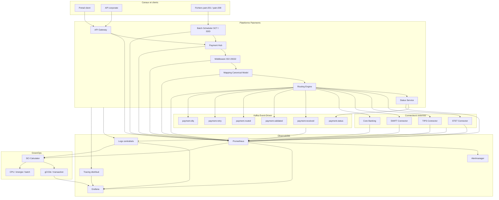
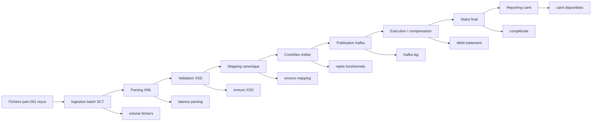
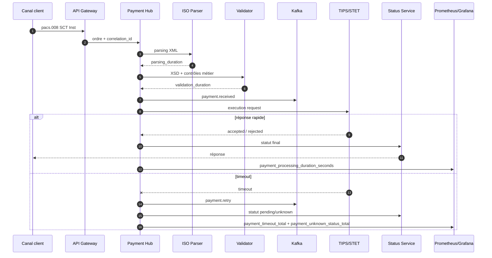
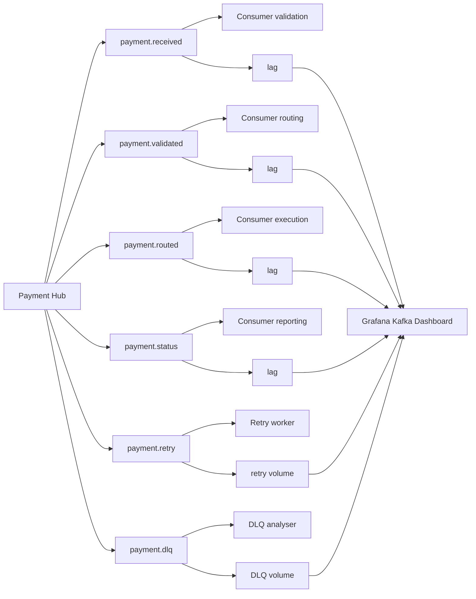
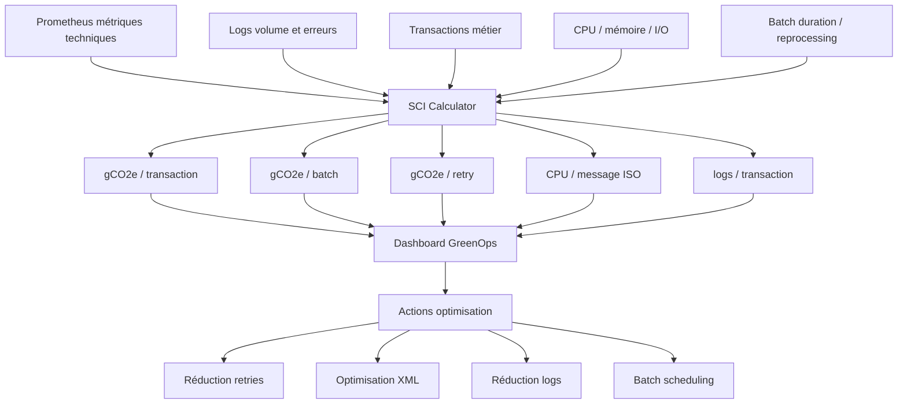
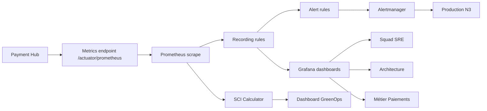

# Monitoring des flux de paiements bancaires ISO 20022 avec Prometheus, Grafana, logs, métriques métier, SRE et GreenOps

**Fichier :** `08_OBSERVABILITE_SRE_02_monitoring_flux.md`  
**Projet :** `greenops-it-flux-architecture`  
**Domaine :** Observabilité / SRE / Production N3 / Paiements critiques  
**Flux couverts :** SCT, SDD, SCT Inst, cross-border, cash management  
**Socle :** Payment Hub, ISO 20022, Kafka / Event-Driven, résilience, SLI/SLO, GreenOps / SCI  
**Niveau attendu :** Architecte SRE / Observabilité / Paiements / Production N3  

---

## 1. Objectif du document

Ce document définit une stratégie complète de monitoring pour une plateforme de paiements bancaires critique intégrant :

- un **Payment Hub** central ;
- des flux **SCT**, **SDD**, **SCT Inst**, **cross-border** et **cash management** ;
- des messages **ISO 20022** ;
- une architecture **Event-Driven Kafka** ;
- des mécanismes de résilience : retry, idempotence, circuit breaker, timeout, DLQ ;
- un pilotage **SLI/SLO** ;
- une approche **GreenOps** avec SCI et gCO2e / transaction ;
- une exploitation par une **production N3**.

Le but est de rendre les flux observables de bout en bout, depuis la réception d’un ordre de paiement jusqu’à son statut final, tout en donnant aux équipes SRE, production, architecture et métier les indicateurs nécessaires pour détecter, diagnostiquer, arbitrer et améliorer.

Le document répond aux questions suivantes :

- quels flux monitorer ;
- quelles métriques collecter ;
- où placer les points d’instrumentation ;
- quelles métriques Prometheus exposer ;
- quelles requêtes PromQL utiliser ;
- quels dashboards Grafana construire ;
- quels seuils d’alerte définir ;
- comment relier monitoring technique, métier et GreenOps ;
- comment rendre le monitoring exploitable en production N3.

---

## 2. Pourquoi monitorer les flux de paiements

Le monitoring d’une plateforme de paiements ne peut pas se limiter à CPU, mémoire, disponibilité HTTP ou état des pods. Dans un contexte bancaire, il faut monitorer le service réellement rendu : paiement reçu, validé, routé, exécuté, rejeté, retourné, compensé, reporté et tracé.

### 2.1. Criticité métier

Un incident sur les paiements peut provoquer :

- retard de virement ;
- rejet massif ;
- double exécution ;
- statut inconnu ;
- non-respect de cut-off ;
- insatisfaction client entreprise ;
- impact trésorerie ;
- escalade réglementaire ;
- mobilisation production N3 ;
- consommation importante de ressources ;
- augmentation de l’empreinte carbone par reprocessing.

### 2.2. Spécificité bancaire

Les paiements sont soumis à :

- des cut-offs ;
- des règles interbancaires ;
- des formats ISO 20022 stricts ;
- des délais temps réel pour SCT Inst ;
- des contraintes de réconciliation ;
- des contraintes d’audit ;
- des contrôles anti-fraude et conformité ;
- des dépendances STET, TIPS, SWIFT, Core Banking ;
- des statuts intermédiaires complexes.

### 2.3. Objectif SRE

Le monitoring doit permettre :

- de mesurer les SLI ;
- de vérifier les SLO ;
- de consommer l’error budget de manière maîtrisée ;
- de détecter les dérives avant incident majeur ;
- de produire des preuves postmortem ;
- de prioriser les corrections ;
- d’industrialiser les runbooks N3.

### 2.4. Objectif GreenOps

Le monitoring doit aussi mesurer :

- CPU / transaction ;
- énergie / batch ;
- gCO2e / transaction ;
- gCO2e / retry ;
- volumétrie de logs ;
- coût carbone des erreurs ;
- coût carbone des reprocessings ;
- efficacité des optimisations.

---

## 3. Différence entre monitoring technique, métier et GreenOps

### 3.1. Monitoring technique

Le monitoring technique observe l’état des composants :

| Composant | Exemples de métriques |
|---|---|
| API Gateway | HTTP 2xx/4xx/5xx, latence, timeout |
| Payment Hub | threads, mémoire, exceptions, latence interne |
| Kafka | lag, offsets, débit, erreurs producer/consumer |
| Base de données | connexions, locks, temps requêtes |
| Batch scheduler | jobs en succès/erreur, durée, prochaine exécution |
| Connecteurs | disponibilité STET/TIPS/SWIFT/Core Banking |
| Infrastructure | CPU, RAM, disque, réseau, pods, containers |

### 3.2. Monitoring métier

Le monitoring métier observe les paiements eux-mêmes :

| Flux | Exemples de métriques métier |
|---|---|
| SCT | paiements reçus, traités, rejetés, batch terminé avant cut-off |
| SDD | prélèvements émis, R-transactions, mandats invalides |
| SCT Inst | paiements < 10s, statuts inconnus, timeouts |
| Cross-border | statuts intermédiaires, corridors, contrôles conformité |
| Cash management | fichiers reçus, ACK, reportings camt disponibles |

### 3.3. Monitoring GreenOps

Le monitoring GreenOps observe l’efficience :

| Domaine | Exemples de métriques |
|---|---|
| CPU | CPU / paiement, CPU / message ISO |
| Énergie | kWh / batch, énergie / million transactions |
| Carbone | gCO2e / transaction, gCO2e / batch |
| Logs | Go / jour, logs / transaction |
| Retry | gCO2e / retry, retries inutiles |
| Reprocessing | coût CPU et carbone des replays |

### 3.4. Lecture architecte

Un bon monitoring bancaire doit croiser les trois dimensions :

```text
Santé technique + Santé métier + Sobriété opérationnelle
```

Exemple :

- Technique : Kafka lag augmente.
- Métier : SCT batch risque le cut-off.
- GreenOps : retries et logs augmentent fortement.
- Décision : prioriser correction consumer / mapping / backpressure avant d’ajouter uniquement de la capacité.

---

## 4. Architecture de monitoring cible

L’architecture de monitoring doit être pensée comme une chaîne complète : instrumentation, collecte, stockage, visualisation, alerting, diagnostic et amélioration continue.

### 4.1. Composants cibles

- Payment Hub instrumenté ;
- API Gateway instrumentée ;
- Middleware ISO 20022 instrumenté ;
- Kafka exporters ;
- batch scheduler exporters ;
- connecteurs STET / TIPS / SWIFT ;
- Core Banking probes ;
- logs centralisés ;
- traces distribuées ;
- Prometheus ;
- Alertmanager ;
- Grafana ;
- stockage long terme métriques ;
- moteur SCI / GreenOps ;
- dashboards production N3 ;
- dashboards métier ;
- dashboards architecture.

### 4.2. Diagramme Mermaid — architecture monitoring complète



### 4.3. Principes d’architecture

- chaque flux doit être traçable par `correlation_id` ;
- chaque paiement doit disposer d’un `payment_id` ;
- chaque message ISO doit être mesuré par type et version ;
- Kafka doit être monitoré par topic, partition et consumer group ;
- les batchs doivent être monitorés par fenêtre métier ;
- les retries doivent être visibles ;
- les statuts inconnus doivent déclencher un signal fort ;
- les métriques GreenOps doivent être rapprochées des métriques métier.

---

## 5. Sources de métriques

### 5.1. Payment Hub

Le Payment Hub est la source principale pour les métriques métier.

Métriques attendues :

- nombre de paiements reçus ;
- nombre de paiements acceptés ;
- nombre de paiements rejetés ;
- durée de traitement ;
- statut final ;
- statut inconnu ;
- retry count ;
- idempotence hit ;
- circuit breaker state ;
- erreurs fonctionnelles ;
- erreurs techniques ;
- volume par flux.

### 5.2. API Gateway

Métriques attendues :

- requêtes par endpoint ;
- taux HTTP 2xx / 4xx / 5xx ;
- latence ;
- timeout ;
- throttling ;
- authentification refusée ;
- quotas client ;
- TLS errors ;
- taille payload ;
- endpoint SCT Inst ;
- endpoint cash management ;
- endpoint statut.

### 5.3. Kafka

Métriques attendues :

- message produced total ;
- message consumed total ;
- consumer lag ;
- producer error ;
- consumer error ;
- topic size ;
- partition imbalance ;
- DLQ count ;
- retry topic count ;
- event age ;
- offset commit latency.

### 5.4. Middleware ISO

Métriques attendues :

- messages ISO reçus ;
- parsing success / failure ;
- validation XSD success / failure ;
- mapping success / failure ;
- version ISO ;
- message type ;
- taille XML ;
- durée parsing ;
- durée validation ;
- durée mapping ;
- rejet fonctionnel ISO.

### 5.5. Batch scheduler

Métriques attendues :

- jobs planifiés ;
- jobs démarrés ;
- jobs terminés ;
- jobs en échec ;
- durée de job ;
- volume traité ;
- débit ;
- projection fin ;
- cut-off risk ;
- reprocessing ;
- skipped jobs ;
- dépendances non satisfaites.

### 5.6. STET / TIPS / SWIFT connectors

Métriques attendues :

- disponibilité connecteur ;
- latence connecteur ;
- timeout ;
- erreurs protocolaires ;
- rejet interbancaire ;
- statut reçu ;
- statut manquant ;
- retry connecteur ;
- circuit breaker ;
- messages envoyés / reçus.

### 5.7. Core Banking

Métriques attendues :

- disponibilité API core banking ;
- latence débit / crédit ;
- timeout ;
- erreurs fonctionnelles ;
- erreurs techniques ;
- locks ;
- rejet compte ;
- statut comptable ;
- cohérence statut paiement / écriture comptable.

### 5.8. Logs

Les logs doivent porter :

- `correlation_id`;
- `payment_id`;
- `end_to_end_id`;
- `instruction_id`;
- `message_id`;
- `flow_type`;
- `iso_message_type`;
- `status`;
- `retry_count`;
- `error_code`;
- `business_error_code`;
- `technical_error_code`;
- `kafka_topic`;
- `partition`;
- `offset`.

### 5.9. Traces

Les traces distribuées doivent couvrir :

- API Gateway ;
- Payment Hub ;
- ISO parser ;
- XSD validator ;
- mapping ;
- Kafka produce ;
- Kafka consume ;
- connecteur externe ;
- status service ;
- base de données ;
- reporting camt.

---

## 6. Métriques globales plateforme

### 6.1. Transactions globales

```text
payment_transactions_total{flow_type, channel, status, environment}
```

Usage :

- suivre le volume global ;
- comparer par flux ;
- détecter une chute d’activité ;
- détecter une hausse anormale.

PromQL :

```promql
sum(rate(payment_transactions_total[5m]))
```

Par flux :

```promql
sum by (flow_type) (rate(payment_transactions_total[5m]))
```

### 6.2. Rejets globaux

```text
payment_rejections_total{flow_type, reason, iso_message_type, client_segment}
```

PromQL :

```promql
sum(rate(payment_rejections_total[15m])) 
/ 
sum(rate(payment_transactions_total[15m]))
```

### 6.3. Durée de traitement

```text
payment_processing_duration_seconds_bucket{flow_type, step}
```

PromQL P95 :

```promql
histogram_quantile(
  0.95,
  sum by (le, flow_type) (
    rate(payment_processing_duration_seconds_bucket[5m])
  )
)
```

### 6.4. Statuts inconnus

```text
payment_unknown_status_total{flow_type, age_bucket}
```

PromQL :

```promql
sum by (flow_type) (increase(payment_unknown_status_total[15m]))
```

### 6.5. Taux de succès

PromQL :

```promql
sum(rate(payment_transactions_total{status="success"}[15m]))
/
sum(rate(payment_transactions_total[15m]))
```

### 6.6. Tableau de seuils globaux

| Métrique | Warning | Critical |
|---|---:|---:|
| taux succès E2E | < 99,5 % | < 99 % |
| taux rejet technique | > 0,5 % | > 1 % |
| P95 latence globale | > 2 s | > 5 s |
| statuts inconnus | > 0,05 % | > 0,1 % |
| retry rate | > 1 % | > 2 % |
| Kafka lag critique | > 1 000 | > 5 000 |

---

## 7. Métriques SCT

Le SCT est souvent batch ou semi-batch. Le monitoring doit se concentrer sur le volume, le cut-off, la complétude, les rejets et le débit.

### 7.1. Métriques clés SCT

```text
payment_transactions_total{flow_type="SCT"}
payment_rejections_total{flow_type="SCT"}
payment_processing_duration_seconds{flow_type="SCT"}
payment_batch_completion_timestamp_seconds{flow_type="SCT"}
payment_batch_expected_total{flow_type="SCT"}
payment_batch_processed_total{flow_type="SCT"}
payment_batch_cutoff_timestamp_seconds{flow_type="SCT"}
```

### 7.2. Taux de complétude SCT

PromQL :

```promql
sum(payment_batch_processed_total{flow_type="SCT"})
/
sum(payment_batch_expected_total{flow_type="SCT"})
```

### 7.3. Risque cut-off SCT

PromQL conceptuelle :

```promql
payment_batch_estimated_end_timestamp_seconds{flow_type="SCT"}
-
payment_batch_cutoff_timestamp_seconds{flow_type="SCT"}
```

Interprétation :

- valeur négative : marge avant cut-off ;
- valeur proche de zéro : risque ;
- valeur positive : cut-off dépassé.

### 7.4. Monitoring SCT batch



### 7.5. Seuils SCT

| Signal | Warning | Critical |
|---|---:|---:|
| complétude batch | < 99,9 % | < 99,5 % |
| projection cut-off | marge < 30 min | marge < 10 min |
| rejet XML | > 0,15 % | > 0,2 % |
| erreurs mapping | > 0,05 % | > 0,1 % |
| débit nominal | -20 % | -40 % |
| lag Kafka SCT | > 10 000 | > 50 000 |

---

## 8. Métriques SDD

Le SDD doit être monitoré autour des prélèvements, mandats, échéances, R-transactions et reportings.

### 8.1. Métriques clés SDD

```text
payment_transactions_total{flow_type="SDD"}
payment_rejections_total{flow_type="SDD"}
payment_r_transactions_total{flow_type="SDD", r_type}
payment_mandate_validation_total{result}
payment_batch_processed_total{flow_type="SDD"}
payment_reporting_camt_total{flow_type="SDD"}
```

### 8.2. Taux R-transactions

PromQL :

```promql
sum(rate(payment_r_transactions_total{flow_type="SDD"}[1h]))
/
sum(rate(payment_transactions_total{flow_type="SDD"}[1h]))
```

### 8.3. Taux mandats invalides

PromQL :

```promql
sum(rate(payment_mandate_validation_total{result="invalid"}[1h]))
/
sum(rate(payment_mandate_validation_total[1h]))
```

### 8.4. Seuils SDD

| Métrique | Warning | Critical |
|---|---:|---:|
| R-transactions | > 0,7 % | > 1 % |
| mandats invalides | > 0,3 % | > 0,5 % |
| rejet pain.008 | > 0,15 % | > 0,2 % |
| batch non terminé | marge < 30 min | cut-off menacé |
| camt manquant | > 0,2 % | > 0,5 % |
| statuts inconnus | > 0,1 % | > 0,2 % |

### 8.5. Lecture N3

Une hausse SDD peut venir :

- d’un problème de mandat ;
- d’un changement client ;
- d’un mapping `pain.008` ;
- d’un problème calendrier ;
- d’un rejet interbancaire ;
- d’un incident de reporting camt ;
- d’un reprocessing incorrect.

---

## 9. Métriques SCT Inst

Le SCT Inst est temps réel. Il exige un monitoring très fin sur la latence, le timeout, les statuts inconnus et les retries.

### 9.1. Métriques clés SCT Inst

```text
payment_transactions_total{flow_type="SCT_INST"}
payment_processing_duration_seconds_bucket{flow_type="SCT_INST"}
payment_timeout_total{flow_type="SCT_INST"}
payment_retry_total{flow_type="SCT_INST"}
payment_unknown_status_total{flow_type="SCT_INST"}
payment_idempotency_hit_total{flow_type="SCT_INST"}
payment_connector_duration_seconds_bucket{connector="TIPS"}
```

### 9.2. SLO 99 % < 10 secondes

PromQL :

```promql
sum(rate(payment_processing_duration_seconds_bucket{flow_type="SCT_INST", le="10"}[5m]))
/
sum(rate(payment_processing_duration_seconds_count{flow_type="SCT_INST"}[5m]))
```

### 9.3. P99 SCT Inst

PromQL :

```promql
histogram_quantile(
  0.99,
  sum by (le) (
    rate(payment_processing_duration_seconds_bucket{flow_type="SCT_INST"}[5m])
  )
)
```

### 9.4. Monitoring SCT Inst temps réel



### 9.5. Seuils SCT Inst

| Métrique | Warning | Critical |
|---|---:|---:|
| SLO < 10s | < 99,2 % | < 99 % |
| P95 latence | > 7 s | > 9 s |
| P99 latence | > 9 s | > 10 s |
| timeout rate | > 0,3 % | > 0,5 % |
| retry rate | > 1 % | > 2 % |
| statuts inconnus | > 0,05 % | > 0,1 % |
| TIPS connector P95 | > 4 s | > 6 s |

---

## 10. Métriques cross-border

Les paiements cross-border exigent un monitoring par corridor, devise, connecteur, statut intermédiaire et conformité.

### 10.1. Métriques clés

```text
payment_transactions_total{flow_type="CROSS_BORDER", corridor, currency}
payment_processing_duration_seconds_bucket{flow_type="CROSS_BORDER", corridor}
payment_compliance_check_total{result, check_type}
payment_connector_errors_total{connector="SWIFT"}
payment_intermediate_status_total{flow_type="CROSS_BORDER", status}
payment_fx_mapping_errors_total{currency_pair}
```

### 10.2. Latence par corridor

PromQL :

```promql
histogram_quantile(
  0.95,
  sum by (le, corridor) (
    rate(payment_processing_duration_seconds_bucket{flow_type="CROSS_BORDER"}[30m])
  )
)
```

### 10.3. Taux erreurs connecteur SWIFT

PromQL :

```promql
sum(rate(payment_connector_errors_total{connector="SWIFT"}[15m]))
/
sum(rate(payment_transactions_total{flow_type="CROSS_BORDER"}[15m]))
```

### 10.4. Seuils cross-border

| Métrique | Warning | Critical |
|---|---:|---:|
| statut intermédiaire absent | > 0,5 % | > 1 % |
| erreur SWIFT | > 0,3 % | > 0,8 % |
| erreur mapping devise | > 0,02 % | > 0,05 % |
| rejet conformité | dérive +20 % | dérive +50 % |
| latence P95 corridor critique | > baseline +30 % | > baseline +60 % |

---

## 11. Métriques cash management

Le cash management doit monitorer la disponibilité des services client entreprise, l’ingestion des fichiers, les ACK et les reportings.

### 11.1. Métriques clés

```text
cash_file_received_total{client_segment, file_type}
cash_file_ingestion_total{result}
cash_ack_generated_total{result}
cash_ack_duration_seconds_bucket
payment_reporting_camt_total{message_type}
cash_portal_requests_total{status}
cash_api_duration_seconds_bucket
```

### 11.2. Taux ingestion fichiers

PromQL :

```promql
sum(rate(cash_file_ingestion_total{result="success"}[15m]))
/
sum(rate(cash_file_received_total[15m]))
```

### 11.3. ACK sous 5 minutes

PromQL :

```promql
sum(rate(cash_ack_duration_seconds_bucket{le="300"}[15m]))
/
sum(rate(cash_ack_duration_seconds_count[15m]))
```

### 11.4. Seuils cash management

| Métrique | Warning | Critical |
|---|---:|---:|
| ingestion fichier | < 99,5 % | < 99 % |
| ACK < 5 min | < 95 % | < 90 % |
| portail API 5xx | > 0,5 % | > 1 % |
| camt manquants | > 0,2 % | > 0,5 % |
| taille fichier | > baseline +50 % | > baseline +100 % |

---

## 12. Métriques ISO 20022

ISO 20022 doit être monitoré comme un produit technique et métier central.

### 12.1. Métriques par type de message

```text
iso_messages_total{message_type, version, flow_type}
iso_validation_errors_total{message_type, version, error_code}
iso_mapping_errors_total{message_type, target_model}
iso_message_processing_duration_seconds_bucket{message_type, step}
iso_message_version_total{version}
```

### 12.2. Taux erreur ISO

PromQL :

```promql
sum(rate(iso_validation_errors_total[15m]))
/
sum(rate(iso_messages_total[15m]))
```

### 12.3. Répartition par message

PromQL :

```promql
sum by (message_type) (rate(iso_messages_total[15m]))
```

### 12.4. Tableau ISO

| Message | Flux | Monitoring prioritaire |
|---|---|---|
| `pain.001` | SCT / cash | parsing, XSD, batch, mapping |
| `pain.008` | SDD | XSD, mandat, R-transactions |
| `pacs.008` | SCT Inst / cross-border | latence, statut, connecteur |
| `pacs.002` | statut | fraîcheur, cohérence |
| `camt.052` | intraday | disponibilité |
| `camt.053` | statement | complétude |
| `camt.054` | notification | délai, cohérence |

---

## 13. Métriques parsing XML

### 13.1. Métriques obligatoires

```text
xml_parsing_total{message_type, result}
xml_parsing_duration_seconds_bucket{message_type}
xml_payload_size_bytes_bucket{message_type}
xml_payload_size_bytes_sum{message_type}
xml_payload_size_bytes_count{message_type}
```

### 13.2. Taille moyenne XML

PromQL :

```promql
sum(rate(xml_payload_size_bytes_sum[15m]))
/
sum(rate(xml_payload_size_bytes_count[15m]))
```

### 13.3. P95 parsing

PromQL :

```promql
histogram_quantile(
  0.95,
  sum by (le, message_type) (
    rate(xml_parsing_duration_seconds_bucket[15m])
  )
)
```

### 13.4. Seuils parsing

| Flux | Warning | Critical |
|---|---:|---:|
| SCT Inst pacs.008 P95 | > 150 ms | > 300 ms |
| SCT pain.001 P95 | > 500 ms | > 1 s |
| SDD pain.008 P95 | > 700 ms | > 1,5 s |
| camt.054 P95 | > 500 ms | > 1 s |
| payload moyen | +30 % baseline | +60 % baseline |

### 13.5. Lecture GreenOps

Une augmentation de `xml_payload_size_bytes` peut provoquer :

- hausse CPU ;
- hausse mémoire ;
- hausse latence ;
- hausse logs ;
- hausse gCO2e / transaction.

---

## 14. Métriques validation XSD

### 14.1. Métriques obligatoires

```text
iso_validation_errors_total{message_type, version, error_code}
iso_validation_success_total{message_type, version}
iso_validation_duration_seconds_bucket{message_type, version}
```

### 14.2. Taux succès validation

PromQL :

```promql
sum(rate(iso_validation_success_total[15m]))
/
(
  sum(rate(iso_validation_success_total[15m]))
  +
  sum(rate(iso_validation_errors_total[15m]))
)
```

### 14.3. Top erreurs XSD

PromQL :

```promql
topk(10, sum by (error_code) (increase(iso_validation_errors_total[1h])))
```

### 14.4. Seuils XSD

| Métrique | Warning | Critical |
|---|---:|---:|
| erreurs XSD globales | > 0,15 % | > 0,2 % |
| erreur XSD client unique | > baseline +30 % | > baseline +60 % |
| validation P95 SCT Inst | > 200 ms | > 400 ms |
| validation P95 batch | > 900 ms | > 1,5 s |

---

## 15. Métriques mapping

### 15.1. Métriques obligatoires

```text
iso_mapping_total{message_type, target_model, result}
iso_mapping_errors_total{message_type, field, error_code}
iso_mapping_duration_seconds_bucket{message_type, target_model}
iso_mapping_missing_field_total{message_type, field}
```

### 15.2. Taux erreur mapping

PromQL :

```promql
sum(rate(iso_mapping_errors_total[15m]))
/
sum(rate(iso_mapping_total[15m]))
```

### 15.3. P95 mapping

PromQL :

```promql
histogram_quantile(
  0.95,
  sum by (le, message_type) (
    rate(iso_mapping_duration_seconds_bucket[15m])
  )
)
```

### 15.4. Champs critiques à surveiller

| Champ | Risque |
|---|---|
| EndToEndId | perte de traçabilité |
| InstructionId | réconciliation impossible |
| Debtor | erreur donneur d’ordre |
| Creditor | mauvais bénéficiaire |
| IBAN | rejet ou mauvais routage |
| Amount | risque financier |
| Currency | risque cross-border |
| ExecutionDate | cut-off / échéance |
| MandateId | risque SDD |
| StatusReason | mauvaise interprétation rejet |

---

## 16. Métriques Kafka / Event-Driven

Kafka est le backbone événementiel de la plateforme. Son monitoring doit couvrir production, consommation, lag, DLQ, retry et âge des événements.

### 16.1. Métriques obligatoires Kafka

```text
kafka_topic_messages_in_total{topic}
kafka_consumergroup_lag{topic, consumergroup, partition}
kafka_producer_errors_total{topic}
kafka_consumer_errors_total{topic, consumergroup}
kafka_event_age_seconds_bucket{topic}
payment_retry_total{topic}
payment_dlq_total{topic, reason}
```

### 16.2. Lag consumer group

PromQL :

```promql
sum by (topic, consumergroup) (kafka_consumergroup_lag)
```

### 16.3. DLQ rate

PromQL :

```promql
sum(rate(payment_dlq_total[15m]))
/
sum(rate(payment_transactions_total[15m]))
```

### 16.4. Monitoring Kafka



### 16.5. Seuils Kafka

| Métrique | Warning | Critical |
|---|---:|---:|
| lag topic temps réel | > 500 | > 1 000 |
| lag topic batch | > 10 000 | > 50 000 |
| DLQ rate | > 0,05 % | > 0,1 % |
| producer errors | > 0,1 % | > 0,5 % |
| event age SCT Inst | > 5 s | > 10 s |
| retry topic volume | +50 % baseline | +100 % baseline |

---

## 17. Métriques batch

### 17.1. Métriques obligatoires batch

```text
batch_job_total{job_name, flow_type, result}
batch_job_duration_seconds_bucket{job_name, flow_type}
batch_job_records_expected_total{job_name, flow_type}
batch_job_records_processed_total{job_name, flow_type}
batch_job_records_failed_total{job_name, flow_type}
batch_job_cutoff_seconds{job_name, flow_type}
batch_job_estimated_end_seconds{job_name, flow_type}
```

### 17.2. Taux succès batch

PromQL :

```promql
sum(rate(batch_job_total{result="success"}[1d]))
/
sum(rate(batch_job_total[1d]))
```

### 17.3. Projection cut-off

PromQL conceptuelle :

```promql
batch_job_estimated_end_seconds - batch_job_cutoff_seconds
```

### 17.4. Seuils batch

| Métrique | Warning | Critical |
|---|---:|---:|
| durée batch | +20 % baseline | +40 % baseline |
| records failed | > 0,1 % | > 0,5 % |
| projection cut-off | marge < 30 min | marge < 10 min |
| débit records/min | -20 % baseline | -40 % baseline |
| reprocessing | > 5 % volume | > 10 % volume |

---

## 18. Métriques retries

### 18.1. Métriques obligatoires

```text
payment_retry_total{flow_type, reason, retry_number}
payment_retry_success_total{flow_type, reason}
payment_retry_exhausted_total{flow_type, reason}
payment_retry_duration_seconds_bucket{flow_type}
payment_idempotency_hit_total{flow_type}
payment_circuit_breaker_open_total{dependency}
```

### 18.2. Retry rate

PromQL :

```promql
sum(rate(payment_retry_total[15m]))
/
sum(rate(payment_transactions_total[15m]))
```

### 18.3. Retry success rate

PromQL :

```promql
sum(rate(payment_retry_success_total[15m]))
/
sum(rate(payment_retry_total[15m]))
```

### 18.4. Retry waste rate

PromQL :

```promql
sum(rate(payment_retry_exhausted_total[15m]))
/
sum(rate(payment_retry_total[15m]))
```

### 18.5. Seuils retries

| Métrique | Warning | Critical |
|---|---:|---:|
| retry rate global | > 1 % | > 2 % |
| retry SCT Inst | > 1 % | > 2 % |
| retry exhausted | > 0,1 % | > 0,5 % |
| retry success faible | < 60 % | < 40 % |
| idempotency missing | > 0 | > 0 |

---

## 19. Métriques statuts inconnus

### 19.1. Métriques obligatoires

```text
payment_unknown_status_total{flow_type, age_bucket}
payment_status_age_seconds_bucket{flow_type}
payment_status_reconciliation_total{flow_type, result}
payment_status_query_total{dependency, result}
```

### 19.2. Taux statuts inconnus

PromQL :

```promql
sum(rate(payment_unknown_status_total[15m]))
/
sum(rate(payment_transactions_total[15m]))
```

### 19.3. Statuts âgés

PromQL :

```promql
sum by (flow_type, age_bucket) (payment_unknown_status_total)
```

### 19.4. Seuils

| Flux | Warning | Critical |
|---|---:|---:|
| SCT Inst | > 0,05 % | > 0,1 % |
| SCT batch | > 0,05 % | > 0,1 % |
| SDD | > 0,1 % | > 0,2 % |
| Cross-border | > 0,2 % | > 0,5 % |
| Cash management | > 0,1 % | > 0,2 % |

### 19.5. Lecture opérationnelle

Un statut inconnu n’est pas une simple erreur technique. C’est une anomalie métier majeure potentielle, car il peut cacher :

- un paiement exécuté mais non confirmé ;
- un rejet non reçu ;
- un timeout ;
- une désynchronisation Kafka ;
- une erreur de mapping `pacs.002`;
- une réconciliation camt manquante.

---

## 20. Métriques logs / stockage

### 20.1. Métriques obligatoires

```text
log_events_total{application, level, flow_type}
log_volume_bytes_total{application, flow_type}
log_error_total{application, error_code}
log_correlation_missing_total{application}
log_storage_bytes{index, retention}
```

### 20.2. Volume logs par transaction

PromQL :

```promql
sum(rate(log_volume_bytes_total[1h]))
/
sum(rate(payment_transactions_total[1h]))
```

### 20.3. Logs erreurs

PromQL :

```promql
sum by (application, error_code) (rate(log_error_total[15m]))
```

### 20.4. Corrélation manquante

PromQL :

```promql
sum(rate(log_correlation_missing_total[15m]))
```

### 20.5. Seuils logs

| Métrique | Warning | Critical |
|---|---:|---:|
| volume logs | +30 % baseline | +60 % baseline |
| logs erreur | +30 % baseline | +70 % baseline |
| correlation_id manquant | > 0,1 % | > 0,5 % |
| stockage index | > 80 % | > 90 % |
| logs / transaction | +25 % baseline | +50 % baseline |

### 20.6. Risque GreenOps

Les logs excessifs augmentent :

- stockage ;
- I/O ;
- coûts ;
- empreinte carbone ;
- bruit opérationnel ;
- difficulté d’analyse.

---

## 21. Métriques GreenOps

### 21.1. Métriques obligatoires

```text
payment_carbon_gco2e_total{flow_type}
payment_carbon_gco2e_per_transaction{flow_type}
payment_cpu_seconds_total{flow_type}
payment_energy_kwh_total{flow_type}
payment_retry_carbon_gco2e_total{flow_type}
payment_batch_energy_kwh_total{flow_type, job_name}
payment_logs_carbon_gco2e_total{application}
```

### 21.2. gCO2e / transaction

PromQL :

```promql
sum(rate(payment_carbon_gco2e_total[1h]))
/
sum(rate(payment_transactions_total[1h]))
```

### 21.3. gCO2e par flux

PromQL :

```promql
sum by (flow_type) (rate(payment_carbon_gco2e_total[1h]))
/
sum by (flow_type) (rate(payment_transactions_total[1h]))
```

### 21.4. Carbone des retries

PromQL :

```promql
sum(rate(payment_retry_carbon_gco2e_total[1h]))
/
sum(rate(payment_carbon_gco2e_total[1h]))
```

### 21.5. Monitoring GreenOps



### 21.6. Seuils GreenOps

| Métrique | Warning | Critical |
|---|---:|---:|
| gCO2e / transaction | +10 % baseline | +20 % baseline |
| CPU / transaction | +20 % baseline | +40 % baseline |
| retry carbone | > 5 % total | > 10 % total |
| énergie batch | +15 % baseline | +30 % baseline |
| logs carbone | +20 % baseline | +50 % baseline |

---

## 22. Exemple Prometheus metrics

### 22.1. Compteurs métier

```text
# HELP payment_transactions_total Nombre total de transactions de paiement traitées.
# TYPE payment_transactions_total counter
payment_transactions_total{flow_type="SCT",status="success",channel="batch",environment="prod"} 1845000
payment_transactions_total{flow_type="SDD",status="success",channel="batch",environment="prod"} 620000
payment_transactions_total{flow_type="SCT_INST",status="success",channel="api",environment="prod"} 240000
payment_transactions_total{flow_type="CROSS_BORDER",status="pending",channel="api",environment="prod"} 12000

# HELP payment_rejections_total Nombre total de rejets de paiement.
# TYPE payment_rejections_total counter
payment_rejections_total{flow_type="SCT",reason="XSD_ERROR",iso_message_type="pain.001"} 370
payment_rejections_total{flow_type="SDD",reason="INVALID_MANDATE",iso_message_type="pain.008"} 820
payment_rejections_total{flow_type="SCT_INST",reason="TIMEOUT",iso_message_type="pacs.008"} 24

# HELP payment_retry_total Nombre total de retries de paiement.
# TYPE payment_retry_total counter
payment_retry_total{flow_type="SCT_INST",reason="CONNECTOR_TIMEOUT",retry_number="1"} 460
payment_retry_total{flow_type="SCT",reason="KAFKA_PRODUCE_TIMEOUT",retry_number="1"} 1900
```

### 22.2. Histogramme latence

```text
# HELP payment_processing_duration_seconds Durée de traitement paiement.
# TYPE payment_processing_duration_seconds histogram
payment_processing_duration_seconds_bucket{flow_type="SCT_INST",step="end_to_end",le="1"} 120000
payment_processing_duration_seconds_bucket{flow_type="SCT_INST",step="end_to_end",le="5"} 236000
payment_processing_duration_seconds_bucket{flow_type="SCT_INST",step="end_to_end",le="10"} 239000
payment_processing_duration_seconds_bucket{flow_type="SCT_INST",step="end_to_end",le="+Inf"} 240000
payment_processing_duration_seconds_sum{flow_type="SCT_INST",step="end_to_end"} 820000
payment_processing_duration_seconds_count{flow_type="SCT_INST",step="end_to_end"} 240000
```

### 22.3. Métriques ISO

```text
# HELP iso_validation_errors_total Nombre total d'erreurs de validation ISO.
# TYPE iso_validation_errors_total counter
iso_validation_errors_total{message_type="pain.001",version="2019",error_code="MISSING_FIELD"} 120
iso_validation_errors_total{message_type="pacs.008",version="2019",error_code="INVALID_NAMESPACE"} 12

# HELP xml_payload_size_bytes Taille des payloads XML.
# TYPE xml_payload_size_bytes histogram
xml_payload_size_bytes_bucket{message_type="pain.001",le="10000"} 1000
xml_payload_size_bytes_bucket{message_type="pain.001",le="100000"} 8000
xml_payload_size_bytes_bucket{message_type="pain.001",le="+Inf"} 8050
xml_payload_size_bytes_sum{message_type="pain.001"} 420000000
xml_payload_size_bytes_count{message_type="pain.001"} 8050
```

### 22.4. Métriques GreenOps

```text
# HELP payment_carbon_gco2e_total Total gCO2e estimé pour les paiements.
# TYPE payment_carbon_gco2e_total counter
payment_carbon_gco2e_total{flow_type="SCT"} 840000
payment_carbon_gco2e_total{flow_type="SDD"} 310000
payment_carbon_gco2e_total{flow_type="SCT_INST"} 108000

# HELP payment_retry_carbon_gco2e_total Total gCO2e estimé lié aux retries.
# TYPE payment_retry_carbon_gco2e_total counter
payment_retry_carbon_gco2e_total{flow_type="SCT_INST"} 7800
payment_retry_carbon_gco2e_total{flow_type="SCT"} 12400
```

---

## 23. Exemple dashboard Grafana

### 23.1. Vue dashboard globale

```mermaid
flowchart TB
    A[Dashboard Global Paiements] --> B[Vue Exécutive]
    A --> C[Vue SRE N3]
    A --> D[Vue ISO 20022]
    A --> E[Vue Kafka]
    A --> F[Vue Batch]
    A --> G[Vue GreenOps]

    B --> B1[Disponibilité Payment Hub]
    B --> B2[SLO SCT Inst < 10s]
    B --> B3[Batch SCT / SDD avant cut-off]
    B --> B4[Statuts inconnus]
    B --> B5[gCO2e / transaction]

    C --> C1[Latence P95/P99]
    C --> C2[Timeouts]
    C --> C3[Retries]
    C --> C4[Circuit breakers]
    C --> C5[Runbooks]

    D --> D1[Erreurs XSD]
    D --> D2[Parsing XML]
    D --> D3[Mapping]
    D --> D4[Versions ISO]

    E --> E1[Lag topics]
    E --> E2[DLQ]
    E --> E3[Retry topics]
    E --> E4[Event age]

    F --> F1[Durée jobs]
    F --> F2[Projection cut-off]
    F --> F3[Débit records/min]

    G --> G1[SCI]
    G --> G2[CPU / transaction]
    G --> G3[Carbone retries]
    G --> G4[Logs / transaction]
```



### 23.2. Panneaux recommandés

| Panneau | Requête PromQL |
|---|---|
| Transactions par flux | `sum by (flow_type) (rate(payment_transactions_total[5m]))` |
| Taux rejet | `sum(rate(payment_rejections_total[15m])) / sum(rate(payment_transactions_total[15m]))` |
| SCT Inst < 10s | `sum(rate(payment_processing_duration_seconds_bucket{flow_type="SCT_INST",le="10"}[5m])) / sum(rate(payment_processing_duration_seconds_count{flow_type="SCT_INST"}[5m]))` |
| Retry rate | `sum(rate(payment_retry_total[15m])) / sum(rate(payment_transactions_total[15m]))` |
| Erreurs ISO | `sum by (message_type,error_code) (rate(iso_validation_errors_total[15m]))` |
| Taille XML moyenne | `sum(rate(xml_payload_size_bytes_sum[15m])) / sum(rate(xml_payload_size_bytes_count[15m]))` |
| Kafka lag | `sum by (topic, consumergroup) (kafka_consumergroup_lag)` |
| gCO2e / transaction | `sum(rate(payment_carbon_gco2e_total[1h])) / sum(rate(payment_transactions_total[1h]))` |

### 23.3. Organisation Grafana

Dossiers recommandés :

```text
Grafana/
├── 01-executive-payment-hub
├── 02-sre-n3-realtime
├── 03-sct-batch
├── 04-sdd
├── 05-sct-inst
├── 06-cross-border
├── 07-cash-management
├── 08-iso-20022
├── 09-kafka-event-driven
├── 10-batch-scheduler
├── 11-greenops-sci
└── 12-incident-postmortem
```

---

## 24. Alertes de monitoring

### 24.1. Règle d’alerte Prometheus SCT Inst

```yaml
groups:
  - name: payment-sct-inst-slo
    rules:
      - alert: SCTInstSLOLatencyBreached
        expr: |
          (
            sum(rate(payment_processing_duration_seconds_bucket{flow_type="SCT_INST",le="10"}[5m]))
            /
            sum(rate(payment_processing_duration_seconds_count{flow_type="SCT_INST"}[5m]))
          ) < 0.99
        for: 10m
        labels:
          severity: critical
          domain: payments
          flow_type: SCT_INST
          team: sre-n3
        annotations:
          summary: "SLO SCT Inst non respecté"
          description: "Moins de 99% des SCT Inst sont traités en moins de 10 secondes."
          runbook: "runbooks/payments/sct-inst-latency.md"
```

### 24.2. Règle d’alerte ISO

```yaml
groups:
  - name: iso-20022-validation
    rules:
      - alert: ISOValidationErrorRateHigh
        expr: |
          (
            sum(rate(iso_validation_errors_total[15m]))
            /
            sum(rate(iso_messages_total[15m]))
          ) > 0.002
        for: 15m
        labels:
          severity: warning
          domain: iso20022
          team: sre-n3
        annotations:
          summary: "Taux d'erreur ISO 20022 élevé"
          description: "Le taux de rejet XML dépasse 0,2% sur 15 minutes."
          runbook: "runbooks/iso/xsd-validation-errors.md"
```

### 24.3. Règle d’alerte Kafka

```yaml
groups:
  - name: kafka-payment-lag
    rules:
      - alert: PaymentKafkaLagHigh
        expr: |
          sum by (topic, consumergroup) (kafka_consumergroup_lag{topic=~"payment.*"}) > 10000
        for: 10m
        labels:
          severity: warning
          domain: kafka
          team: sre-n3
        annotations:
          summary: "Kafka lag élevé sur les flux de paiement"
          description: "Le consumer group accumule du retard sur un topic payment.*"
          runbook: "runbooks/kafka/payment-lag.md"
```

### 24.4. Règle d’alerte GreenOps

```yaml
groups:
  - name: payment-greenops
    rules:
      - alert: PaymentCarbonPerTransactionHigh
        expr: |
          (
            sum(rate(payment_carbon_gco2e_total[1h]))
            /
            sum(rate(payment_transactions_total[1h]))
          ) > 0.50
        for: 2h
        labels:
          severity: warning
          domain: greenops
          team: sre-platform
        annotations:
          summary: "gCO2e par transaction élevé"
          description: "L'intensité carbone des paiements dépasse le seuil cible."
          runbook: "runbooks/greenops/payment-carbon-intensity.md"
```

### 24.5. Tableau de synthèse alertes

| Alerte | Warning | Critical | Action N3 |
|---|---:|---:|---|
| SCT Inst < 10s | < 99,2 % | < 99 % | analyser latence/connecteurs |
| Retry rate | > 1 % | > 2 % | vérifier dépendances / circuit breaker |
| Erreurs ISO | > 0,15 % | > 0,2 % | identifier client/message/version |
| Kafka lag | > 10 000 | > 50 000 | scaler consumer / analyser DLQ |
| Batch cut-off | marge < 30 min | marge < 10 min | priorité batch / réduction bruit |
| Statuts inconnus | > 0,05 % | > 0,1 % | runbook statut |
| gCO2e / transaction | +10 % | +20 % | analyser retries/logs/XML |

---

## 25. Anti-patterns

### 25.1. Monitoring uniquement infrastructure

Surveiller uniquement CPU, RAM, disque et pods ne suffit pas. Une plateforme peut être techniquement stable et métier en échec.

### 25.2. Absence de métriques métier

Sans métriques métier, impossible de savoir :

- combien de paiements sont bloqués ;
- combien de SCT Inst dépassent 10 secondes ;
- combien de batchs risquent le cut-off ;
- combien de messages ISO sont rejetés ;
- combien de statuts sont inconnus.

### 25.3. Métriques sans labels utiles

Une métrique sans `flow_type`, `message_type`, `status`, `reason`, `environment` ou `client_segment` devient difficilement exploitable.

Mauvais :

```text
errors_total 42
```

Bon :

```text
payment_rejections_total{flow_type="SCT_INST",reason="TIMEOUT",iso_message_type="pacs.008"} 42
```

### 25.4. Trop forte cardinalité

Attention aux labels à cardinalité explosive :

- `payment_id`;
- `end_to_end_id`;
- `customer_id`;
- `iban`;
- `raw_error_message`.

Ces informations doivent aller dans les logs ou traces, pas dans les métriques Prometheus.

### 25.5. Retry invisible

Un retry invisible est dangereux. Il peut cacher :

- un incident dépendance ;
- une latence excessive ;
- une consommation CPU ;
- une dette GreenOps ;
- un risque double exécution.

### 25.6. Logs payload complets

Logger tout le XML ISO complet est risqué :

- données sensibles ;
- stockage excessif ;
- coût élevé ;
- impact carbone ;
- exposition sécurité ;
- bruit d’analyse.

### 25.7. Dashboard non actionnable

Un dashboard sans seuil, sans SLO, sans runbook et sans contexte métier est peu utile à la production N3.

---

## 26. Bonnes pratiques

### 26.1. Instrumenter dès le design

Les métriques doivent être prévues dans le HLD et le LLD, pas ajoutées après incident.

### 26.2. Définir une taxonomie commune

Labels recommandés :

```text
flow_type
message_type
version
status
reason
step
connector
environment
client_segment
channel
job_name
```

### 26.3. Utiliser les bons types Prometheus

| Type | Usage |
|---|---|
| Counter | transactions, rejets, retries |
| Gauge | lag, jobs actifs, statuts inconnus |
| Histogram | latence, taille payload |
| Summary | rarement, moins recommandé pour agrégation |

### 26.4. Séparer métriques et logs

- métriques : agrégation, seuils, dashboards ;
- logs : diagnostic détaillé ;
- traces : chemin bout-en-bout ;
- events métier : audit et réconciliation.

### 26.5. Relier alertes et runbooks

Chaque alerte doit pointer vers :

- description ;
- impact métier ;
- requêtes Grafana ;
- commandes de diagnostic ;
- actions autorisées ;
- actions interdites ;
- procédure d’escalade ;
- critères de clôture.

### 26.6. Mesurer les optimisations

Chaque amélioration doit être mesurée avant / après :

- latence ;
- rejet ;
- retry ;
- CPU / transaction ;
- gCO2e / transaction ;
- logs / transaction ;
- error budget.

### 26.7. Versionner les dashboards

Les dashboards Grafana doivent être :

- versionnés en Git ;
- relus en architecture ;
- testés en préproduction ;
- associés aux SLO ;
- maintenus avec les évolutions ISO.

---

## 27. Questions d’audit

### 27.1. Architecture monitoring

1. Existe-t-il une architecture de monitoring formalisée ?
2. Les flux SCT, SDD, SCT Inst, cross-border et cash management sont-ils couverts ?
3. Les dépendances STET, TIPS, SWIFT et Core Banking sont-elles monitorées ?
4. Kafka est-il monitoré par topic, partition et consumer group ?
5. Les batchs ont-ils un monitoring orienté cut-off ?
6. Les dashboards sont-ils adaptés aux usages SRE, N3, métier et direction ?

### 27.2. Métriques

1. Les métriques `payment_transactions_total`, `payment_rejections_total`, `payment_retry_total` existent-elles ?
2. Les latences sont-elles exposées en histogrammes ?
3. Les métriques ISO 20022 sont-elles séparées par type de message ?
4. Les tailles XML sont-elles monitorées ?
5. Les statuts inconnus sont-ils mesurés ?
6. Les métriques GreenOps sont-elles reliées aux flux ?

### 27.3. Alerting

1. Chaque alerte est-elle reliée à un SLO ?
2. Les alertes ont-elles un runbook ?
3. Les seuils sont-ils validés par les métiers ?
4. Les alertes évitent-elles le bruit ?
5. Les alertes GreenOps existent-elles ?
6. L’error budget influence-t-il les décisions ?

### 27.4. Production N3

1. Les équipes N3 savent-elles diagnostiquer un paiement par correlation id ?
2. Les statuts inconnus ont-ils une procédure dédiée ?
3. Les retries sont-ils analysables ?
4. Les DLQ sont-elles suivies ?
5. Les replays sont-ils encadrés ?
6. Les postmortems utilisent-ils les métriques ?

### 27.5. GreenOps

1. Le gCO2e / transaction est-il disponible ?
2. Les retries inutiles sont-ils quantifiés ?
3. Les logs excessifs sont-ils mesurés ?
4. Le parsing XML est-il optimisé ?
5. Les batchs sont-ils planifiés avec une logique sobriété ?
6. Les gains sont-ils mesurés après optimisation ?

---

## 28. Synthèse architecte

Le monitoring d’une plateforme de paiements bancaires ISO 20022 doit être conçu comme un système de pilotage de bout en bout.

Il doit couvrir :

- la santé technique ;
- la santé métier ;
- la conformité ISO ;
- la résilience ;
- Kafka ;
- les batchs ;
- les connecteurs ;
- les statuts ;
- les retries ;
- les logs ;
- les traces ;
- l’efficience GreenOps.

### 28.1. Vue cible

```text
Payment Hub observable
+ ISO 20022 mesuré
+ Kafka monitoré
+ batchs pilotés par cut-off
+ SCT Inst piloté par latence
+ statuts inconnus visibles
+ retries maîtrisés
+ dashboards Grafana actionnables
+ alertes reliées aux SLO
+ GreenOps intégré
+ runbooks N3 disponibles
```

### 28.2. Flux métriques Payment Hub → Prometheus → Grafana



### 28.3. Décisions clés

| Décision | Recommandation |
|---|---|
| Format métriques | Prometheus exposition native |
| Latence | histogrammes par flux et étape |
| ISO | métriques par message type/version/error_code |
| Kafka | lag par topic/consumer group |
| Batch | projection cut-off obligatoire |
| Logs | corrélation forte, payload limité |
| GreenOps | gCO2e / transaction et gCO2e / retry |
| Dashboards | séparation exécutif, N3, ISO, Kafka, GreenOps |
| Alertes | reliées aux SLO et runbooks |
| Audit | preuves métriques + dashboards + postmortems |

### 28.4. Message d’entretien

Dans une plateforme de paiements critique, le monitoring ne consiste pas à vérifier que les serveurs tournent. Il consiste à prouver que les paiements avancent correctement, dans les délais, avec un statut fiable, une conformité ISO mesurée, des retries maîtrisés, des batchs sous cut-off, une chaîne Kafka saine et une empreinte carbone pilotable.

La maturité cible est atteinte lorsque la production N3 peut partir d’un symptôme métier, retrouver le flux, identifier la métrique, consulter le dashboard, appliquer le runbook, mesurer l’impact SLO, comprendre l’impact GreenOps et alimenter un postmortem exploitable.
