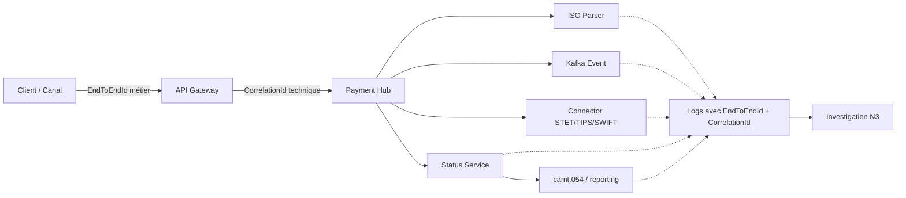
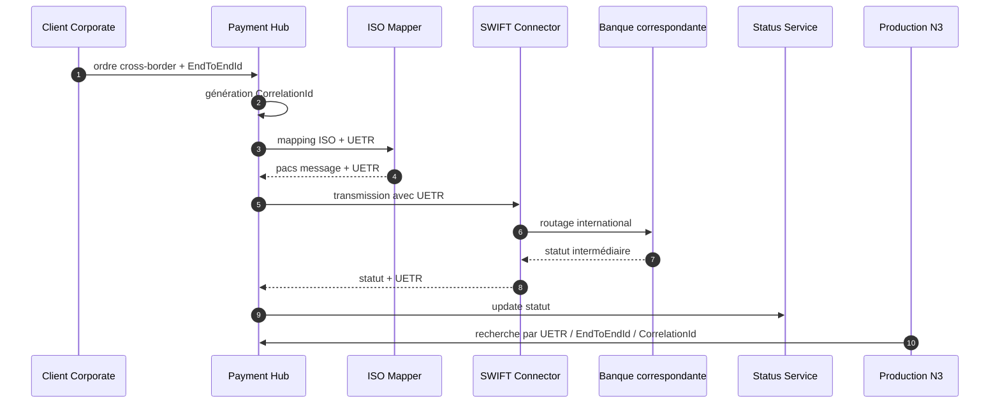
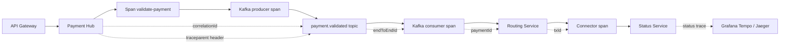
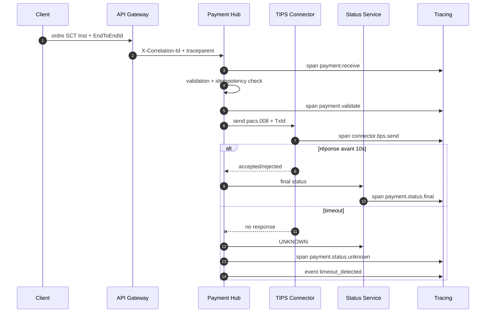
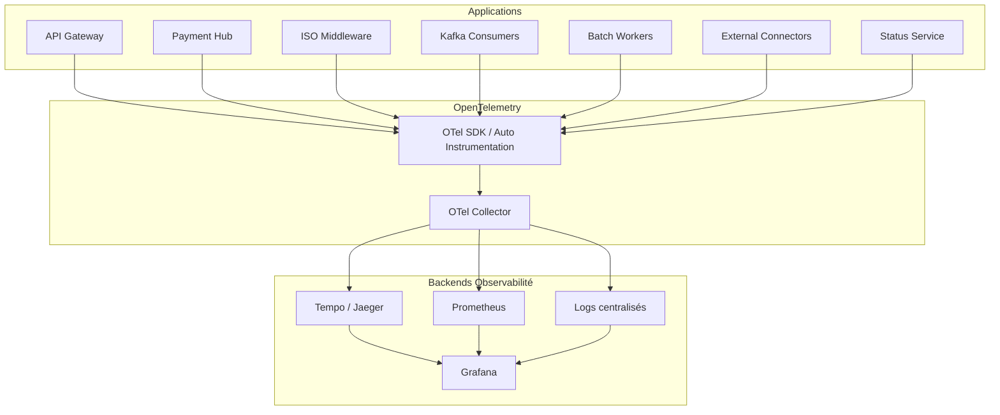
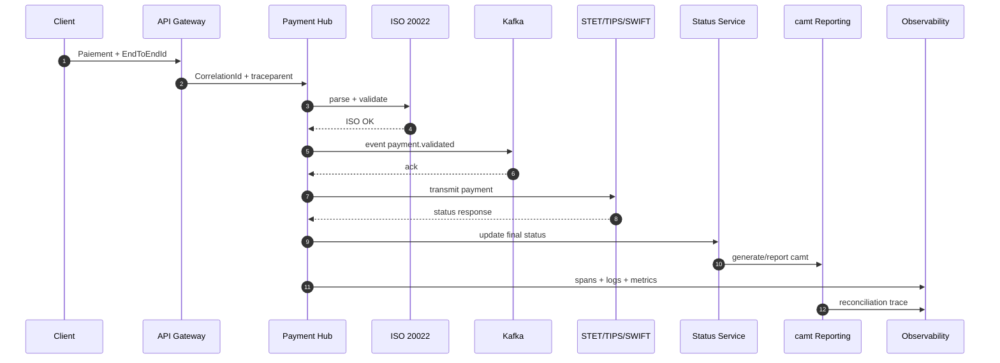
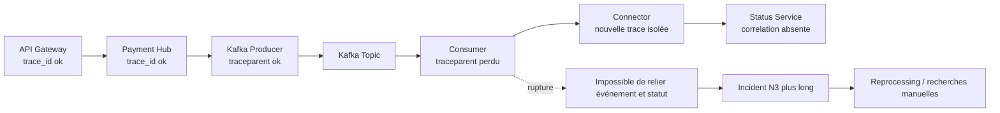
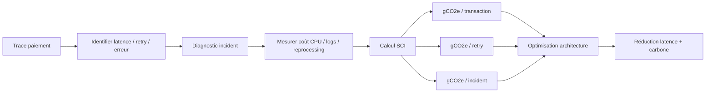

# Tracing end-to-end des flux de paiements bancaires ISO 20022

**Fichier :** `08_OBSERVABILITE_SRE_03_tracing.md`  
**Projet :** `greenops-it-flux-architecture`  
**Domaine :** Observabilité / SRE / Production N3 / Paiements critiques  
**Sujet :** EndToEndId, MessageId, TxId, CorrelationId, UETR, OpenTelemetry, Kafka et Payment Hub  
**Flux couverts :** SCT, SDD, SCT Inst, cross-border, cash management  
**Socle :** Payment Hub, ISO 20022, Kafka / Event-Driven, SLI/SLO, GreenOps / SCI, incidents N3  

---

## 1. Objectif du document

Ce document définit une stratégie complète de **tracing end-to-end** pour une plateforme de paiements bancaires critique.

L’objectif est de pouvoir suivre un paiement depuis son point d’entrée jusqu’à son statut final, en traversant :

- le canal client ;
- l’API Gateway ;
- le Payment Hub ;
- le middleware ISO 20022 ;
- les traitements de validation ;
- les mappings ;
- Kafka ;
- les batchs ;
- les connecteurs STET ;
- les connecteurs TIPS ;
- les connecteurs SWIFT ;
- le Core Banking ;
- les services de statut ;
- les reportings `camt.053` et `camt.054` ;
- les logs ;
- les métriques ;
- les traces OpenTelemetry ;
- les dashboards d’incident ;
- les analyses GreenOps.

Le document vise un usage opérationnel :

- diagnostic production N3 ;
- investigation d’incident ;
- recherche de statut inconnu ;
- analyse de timeout SCT Inst ;
- réconciliation paiement / événement / reporting ;
- audit SRE ;
- entretien architecte ;
- amélioration de la traçabilité bancaire.

Le tracing permet de répondre à des questions critiques :

- où est passé le paiement ?
- quel identifiant permet de le retrouver ?
- quel composant l’a traité ?
- quel événement Kafka l’a porté ?
- quel connecteur externe l’a reçu ?
- pourquoi le statut est inconnu ?
- le paiement a-t-il été exécuté ou seulement accepté ?
- le reporting camt est-il cohérent avec le paiement initial ?
- combien de retries ont été nécessaires ?
- quel est le coût carbone d’un incident ou d’un reprocessing ?

---

## 2. Pourquoi le tracing est critique dans les paiements

Dans les paiements bancaires, une transaction traverse plusieurs composants, plusieurs formats, plusieurs statuts et parfois plusieurs institutions. Sans tracing robuste, la production N3 travaille à l’aveugle.

### 2.1. Paiements = chaîne distribuée

Un paiement peut passer par :

1. un portail client ou une API corporate ;
2. une API Gateway ;
3. un Payment Hub ;
4. un parser ISO ;
5. un validateur XSD ;
6. un moteur de règles métier ;
7. un mapper vers modèle canonique ;
8. Kafka ;
9. un connecteur STET, TIPS ou SWIFT ;
10. un Core Banking ;
11. un service de statut ;
12. un reporting camt ;
13. une application de cash management.

Chaque étape peut modifier, enrichir, rejeter ou retarder le paiement.

### 2.2. Risques sans tracing

Sans tracing end-to-end, les risques sont majeurs :

- statut inconnu ;
- double débit ;
- double notification ;
- mauvais rapprochement ;
- replay dangereux ;
- incident long à diagnostiquer ;
- escalade métier mal documentée ;
- postmortem incomplet ;
- perte d’audit trail ;
- incapacité à prouver le chemin réel du paiement.

### 2.3. Valeur pour production N3

Le tracing donne à la production N3 :

- une vue chronologique ;
- une preuve de passage par composant ;
- les latences étape par étape ;
- les erreurs exactes ;
- les retries ;
- les ruptures de propagation ;
- les liens vers logs et métriques ;
- les décisions de routing ;
- les identifiants ISO ;
- les corrélations Kafka ;
- les données nécessaires au postmortem.

### 2.4. Valeur pour architecture

Le tracing permet à l’architecte de :

- valider l’architecture Event-Driven ;
- détecter les composants opaques ;
- identifier les pertes d’identifiants ;
- mesurer la latence réelle ;
- prioriser la dette technique ;
- démontrer la maîtrise opérationnelle ;
- relier résilience, SRE et GreenOps.

---

## 3. Différence entre log, métrique et trace

### 3.1. Log

Un log est un événement textuel ou structuré produit par une application.

Exemple :

```json
{
  "timestamp": "2026-04-27T10:15:32.123Z",
  "level": "INFO",
  "service": "payment-hub",
  "message": "Payment validated",
  "correlationId": "corr-20260427-000001",
  "endToEndId": "E2E-ACME-20260427-000001",
  "paymentId": "PAY-000001",
  "flowType": "SCT_INST"
}
```

Le log sert au diagnostic détaillé.

### 3.2. Métrique

Une métrique est une mesure agrégée.

Exemples :

```text
payment_transactions_total{flow_type="SCT_INST",status="success"} 240000
payment_retry_total{flow_type="SCT_INST",reason="TIMEOUT"} 120
payment_processing_duration_seconds_bucket{flow_type="SCT_INST",le="10"} 239000
```

La métrique sert au monitoring, aux SLI/SLO, aux alertes et aux dashboards.

### 3.3. Trace

Une trace représente le parcours d’une transaction à travers plusieurs composants.

Elle contient :

- un `trace_id` ;
- plusieurs `span_id` ;
- des spans parent/enfant ;
- des timestamps ;
- des durées ;
- des attributs ;
- des erreurs ;
- des événements ;
- des liens entre traitement synchrone, Kafka et batch.

### 3.4. Comparaison

| Élément | Usage | Exemple |
|---|---|---|
| Log | Diagnostic détaillé | erreur mapping sur `pain.001` |
| Métrique | Mesure agrégée | taux de rejet XML |
| Trace | Parcours end-to-end | SCT Inst API → Payment Hub → TIPS → status |
| Event métier | Audit métier | paiement reçu, validé, exécuté |
| Reporting camt | Réconciliation | notification débit/crédit |

### 3.5. Vision cible

```text
Trace = squelette du parcours
Logs = détails locaux
Métriques = vision agrégée
Événements = preuve métier
camt = rapprochement bancaire
```

---

## 4. Identifiants de traçabilité

Une plateforme de paiement doit manipuler plusieurs identifiants. Ils n’ont pas le même rôle.

### 4.1. MessageId

Le `MessageId` identifie un message ISO ou un message applicatif global.

Exemples :

- `GrpHdr/MsgId` dans `pain.001` ;
- `GrpHdr/MsgId` dans `pain.008` ;
- identifiant de message interbancaire ;
- identifiant de fichier ou lot.

Rôle :

- identifier un message ISO complet ;
- relier plusieurs paiements dans un fichier ;
- suivre une remise ;
- faciliter la recherche dans logs et archives.

### 4.2. PaymentInformationId

Le `PaymentInformationId`, souvent `PmtInfId`, identifie un bloc d’informations de paiement dans un message ISO.

Rôle :

- regrouper plusieurs transactions ;
- porter des informations communes ;
- suivre un lot client ;
- rapprocher un groupe de paiements.

### 4.3. InstructionId

L’`InstructionId` identifie une instruction de paiement entre un émetteur et une banque.

Rôle :

- tracer une instruction individuelle ;
- faciliter les échanges banque-client ;
- soutenir les investigations ;
- servir de lien entre pain, pacs et statuts.

### 4.4. EndToEndId

L’`EndToEndId` est l’identifiant métier de bout en bout fourni par l’initiateur du paiement.

Rôle :

- suivre un paiement depuis le client jusqu’au bénéficiaire ;
- permettre la réconciliation ;
- garder une référence stable ;
- aider le client à identifier son paiement.

### 4.5. TxId

Le `TxId` identifie une transaction interbancaire dans certains messages ISO, notamment `pacs.008`.

Rôle :

- suivre la transaction dans les échanges interbancaires ;
- relier statut `pacs.002` à la transaction ;
- soutenir l’investigation SCT Inst ou cross-border.

### 4.6. CorrelationId

Le `CorrelationId` est un identifiant technique transverse généré ou propagé par la plateforme.

Rôle :

- relier logs, traces, events Kafka et appels API ;
- suivre une requête à travers les composants ;
- diagnostiquer un incident ;
- retrouver tous les spans associés.

### 4.7. IdempotencyKey

L’`IdempotencyKey` sert à éviter les doubles traitements.

Rôle :

- protéger contre les doubles soumissions ;
- sécuriser les retries ;
- éviter les doubles débits ;
- relier un retry à une intention de paiement initiale.

### 4.8. UETR

Le `UETR` est une référence unique souvent utilisée dans le contexte SWIFT gpi et cross-border.

Rôle :

- tracer un paiement international ;
- suivre une transaction entre banques ;
- supporter la transparence du cross-border ;
- relier les statuts SWIFT.

### 4.9. Synthèse

| Identifiant | Nature | Usage principal |
|---|---|---|
| MessageId | ISO / message | identifier message ou fichier |
| PaymentInformationId | ISO / lot | identifier groupe de paiements |
| InstructionId | ISO / instruction | identifier instruction individuelle |
| EndToEndId | métier | suivi client bout-en-bout |
| TxId | transaction interbancaire | suivi pacs / statut |
| CorrelationId | technique | corrélation logs/traces/events |
| IdempotencyKey | résilience | protection contre double traitement |
| UETR | cross-border | suivi international SWIFT |

---

## 5. Rôle de l’EndToEndId

L’EndToEndId est un identifiant central dans les paiements ISO 20022. Il doit être considéré comme une référence métier stable.

### 5.1. Ce que l’EndToEndId permet

Il permet de :

- relier l’ordre client au paiement exécuté ;
- retrouver un paiement dans le Payment Hub ;
- rapprocher un statut ;
- faciliter les recherches N3 ;
- aider le client à faire une investigation ;
- relier un `pain.001` à un `pacs.008` ou à un `camt.054`.

### 5.2. Ce que l’EndToEndId ne doit pas faire

L’EndToEndId ne doit pas être utilisé comme unique identifiant technique.

Il ne remplace pas :

- le `CorrelationId` ;
- le `trace_id`;
- le `payment_id`;
- l’`IdempotencyKey`;
- le `MessageId`;
- le `TxId`.

### 5.3. Exemple pain.001 avec EndToEndId

```xml
<Document>
  <CstmrCdtTrfInitn>
    <GrpHdr>
      <MsgId>MSG-ACME-20260427-001</MsgId>
      <CreDtTm>2026-04-27T10:00:00</CreDtTm>
      <NbOfTxs>1</NbOfTxs>
    </GrpHdr>
    <PmtInf>
      <PmtInfId>PMTINF-ACME-20260427-001</PmtInfId>
      <CdtTrfTxInf>
        <PmtId>
          <InstrId>INSTR-ACME-000001</InstrId>
          <EndToEndId>E2E-ACME-20260427-000001</EndToEndId>
        </PmtId>
        <Amt>
          <InstdAmt Ccy="EUR">1250.00</InstdAmt>
        </Amt>
      </CdtTrfTxInf>
    </PmtInf>
  </CstmrCdtTrfInitn>
</Document>
```

### 5.4. Règle d’architecture

L’EndToEndId doit être propagé dans :

- logs ;
- traces ;
- événements Kafka ;
- modèle canonique ;
- statut paiement ;
- reporting camt ;
- écran de consultation N3.

---

## 6. Rôle du CorrelationId

Le `CorrelationId` est la clé de diagnostic technique.

### 6.1. Génération

Il peut être :

- fourni par le client ;
- généré par l’API Gateway ;
- généré par le Payment Hub ;
- propagé via headers HTTP ;
- propagé via headers Kafka ;
- injecté dans les logs et traces.

### 6.2. Format recommandé

Exemple :

```text
corr-20260427-sctinst-7f3a9d2c
```

ou UUID :

```text
8d3f9b1e-1e4d-4e9e-9fc9-8e0347a90210
```

### 6.3. Propagation HTTP

Headers recommandés :

```http
X-Correlation-Id: corr-20260427-sctinst-7f3a9d2c
traceparent: 00-4bf92f3577b34da6a3ce929d0e0e4736-00f067aa0ba902b7-01
Idempotency-Key: idem-ACME-20260427-000001
```

### 6.4. Règle production N3

Un incident doit pouvoir être investigué avec un seul identifiant :

```text
correlationId → traces → logs → events Kafka → paiement → statut → camt
```

### 6.5. Diagramme propagation EndToEndId / CorrelationId



---

## 7. Rôle du MessageId

Le `MessageId` identifie un message ISO complet.

### 7.1. Usage dans les fichiers

Dans un `pain.001`, le `MsgId` permet d’identifier la remise.

Exemple :

```xml
<GrpHdr>
  <MsgId>MSG-CORP-20260427-001</MsgId>
  <CreDtTm>2026-04-27T08:15:00</CreDtTm>
  <NbOfTxs>25000</NbOfTxs>
</GrpHdr>
```

### 7.2. Usage production

Le `MessageId` sert à :

- retrouver un fichier client ;
- vérifier le nombre de transactions ;
- diagnostiquer un rejet massif ;
- relier un batch à un message ISO ;
- identifier un problème de version ISO ;
- investiguer un `camt` incohérent.

### 7.3. Monitoring associé

Métriques liées :

```text
iso_messages_total{message_type="pain.001",message_id_prefix="MSG-CORP"}
iso_validation_errors_total{message_type="pain.001"}
xml_payload_size_bytes{message_type="pain.001"}
```

Le `MessageId` complet ne doit pas être utilisé comme label Prometheus s’il a une forte cardinalité. Il doit être dans les logs et traces.

---

## 8. Rôle du TxId

Le `TxId` est particulièrement important dans les échanges interbancaires.

### 8.1. Exemple pacs.008 avec TxId

```xml
<Document>
  <FIToFICstmrCdtTrf>
    <GrpHdr>
      <MsgId>PACS008-20260427-000001</MsgId>
      <CreDtTm>2026-04-27T10:01:12</CreDtTm>
    </GrpHdr>
    <CdtTrfTxInf>
      <PmtId>
        <InstrId>INSTR-ACME-000001</InstrId>
        <EndToEndId>E2E-ACME-20260427-000001</EndToEndId>
        <TxId>TX-STET-20260427-998877</TxId>
      </PmtId>
      <IntrBkSttlmAmt Ccy="EUR">1250.00</IntrBkSttlmAmt>
    </CdtTrfTxInf>
  </FIToFICstmrCdtTrf>
</Document>
```

### 8.2. Usage du TxId

Le TxId permet de :

- relier un paiement interbancaire à son statut ;
- rechercher une transaction chez STET ou TIPS ;
- diagnostiquer une incohérence entre Payment Hub et infrastructure externe ;
- investiguer un SCT Inst en timeout ;
- rapprocher `pacs.008` et `pacs.002`.

### 8.3. Règle d’architecture

Le TxId doit être conservé dans :

- modèle canonique ;
- table de statut ;
- logs ;
- traces ;
- événement Kafka ;
- audit trail ;
- écran N3.

---

## 9. Rôle du UETR dans le cross-border

Le `UETR` est essentiel pour le suivi des paiements cross-border, notamment dans les échanges SWIFT gpi.

### 9.1. Exemple cross-border avec UETR

```json
{
  "paymentId": "PAY-CB-20260427-000001",
  "messageId": "CB-MSG-20260427-000001",
  "endToEndId": "E2E-CORP-INTL-000001",
  "txId": "TX-CB-998877",
  "uetr": "123e4567-e89b-12d3-a456-426614174000",
  "currency": "USD",
  "amount": 100000.00,
  "corridor": "FR-US",
  "correlationId": "corr-crossborder-20260427-000001"
}
```

### 9.2. Usage UETR

Le UETR permet :

- le suivi international ;
- l’investigation avec banques correspondantes ;
- la recherche dans SWIFT ;
- la visibilité client ;
- la réconciliation des statuts ;
- la réduction du délai d’investigation.

### 9.3. Diagramme tracing cross-border avec UETR



---

## 10. Propagation des identifiants dans le Payment Hub

Le Payment Hub est le point central de normalisation et de propagation des identifiants.

### 10.1. Modèle canonique recommandé

```json
{
  "paymentId": "PAY-20260427-000001",
  "flowType": "SCT_INST",
  "messageId": "MSG-20260427-001",
  "paymentInformationId": "PMTINF-20260427-001",
  "instructionId": "INSTR-000001",
  "endToEndId": "E2E-ACME-20260427-000001",
  "txId": "TX-STET-20260427-998877",
  "uetr": null,
  "correlationId": "corr-20260427-sctinst-000001",
  "idempotencyKey": "idem-ACME-20260427-000001",
  "status": "RECEIVED",
  "sourceChannel": "API",
  "isoMessageType": "pacs.008"
}
```

### 10.2. Règles de propagation

| Identifiant | Généré par | Propagé vers |
|---|---|---|
| paymentId | Payment Hub | tous composants |
| messageId | ISO / client | logs, events, statut |
| endToEndId | client | Payment Hub, Kafka, camt |
| txId | infrastructure / mapping | STET/TIPS, statut |
| correlationId | Gateway / Payment Hub | logs, traces, Kafka |
| idempotencyKey | client / plateforme | service idempotence |
| UETR | cross-border | SWIFT, statut, audit |

### 10.3. Exigence

Aucun composant du Payment Hub ne doit créer une nouvelle corrélation sans relier l’ancienne. Si une nouvelle trace technique est créée, elle doit être reliée par `links` OpenTelemetry ou par un attribut parent.

---

## 11. Propagation dans Kafka / Event-Driven

Dans une architecture Event-Driven, Kafka peut casser la trace si les headers et le contexte ne sont pas propagés.

### 11.1. Événement Kafka avec correlationId

```json
{
  "eventId": "evt-20260427-000001",
  "eventType": "PaymentValidated",
  "eventTime": "2026-04-27T10:01:14.123Z",
  "correlationId": "corr-20260427-sctinst-000001",
  "traceId": "4bf92f3577b34da6a3ce929d0e0e4736",
  "spanId": "00f067aa0ba902b7",
  "payment": {
    "paymentId": "PAY-20260427-000001",
    "flowType": "SCT_INST",
    "messageId": "PACS008-20260427-000001",
    "instructionId": "INSTR-ACME-000001",
    "endToEndId": "E2E-ACME-20260427-000001",
    "txId": "TX-STET-20260427-998877",
    "idempotencyKey": "idem-ACME-20260427-000001"
  },
  "status": "VALIDATED"
}
```

### 11.2. Headers Kafka recommandés

```text
correlationId=corr-20260427-sctinst-000001
traceparent=00-4bf92f3577b34da6a3ce929d0e0e4736-00f067aa0ba902b7-01
paymentId=PAY-20260427-000001
endToEndId=E2E-ACME-20260427-000001
messageType=pacs.008
flowType=SCT_INST
```

### 11.3. Diagramme tracing Payment Hub + Kafka



### 11.4. Règle Kafka

Kafka ne doit pas devenir un trou noir d’observabilité. Chaque événement doit porter :

- identifiant métier ;
- identifiant technique ;
- contexte de trace ;
- type de flux ;
- type ISO ;
- statut ;
- timestamp ;
- origine ;
- version de schéma.

---

## 12. Propagation dans les appels API

Les appels API doivent transporter les identifiants via headers et body.

### 12.1. Headers recommandés

```http
X-Correlation-Id: corr-20260427-000001
X-Request-Id: req-20260427-000001
Idempotency-Key: idem-ACME-20260427-000001
traceparent: 00-4bf92f3577b34da6a3ce929d0e0e4736-00f067aa0ba902b7-01
tracestate: bank=paymenthub
```

### 12.2. Body métier

```json
{
  "messageId": "MSG-ACME-20260427-001",
  "endToEndId": "E2E-ACME-20260427-000001",
  "instructionId": "INSTR-ACME-000001",
  "amount": 1250.00,
  "currency": "EUR",
  "requestedExecutionDate": "2026-04-27"
}
```

### 12.3. Règle API

- le header transporte la corrélation technique ;
- le body transporte les identifiants métier ;
- les deux doivent être copiés dans logs, traces et événements ;
- l’API Gateway doit refuser les duplications dangereuses si idempotence absente.

---

## 13. Propagation dans les batchs

Les batchs sont un risque majeur de rupture de trace car ils traitent souvent des milliers ou millions de transactions.

### 13.1. Identifiants batch

Un batch doit porter :

- `batchId`;
- `jobExecutionId`;
- `fileName`;
- `messageId`;
- `paymentInformationId`;
- `correlationId`;
- `traceId`;
- `processingWindow`;
- `cutOffTime`.

### 13.2. Traçabilité transactionnelle

Chaque transaction extraite d’un fichier doit avoir :

- son `EndToEndId`;
- son `InstructionId`;
- son `paymentId`;
- son statut ;
- son index dans le fichier ;
- son lien vers le batch ;
- son lien vers le message ISO.

### 13.3. Exemple log batch structuré

```json
{
  "service": "batch-sct-processor",
  "batchId": "BATCH-SCT-20260427-AM",
  "jobExecutionId": "JOB-998877",
  "messageId": "MSG-CORP-20260427-001",
  "paymentInformationId": "PMTINF-CORP-20260427-001",
  "endToEndId": "E2E-CORP-000042",
  "instructionId": "INSTR-CORP-000042",
  "paymentId": "PAY-SCT-000042",
  "correlationId": "corr-batch-sct-20260427-am",
  "status": "VALIDATED"
}
```

### 13.4. Règle batch

Le batch doit créer une trace de haut niveau pour le job, puis des traces ou événements corrélables pour les transactions critiques, les rejets et les anomalies.

---

## 14. Propagation vers STET

STET est un connecteur critique pour les paiements SEPA.

### 14.1. Identifiants à transmettre ou conserver

Pour STET, il faut tracer :

- `MessageId`;
- `EndToEndId`;
- `InstructionId`;
- `TxId`;
- `CorrelationId`;
- statut d’envoi ;
- statut de réponse ;
- timestamp d’émission ;
- timestamp de réception ;
- référence interbancaire.

### 14.2. Spans recommandés

```text
payment.stet.send
payment.stet.receive-status
payment.stet.reconcile
```

### 14.3. Attributs

```json
{
  "payment.connector": "STET",
  "payment.flow_type": "SCT",
  "payment.iso_message_type": "pacs.008",
  "payment.end_to_end_id": "E2E-ACME-20260427-000001",
  "payment.tx_id": "TX-STET-20260427-998877",
  "payment.correlation_id": "corr-20260427-000001"
}
```

### 14.4. Risques

- statut STET reçu mais non relié ;
- TxId non stocké ;
- timeout d’envoi ;
- retry non idempotent ;
- double transmission ;
- perte de correlationId.

---

## 15. Propagation vers TIPS

TIPS est critique pour le SCT Inst.

### 15.1. Contraintes spécifiques

Pour SCT Inst :

- latence très faible ;
- statut rapide ;
- timeout critique ;
- ambiguïté possible entre paiement exécuté et réponse perdue ;
- besoin de tracing extrêmement précis.

### 15.2. Diagramme tracing SCT Inst avec timeout



### 15.3. Exemple SCT Inst avec statut UNKNOWN

```json
{
  "paymentId": "PAY-SCTINST-20260427-000010",
  "flowType": "SCT_INST",
  "endToEndId": "E2E-FAST-000010",
  "txId": "TX-TIPS-20260427-000010",
  "correlationId": "corr-sctinst-000010",
  "status": "UNKNOWN",
  "reason": "TIPS_TIMEOUT",
  "timeoutMs": 10000,
  "retryAllowed": false,
  "statusInquiryRequired": true
}
```

### 15.4. Règle SCT Inst

En cas de timeout, il ne faut pas rejouer aveuglément le paiement. Le tracing doit permettre de lancer une interrogation de statut, pas une double exécution.

---

## 16. Propagation vers SWIFT

SWIFT est central pour le cross-border. Le tracing doit intégrer l’UETR.

### 16.1. Identifiants à suivre

- UETR ;
- EndToEndId ;
- MessageId ;
- TxId ;
- CorrelationId ;
- SWIFT reference ;
- corridor ;
- devise ;
- banque correspondante ;
- statut intermédiaire.

### 16.2. Exemple span SWIFT

```json
{
  "name": "payment.swift.send",
  "traceId": "4bf92f3577b34da6a3ce929d0e0e4736",
  "spanId": "bbf067aa0ba90111",
  "parentSpanId": "00f067aa0ba902b7",
  "attributes": {
    "payment.connector": "SWIFT",
    "payment.flow_type": "CROSS_BORDER",
    "payment.uetr": "123e4567-e89b-12d3-a456-426614174000",
    "payment.end_to_end_id": "E2E-CORP-INTL-000001",
    "payment.currency": "USD",
    "payment.corridor": "FR-US",
    "payment.amount": 100000.00
  }
}
```

### 16.3. Règle SWIFT

L’UETR doit être visible dans :

- logs ;
- traces ;
- écran N3 ;
- audit trail ;
- statuts intermédiaires ;
- reporting client.

---

## 17. Propagation vers camt.053 / camt.054

Le reporting camt permet de rapprocher les mouvements comptables et les paiements.

### 17.1. Exemple camt.054 avec référence de rapprochement

```xml
<Document>
  <BkToCstmrDbtCdtNtfctn>
    <Ntfctn>
      <Id>CAMT054-20260427-000001</Id>
      <Ntry>
        <Amt Ccy="EUR">1250.00</Amt>
        <CdtDbtInd>DBIT</CdtDbtInd>
        <NtryDtls>
          <TxDtls>
            <Refs>
              <MsgId>MSG-ACME-20260427-001</MsgId>
              <InstrId>INSTR-ACME-000001</InstrId>
              <EndToEndId>E2E-ACME-20260427-000001</EndToEndId>
              <TxId>TX-STET-20260427-998877</TxId>
            </Refs>
          </TxDtls>
        </NtryDtls>
      </Ntry>
    </Ntfctn>
  </BkToCstmrDbtCdtNtfctn>
</Document>
```

### 17.2. Objectif tracing camt

Le camt doit permettre de répondre :

- ce mouvement correspond-il au paiement initial ?
- le montant est-il identique ?
- la devise est-elle correcte ?
- le statut est-il cohérent ?
- le client peut-il rapprocher son ordre ?
- la plateforme peut-elle fermer le statut ?

### 17.3. Attributs recommandés

```json
{
  "payment.reporting.message_type": "camt.054",
  "payment.reporting.id": "CAMT054-20260427-000001",
  "payment.end_to_end_id": "E2E-ACME-20260427-000001",
  "payment.tx_id": "TX-STET-20260427-998877",
  "payment.reconciliation_status": "MATCHED"
}
```

---

## 18. Architecture OpenTelemetry cible

OpenTelemetry doit devenir le standard de propagation, collecte et export des traces.

### 18.1. Composants

- OpenTelemetry SDK dans les services ;
- instrumentation HTTP ;
- instrumentation Kafka ;
- instrumentation JDBC ;
- instrumentation batch ;
- OpenTelemetry Collector ;
- backend traces : Jaeger, Tempo ou équivalent ;
- Grafana pour visualisation ;
- Prometheus pour métriques ;
- logs corrélés par trace_id ;
- export vers outil APM si nécessaire.

### 18.2. Architecture cible



### 18.3. Exigence d’architecture

Le collector doit permettre :

- normalisation des attributs ;
- filtrage des données sensibles ;
- sampling intelligent ;
- enrichissement par environnement ;
- export multi-backend ;
- résilience en cas d’indisponibilité du backend.

---

## 19. Spans recommandés

### 19.1. Spans génériques

| Span | Description |
|---|---|
| `payment.receive` | réception du paiement |
| `payment.parse_iso` | parsing XML |
| `payment.validate_xsd` | validation XSD |
| `payment.validate_business` | contrôles métier |
| `payment.map_canonical` | mapping vers modèle canonique |
| `payment.idempotency_check` | contrôle idempotence |
| `payment.kafka_publish` | publication événement |
| `payment.kafka_consume` | consommation événement |
| `payment.route` | routing vers connecteur |
| `payment.connector_send` | appel STET/TIPS/SWIFT |
| `payment.status_update` | mise à jour statut |
| `payment.reporting_camt` | génération ou ingestion camt |
| `payment.reconcile` | rapprochement |
| `payment.retry` | tentative de retry |
| `payment.dlq` | envoi DLQ |

### 19.2. Spans batch

| Span | Description |
|---|---|
| `batch.start` | lancement batch |
| `batch.read_file` | lecture fichier |
| `batch.split_transactions` | découpage transactions |
| `batch.process_record` | traitement ligne/paiement |
| `batch.publish_events` | publication Kafka |
| `batch.complete` | fin batch |

### 19.3. Spans incident

| Span / Event | Usage |
|---|---|
| `payment.timeout_detected` | timeout dépendance |
| `payment.unknown_status` | statut inconnu |
| `payment.retry_exhausted` | retries épuisés |
| `payment.reconciliation_failed` | rapprochement impossible |
| `payment.trace_broken` | rupture de trace détectée |

---

## 20. Tags / attributes recommandés

### 20.1. Exemple d’attributs OpenTelemetry

```json
{
  "payment.id": "PAY-20260427-000001",
  "payment.flow_type": "SCT_INST",
  "payment.message_id": "PACS008-20260427-000001",
  "payment.payment_information_id": "PMTINF-20260427-001",
  "payment.instruction_id": "INSTR-ACME-000001",
  "payment.end_to_end_id": "E2E-ACME-20260427-000001",
  "payment.tx_id": "TX-STET-20260427-998877",
  "payment.uetr": null,
  "payment.correlation_id": "corr-20260427-sctinst-000001",
  "payment.idempotency_key": "idem-ACME-20260427-000001",
  "payment.iso.message_type": "pacs.008",
  "payment.iso.version": "2019",
  "payment.status": "VALIDATED",
  "payment.retry_count": 0,
  "messaging.system": "kafka",
  "messaging.destination.name": "payment.validated",
  "deployment.environment": "prod"
}
```

### 20.2. Attributs à éviter en span

Éviter les données sensibles ou à forte cardinalité excessive selon l’outil :

- IBAN complet ;
- nom client ;
- payload XML complet ;
- adresse ;
- données personnelles ;
- raw exception massive ;
- identifiants trop nombreux en labels métriques.

### 20.3. Règle

Les traces doivent aider le diagnostic sans devenir une source de fuite de données ou de surcharge.

---

## 21. Tracing SCT

### 21.1. Parcours SCT

Un SCT typique suit :

1. réception `pain.001` ;
2. extraction transactions ;
3. validation XSD ;
4. mapping canonique ;
5. contrôles métier ;
6. publication Kafka ;
7. routage STET ;
8. statut ;
9. reporting camt.

### 21.2. Spans SCT

```text
batch.start
batch.read_file
payment.parse_iso
payment.validate_xsd
payment.map_canonical
payment.validate_business
payment.kafka_publish
payment.connector_send{connector=STET}
payment.status_update
payment.reporting_camt
```

### 21.3. Points de diagnostic

- MessageId du fichier ;
- EndToEndId de la transaction ;
- InstructionId ;
- PaymentInformationId ;
- correlationId batch ;
- TxId interbancaire ;
- statut final ;
- camt associé.

---

## 22. Tracing SDD

### 22.1. Parcours SDD

Un SDD suit :

1. réception `pain.008` ;
2. contrôle mandat ;
3. validation échéance ;
4. validation XSD ;
5. mapping ;
6. émission ;
7. gestion des R-transactions ;
8. reporting.

### 22.2. Attributs spécifiques SDD

```json
{
  "payment.flow_type": "SDD",
  "payment.iso.message_type": "pain.008",
  "payment.mandate_id": "MANDATE-20260427-001",
  "payment.r_transaction_type": "RETURN",
  "payment.due_date": "2026-04-30"
}
```

### 22.3. Points de diagnostic

- mandat invalide ;
- R-transaction ;
- échéance incorrecte ;
- mauvais créancier ;
- rejet `pain.008` ;
- camt manquant.

---

## 23. Tracing SCT Inst

### 23.1. Particularité SCT Inst

Le SCT Inst est sensible au temps. La trace doit montrer précisément :

- temps API Gateway ;
- temps Payment Hub ;
- temps parsing ;
- temps validation ;
- temps connecteur TIPS ;
- temps statut ;
- timeout ;
- statut final ou UNKNOWN.

### 23.2. Trace end-to-end d’un paiement



### 23.3. Incident UNKNOWN

En cas de statut UNKNOWN :

- la trace doit montrer le timeout ;
- le paiement ne doit pas être rejoué aveuglément ;
- une interrogation de statut doit être lancée ;
- l’IdempotencyKey doit être consultée ;
- le TxId doit être utilisé pour recherche externe ;
- la production N3 doit disposer d’un runbook.

---

## 24. Tracing cross-border

### 24.1. Parcours cross-border

Un paiement cross-border inclut :

- ordre client ;
- contrôles conformité ;
- mapping ISO ;
- enrichissement devise ;
- génération ou propagation UETR ;
- transmission SWIFT ;
- statuts intermédiaires ;
- banque correspondante ;
- reporting client.

### 24.2. Spans spécifiques

```text
payment.compliance_check
payment.fx_enrichment
payment.swift_prepare
payment.swift_send
payment.swift_status_receive
payment.crossborder_reconcile
```

### 24.3. Attributs spécifiques

```json
{
  "payment.flow_type": "CROSS_BORDER",
  "payment.uetr": "123e4567-e89b-12d3-a456-426614174000",
  "payment.corridor": "FR-US",
  "payment.currency": "USD",
  "payment.compliance.status": "PASSED",
  "payment.swift.status": "ACSP"
}
```

### 24.4. Diagnostic

La recherche doit être possible par :

- UETR ;
- EndToEndId ;
- MessageId ;
- TxId ;
- CorrelationId ;
- corridor ;
- devise ;
- banque correspondante.

---

## 25. Tracing cash management

### 25.1. Parcours cash management

Le cash management couvre :

- dépôt fichier entreprise ;
- validation format ;
- ACK ;
- traitement des paiements ;
- génération reporting ;
- consultation portail ;
- export camt.

### 25.2. Identifiants

- `fileId`;
- `MessageId`;
- `PaymentInformationId`;
- `EndToEndId`;
- `customerReference`;
- `correlationId`;
- `reportingId`.

### 25.3. Spans recommandés

```text
cash.file_receive
cash.file_validate
cash.ack_generate
cash.payment_extract
cash.payment_process
cash.reporting_generate
cash.portal_consult
```

### 25.4. Diagnostic

Un incident cash management doit permettre de répondre :

- le fichier a-t-il été reçu ?
- le fichier a-t-il été accepté ?
- l’ACK a-t-il été généré ?
- quels paiements sont en erreur ?
- quel reporting camt est lié ?
- quel client est impacté ?
- le problème est-il format, volumétrie, mapping ou statut ?

---

## 26. Détection des ruptures de trace

Une rupture de trace apparaît lorsqu’un composant ne propage pas les identifiants.

### 26.1. Symptômes

- logs sans `correlationId`;
- événement Kafka sans `traceparent`;
- statut sans `EndToEndId`;
- camt non rapprochable ;
- spans isolés ;
- trace interrompue à Kafka ;
- nouveau trace_id sans lien ;
- batch sans lien transactionnel ;
- connecteur externe opaque.

### 26.2. Diagramme rupture de trace



### 26.3. Métriques de rupture

```text
trace_correlation_missing_total{service}
trace_context_missing_total{component}
payment_event_without_correlation_total{topic}
payment_status_without_end_to_end_id_total
```

### 26.4. Règle SRE

Toute rupture de trace sur un flux critique doit être traitée comme une dette opérationnelle prioritaire.

---

## 27. Tracing et incident N3

### 27.1. Cas incident : SCT Inst UNKNOWN

Symptôme :

```text
SLO SCT Inst < 10 secondes violé
hausse statuts UNKNOWN
timeouts TIPS
retry rate élevé
```

Investigation N3 :

1. rechercher par `correlationId`;
2. ouvrir la trace ;
3. identifier span le plus long ;
4. vérifier `payment.connector_send`;
5. vérifier TxId ;
6. vérifier statut TIPS ;
7. vérifier idempotency key ;
8. vérifier événements Kafka ;
9. vérifier statut Payment Hub ;
10. ne pas rejouer le paiement sans preuve.

### 27.2. Cas incident : batch SCT en retard

Investigation :

1. rechercher `batchId`;
2. vérifier `MessageId`;
3. analyser spans parsing et validation ;
4. identifier erreurs XSD ;
5. vérifier débit records/min ;
6. vérifier Kafka lag ;
7. vérifier connecteur STET ;
8. vérifier projection cut-off.

### 27.3. Cas incident : cross-border non localisé

Investigation :

1. rechercher UETR ;
2. vérifier MessageId et EndToEndId ;
3. vérifier span SWIFT ;
4. vérifier banque correspondante ;
5. vérifier statut intermédiaire ;
6. vérifier reporting client.

### 27.4. Runbook minimal de trace

```text
Entrée : correlationId ou EndToEndId
1. Chercher trace dans Grafana Tempo / Jaeger
2. Vérifier spans en erreur
3. Vérifier latence par composant
4. Vérifier headers Kafka
5. Vérifier logs liés au trace_id
6. Vérifier statut Payment Hub
7. Vérifier connecteur externe
8. Vérifier camt / reporting
9. Documenter cause probable
10. Décider correction ou escalade
```

---

## 28. Tracing et GreenOps

Le tracing aide à mesurer le coût opérationnel et carbone des erreurs.

### 28.1. Lien tracing → diagnostic → GreenOps



### 28.2. Attributs GreenOps dans les traces

```json
{
  "greenops.cpu_ms": 42,
  "greenops.estimated_energy_wh": 0.0008,
  "greenops.estimated_gco2e": 0.00004,
  "greenops.retry_waste": false,
  "greenops.reprocessing": false
}
```

### 28.3. Cas d’usage

Le tracing permet d’identifier :

- un mapping XML trop coûteux ;
- un retry inutile ;
- un batch mal découpé ;
- un connecteur lent ;
- des logs excessifs ;
- un reprocessing évitable ;
- une chaîne de traitement trop longue.

### 28.4. Lecture architecte

Le tracing n’est pas seulement un outil de diagnostic. C’est un outil d’optimisation :

```text
moins de ruptures de trace
= moins d’investigation manuelle
= moins de reprocessing
= moins de CPU
= moins de gCO2e
= meilleure fiabilité
```

---

## 29. Anti-patterns

### 29.1. Utiliser uniquement EndToEndId

L’EndToEndId est métier, mais il ne remplace pas le CorrelationId ni le trace_id.

### 29.2. Perdre le contexte dans Kafka

Kafka doit propager `traceparent`, `correlationId`, `paymentId` et `endToEndId`.

### 29.3. Mettre des identifiants sensibles en métriques

Ne pas utiliser `IBAN`, `customerId` ou `paymentId` comme labels Prometheus.

### 29.4. Logger le XML complet

Risque :

- exposition de données ;
- logs énormes ;
- coût stockage ;
- impact GreenOps.

### 29.5. Créer une nouvelle trace à chaque service

Chaque service doit continuer ou relier la trace, pas créer un silo.

### 29.6. Rejouer un paiement UNKNOWN

Un statut UNKNOWN doit déclencher une interrogation de statut, pas un replay de paiement sans contrôle.

### 29.7. Oublier le batch

Les batchs sont souvent moins bien tracés que les APIs, alors qu’ils portent des volumes majeurs.

### 29.8. Absence de traçabilité camt

Sans lien vers camt, la réconciliation reste fragile.

---

## 30. Bonnes pratiques

### 30.1. Standardiser les identifiants

Définir un contrat transverse :

```text
paymentId
messageId
paymentInformationId
instructionId
endToEndId
txId
correlationId
idempotencyKey
uetr
traceId
spanId
```

### 30.2. Propager partout

Les identifiants doivent être présents dans :

- headers HTTP ;
- headers Kafka ;
- body événement ;
- logs JSON ;
- traces ;
- audit trail ;
- tables statut ;
- reporting.

### 30.3. Instrumenter OpenTelemetry

Utiliser :

- HTTP instrumentation ;
- Kafka instrumentation ;
- JDBC instrumentation ;
- spans métiers ;
- attributes normalisés ;
- collector centralisé ;
- sampling contrôlé.

### 30.4. Créer des vues N3

La production doit pouvoir rechercher par :

- CorrelationId ;
- EndToEndId ;
- MessageId ;
- TxId ;
- UETR ;
- PaymentId ;
- BatchId ;
- camt reference.

### 30.5. Relier trace et SLO

Chaque trace doit contribuer à expliquer :

- latence ;
- timeout ;
- retry ;
- erreur ISO ;
- statut inconnu ;
- cut-off ;
- consommation carbone.

### 30.6. Protéger les données

Le tracing ne doit pas exposer :

- IBAN complet ;
- nom client ;
- adresse ;
- payload XML complet ;
- données sensibles de conformité.

### 30.7. Tester la propagation

Des tests automatisés doivent vérifier :

- présence du CorrelationId ;
- propagation traceparent ;
- headers Kafka ;
- logs structurés ;
- lien camt ;
- absence de rupture de trace.

---

## 31. Questions d’audit

### 31.1. Identifiants

1. L’EndToEndId est-il conservé de bout en bout ?
2. Le CorrelationId est-il généré et propagé partout ?
3. Le MessageId est-il lié au fichier ou message ISO ?
4. Le TxId est-il stocké pour les échanges interbancaires ?
5. L’UETR est-il présent pour le cross-border ?
6. L’IdempotencyKey est-elle utilisée sur les retries ?

### 31.2. OpenTelemetry

1. Les services exposent-ils des traces OpenTelemetry ?
2. Kafka propage-t-il `traceparent` ?
3. Les spans métiers existent-ils ?
4. Les attributs sont-ils standardisés ?
5. Le collector filtre-t-il les données sensibles ?
6. Le sampling est-il adapté aux flux critiques ?

### 31.3. Production N3

1. Peut-on rechercher un paiement par CorrelationId ?
2. Peut-on rechercher par EndToEndId ?
3. Peut-on rechercher par TxId ?
4. Peut-on rechercher par UETR ?
5. Les statuts UNKNOWN ont-ils une trace exploitable ?
6. Les runbooks utilisent-ils les traces ?

### 31.4. Kafka / Event-Driven

1. Les événements Kafka portent-ils les identifiants ?
2. Les consumers reprennent-ils le contexte ?
3. Les DLQ conservent-elles la corrélation ?
4. Les retries gardent-ils le même contexte ?
5. Les replays sont-ils traçables ?
6. Les headers sont-ils standardisés ?

### 31.5. ISO 20022 / camt

1. Les messages `pain`, `pacs`, `camt` sont-ils reliés ?
2. Les références camt permettent-elles le rapprochement ?
3. Les rejets ISO sont-ils traçables ?
4. Les erreurs mapping sont-elles associées aux bons identifiants ?
5. Les versions ISO sont-elles visibles ?
6. Les fichiers batch gardent-ils le lien transactionnel ?

### 31.6. GreenOps

1. Les traces permettent-elles d’identifier les retries inutiles ?
2. Les reprocessings sont-ils traçables ?
3. Les traitements XML coûteux sont-ils visibles ?
4. Les logs excessifs sont-ils détectables ?
5. Le coût carbone d’un incident peut-il être estimé ?
6. Les optimisations sont-elles mesurées avant / après ?

---

## 32. Synthèse architecte

Le tracing end-to-end est une capacité centrale d’une plateforme de paiements moderne.

Il ne s’agit pas seulement de retrouver des logs. Il s’agit de construire une chaîne de preuve complète reliant :

- le client ;
- le paiement ;
- le message ISO ;
- le Payment Hub ;
- Kafka ;
- les connecteurs ;
- les statuts ;
- les reportings camt ;
- les incidents ;
- les SLO ;
- le GreenOps.

### 32.1. Position cible

Une plateforme mature doit permettre :

```text
EndToEndId → paiement métier
CorrelationId → diagnostic technique
MessageId → message ISO / fichier
TxId → transaction interbancaire
UETR → cross-border SWIFT
trace_id → parcours distribué
IdempotencyKey → sécurité retry
camt → rapprochement final
```

### 32.2. Critères de maturité

| Niveau | Description |
|---|---|
| Faible | logs isolés, pas de corrélation |
| Moyen | correlationId partiel, traces API uniquement |
| Bon | traces Payment Hub + Kafka + connecteurs |
| Avancé | traces liées aux SLO et incidents |
| Expert | traces + camt + GreenOps + runbooks N3 |

### 32.3. Message d’entretien architecte SRE

Dans une plateforme de paiements critiques, le tracing est une exigence d’architecture, pas un luxe technique. Il permet de prouver le chemin d’un paiement, de diagnostiquer un statut inconnu, de sécuriser les retries, de réduire les reprocessings, de documenter les incidents et de relier la fiabilité bancaire à la sobriété GreenOps.

Un architecte SRE doit donc concevoir la traçabilité dès le HLD :

- identifiants normalisés ;
- propagation HTTP et Kafka ;
- spans métiers ;
- OpenTelemetry Collector ;
- logs corrélés ;
- métriques reliées aux traces ;
- dashboards N3 ;
- runbooks ;
- gouvernance des ruptures de trace ;
- protection des données sensibles.

### 32.4. Conclusion

Le bon modèle n’est pas :

```text
chercher dans des logs après incident
```

Le bon modèle est :

```text
suivre chaque paiement comme une chaîne observable, corrélée, auditée et optimisable
```

Cette capacité donne à la banque une plateforme plus fiable, plus explicable, plus auditable, plus sobre et plus crédible face aux métiers, aux régulateurs, à la production N3 et à la direction architecture.
