# Rapport stratégique — Convergence Flux de Paiements, ISO 20022 et GreenOps

## Modernisation des infrastructures paiements sous contraintes réglementaires, opérationnelles et climatiques

**Périmètre :** Flux de paiements bancaires — SCT, SDD, SCT Inst, paiements transfrontaliers, cash management, reporting, infrastructure de place, ISO 20022, GreenOps, décarbonation IT.  
**Audience cible :** Direction Architecture, Direction Paiements, DSI, CTO, RSSI, Direction Transformation, Direction RSE/CSRD.  
**Version :** Consolidée — Avril 2026  

---

# 1. Executive Summary

## 1.1 Enjeu général

Les infrastructures de paiement européennes sont confrontées à une convergence de transformations majeures :

1. **Normalisation ISO 20022** : migration vers une donnée financière plus riche, structurée et interopérable.
2. **Généralisation du paiement instantané** : passage progressif d’un modèle batch vers un modèle temps réel, 24/7/365.
3. **Contraintes réglementaires renforcées** : DORA, CSRD, DSP2/DSP3, règlement européen sur l’Instant Payment.
4. **Pression de décarbonation IT** : nécessité de mesurer et réduire l’empreinte carbone des applications critiques.
5. **Modernisation SI** : rationalisation des flux, middleware, référentiels, observabilité, sécurité et résilience.

L’enjeu n’est donc pas seulement de migrer un format de message vers un autre. Il s’agit de transformer la chaîne de paiement en un système plus structuré, automatisé, résilient, mesurable et sobre.

## 1.2 Message clé

ISO 20022 peut augmenter la taille brute des messages, notamment à cause de l’usage massif du XML. Cependant, il permet aussi de réduire les erreurs, les rejets, les retraitements, les interventions manuelles, les mappings ambigus et les retries inutiles.

La bonne approche n’est donc pas :

```text
Comparer un message MT court avec un message XML long
```

mais plutôt :

```text
Comparer une chaîne legacy complète avec erreurs/rejets/retraitements
contre une chaîne ISO 20022 structurée, validée, automatisée et optimisée
```

## 1.3 Objectif cible

Construire une chaîne paiement **Zero-Waste** :

- aucune donnée inutile ;
- aucun retry non maîtrisé ;
- aucun batch redondant ;
- aucun log excessif ;
- aucune transformation inutile ;
- aucune ressource consommée sans valeur métier ;
- aucune transaction non mesurée.

## 1.4 Synthèse décisionnelle

| Axe | Situation actuelle fréquente | Cible recommandée |
|---|---|---|
| Donnée | Formats multiples, données ambiguës | Modèle ISO 20022 canonique |
| Paiements | Batch + temps réel coexistent difficilement | Chaîne différenciée SCT/SDD/SCT Inst |
| Middleware | Mappings multiples et hétérogènes | Hub de transformation maîtrisé |
| GreenOps | Peu de mesure carbone applicative | SCI par flux et par transaction |
| Observabilité | Technique uniquement | Technique + métier + carbone |
| Résilience | Pilotée par SLA | Pilotée par SLA, DORA et sobriété |
| Gouvernance | Projet format/message | Programme de transformation data + flux + carbone |

---

# 2. Comprendre ISO 20022 comme socle de transformation

## 2.1 Ce qu’est ISO 20022

ISO 20022 n’est pas simplement un format XML. C’est une méthodologie et un standard de données financières qui fournit :

- un vocabulaire métier commun ;
- un dictionnaire de composants réutilisables ;
- des modèles logiques de messages ;
- une séparation entre métier, modèle logique et syntaxe ;
- une capacité à représenter des messages ou des API ;
- une base d’interopérabilité entre standards.

## 2.2 Les trois couches ISO 20022

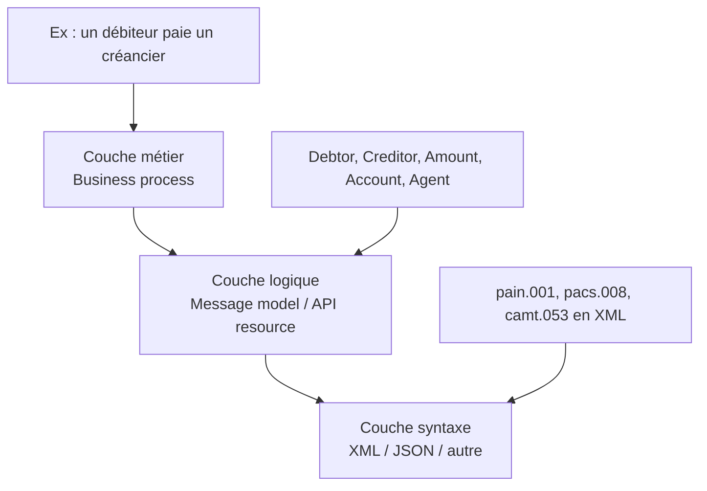

## 2.3 Syntaxe et sémantique

| Notion | Définition | Exemple |
|---|---|---|
| Syntaxe | Forme physique du message | XML, MT, JSON |
| Sémantique | Sens métier de la donnée | Debtor = celui qui paie |

Un message peut être techniquement lisible mais sémantiquement ambigu. ISO 20022 cherche à résoudre les deux problèmes :

- **comment écrire la donnée** ;
- **ce que signifie exactement cette donnée**.

## 2.4 Exemple de flux simple

### Instruction métier

ACME NV demande à sa banque ExampleBank de transférer 12 500 USD le 6 avril 2022 depuis son compte 8754219990.

### Représentation ISO 20022 simplifiée

```xml
<CdtTrfTxInf>
  <IntrBkSttlmAmt Ccy="USD">12500</IntrBkSttlmAmt>
  <IntrBkSttlmDt>2022-04-06</IntrBkSttlmDt>
  <Dbtr>
    <Nm>ACME NV</Nm>
    <PstlAdr>
      <StrtNm>Amstel</StrtNm>
      <BldgNb>344</BldgNb>
      <TwnNm>Amsterdam</TwnNm>
      <Ctry>NL</Ctry>
    </PstlAdr>
  </Dbtr>
  <DbtrAcct>
    <Id><Othr><Id>8754219990</Id></Othr></Id>
  </DbtrAcct>
  <DbtrAgt>
    <FinInstnId><BIC>EXABNL2U</BIC></FinInstnId>
  </DbtrAgt>
</CdtTrfTxInf>
```

## 2.5 Lecture métier de l’exemple

| Élément | Sens |
|---|---|
| `IntrBkSttlmAmt` | Montant de règlement interbancaire |
| `Ccy="USD"` | Devise |
| `IntrBkSttlmDt` | Date de règlement |
| `Dbtr` | Débiteur |
| `DbtrAcct` | Compte du débiteur |
| `DbtrAgt` | Banque du débiteur |
| `BIC` | Identifiant bancaire international |

---

# 3. Cartographie des flux de paiement

## 3.1 Les grandes familles de flux

| Famille | Description | Mode de traitement | Contraintes principales |
|---|---|---|---|
| SCT | SEPA Credit Transfer | Batch / différé | volume, J+1, fenêtres d’échange |
| SDD | SEPA Direct Debit | Batch / anticipé | mandats, rejets, retours |
| SCT Inst | SEPA Instant Credit Transfer | Temps réel | 10 secondes, 24/7/365 |
| Cross-border | Paiements internationaux | Correspondent banking | SWIFT, devises, conformité |
| Cash Management | Reporting de trésorerie | Relevés / notifications | camt, rapprochement |
| Trade Finance | Flux documentaires | Processus longs | dématérialisation, conformité |

## 3.2 Schéma global des flux paiements

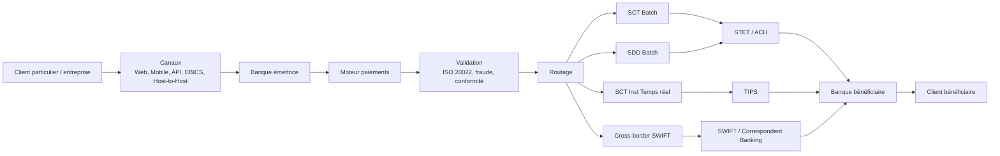

## 3.3 Les familles de messages ISO 20022 dans les paiements

| Famille | Usage | Exemple |
|---|---|---|
| pain | Payment Initiation | client → banque |
| pacs | Payments Clearing and Settlement | banque → banque |
| camt | Cash Management | relevés, notifications, investigations |
| remt | Remittance Advice | données de rapprochement |

## 3.4 Processus SCT classique

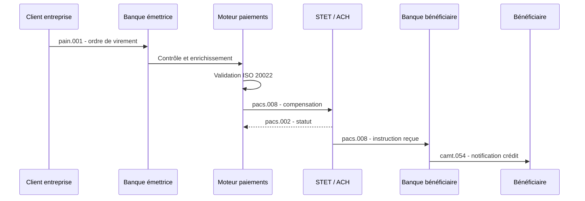

## 3.5 Processus SDD

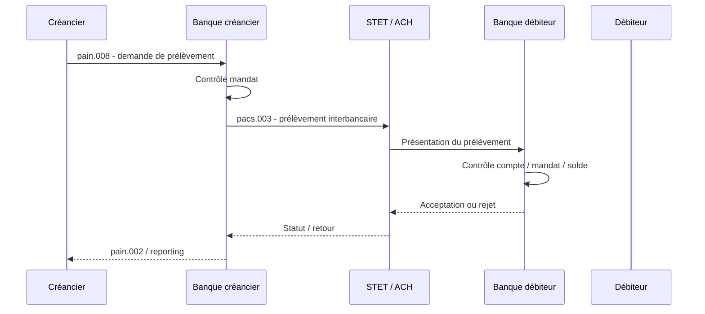

## 3.6 Processus SCT Inst

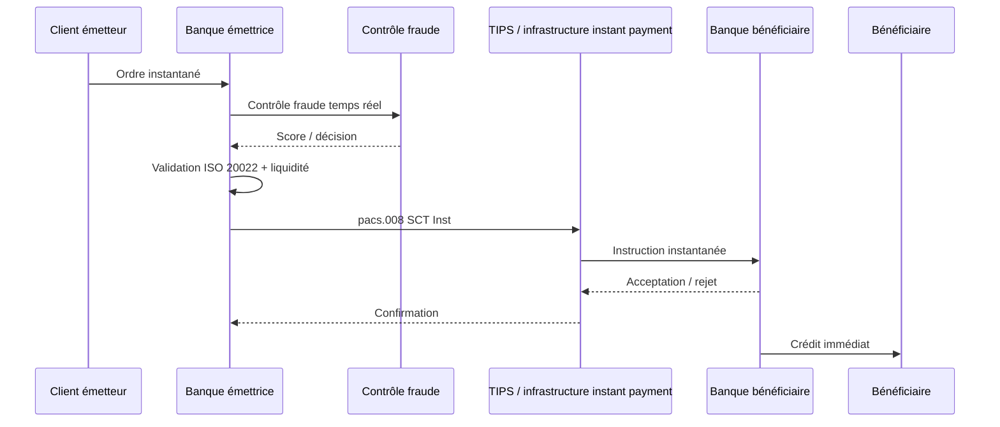

---

# 4. Coexistence MT / MX et migration ISO 20022

## 4.1 Ancien monde vs nouveau monde

| Dimension | Ancien monde MT / formats locaux | Monde ISO 20022 |
|---|---|---|
| Structure | compacte, tag/value | riche, hiérarchique, XML |
| Donnée | parfois ambiguë | structurée et sémantique |
| Validation | partielle ou spécifique | schémas et règles métier |
| Interopérabilité | coûteuse | facilitée par le modèle commun |
| Automatisation | limitée par qualité de donnée | STP amélioré |
| Carbone | messages légers mais retraitements | messages lourds mais moins d’erreurs |

## 4.2 Exemple MT103 vers ISO 20022

### MT103 simplifié

```text
:32A:06042022USD12500,
:50F:/8754219990
1/ACME NV.
2/AMSTEL 344
3/NL/AMSTERDAM
:52A:EXABNL2U
```

### Mapping ISO 20022

| MT | Sens | ISO 20022 |
|---|---|---|
| `:32A:` | Date, devise, montant | `IntrBkSttlmDt`, `IntrBkSttlmAmt` |
| `:50F:` | Donneur d’ordre | `Dbtr`, `DbtrAcct` |
| `:52A:` | Banque donneur d’ordre | `DbtrAgt` |

## 4.3 Schéma de mapping

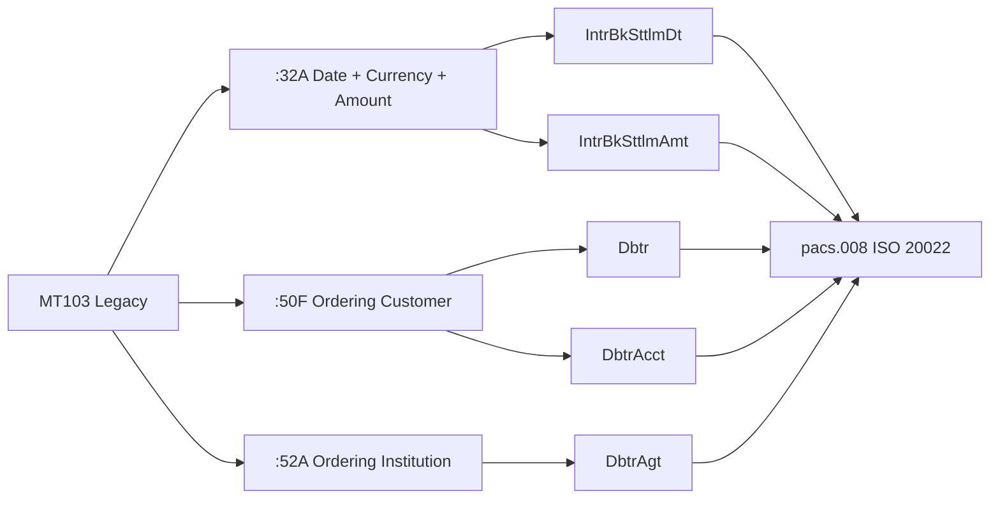

## 4.4 Rôle du middleware / EAI

Le middleware devient une couche stratégique.

Il assure :

- transformation MT/MX ;
- transformation formats internes/ISO ;
- validation XML ;
- enrichissement de données ;
- appels référentiels ;
- orchestration ;
- routage ;
- gestion des rejets ;
- journalisation ;
- exposition monitoring.

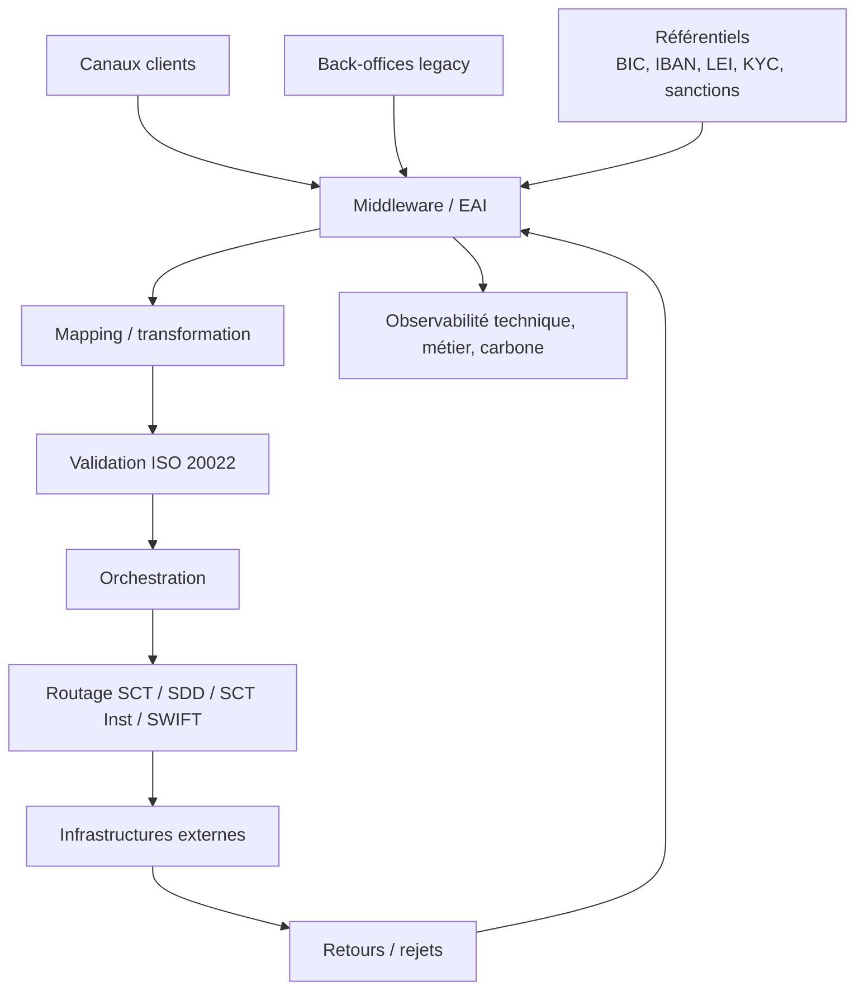

---

# 5. Impacts SI de la migration ISO 20022

## 5.1 Vue globale des impacts

| Couche SI | Impact principal |
|---|---|
| Canaux | Collecte de données plus structurées |
| Référentiels | Qualité BIC, IBAN, LEI, adresses, sanctions |
| Middleware | Mapping, validation, enrichissement, orchestration |
| Back-office | Adaptation des modèles de données |
| MFT / réseau | Fichiers plus volumineux |
| Monitoring | Nouveaux KPIs métier et techniques |
| Sécurité | Meilleur screening mais plus de données sensibles |
| Stockage | Hausse logs et messages si non maîtrisée |
| Exploitation | Nouvelles erreurs, nouveaux rejets, nouvelles procédures |

## 5.2 Organigramme fonctionnel cible

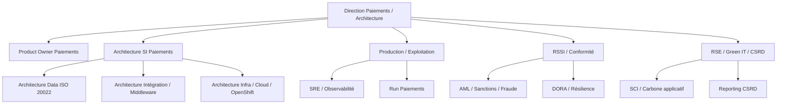

## 5.3 Urbanisation cible

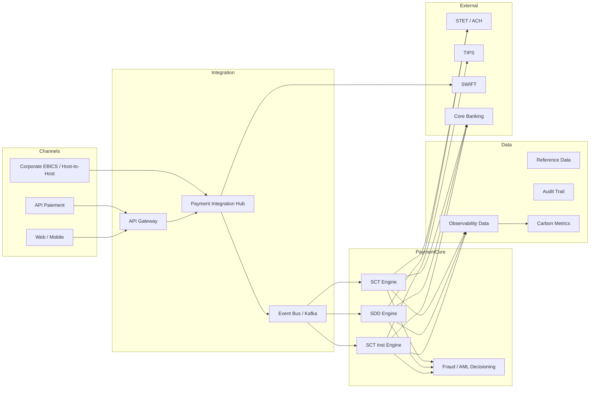

---

# 6. ISO 20022 et empreinte carbone : le paradoxe

## 6.1 Le risque technique

ISO 20022 utilise souvent XML. XML est plus verbeux que les anciens formats MT ou fichiers plats.

Conséquences possibles :

- plus de bande passante ;
- plus de stockage ;
- plus de CPU parsing ;
- plus de mémoire si parsing DOM ;
- plus de logs ;
- plus de coûts d’observabilité.

## 6.2 Le bénéfice systémique

Mais ISO 20022 permet :

- moins d’ambiguïtés ;
- meilleure validation amont ;
- meilleure qualité de données ;
- moins de rejets ;
- moins de retries ;
- moins de retraitements ;
- moins d’interventions manuelles ;
- meilleur STP.

## 6.3 Formule d’analyse

La bonne comparaison est :

```text
Empreinte totale = Taille message × Nombre de traitements × Coût CPU/réseau/stockage par traitement
```

ISO 20022 augmente potentiellement :

```text
Taille message ↑
```

mais peut réduire fortement :

```text
Nombre de traitements inutiles ↓↓↓
```

## 6.4 Schéma du paradoxe carbone

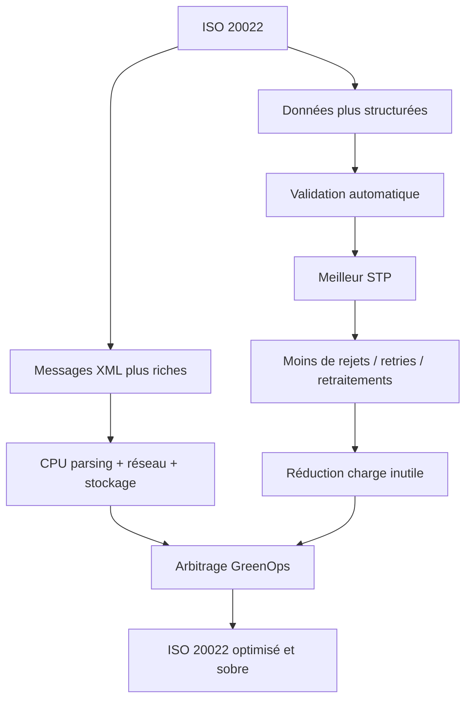

---

# 7. Modèle de chiffrage GreenOps

## 7.1 Indicateurs à mesurer

| Indicateur | Définition | Usage |
|---|---|---|
| Volume transactions | nombre de paiements traités | base de normalisation |
| Taille moyenne message | Ko/message | réseau + stockage |
| CPU par message | ms CPU/message | coût traitement |
| Taux rejet | % messages rejetés | qualité donnée |
| Taux retry | % messages retraités | gaspillage système |
| STP rate | % traitement automatique | efficacité opérationnelle |
| kWh applicatif | énergie consommée | mesure GreenOps |
| gCO2e/transaction | intensité carbone par paiement | pilotage CSRD/SCI |

## 7.2 Modèle SCI appliqué aux paiements

```text
SCI = ((E × I) + M) / R
```

Avec :

- **E** = énergie consommée en kWh ;
- **I** = intensité carbone de l’électricité en gCO2e/kWh ;
- **M** = part carbone matériel allouée ;
- **R** = unité fonctionnelle, par exemple 1 transaction de paiement.

## 7.3 Exemple chiffré simplifié

Hypothèses :

- 10 000 000 paiements / jour ;
- ancien format : 0,5 Ko/message ;
- ISO 20022 : 4 Ko/message ;
- ISO compressé : 1 Ko/message ;
- coût énergétique traitement moyen : 0,5 Wh / paiement nominal ;
- intensité carbone : 50 gCO2e/kWh.

### Scénario A — Legacy avec 2 % de rejets/retraitements

```text
Transactions utiles : 10 000 000
Retraitements : 200 000
Total traitements : 10 200 000
Énergie : 10 200 000 × 0,5 Wh = 5 100 kWh
Carbone : 5 100 × 50 = 255 000 gCO2e = 255 kgCO2e/jour
```

### Scénario B — ISO 20022 non optimisé avec 0,5 % de rejets

```text
Transactions utiles : 10 000 000
Retraitements : 50 000
Total traitements : 10 050 000
Énergie traitement : 5 025 kWh
Surcoût parsing/réseau estimé : +8 %
Énergie totale : 5 427 kWh
Carbone : 271 kgCO2e/jour
```

### Scénario C — ISO 20022 optimisé avec 0,2 % de rejets

```text
Transactions utiles : 10 000 000
Retraitements : 20 000
Total traitements : 10 020 000
Énergie traitement : 5 010 kWh
Optimisations parsing/compression/logs : -12 %
Énergie totale : 4 409 kWh
Carbone : 220 kgCO2e/jour
```

## 7.4 Lecture du chiffrage

| Scénario | Énergie/jour | Carbone/jour | Lecture |
|---|---:|---:|---|
| Legacy | 5 100 kWh | 255 kgCO2e | message léger mais erreurs nombreuses |
| ISO non optimisé | 5 427 kWh | 271 kgCO2e | risque réel de surconsommation |
| ISO optimisé | 4 409 kWh | 220 kgCO2e | cible GreenOps |

Conclusion : ISO 20022 mal implémenté peut augmenter l’empreinte. ISO 20022 bien implémenté peut la réduire.

---

# 8. Leviers de réduction carbone

## 8.1 Leviers prioritaires

| Levier | Effet attendu | Complexité |
|---|---|---|
| Parsing streaming SAX/StAX | baisse mémoire/CPU | moyenne |
| Compression flux XML | baisse réseau/stockage | faible à moyenne |
| Validation amont | baisse rejets | moyenne |
| Idempotency key | baisse doublons/retries | moyenne |
| Circuit breaker | protection système | moyenne |
| Backoff exponentiel | baisse tempêtes de retry | faible |
| Logs sobres | baisse stockage | faible |
| Suppression batchs redondants | baisse CPU | moyenne |
| Scheduling carbon-aware | baisse carbone à énergie égale | moyenne |
| Archivage froid | baisse stockage chaud | faible |

## 8.2 Processus d’optimisation GreenOps

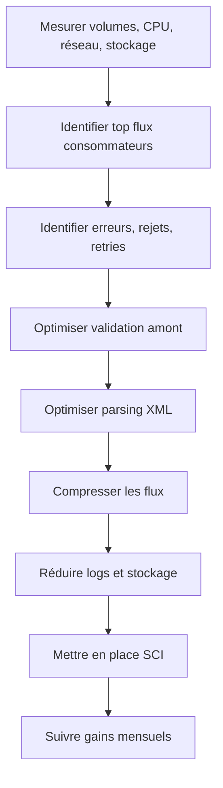

## 8.3 Exemple : réduction des retries SCT Inst

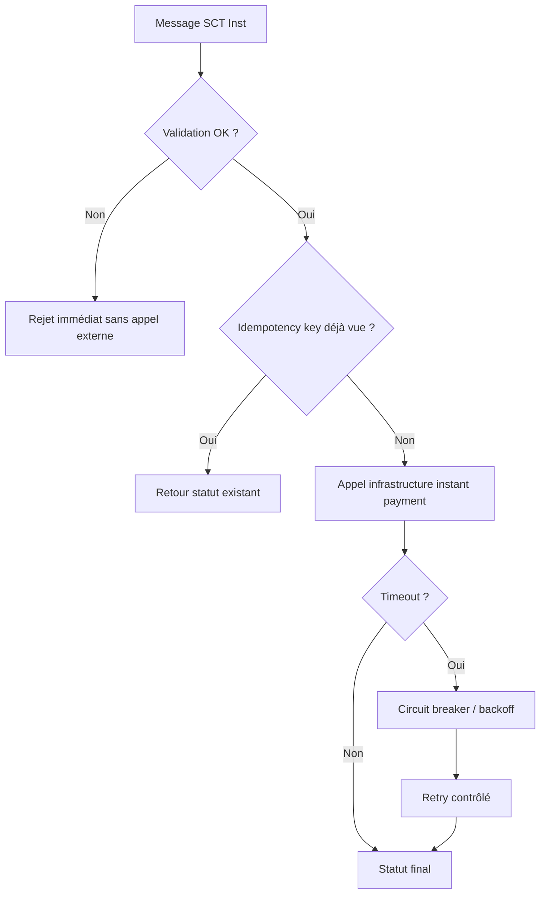

## 8.4 Exemple : logs sobres

| Mauvaise pratique | Bonne pratique |
|---|---|
| stocker tout le XML en clair à chaque étape | stocker ID, hash, statut, métadonnées |
| logs DEBUG permanents | DEBUG temporaire sur incident |
| dupliquer message dans 5 systèmes | centraliser audit trail |
| conserver chaud sans limite | politique de rétention chaude/froide |
| journaliser données sensibles | masquage / tokenisation |

---

# 9. Gouvernance cible

## 9.1 Comités recommandés

| Comité | Rôle | Fréquence |
|---|---|---|
| Comité Architecture Paiements | décisions HLD/LLD | mensuel |
| Comité ISO 20022 | versions, mappings, guidelines | bimensuel |
| Comité GreenOps Flux | carbone, SCI, optimisation | mensuel |
| Comité Résilience/DORA | risques, tests, incidents | mensuel |
| Comité Run Paiements | incidents, rejets, SLA | hebdomadaire |

## 9.2 RACI simplifié

| Activité | Métier Paiements | Architecture | Dev | Ops/SRE | Sécurité | Green IT |
|---|---|---|---|---|---|---|
| Définition flux | A | R | C | C | C | C |
| Mapping ISO | C | A/R | R | C | C | C |
| Validation schéma | C | R | A/R | C | C | I |
| Observabilité | C | R | R | A/R | C | R |
| SCI carbone | C | R | C | R | I | A/R |
| Tests DORA | C | R | C | A/R | A/R | I |
| Roadmap | A | A/R | C | C | C | C |

Légende : A = Accountable, R = Responsible, C = Consulted, I = Informed.

## 9.3 Organigramme de pilotage

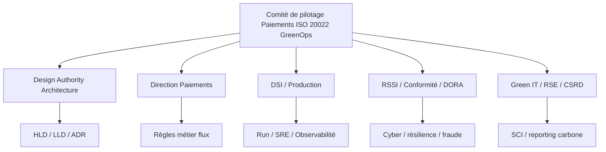

---

# 10. Architecture cible recommandée

## 10.1 Principes d’architecture

1. ISO 20022 comme modèle canonique cible.
2. Découplage entre formats externes et modèle interne.
3. Middleware/EAI comme point de contrôle maîtrisé.
4. Validation au plus tôt.
5. Idempotence sur tous les flux critiques.
6. Observabilité unifiée : technique, métier, carbone.
7. Résilience DORA by design.
8. Logs sobres, auditables et sécurisés.
9. Mesure SCI par flux.
10. Optimisation continue basée sur données réelles.

## 10.2 Architecture cible complète

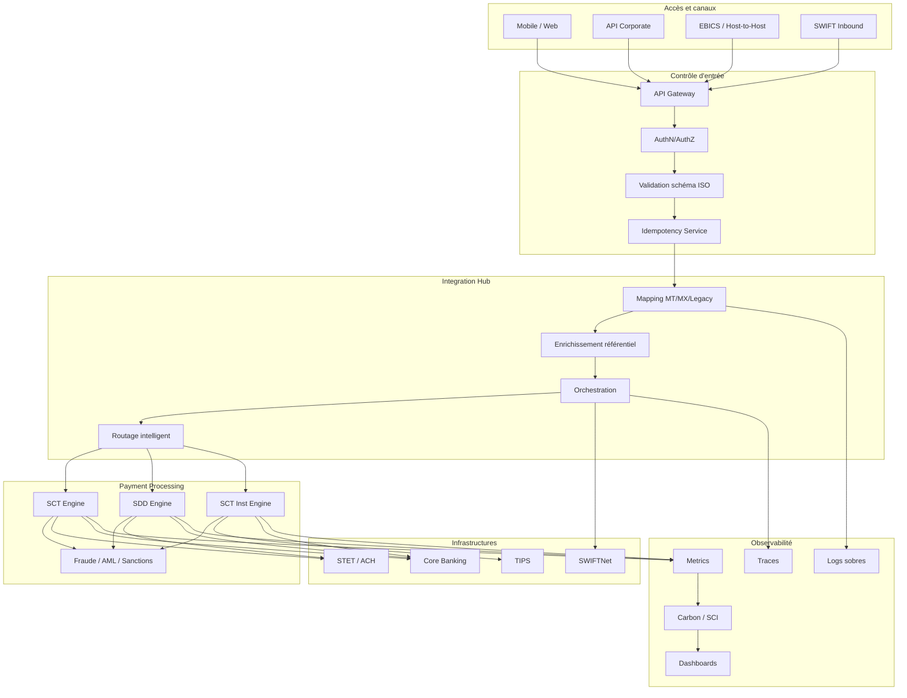

---

# 11. Roadmap 2026–2030

## 11.1 Phase 0 — Baseline et cadrage

Objectifs :

- cartographier les flux ;
- mesurer volumes, rejets, retries ;
- identifier les formats ;
- mesurer CPU, réseau, stockage ;
- définir les unités fonctionnelles SCI.

Livrables :

- cartographie applicative ;
- matrice flux/messages ;
- baseline carbone ;
- backlog quick wins ;
- risques DORA.

## 11.2 Phase 1 — Quick Wins

Actions :

- compression XML ;
- logs sobres ;
- suppression batchs redondants ;
- validation amont ;
- backoff retry ;
- premiers dashboards STP/rejets/carbone.

## 11.3 Phase 2 — Industrialisation ISO 20022

Actions :

- rationalisation mapping ;
- modèle canonique ;
- référentiels enrichis ;
- tests automatisés de messages ;
- observabilité bout-en-bout ;
- gouvernance versions ISO.

## 11.4 Phase 3 — Résilience et temps réel

Actions :

- durcissement SCT Inst ;
- idempotence généralisée ;
- circuit breakers ;
- tests DORA ;
- monitoring liquidité ;
- architecture active-active optimisée.

## 11.5 Phase 4 — GreenOps avancé

Actions :

- SCI par flux ;
- scheduling carbon-aware ;
- FinOps + GreenOps ;
- optimisation continue ;
- reporting CSRD ;
- arbitrage coût/performance/carbone.

## 11.6 Roadmap synthétique

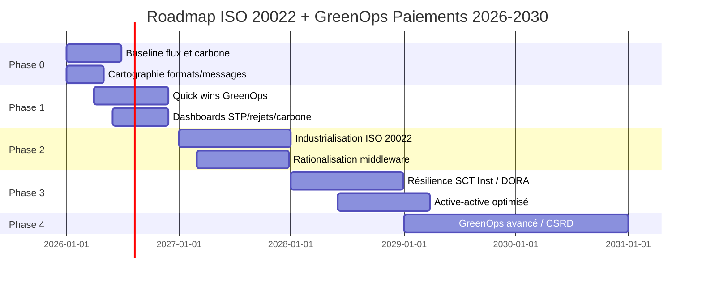

---

# 12. KPIs de pilotage

## 12.1 KPIs métier

| KPI | Objectif |
|---|---|
| Volume SCT / SDD / SCT Inst | suivre croissance et saisonnalité |
| Taux STP | mesurer automatisation |
| Taux rejet | mesurer qualité donnée |
| Taux retry | mesurer gaspillage système |
| Latence P95/P99 SCT Inst | garantir SLA temps réel |
| Nombre incidents majeurs | résilience opérationnelle |

## 12.2 KPIs techniques

| KPI | Objectif |
|---|---|
| CPU/message | efficacité traitement |
| Mémoire/parser | efficacité XML |
| Taille message moyenne | réseau/stockage |
| Volume logs/jour | sobriété observabilité |
| Taux compression | efficacité transfert |
| Temps validation XML | performance middleware |

## 12.3 KPIs GreenOps

| KPI | Objectif |
|---|---|
| kWh/jour par flux | mesure énergie |
| gCO2e/transaction | SCI paiement |
| gCO2e/1000 paiements | reporting lisible |
| carbone évité par suppression retries | bénéfices quick wins |
| stockage chaud évité | sobriété data |
| part traitements carbon-aware | pilotage batch |

---

# 13. Risques et points de vigilance

| Risque | Description | Mitigation |
|---|---|---|
| Surconsommation XML | messages volumineux, parsing lourd | streaming parser, compression |
| Mapping spaghetti | transformations multiples | modèle canonique ISO |
| Rejets massifs | mauvaise qualité données | validation amont, référentiels |
| Retry storm | timeouts SCT Inst | circuit breaker, idempotence |
| Logs excessifs | stockage massif | politique de logs sobres |
| Non-conformité DORA | changement non qualifié | gouvernance résilience |
| Mauvaise mesure carbone | KPI non fiables | méthode SCI auditable |
| Résistance organisationnelle | silos métiers/IT/RSE | gouvernance transverse |

---

# 14. Livrables recommandés

## 14.1 Dossier architecture

- Vision stratégique.
- HLD paiements ISO 20022.
- LLD middleware/mapping.
- LLD observabilité.
- LLD GreenOps/SCI.
- ADRs clés.

## 14.2 Dossier exploitation

- Runbook SCT.
- Runbook SDD.
- Runbook SCT Inst.
- Runbook rejets/retries.
- Runbook incident DORA.
- Runbook monitoring carbone.

## 14.3 Dossier gouvernance

- RACI.
- comitologie.
- backlog GreenOps.
- roadmap 2026-2030.
- matrice risques.
- modèle reporting COMEX.

## 14.4 Dossier mesure

- baseline carbone.
- modèle SCI.
- dictionnaire KPIs.
- dashboard cible.
- méthode de calcul.
- preuves d’audit.

---

# 15. Conclusion

La transformation ISO 20022 des flux de paiement doit être comprise comme une modernisation profonde de la donnée financière, de l’intégration SI, de l’exploitation et du pilotage carbone.

Le risque principal serait de traiter ISO 20022 comme une simple obligation de format. Cette approche produirait des messages plus lourds, des parsers plus coûteux et une complexité accrue.

La bonne approche consiste à faire d’ISO 20022 un levier de transformation :

- donnée plus propre ;
- validation plus précoce ;
- meilleur STP ;
- moins de rejets ;
- moins de retries ;
- meilleure observabilité ;
- meilleure conformité ;
- meilleure mesure carbone.

La cible stratégique est une plateforme de paiement structurée, résiliente, interopérable et sobre, capable de répondre aux exigences ISO 20022, DORA, CSRD et Instant Payment tout en réduisant progressivement son intensité carbone par transaction.

---

# 16. Annexes

## 16.1 Matrice messages paiements

| Flux | Message client-banque | Message banque-banque | Reporting |
|---|---|---|---|
| SCT | pain.001 | pacs.008 | camt.054 / camt.053 |
| SDD | pain.008 | pacs.003 | camt.054 / camt.053 |
| SCT Inst | pain.001 ou API | pacs.008 instant | camt / notification temps réel |
| Rejet | pain.002 | pacs.002 / pacs.004 | camt |
| Investigation | camt | camt | camt |

## 16.2 Check-list audit ISO 20022 + GreenOps

| Domaine | Question |
|---|---|
| Formats | Quels formats sont encore utilisés ? |
| Mapping | Combien de transformations successives ? |
| Validation | Les messages invalides sont-ils rejetés tôt ? |
| Référentiels | Les données BIC/IBAN/adresses sont-elles fiables ? |
| Parsing | DOM ou streaming ? |
| Réseau | Compression activée ? |
| Logs | Messages complets loggés ? |
| Rejets | Top 10 motifs connus ? |
| Retries | Politique contrôlée ? |
| Observabilité | STP, rejet, retry, latence mesurés ? |
| Carbone | SCI par flux disponible ? |
| DORA | Tests résilience réalisés ? |

## 16.3 Glossaire opérationnel

| Terme | Définition |
|---|---|
| ISO 20022 | Standard de données financières basé sur modèle métier commun |
| MT | Ancien format SWIFT |
| MX | Message XML souvent ISO 20022 |
| pain | Payment Initiation |
| pacs | Payments Clearing and Settlement |
| camt | Cash Management |
| SCT | Virement SEPA classique |
| SDD | Prélèvement SEPA |
| SCT Inst | Virement instantané SEPA |
| STP | Traitement automatisé bout-en-bout |
| EAI | Middleware d’intégration applicative |
| SCI | Software Carbon Intensity |
| Retry | Nouvelle tentative de traitement |
| Idempotence | Capacité à éviter les doublons lors d’un retry |
| DORA | Règlement européen sur la résilience opérationnelle numérique |
| CSRD | Directive européenne de reporting de durabilité |

